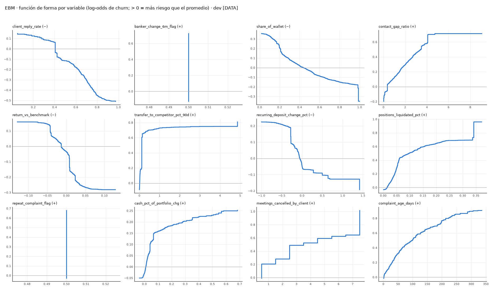
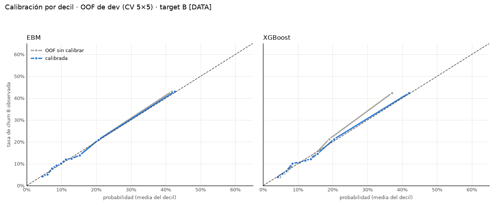

# Documento del modelo · Modelo 2 (ML) · churn propensity

Dataset sintético `client_pulse_synthetic.xlsx` (20,000 households, snapshot 2025-12-31) [DATA]. Marco MRM (SR 11-7 o
equivalente). Mismo target (B), split y holdout que el Modelo 1. Gates: [G0](gate_0.md) · [G1](gate_1.md) · [G2](gate_2.md) ·
[G3](gate_3.md) · [G4](gate_4.md). Versión ML 1.0.0 (`outputs/model/MANIFEST.json`).

## 1. Índice
1. [Paso 00 · Herencia y verificación](step00.md)
2. [Paso 01 · Conjunto de variables](step01.md)
3. [Paso 02 · Selección de variables](step02.md)
4. [Paso 03 · Algoritmo e hiperparámetros](step03.md)
5. [Paso 04 · Explicabilidad](step04.md)
6. [Paso 05 · Calibración](step05.md)
7. [Paso 06 · Escalamiento, tramos, salida](step06.md)
8. [Paso 07 · Robustez](step07.md)
9. [Paso 08 · Equidad](step08.md)
10. [Paso 09 · Validación y tabla H-2](step09.md)
11. [Paso 09b · Comparativa con A-lite](step09b.md)
12. [Paso 10 · Uso conjunto](step10.md)
13. [Paso 11 · Arquetipos y acción](step11.md)
14. [Paso 12 · Monitoreo y gobierno](step12.md)

## 2. Comparativa final [DATA]
|                                      | M1 · scorecard       | EBM (ML)                     | A-lite                    | XGBoost        |
|:-------------------------------------|:---------------------|:-----------------------------|:--------------------------|:---------------|
| Variables                            | 8                    | 12                           | 5                         | 12             |
| Forma                                | puntos por bin (WoE) | puntos por bin (EBM aditivo) | puntos por bin (WoE)      | árboles + SHAP |
| Gini · val completo (5,779)          | 0.390                | 0.406                        | — (70% en su desarrollo)  | 0.403          |
| PR-AUC · val completo                | 0.328                | 0.343                        | —                         | 0.344          |
| PR-AUC · subconjunto justo (1,737)   | 0.304                | 0.305                        | 0.262                     | 0.297          |
| Precisión top 5% · justo             | 49.4%                | 49.4%                        | 40.2%                     | 46.0%          |
| Criterios H-2 de reemplazo cumplidos | — (referencia)       | 6 de 8                       | no evaluado (otro target) | 4 de 8         |
| Razones por cliente estables (top 1) | 91.7% (M1 paso 11)   | 85.0%                        | —                         | 81.5%          |
| Rol recomendado                      | modelo operativo     | challenger en monitoreo      | comunicación ejecutiva    | retirado       |

- Recomendación: el M1 sigue como modelo operativo (el EBM mejora +0.015 de PR-AUC en val, por debajo del umbral de
  reemplazo, y no agrega en uso conjunto a igual capacidad); el EBM queda como challenger en monitoreo; A-lite como
  versión para comunicación ejecutiva (detecta menos: −0.04 de PR-AUC). La regla de prioridad (tramo primero vs p×RV)
  cambia más la captura de valor que el modelo (D10.1).

## 3. KPIs y disparadores
| dimensión                  | KPI                                                           | línea base [DATA]                   | umbral / acción [DEF]                                                        | frecuencia   |
|:---------------------------|:--------------------------------------------------------------|:------------------------------------|:-----------------------------------------------------------------------------|:-------------|
| Challenger vs operativo    | ΔPR-AUC EBM − M1 en cada snapshot con resultados              | +0.015 (val)                        | ≥ +0.03 sostenido en 2 ciclos ⟹ reabrir la decisión de reemplazo (tabla H-2) | semestral    |
| Discriminación EBM         | Gini                                                          | 0.406                               | caída > 15% relativo ⟹ redesarrollo                                          | mensual      |
| Calibración EBM            | pendiente Platt b en el último snapshot con resultados        | 0.878 (val)                         | fuera de 0.8–1.2 dos ciclos ⟹ recalibración                                  | mensual      |
| Crítico EBM (G3-3)         | esperada vs observada en Crítico                              | 61.3% vs 53.3%                      | re-calibrar con el próximo snapshot; publicar la tasa observada              | mensual      |
| Estabilidad                | PSI dev→val por tramo                                         | 0.0008                              | > 0.25 sostenido ⟹ redesarrollo                                              | mensual      |
| Deriva de explicación      | participación de |f_j| por variable                           | ver step07_importance_stability.csv | cambio de puesto de las 3 primeras ⟹ revisión                                | trimestral   |
| Prioridad (hallazgo D10.1) | captura de RV de eventos al 10%: tramo primero vs p×RV global | 48.9% vs 58.8% (M1)                 | decisión de negocio; medir con el control 12.5% del M1                       | trimestral   |

## 4. Limitaciones
| id    | limitación                                                                                                                                                             |
|:------|:-----------------------------------------------------------------------------------------------------------------------------------------------------------------------|
| L1–L7 | Heredadas del M1: sin OOT; señales sin timestamps; compuestos sin regla; dataset sintético; UHNW pequeño; sin digital ni eventos de vida; causalidad no identificable. |
| L8    | El EBM sobrestima Crítico en val (61% esperado vs 53% observado); se corrige con el próximo snapshot (no se reusa val).                                                |
| L9    | A-lite se desarrolló con otro split y otro target: comparación justa solo en 1,737 hogares (IC amplios).                                                               |
| L10   | El paso 10 usa val después de validar: la elección entre reglas de uso conjunto tiene un leve optimismo (regla fijada antes, D10.1).                                   |
| L11   | La probabilidad del M1 fue calibrada sobre val (paso 14 del M1): su Brier y b en val le favorecen en la comparación.                                                   |

## 5. Qué cambiaría con datos reales y panel temporal
| con datos reales / panel   | qué cambiaría                                                                                                           |
|:---------------------------|:------------------------------------------------------------------------------------------------------------------------|
| Panel temporal             | OOT real y deriva mensual del challenger vs el operativo; la decisión de reemplazo se reabre con 2 ciclos de evidencia. |
| Más eventos                | con más eventos (o UHNW ≥ 100) el EBM podría usar interacciones de a pares sin perder estabilidad.                      |
| Resultado de la acción     | el control 12.5% en Alto permitiría separar predicción de efecto de la gestión (L7).                                    |
| Señales nuevas             | digital y eventos de vida: el desgaste silencioso (47.6% de los eventos) no tiene hoy señales que lo distingan.         |

## 6. Preguntas para el equipo de datos
- Las del M1 (regla de `multi_signal_count`, motivo de `churn_excluded`, definición de RV y `value_lost_6m`, fecha
  as-of de cada señal) siguen abiertas; el ML no las necesita (sin compuestos), salvo la fecha as-of (L2).

## 7. Registro de decisiones final

Memoria del proyecto. Nada se decide fuera de este archivo. Etiquetas: `[DATA]` del archivo · `[DEF]` fijado por el
usuario · `[DEF-default]` default aplicado.

## Estado
- Último paso completado: **12** · proyecto cerrado (ML 1.0.0) · G0–G4 cerrados (2026-09-29).
- Tests: 38 / 38 PASS (pasos 00–12).

## Parámetros vigentes
| Parámetro | Valor | Etiqueta |
|:--|:--|:--|
| SPEC | `docs/SPEC.md` aprobado por el usuario | [DEF] |
| Modelos anteriores | no se borran ni se modifican; se usan para comparar (test de sha256 en cada corrida) | [DEF] |
| Target, split, holdout | los de M1: target B (θ = 0.25), dev / val y CV 5×5 heredados | [DEF-default] I-1 |
| Compuestos | permitidos, con variante sin ellos; si ΔPR-AUC < 1 sd se elige sin compuestos | [DEF-default] I-2 |
| Monotonía | obligatoria por signo de negocio (G1-1 de M1); "?" libres | [DEF-default] I-3 |
| Algoritmos | XGBoost y LightGBM; EBM y RF solo referencia | [DEF-default] I-4 |
| Calibración | OOF cruzado en dev (holdout sin tocar) | [DEF-default] I-5 |
| Tramos | cortes propios por reglas H-3 + vista a igual % de hogares que M1 | [DEF-default] I-6 |
| Si no cumple H-2 | se evalúa como complemento (paso 10) | [DEF-default] I-7 |
| Proxy de edad | prueba diagnóstica en el paso 8 | [DEF-default] I-8 |
| Escala | S₀ = 600 @ 20:1, PDO = 40 (Factor 57.71, Offset 427.12) | [DEF] heredado de M1 |
| SEED | 42 | [DEF] |
| Candidato principal | EBM monotónico sin interacciones (aditivo); XGBoost segundo candidato hasta el paso 9 | [DEF-default] G1-1 |
| Variables | 12 sin compuestos (D2.2) | [DEF-default] G1-2 |
| Umbral de reemplazo | se sigue hasta validar, con foco en uso conjunto (paso 10) | [DEF-default] G1-3 |
| Overrides ML | cambio de banquero y queja escalada → Alto; transferencia a competidor fuera (D6.2) | [DEF-default] G2-1 |
| Cola de RV y UHNW | sin ajuste; monitoreo (como G3-2/G3-3 de M1) | [DEF-default] G2-2 |
| XGBoost | segundo candidato solo como comparación hasta el paso 9 | [DEF-default] G2-3 |
| Tramos ML | cortes propios H-3 + vista a igual % que M1 | [DEF-default] G2-4 |
| Uso conjunto | se evalúa en el paso 10 (el ML no reemplaza al M1) | [DEF-default] G3-1 |
| XGBoost | retirado tras el paso 9 (documentado; cumple 4 de 8 criterios H-2) | [DEF-default] G3-2 |
| Crítico del EBM | sobrestima en val: documentar, re-calibrar con el próximo snapshot con resultados; publicar tasa observada | [DEF-default] G3-3 |
| A-lite | incluido en la comparativa (paso 9b) y en el uso conjunto (paso 10) | [DEF] G3 |
| Roles finales | M1 operativo; EBM challenger en monitoreo; A-lite ejecutivo; XGBoost retirado | [DEF-default] G4-1 |
| Regla de prioridad p×RV | propuesta al negocio como piloto con el control 12.5% del M1 | [DEF-default] G4-2 |
| Versión | ML 1.0.0 cerrada; siguiente: Modelo 3 (redes neuronales) | [DEF-default] G4-3 |

## Decisiones
- **D0.1 · Herencia por copia.** 16 archivos de `churn_scorecard/` copiados a `data/inherited/` con sha256 idéntico al
  origen [DATA]; el raw se lee desde `churn_scorecard/data/raw/` (solo lectura).
- **D0.2 · Protección de modelos anteriores.** 130 archivos de `churn_scorecard/outputs/model/` y `scorecard/outputs/`
  registrados con sha256 en `data/inherited/previous_models_sha256.json`; `tests/test_step00.py` falla si alguno cambia
  o desaparece [DATA].

- **D1.1 · Duplicados por grupo.** La regla por pares encadenaba eliminaciones (se perdía toda la familia de salidas de
  AUM). Se usan grupos con |ρ| > 0.95 en todos sus pares (enlace completo), uno por grupo con mayor IV: salen 8
  (p. ej. `relationship_value` y `log_rv` frente a `aum`; variables `_peer` frente a su base); pool = 62 [DATA].
- **D2.1 · Eliminación hacia atrás con regla 1-SE.** "No caer más de 1 sd" se aplica como 1 error estándar de la
  diferencia pareada por fold (1 sd de los folds, ~0.02, permitiría quitar casi todo) [DEF-default].
- **D2.2 · Sin compuestos.** Con compuestos: 12 variables, PR-AUC CV 0.3584; sin compuestos: 12 variables, 0.3584;
  diferencia < 1 sd ⟹ variante sin compuestos (I-2) [DATA]. Variables: `banker_change_6m_flag`, `client_reply_rate`,
  `share_of_wallet`, `transfer_to_competitor_pct_90d`, `repeat_complaint_flag`, `contact_gap_ratio`,
  `recurring_deposit_change_pct`, `return_vs_benchmark`, `cash_pct_of_portfolio_chg`, `complaint_age_days`,
  `meetings_cancelled_by_client`, `positions_liquidated_pct`.

- **D3.1 · Algoritmo.** XGBoost (prof. 2, 110 árboles) PR-AUC CV 0.3630 vs LightGBM (prof. 3, 115 árboles) 0.3645;
  diferencia ≤ 1 sd (0.019) ⟹ el más simple: XGBoost [DATA]. 3 semillas estables (0.3629–0.3637). En los mismos 5
  folds de r1: campeón M1 0.3424, EBM 0.3645, RF 0.3570, XGBoost 0.3617, LightGBM 0.3647 [DATA].
- **D3.2 · Early stopping de LightGBM.** La primera corrida detenía LightGBM en 5 árboles (el early stopping miraba el
  logloss por defecto, que empeora con los pesos de clase; b = 13.6) [DATA]. Corregido a PR-AUC y paso 3 re-ejecutado;
  XGBoost no cambia.

- **D4.1 · Explicabilidad.** EBM: aditividad exacta (error 1.8e-15), 0 interacciones, 0 violaciones de monotonía;
  reason codes top 1 estables 85.0% (top 3 89.5%), signo coherente 100%. XGBoost: aditividad 1.1e-6, interacción global
  17.9% (4 variables > 20%, documentadas, sin restricción: es segundo candidato), top 1 81.5%, signo 100% [DATA]. Las 2
  variables principales en ambos: `client_reply_rate` y `banker_change_6m_flag` (como en M1).
- **D5.1 · Calibración (OOF de dev).** EBM Platt a = 0.050, b = 1.030; XGBoost a = 0.308, b = 1.151; isotónica no mejora
  en ninguno ⟹ Platt [DATA]. Igual que M1, el quintil superior de RV queda subestimado (Σ p·RV / Σ RV eventos 0.85 EBM,
  0.82 XGBoost) y UHNW también (14.2% vs 16.3% EBM) [DATA]: se aplica la decisión G3-2/G3-3 de M1 (monitoreo).
- **D6.1 · Tramos EBM.** Cortes H-3 propios: Crítico 4% · Alto 16% · Vigilancia 56% · Estable 24% de dev (score ≤ 444 /
  519 / 578); Crítico con tasa 60.0% vs 56.6% del M1 a igual tamaño (4%) [DATA]. Vista a igual % que M1 guardada para
  el paso 10.
- **D6.2 · Overrides.** Cambio de banquero y queja escalada → Alto (precisión de movidos 13.9% / 14.1%); transferencia a
  competidor ≥ 10% eliminada: el EBM ya la incorpora y los hogares que movería tienen 2.8% de churn [DATA].
- **D6.3 · Lookup compacto y redondeo.** 6,730 bins del EBM → 323 filas uniendo bins con los mismos puntos; el
  redondeo a enteros mueve el score hasta 3.6 puntos y la probabilidad hasta 1.4 pp [DATA].

- **D7.1 · Robustez.** Orden de importancias estable en 25 folds (las 3 primeras siempre en el mismo puesto); quitar
  `client_reply_rate` baja la PR-AUC CV de 0.3644 a 0.3602 [DATA]. Por subgrupo el EBM rinde como el M1; clientes con
  1–3 años y con historia < 24 meses quedan subestimados (16.1% real vs 14.3% estimado; 16.4% vs 14.1%) [DATA].
- **D8.1 · Equidad (diagnóstico).** Las 12 variables predicen el tercil de edad con AUC 0.633 (proxy débil; lectura
  < 0.60 / 0.60–0.70 / > 0.70 [DEF-default]); marcado Crítico+Alto proporcional al churn por tercil (ratio 1.80–1.92;
  dispersión 1.07 vs 1.09 del M1) [DATA].
- **D9.1 · Validación y H-2.** En val: EBM Gini 0.406 / PR-AUC 0.343 vs M1 0.390 / 0.328; ΔGini +0.016 (IC95 −0.000 a
  +0.030) y ΔPR-AUC +0.015 (IC95 −0.001 a +0.030) [DATA]. EBM cumple 6 de 8 criterios H-2: falla ΔGini ≥ 0.05 y ΔPR-AUC
  ≥ 0.03 ⟹ no reemplaza al M1; paso 10 evalúa uso conjunto (I-7). XGBoost falla 4 (incluye caída dev→val 12.7% vs 12.1%
  y signo 99.96%). EBM en Crítico sobrestima en val (61.3% esperado vs 53.3% observado, fuera de Wilson 90%); resto de
  tramos dentro [DATA]. Top 1% de EBM: precisión 75.9% vs 63.8% del M1 [DATA].

- **D9b.1 · Comparativa con A-lite (pedido del usuario).** A-lite (5 variables, target A, `scorecard/`) no se re-ajusta:
  se usan sus scores copiados con sha256. 4,042 de los 5,779 hogares B de val estaban en su desarrollo ⟹ comparación
  justa en los 1,737 fuera del desarrollo de todos (238 eventos B, 106 A) [DATA]. Target B: PR-AUC A-lite 0.262 vs M1
  0.304 vs EBM 0.305; EBM − A-lite +0.042 (IC95 +0.013 a +0.069), M1 − A-lite +0.041; EBM − M1 +0.001 (IC95 −0.028 a
  +0.030) [DATA]. Target A: EBM 0.209, M1 0.191, A-lite 0.153 [DATA]. A-lite captura algo más de RV de eventos en el top
  10% (21.4% vs 20.3% M1 y 19.6% EBM con B) [DATA]. Subconjunto pequeño: IC amplios.

- **D10.1 · Uso conjunto.** Acuerdo de tramo M1–EBM 82.9%; hogares Crítico/Alto solo del M1: 277 (tasa 16.3%); solo
  del EBM: 139 (13.0%) [DATA]. Lente política (tramo primero, luego p×RV), captura de RV de eventos al 10% de hogares:
  M1 48.9%, M1 + orden EBM 49.4%, M1 + alerta EBM 48.9%, EBM 48.0% ⟹ empate (< 1 pp) ⟹ M1 solo (regla previa) [DATA].
  Hallazgo: ordenar por p×RV global (sin tramo primero) captura ~59–61% del RV que se va al 10% con cualquier modelo, a
  cambio de menos eventos (18–21% vs 28%) [DATA]: la regla de prioridad pesa más que el modelo; es decisión de negocio.
  En el subconjunto justo A-lite: su política captura 24.9% del RV al 10% (Crítico+Alto de A-lite = 13% de hogares).

- **D11.1 · Arquetipos.** Asignación sin reajuste de los arquetipos del M1 a los 803 eventos B de val: relación
  desatendida 33.1%, salida activa 19.3%, desgaste silencioso 47.6% [DATA]. El EBM no detecta mejor a ninguno: Crítico+Alto
  −4.9 / −2.6 / −2.6 pp vs M1 (el EBM marca 25.6% de hogares en Crítico+Alto vs 28.0% del M1); en desgaste silencioso
  deja menos en Estable (20.7% vs 24.9%) pero no sube más a Crítico+Alto [DATA]. A-lite (justo) marca 10.9% del desgaste
  silencioso en Crítico+Alto (marca solo 13% de hogares) [DATA]. El desgaste silencioso sigue siendo el punto ciego común.

- **D12.1 · Rol y cierre.** M1 1.0.0 sigue operativo; EBM (ML 1.0.0) como challenger en monitoreo con reapertura de
  la decisión de reemplazo si ΔPR-AUC ≥ +0.03 dos ciclos; A-lite para comunicación ejecutiva; XGBoost retirado.
  Manifiesto con sha256; modelos anteriores verificados intactos (130 archivos) [DATA]. Limitaciones propias L8–L11.

## Limitaciones registradas
- Heredadas de M1: L1 sin OOT; L2 señales sin timestamps; L3 compuestos sin regla; L4 dataset sintético; L5 UHNW
  sub-representado; L6 sin dimensión digital ni eventos de vida; L7 causalidad no identificable.

## G0 · respuesta del usuario (2026-09-29)
- "usa defaults, sólo no borres los modelos anteriores que los vamos a usar para comparar" → I-1 a I-8 [DEF-default];
  protección de modelos anteriores [DEF] (D0.2).

## G1 · respuesta del usuario (2026-09-29)
- "usa defaults" → G1-1 a G1-3 [DEF-default].

## G2 · respuesta del usuario (2026-09-29)
- "usa defaults" → G2-1 a G2-4 [DEF-default].

## G3 · respuesta del usuario (2026-09-29)
- "me encanta, pero incluye en la comparativa A-lite" → G3-1 a G3-3 [DEF-default]; A-lite agregado (paso 9b, D9b.1).
- "sí documenta, y vamos al que sigue" → se documenta y se sigue al paso 10.

## G4 · respuesta del usuario (2026-09-29)
- "yes default" → G4-1 a G4-3 [DEF-default]. Versión ML 1.0.0 cerrada.

## Preguntas abiertas
- Ninguna con el usuario; las del equipo de datos en `reports/model_document.md` §6.

## Anexo · reportes de paso consolidados (0–11)
## Paso 0 · Herencia y verificación

### Objetivo
- Partir exactamente de los mismos datos, target, split y holdout que el Modelo 1, sin modificar nada del Modelo 1.

### Método
- Copia con sha256 de 16 archivos de `churn_scorecard/` a `data/inherited/` (nunca se mueven ni se reescriben).
- Huella sha256 de 130 archivos de modelos anteriores (`churn_scorecard/outputs/model/` y `scorecard/outputs/`);
  un test verifica en cada corrida que no cambiaron (pedido del usuario: se usan para comparar).
- Verificación de los hechos de la sección B del SPEC en los datos heredados y en el raw.

### Código
- `src/step00_inherit.py` · `tests/test_step00.py` · `step00_inherited.csv`, `step00_previous_models.csv`, `step00_facts.csv`,
  `step00_candidates.csv`.

### Resultados

#### Hechos verificados [DATA]
| hecho                                     | esperado (SPEC B)        | observado [DATA]            | coincide   |
|:------------------------------------------|:-------------------------|:----------------------------|:-----------|
| Filas / columnas raw                      | 20,000 / 62              | 20,000 / 62                 | True       |
| Target B: hogares / eventos / tasa        | 19,261 / 2,674 / 13.88%  | 19,261 / 2,674 / 13.88%     | True       |
| dev: hogares / B hogares / B eventos      | 13,631 / 13,482 / 1,871  | 13,631 / 13,482 / 1,871     | True       |
| val: hogares / B hogares / B eventos      | 5,842 / 5,779 / 803      | 5,842 / 5,779 / 803         | True       |
| dev ∩ val                                 | 0 hogares                | 0                           | True       |
| Folds CV 5×5 en dev                       | cv_r1..cv_r5 con 5 folds | 5, 5, 5, 5, 5               | True       |
| Campeón M1 · CV anidada Gini / PR-AUC     | 0.429 / 0.344            | 0.429 / 0.344               | True       |
| Campeón M1 · val Gini / PR-AUC            | 0.390 / 0.328            | 0.390 / 0.328               | True       |
| Missing estructural aum ⟺ sin inversiones | exacto                   | exacto                      | True       |
| Candidatas sin resultado / edad / buró    | 0 prohibidas             | 70 candidatas, 0 prohibidas | True       |
| Copias heredadas idénticas                | 16 de 16                 | 16 de 16                    | True       |

#### Archivos heredados [DATA]
| origen (churn_scorecard/)                | destino (data/inherited/)   |   bytes | copia idéntica   |
|:-----------------------------------------|:----------------------------|--------:|:-----------------|
| data/processed/features.parquet          | features.parquet            | 5317389 | True             |
| data/processed/dev.parquet               | dev.parquet                 | 2903988 | True             |
| data/processed/val.parquet               | val.parquet                 | 1247082 | True             |
| data/processed/step01_population.parquet | step01_population.parquet   |  163033 | True             |
| data/processed/step07_clusters.parquet   | step07_clusters.parquet     |  139711 | True             |
| data/processed/step11A_oof.parquet       | m1_champion_oof_r1.parquet  |  188527 | True             |
| data/processed/step12_scores.parquet     | m1_step12_scores.parquet    |  210660 | True             |
| outputs/scores/household_scores.csv      | m1_household_scores.csv     | 3743238 | True             |
| outputs/tables/step05_features.csv       | step05_features.csv         |    5985 | True             |
| outputs/tables/step06_univariate_B.csv   | step06_univariate_B.csv     |   14142 | True             |
| outputs/tables/step08_spearman.csv       | step08_spearman.csv         |   37575 | True             |
| outputs/tables/step09_iv_summary.csv     | step09_iv_summary.csv       |   10377 | True             |
| outputs/tables/step11A_cv_folds.csv      | m1_step11A_cv_folds.csv     |    4215 | True             |
| outputs/tables/step13_global.csv         | m1_step13_global.csv        |     775 | True             |
| outputs/tables/step14_platt.csv          | m1_step14_platt.csv         |     148 | True             |
| outputs/model/MANIFEST.json              | m1_MANIFEST.json            |    1713 | True             |

#### Modelos anteriores protegidos [DATA]
- 10 archivos de `churn_scorecard/outputs/model/` y 120 de `scorecard/outputs/`
  con su sha256 en `data/inherited/previous_models_sha256.json` (lista completa en `step00_previous_models.csv`).

#### Candidatas [DATA]
- 70 variables: 67 de M1 + 2 compuestos (I-2) + `cluster`.

### Tests
- `tests/test_step00.py` (ver pytest).

### Decisiones y preguntas abiertas
- D0.1–D0.2 y respuestas G0 en `reports/decision_log.md`.

## Paso 1 · Conjunto de variables

### Objetivo
- Dejar un pool de candidatas crudas sin constantes, sin fuga y sin duplicados casi exactos.

### Método
- Casi constante: valor modal (con NaN) ≥ 99%; fuga: AUC > 0.85 o IV > 0.50 (univariado B heredado); duplicado:
  grupos con |ρ Spearman| > 0.95 en todos sus pares (enlace completo) ⟹ queda el de mayor IV (D1.1). NaN nativo; `cluster` categórica; compuestos incluidos (I-2).

### Código
- `src/step01_features.py` · `tests/test_step01.py` · `step01_screen.csv`, `step01_duplicate_pairs.csv`, `step01_funnel.csv`.

### Resultados

#### Embudo [DATA]
| etapa                   |   variables |
|:------------------------|------------:|
| candidatas              |          70 |
| − casi constantes       |           0 |
| − fuga                  |           0 |
| − duplicados |ρ| > 0.95 |           8 |
| = pool                  |          62 |

- Verificación: 70 − 0 − 0 − 8 = 62 (sin solapes entre filtros: True) [DATA].

#### Grupos de duplicados [DATA]
|   grupo | se queda                      | sale                          |   Spearman con la que queda |
|--------:|:------------------------------|:------------------------------|----------------------------:|
|      12 | new_external_destinations_90d | competitor_x_new_destinations |                       0.966 |
|      18 | aum_outflow_pct_90d           | aum_outflow_90d               |                       0.979 |
|      18 | aum_outflow_pct_90d           | aum_outflow_pct_90d_peer      |                       1.000 |
|      23 | net_deposit_flow_pct_90d      | net_deposit_flow_pct_90d_peer |                       1.000 |
|      30 | aum_share                     | deposit_share                 |                      -1.000 |
|      39 | contact_gap_ratio             | contact_gap_ratio_peer        |                       0.998 |
|      53 | aum                           | relationship_value            |                       0.966 |
|      53 | aum                           | log_rv                        |                       0.966 |

#### Cribado completo [DATA]
| variable                                          |   modal % |   % missing |    IV |   AUC univariada | signo      | f1 casi constante   | f2 fuga   | f3 duplicado |ρ| > 0.95   | pasa   |
|:--------------------------------------------------|----------:|------------:|------:|-----------------:|:-----------|:--------------------|:----------|:--------------------------|:-------|
| segment_uhnw                                      |    94.430 |       0.000 | 0.002 |            0.506 | ?          | False               | False     | False                     | True   |
| relationship_value                                |     0.007 |       0.000 | 0.005 |            0.504 | ?          | False               | False     | True                      | False  |
| deposit_balance                                   |     0.007 |       0.000 | 0.003 |            0.502 | ?          | False               | False     | False                     | True   |
| aum                                               |    14.256 |      14.256 | 0.011 |            0.505 | ?          | False               | False     | False                     | True   |
| has_investments                                   |    85.744 |       0.000 | 0.001 |            0.506 | −          | False               | False     | False                     | True   |
| has_advisory                                      |    60.295 |       0.000 | 0.000 |            0.501 | −          | False               | False     | False                     | True   |
| has_linked_business                               |    73.706 |       0.000 | 0.000 |            0.501 | −          | False               | False     | False                     | True   |
| has_trust                                         |    68.209 |       0.000 | 0.000 |            0.501 | −          | False               | False     | False                     | True   |
| has_credit_anchor                                 |    65.895 |       0.000 | 0.002 |            0.509 | −          | False               | False     | False                     | True   |
| has_payroll_stream                                |    53.976 |       0.000 | 0.000 |            0.500 | −          | False               | False     | False                     | True   |
| has_pension_stream                                |    65.665 |       0.000 | 0.000 |            0.501 | −          | False               | False     | False                     | True   |
| has_dividend_stream                               |    52.974 |       0.000 | 0.002 |            0.511 | −          | False               | False     | False                     | True   |
| tenure_years                                      |     0.156 |       0.000 | 0.012 |            0.530 | −          | False               | False     | False                     | True   |
| history_months                                    |    94.852 |       0.000 | 0.006 |            0.505 | ?          | False               | False     | False                     | True   |
| recurring_income_monthly                          |     6.460 |       0.000 | 0.008 |            0.509 | ?          | False               | False     | False                     | True   |
| aum_outflow_pct_90d                               |    48.531 |      14.256 | 0.137 |            0.571 | +          | False               | False     | False                     | True   |
| deposit_balance_change_pct_90d                    |     0.030 |       0.030 | 0.138 |            0.576 | −          | False               | False     | False                     | True   |
| salary_deposit_stopped_flag                       |    51.113 |      47.070 | 0.122 |            0.529 | +          | False               | False     | False                     | True   |
| recurring_deposit_stopped_flag                    |    89.482 |       6.705 | 0.144 |            0.545 | +          | False               | False     | False                     | True   |
| recurring_deposit_change_pct                      |     6.772 |       6.772 | 0.099 |            0.563 | −          | False               | False     | False                     | True   |
| net_deposit_flow_pct_90d                          |     0.030 |       0.030 | 0.149 |            0.580 | −          | False               | False     | False                     | True   |
| external_transfer_pct_of_balance_60d              |     0.045 |       0.000 | 0.191 |            0.582 | +          | False               | False     | False                     | True   |
| new_external_destinations_90d                     |    92.694 |       1.498 | 0.160 |            0.555 | +          | False               | False     | False                     | True   |
| investment_redemption_pct                         |    40.743 |      14.256 | 0.123 |            0.572 | +          | False               | False     | False                     | True   |
| products_closed_180d                              |    90.484 |       0.000 | 0.217 |            0.561 | +          | False               | False     | False                     | True   |
| banker_change_6m_flag                             |    85.336 |       0.000 | 0.289 |            0.608 | +          | False               | False     | False                     | True   |
| contact_gap_ratio                                 |     3.123 |       0.000 | 0.131 |            0.602 | +          | False               | False     | False                     | True   |
| client_reply_rate                                 |    48.072 |      48.072 | 0.218 |            0.529 | −          | False               | False     | False                     | True   |
| complaint_escalated_flag                          |    94.704 |       0.000 | 0.093 |            0.540 | +          | False               | False     | False                     | True   |
| complaint_age_days                                |    96.588 |       0.000 | 0.033 |            0.528 | +          | False               | False     | False                     | True   |
| aum_vs_baseline_pct                               |    14.256 |      14.256 | 0.182 |            0.582 | −          | False               | False     | False                     | True   |
| deposit_balance_vs_6m_avg_pct                     |     0.037 |       0.037 | 0.178 |            0.585 | −          | False               | False     | False                     | True   |
| pension_deposit_stopped_flag                      |    66.007 |      66.007 | 0.050 |            0.511 | +          | False               | False     | False                     | True   |
| business_payroll_stopped_flag                     |    74.017 |      74.017 | 0.031 |            0.512 | +          | False               | False     | False                     | True   |
| transfer_to_competitor_pct_90d                    |    15.658 |       0.000 | 0.163 |            0.569 | +          | False               | False     | False                     | True   |
| external_transfer_acceleration                    |     0.022 |       0.000 | 0.128 |            0.515 | +          | False               | False     | False                     | True   |
| net_external_flow_pct_90d                         |     0.015 |       0.000 | 0.166 |            0.578 | −          | False               | False     | False                     | True   |
| external_destination_concentration                |    20.657 |       0.000 | 0.102 |            0.533 | +          | False               | False     | False                     | True   |
| outflow_vs_baseline_pct                           |     1.899 |       0.000 | 0.055 |            0.529 | +          | False               | False     | False                     | True   |
| fixed_income_maturity_not_reinvested              |    74.054 |      74.054 | 0.044 |            0.534 | +          | False               | False     | False                     | True   |
| cash_pct_of_portfolio_chg                         |    14.256 |      14.256 | 0.090 |            0.548 | +          | False               | False     | False                     | True   |
| return_vs_benchmark                               |    39.705 |      39.705 | 0.057 |            0.560 | −          | False               | False     | False                     | True   |
| accounts_closed_90d                               |    85.410 |       0.000 | 0.061 |            0.540 | +          | False               | False     | False                     | True   |
| share_of_wallet                                   |     5.926 |       0.000 | 0.173 |            0.610 | −          | False               | False     | False                     | True   |
| share_of_wallet_change                            |     4.065 |       0.000 | 0.131 |            0.584 | −          | False               | False     | False                     | True   |
| trustee_change_flag                               |    68.209 |      68.209 | 0.038 |            0.513 | +          | False               | False     | False                     | True   |
| repeat_complaint_flag                             |    96.254 |       0.000 | 0.097 |            0.536 | +          | False               | False     | False                     | True   |
| positions_liquidated_pct                          |    74.789 |      14.256 | 0.083 |            0.548 | +          | False               | False     | False                     | True   |
| meetings_cancelled_by_client                      |    61.015 |      61.015 | 0.066 |            0.537 | +          | False               | False     | False                     | True   |
| relationship_dissatisfaction_flag                 |    70.257 |      70.257 | 0.027 |            0.511 | +          | False               | False     | False                     | True   |
| aum_outflow_90d                                   |    48.531 |      14.256 | 0.135 |            0.571 | +          | False               | False     | True                      | False  |
| transfer_to_competitor_bank_amount_90d            |    15.658 |       0.000 | 0.173 |            0.571 | +          | False               | False     | False                     | True   |
| log_rv                                            |     0.007 |       0.000 | 0.005 |            0.504 | ?          | False               | False     | True                      | False  |
| aum_share                                         |    14.256 |       0.000 | 0.003 |            0.510 | ?          | False               | False     | False                     | True   |
| deposit_share                                     |    14.256 |       0.000 | 0.003 |            0.510 | ?          | False               | False     | True                      | False  |
| streams_stopped_count                             |    94.838 |       0.000 | 0.200 |            0.556 | +          | False               | False     | False                     | True   |
| n_streams_eligible                                |    62.061 |       0.000 | 0.003 |            0.500 | −          | False               | False     | False                     | True   |
| n_products_held                                   |    29.372 |       0.000 | 0.005 |            0.504 | −          | False               | False     | False                     | True   |
| outflow_x_contact_gap                             |    63.848 |       0.000 | 0.161 |            0.580 | +          | False               | False     | False                     | True   |
| competitor_x_new_destinations                     |    93.057 |       1.498 | 0.112 |            0.555 | +          | False               | False     | True                      | False  |
| ind_sin_dato_client_reply_rate                    |    51.928 |       0.000 | 0.160 |            0.599 | +          | False               | False     | False                     | True   |
| ind_sin_dato_meetings_cancelled_by_client         |    61.015 |       0.000 | 0.008 |            0.521 | ?          | False               | False     | False                     | True   |
| ind_sin_dato_relationship_dissatisfaction_flag    |    70.257 |       0.000 | 0.000 |            0.501 | ?          | False               | False     | False                     | True   |
| ind_sin_dato_fixed_income_maturity_not_reinvested |    74.054 |       0.000 | 0.001 |            0.508 | ?          | False               | False     | False                     | True   |
| aum_outflow_pct_90d_peer                          |    48.531 |      14.256 | 0.137 |            0.571 | +          | False               | False     | True                      | False  |
| net_deposit_flow_pct_90d_peer                     |     0.037 |       0.030 | 0.148 |            0.580 | −          | False               | False     | True                      | False  |
| contact_gap_ratio_peer                            |     1.943 |       0.000 | 0.131 |            0.602 | +          | False               | False     | True                      | False  |
| multi_signal_flag                                 |    76.317 |       0.000 | 0.252 |            0.615 | +          | False               | False     | False                     | True   |
| multi_signal_count                                |    32.213 |       0.000 | 0.463 |            0.659 | +          | False               | False     | False                     | True   |
| cluster                                           |    52.885 |       0.000 | 0.003 |          nan     | categórica | False               | False     | False                     | True   |

### Tests
- `tests/test_step01.py` (ver pytest).

### Decisiones y preguntas abiertas
- D1.1 en `reports/decision_log.md`.

## Paso 2 · Selección de variables

### Objetivo
- Quedarse con las variables que aportan de forma estable al ML y decidir si entran los compuestos (I-2).

### Método
- Permutation importance OOF en los 25 folds (GBM base monotónico, prof. 3); pasa si ΔPR-AUC > 0 en ≥ 80% de los folds.
- Eliminación hacia atrás (menor importancia primero): se acepta quitar si la PR-AUC CV no cae más de 1 error estándar
  de la diferencia pareada (D2.1); mínimo 12 variables.
- Variante sin compuestos elegida si la diferencia de PR-AUC < 1 sd de los folds [DEF-default I-2].

### Código
- `src/step02_selection.py` · `tests/test_step02.py` · `step02_permutation.csv`, `step02_backward.csv`, `step02_variants.csv`.

### Resultados

#### Variantes [DATA]
| variante       |   variables |   PR-AUC CV media |   sd folds | elegida   | variables seleccionadas                                                                                                                                                                                                                                                                                                |
|:---------------|------------:|------------------:|-----------:|:----------|:-----------------------------------------------------------------------------------------------------------------------------------------------------------------------------------------------------------------------------------------------------------------------------------------------------------------------|
| con compuestos |          12 |            0.3584 |     0.0198 | False     | banker_change_6m_flag, client_reply_rate, share_of_wallet, repeat_complaint_flag, contact_gap_ratio, recurring_deposit_change_pct, cash_pct_of_portfolio_chg, complaint_age_days, meetings_cancelled_by_client, complaint_escalated_flag, fixed_income_maturity_not_reinvested, transfer_to_competitor_bank_amount_90d |
| sin compuestos |          12 |            0.3584 |     0.0195 | True      | banker_change_6m_flag, client_reply_rate, share_of_wallet, transfer_to_competitor_pct_90d, repeat_complaint_flag, contact_gap_ratio, recurring_deposit_change_pct, return_vs_benchmark, cash_pct_of_portfolio_chg, complaint_age_days, meetings_cancelled_by_client, positions_liquidated_pct                          |

- Diferencia con − sin compuestos: +0.0000 vs 1 sd = 0.0198 ⟹ **sin compuestos** [DATA].

#### Eliminación hacia atrás [DATA]
| variante       |   paso | quita                                  |   variables |   PR-AUC CV |   Δ vs actual |     1-SE | acepta   |
|:---------------|-------:|:---------------------------------------|------------:|------------:|--------------:|---------:|:---------|
| con compuestos |      0 | —                                      |          18 |      0.3590 |        0.0000 | nan      | True     |
| con compuestos |      1 | transfer_to_competitor_bank_amount_90d |          17 |      0.3585 |       -0.0005 |   0.0004 | False    |
| con compuestos |      2 | outflow_x_contact_gap                  |          17 |      0.3590 |        0.0001 |   0.0006 | True     |
| con compuestos |      3 | positions_liquidated_pct               |          16 |      0.3589 |       -0.0001 |   0.0005 | True     |
| con compuestos |      4 | multi_signal_flag                      |          15 |      0.3586 |       -0.0003 |   0.0003 | True     |
| con compuestos |      5 | fixed_income_maturity_not_reinvested   |          14 |      0.3572 |       -0.0014 |   0.0005 | False    |
| con compuestos |      6 | complaint_escalated_flag               |          14 |      0.3581 |       -0.0005 |   0.0005 | False    |
| con compuestos |      7 | meetings_cancelled_by_client           |          14 |      0.3571 |       -0.0015 |   0.0008 | False    |
| con compuestos |      8 | complaint_age_days                     |          14 |      0.3577 |       -0.0009 |   0.0007 | False    |
| con compuestos |      9 | return_vs_benchmark                    |          14 |      0.3590 |        0.0004 |   0.0006 | True     |
| con compuestos |     10 | cash_pct_of_portfolio_chg              |          13 |      0.3579 |       -0.0010 |   0.0009 | False    |
| con compuestos |     11 | transfer_to_competitor_pct_90d         |          13 |      0.3586 |       -0.0003 |   0.0005 | True     |
| con compuestos |     12 | recurring_deposit_change_pct           |          12 |      0.3555 |       -0.0032 |   0.0009 | False    |
| con compuestos |     13 | contact_gap_ratio                      |          12 |      0.3567 |       -0.0020 |   0.0008 | False    |
| con compuestos |     14 | repeat_complaint_flag                  |          12 |      0.3559 |       -0.0028 |   0.0006 | False    |
| con compuestos |     15 | share_of_wallet                        |          12 |      0.3577 |       -0.0009 |   0.0007 | False    |
| con compuestos |     16 | multi_signal_count                     |          12 |      0.3584 |       -0.0002 |   0.0006 | True     |
| sin compuestos |      0 | —                                      |          14 |      0.3588 |        0.0000 | nan      | True     |
| sin compuestos |      1 | fixed_income_maturity_not_reinvested   |          13 |      0.3585 |       -0.0002 |   0.0005 | True     |
| sin compuestos |      2 | positions_liquidated_pct               |          12 |      0.3578 |       -0.0007 |   0.0006 | False    |
| sin compuestos |      3 | complaint_escalated_flag               |          12 |      0.3584 |       -0.0001 |   0.0004 | True     |

#### Permutation importance [DATA]
| variante       | variable                                          |   ΔPR-AUC medio |   % folds > 0 | pasa (≥ 80% folds)   |
|:---------------|:--------------------------------------------------|----------------:|--------------:|:---------------------|
| con compuestos | banker_change_6m_flag                             |          0.0343 |      100.0000 | True                 |
| con compuestos | client_reply_rate                                 |          0.0135 |      100.0000 | True                 |
| con compuestos | multi_signal_count                                |          0.0067 |       96.0000 | True                 |
| con compuestos | share_of_wallet                                   |          0.0057 |      100.0000 | True                 |
| con compuestos | repeat_complaint_flag                             |          0.0048 |       96.0000 | True                 |
| con compuestos | contact_gap_ratio                                 |          0.0044 |       92.0000 | True                 |
| con compuestos | recurring_deposit_change_pct                      |          0.0032 |       84.0000 | True                 |
| con compuestos | transfer_to_competitor_pct_90d                    |          0.0032 |       96.0000 | True                 |
| con compuestos | cash_pct_of_portfolio_chg                         |          0.0027 |       88.0000 | True                 |
| con compuestos | return_vs_benchmark                               |          0.0025 |       80.0000 | True                 |
| con compuestos | complaint_age_days                                |          0.0023 |       80.0000 | True                 |
| con compuestos | meetings_cancelled_by_client                      |          0.0022 |       84.0000 | True                 |
| con compuestos | streams_stopped_count                             |          0.0020 |       76.0000 | False                |
| con compuestos | complaint_escalated_flag                          |          0.0016 |       84.0000 | True                 |
| con compuestos | tenure_years                                      |          0.0015 |       72.0000 | False                |
| con compuestos | fixed_income_maturity_not_reinvested              |          0.0014 |       80.0000 | True                 |
| con compuestos | multi_signal_flag                                 |          0.0012 |       88.0000 | True                 |
| con compuestos | positions_liquidated_pct                          |          0.0012 |       88.0000 | True                 |
| con compuestos | outflow_x_contact_gap                             |          0.0011 |       80.0000 | True                 |
| con compuestos | external_transfer_pct_of_balance_60d              |          0.0009 |       68.0000 | False                |
| con compuestos | transfer_to_competitor_bank_amount_90d            |          0.0007 |       84.0000 | True                 |
| con compuestos | business_payroll_stopped_flag                     |          0.0003 |       72.0000 | False                |
| con compuestos | net_external_flow_pct_90d                         |          0.0003 |       76.0000 | False                |
| con compuestos | outflow_vs_baseline_pct                           |          0.0002 |       52.0000 | False                |
| con compuestos | investment_redemption_pct                         |          0.0002 |       60.0000 | False                |
| con compuestos | ind_sin_dato_client_reply_rate                    |          0.0002 |       52.0000 | False                |
| con compuestos | deposit_balance_vs_6m_avg_pct                     |          0.0002 |       52.0000 | False                |
| con compuestos | external_destination_concentration                |          0.0002 |       68.0000 | False                |
| con compuestos | aum                                               |          0.0001 |       64.0000 | False                |
| con compuestos | deposit_balance_change_pct_90d                    |          0.0001 |       60.0000 | False                |
| con compuestos | has_linked_business                               |          0.0001 |       60.0000 | False                |
| con compuestos | ind_sin_dato_relationship_dissatisfaction_flag    |          0.0001 |       52.0000 | False                |
| con compuestos | pension_deposit_stopped_flag                      |          0.0000 |       60.0000 | False                |
| con compuestos | has_pension_stream                                |          0.0000 |       44.0000 | False                |
| con compuestos | has_trust                                         |          0.0000 |       44.0000 | False                |
| con compuestos | has_investments                                   |          0.0000 |        0.0000 | False                |
| con compuestos | accounts_closed_90d                               |         -0.0000 |       28.0000 | False                |
| con compuestos | new_external_destinations_90d                     |         -0.0000 |       40.0000 | False                |
| con compuestos | has_credit_anchor                                 |         -0.0000 |       60.0000 | False                |
| con compuestos | ind_sin_dato_fixed_income_maturity_not_reinvested |         -0.0000 |       48.0000 | False                |
| con compuestos | segment_uhnw                                      |         -0.0000 |       16.0000 | False                |
| con compuestos | has_advisory                                      |         -0.0000 |       24.0000 | False                |
| con compuestos | n_streams_eligible                                |         -0.0000 |       32.0000 | False                |
| con compuestos | external_transfer_acceleration                    |         -0.0000 |       68.0000 | False                |
| con compuestos | history_months                                    |         -0.0001 |       44.0000 | False                |
| con compuestos | ind_sin_dato_meetings_cancelled_by_client         |         -0.0001 |       48.0000 | False                |
| con compuestos | has_dividend_stream                               |         -0.0001 |       36.0000 | False                |
| con compuestos | trustee_change_flag                               |         -0.0001 |       44.0000 | False                |
| con compuestos | aum_outflow_pct_90d                               |         -0.0001 |       40.0000 | False                |
| con compuestos | recurring_deposit_stopped_flag                    |         -0.0001 |       28.0000 | False                |
| con compuestos | cluster                                           |         -0.0001 |       32.0000 | False                |
| con compuestos | recurring_income_monthly                          |         -0.0001 |       64.0000 | False                |
| con compuestos | has_payroll_stream                                |         -0.0001 |       48.0000 | False                |
| con compuestos | products_closed_180d                              |         -0.0002 |       40.0000 | False                |
| con compuestos | net_deposit_flow_pct_90d                          |         -0.0002 |       48.0000 | False                |
| con compuestos | relationship_dissatisfaction_flag                 |         -0.0002 |       36.0000 | False                |
| con compuestos | salary_deposit_stopped_flag                       |         -0.0002 |       36.0000 | False                |
| con compuestos | share_of_wallet_change                            |         -0.0003 |       48.0000 | False                |
| con compuestos | n_products_held                                   |         -0.0003 |       40.0000 | False                |
| con compuestos | aum_vs_baseline_pct                               |         -0.0005 |       36.0000 | False                |
| con compuestos | deposit_balance                                   |         -0.0008 |       44.0000 | False                |
| con compuestos | aum_share                                         |         -0.0015 |       20.0000 | False                |
| sin compuestos | banker_change_6m_flag                             |          0.0416 |      100.0000 | True                 |
| sin compuestos | client_reply_rate                                 |          0.0132 |      100.0000 | True                 |
| sin compuestos | share_of_wallet                                   |          0.0083 |      100.0000 | True                 |
| sin compuestos | transfer_to_competitor_pct_90d                    |          0.0061 |      100.0000 | True                 |
| sin compuestos | repeat_complaint_flag                             |          0.0057 |      100.0000 | True                 |
| sin compuestos | contact_gap_ratio                                 |          0.0049 |       92.0000 | True                 |
| sin compuestos | recurring_deposit_change_pct                      |          0.0048 |       88.0000 | True                 |
| sin compuestos | return_vs_benchmark                               |          0.0036 |       88.0000 | True                 |
| sin compuestos | cash_pct_of_portfolio_chg                         |          0.0033 |       84.0000 | True                 |
| sin compuestos | complaint_age_days                                |          0.0027 |       92.0000 | True                 |
| sin compuestos | meetings_cancelled_by_client                      |          0.0025 |       88.0000 | True                 |
| sin compuestos | streams_stopped_count                             |          0.0025 |       76.0000 | False                |
| sin compuestos | complaint_escalated_flag                          |          0.0023 |      100.0000 | True                 |
| sin compuestos | tenure_years                                      |          0.0018 |       72.0000 | False                |
| sin compuestos | positions_liquidated_pct                          |          0.0012 |       84.0000 | True                 |
| sin compuestos | fixed_income_maturity_not_reinvested              |          0.0012 |       84.0000 | True                 |
| sin compuestos | external_transfer_pct_of_balance_60d              |          0.0009 |       68.0000 | False                |
| sin compuestos | outflow_x_contact_gap                             |          0.0007 |       76.0000 | False                |
| sin compuestos | deposit_balance_vs_6m_avg_pct                     |          0.0004 |       76.0000 | False                |
| sin compuestos | recurring_income_monthly                          |          0.0004 |       52.0000 | False                |
| sin compuestos | transfer_to_competitor_bank_amount_90d            |          0.0004 |       72.0000 | False                |
| sin compuestos | business_payroll_stopped_flag                     |          0.0003 |       68.0000 | False                |
| sin compuestos | external_transfer_acceleration                    |          0.0003 |       60.0000 | False                |
| sin compuestos | net_external_flow_pct_90d                         |          0.0003 |       68.0000 | False                |
| sin compuestos | has_credit_anchor                                 |          0.0002 |       68.0000 | False                |
| sin compuestos | investment_redemption_pct                         |          0.0002 |       64.0000 | False                |
| sin compuestos | aum                                               |          0.0001 |       60.0000 | False                |
| sin compuestos | deposit_balance_change_pct_90d                    |          0.0001 |       60.0000 | False                |
| sin compuestos | ind_sin_dato_client_reply_rate                    |          0.0001 |       60.0000 | False                |
| sin compuestos | external_destination_concentration                |          0.0001 |       56.0000 | False                |
| sin compuestos | recurring_deposit_stopped_flag                    |          0.0001 |       56.0000 | False                |
| sin compuestos | has_advisory                                      |          0.0000 |       40.0000 | False                |
| sin compuestos | has_linked_business                               |          0.0000 |       52.0000 | False                |
| sin compuestos | new_external_destinations_90d                     |          0.0000 |       28.0000 | False                |
| sin compuestos | has_pension_stream                                |          0.0000 |       24.0000 | False                |
| sin compuestos | has_investments                                   |          0.0000 |        0.0000 | False                |
| sin compuestos | has_dividend_stream                               |         -0.0000 |       40.0000 | False                |
| sin compuestos | accounts_closed_90d                               |         -0.0000 |       48.0000 | False                |
| sin compuestos | products_closed_180d                              |         -0.0000 |       56.0000 | False                |
| sin compuestos | history_months                                    |         -0.0000 |       48.0000 | False                |
| sin compuestos | aum_outflow_pct_90d                               |         -0.0000 |       44.0000 | False                |
| sin compuestos | ind_sin_dato_relationship_dissatisfaction_flag    |         -0.0000 |       28.0000 | False                |
| sin compuestos | n_products_held                                   |         -0.0000 |       52.0000 | False                |
| sin compuestos | segment_uhnw                                      |         -0.0000 |       20.0000 | False                |
| sin compuestos | has_trust                                         |         -0.0001 |       36.0000 | False                |
| sin compuestos | outflow_vs_baseline_pct                           |         -0.0001 |       44.0000 | False                |
| sin compuestos | ind_sin_dato_fixed_income_maturity_not_reinvested |         -0.0001 |       24.0000 | False                |
| sin compuestos | n_streams_eligible                                |         -0.0001 |       56.0000 | False                |
| sin compuestos | pension_deposit_stopped_flag                      |         -0.0001 |       48.0000 | False                |
| sin compuestos | salary_deposit_stopped_flag                       |         -0.0001 |       40.0000 | False                |
| sin compuestos | ind_sin_dato_meetings_cancelled_by_client         |         -0.0001 |       36.0000 | False                |
| sin compuestos | cluster                                           |         -0.0001 |       36.0000 | False                |
| sin compuestos | net_deposit_flow_pct_90d                          |         -0.0001 |       40.0000 | False                |
| sin compuestos | trustee_change_flag                               |         -0.0001 |       40.0000 | False                |
| sin compuestos | has_payroll_stream                                |         -0.0002 |       28.0000 | False                |
| sin compuestos | share_of_wallet_change                            |         -0.0002 |       56.0000 | False                |
| sin compuestos | relationship_dissatisfaction_flag                 |         -0.0003 |       36.0000 | False                |
| sin compuestos | deposit_balance                                   |         -0.0004 |       40.0000 | False                |
| sin compuestos | aum_vs_baseline_pct                               |         -0.0009 |       36.0000 | False                |
| sin compuestos | aum_share                                         |         -0.0010 |       28.0000 | False                |

### Tests
- `tests/test_step02.py` (ver pytest).

### Decisiones y preguntas abiertas
- D2.1–D2.2 en `reports/decision_log.md`.

## Paso 3 · Algoritmo e hiperparámetros

### Objetivo
- Elegir algoritmo e hiperparámetros del ML con la CV 5×5 de dev y compararlo con las referencias.

### Método
- XGBoost y LightGBM monotónicos, Optuna 150 trials cada uno (TPE semilla 42, MedianPruner), objetivo PR-AUC media 5×5;
  early stopping en 15% interno; probabilidad corregida por prior. 3 semillas. Referencias en r1: EBM, RF, campeón M1.
- Regla de elección (D3.1): mayor PR-AUC; si la diferencia ≤ 1 sd, el más simple.

### Código
- `src/step03_tuning.py` · `tests/test_step03.py` · `step03_*.csv`, `outputs/model/step03_choice.pkl`.

### Resultados

#### Mejores hiperparámetros [DATA]
| algoritmo   |   árboles |   trials completos |   podados |   PR-AUC Optuna |   param max_depth |   param min_child_weight |   param learning_rate |   param subsample |   param colsample_bytree |   param reg_lambda |   param reg_alpha |   param gamma |
|:------------|----------:|-------------------:|----------:|----------------:|------------------:|-------------------------:|----------------------:|------------------:|-------------------------:|-------------------:|------------------:|--------------:|
| xgboost     |       110 |                150 |         0 |          0.3615 |                 2 |                  40.6895 |                0.0513 |            0.7375 |                   0.8845 |            13.2309 |            4.7366 |        0.1476 |
| lightgbm    |       115 |                150 |         0 |          0.3634 |                 3 |                   6.8544 |                0.0585 |            0.7135 |                   0.5007 |            15.3674 |            4.4363 |        3.7104 |

#### Algoritmos (CV 5×5, semilla 42) [DATA]
| algoritmo   |   AUC media |   Gini media |   PR-AUC media |   KS media |   Brier media |   pendiente b media |   captura RV eventos decil 1 media |   Gini entrenamiento media |   PR-AUC sd |   árboles |   profundidad |   complejidad (árboles × prof.) | elegido   |
|:------------|------------:|-------------:|---------------:|-----------:|--------------:|--------------------:|-----------------------------------:|---------------------------:|------------:|----------:|--------------:|--------------------------------:|:----------|
| lightgbm    |      0.7157 |       0.4314 |         0.3645 |     0.3241 |        0.1059 |              1.0414 |                             0.3106 |                     0.4709 |      0.0191 |       115 |             3 |                             345 | False     |
| xgboost     |      0.7156 |       0.4312 |         0.3630 |     0.3196 |        0.1063 |              1.1444 |                             0.2930 |                     0.4649 |      0.0206 |       110 |             2 |                             220 | True      |

- Elegido: **xgboost** (diferencia ≤ 1 sd ⟹ el más simple) [DATA].

#### Sensibilidad a la semilla (PR-AUC media) [DATA]
| algoritmo   |     42 |     43 |     44 |
|:------------|-------:|-------:|-------:|
| lightgbm    | 0.3645 | 0.3650 | 0.3646 |
| xgboost     | 0.3630 | 0.3637 | 0.3629 |

#### Referencias (5 folds de r1, mismos hogares) [DATA]
| modelo                     |   AUC media |   Gini media |   PR-AUC media |   Brier media |   pendiente b media |   captura RV eventos decil 1 media |
|:---------------------------|------------:|-------------:|---------------:|--------------:|--------------------:|-----------------------------------:|
| campeón M1 (logística WoE) |      0.7128 |       0.4256 |         0.3424 |        0.1074 |              0.9348 |                             0.2691 |
| EBM monotónico             |      0.7143 |       0.4286 |         0.3645 |        0.1058 |              1.0154 |                             0.3212 |
| RF (corregido por prior)   |      0.7113 |       0.4225 |         0.3570 |        0.1075 |              1.1018 |                             0.3091 |
| XGBoost                    |      0.7143 |       0.4286 |         0.3617 |        0.1064 |              1.1338 |                             0.2805 |
| LightGBM                   |      0.7145 |       0.4290 |         0.3647 |        0.1060 |              1.0356 |                             0.3122 |

### Tests
- `tests/test_step03.py` (ver pytest).

### Decisiones y preguntas abiertas
- D3.1–D3.2 en `reports/decision_log.md`; preguntas G1 en `reports/gate_1.md`.

## Paso 4 · Explicabilidad

### Objetivo
- Verificar que el EBM (principal) y el XGBoost (segundo) se explican por hogar, respetan el signo de negocio y dan
  reason codes estables.

### Método
- EBM sin interacciones: logit = intercepto + Σ f_j(x_j) (exacto). XGBoost: TreeSHAP raw. ICE (500 hogares × 21
  puntos) y PDP por variable restringida; interacciones SHAP (2,000 hogares); ALE top 5 del EBM.
- Reason codes = top 3 contribuciones positivas; estabilidad en 200 réplicas bootstrap sobre 1,000 hogares.

### Código
- `src/step04_explain.py` · `tests/test_step04.py` · `step04_*.csv`, `outputs/model/step04_ebm.pkl`, `step04_xgb.json`.

### Resultados

#### Aditividad e interacciones [DATA]
| modelo   |   error máx. aditividad |   % interacción global |
|:---------|------------------------:|-----------------------:|
| EBM      |                1.78e-15 |               0.00e+00 |
| XGBoost  |                9.46e-07 |               1.79e+01 |

#### Importancia [DATA]
| variable                       |   |contribución| media EBM |   |φ| medio XGBoost | signo   |   % EBM |   % XGBoost |
|:-------------------------------|---------------------------:|--------------------:|:--------|--------:|------------:|
| client_reply_rate              |                      0.248 |               0.270 | −       |  20.885 |      23.893 |
| banker_change_6m_flag          |                      0.212 |               0.245 | +       |  17.895 |      21.740 |
| share_of_wallet                |                      0.129 |               0.112 | −       |  10.833 |       9.912 |
| contact_gap_ratio              |                      0.109 |               0.098 | +       |   9.197 |       8.668 |
| return_vs_benchmark            |                      0.097 |               0.080 | −       |   8.204 |       7.094 |
| transfer_to_competitor_pct_90d |                      0.094 |               0.115 | +       |   7.913 |      10.167 |
| recurring_deposit_change_pct   |                      0.071 |               0.032 | −       |   6.012 |       2.854 |
| positions_liquidated_pct       |                      0.059 |               0.023 | +       |   4.949 |       2.047 |
| repeat_complaint_flag          |                      0.051 |               0.041 | +       |   4.297 |       3.602 |
| cash_pct_of_portfolio_chg      |                      0.051 |               0.059 | +       |   4.257 |       5.188 |
| meetings_cancelled_by_client   |                      0.044 |               0.038 | +       |   3.718 |       3.346 |
| complaint_age_days             |                      0.022 |               0.017 | +       |   1.840 |       1.488 |

- Verificación: % EBM y % XGBoost suman 100.0% y 100.0% [DATA].

#### Monotonía (violaciones) [DATA]
| variable                       |   restricción |   bins |   violaciones en f(x) EBM |   ICE EBM |   PDP EBM |   ICE XGBoost |   PDP XGBoost |
|:-------------------------------|--------------:|-------:|--------------------------:|----------:|----------:|--------------:|--------------:|
| banker_change_6m_flag          |             1 |      2 |                         0 |         0 |         0 |             0 |             0 |
| client_reply_rate              |            -1 |    159 |                         0 |         0 |         0 |             0 |             0 |
| share_of_wallet                |            -1 |   1022 |                         0 |         0 |         0 |             0 |             0 |
| transfer_to_competitor_pct_90d |             1 |   1022 |                         0 |         0 |         0 |             0 |             0 |
| repeat_complaint_flag          |             1 |      2 |                         0 |         0 |         0 |             0 |             0 |
| contact_gap_ratio              |             1 |    293 |                         0 |         0 |         0 |             0 |             0 |
| recurring_deposit_change_pct   |            -1 |   1022 |                         0 |         0 |         0 |             0 |             0 |
| return_vs_benchmark            |            -1 |   1022 |                         0 |         0 |         0 |             0 |             0 |
| cash_pct_of_portfolio_chg      |             1 |   1022 |                         0 |         0 |         0 |             0 |             0 |
| complaint_age_days             |             1 |    121 |                         0 |         0 |         0 |             0 |             0 |
| meetings_cancelled_by_client   |             1 |      9 |                         0 |         0 |         0 |             0 |             0 |
| positions_liquidated_pct       |             1 |   1022 |                         0 |         0 |         0 |             0 |             0 |

#### Funciones de forma del EBM

- Tabla completa por bin: `step04_ebm_shape.csv` [DATA].

#### Interacciones XGBoost [DATA]
| variable                       |   % interacción en |φ| XGBoost | > 20%   |
|:-------------------------------|-------------------------------:|:--------|
| recurring_deposit_change_pct   |                           41.7 | True    |
| share_of_wallet                |                           23.5 | True    |
| cash_pct_of_portfolio_chg      |                           23.1 | True    |
| meetings_cancelled_by_client   |                           20.8 | True    |
| positions_liquidated_pct       |                           17.5 | False   |
| transfer_to_competitor_pct_90d |                           17.1 | False   |
| complaint_age_days             |                           16.7 | False   |
| return_vs_benchmark            |                           16.0 | False   |
| banker_change_6m_flag          |                           15.8 | False   |
| contact_gap_ratio              |                           14.1 | False   |
| repeat_complaint_flag          |                           13.7 | False   |
| client_reply_rate              |                           13.5 | False   |

#### Estabilidad de reason codes [DATA]
| modelo   |   réplicas |   hogares referencia |   con reason code |   acuerdo top 1 % |   acuerdo top 3 % |   % hogares con acuerdo top 1 ≥ 70% |   % variables con signo coherente |
|:---------|-----------:|---------------------:|------------------:|------------------:|------------------:|------------------------------------:|----------------------------------:|
| EBM      |        200 |                 1000 |               980 |              85.0 |              89.5 |                                78.0 |                             100.0 |
| XGBoost  |        200 |                 1000 |               953 |              81.5 |              82.5 |                                72.7 |                             100.0 |

### Tests
- `tests/test_step04.py` (ver pytest).

### Decisiones y preguntas abiertas
- D4.1 en `reports/decision_log.md`.

## Paso 5 · Calibración

### Objetivo
- Que la probabilidad publicada del ML coincida con la tasa observada, sin usar el holdout.

### Método
- OOF por hogar = promedio de 5 predicciones fuera de fold (CV 5×5). Platt vs isotónica en un 2º nivel de 5 folds,
  IC bootstrap 95%; isotónica solo si ΔBrier < 0 con IC (D5.1). Aceptación 0.8 ≤ b ≤ 1.2.

### Código
- `src/step05_calibration.py` · `tests/test_step05.py` · `step05_*.csv`, `outputs/model/step05_calibrators.pkl`.

### Resultados

#### Métodos [DATA]
| modelo   | método                   |   Brier |   ECE (pp) |   media p % |   tasa % |
|:---------|:-------------------------|--------:|-----------:|------------:|---------:|
| EBM      | sin calibrar (OOF)       |  0.1058 |     0.7012 |     13.8798 |  13.8778 |
| EBM      | Platt (2º nivel OOF)     |  0.1058 |     0.6166 |     13.8760 |  13.8778 |
| EBM      | isotónica (2º nivel OOF) |  0.1059 |     0.6607 |     13.8727 |  13.8778 |
| XGBoost  | sin calibrar (OOF)       |  0.1062 |     1.2978 |     13.3642 |  13.8778 |
| XGBoost  | Platt (2º nivel OOF)     |  0.1059 |     0.6638 |     13.8767 |  13.8778 |
| XGBoost  | isotónica (2º nivel OOF) |  0.1060 |     0.8590 |     13.8757 |  13.8778 |

#### Platt e isotónica vs Platt [DATA]
| modelo   |   ΔBrier (iso − Platt) |   IC95 inf |   IC95 sup |    ΔECE |      a |      b |   b IC95 inf |   b IC95 sup | 0.8 ≤ b ≤ 1.2   | método elegido   |
|:---------|-----------------------:|-----------:|-----------:|--------:|-------:|-------:|-------------:|-------------:|:----------------|:-----------------|
| EBM      |                 0.0001 |    -0.0001 |     0.0003 | -0.0005 | 0.0503 | 1.0301 |       0.9687 |       1.0916 | True            | Platt            |
| XGBoost  |                 0.0002 |    -0.0001 |     0.0004 |  0.0003 | 0.3081 | 1.1508 |       1.0818 |       1.2197 | True            | Platt            |

#### Por segmento (OOF calibrado) [DATA]
| modelo   | segmento   |   hogares |   eventos |   p media % |   tasa % |
|:---------|:-----------|----------:|----------:|------------:|---------:|
| EBM      | HNW        |     12731 |      1749 |       13.86 |    13.74 |
| EBM      | UHNW       |       751 |       122 |       14.15 |    16.25 |
| XGBoost  | HNW        |     12731 |      1749 |       13.91 |    13.74 |
| XGBoost  | UHNW       |       751 |       122 |       13.42 |    16.25 |

#### Por quintil de RV (OOF calibrado) [DATA]
| modelo   | quintil RV   |   hogares |   p media % |   tasa % |   Σ p·RV / Σ RV eventos |
|:---------|:-------------|----------:|------------:|---------:|------------------------:|
| EBM      | Q1 (menor)   |      2697 |      13.935 |   14.164 |                   0.985 |
| EBM      | Q2           |      2696 |      13.489 |   13.501 |                   0.995 |
| EBM      | Q3           |      2696 |      14.216 |   13.613 |                   1.045 |
| EBM      | Q4           |      2696 |      13.747 |   13.316 |                   1.040 |
| EBM      | Q5 (mayor)   |      2697 |      14.001 |   14.794 |                   0.851 |
| XGBoost  | Q1 (menor)   |      2697 |      13.999 |   14.164 |                   0.989 |
| XGBoost  | Q2           |      2696 |      13.582 |   13.501 |                   1.001 |
| XGBoost  | Q3           |      2696 |      14.202 |   13.613 |                   1.044 |
| XGBoost  | Q4           |      2696 |      13.832 |   13.316 |                   1.046 |
| XGBoost  | Q5 (mayor)   |      2697 |      13.774 |   14.794 |                   0.823 |

- Referencia M1 (G3-2): en validación el M1 subestimaba el quintil superior (Σ p·RV / Σ RV eventos = 0.85) [DATA].

### Tests
- `tests/test_step05.py` (ver pytest).

### Decisiones y preguntas abiertas
- D5.1 en `reports/decision_log.md`.

## Paso 6 · Escalamiento, tramos, salida

### Objetivo
- Pasar el EBM a puntos PDO con tabla exacta por bin, definir tramos con las reglas del M1 y entregar el score por hogar
  con el M1 y el XGBoost al lado.

### Método
- Score = base + Σ puntos; puntos_j = round(−Factor·b·f_j) con b de Platt = 1.030; base = 545 [DATA]. Probabilidad
  publicada = la del score. Tramos H-3 en dev (mayor IV entre 4,047 configuraciones factibles para EBM y 5,043 para
  XGBoost) [DATA]; vista a igual % de hogares que M1 (I-6). Overrides re-evaluados.

### Código
- `src/step06_scaling.py` · `tests/test_step06.py` · `step06_*.csv`, `outputs/scores/household_scores_ml.csv`.

### Resultados

#### Cortes [DATA]
| modelo               | corte              |   percentil dev |   score ≤ |
|:---------------------|:-------------------|----------------:|----------:|
| EBM                  | Crítico/Alto       |             4.0 |     444.0 |
| EBM                  | Alto/Vigilancia    |            20.0 |     519.0 |
| EBM                  | Vigilancia/Estable |            76.0 |     578.0 |
| XGBoost              | Crítico/Alto       |             5.0 |     462.0 |
| XGBoost              | Alto/Vigilancia    |            23.0 |     522.0 |
| XGBoost              | Vigilancia/Estable |            78.0 |     584.0 |
| EBM a igual % que M1 | Crítico/Alto       |             4.0 |     444.0 |
| EBM a igual % que M1 | Alto/Vigilancia    |            21.4 |     521.0 |
| EBM a igual % que M1 | Vigilancia/Estable |            71.3 |     573.0 |

#### Escala maestra EBM (dev, con overrides) [DATA]
| tramo      |   score mín |   score máx |   hogares |   % hogares |   % RV |   p media % |   eventos |   tasa % |   captura eventos % |   captura RV eventos % |   lift |
|:-----------|------------:|------------:|----------:|------------:|-------:|------------:|----------:|---------:|--------------------:|-----------------------:|-------:|
| Crítico    |         265 |         444 |       547 |        4.06 |   4.22 |       59.77 |       328 |    59.96 |               17.53 |                  16.17 |   4.32 |
| Alto       |         445 |         609 |      2939 |       21.80 |  21.42 |       21.41 |       661 |    22.49 |               35.33 |                  37.16 |   1.62 |
| Vigilancia |         520 |         578 |      6870 |       50.96 |  50.00 |       10.68 |       739 |    10.76 |               39.50 |                  40.25 |   0.78 |
| Estable    |         579 |         638 |      3126 |       23.19 |  24.36 |        5.28 |       143 |     4.57 |                7.64 |                   6.42 |   0.33 |

- Verificación: % hogares suma 100.0%; captura suma 100.0%; Σ share × tasa =
  13.88% = tasa dev 13.88% [DATA].

#### Comparación de tramos en dev: EBM vs XGBoost vs M1 [DATA]
| modelo                     | tramo      |   % hogares |   eventos |   tasa % |   captura eventos % |   captura RV eventos % |   lift |
|:---------------------------|:-----------|------------:|----------:|---------:|--------------------:|-----------------------:|-------:|
| EBM (final, con overrides) | Crítico    |        4.06 |       328 |    59.96 |               17.53 |                  16.17 |   4.32 |
| EBM (final, con overrides) | Alto       |       21.80 |       661 |    22.49 |               35.33 |                  37.16 |   1.62 |
| EBM (final, con overrides) | Vigilancia |       50.96 |       739 |    10.76 |               39.50 |                  40.25 |   0.78 |
| EBM (final, con overrides) | Estable    |       23.19 |       143 |     4.57 |                7.64 |                   6.42 |   0.33 |
| EBM (modelo)               | Crítico    |        4.06 |       328 |    59.96 |               17.53 |                  16.17 |   4.32 |
| EBM (modelo)               | Alto       |       16.34 |       559 |    25.37 |               29.88 |                  30.96 |   1.83 |
| EBM (modelo)               | Vigilancia |       56.07 |       836 |    11.06 |               44.68 |                  46.33 |   0.80 |
| EBM (modelo)               | Estable    |       23.53 |       148 |     4.67 |                7.91 |                   6.54 |   0.34 |
| EBM a igual % que M1       | Crítico    |        4.06 |       328 |    59.96 |               17.53 |                  16.17 |   4.32 |
| EBM a igual % que M1       | Alto       |       17.42 |       584 |    24.87 |               31.21 |                  31.90 |   1.79 |
| EBM a igual % que M1       | Vigilancia |       50.33 |       756 |    11.14 |               40.41 |                  41.87 |   0.80 |
| EBM a igual % que M1       | Estable    |       28.20 |       203 |     5.34 |               10.85 |                  10.07 |   0.38 |
| XGBoost (modelo)           | Crítico    |        5.07 |       397 |    58.04 |               21.22 |                  20.10 |   4.18 |
| XGBoost (modelo)           | Alto       |       18.40 |       579 |    23.34 |               30.95 |                  30.19 |   1.68 |
| XGBoost (modelo)           | Vigilancia |       55.13 |       779 |    10.48 |               41.64 |                  45.09 |   0.76 |
| XGBoost (modelo)           | Estable    |       21.40 |       116 |     4.02 |                6.20 |                   4.61 |   0.29 |
| M1 (final)                 | Crítico    |        4.04 |       308 |    56.62 |               16.46 |                  17.99 |   4.08 |
| M1 (final)                 | Alto       |       23.62 |       728 |    22.86 |               38.91 |                  40.55 |   1.65 |
| M1 (final)                 | Vigilancia |       44.33 |       656 |    10.98 |               35.06 |                  30.94 |   0.79 |
| M1 (final)                 | Estable    |       28.02 |       179 |     4.74 |                9.57 |                  10.52 |   0.34 |

#### Overrides (dev) [DATA]
| regla                                | destino   |   movidos dev |   precisión % |   movidos / tramo % | cumple   | decisión   |
|:-------------------------------------|:----------|--------------:|--------------:|--------------------:|:---------|:-----------|
| banker_change_6m_flag = 1            | Crítico   |          1538 |          23.1 |               281.2 | False    | Alto       |
| banker_change_6m_flag = 1            | Alto      |           461 |          13.9 |                20.9 | True     | Alto       |
| complaint_escalated_flag = 1         | Crítico   |           543 |          21.9 |                99.3 | False    | Alto       |
| complaint_escalated_flag = 1         | Alto      |           290 |          14.1 |                13.2 | True     | Alto       |
| transfer_to_competitor_pct_90d ≥ 10% | Crítico   |           230 |          31.3 |                42.0 | False    | eliminada  |
| transfer_to_competitor_pct_90d ≥ 10% | Alto      |            36 |           2.8 |                 1.6 | False    | eliminada  |

#### Ejemplo: base + Σ puntos = score (hogar HH000001) [DATA]
| componente                     |   puntos |
|:-------------------------------|---------:|
| base                           |      545 |
| banker_change_6m_flag          |        7 |
| client_reply_rate              |       20 |
| share_of_wallet                |        7 |
| transfer_to_competitor_pct_90d |       -7 |
| repeat_complaint_flag          |        2 |
| contact_gap_ratio              |        7 |
| recurring_deposit_change_pct   |        2 |
| return_vs_benchmark            |       -3 |
| cash_pct_of_portfolio_chg      |        3 |
| complaint_age_days             |        1 |
| meetings_cancelled_by_client   |        0 |
| positions_liquidated_pct       |        2 |

- Verificación: 545 + 41 = 586 = score 586; el test lo verifica en los 20,000 hogares [DATA].
- Redondeo: |   error máx. |p del score − p exacta| |   error máx. score (puntos) |
|--------------------------------------:|----------------------------:|
|                                0.0143 |                      3.6421 |

#### Lookup EBM compacto (puntos por tramo de valor) [DATA]
| variable                       | desde       |      hasta |   puntos |   bins EBM unidos |
|:-------------------------------|:------------|-----------:|---------:|------------------:|
| banker_change_6m_flag          | -inf        |   0.5      |        7 |                 1 |
| banker_change_6m_flag          | 0.5         | inf        |      -43 |                 1 |
| banker_change_6m_flag          | missing     |            |        0 |                 1 |
| client_reply_rate              | -inf        |   0.1181   |       -9 |                 2 |
| client_reply_rate              | 0.118056    |   0.1833   |       -8 |                 3 |
| client_reply_rate              | 0.183333    |   0.2614   |       -7 |                 3 |
| client_reply_rate              | 0.261364    |   0.2929   |       -6 |                 2 |
| client_reply_rate              | 0.292857    |   0.3693   |       -5 |                 5 |
| client_reply_rate              | 0.369318    |   0.4059   |       -4 |                 3 |
| client_reply_rate              | 0.405882    |   0.4226   |        2 |                 2 |
| client_reply_rate              | 0.422619    |   0.458    |        5 |                 5 |
| client_reply_rate              | 0.458042    |   0.4686   |        6 |                 3 |
| client_reply_rate              | 0.468627    |   0.5401   |        7 |                 5 |
| client_reply_rate              | 0.540064    |   0.5639   |        8 |                 6 |
| client_reply_rate              | 0.563859    |   0.5811   |        9 |                 4 |
| client_reply_rate              | 0.58114     |   0.5976   |       10 |                 4 |
| client_reply_rate              | 0.597619    |   0.6141   |       11 |                 4 |
| client_reply_rate              | 0.614144    |   0.6306   |       12 |                 5 |
| client_reply_rate              | 0.630604    |   0.6396   |       13 |                 3 |
| client_reply_rate              | 0.63961     |   0.6515   |       14 |                 5 |
| client_reply_rate              | 0.651484    |   0.6757   |       15 |                 6 |
| client_reply_rate              | 0.675666    |   0.6836   |       16 |                 5 |
| client_reply_rate              | 0.683569    |   0.694    |       17 |                 5 |
| client_reply_rate              | 0.69398     |   0.7032   |       18 |                 4 |
| client_reply_rate              | 0.703203    |   0.712    |       19 |                 5 |
| client_reply_rate              | 0.711982    |   0.7246   |       20 |                 6 |
| client_reply_rate              | 0.724569    |   0.738    |       21 |                 5 |
| client_reply_rate              | 0.737986    |   0.7464   |       22 |                 4 |
| client_reply_rate              | 0.746429    |   0.7625   |       23 |                 3 |
| client_reply_rate              | 0.762531    |   0.7703   |       24 |                 5 |
| client_reply_rate              | 0.77033     |   0.7847   |       25 |                 7 |
| client_reply_rate              | 0.784749    |   0.7906   |       26 |                 4 |
| client_reply_rate              | 0.79057     |   0.811    |       27 |                 6 |
| client_reply_rate              | 0.811012    |   0.8441   |       28 |                 7 |
| client_reply_rate              | 0.84413     |   0.8856   |       29 |                12 |
| client_reply_rate              | 0.885621    | inf        |       30 |                11 |
| client_reply_rate              | missing     |            |      -14 |                 1 |
| share_of_wallet                | -inf        |   0.07571  |      -21 |                20 |
| share_of_wallet                | 0.0757134   |   0.1017   |      -20 |                17 |
| share_of_wallet                | 0.10166     |   0.1195   |      -19 |                15 |
| share_of_wallet                | 0.119499    |   0.1417   |      -18 |                21 |
| share_of_wallet                | 0.14175     |   0.1581   |      -17 |                18 |
| share_of_wallet                | 0.158058    |   0.1698   |      -16 |                14 |
| share_of_wallet                | 0.169807    |   0.1899   |      -15 |                24 |
| share_of_wallet                | 0.18987     |   0.1969   |      -14 |                 9 |
| share_of_wallet                | 0.196938    |   0.1975   |      -13 |                 1 |
| share_of_wallet                | 0.197501    |   0.2102   |      -12 |                18 |
| share_of_wallet                | 0.21017     |   0.2197   |      -10 |                13 |
| share_of_wallet                | 0.219674    |   0.2273   |       -9 |                11 |
| share_of_wallet                | 0.227289    |   0.2472   |       -8 |                27 |
| share_of_wallet                | 0.247166    |   0.2707   |       -7 |                33 |
| share_of_wallet                | 0.270665    |   0.2933   |       -6 |                36 |
| share_of_wallet                | 0.29333     |   0.3145   |       -5 |                34 |
| share_of_wallet                | 0.314496    |   0.3386   |       -4 |                37 |
| share_of_wallet                | 0.338599    |   0.3682   |       -3 |                46 |
| share_of_wallet                | 0.3682      |   0.3952   |       -2 |                42 |
| share_of_wallet                | 0.395203    |   0.4163   |       -1 |                36 |
| share_of_wallet                | 0.416288    |   0.4574   |        0 |                67 |
| share_of_wallet                | 0.457441    |   0.4877   |        1 |                48 |
| share_of_wallet                | 0.48771     |   0.5189   |        2 |                48 |
| share_of_wallet                | 0.518914    |   0.5419   |        3 |                32 |
| share_of_wallet                | 0.541864    |   0.5676   |        4 |                33 |
| share_of_wallet                | 0.567595    |   0.6143   |        5 |                58 |
| share_of_wallet                | 0.614302    |   0.6611   |        6 |                56 |
| share_of_wallet                | 0.661107    |   0.7086   |        7 |                49 |
| share_of_wallet                | 0.708646    |   0.7816   |        8 |                59 |
| share_of_wallet                | 0.7816      |   0.8552   |        9 |                47 |
| share_of_wallet                | 0.855216    |   0.9557   |       10 |                41 |
| share_of_wallet                | 0.955739    |   0.9838   |       11 |                 7 |
| share_of_wallet                | 0.983761    |   0.9885   |       13 |                 1 |
| share_of_wallet                | 0.988486    | inf        |       21 |                 4 |
| share_of_wallet                | missing     |            |        0 |                 1 |
| transfer_to_competitor_pct_90d | -inf        |   0.00412  |        5 |               210 |
| transfer_to_competitor_pct_90d | 0.00412039  |   0.006474 |        4 |               163 |
| transfer_to_competitor_pct_90d | 0.00647419  |   0.008929 |        3 |               148 |
| transfer_to_competitor_pct_90d | 0.00892897  |   0.01104  |        2 |                99 |
| transfer_to_competitor_pct_90d | 0.0110416   |   0.01305  |        1 |                73 |
| transfer_to_competitor_pct_90d | 0.0130534   |   0.01442  |        0 |                43 |
| transfer_to_competitor_pct_90d | 0.0144206   |   0.01649  |       -1 |                52 |
| transfer_to_competitor_pct_90d | 0.0164935   |   0.01808  |       -2 |                29 |
| transfer_to_competitor_pct_90d | 0.0180793   |   0.02068  |       -3 |                36 |
| transfer_to_competitor_pct_90d | 0.0206782   |   0.02267  |       -4 |                22 |
| transfer_to_competitor_pct_90d | 0.0226653   |   0.02452  |       -5 |                16 |
| transfer_to_competitor_pct_90d | 0.0245218   |   0.02776  |       -6 |                21 |
| transfer_to_competitor_pct_90d | 0.0277554   |   0.03152  |       -7 |                16 |
| transfer_to_competitor_pct_90d | 0.031522    |   0.03646  |       -8 |                13 |
| transfer_to_competitor_pct_90d | 0.0364595   |   0.04007  |       -9 |                 6 |
| transfer_to_competitor_pct_90d | 0.0400688   |   0.05144  |      -10 |                10 |
| transfer_to_competitor_pct_90d | 0.0514402   |   0.1028   |      -11 |                 7 |
| transfer_to_competitor_pct_90d | 0.10282     |   0.118    |      -12 |                 1 |
| transfer_to_competitor_pct_90d | 0.118047    |   0.1471   |      -36 |                 1 |
| transfer_to_competitor_pct_90d | 0.147082    |   0.2705   |      -39 |                 5 |
| transfer_to_competitor_pct_90d | 0.270505    |   0.3112   |      -40 |                 2 |
| transfer_to_competitor_pct_90d | 0.311229    |   0.4309   |      -41 |                 7 |
| transfer_to_competitor_pct_90d | 0.430889    |   0.7576   |      -42 |                14 |
| transfer_to_competitor_pct_90d | 0.75759     |   1.14     |      -43 |                10 |
| transfer_to_competitor_pct_90d | 1.13998     |   2.979    |      -44 |                15 |
| transfer_to_competitor_pct_90d | 2.97925     |   4.867    |      -45 |                 2 |
| transfer_to_competitor_pct_90d | 4.8671      | inf        |      -48 |                 1 |
| transfer_to_competitor_pct_90d | missing     |            |        0 |                 1 |
| repeat_complaint_flag          | -inf        |   0.5      |        2 |                 1 |
| repeat_complaint_flag          | 0.5         | inf        |      -40 |                 1 |
| repeat_complaint_flag          | missing     |            |        0 |                 1 |
| contact_gap_ratio              | -inf        |   0.005556 |       12 |                 1 |
| contact_gap_ratio              | 0.00555556  |   0.03889  |        9 |                 3 |
| contact_gap_ratio              | 0.0388889   |   0.08333  |        7 |                 4 |
| contact_gap_ratio              | 0.0833333   |   0.09444  |        6 |                 1 |
| contact_gap_ratio              | 0.0944444   |   0.1167   |        5 |                 2 |
| contact_gap_ratio              | 0.116667    |   0.2722   |        4 |                14 |
| contact_gap_ratio              | 0.272222    |   0.3389   |        3 |                 6 |
| contact_gap_ratio              | 0.338889    |   0.35     |       -1 |                 1 |
| contact_gap_ratio              | 0.35        |   0.4389   |       -2 |                 8 |
| contact_gap_ratio              | 0.438889    |   0.55     |       -3 |                10 |
| contact_gap_ratio              | 0.55        |   0.6722   |       -4 |                11 |
| contact_gap_ratio              | 0.672222    |   0.7833   |       -5 |                10 |
| contact_gap_ratio              | 0.783333    |   0.8833   |       -6 |                 9 |
| contact_gap_ratio              | 0.883333    |   0.9833   |       -7 |                 9 |
| contact_gap_ratio              | 0.983333    |   1.094    |       -8 |                10 |
| contact_gap_ratio              | 1.09444     |   1.217    |       -9 |                11 |
| contact_gap_ratio              | 1.21667     |   1.306    |      -10 |                 8 |
| contact_gap_ratio              | 1.30556     |   1.428    |      -11 |                11 |
| contact_gap_ratio              | 1.42778     |   1.494    |      -12 |                 6 |
| contact_gap_ratio              | 1.49444     |   1.561    |      -13 |                 6 |
| contact_gap_ratio              | 1.56111     |   1.628    |      -14 |                 6 |
| contact_gap_ratio              | 1.62778     |   1.739    |      -15 |                 9 |
| contact_gap_ratio              | 1.73889     |   1.839    |      -16 |                 8 |
| contact_gap_ratio              | 1.83889     |   1.983    |      -17 |                13 |
| contact_gap_ratio              | 1.98333     |   2.083    |      -18 |                 8 |
| contact_gap_ratio              | 2.08333     |   2.183    |      -19 |                 8 |
| contact_gap_ratio              | 2.18333     |   2.283    |      -20 |                 9 |
| contact_gap_ratio              | 2.28333     |   2.417    |      -21 |                11 |
| contact_gap_ratio              | 2.41667     |   2.517    |      -22 |                 9 |
| contact_gap_ratio              | 2.51667     |   2.65     |      -23 |                 9 |
| contact_gap_ratio              | 2.65        |   2.717    |      -24 |                 6 |
| contact_gap_ratio              | 2.71667     |   2.828    |      -25 |                 7 |
| contact_gap_ratio              | 2.82778     |   2.956    |      -26 |                 8 |
| contact_gap_ratio              | 2.95556     |   3.094    |      -27 |                 6 |
| contact_gap_ratio              | 3.09444     |   3.239    |      -28 |                 5 |
| contact_gap_ratio              | 3.23889     |   3.383    |      -29 |                 6 |
| contact_gap_ratio              | 3.38333     |   3.478    |      -30 |                 3 |
| contact_gap_ratio              | 3.47778     |   3.528    |      -32 |                 2 |
| contact_gap_ratio              | 3.52778     |   3.672    |      -33 |                 5 |
| contact_gap_ratio              | 3.67222     |   3.883    |      -34 |                 5 |
| contact_gap_ratio              | 3.88333     |   4.078    |      -35 |                 4 |
| contact_gap_ratio              | 4.07778     | inf        |      -42 |                 5 |
| contact_gap_ratio              | missing     |            |        0 |                 1 |
| recurring_deposit_change_pct   | -inf        |  -0.5173   |      -13 |                49 |
| recurring_deposit_change_pct   | -0.517298   |  -0.328    |      -12 |                47 |
| recurring_deposit_change_pct   | -0.328017   |  -0.2796   |      -11 |                16 |
| recurring_deposit_change_pct   | -0.279585   |  -0.2759   |       -8 |                 1 |
| recurring_deposit_change_pct   | -0.275902   |  -0.2744   |       -7 |                 1 |
| recurring_deposit_change_pct   | -0.274439   |  -0.266    |       -6 |                 2 |
| recurring_deposit_change_pct   | -0.266045   |  -0.1841   |       -5 |                33 |
| recurring_deposit_change_pct   | -0.184087   |  -0.1327   |       -4 |                25 |
| recurring_deposit_change_pct   | -0.132671   |  -0.1      |       -3 |                22 |
| recurring_deposit_change_pct   | -0.100021   |  -0.07835  |       -2 |                51 |
| recurring_deposit_change_pct   | -0.0783477  |  -0.06526  |       -1 |                63 |
| recurring_deposit_change_pct   | -0.0652565  |  -0.04035  |        0 |                61 |
| recurring_deposit_change_pct   | -0.0403512  |  -0.01395  |        1 |                77 |
| recurring_deposit_change_pct   | -0.0139458  |  -0.003371 |        2 |                98 |
| recurring_deposit_change_pct   | -0.00337144 |   0.0101   |        3 |               163 |
| recurring_deposit_change_pct   | 0.0101002   |   0.28     |        4 |               258 |
| recurring_deposit_change_pct   | 0.280049    |   0.4994   |        5 |                36 |
| recurring_deposit_change_pct   | 0.499416    |   0.6413   |        6 |                10 |
| recurring_deposit_change_pct   | 0.641306    |   0.6821   |        7 |                 1 |
| recurring_deposit_change_pct   | 0.682147    |   1.418    |        8 |                 7 |
| recurring_deposit_change_pct   | 1.41828     | inf        |       11 |                 1 |
| recurring_deposit_change_pct   | missing     |            |        4 |                 1 |
| return_vs_benchmark            | -inf        |  -0.0486   |       -9 |               176 |
| return_vs_benchmark            | -0.0486026  |  -0.04229  |       -8 |                42 |
| return_vs_benchmark            | -0.0422939  |  -0.04171  |       -6 |                 5 |
| return_vs_benchmark            | -0.0417069  |  -0.03988  |       -5 |                15 |
| return_vs_benchmark            | -0.0398836  |  -0.03399  |       -4 |                47 |
| return_vs_benchmark            | -0.0339909  |  -0.02446  |       -3 |                89 |
| return_vs_benchmark            | -0.0244625  |  -0.01785  |       -2 |                69 |
| return_vs_benchmark            | -0.017854   |  -0.01331  |       -1 |                44 |
| return_vs_benchmark            | -0.013314   |  -0.01206  |        0 |                11 |
| return_vs_benchmark            | -0.0120619  |  -0.00513  |        1 |                65 |
| return_vs_benchmark            | -0.00513032 |   0.002909 |        2 |                73 |
| return_vs_benchmark            | 0.00290884  |   0.007159 |        3 |                38 |
| return_vs_benchmark            | 0.00715939  |   0.007705 |        4 |                 6 |
| return_vs_benchmark            | 0.00770525  |   0.008277 |        5 |                 4 |
| return_vs_benchmark            | 0.00827681  |   0.009049 |        8 |                 9 |
| return_vs_benchmark            | 0.00904898  |   0.009443 |        9 |                 3 |
| return_vs_benchmark            | 0.00944306  |   0.01708  |       10 |                67 |
| return_vs_benchmark            | 0.0170788   |   0.02349  |       11 |                48 |
| return_vs_benchmark            | 0.0234902   |   0.02632  |       13 |                19 |
| return_vs_benchmark            | 0.0263169   |   0.03451  |       14 |                48 |
| return_vs_benchmark            | 0.0345056   |   0.04394  |       15 |                45 |
| return_vs_benchmark            | 0.0439402   |   0.06722  |       16 |                61 |
| return_vs_benchmark            | 0.0672196   | inf        |       17 |                38 |
| return_vs_benchmark            | missing     |            |       -3 |                 1 |
| cash_pct_of_portfolio_chg      | -inf        |  -0.008357 |        3 |               167 |
| cash_pct_of_portfolio_chg      | -0.00835666 |   0.002597 |        2 |               294 |
| cash_pct_of_portfolio_chg      | 0.00259711  |   0.008259 |        1 |               151 |
| cash_pct_of_portfolio_chg      | 0.00825895  |   0.01329  |        0 |                95 |
| cash_pct_of_portfolio_chg      | 0.0132913   |   0.01814  |       -1 |                61 |
| cash_pct_of_portfolio_chg      | 0.018141    |   0.02374  |       -2 |                46 |
| cash_pct_of_portfolio_chg      | 0.0237378   |   0.03479  |       -3 |                43 |
| cash_pct_of_portfolio_chg      | 0.0347855   |   0.0414   |       -4 |                19 |
| cash_pct_of_portfolio_chg      | 0.0413973   |   0.04784  |       -6 |                15 |
| cash_pct_of_portfolio_chg      | 0.0478364   |   0.06701  |       -7 |                30 |
| cash_pct_of_portfolio_chg      | 0.0670124   |   0.1102   |       -9 |                27 |
| cash_pct_of_portfolio_chg      | 0.110197    |   0.1647   |      -10 |                18 |
| cash_pct_of_portfolio_chg      | 0.164747    |   0.2505   |      -11 |                17 |
| cash_pct_of_portfolio_chg      | 0.250487    |   0.3525   |      -12 |                18 |
| cash_pct_of_portfolio_chg      | 0.352475    |   0.4548   |      -13 |                10 |
| cash_pct_of_portfolio_chg      | 0.454794    |   0.5662   |      -14 |                 7 |
| cash_pct_of_portfolio_chg      | 0.566198    | inf        |      -15 |                 4 |
| cash_pct_of_portfolio_chg      | missing     |            |        3 |                 1 |
| complaint_age_days             | -inf        |   0.5      |        1 |                 1 |
| complaint_age_days             | 0.5         |   1.5      |        0 |                 1 |
| complaint_age_days             | 1.5         |   2.5      |       -1 |                 1 |
| complaint_age_days             | 2.5         |   3.5      |       -2 |                 1 |
| complaint_age_days             | 3.5         |   6.5      |       -3 |                 3 |
| complaint_age_days             | 6.5         |   8.5      |       -4 |                 2 |
| complaint_age_days             | 8.5         |  11.5      |       -5 |                 3 |
| complaint_age_days             | 11.5        |  15.5      |       -6 |                 4 |
| complaint_age_days             | 15.5        |  17.5      |       -7 |                 2 |
| complaint_age_days             | 17.5        |  19.5      |       -8 |                 2 |
| complaint_age_days             | 19.5        |  22.5      |       -9 |                 3 |
| complaint_age_days             | 22.5        |  25.5      |      -10 |                 3 |
| complaint_age_days             | 25.5        |  27.5      |      -11 |                 2 |
| complaint_age_days             | 27.5        |  30.5      |      -12 |                 3 |
| complaint_age_days             | 30.5        |  33.5      |      -13 |                 3 |
| complaint_age_days             | 33.5        |  35.5      |      -14 |                 2 |
| complaint_age_days             | 35.5        |  37.5      |      -15 |                 2 |
| complaint_age_days             | 37.5        |  40.5      |      -16 |                 2 |
| complaint_age_days             | 40.5        |  42.5      |      -17 |                 2 |
| complaint_age_days             | 42.5        |  45.5      |      -18 |                 3 |
| complaint_age_days             | 45.5        |  51.5      |      -19 |                 4 |
| complaint_age_days             | 51.5        |  53.5      |      -20 |                 2 |
| complaint_age_days             | 53.5        |  56.5      |      -21 |                 2 |
| complaint_age_days             | 56.5        |  60.5      |      -22 |                 3 |
| complaint_age_days             | 60.5        |  63.5      |      -23 |                 2 |
| complaint_age_days             | 63.5        |  67.5      |      -24 |                 3 |
| complaint_age_days             | 67.5        |  71.5      |      -25 |                 2 |
| complaint_age_days             | 71.5        |  78.5      |      -26 |                 4 |
| complaint_age_days             | 78.5        |  85.5      |      -27 |                 3 |
| complaint_age_days             | 85.5        |  89.5      |      -28 |                 2 |
| complaint_age_days             | 89.5        |  95.5      |      -29 |                 3 |
| complaint_age_days             | 95.5        | 100        |      -30 |                 2 |
| complaint_age_days             | 100         | 102.5      |      -31 |                 2 |
| complaint_age_days             | 102.5       | 109.5      |      -32 |                 3 |
| complaint_age_days             | 109.5       | 111.5      |      -33 |                 1 |
| complaint_age_days             | 111.5       | 115        |      -34 |                 2 |
| complaint_age_days             | 115         | 125.5      |      -35 |                 2 |
| complaint_age_days             | 125.5       | 129.5      |      -36 |                 2 |
| complaint_age_days             | 129.5       | 140        |      -37 |                 2 |
| complaint_age_days             | 140         | 142        |      -38 |                 1 |
| complaint_age_days             | 142         | 151.5      |      -39 |                 2 |
| complaint_age_days             | 151.5       | 161        |      -40 |                 2 |
| complaint_age_days             | 161         | 183.5      |      -41 |                 4 |
| complaint_age_days             | 183.5       | 186.5      |      -42 |                 1 |
| complaint_age_days             | 186.5       | 196        |      -43 |                 3 |
| complaint_age_days             | 196         | 198        |      -44 |                 1 |
| complaint_age_days             | 198         | 205.5      |      -46 |                 2 |
| complaint_age_days             | 205.5       | 212        |      -47 |                 1 |
| complaint_age_days             | 212         | 229        |      -48 |                 3 |
| complaint_age_days             | 229         | 234        |      -49 |                 1 |
| complaint_age_days             | 234         | 241.5      |      -50 |                 1 |
| complaint_age_days             | 241.5       | 261.5      |      -51 |                 2 |
| complaint_age_days             | 261.5       | 287        |      -52 |                 1 |
| complaint_age_days             | 287         | 306        |      -53 |                 2 |
| complaint_age_days             | 306         | inf        |      -54 |                 3 |
| complaint_age_days             | missing     |            |        0 |                 1 |
| meetings_cancelled_by_client   | -inf        |   0.5      |        0 |                 1 |
| meetings_cancelled_by_client   | 0.5         |   1.5      |      -12 |                 1 |
| meetings_cancelled_by_client   | 1.5         |   2.5      |      -17 |                 1 |
| meetings_cancelled_by_client   | 2.5         |   3.5      |      -29 |                 1 |
| meetings_cancelled_by_client   | 3.5         |   4.5      |      -31 |                 1 |
| meetings_cancelled_by_client   | 4.5         |   5.5      |      -35 |                 1 |
| meetings_cancelled_by_client   | 5.5         |   6.5      |      -37 |                 1 |
| meetings_cancelled_by_client   | 6.5         |   7.5      |      -38 |                 1 |
| meetings_cancelled_by_client   | 7.5         | inf        |      -60 |                 1 |
| meetings_cancelled_by_client   | missing     |            |        2 |                 1 |
| positions_liquidated_pct       | -inf        |   0.009777 |        2 |                13 |
| positions_liquidated_pct       | 0.00977684  |   0.01348  |        1 |                42 |
| positions_liquidated_pct       | 0.0134795   |   0.01574  |        0 |                40 |
| positions_liquidated_pct       | 0.0157426   |   0.01773  |       -1 |                36 |
| positions_liquidated_pct       | 0.0177309   |   0.02038  |       -2 |                35 |
| positions_liquidated_pct       | 0.0203794   |   0.02345  |       -3 |                43 |
| positions_liquidated_pct       | 0.0234501   |   0.02671  |       -4 |                43 |
| positions_liquidated_pct       | 0.0267092   |   0.02941  |       -5 |                42 |
| positions_liquidated_pct       | 0.0294052   |   0.03206  |       -6 |                37 |
| positions_liquidated_pct       | 0.0320572   |   0.03442  |       -7 |                33 |
| positions_liquidated_pct       | 0.0344172   |   0.03625  |       -8 |                35 |
| positions_liquidated_pct       | 0.0362478   |   0.03857  |       -9 |                32 |
| positions_liquidated_pct       | 0.0385686   |   0.0406   |      -10 |                16 |
| positions_liquidated_pct       | 0.0405965   |   0.04278  |      -11 |                33 |
| positions_liquidated_pct       | 0.0427812   |   0.04442  |      -12 |                21 |
| positions_liquidated_pct       | 0.0444176   |   0.04572  |      -13 |                24 |
| positions_liquidated_pct       | 0.0457188   |   0.04739  |      -14 |                24 |
| positions_liquidated_pct       | 0.0473915   |   0.04869  |      -15 |                25 |
| positions_liquidated_pct       | 0.0486871   |   0.04982  |      -16 |                17 |
| positions_liquidated_pct       | 0.0498185   |   0.05159  |      -17 |                26 |
| positions_liquidated_pct       | 0.0515937   |   0.05276  |      -18 |                21 |
| positions_liquidated_pct       | 0.052759    |   0.05407  |      -19 |                23 |
| positions_liquidated_pct       | 0.0540687   |   0.05471  |      -20 |                17 |
| positions_liquidated_pct       | 0.0547071   |   0.05597  |      -21 |                18 |
| positions_liquidated_pct       | 0.0559713   |   0.05747  |      -22 |                18 |
| positions_liquidated_pct       | 0.0574674   |   0.05892  |      -23 |                13 |
| positions_liquidated_pct       | 0.0589178   |   0.06007  |      -24 |                 9 |
| positions_liquidated_pct       | 0.0600727   |   0.0619   |      -25 |                13 |
| positions_liquidated_pct       | 0.0618951   |   0.07111  |      -26 |                21 |
| positions_liquidated_pct       | 0.0711139   |   0.07725  |      -27 |                13 |
| positions_liquidated_pct       | 0.0772543   |   0.08588  |      -28 |                19 |
| positions_liquidated_pct       | 0.0858846   |   0.09502  |      -29 |                19 |
| positions_liquidated_pct       | 0.0950245   |   0.1062   |      -30 |                19 |
| positions_liquidated_pct       | 0.106198    |   0.1152   |      -31 |                11 |
| positions_liquidated_pct       | 0.115247    |   0.1218   |      -32 |                13 |
| positions_liquidated_pct       | 0.12182     |   0.13     |      -33 |                 9 |
| positions_liquidated_pct       | 0.129966    |   0.1401   |      -34 |                18 |
| positions_liquidated_pct       | 0.140108    |   0.1506   |      -35 |                13 |
| positions_liquidated_pct       | 0.150647    |   0.1623   |      -36 |                19 |
| positions_liquidated_pct       | 0.162308    |   0.1886   |      -37 |                27 |
| positions_liquidated_pct       | 0.188639    |   0.2017   |      -38 |                18 |
| positions_liquidated_pct       | 0.201658    |   0.218    |      -39 |                16 |
| positions_liquidated_pct       | 0.217984    |   0.2344   |      -40 |                12 |
| positions_liquidated_pct       | 0.234382    |   0.3372   |      -41 |                22 |
| positions_liquidated_pct       | 0.337163    |   0.3416   |      -43 |                 1 |
| positions_liquidated_pct       | 0.341622    | inf        |      -57 |                 3 |
| positions_liquidated_pct       | missing     |            |        2 |                 1 |

- 6,730 bins del EBM se reducen a 323 filas uniendo bins consecutivos con los mismos puntos; el score no cambia
  (lookup completo en `step06_lookup.csv`) [DATA].

### Tests
- `tests/test_step06.py` (ver pytest).

### Decisiones y preguntas abiertas
- D6.1–D6.2 en `reports/decision_log.md`; preguntas G2 en `reports/gate_2.md`.

## Paso 7 · Robustez en dev

### Objetivo
- Verificar que el EBM no depende de una sola variable ni de un subgrupo, y que su peso por variable es estable.

### Método
- EBM re-ajustado en los 25 entrenamientos de la CV 5×5: participación de |f_j|; sensibilidad a quitar la variable
  principal (PR-AUC pareado); desempeño OOF por subgrupo (≥ 30 eventos) frente a XGBoost y M1.

### Código
- `src/step07_robustness.py` · `tests/test_step07.py` · `step07_*.csv`.

### Resultados

#### Estabilidad de importancias (25 folds) [DATA]
| variable                       |   participación media % |   sd (pp) |   CV % | puesto mín–máx   |
|:-------------------------------|------------------------:|----------:|-------:|:-----------------|
| client_reply_rate              |                   21.10 |      1.35 |   6.41 | 1–1              |
| banker_change_6m_flag          |                   17.94 |      0.71 |   3.97 | 2–2              |
| share_of_wallet                |                   10.98 |      0.64 |   5.82 | 3–3              |
| contact_gap_ratio              |                    8.48 |      0.66 |   7.79 | 4–6              |
| transfer_to_competitor_pct_90d |                    8.04 |      0.48 |   5.97 | 4–7              |
| return_vs_benchmark            |                    7.95 |      0.59 |   7.38 | 4–6              |
| recurring_deposit_change_pct   |                    6.03 |      0.75 |  12.36 | 5–10             |
| positions_liquidated_pct       |                    5.12 |      0.30 |   5.94 | 7–10             |
| cash_pct_of_portfolio_chg      |                    4.61 |      0.59 |  12.70 | 7–11             |
| repeat_complaint_flag          |                    4.35 |      0.27 |   6.29 | 8–11             |
| meetings_cancelled_by_client   |                    3.56 |      0.63 |  17.80 | 9–12             |
| complaint_age_days             |                    1.84 |      0.17 |   9.29 | 11–12            |

- Verificación: participación media suma 100.0% [DATA].

#### Sensibilidad a quitar la variable principal [DATA]
| variante                  |   PR-AUC CV |     sd |   Δ pareado |   % folds peor |
|:--------------------------|------------:|-------:|------------:|---------------:|
| EBM completo              |      0.3644 | 0.0207 |    nan      |       nan      |
| EBM sin client_reply_rate |      0.3602 | 0.0199 |     -0.0042 |        84.0000 |

#### Desempeño por subgrupo (OOF) [DATA]
| subgrupo       | nivel   |   hogares |   eventos |   tasa % |   AUC EBM |   PR-AUC EBM |   p media % EBM |   AUC XGBoost |   PR-AUC XGBoost |   p media % XGBoost |   AUC M1 (OOF r1) |   PR-AUC M1 (OOF r1) |   p media % M1 (OOF r1) |   ΔAUC EBM − M1 |
|:---------------|:--------|----------:|----------:|---------:|----------:|-------------:|----------------:|--------------:|-----------------:|--------------------:|------------------:|---------------------:|------------------------:|----------------:|
| segment        | HNW     |     12731 |      1749 |   13.738 |     0.714 |        0.362 |          13.865 |         0.715 |            0.361 |              13.390 |             0.712 |                0.340 |                  13.973 |           0.001 |
| segment        | UHNW    |       751 |       122 |   16.245 |     0.737 |        0.393 |          14.135 |         0.745 |            0.389 |              12.932 |             0.729 |                0.348 |                  13.037 |           0.008 |
| quintil RV     | Q1      |      2697 |       382 |   14.164 |     0.704 |        0.354 |          13.934 |         0.705 |            0.355 |              13.465 |             0.709 |                0.343 |                  13.867 |          -0.005 |
| quintil RV     | Q2      |      2696 |       364 |   13.501 |     0.696 |        0.332 |          13.505 |         0.702 |            0.337 |              13.120 |             0.703 |                0.323 |                  13.643 |          -0.007 |
| quintil RV     | Q3      |      2696 |       367 |   13.613 |     0.747 |        0.393 |          14.207 |         0.747 |            0.389 |              13.640 |             0.734 |                0.359 |                  14.180 |           0.012 |
| quintil RV     | Q4      |      2696 |       359 |   13.316 |     0.719 |        0.369 |          13.754 |         0.720 |            0.370 |              13.332 |             0.717 |                0.356 |                  14.042 |           0.002 |
| quintil RV     | Q5      |      2697 |       399 |   14.794 |     0.709 |        0.367 |          13.999 |         0.710 |            0.366 |              13.264 |             0.703 |                0.329 |                  13.873 |           0.007 |
| antigüedad     | 15+     |      2123 |       259 |   12.200 |     0.718 |        0.366 |          13.503 |         0.724 |            0.368 |              12.993 |             0.726 |                0.348 |                  13.444 |          -0.008 |
| antigüedad     | 1–3     |      1600 |       257 |   16.062 |     0.692 |        0.394 |          14.285 |         0.698 |            0.392 |              13.761 |             0.701 |                0.354 |                  14.259 |          -0.009 |
| antigüedad     | 3–7     |      4431 |       630 |   14.218 |     0.716 |        0.358 |          13.859 |         0.716 |            0.359 |              13.369 |             0.714 |                0.338 |                  13.985 |           0.002 |
| antigüedad     | 7–15    |      5328 |       725 |   13.607 |     0.720 |        0.357 |          13.925 |         0.719 |            0.356 |              13.389 |             0.710 |                0.340 |                  13.957 |           0.010 |
| historia < 24m | no      |     12788 |      1757 |   13.739 |     0.717 |        0.361 |          13.869 |         0.718 |            0.361 |              13.358 |             0.714 |                0.340 |                  13.912 |           0.003 |
| historia < 24m | sí      |       694 |       114 |   16.427 |     0.683 |        0.384 |          14.076 |         0.689 |            0.381 |              13.484 |             0.696 |                0.341 |                  14.081 |          -0.013 |
| cluster        | 0       |       751 |       122 |   16.245 |     0.737 |        0.393 |          14.135 |         0.745 |            0.389 |              12.932 |             0.729 |                0.348 |                  13.037 |           0.008 |
| cluster        | 1       |      7130 |       984 |   13.801 |     0.722 |        0.370 |          13.968 |         0.722 |            0.368 |              13.434 |             0.720 |                0.346 |                  14.176 |           0.002 |
| cluster        | 2       |      1896 |       244 |   12.869 |     0.699 |        0.307 |          13.253 |         0.701 |            0.301 |              13.138 |             0.695 |                0.291 |                  12.881 |           0.004 |
| cluster        | 3       |      3705 |       521 |   14.062 |     0.704 |        0.373 |          13.978 |         0.707 |            0.380 |              13.434 |             0.707 |                0.354 |                  14.142 |          -0.003 |

- EBM supera o iguala al M1 en AUC en 11 de 17 subgrupos [DATA]; el OOF de M1 es solo de r1 (menos estable).

### Tests
- `tests/test_step07.py` (ver pytest).

### Decisiones y preguntas abiertas
- D7.1 en `reports/decision_log.md`.

## Paso 8 · Equidad y uso responsable

### Objetivo
- Confirmar que el ML no reintroduce la edad por la puerta de atrás y que marca a los grupos de edad en proporción a
  su churn real. Solo diagnóstico: la edad nunca se usa para puntuar.

### Método
- Proxy: AUC de separar el tercil de mayor edad del de menor edad con las 12 variables (GBM, CV 5). Lectura [DEF-default
  D8.1]: < 0.60 sin proxy relevante; 0.60–0.70 débil; > 0.70 revisar.
- Marcado por tercil de edad (dev): % en Crítico y Crítico+Alto vs churn observado, EBM y M1.

### Código
- `src/step08_fairness.py` · `tests/test_step08.py` · `step08_*.csv`.

### Resultados

#### Prueba de proxy [DATA]
| prueba                                                      |   hogares |   AUC (CV 5) | lectura     |
|:------------------------------------------------------------|----------:|-------------:|:------------|
| predecir tercil mayor vs menor de edad con las 12 variables |      8700 |        0.633 | proxy débil |

#### Marcado por tercil de edad (dev) [DATA]
| tercil edad   | edad   |   hogares |   tasa churn B % |   % Crítico EBM |   % Crítico+Alto EBM |   ratio (Crítico+Alto / churn) EBM |   % Crítico M1 |   % Crítico+Alto M1 |   ratio (Crítico+Alto / churn) M1 |
|:--------------|:-------|----------:|-----------------:|----------------:|---------------------:|-----------------------------------:|---------------:|--------------------:|----------------------------------:|
| T1 (menor)    | 28–55  |      4602 |            13.62 |            4.22 |                26.10 |                               1.92 |           4.15 |               27.64 |                              2.03 |
| T2            | 56–66  |      4782 |            13.72 |            4.04 |                25.70 |                               1.87 |           3.89 |               28.19 |                              2.05 |
| T3 (mayor)    | 67–94  |      4098 |            14.35 |            3.90 |                25.77 |                               1.80 |           4.08 |               27.04 |                              1.88 |

- Dispersión del ratio marcado / churn entre terciles (máx / mín): EBM 1.07, M1 1.09 [DATA].

### Tests
- `tests/test_step08.py` (ver pytest).

### Decisiones y preguntas abiertas
- D8.1 en `reports/decision_log.md`.

## Paso 9 · Validación en el holdout y tabla H-2

### Objetivo
- Medir el ML congelado una sola vez en validación y decidir con la tabla H-2 si reemplaza al M1.

### Método
- Mismos 5,779 hogares B de val para EBM, XGBoost y M1; ΔGini y ΔPR-AUC con IC bootstrap pareado (1,000).
- Probabilidad publicada de cada modelo (EBM y XGBoost calibrados en dev; M1 calibrado sobre val en su paso 14, lo que
  favorece su Brier y b aquí).

### Código
- `src/step09_validation.py` · `tests/test_step09.py` · `step09_*.csv`.

### Resultados

#### Métricas globales dev y val [DATA]
| modelo   | muestra   |    AUC |   Gini |   PR-AUC |     KS |   Brier |   pendiente b |   media p % |   tasa % |   captura RV eventos decil 1 % |
|:---------|:----------|-------:|-------:|---------:|-------:|--------:|--------------:|------------:|---------:|-------------------------------:|
| EBM      | dev       | 0.7219 | 0.4438 |   0.3704 | 0.3195 |  0.1050 |        1.0083 |     13.7573 |  13.8778 |                        32.6843 |
| EBM      | val       | 0.7028 | 0.4055 |   0.3428 | 0.2955 |  0.1079 |        0.8784 |     13.8113 |  13.8951 |                        26.6729 |
| XGBoost  | dev       | 0.7307 | 0.4615 |   0.3790 | 0.3338 |  0.1043 |        1.0697 |     13.9201 |  13.8778 |                        31.8106 |
| XGBoost  | val       | 0.7014 | 0.4027 |   0.3435 | 0.2935 |  0.1078 |        0.8994 |     13.9787 |  13.8951 |                        26.5610 |
| M1       | dev       | 0.7219 | 0.4438 |   0.3490 | 0.3167 |  0.1066 |        1.1403 |     13.7945 |  13.8778 |                        28.8239 |
| M1       | val       | 0.6950 | 0.3900 |   0.3281 | 0.2824 |  0.1086 |        1.0000 |     13.8951 |  13.8951 |                        25.8429 |

#### Diferencias contra M1 (val, pareado) [DATA]
| modelo   |   ΔGini vs M1 | ΔGini IC95         |   ΔPR-AUC vs M1 | ΔPR-AUC IC95       |   % réplicas ΔPR-AUC > 0 |
|:---------|--------------:|:-------------------|----------------:|:-------------------|-------------------------:|
| EBM      |        0.0156 | [-0.0003, +0.0304] |          0.0147 | [-0.0013, +0.0301] |                  96.7000 |
| XGBoost  |        0.0128 | [-0.0007, +0.0260] |          0.0154 | [+0.0004, +0.0291] |                  97.9000 |

#### Precision@K (val) [DATA]
| modelo   |   K % |   Precision@K % |   Lift@K |   captura % |   captura RV eventos % |
|:---------|------:|----------------:|---------:|------------:|-----------------------:|
| EBM      |     1 |           75.86 |     5.46 |        5.48 |                   5.51 |
| EBM      |     5 |           50.52 |     3.64 |       18.18 |                  17.58 |
| EBM      |    10 |           39.97 |     2.88 |       28.77 |                  26.67 |
| EBM      |    20 |           30.36 |     2.19 |       43.71 |                  45.54 |
| XGBoost  |     1 |           77.59 |     5.58 |        5.60 |                   5.33 |
| XGBoost  |     5 |           52.25 |     3.76 |       18.80 |                  18.41 |
| XGBoost  |    10 |           39.62 |     2.85 |       28.52 |                  26.27 |
| XGBoost  |    20 |           30.54 |     2.20 |       43.96 |                  40.50 |
| M1       |     1 |           63.79 |     4.59 |        4.61 |                   4.88 |
| M1       |     5 |           51.56 |     3.71 |       18.56 |                  17.60 |
| M1       |    10 |           38.75 |     2.79 |       27.90 |                  25.84 |
| M1       |    20 |           30.02 |     2.16 |       43.21 |                  42.37 |

#### Gains por decil · EBM (val) [DATA]
|   decil |   hogares |   eventos |   tasa % |   captura acumulada % |   captura RV eventos acumulada % |   lift |
|--------:|----------:|----------:|---------:|----------------------:|---------------------------------:|-------:|
|    1.00 |    578.00 |    231.00 |    39.97 |                 28.77 |                            26.67 |   2.88 |
|    2.00 |    578.00 |    120.00 |    20.76 |                 43.71 |                            45.54 |   1.49 |
|    3.00 |    578.00 |     87.00 |    15.05 |                 54.55 |                            56.02 |   1.08 |
|    4.00 |    578.00 |     80.00 |    13.84 |                 64.51 |                            67.23 |   1.00 |
|    5.00 |    578.00 |     63.00 |    10.90 |                 72.35 |                            73.29 |   0.78 |
|    6.00 |    577.00 |     64.00 |    11.09 |                 80.32 |                            78.28 |   0.80 |
|    7.00 |    578.00 |     52.00 |     9.00 |                 86.80 |                            86.15 |   0.65 |
|    8.00 |    578.00 |     45.00 |     7.79 |                 92.40 |                            91.57 |   0.56 |
|    9.00 |    578.00 |     29.00 |     5.02 |                 96.01 |                            96.34 |   0.36 |
|   10.00 |    578.00 |     32.00 |     5.54 |                100.00 |                           100.00 |   0.40 |

- Verificación: eventos suman 803 = 803; captura acumulada final 100% [DATA].

#### Tramos en val (calibración y estabilidad) [DATA]
| modelo   | tramo      |   % val |   eventos |   esperada % |   observada % | Wilson 90%   | dentro de IC   |   tasa dev % |
|:---------|:-----------|--------:|----------:|-------------:|--------------:|:-------------|:---------------|-------------:|
| EBM      | Crítico    |    4.22 |       130 |        61.32 |         53.28 | [48.0, 58.5] | False          |        59.96 |
| EBM      | Alto       |   21.39 |       270 |        21.41 |         21.84 | [20.0, 23.8] | True           |        22.49 |
| EBM      | Vigilancia |   50.11 |       324 |        10.70 |         11.19 | [10.3, 12.2] | True           |        10.76 |
| EBM      | Estable    |   24.28 |        79 |         5.29 |          5.63 | [4.7, 6.7]   | True           |         4.57 |
| XGBoost  | Crítico    |    5.10 |       153 |        56.39 |         51.86 | [47.1, 56.6] | True           |        58.04 |
| XGBoost  | Alto       |   18.15 |       236 |        22.11 |         22.50 | [20.4, 24.7] | True           |        23.34 |
| XGBoost  | Vigilancia |   54.65 |       345 |        11.01 |         10.92 | [10.0, 11.9] | True           |        10.48 |
| XGBoost  | Estable    |   22.10 |        69 |         4.85 |          5.40 | [4.5, 6.5]   | True           |         4.02 |
| M1       | Crítico    |    4.33 |       139 |        52.19 |         55.60 | [50.4, 60.7] | True           |        56.62 |
| M1       | Alto       |   23.67 |       288 |        20.24 |         21.05 | [19.3, 22.9] | True           |        22.86 |
| M1       | Vigilancia |   43.88 |       281 |        11.59 |         11.08 | [10.1, 12.1] | True           |        10.98 |
| M1       | Estable    |   28.12 |        95 |         6.26 |          5.85 | [5.0, 6.9]   | True           |         4.74 |

- Verificación: % val suma 100% por modelo; PSI dev→val por tramo: EBM 0.0008, XGBoost 0.0003, M1 0.0003 [DATA].

#### Confusión al corte de Crítico (val) [DATA]
| modelo   |   hogares Crítico |   TP |   FP |   precisión % |   recall % |   FP por evento capturado |
|:---------|------------------:|-----:|-----:|--------------:|-----------:|--------------------------:|
| EBM      |               244 |  130 |  114 |         53.28 |      16.19 |                      0.88 |
| XGBoost  |               295 |  153 |  142 |         51.86 |      19.05 |                      0.93 |
| M1       |               250 |  139 |  111 |         55.60 |      17.31 |                      0.80 |

#### Tabla H-2 (reemplazo del M1) [DATA]
| modelo   | criterio H-2                                      | valor [DATA]                | cumple   |
|:---------|:--------------------------------------------------|:----------------------------|:---------|
| EBM      | ΔGini ≥ +0.05                                     | +0.0156 [-0.0003, +0.0304]  | no       |
| EBM      | ΔPR-AUC ≥ +0.03                                   | +0.0147 [-0.0013, +0.0301]  | no       |
| EBM      | Caída de Gini dev→val ≤ 15% y no peor que M1      | 8.6% vs M1 12.1%            | sí       |
| EBM      | Brier ≤ M1 con b ∈ [0.8, 1.2] (val)               | 0.1079 vs 0.1086; b = 0.878 | sí       |
| EBM      | Violaciones de monotonía = 0                      | 0                           | sí       |
| EBM      | Reason codes ≥ 70% (top 1) y signo coherente 100% | 85.0%; signo 100.00%        | sí       |
| EBM      | Captura RV de eventos decil 1 ≥ M1 (val)          | 26.7% vs 25.8%              | sí       |
| EBM      | PSI dev→val por tramo < 0.10                      | 0.0008                      | sí       |
| XGBoost  | ΔGini ≥ +0.05                                     | +0.0128 [-0.0007, +0.0260]  | no       |
| XGBoost  | ΔPR-AUC ≥ +0.03                                   | +0.0154 [+0.0004, +0.0291]  | no       |
| XGBoost  | Caída de Gini dev→val ≤ 15% y no peor que M1      | 12.7% vs M1 12.1%           | no       |
| XGBoost  | Brier ≤ M1 con b ∈ [0.8, 1.2] (val)               | 0.1078 vs 0.1086; b = 0.899 | sí       |
| XGBoost  | Violaciones de monotonía = 0                      | 0                           | sí       |
| XGBoost  | Reason codes ≥ 70% (top 1) y signo coherente 100% | 81.5%; signo 99.96%         | no       |
| XGBoost  | Captura RV de eventos decil 1 ≥ M1 (val)          | 26.6% vs 25.8%              | sí       |
| XGBoost  | PSI dev→val por tramo < 0.10                      | 0.0003                      | sí       |

- Criterios no cumplidos: EBM 2, XGBoost 4 [DATA]. Si hay alguno, el ML no reemplaza al M1 y el paso 10
  evalúa el uso conjunto (I-7).

### Tests
- `tests/test_step09.py` (ver pytest).

### Decisiones y preguntas abiertas
- D9.1 en `reports/decision_log.md`; preguntas G3 en `reports/gate_3.md`.

## Paso 9b · Comparativa con A-lite

### Objetivo
- Poner el scorecard ejecutivo A-lite (5 variables) en la misma comparación que el M1 y el EBM, sin re-ajustarlo.

### Método
- Scores de A-lite ya asignados en `scorecard/` (copiados con sha256; nada se modifica). A-lite usó otro split: la
  comparación justa es el subconjunto de val fuera del desarrollo de todos los modelos (D9b.1); el val completo se
  muestra como referencia favorable a A-lite.
- Targets B y A; calibración solo para el target con que se calibró cada modelo. Bootstrap pareado (1,000).

### Código
- `src/step09b_alite.py` · `tests/test_step09b.py` · `step09b_*.csv`.

### Resultados

#### Modelos comparados
| modelo         |   variables | detalle                                                                                                  | target de desarrollo   | forma                          |
|:---------------|------------:|:---------------------------------------------------------------------------------------------------------|:-----------------------|:-------------------------------|
| A-lite         |           5 | segment, banker_change_6m_flag, client_reply_rate, external_transfer_pct_of_balance_60d, share_of_wallet | A (hard churn 6M)      | puntos por bin (logística WoE) |
| M1 · scorecard |           8 | ver churn_scorecard/reports/step11.md                                                                    | B                      | puntos por bin (logística WoE) |
| EBM            |          12 | ver reports/step02.md                                                                                    | B                      | puntos por bin (EBM aditivo)   |

#### Subconjunto justo (fuera del desarrollo de todos) [DATA]
| target                | modelo                         |   hogares |   eventos |   AUC |   Gini |   PR-AUC |    KS |   Precision@1% % |   Precision@5% % |   Precision@10% % |   captura RV eventos top 10% % |   Brier |   pendiente b |
|:----------------------|:-------------------------------|----------:|----------:|------:|-------:|---------:|------:|-----------------:|-----------------:|------------------:|-------------------------------:|--------:|--------------:|
| B (hard ∪ soft ≥ 25%) | A-lite (5 variables)           |      1737 |       238 | 0.656 |  0.312 |    0.262 | 0.242 |           52.941 |           40.230 |            33.908 |                         21.351 | nan     |       nan     |
| B (hard ∪ soft ≥ 25%) | M1 · scorecard (8 variables)   |      1737 |       238 | 0.661 |  0.321 |    0.304 | 0.274 |           58.824 |           49.425 |            35.057 |                         20.258 |   0.110 |         0.874 |
| B (hard ∪ soft ≥ 25%) | EBM (12 variables)             |      1737 |       238 | 0.663 |  0.327 |    0.305 | 0.263 |           70.588 |           49.425 |            36.207 |                         19.557 |   0.111 |         0.732 |
| B (hard ∪ soft ≥ 25%) | XGBoost (retirado, referencia) |      1737 |       238 | 0.660 |  0.320 |    0.297 | 0.256 |           64.706 |           45.977 |            35.057 |                         19.829 |   0.111 |         0.736 |
| A (hard churn 6M)     | A-lite (5 variables)           |      1764 |       106 | 0.692 |  0.383 |    0.153 | 0.275 |           22.222 |           25.000 |            21.023 |                         36.435 |   0.054 |         0.780 |
| A (hard churn 6M)     | M1 · scorecard (8 variables)   |      1764 |       106 | 0.714 |  0.428 |    0.191 | 0.334 |           38.889 |           28.409 |            18.750 |                         21.564 | nan     |       nan     |
| A (hard churn 6M)     | EBM (12 variables)             |      1764 |       106 | 0.716 |  0.432 |    0.209 | 0.333 |           38.889 |           31.818 |            20.455 |                         27.664 | nan     |       nan     |
| A (hard churn 6M)     | XGBoost (retirado, referencia) |      1764 |       106 | 0.716 |  0.432 |    0.192 | 0.333 |           38.889 |           29.545 |            21.023 |                         31.286 | nan     |       nan     |

#### Diferencias pareadas (subconjunto justo) [DATA]
| target   | comparación                                         |   ΔGini | ΔGini IC95       |   ΔPR-AUC | ΔPR-AUC IC95     |   % réplicas ΔPR-AUC > 0 |
|:---------|:----------------------------------------------------|--------:|:-----------------|----------:|:-----------------|-------------------------:|
| B        | EBM (12 variables) − A-lite (5 variables)           |   0.015 | [-0.025, +0.052] |     0.042 | [+0.013, +0.069] |                   99.900 |
| B        | M1 · scorecard (8 variables) − A-lite (5 variables) |   0.010 | [-0.034, +0.047] |     0.041 | [+0.013, +0.069] |                   99.600 |
| B        | EBM (12 variables) − M1 · scorecard (8 variables)   |   0.005 | [-0.022, +0.036] |     0.001 | [-0.028, +0.030] |                   52.300 |
| A        | EBM (12 variables) − A-lite (5 variables)           |   0.049 | [-0.003, +0.101] |     0.056 | [+0.018, +0.097] |                   99.800 |
| A        | M1 · scorecard (8 variables) − A-lite (5 variables) |   0.045 | [-0.008, +0.099] |     0.037 | [+0.002, +0.088] |                   98.300 |
| A        | EBM (12 variables) − M1 · scorecard (8 variables)   |   0.004 | [-0.033, +0.041] |     0.019 | [-0.027, +0.061] |                   74.100 |

#### Tramos en el subconjunto justo [DATA]
| modelo   | tramo      |   % hogares |   eventos B |   tasa B % |   tasa A % |
|:---------|:-----------|------------:|------------:|-----------:|-----------:|
| A-lite   | Crítico    |        3.22 |          29 |      51.79 |      32.14 |
| A-lite   | Alto       |       10.19 |          40 |      22.60 |      13.56 |
| A-lite   | Vigilancia |       51.64 |         120 |      13.38 |       5.24 |
| A-lite   | Estable    |       34.95 |          49 |       8.07 |       2.80 |
| M1       | Crítico    |        4.43 |          39 |      50.65 |      32.47 |
| M1       | Alto       |       23.78 |          81 |      19.61 |       7.99 |
| M1       | Vigilancia |       46.00 |          86 |      10.76 |       4.76 |
| M1       | Estable    |       25.79 |          32 |       7.14 |       2.23 |
| EBM      | Crítico    |        4.72 |          39 |      47.56 |      31.71 |
| EBM      | Alto       |       21.07 |          65 |      17.76 |       7.65 |
| EBM      | Vigilancia |       52.10 |         104 |      11.49 |       4.97 |
| EBM      | Estable    |       22.11 |          30 |       7.81 |       1.82 |

- Verificación: % hogares suma 100% por modelo [DATA]. A-lite define Crítico como top 3% (Modelo 1 previo).

#### Val completo (referencia; favorable a A-lite) [DATA]
| target                | modelo                         |   hogares |   eventos |   AUC |   Gini |   PR-AUC |    KS |   Precision@1% % |   Precision@5% % |   Precision@10% % |   captura RV eventos top 10% % |   Brier |   pendiente b |
|:----------------------|:-------------------------------|----------:|----------:|------:|-------:|---------:|------:|-----------------:|-----------------:|------------------:|-------------------------------:|--------:|--------------:|
| B (hard ∪ soft ≥ 25%) | A-lite (5 variables)           |      5779 |       803 | 0.694 |  0.388 |    0.309 | 0.284 |           67.241 |           47.059 |            38.754 |                         27.902 | nan     |       nan     |
| B (hard ∪ soft ≥ 25%) | M1 · scorecard (8 variables)   |      5779 |       803 | 0.695 |  0.390 |    0.328 | 0.282 |           63.793 |           51.557 |            38.754 |                         25.843 |   0.109 |         1.000 |
| B (hard ∪ soft ≥ 25%) | EBM (12 variables)             |      5779 |       803 | 0.703 |  0.406 |    0.343 | 0.295 |           75.862 |           50.519 |            39.965 |                         26.673 |   0.108 |         0.878 |
| B (hard ∪ soft ≥ 25%) | XGBoost (retirado, referencia) |      5779 |       803 | 0.701 |  0.403 |    0.344 | 0.294 |           77.586 |           52.249 |            39.619 |                         26.273 |   0.108 |         0.899 |
| A (hard churn 6M)     | A-lite (5 variables)           |      5842 |       351 | 0.749 |  0.498 |    0.200 | 0.368 |           39.655 |           29.110 |            22.774 |                         44.935 |   0.052 |         0.962 |
| A (hard churn 6M)     | M1 · scorecard (8 variables)   |      5842 |       351 | 0.743 |  0.486 |    0.200 | 0.377 |           39.655 |           28.767 |            20.205 |                         34.566 | nan     |       nan     |
| A (hard churn 6M)     | EBM (12 variables)             |      5842 |       351 | 0.747 |  0.495 |    0.220 | 0.372 |           50.000 |           30.137 |            21.404 |                         37.162 | nan     |       nan     |
| A (hard churn 6M)     | XGBoost (retirado, referencia) |      5842 |       351 | 0.748 |  0.496 |    0.223 | 0.378 |           55.172 |           30.822 |            22.260 |                         40.509 | nan     |       nan     |

### Tests
- `tests/test_step09b.py` (ver pytest).

### Decisiones y preguntas abiertas
- D9b.1 en `reports/decision_log.md`.

## Paso 10 · Uso conjunto

### Objetivo
- Decidir cómo aprovechar el ML si no reemplaza al M1: ¿ordena mejor dentro de los tramos, alerta casos que el M1 no
  ve, o no agrega?

### Método
- Val (modelos congelados). Matriz de tramos M1 × EBM. Opciones a igual número de hogares contactados (K) en tres lentes
  consistentes. Regla previa (D10.1): dentro de la lente política, mayor captura de RV de eventos al 10%; empate < 1 pp
  ⟹ la más simple de operar.
- A-lite: mismas opciones en el subconjunto justo (1,737 hogares fuera del desarrollo de todos).

### Código
- `src/step10_joint.py` · `tests/test_step10.py` · `step10_*.csv`.

### Resultados

#### Hogares por tramo M1 × EBM (val) [DATA]
| M1 \ EBM   |   Crítico |   Alto |   Vigilancia |   Estable |
|:-----------|----------:|-------:|-------------:|----------:|
| Crítico    |       183 |     67 |            0 |         0 |
| Alto       |        60 |   1031 |          277 |         0 |
| Vigilancia |         1 |    138 |         2285 |       112 |
| Estable    |         0 |      0 |          334 |      1291 |

- Acuerdo de tramo: 82.9% de los hogares [DATA]. Verificación: la matriz suma 5,779 = 5,779.

#### Tasa B observada por celda (val) [DATA]
| M1 \ EBM (tasa B %)   |   Crítico |   Alto |   Vigilancia |   Estable |
|:----------------------|----------:|-------:|-------------:|----------:|
| Crítico               |      57.9 |   49.3 |        nan   |     nan   |
| Alto                  |      40   |   21.2 |         16.2 |     nan   |
| Vigilancia            |       0   |   13   |         11.2 |       7.1 |
| Estable               |     nan   |  nan   |          7.2 |       5.5 |

#### Marcados Crítico/Alto por uno solo [DATA]
| grupo                 |   hogares |   eventos |   tasa B % |
|:----------------------|----------:|----------:|-----------:|
| Crítico/Alto en ambos |      1341 |       382 |      28.49 |
| solo M1               |       277 |        45 |      16.25 |
| solo EBM              |       139 |        18 |      12.95 |
| ninguno               |      4022 |       358 |       8.90 |

#### Captura por opción a igual capacidad (val) [DATA]
| opción                              |   RV capturado @1% |   RV capturado @5% |   RV capturado @10% |   RV capturado @20% |   RV capturado @28% |   eventos @1% |   eventos @5% |   eventos @10% |   eventos @20% |   eventos @28% |
|:------------------------------------|-------------------:|-------------------:|--------------------:|--------------------:|--------------------:|--------------:|--------------:|---------------:|---------------:|---------------:|
| política · EBM (tramo, luego p×RV)  |               12.9 |               33.3 |                48.0 |                54.8 |                68.2 |           5.5 |          18.2 |           27.5 |           41.8 |           52.3 |
| política · M1 (tramo, luego p×RV)   |               12.0 |               33.5 |                48.9 |                57.3 |                59.4 |           4.9 |          19.3 |           27.8 |           43.0 |           53.2 |
| política · M1 + alerta EBM (c)      |               12.0 |               32.9 |                48.9 |                57.3 |                59.4 |           4.9 |          19.2 |           27.8 |           43.0 |           53.2 |
| política · M1 tramo + orden EBM (b) |               12.3 |               31.4 |                49.4 |                57.4 |                59.4 |           5.2 |          18.8 |           28.6 |           43.5 |           53.2 |
| probabilidad · EBM (p global)       |                5.5 |               17.6 |                26.7 |                45.5 |                53.2 |           5.5 |          18.2 |           28.8 |           43.7 |           52.4 |
| probabilidad · M1 (p global)        |                4.9 |               17.6 |                25.8 |                42.4 |                49.8 |           4.6 |          18.6 |           27.9 |           43.2 |           52.3 |
| valor · EBM (p×RV global)           |               22.4 |               45.3 |                60.9 |                72.7 |                79.7 |           3.5 |          11.6 |           21.0 |           33.4 |           42.1 |
| valor · M1 (p×RV global)            |               23.9 |               44.4 |                58.8 |                72.0 |                79.2 |           3.0 |          10.3 |           18.3 |           31.3 |           40.2 |
| valor · promedio M1/EBM             |               21.5 |               46.1 |                60.0 |                72.5 |                79.8 |           2.9 |          11.3 |           19.4 |           32.4 |           41.2 |

- Recomendación por la regla D10.1: **política · M1 (tramo, luego p×RV)** (captura de RV al 10%: 48.9% vs M1 48.9%) [DATA].
- Las lentes "valor" y "probabilidad" muestran el efecto de cambiar la prioridad (no solo el modelo): ordenar por p×RV
  global concentra más RV y menos eventos; es una decisión de negocio separada de la elección de modelo.

#### A-lite en el subconjunto justo (captura de RV de eventos) [DATA]
| opción                                  |   RV capturado @1% |   RV capturado @5% |   RV capturado @10% |   RV capturado @20% |   RV capturado @28% |
|:----------------------------------------|-------------------:|-------------------:|--------------------:|--------------------:|--------------------:|
| política · A-lite (tramo, luego p×RV)   |                8.3 |               18.9 |                24.9 |                66.0 |                73.6 |
| política · A-lite + alerta EBM (c)      |                8.3 |               17.6 |                24.8 |                66.0 |                73.2 |
| política · A-lite tramo + orden EBM (b) |                8.1 |               19.6 |                25.3 |                66.9 |                73.4 |
| política · EBM (tramo, luego p×RV)      |                9.1 |               24.5 |                43.4 |                48.5 |                64.6 |
| política · M1 (tramo, luego p×RV)       |                7.6 |               29.5 |                46.8 |                53.2 |                55.2 |
| política · M1 + alerta EBM (c)          |                7.6 |               29.5 |                46.8 |                53.2 |                55.2 |
| política · M1 tramo + orden EBM (b)     |                7.6 |               27.1 |                47.4 |                53.1 |                55.2 |
| probabilidad · A-lite (p global)        |                2.5 |               12.1 |                21.4 |                36.2 |                50.6 |
| probabilidad · EBM (p global)           |                4.5 |               14.3 |                19.6 |                32.5 |                43.4 |
| probabilidad · M1 (p global)            |                3.3 |               12.5 |                20.3 |                36.0 |                43.5 |
| valor · A-lite (p×RV global)            |               17.5 |               45.4 |                63.8 |                74.6 |                81.2 |
| valor · EBM (p×RV global)               |               20.3 |               43.1 |                66.3 |                75.6 |                81.8 |
| valor · M1 (p×RV global)                |               20.4 |               50.2 |                65.2 |                76.1 |                80.7 |
| valor · promedio A-lite/EBM             |               21.2 |               46.7 |                65.9 |                75.4 |                81.5 |
| valor · promedio M1/EBM                 |               19.8 |               45.6 |                65.7 |                76.7 |                81.1 |

### Tests
- `tests/test_step10.py` (ver pytest).

### Decisiones y preguntas abiertas
- D10.1 en `reports/decision_log.md`.

## Paso 11 · Arquetipos y acción

### Objetivo
- Ver, por tipo de cliente que se va, si el ML detecta mejor que el M1 (en especial el "desgaste silencioso").

### Método
- Arquetipos del M1 (K = 3) asignados sin reajuste a los 803 eventos B de val; archivos del M1 leídos en solo
  lectura (sha256 verificado antes y después). A-lite en el subconjunto justo.

### Código
- `src/step11_archetypes.py` · `tests/test_step11.py` · `step11_*.csv`.

### Resultados

#### Detección por arquetipo (eventos B de val) [DATA]
| arquetipo                  |   eventos val |   % eventos |   % en Crítico · M1 |   % en Crítico · EBM |   % en Crítico+Alto · M1 |   % en Crítico+Alto · EBM |   % en Estable · M1 |   % en Estable · EBM |   p media % · M1 |   p media % · EBM |   eventos justos (A-lite) |   % en Crítico+Alto · A-lite (justo) |   % en Crítico+Alto · M1 (justo) |   % en Crítico+Alto · EBM (justo) |   Δ Crítico+Alto EBM − M1 (pp) |
|:---------------------------|--------------:|------------:|--------------------:|---------------------:|-------------------------:|--------------------------:|--------------------:|---------------------:|-----------------:|------------------:|--------------------------:|-------------------------------------:|---------------------------------:|----------------------------------:|-------------------------------:|
| relación desatendida       |           266 |        33.1 |                 6.4 |                  4.5 |                     54.9 |                      50.0 |                 0.0 |                  0.0 |             19.5 |              19.8 |                        69 |                                 23.2 |                             63.8 |                              49.3 |                           -4.9 |
| salida activa a competidor |           155 |        19.3 |                72.3 |                 73.5 |                     99.4 |                      96.8 |                 0.0 |                  0.0 |             47.7 |              57.1 |                        41 |                                 95.1 |                            100.0 |                              95.1 |                           -2.6 |
| desgaste silencioso        |           382 |        47.6 |                 2.6 |                  1.0 |                     33.2 |                      30.6 |                24.9 |                 20.7 |             13.0 |              12.6 |                       128 |                                 10.9 |                             27.3 |                              24.2 |                           -2.6 |

- Verificación: % eventos suma 100.0% [DATA].
- Desgaste silencioso: Crítico+Alto M1 33.2% vs EBM 30.6%; en Estable M1 24.9% vs EBM 20.7% [DATA].

#### Acción por arquetipo
| arquetipo                  | acción (playbook M1)                                                                            | qué cambia con el ML [DATA]                                                                                                                                                     |
|:---------------------------|:------------------------------------------------------------------------------------------------|:--------------------------------------------------------------------------------------------------------------------------------------------------------------------------------|
| relación desatendida       | reactivar la relación: reunión del banquero y plan de contacto                                  | el EBM marca 4.9 pp menos de estos eventos en Crítico+Alto que el M1 (el EBM marca 25.6% de hogares en Crítico+Alto vs 28.0% del M1): sin ventaja; se mantiene la acción del M1 |
| salida activa a competidor | retención inmediata con líder + banquero                                                        | el EBM marca 2.6 pp menos de estos eventos en Crítico+Alto que el M1 (el EBM marca 25.6% de hogares en Crítico+Alto vs 28.0% del M1): sin ventaja; se mantiene la acción del M1 |
| desgaste silencioso        | revisión proactiva ligera de portafolio y rendimiento; punto ciego común a los modelos (L6, L7) | el EBM marca 2.6 pp menos de estos eventos en Crítico+Alto que el M1 (el EBM marca 25.6% de hogares en Crítico+Alto vs 28.0% del M1): sin ventaja; se mantiene la acción del M1 |

### Tests
- `tests/test_step11.py` (ver pytest).

### Decisiones y preguntas abiertas
- D11.1 en `reports/decision_log.md`.
