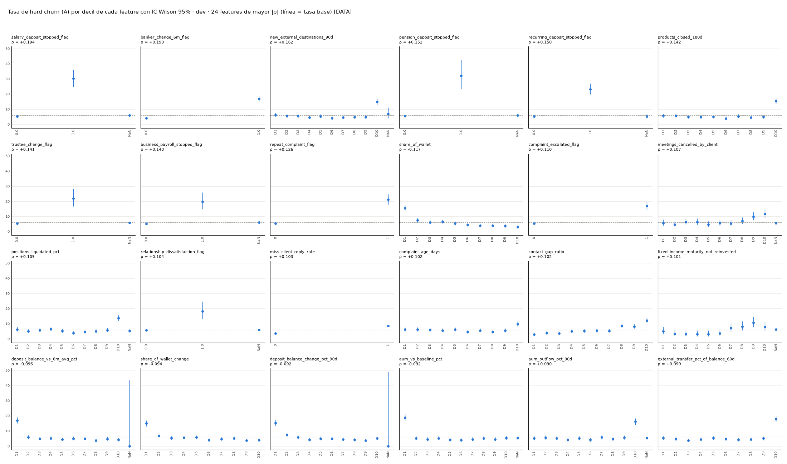

Dataset sintético, corte transversal: valida pipeline y metodología, no conclusiones sobre clientes reales.

# p05 · Fase 5 · EDA (exploratoria, solo dev)

## summary

| clave | valor |
|:--|:--|
| hogares dev | 13631 |
| eventos A dev | 817 |
| features | 58 |
| features con IC que excluye la tasa base en algún decil | 44 |
| clusters de redundancia (\|ρ\| ≥ 0.70) | 6 |
| features en clusters | 14 |
| PCA: componentes para 80% de varianza | 22 |
| K-means: mejor silhouette | 0.1001 |
| recordatorio | EDA exploratoria: nada de esto entra al modelo sin evidencia (PCA y clustering solo diagnósticos) |

_Fuente: `outputs/p05/summary.json`_

## decile_rates_top24

_Fuente: `outputs/p05/decile_rates_top24.png`_

## redundancy_clusters

Enlace completo: dentro de cada cluster todos los pares tienen |ρ| ≥ 0.70.

| feature | cluster | ρ con A | máx |ρ| dentro del cluster |
|:--|:--|:--|:--|
| miss_recurring_deposit_stopped_flag | 7 | -0.009478 | 0.9912 |
| miss_recurring_deposit_change_pct | 7 | -0.008868 | 0.9912 |
| aum_vs_baseline_pct | 20 | -0.09153 | 0.979 |
| aum_outflow_pct_90d | 20 | 0.08959 | 0.979 |
| aum_outflow_90d | 20 | 0.0881 | 0.979 |
| deposit_balance_vs_6m_avg_pct | 22 | -0.09632 | 0.905 |
| deposit_balance_change_pct_90d | 22 | -0.09215 | 0.905 |
| net_deposit_flow_pct_90d | 22 | -0.08868 | 0.905 |
| pension_deposit_stopped_flag | 28 | 0.1521 | 0.7719 |
| recurring_deposit_stopped_flag | 28 | 0.15 | 0.7719 |
| transfer_to_competitor_bank_amount_90d | 37 | 0.08824 | 0.8139 |
| transfer_to_competitor_pct_90d | 37 | 0.08312 | 0.8139 |
| relationship_value | 46 | 0.007448 | 0.9658 |
| aum | 46 | 0.002685 | 0.9658 |

_Fuente: `outputs/p05/redundancy_clusters.csv`_

## pca_exploratory

Rangos normalizados con NaN → 0 solo para explorar (no se usa en ningún modelo).

| componente | varianza % | acumulada % | top 4 loadings |
|:--|:--|:--|:--|
| PC1 | 16.06 | 16.06 | deposit_balance_vs_6m_avg_pct +0.37, net_deposit_flow_pct_90d +0.36, net_external_flow_pct_90d +0.35, deposit_balance_change_pct_90d +0.35 |
| PC2 | 9.571 | 25.63 | deposit_balance +0.47, relationship_value +0.47, aum +0.40, outflow_vs_baseline_pct +0.33 |
| PC3 | 6.419 | 32.05 | external_transfer_pct_of_balance_60d +0.38, transfer_to_competitor_pct_90d +0.37, relationship_value -0.27, aum -0.25 |
| PC4 | 5.347 | 37.4 | aum_vs_baseline_pct +0.40, investment_redemption_pct -0.40, aum_outflow_90d -0.37, aum_outflow_pct_90d -0.36 |
| PC5 | 4.02 | 41.42 | recurring_income_monthly +0.63, has_payroll_stream +0.35, has_linked_business +0.26, miss_recurring_deposit_stopped_flag -0.24 |
| PC6 | 3.56 | 44.98 | contact_gap_ratio +0.76, miss_client_reply_rate +0.33, recurring_deposit_change_pct -0.21, share_of_wallet -0.19 |
| PC7 | 3.493 | 48.47 | external_transfer_acceleration +0.83, outflow_vs_baseline_pct +0.41, transfer_to_competitor_bank_amount_90d -0.19, transfer_to_competitor_pct_90d -0.16 |
| PC8 | 3.328 | 51.8 | tenure_years +0.92, history_months +0.25, contact_gap_ratio +0.17, cash_pct_of_portfolio_chg -0.15 |
| PC9 | 3.201 | 55 | cash_pct_of_portfolio_chg +0.74, positions_liquidated_pct +0.28, aum_vs_baseline_pct +0.25, contact_gap_ratio -0.24 |
| PC10 | 2.897 | 57.89 | recurring_deposit_change_pct +0.73, external_destination_concentration -0.43, contact_gap_ratio +0.30, share_of_wallet +0.23 |

_Fuente: `outputs/p05/pca_exploratory.csv`_

## kmeans_exploratory

| K | silhouette | cluster mín % | tasa A % por cluster |
|:--|:--|:--|:--|
| 2 | 0.1001 | 36.27 | 9.0 / 4.3 |
| 3 | 0.06716 | 7.476 | 24.4 / 4.7 / 4.2 |
| 4 | 0.05961 | 7.329 | 4.1 / 4.7 / 24.8 / 4.7 |
| 5 | 0.05053 | 6.456 | 4.4 / 27.0 / 4.6 / 4.2 / 5.0 |
| 6 | 0.04969 | 6.177 | 5.6 / 27.2 / 4.5 / 4.1 / 4.3 / 5.0 |

_Fuente: `outputs/p05/kmeans_exploratory.csv`_

## decile_rates

| feature | grupo | target | hogares | eventos | tasa % | IC95 inf % | IC95 sup % | valor mín | valor máx |
|:--|:--|:--|:--|:--|:--|:--|:--|:--|:--|
| segment_uhnw | 0 | A | 12873 | 762 | 5.919 | 5.525 | 6.34 | 0 | 0 |
| segment_uhnw | 0 | B | 12731 | 1749 | 13.74 | 13.15 | 14.35 | 0 | 0 |
| segment_uhnw | 1 | A | 758 | 55 | 7.256 | 5.617 | 9.326 | 1 | 1 |
| segment_uhnw | 1 | B | 751 | 122 | 16.25 | 13.78 | 19.05 | 1 | 1 |
| relationship_value | D1 | A | 1364 | 78 | 5.718 | 4.606 | 7.08 | 1000214.67 | 1561597.32 |
| relationship_value | D1 | B | 1349 | 190 | 14.08 | 12.33 | 16.04 | 1000214.67 | 1561597.32 |
| relationship_value | D10 | A | 1363 | 103 | 7.557 | 6.27 | 9.082 | 20620601.42 | 903973258.11 |
| relationship_value | D10 | B | 1348 | 218 | 16.17 | 14.3 | 18.23 | 20620601.42 | 903973258.11 |
| relationship_value | D2 | A | 1363 | 89 | 6.53 | 5.336 | 7.967 | 1561690.28 | 2147942.46 |
| relationship_value | D2 | B | 1350 | 193 | 14.3 | 12.53 | 16.26 | 1561690.28 | 2147942.46 |
| relationship_value | D3 | A | 1363 | 70 | 5.136 | 4.085 | 6.439 | 2148097.19 | 2883606.26 |
| relationship_value | D3 | B | 1350 | 176 | 13.04 | 11.35 | 14.94 | 2148097.19 | 2883606.26 |
| relationship_value | D4 | A | 1363 | 85 | 6.236 | 5.071 | 7.647 | 2883972.47 | 3777880.3 |
| relationship_value | D4 | B | 1349 | 187 | 13.86 | 12.12 | 15.81 | 2883972.47 | 3777880.3 |
| relationship_value | D5 | A | 1363 | 89 | 6.53 | 5.336 | 7.967 | 3778333.73 | 4900104.05 |
| relationship_value | D5 | B | 1347 | 191 | 14.18 | 12.42 | 16.14 | 3778333.73 | 4900104.05 |
| relationship_value | D6 | A | 1363 | 72 | 5.282 | 4.216 | 6.601 | 4902272.65 | 6469205.88 |
| relationship_value | D6 | B | 1346 | 176 | 13.08 | 11.38 | 14.98 | 4902272.65 | 6469205.88 |
| relationship_value | D7 | A | 1363 | 72 | 5.282 | 4.216 | 6.601 | 6470179.95 | 8813412.38 |
| relationship_value | D7 | B | 1344 | 181 | 13.47 | 11.75 | 15.4 | 6470179.95 | 8813412.38 |
| relationship_value | D8 | A | 1363 | 82 | 6.016 | 4.873 | 7.406 | 8814067.76 | 12323090.1 |
| relationship_value | D8 | B | 1351 | 178 | 13.18 | 11.48 | 15.08 | 8814067.76 | 12323090.1 |
| relationship_value | D9 | A | 1363 | 77 | 5.649 | 4.544 | 7.004 | 12331154.51 | 20609475.85 |
| relationship_value | D9 | B | 1348 | 181 | 13.43 | 11.71 | 15.35 | 12331154.51 | 20609475.85 |
| deposit_balance | D1 | A | 1364 | 86 | 6.305 | 5.134 | 7.722 | 1358.28 | 341239.23 |
| deposit_balance | D1 | B | 1351 | 198 | 14.66 | 12.87 | 16.64 | 1358.28 | 341239.23 |
| deposit_balance | D10 | A | 1363 | 95 | 6.97 | 5.736 | 8.446 | 7355486.66 | 353238935.88 |
| deposit_balance | D10 | B | 1350 | 190 | 14.07 | 12.32 | 16.03 | 7355486.66 | 353238935.88 |
| deposit_balance | D2 | A | 1363 | 84 | 6.163 | 5.005 | 7.567 | 341766.28 | 575845.12 |
| deposit_balance | D2 | B | 1350 | 179 | 13.26 | 11.55 | 15.17 | 341766.28 | 575845.12 |
| deposit_balance | D3 | A | 1363 | 86 | 6.31 | 5.138 | 7.727 | 576055.07 | 843179.49 |
| deposit_balance | D3 | B | 1347 | 190 | 14.11 | 12.35 | 16.07 | 576055.07 | 843179.49 |
| deposit_balance | D4 | A | 1363 | 84 | 6.163 | 5.005 | 7.567 | 843531.11 | 1177098.09 |
| deposit_balance | D4 | B | 1348 | 199 | 14.76 | 12.97 | 16.76 | 843531.11 | 1177098.09 |
| deposit_balance | D5 | A | 1363 | 76 | 5.576 | 4.478 | 6.924 | 1177138.42 | 1572246.74 |
| deposit_balance | D5 | B | 1346 | 172 | 12.78 | 11.1 | 14.67 | 1177138.42 | 1572246.74 |
| deposit_balance | D6 | A | 1363 | 79 | 5.796 | 4.675 | 7.165 | 1572379.22 | 2100795.19 |
| deposit_balance | D6 | B | 1348 | 184 | 13.65 | 11.92 | 15.59 | 1572379.22 | 2100795.19 |
| deposit_balance | D7 | A | 1363 | 72 | 5.282 | 4.216 | 6.601 | 2102425.6 | 2905867.37 |
| deposit_balance | D7 | B | 1343 | 179 | 13.33 | 11.61 | 15.25 | 2102425.6 | 2905867.37 |
| deposit_balance | D8 | A | 1363 | 89 | 6.53 | 5.336 | 7.967 | 2906009.03 | 4213122.33 |
| deposit_balance | D8 | B | 1348 | 196 | 14.54 | 12.76 | 16.52 | 2906009.03 | 4213122.33 |
| deposit_balance | D9 | A | 1363 | 66 | 4.842 | 3.824 | 6.114 | 4213256.45 | 7354434.66 |
| deposit_balance | D9 | B | 1351 | 184 | 13.62 | 11.89 | 15.55 | 4213256.45 | 7354434.66 |
| aum | D1 | A | 1169 | 67 | 5.731 | 4.538 | 7.215 | 204619.26 | 1111851.95 |
| aum | D1 | B | 1158 | 155 | 13.39 | 11.54 | 15.47 | 204619.26 | 1111851.95 |
| aum | D10 | A | 1169 | 86 | 7.357 | 5.996 | 8.997 | 16036603.49 | 773011257.6699998 |
| aum | D10 | B | 1155 | 186 | 16.1 | 14.1 | 18.34 | 16036603.49 | 773011257.6699998 |
| aum | D2 | A | 1169 | 72 | 6.159 | 4.919 | 7.686 | 1111885.06 | 1581256.02 |
| aum | D2 | B | 1156 | 163 | 14.1 | 12.21 | 16.23 | 1111885.06 | 1581256.02 |
| aum | D3 | A | 1169 | 81 | 6.929 | 5.61 | 8.53 | 1581318.77 | 2164281.68 |
| aum | D3 | B | 1158 | 176 | 15.2 | 13.25 | 17.38 | 1581318.77 | 2164281.68 |
| aum | D4 | A | 1168 | 60 | 5.137 | 4.012 | 6.556 | 2164378.12 | 2897307.82 |
| aum | D4 | B | 1153 | 130 | 11.27 | 9.576 | 13.23 | 2164378.12 | 2897307.82 |
| aum | D5 | A | 1169 | 79 | 6.758 | 5.456 | 8.343 | 2898125.93 | 3739576.28 |
| aum | D5 | B | 1155 | 178 | 15.41 | 13.44 | 17.61 | 2898125.93 | 3739576.28 |
| aum | D6 | A | 1169 | 75 | 6.416 | 5.149 | 7.968 | 3739839.62 | 4922312.77 |
| aum | D6 | B | 1159 | 159 | 13.72 | 11.86 | 15.82 | 3739839.62 | 4922312.77 |
| aum | D7 | A | 1168 | 67 | 5.736 | 4.542 | 7.221 | 4922908.34 | 6607944.78 |
| aum | D7 | B | 1152 | 166 | 14.41 | 12.5 | 16.56 | 4922908.34 | 6607944.78 |
| aum | D8 | A | 1169 | 58 | 4.962 | 3.858 | 6.361 | 6609754.26 | 9451853.78 |
| aum | D8 | B | 1157 | 158 | 13.66 | 11.8 | 15.76 | 6609754.26 | 9451853.78 |
| aum | D9 | A | 1169 | 70 | 5.988 | 4.767 | 7.498 | 9451942.77 | 16017823.55 |
| aum | D9 | B | 1157 | 151 | 13.05 | 11.23 | 15.11 | 9451942.77 | 16017823.55 |
| aum |  | A | 1943 | 102 | 5.25 | 4.343 | 6.333 |  |  |
| aum |  | B | 1922 | 249 | 12.96 | 11.53 | 14.53 |  |  |
| has_investments | False | A | 1943 | 102 | 5.25 | 4.343 | 6.333 | False | False |
| has_investments | False | B | 1922 | 249 | 12.96 | 11.53 | 14.53 | False | False |
| has_investments | True | A | 11688 | 715 | 6.117 | 5.697 | 6.566 | True | True |
| has_investments | True | B | 11560 | 1622 | 14.03 | 13.41 | 14.68 | True | True |
| has_advisory | False | A | 5412 | 338 | 6.245 | 5.631 | 6.922 | False | False |
| has_advisory | False | B | 5353 | 746 | 13.94 | 13.03 | 14.89 | False | False |
| has_advisory | True | A | 8219 | 479 | 5.828 | 5.342 | 6.355 | True | True |
| has_advisory | True | B | 8129 | 1125 | 13.84 | 13.11 | 14.61 | True | True |
| has_linked_business | False | A | 10047 | 604 | 6.012 | 5.564 | 6.494 | False | False |
| has_linked_business | False | B | 9937 | 1375 | 13.84 | 13.17 | 14.53 | False | False |
| has_linked_business | True | A | 3584 | 213 | 5.943 | 5.215 | 6.765 | True | True |
| has_linked_business | True | B | 3545 | 496 | 13.99 | 12.89 | 15.17 | True | True |
| has_trust | False | A | 9281 | 551 | 5.937 | 5.474 | 6.436 | False | False |
| has_trust | False | B | 9196 | 1279 | 13.91 | 13.22 | 14.63 | False | False |
| has_trust | True | A | 4350 | 266 | 6.115 | 5.441 | 6.866 | True | True |
| has_trust | True | B | 4286 | 592 | 13.81 | 12.81 | 14.88 | True | True |
| has_credit_anchor | False | A | 8985 | 577 | 6.422 | 5.933 | 6.948 | False | False |
| has_credit_anchor | False | B | 8884 | 1263 | 14.22 | 13.51 | 14.96 | False | False |
| has_credit_anchor | True | A | 4646 | 240 | 5.166 | 4.566 | 5.84 | True | True |
| has_credit_anchor | True | B | 4598 | 608 | 13.22 | 12.27 | 14.23 | True | True |
| has_payroll_stream | False | A | 6261 | 367 | 5.862 | 5.306 | 6.471 | False | False |
| has_payroll_stream | False | B | 6205 | 861 | 13.88 | 13.04 | 14.76 | False | False |
| has_payroll_stream | True | A | 7370 | 450 | 6.106 | 5.582 | 6.676 | True | True |
| has_payroll_stream | True | B | 7277 | 1010 | 13.88 | 13.1 | 14.69 | True | True |
| has_pension_stream | False | A | 8955 | 534 | 5.963 | 5.491 | 6.473 | False | False |
| has_pension_stream | False | B | 8853 | 1226 | 13.85 | 13.14 | 14.58 | False | False |
| has_pension_stream | True | A | 4676 | 283 | 6.052 | 5.404 | 6.772 | True | True |
| has_pension_stream | True | B | 4629 | 645 | 13.93 | 12.97 | 14.96 | True | True |
| has_dividend_stream | False | A | 7219 | 409 | 5.666 | 5.156 | 6.223 | False | False |
| has_dividend_stream | False | B | 7142 | 956 | 13.39 | 12.62 | 14.2 | False | False |
| has_dividend_stream | True | A | 6412 | 408 | 6.363 | 5.791 | 6.987 | True | True |
| has_dividend_stream | True | B | 6340 | 915 | 14.43 | 13.59 | 15.32 | True | True |
| tenure_years | D1 | A | 1364 | 89 | 6.525 | 5.333 | 7.961 | 1.0 | 2.77 |
| tenure_years | D1 | B | 1346 | 217 | 16.12 | 14.25 | 18.18 | 1.0 | 2.77 |
| tenure_years | D10 | A | 1363 | 58 | 4.255 | 3.306 | 5.462 | 17.5 | 50.0 |
| tenure_years | D10 | B | 1343 | 163 | 12.14 | 10.5 | 13.99 | 17.5 | 50.0 |
| tenure_years | D2 | A | 1363 | 85 | 6.236 | 5.071 | 7.647 | 2.77 | 3.96 |
| tenure_years | D2 | B | 1351 | 212 | 15.69 | 13.85 | 17.73 | 2.77 | 3.96 |
| tenure_years | D3 | A | 1363 | 91 | 6.676 | 5.469 | 8.127 | 3.96 | 5.15 |
| tenure_years | D3 | B | 1353 | 190 | 14.04 | 12.29 | 16 | 3.96 | 5.15 |
| tenure_years | D4 | A | 1363 | 86 | 6.31 | 5.138 | 7.727 | 5.15 | 6.42 |
| tenure_years | D4 | B | 1347 | 185 | 13.73 | 12 | 15.68 | 5.15 | 6.42 |
| tenure_years | D5 | A | 1363 | 95 | 6.97 | 5.736 | 8.446 | 6.42 | 7.79 |
| tenure_years | D5 | B | 1354 | 198 | 14.62 | 12.84 | 16.61 | 6.42 | 7.79 |
| tenure_years | D6 | A | 1363 | 82 | 6.016 | 4.873 | 7.406 | 7.79 | 9.38 |
| tenure_years | D6 | B | 1345 | 186 | 13.83 | 12.09 | 15.78 | 7.79 | 9.38 |
| tenure_years | D7 | A | 1363 | 79 | 5.796 | 4.675 | 7.165 | 9.38 | 11.23 |
| tenure_years | D7 | B | 1344 | 186 | 13.84 | 12.1 | 15.79 | 9.38 | 11.23 |
| tenure_years | D8 | A | 1363 | 77 | 5.649 | 4.544 | 7.004 | 11.23 | 13.6 |
| tenure_years | D8 | B | 1347 | 174 | 12.92 | 11.23 | 14.81 | 11.23 | 13.6 |
| tenure_years | D9 | A | 1363 | 75 | 5.503 | 4.412 | 6.843 | 13.61 | 17.5 |
| tenure_years | D9 | B | 1352 | 160 | 11.83 | 10.22 | 13.67 | 13.61 | 17.5 |
| history_months | D1 | A | 1364 | 88 | 6.452 | 5.266 | 7.882 | 11 | 24 |
| history_months | D1 | B | 1347 | 206 | 15.29 | 13.47 | 17.31 | 11 | 24 |
| history_months | D10 | A | 1363 | 75 | 5.503 | 4.412 | 6.843 | 24 | 24 |
| history_months | D10 | B | 1348 | 195 | 14.47 | 12.69 | 16.44 | 24 | 24 |
| history_months | D2 | A | 1363 | 81 | 5.943 | 4.807 | 7.326 | 24 | 24 |
| history_months | D2 | B | 1348 | 185 | 13.72 | 11.99 | 15.66 | 24 | 24 |
| history_months | D3 | A | 1363 | 94 | 6.897 | 5.669 | 8.366 | 24 | 24 |
| history_months | D3 | B | 1345 | 182 | 13.53 | 11.81 | 15.46 | 24 | 24 |
| history_months | D4 | A | 1363 | 77 | 5.649 | 4.544 | 7.004 | 24 | 24 |
| history_months | D4 | B | 1352 | 184 | 13.61 | 11.88 | 15.54 | 24 | 24 |
| history_months | D5 | A | 1363 | 90 | 6.603 | 5.403 | 8.047 | 24 | 24 |
| history_months | D5 | B | 1349 | 182 | 13.49 | 11.77 | 15.42 | 24 | 24 |
| history_months | D6 | A | 1363 | 79 | 5.796 | 4.675 | 7.165 | 24 | 24 |
| history_months | D6 | B | 1350 | 160 | 11.85 | 10.23 | 13.69 | 24 | 24 |
| history_months | D7 | A | 1363 | 75 | 5.503 | 4.412 | 6.843 | 24 | 24 |
| history_months | D7 | B | 1346 | 194 | 14.41 | 12.64 | 16.39 | 24 | 24 |
| history_months | D8 | A | 1363 | 82 | 6.016 | 4.873 | 7.406 | 24 | 24 |
| history_months | D8 | B | 1346 | 198 | 14.71 | 12.92 | 16.7 | 24 | 24 |
| history_months | D9 | A | 1363 | 76 | 5.576 | 4.478 | 6.924 | 24 | 24 |
| history_months | D9 | B | 1351 | 185 | 13.69 | 11.96 | 15.63 | 24 | 24 |
| recurring_income_monthly | D1 | A | 1364 | 80 | 5.865 | 4.738 | 7.24 | 0.0 | 4565.38 |
| recurring_income_monthly | D1 | B | 1351 | 174 | 12.88 | 11.2 | 14.77 | 0.0 | 4565.38 |
| recurring_income_monthly | D10 | A | 1363 | 98 | 7.19 | 5.936 | 8.685 | 105482.74 | 2000229.77 |
| recurring_income_monthly | D10 | B | 1346 | 209 | 15.53 | 13.69 | 17.56 | 105482.74 | 2000229.77 |
| recurring_income_monthly | D2 | A | 1363 | 78 | 5.723 | 4.609 | 7.085 | 4584.19 | 10470.9 |
| recurring_income_monthly | D2 | B | 1353 | 186 | 13.75 | 12.01 | 15.68 | 4584.19 | 10470.9 |
| recurring_income_monthly | D3 | A | 1363 | 88 | 6.456 | 5.27 | 7.887 | 10472.33 | 16879.2 |
| recurring_income_monthly | D3 | B | 1350 | 196 | 14.52 | 12.74 | 16.5 | 10472.33 | 16879.2 |
| recurring_income_monthly | D4 | A | 1363 | 76 | 5.576 | 4.478 | 6.924 | 16888.07 | 23694.1 |
| recurring_income_monthly | D4 | B | 1348 | 184 | 13.65 | 11.92 | 15.59 | 16888.07 | 23694.1 |
| recurring_income_monthly | D5 | A | 1363 | 71 | 5.209 | 4.15 | 6.52 | 23709.11 | 30779.77 |
| recurring_income_monthly | D5 | B | 1347 | 187 | 13.88 | 12.14 | 15.83 | 23709.11 | 30779.77 |
| recurring_income_monthly | D6 | A | 1363 | 70 | 5.136 | 4.085 | 6.439 | 30780.18 | 39601.02 |
| recurring_income_monthly | D6 | B | 1349 | 178 | 13.19 | 11.49 | 15.11 | 30780.18 | 39601.02 |
| recurring_income_monthly | D7 | A | 1363 | 82 | 6.016 | 4.873 | 7.406 | 39620.0 | 50648.13 |
| recurring_income_monthly | D7 | B | 1344 | 182 | 13.54 | 11.82 | 15.48 | 39620.0 | 50648.13 |
| recurring_income_monthly | D8 | A | 1363 | 103 | 7.557 | 6.27 | 9.082 | 50653.34 | 69512.48 |
| recurring_income_monthly | D8 | B | 1345 | 211 | 15.69 | 13.84 | 17.73 | 50653.34 | 69512.48 |
| recurring_income_monthly | D9 | A | 1363 | 71 | 5.209 | 4.15 | 6.52 | 69519.38 | 105463.58 |
| recurring_income_monthly | D9 | B | 1349 | 164 | 12.16 | 10.52 | 14.01 | 69519.38 | 105463.58 |
| aum_outflow_pct_90d | D1 | A | 1169 | 59 | 5.047 | 3.933 | 6.456 | 0.0 | 0.0 |
| aum_outflow_pct_90d | D1 | B | 1159 | 129 | 11.13 | 9.446 | 13.07 | 0.0 | 0.0 |
| aum_outflow_pct_90d | D10 | A | 1169 | 189 | 16.17 | 14.17 | 18.39 | 0.04435722 | 3.42179496 |
| aum_outflow_pct_90d | D10 | B | 1140 | 347 | 30.44 | 27.84 | 33.17 | 0.04435722 | 3.42179496 |
| aum_outflow_pct_90d | D2 | A | 1169 | 66 | 5.646 | 4.462 | 7.12 | 0.0 | 0.0 |
| aum_outflow_pct_90d | D2 | B | 1157 | 136 | 11.75 | 10.02 | 13.74 | 0.0 | 0.0 |
| aum_outflow_pct_90d | D3 | A | 1169 | 59 | 5.047 | 3.933 | 6.456 | 0.0 | 0.0 |
| aum_outflow_pct_90d | D3 | B | 1160 | 131 | 11.29 | 9.598 | 13.24 | 0.0 | 0.0 |
| aum_outflow_pct_90d | D4 | A | 1168 | 48 | 4.11 | 3.114 | 5.407 | 0.0 | 0.0 |
| aum_outflow_pct_90d | D4 | B | 1153 | 127 | 11.01 | 9.335 | 12.95 | 0.0 | 0.0 |
| aum_outflow_pct_90d | D5 | A | 1169 | 59 | 5.047 | 3.933 | 6.456 | 0.0 | 0.0 |
| aum_outflow_pct_90d | D5 | B | 1159 | 151 | 13.03 | 11.21 | 15.09 | 0.0 | 0.0 |
| aum_outflow_pct_90d | D6 | A | 1169 | 48 | 4.106 | 3.111 | 5.402 | 0.0 | 0.00360406 |
| aum_outflow_pct_90d | D6 | B | 1157 | 131 | 11.32 | 9.623 | 13.28 | 0.0 | 0.00360406 |
| aum_outflow_pct_90d | D7 | A | 1168 | 67 | 5.736 | 4.542 | 7.221 | 0.00361904 | 0.0092445 |
| aum_outflow_pct_90d | D7 | B | 1157 | 155 | 13.4 | 11.55 | 15.48 | 0.00361904 | 0.0092445 |
| aum_outflow_pct_90d | D8 | A | 1169 | 54 | 4.619 | 3.558 | 5.978 | 0.00925952 | 0.01738783 |
| aum_outflow_pct_90d | D8 | B | 1162 | 156 | 13.43 | 11.58 | 15.51 | 0.00925952 | 0.01738783 |
| aum_outflow_pct_90d | D9 | A | 1169 | 66 | 5.646 | 4.462 | 7.12 | 0.01741311 | 0.04435163 |
| aum_outflow_pct_90d | D9 | B | 1156 | 159 | 13.75 | 11.89 | 15.86 | 0.01741311 | 0.04435163 |
| aum_outflow_pct_90d |  | A | 1943 | 102 | 5.25 | 4.343 | 6.333 |  |  |
| aum_outflow_pct_90d |  | B | 1922 | 249 | 12.96 | 11.53 | 14.53 |  |  |
| deposit_balance_change_pct_90d | D1 | A | 1363 | 208 | 15.26 | 13.45 | 17.27 | -0.94106567 | -0.25613582 |
| deposit_balance_change_pct_90d | D1 | B | 1341 | 385 | 28.71 | 26.35 | 31.19 | -0.94106567 | -0.25613582 |
| deposit_balance_change_pct_90d | D10 | A | 1363 | 69 | 5.062 | 4.02 | 6.358 | 0.23989506 | 1.62691872 |
| deposit_balance_change_pct_90d | D10 | B | 1352 | 175 | 12.94 | 11.26 | 14.84 | 0.23989506 | 1.62691872 |
| deposit_balance_change_pct_90d | D2 | A | 1363 | 101 | 7.41 | 6.136 | 8.924 | -0.25613199 | -0.16218453 |
| deposit_balance_change_pct_90d | D2 | B | 1344 | 190 | 14.14 | 12.38 | 16.1 | -0.25613199 | -0.16218453 |
| deposit_balance_change_pct_90d | D3 | A | 1362 | 78 | 5.727 | 4.613 | 7.09 | -0.1620859 | -0.10466684 |
| deposit_balance_change_pct_90d | D3 | B | 1347 | 172 | 12.77 | 11.09 | 14.66 | -0.1620859 | -0.10466684 |
| deposit_balance_change_pct_90d | D4 | A | 1363 | 56 | 4.109 | 3.177 | 5.298 | -0.10465157 | -0.05613853 |
| deposit_balance_change_pct_90d | D4 | B | 1349 | 167 | 12.38 | 10.73 | 14.24 | -0.10465157 | -0.05613853 |
| deposit_balance_change_pct_90d | D5 | A | 1363 | 67 | 4.916 | 3.889 | 6.195 | -0.05613488 | -0.01097904 |
| deposit_balance_change_pct_90d | D5 | B | 1349 | 163 | 12.08 | 10.45 | 13.93 | -0.05613488 | -0.01097904 |
| deposit_balance_change_pct_90d | D6 | A | 1362 | 68 | 4.993 | 3.957 | 6.281 | -0.01095934 | 0.03270098 |
| deposit_balance_change_pct_90d | D6 | B | 1344 | 171 | 12.72 | 11.05 | 14.61 | -0.01095934 | 0.03270098 |
| deposit_balance_change_pct_90d | D7 | A | 1363 | 60 | 4.402 | 3.435 | 5.625 | 0.03274638 | 0.07997139 |
| deposit_balance_change_pct_90d | D7 | B | 1345 | 158 | 11.75 | 10.13 | 13.58 | 0.03274638 | 0.07997139 |
| deposit_balance_change_pct_90d | D8 | A | 1362 | 58 | 4.258 | 3.309 | 5.466 | 0.07999996 | 0.13991099 |
| deposit_balance_change_pct_90d | D8 | B | 1356 | 153 | 11.28 | 9.707 | 13.08 | 0.07999996 | 0.13991099 |
| deposit_balance_change_pct_90d | D9 | A | 1363 | 52 | 3.815 | 2.921 | 4.969 | 0.13997785 | 0.23986685 |
| deposit_balance_change_pct_90d | D9 | B | 1351 | 137 | 10.14 | 8.642 | 11.86 | 0.13997785 | 0.23986685 |
| deposit_balance_change_pct_90d |  | A | 4 | 0 | 0 | 0 | 48.99 |  |  |
| deposit_balance_change_pct_90d |  | B | 4 | 0 | 0 | 0 | 48.99 |  |  |
| salary_deposit_stopped_flag | 0.0 | A | 6971 | 358 | 5.136 | 4.642 | 5.679 | 0.0 | 0.0 |
| salary_deposit_stopped_flag | 0.0 | B | 6891 | 858 | 12.45 | 11.69 | 13.25 | 0.0 | 0.0 |
| salary_deposit_stopped_flag | 1.0 | A | 255 | 77 | 30.2 | 24.89 | 36.09 | 1.0 | 1.0 |
| salary_deposit_stopped_flag | 1.0 | B | 245 | 129 | 52.65 | 46.41 | 58.82 | 1.0 | 1.0 |
| salary_deposit_stopped_flag |  | A | 6405 | 382 | 5.964 | 5.41 | 6.571 |  |  |
| salary_deposit_stopped_flag |  | B | 6346 | 884 | 13.93 | 13.1 | 14.8 |  |  |
| recurring_deposit_stopped_flag | 0.0 | A | 12189 | 647 | 5.308 | 4.924 | 5.72 | 0.0 | 0.0 |
| recurring_deposit_stopped_flag | 0.0 | B | 12064 | 1546 | 12.81 | 12.23 | 13.42 | 0.0 | 0.0 |
| recurring_deposit_stopped_flag | 1.0 | A | 530 | 123 | 23.21 | 19.81 | 26.99 | 1.0 | 1.0 |
| recurring_deposit_stopped_flag | 1.0 | B | 514 | 216 | 42.02 | 37.83 | 46.33 | 1.0 | 1.0 |
| recurring_deposit_stopped_flag |  | A | 912 | 47 | 5.154 | 3.897 | 6.786 |  |  |
| recurring_deposit_stopped_flag |  | B | 904 | 109 | 12.06 | 10.09 | 14.34 |  |  |
| recurring_deposit_change_pct | D1 | A | 1271 | 166 | 13.06 | 11.32 | 15.02 | -1.0 | -0.43000706 |
| recurring_deposit_change_pct | D1 | B | 1243 | 320 | 25.74 | 23.39 | 28.25 | -1.0 | -0.43000706 |
| recurring_deposit_change_pct | D10 | A | 1271 | 59 | 4.642 | 3.616 | 5.942 | 0.16701212 | 2.85830653 |
| recurring_deposit_change_pct | D10 | B | 1258 | 160 | 12.72 | 10.99 | 14.67 | 0.16701212 | 2.85830653 |
| recurring_deposit_change_pct | D2 | A | 1271 | 106 | 8.34 | 6.943 | 9.988 | -0.42981376 | -0.13433488 |
| recurring_deposit_change_pct | D2 | B | 1258 | 221 | 17.57 | 15.56 | 19.77 | -0.42981376 | -0.13433488 |
| recurring_deposit_change_pct | D3 | A | 1271 | 60 | 4.721 | 3.685 | 6.029 | -0.13409476 | -0.07199558 |
| recurring_deposit_change_pct | D3 | B | 1258 | 157 | 12.48 | 10.77 | 14.42 | -0.13409476 | -0.07199558 |
| recurring_deposit_change_pct | D4 | A | 1271 | 69 | 5.429 | 4.312 | 6.814 | -0.07198455 | -0.03290584 |
| recurring_deposit_change_pct | D4 | B | 1262 | 155 | 12.28 | 10.58 | 14.21 | -0.07198455 | -0.03290584 |
| recurring_deposit_change_pct | D5 | A | 1271 | 66 | 5.193 | 4.102 | 6.553 | -0.03288024 | -0.00823245 |
| recurring_deposit_change_pct | D5 | B | 1264 | 151 | 11.95 | 10.27 | 13.85 | -0.03288024 | -0.00823245 |
| recurring_deposit_change_pct | D6 | A | 1271 | 54 | 4.249 | 3.271 | 5.502 | -0.00823245 | 0.00039262 |
| recurring_deposit_change_pct | D6 | B | 1254 | 141 | 11.24 | 9.613 | 13.11 | -0.00823245 | 0.00039262 |
| recurring_deposit_change_pct | D7 | A | 1271 | 65 | 5.114 | 4.033 | 6.466 | 0.00039583 | 0.00960637 |
| recurring_deposit_change_pct | D7 | B | 1254 | 158 | 12.6 | 10.88 | 14.55 | 0.00039583 | 0.00960637 |
| recurring_deposit_change_pct | D8 | A | 1271 | 56 | 4.406 | 3.408 | 5.678 | 0.00962705 | 0.03859691 |
| recurring_deposit_change_pct | D8 | B | 1254 | 138 | 11 | 9.39 | 12.86 | 0.00962705 | 0.03859691 |
| recurring_deposit_change_pct | D9 | A | 1271 | 68 | 5.35 | 4.242 | 6.727 | 0.03862256 | 0.16697543 |
| recurring_deposit_change_pct | D9 | B | 1264 | 160 | 12.66 | 10.94 | 14.61 | 0.03862256 | 0.16697543 |
| recurring_deposit_change_pct |  | A | 921 | 48 | 5.212 | 3.953 | 6.842 |  |  |
| recurring_deposit_change_pct |  | B | 913 | 110 | 12.05 | 10.09 | 14.32 |  |  |
| net_deposit_flow_pct_90d | D1 | A | 1363 | 221 | 16.21 | 14.35 | 18.27 | -6.23959352 | -0.37858729 |
| net_deposit_flow_pct_90d | D1 | B | 1333 | 394 | 29.56 | 27.17 | 32.06 | -6.23959352 | -0.37858729 |
| net_deposit_flow_pct_90d | D10 | A | 1363 | 60 | 4.402 | 3.435 | 5.625 | 0.24189983 | 1.19488449 |
| net_deposit_flow_pct_90d | D10 | B | 1352 | 159 | 11.76 | 10.15 | 13.59 | 0.24189983 | 1.19488449 |
| net_deposit_flow_pct_90d | D2 | A | 1363 | 78 | 5.723 | 4.609 | 7.085 | -0.37854082 | -0.21739327 |
| net_deposit_flow_pct_90d | D2 | B | 1348 | 186 | 13.8 | 12.06 | 15.74 | -0.37854082 | -0.21739327 |
| net_deposit_flow_pct_90d | D3 | A | 1362 | 70 | 5.14 | 4.088 | 6.443 | -0.21737407 | -0.13219122 |
| net_deposit_flow_pct_90d | D3 | B | 1351 | 173 | 12.81 | 11.13 | 14.69 | -0.21737407 | -0.13219122 |
| net_deposit_flow_pct_90d | D4 | A | 1363 | 69 | 5.062 | 4.02 | 6.358 | -0.13216974 | -0.06818872 |
| net_deposit_flow_pct_90d | D4 | B | 1350 | 161 | 11.93 | 10.3 | 13.76 | -0.13216974 | -0.06818872 |
| net_deposit_flow_pct_90d | D5 | A | 1363 | 64 | 4.696 | 3.694 | 5.952 | -0.06814587 | -0.01449722 |
| net_deposit_flow_pct_90d | D5 | B | 1347 | 162 | 12.03 | 10.4 | 13.87 | -0.06814587 | -0.01449722 |
| net_deposit_flow_pct_90d | D6 | A | 1362 | 65 | 4.772 | 3.762 | 6.037 | -0.01449548 | 0.03729514 |
| net_deposit_flow_pct_90d | D6 | B | 1349 | 173 | 12.82 | 11.15 | 14.71 | -0.01449548 | 0.03729514 |
| net_deposit_flow_pct_90d | D7 | A | 1363 | 66 | 4.842 | 3.824 | 6.114 | 0.03730173 | 0.09340138 |
| net_deposit_flow_pct_90d | D7 | B | 1345 | 165 | 12.27 | 10.62 | 14.13 | 0.03730173 | 0.09340138 |
| net_deposit_flow_pct_90d | D8 | A | 1362 | 59 | 4.332 | 3.373 | 5.548 | 0.09341408 | 0.15574162 |
| net_deposit_flow_pct_90d | D8 | B | 1355 | 149 | 11 | 9.44 | 12.77 | 0.09341408 | 0.15574162 |
| net_deposit_flow_pct_90d | D9 | A | 1363 | 65 | 4.769 | 3.759 | 6.033 | 0.15580535 | 0.24186933 |
| net_deposit_flow_pct_90d | D9 | B | 1348 | 149 | 11.05 | 9.489 | 12.84 | 0.15580535 | 0.24186933 |
| net_deposit_flow_pct_90d |  | A | 4 | 0 | 0 | 0 | 48.99 |  |  |
| net_deposit_flow_pct_90d |  | B | 4 | 0 | 0 | 0 | 48.99 |  |  |
| external_transfer_pct_of_balance_60d | D1 | A | 1364 | 72 | 5.279 | 4.213 | 6.596 | 0.0 | 0.00303596 |
| external_transfer_pct_of_balance_60d | D1 | B | 1354 | 141 | 10.41 | 8.897 | 12.15 | 0.0 | 0.00303596 |
| external_transfer_pct_of_balance_60d | D10 | A | 1363 | 245 | 17.98 | 16.03 | 20.1 | 0.02838677 | 30.2215822 |
| external_transfer_pct_of_balance_60d | D10 | B | 1332 | 424 | 31.83 | 29.39 | 34.38 | 0.02838677 | 30.2215822 |
| external_transfer_pct_of_balance_60d | D2 | A | 1363 | 65 | 4.769 | 3.759 | 6.033 | 0.00303701 | 0.00445673 |
| external_transfer_pct_of_balance_60d | D2 | B | 1351 | 165 | 12.21 | 10.57 | 14.07 | 0.00303701 | 0.00445673 |
| external_transfer_pct_of_balance_60d | D3 | A | 1363 | 52 | 3.815 | 2.921 | 4.969 | 0.00445694 | 0.00575417 |
| external_transfer_pct_of_balance_60d | D3 | B | 1358 | 162 | 11.93 | 10.31 | 13.76 | 0.00445694 | 0.00575417 |
| external_transfer_pct_of_balance_60d | D4 | A | 1363 | 61 | 4.475 | 3.5 | 5.707 | 0.00575472 | 0.00709372 |
| external_transfer_pct_of_balance_60d | D4 | B | 1350 | 157 | 11.63 | 10.03 | 13.45 | 0.00575472 | 0.00709372 |
| external_transfer_pct_of_balance_60d | D5 | A | 1363 | 72 | 5.282 | 4.216 | 6.601 | 0.00709398 | 0.00861243 |
| external_transfer_pct_of_balance_60d | D5 | B | 1350 | 180 | 13.33 | 11.62 | 15.25 | 0.00709398 | 0.00861243 |
| external_transfer_pct_of_balance_60d | D6 | A | 1363 | 63 | 4.622 | 3.629 | 5.87 | 0.00861367 | 0.01040224 |
| external_transfer_pct_of_balance_60d | D6 | B | 1348 | 179 | 13.28 | 11.57 | 15.2 | 0.00861367 | 0.01040224 |
| external_transfer_pct_of_balance_60d | D7 | A | 1363 | 57 | 4.182 | 3.242 | 5.38 | 0.01040453 | 0.01300015 |
| external_transfer_pct_of_balance_60d | D7 | B | 1339 | 140 | 10.46 | 8.928 | 12.21 | 0.01040453 | 0.01300015 |
| external_transfer_pct_of_balance_60d | D8 | A | 1363 | 61 | 4.475 | 3.5 | 5.707 | 0.01300141 | 0.01702663 |
| external_transfer_pct_of_balance_60d | D8 | B | 1348 | 154 | 11.42 | 9.835 | 13.23 | 0.01300141 | 0.01702663 |
| external_transfer_pct_of_balance_60d | D9 | A | 1363 | 69 | 5.062 | 4.02 | 6.358 | 0.01703497 | 0.02835905 |
| external_transfer_pct_of_balance_60d | D9 | B | 1352 | 169 | 12.5 | 10.84 | 14.37 | 0.01703497 | 0.02835905 |
| new_external_destinations_90d | D1 | A | 1343 | 82 | 6.106 | 4.946 | 7.516 | 0.0 | 0.0 |
| new_external_destinations_90d | D1 | B | 1330 | 180 | 13.53 | 11.8 | 15.48 | 0.0 | 0.0 |
| new_external_destinations_90d | D10 | A | 1343 | 200 | 14.89 | 13.09 | 16.9 | 0.0 | 3.0 |
| new_external_destinations_90d | D10 | B | 1310 | 366 | 27.94 | 25.58 | 30.43 | 0.0 | 3.0 |
| new_external_destinations_90d | D2 | A | 1343 | 73 | 5.436 | 4.345 | 6.78 | 0.0 | 0.0 |
| new_external_destinations_90d | D2 | B | 1330 | 158 | 11.88 | 10.25 | 13.73 | 0.0 | 0.0 |
| new_external_destinations_90d | D3 | A | 1342 | 72 | 5.365 | 4.282 | 6.703 | 0.0 | 0.0 |
| new_external_destinations_90d | D3 | B | 1331 | 157 | 11.8 | 10.17 | 13.64 | 0.0 | 0.0 |
| new_external_destinations_90d | D4 | A | 1343 | 60 | 4.468 | 3.487 | 5.708 | 0.0 | 0.0 |
| new_external_destinations_90d | D4 | B | 1330 | 170 | 12.78 | 11.09 | 14.68 | 0.0 | 0.0 |
| new_external_destinations_90d | D5 | A | 1343 | 71 | 5.287 | 4.212 | 6.616 | 0.0 | 0.0 |
| new_external_destinations_90d | D5 | B | 1332 | 146 | 10.96 | 9.394 | 12.75 | 0.0 | 0.0 |
| new_external_destinations_90d | D6 | A | 1342 | 54 | 4.024 | 3.097 | 5.213 | 0.0 | 0.0 |
| new_external_destinations_90d | D6 | B | 1327 | 156 | 11.76 | 10.13 | 13.6 | 0.0 | 0.0 |
| new_external_destinations_90d | D7 | A | 1343 | 62 | 4.617 | 3.618 | 5.874 | 0.0 | 0.0 |
| new_external_destinations_90d | D7 | B | 1328 | 170 | 12.8 | 11.11 | 14.71 | 0.0 | 0.0 |
| new_external_destinations_90d | D8 | A | 1342 | 65 | 4.844 | 3.818 | 6.127 | 0.0 | 0.0 |
| new_external_destinations_90d | D8 | B | 1332 | 164 | 12.31 | 10.66 | 14.19 | 0.0 | 0.0 |
| new_external_destinations_90d | D9 | A | 1343 | 64 | 4.765 | 3.749 | 6.039 | 0.0 | 0.0 |
| new_external_destinations_90d | D9 | B | 1330 | 173 | 13.01 | 11.31 | 14.92 | 0.0 | 0.0 |
| new_external_destinations_90d |  | A | 204 | 14 | 6.863 | 4.132 | 11.19 |  |  |
| new_external_destinations_90d |  | B | 202 | 31 | 15.35 | 11.03 | 20.96 |  |  |
| investment_redemption_pct | D1 | A | 1169 | 56 | 4.79 | 3.707 | 6.17 | 0.0 | 0.0 |
| investment_redemption_pct | D1 | B | 1158 | 120 | 10.36 | 8.736 | 12.25 | 0.0 | 0.0 |
| investment_redemption_pct | D10 | A | 1169 | 176 | 15.06 | 13.12 | 17.22 | 0.09019592 | 1.66927256 |
| investment_redemption_pct | D10 | B | 1147 | 330 | 28.77 | 26.23 | 31.46 | 0.09019592 | 1.66927256 |
| investment_redemption_pct | D2 | A | 1169 | 56 | 4.79 | 3.707 | 6.17 | 0.0 | 0.0 |
| investment_redemption_pct | D2 | B | 1159 | 142 | 12.25 | 10.49 | 14.27 | 0.0 | 0.0 |
| investment_redemption_pct | D3 | A | 1169 | 52 | 4.448 | 3.408 | 5.787 | 0.0 | 0.0 |
| investment_redemption_pct | D3 | B | 1155 | 110 | 9.524 | 7.963 | 11.35 | 0.0 | 0.0 |
| investment_redemption_pct | D4 | A | 1168 | 58 | 4.966 | 3.861 | 6.366 | 0.0 | 0.0 |
| investment_redemption_pct | D4 | B | 1159 | 145 | 12.51 | 10.73 | 14.54 | 0.0 | 0.0 |
| investment_redemption_pct | D5 | A | 1169 | 61 | 5.218 | 4.084 | 6.646 | 0.0 | 0.00308537 |
| investment_redemption_pct | D5 | B | 1157 | 152 | 13.14 | 11.31 | 15.21 | 0.0 | 0.00308537 |
| investment_redemption_pct | D6 | A | 1169 | 64 | 5.475 | 4.311 | 6.931 | 0.00308687 | 0.00970167 |
| investment_redemption_pct | D6 | B | 1155 | 153 | 13.25 | 11.41 | 15.32 | 0.00308687 | 0.00970167 |
| investment_redemption_pct | D7 | A | 1168 | 55 | 4.709 | 3.635 | 6.079 | 0.0097158 | 0.01915832 |
| investment_redemption_pct | D7 | B | 1156 | 149 | 12.89 | 11.08 | 14.94 | 0.0097158 | 0.01915832 |
| investment_redemption_pct | D8 | A | 1169 | 66 | 5.646 | 4.462 | 7.12 | 0.01916053 | 0.0370845 |
| investment_redemption_pct | D8 | B | 1158 | 155 | 13.39 | 11.54 | 15.47 | 0.01916053 | 0.0370845 |
| investment_redemption_pct | D9 | A | 1169 | 71 | 6.074 | 4.843 | 7.592 | 0.03712682 | 0.09005306 |
| investment_redemption_pct | D9 | B | 1156 | 166 | 14.36 | 12.46 | 16.5 | 0.03712682 | 0.09005306 |
| investment_redemption_pct |  | A | 1943 | 102 | 5.25 | 4.343 | 6.333 |  |  |
| investment_redemption_pct |  | B | 1922 | 249 | 12.96 | 11.53 | 14.53 |  |  |
| products_closed_180d | D1 | A | 1364 | 77 | 5.645 | 4.54 | 6.999 | 0.0 | 0.0 |
| products_closed_180d | D1 | B | 1349 | 172 | 12.75 | 11.08 | 14.64 | 0.0 | 0.0 |
| products_closed_180d | D10 | A | 1363 | 210 | 15.41 | 13.59 | 17.42 | 0.0 | 6.0 |
| products_closed_180d | D10 | B | 1338 | 371 | 27.73 | 25.4 | 30.19 | 0.0 | 6.0 |
| products_closed_180d | D2 | A | 1363 | 77 | 5.649 | 4.544 | 7.004 | 0.0 | 0.0 |
| products_closed_180d | D2 | B | 1351 | 160 | 11.84 | 10.23 | 13.68 | 0.0 | 0.0 |
| products_closed_180d | D3 | A | 1363 | 67 | 4.916 | 3.889 | 6.195 | 0.0 | 0.0 |
| products_closed_180d | D3 | B | 1349 | 164 | 12.16 | 10.52 | 14.01 | 0.0 | 0.0 |
| products_closed_180d | D4 | A | 1363 | 66 | 4.842 | 3.824 | 6.114 | 0.0 | 0.0 |
| products_closed_180d | D4 | B | 1348 | 175 | 12.98 | 11.29 | 14.88 | 0.0 | 0.0 |
| products_closed_180d | D5 | A | 1363 | 68 | 4.989 | 3.954 | 6.277 | 0.0 | 0.0 |
| products_closed_180d | D5 | B | 1351 | 139 | 10.29 | 8.78 | 12.02 | 0.0 | 0.0 |
| products_closed_180d | D6 | A | 1363 | 52 | 3.815 | 2.921 | 4.969 | 0.0 | 0.0 |
| products_closed_180d | D6 | B | 1348 | 151 | 11.2 | 9.627 | 13 | 0.0 | 0.0 |
| products_closed_180d | D7 | A | 1363 | 72 | 5.282 | 4.216 | 6.601 | 0.0 | 0.0 |
| products_closed_180d | D7 | B | 1348 | 179 | 13.28 | 11.57 | 15.2 | 0.0 | 0.0 |
| products_closed_180d | D8 | A | 1363 | 61 | 4.475 | 3.5 | 5.707 | 0.0 | 0.0 |
| products_closed_180d | D8 | B | 1353 | 173 | 12.79 | 11.11 | 14.67 | 0.0 | 0.0 |
| products_closed_180d | D9 | A | 1363 | 67 | 4.916 | 3.889 | 6.195 | 0.0 | 0.0 |
| products_closed_180d | D9 | B | 1347 | 187 | 13.88 | 12.14 | 15.83 | 0.0 | 0.0 |
| banker_change_6m_flag | 0.0 | A | 11611 | 478 | 4.117 | 3.77 | 4.494 | 0.0 | 0.0 |
| banker_change_6m_flag | 0.0 | B | 11505 | 1247 | 10.84 | 10.28 | 11.42 | 0.0 | 0.0 |
| banker_change_6m_flag | 1.0 | A | 2020 | 339 | 16.78 | 15.22 | 18.47 | 1.0 | 1.0 |
| banker_change_6m_flag | 1.0 | B | 1977 | 624 | 31.56 | 29.55 | 33.65 | 1.0 | 1.0 |
| contact_gap_ratio | D1 | A | 1364 | 41 | 3.006 | 2.223 | 4.052 | 0.0 | 0.03333333 |
| contact_gap_ratio | D1 | B | 1351 | 121 | 8.956 | 7.548 | 10.6 | 0.0 | 0.03333333 |
| contact_gap_ratio | D10 | A | 1363 | 165 | 12.11 | 10.48 | 13.94 | 1.25555556 | 12.16666667 |
| contact_gap_ratio | D10 | B | 1340 | 316 | 23.58 | 21.39 | 25.93 | 1.25555556 | 12.16666667 |
| contact_gap_ratio | D2 | A | 1363 | 53 | 3.888 | 2.985 | 5.051 | 0.03333333 | 0.07777778 |
| contact_gap_ratio | D2 | B | 1353 | 127 | 9.387 | 7.945 | 11.06 | 0.03333333 | 0.07777778 |
| contact_gap_ratio | D3 | A | 1363 | 48 | 3.522 | 2.666 | 4.638 | 0.07777778 | 0.13333333 |
| contact_gap_ratio | D3 | B | 1356 | 142 | 10.47 | 8.952 | 12.21 | 0.07777778 | 0.13333333 |
| contact_gap_ratio | D4 | A | 1363 | 67 | 4.916 | 3.889 | 6.195 | 0.13333333 | 0.18888889 |
| contact_gap_ratio | D4 | B | 1348 | 152 | 11.28 | 9.696 | 13.08 | 0.13333333 | 0.18888889 |
| contact_gap_ratio | D5 | A | 1363 | 70 | 5.136 | 4.085 | 6.439 | 0.18888889 | 0.26666667 |
| contact_gap_ratio | D5 | B | 1349 | 162 | 12.01 | 10.38 | 13.85 | 0.18888889 | 0.26666667 |
| contact_gap_ratio | D6 | A | 1363 | 74 | 5.429 | 4.347 | 6.762 | 0.26666667 | 0.37777778 |
| contact_gap_ratio | D6 | B | 1350 | 165 | 12.22 | 10.58 | 14.08 | 0.26666667 | 0.37777778 |
| contact_gap_ratio | D7 | A | 1363 | 73 | 5.356 | 4.281 | 6.681 | 0.37777778 | 0.52222222 |
| contact_gap_ratio | D7 | B | 1351 | 197 | 14.58 | 12.8 | 16.56 | 0.37777778 | 0.52222222 |
| contact_gap_ratio | D8 | A | 1363 | 115 | 8.437 | 7.076 | 10.03 | 0.52222222 | 0.76666667 |
| contact_gap_ratio | D8 | B | 1338 | 244 | 18.24 | 16.26 | 20.4 | 0.52222222 | 0.76666667 |
| contact_gap_ratio | D9 | A | 1363 | 111 | 8.144 | 6.807 | 9.716 | 0.76666667 | 1.25555556 |
| contact_gap_ratio | D9 | B | 1346 | 245 | 18.2 | 16.23 | 20.35 | 0.76666667 | 1.25555556 |
| client_reply_rate | D1 | A | 705 | 40 | 5.674 | 4.194 | 7.634 | 0.0 | 0.3 |
| client_reply_rate | D1 | B | 697 | 110 | 15.78 | 13.26 | 18.68 | 0.0 | 0.3 |
| client_reply_rate | D10 | A | 705 | 22 | 3.121 | 2.07 | 4.68 | 0.94117647 | 1.0 |
| client_reply_rate | D10 | B | 703 | 60 | 8.535 | 6.688 | 10.83 | 0.94117647 | 1.0 |
| client_reply_rate | D2 | A | 705 | 44 | 6.241 | 4.682 | 8.275 | 0.3 | 0.375 |
| client_reply_rate | D2 | B | 701 | 97 | 13.84 | 11.48 | 16.59 | 0.3 | 0.375 |
| client_reply_rate | D3 | A | 704 | 29 | 4.119 | 2.883 | 5.853 | 0.375 | 0.5 |
| client_reply_rate | D3 | B | 693 | 74 | 10.68 | 8.592 | 13.2 | 0.375 | 0.5 |
| client_reply_rate | D4 | A | 705 | 24 | 3.404 | 2.298 | 5.015 | 0.5 | 0.6 |
| client_reply_rate | D4 | B | 700 | 53 | 7.571 | 5.835 | 9.771 | 0.5 | 0.6 |
| client_reply_rate | D5 | A | 705 | 28 | 3.972 | 2.762 | 5.68 | 0.6 | 0.66666667 |
| client_reply_rate | D5 | B | 703 | 60 | 8.535 | 6.688 | 10.83 | 0.6 | 0.66666667 |
| client_reply_rate | D6 | A | 704 | 30 | 4.261 | 3.001 | 6.018 | 0.66666667 | 0.66666667 |
| client_reply_rate | D6 | B | 704 | 70 | 9.943 | 7.945 | 12.38 | 0.66666667 | 0.66666667 |
| client_reply_rate | D7 | A | 705 | 15 | 2.128 | 1.294 | 3.481 | 0.66666667 | 0.75 |
| client_reply_rate | D7 | B | 700 | 49 | 7 | 5.335 | 9.134 | 0.66666667 | 0.75 |
| client_reply_rate | D8 | A | 704 | 12 | 1.705 | 0.9777 | 2.956 | 0.75 | 0.8 |
| client_reply_rate | D8 | B | 699 | 46 | 6.581 | 4.97 | 8.667 | 0.75 | 0.8 |
| client_reply_rate | D9 | A | 705 | 12 | 1.702 | 0.9763 | 2.951 | 0.8 | 0.93333333 |
| client_reply_rate | D9 | B | 701 | 34 | 4.85 | 3.491 | 6.701 | 0.8 | 0.93333333 |
| client_reply_rate |  | A | 6584 | 561 | 8.521 | 7.87 | 9.219 |  |  |
| client_reply_rate |  | B | 6481 | 1218 | 18.79 | 17.86 | 19.76 |  |  |
| complaint_escalated_flag | 0 | A | 12897 | 693 | 5.373 | 4.997 | 5.776 | 0 | 0 |
| complaint_escalated_flag | 0 | B | 12768 | 1643 | 12.87 | 12.3 | 13.46 | 0 | 0 |
| complaint_escalated_flag | 1 | A | 734 | 124 | 16.89 | 14.36 | 19.78 | 1 | 1 |
| complaint_escalated_flag | 1 | B | 714 | 228 | 31.93 | 28.62 | 35.44 | 1 | 1 |
| complaint_age_days | D1 | A | 1364 | 84 | 6.158 | 5.002 | 7.561 | 0 | 0 |
| complaint_age_days | D1 | B | 1350 | 183 | 13.56 | 11.83 | 15.49 | 0 | 0 |
| complaint_age_days | D10 | A | 1363 | 134 | 9.831 | 8.362 | 11.53 | 0 | 364 |
| complaint_age_days | D10 | B | 1344 | 274 | 20.39 | 18.32 | 22.62 | 0 | 364 |
| complaint_age_days | D2 | A | 1363 | 84 | 6.163 | 5.005 | 7.567 | 0 | 0 |
| complaint_age_days | D2 | B | 1350 | 174 | 12.89 | 11.21 | 14.78 | 0 | 0 |
| complaint_age_days | D3 | A | 1363 | 80 | 5.869 | 4.741 | 7.246 | 0 | 0 |
| complaint_age_days | D3 | B | 1347 | 173 | 12.84 | 11.16 | 14.74 | 0 | 0 |
| complaint_age_days | D4 | A | 1363 | 76 | 5.576 | 4.478 | 6.924 | 0 | 0 |
| complaint_age_days | D4 | B | 1351 | 185 | 13.69 | 11.96 | 15.63 | 0 | 0 |
| complaint_age_days | D5 | A | 1363 | 85 | 6.236 | 5.071 | 7.647 | 0 | 0 |
| complaint_age_days | D5 | B | 1351 | 166 | 12.29 | 10.64 | 14.15 | 0 | 0 |
| complaint_age_days | D6 | A | 1363 | 62 | 4.549 | 3.565 | 5.789 | 0 | 0 |
| complaint_age_days | D6 | B | 1348 | 158 | 11.72 | 10.11 | 13.55 | 0 | 0 |
| complaint_age_days | D7 | A | 1363 | 76 | 5.576 | 4.478 | 6.924 | 0 | 0 |
| complaint_age_days | D7 | B | 1346 | 182 | 13.52 | 11.8 | 15.45 | 0 | 0 |
| complaint_age_days | D8 | A | 1363 | 61 | 4.475 | 3.5 | 5.707 | 0 | 0 |
| complaint_age_days | D8 | B | 1350 | 179 | 13.26 | 11.55 | 15.17 | 0 | 0 |
| complaint_age_days | D9 | A | 1363 | 75 | 5.503 | 4.412 | 6.843 | 0 | 0 |
| complaint_age_days | D9 | B | 1345 | 197 | 14.65 | 12.86 | 16.64 | 0 | 0 |
| aum_vs_baseline_pct | D1 | A | 1169 | 219 | 18.73 | 16.6 | 21.07 | -0.93694166 | -0.05207353 |
| aum_vs_baseline_pct | D1 | B | 1140 | 382 | 33.51 | 30.83 | 36.3 | -0.93694166 | -0.05207353 |
| aum_vs_baseline_pct | D10 | A | 1169 | 63 | 5.389 | 4.235 | 6.836 | 0.02445754 | 0.35082937 |
| aum_vs_baseline_pct | D10 | B | 1157 | 143 | 12.36 | 10.59 | 14.38 | 0.02445754 | 0.35082937 |
| aum_vs_baseline_pct | D2 | A | 1169 | 61 | 5.218 | 4.084 | 6.646 | -0.05200739 | -0.01806081 |
| aum_vs_baseline_pct | D2 | B | 1157 | 151 | 13.05 | 11.23 | 15.11 | -0.05200739 | -0.01806081 |
| aum_vs_baseline_pct | D3 | A | 1169 | 52 | 4.448 | 3.408 | 5.787 | -0.01805847 | -0.00975008 |
| aum_vs_baseline_pct | D3 | B | 1161 | 148 | 12.75 | 10.95 | 14.79 | -0.01805847 | -0.00975008 |
| aum_vs_baseline_pct | D4 | A | 1168 | 60 | 5.137 | 4.012 | 6.556 | -0.00974525 | -0.0053088 |
| aum_vs_baseline_pct | D4 | B | 1157 | 141 | 12.19 | 10.43 | 14.2 | -0.00974525 | -0.0053088 |
| aum_vs_baseline_pct | D5 | A | 1169 | 48 | 4.106 | 3.111 | 5.402 | -0.00530718 | -0.00166517 |
| aum_vs_baseline_pct | D5 | B | 1155 | 142 | 12.29 | 10.52 | 14.31 | -0.00530718 | -0.00166517 |
| aum_vs_baseline_pct | D6 | A | 1169 | 45 | 3.849 | 2.889 | 5.112 | -0.00165963 | 0.0 |
| aum_vs_baseline_pct | D6 | B | 1156 | 125 | 10.81 | 9.151 | 12.73 | -0.00165963 | 0.0 |
| aum_vs_baseline_pct | D7 | A | 1168 | 53 | 4.538 | 3.486 | 5.888 | 0.0 | 0.00351411 |
| aum_vs_baseline_pct | D7 | B | 1156 | 133 | 11.51 | 9.792 | 13.47 | 0.0 | 0.00351411 |
| aum_vs_baseline_pct | D8 | A | 1169 | 61 | 5.218 | 4.084 | 6.646 | 0.00351658 | 0.01129965 |
| aum_vs_baseline_pct | D8 | B | 1165 | 134 | 11.5 | 9.795 | 13.46 | 0.00351658 | 0.01129965 |
| aum_vs_baseline_pct | D9 | A | 1169 | 53 | 4.534 | 3.483 | 5.883 | 0.01130713 | 0.02444961 |
| aum_vs_baseline_pct | D9 | B | 1156 | 123 | 10.64 | 8.991 | 12.55 | 0.01130713 | 0.02444961 |
| aum_vs_baseline_pct |  | A | 1943 | 102 | 5.25 | 4.343 | 6.333 |  |  |
| aum_vs_baseline_pct |  | B | 1922 | 249 | 12.96 | 11.53 | 14.53 |  |  |
| deposit_balance_vs_6m_avg_pct | D1 | A | 1363 | 231 | 16.95 | 15.05 | 19.03 | -0.98137728 | -0.29600025 |
| deposit_balance_vs_6m_avg_pct | D1 | B | 1333 | 420 | 31.51 | 29.07 | 34.05 | -0.98137728 | -0.29600025 |
| deposit_balance_vs_6m_avg_pct | D10 | A | 1363 | 57 | 4.182 | 3.242 | 5.38 | 0.25486034 | 2.20343705 |
| deposit_balance_vs_6m_avg_pct | D10 | B | 1350 | 151 | 11.19 | 9.613 | 12.98 | 0.25486034 | 2.20343705 |
| deposit_balance_vs_6m_avg_pct | D2 | A | 1363 | 79 | 5.796 | 4.675 | 7.165 | -0.29587883 | -0.18800632 |
| deposit_balance_vs_6m_avg_pct | D2 | B | 1348 | 167 | 12.39 | 10.74 | 14.26 | -0.29587883 | -0.18800632 |
| deposit_balance_vs_6m_avg_pct | D3 | A | 1362 | 68 | 4.993 | 3.957 | 6.281 | -0.18799316 | -0.12171402 |
| deposit_balance_vs_6m_avg_pct | D3 | B | 1349 | 174 | 12.9 | 11.21 | 14.79 | -0.18799316 | -0.12171402 |
| deposit_balance_vs_6m_avg_pct | D4 | A | 1363 | 70 | 5.136 | 4.085 | 6.439 | -0.12166916 | -0.06815426 |
| deposit_balance_vs_6m_avg_pct | D4 | B | 1351 | 161 | 11.92 | 10.3 | 13.75 | -0.12166916 | -0.06815426 |
| deposit_balance_vs_6m_avg_pct | D5 | A | 1362 | 61 | 4.479 | 3.502 | 5.711 | -0.0681074 | -0.02008651 |
| deposit_balance_vs_6m_avg_pct | D5 | B | 1343 | 166 | 12.36 | 10.71 | 14.23 | -0.0681074 | -0.02008651 |
| deposit_balance_vs_6m_avg_pct | D6 | A | 1363 | 68 | 4.989 | 3.954 | 6.277 | -0.02002801 | 0.02967169 |
| deposit_balance_vs_6m_avg_pct | D6 | B | 1348 | 164 | 12.17 | 10.53 | 14.02 | -0.02002801 | 0.02967169 |
| deposit_balance_vs_6m_avg_pct | D7 | A | 1362 | 67 | 4.919 | 3.892 | 6.2 | 0.02967273 | 0.08503714 |
| deposit_balance_vs_6m_avg_pct | D7 | B | 1349 | 167 | 12.38 | 10.73 | 14.24 | 0.02967273 | 0.08503714 |
| deposit_balance_vs_6m_avg_pct | D8 | A | 1363 | 52 | 3.815 | 2.921 | 4.969 | 0.08512795 | 0.15356677 |
| deposit_balance_vs_6m_avg_pct | D8 | B | 1354 | 145 | 10.71 | 9.172 | 12.47 | 0.08512795 | 0.15356677 |
| deposit_balance_vs_6m_avg_pct | D9 | A | 1362 | 64 | 4.699 | 3.697 | 5.956 | 0.15360947 | 0.25477596 |
| deposit_balance_vs_6m_avg_pct | D9 | B | 1352 | 156 | 11.54 | 9.943 | 13.35 | 0.15360947 | 0.25477596 |
| deposit_balance_vs_6m_avg_pct |  | A | 5 | 0 | 0 | 0 | 43.45 |  |  |
| deposit_balance_vs_6m_avg_pct |  | B | 5 | 0 | 0 | 0 | 43.45 |  |  |
| pension_deposit_stopped_flag | 0.0 | A | 4543 | 251 | 5.525 | 4.897 | 6.228 | 0.0 | 0.0 |
| pension_deposit_stopped_flag | 0.0 | B | 4499 | 593 | 13.18 | 12.22 | 14.2 | 0.0 | 0.0 |
| pension_deposit_stopped_flag | 1.0 | A | 87 | 28 | 32.18 | 23.3 | 42.57 | 1.0 | 1.0 |
| pension_deposit_stopped_flag | 1.0 | B | 84 | 48 | 57.14 | 46.48 | 67.18 | 1.0 | 1.0 |
| pension_deposit_stopped_flag |  | A | 9001 | 538 | 5.977 | 5.506 | 6.486 |  |  |
| pension_deposit_stopped_flag |  | B | 8899 | 1230 | 13.82 | 13.12 | 14.55 |  |  |
| business_payroll_stopped_flag | 0.0 | A | 3350 | 173 | 5.164 | 4.465 | 5.966 | 0.0 | 0.0 |
| business_payroll_stopped_flag | 0.0 | B | 3315 | 426 | 12.85 | 11.75 | 14.03 | 0.0 | 0.0 |
| business_payroll_stopped_flag | 1.0 | A | 192 | 38 | 19.79 | 14.77 | 26 | 1.0 | 1.0 |
| business_payroll_stopped_flag | 1.0 | B | 188 | 65 | 34.57 | 28.15 | 41.62 | 1.0 | 1.0 |
| business_payroll_stopped_flag |  | A | 10089 | 606 | 6.007 | 5.559 | 6.487 |  |  |
| business_payroll_stopped_flag |  | B | 9979 | 1380 | 13.83 | 13.17 | 14.52 |  |  |
| transfer_to_competitor_pct_90d | D1 | A | 1364 | 71 | 5.205 | 4.147 | 6.515 | 0.0 | 0.0 |
| transfer_to_competitor_pct_90d | D1 | B | 1352 | 170 | 12.57 | 10.91 | 14.45 | 0.0 | 0.0 |
| transfer_to_competitor_pct_90d | D10 | A | 1363 | 234 | 17.17 | 15.26 | 19.26 | 0.02596219 | 9.57970337 |
| transfer_to_competitor_pct_90d | D10 | B | 1333 | 409 | 30.68 | 28.27 | 33.21 | 0.02596219 | 9.57970337 |
| transfer_to_competitor_pct_90d | D2 | A | 1363 | 64 | 4.696 | 3.694 | 5.952 | 0.0 | 0.00171724 |
| transfer_to_competitor_pct_90d | D2 | B | 1355 | 170 | 12.55 | 10.89 | 14.42 | 0.0 | 0.00171724 |
| transfer_to_competitor_pct_90d | D3 | A | 1363 | 67 | 4.916 | 3.889 | 6.195 | 0.00172317 | 0.00365125 |
| transfer_to_competitor_pct_90d | D3 | B | 1348 | 156 | 11.57 | 9.973 | 13.39 | 0.00172317 | 0.00365125 |
| transfer_to_competitor_pct_90d | D4 | A | 1363 | 65 | 4.769 | 3.759 | 6.033 | 0.00365199 | 0.00538991 |
| transfer_to_competitor_pct_90d | D4 | B | 1355 | 159 | 11.73 | 10.13 | 13.56 | 0.00365199 | 0.00538991 |
| transfer_to_competitor_pct_90d | D5 | A | 1363 | 62 | 4.549 | 3.565 | 5.789 | 0.0053907 | 0.007168 |
| transfer_to_competitor_pct_90d | D5 | B | 1351 | 179 | 13.25 | 11.55 | 15.16 | 0.0053907 | 0.007168 |
| transfer_to_competitor_pct_90d | D6 | A | 1363 | 58 | 4.255 | 3.306 | 5.462 | 0.00717197 | 0.00925721 |
| transfer_to_competitor_pct_90d | D6 | B | 1343 | 149 | 11.09 | 9.525 | 12.89 | 0.00717197 | 0.00925721 |
| transfer_to_competitor_pct_90d | D7 | A | 1363 | 76 | 5.576 | 4.478 | 6.924 | 0.00926062 | 0.01208384 |
| transfer_to_competitor_pct_90d | D7 | B | 1347 | 171 | 12.69 | 11.02 | 14.58 | 0.00926062 | 0.01208384 |
| transfer_to_competitor_pct_90d | D8 | A | 1363 | 58 | 4.255 | 3.306 | 5.462 | 0.01208582 | 0.0161251 |
| transfer_to_competitor_pct_90d | D8 | B | 1349 | 158 | 11.71 | 10.1 | 13.54 | 0.01208582 | 0.0161251 |
| transfer_to_competitor_pct_90d | D9 | A | 1363 | 62 | 4.549 | 3.565 | 5.789 | 0.01612683 | 0.02595645 |
| transfer_to_competitor_pct_90d | D9 | B | 1349 | 150 | 11.12 | 9.551 | 12.91 | 0.01612683 | 0.02595645 |
| external_transfer_acceleration | D1 | A | 1364 | 123 | 9.018 | 7.61 | 10.65 | -30.70821823 | -0.00982658 |
| external_transfer_acceleration | D1 | B | 1347 | 259 | 19.23 | 17.21 | 21.42 | -30.70821823 | -0.00982658 |
| external_transfer_acceleration | D10 | A | 1363 | 199 | 14.6 | 12.83 | 16.57 | 0.01186326 | 22.5968441 |
| external_transfer_acceleration | D10 | B | 1334 | 345 | 25.86 | 23.58 | 28.28 | 0.01186326 | 22.5968441 |
| external_transfer_acceleration | D2 | A | 1363 | 58 | 4.255 | 3.306 | 5.462 | -0.0098239 | -0.00487531 |
| external_transfer_acceleration | D2 | B | 1348 | 170 | 12.61 | 10.94 | 14.49 | -0.0098239 | -0.00487531 |
| external_transfer_acceleration | D3 | A | 1363 | 67 | 4.916 | 3.889 | 6.195 | -0.00487463 | -0.00251804 |
| external_transfer_acceleration | D3 | B | 1356 | 154 | 11.36 | 9.776 | 13.16 | -0.00487463 | -0.00251804 |
| external_transfer_acceleration | D4 | A | 1363 | 64 | 4.696 | 3.694 | 5.952 | -0.00251506 | -0.0008955 |
| external_transfer_acceleration | D4 | B | 1348 | 179 | 13.28 | 11.57 | 15.2 | -0.00251506 | -0.0008955 |
| external_transfer_acceleration | D5 | A | 1363 | 79 | 5.796 | 4.675 | 7.165 | -0.00089472 | 0.00036636 |
| external_transfer_acceleration | D5 | B | 1352 | 182 | 13.46 | 11.75 | 15.38 | -0.00089472 | 0.00036636 |
| external_transfer_acceleration | D6 | A | 1363 | 44 | 3.228 | 2.413 | 4.306 | 0.00036645 | 0.00172677 |
| external_transfer_acceleration | D6 | B | 1350 | 144 | 10.67 | 9.13 | 12.43 | 0.00036645 | 0.00172677 |
| external_transfer_acceleration | D7 | A | 1363 | 69 | 5.062 | 4.02 | 6.358 | 0.001727 | 0.00351659 |
| external_transfer_acceleration | D7 | B | 1342 | 145 | 10.8 | 9.254 | 12.58 | 0.001727 | 0.00351659 |
| external_transfer_acceleration | D8 | A | 1363 | 64 | 4.696 | 3.694 | 5.952 | 0.00351807 | 0.00604581 |
| external_transfer_acceleration | D8 | B | 1350 | 151 | 11.19 | 9.613 | 12.98 | 0.00351807 | 0.00604581 |
| external_transfer_acceleration | D9 | A | 1363 | 50 | 3.668 | 2.794 | 4.804 | 0.0060469 | 0.01185811 |
| external_transfer_acceleration | D9 | B | 1355 | 142 | 10.48 | 8.959 | 12.22 | 0.0060469 | 0.01185811 |
| net_external_flow_pct_90d | D1 | A | 1364 | 231 | 16.94 | 15.04 | 19.02 | -4.79988984 | -0.01800197 |
| net_external_flow_pct_90d | D1 | B | 1336 | 411 | 30.76 | 28.35 | 33.29 | -4.79988984 | -0.01800197 |
| net_external_flow_pct_90d | D10 | A | 1363 | 73 | 5.356 | 4.281 | 6.681 | 0.26845131 | 3.97700673 |
| net_external_flow_pct_90d | D10 | B | 1355 | 163 | 12.03 | 10.4 | 13.87 | 0.26845131 | 3.97700673 |
| net_external_flow_pct_90d | D2 | A | 1363 | 66 | 4.842 | 3.824 | 6.114 | -0.01798768 | -0.00331342 |
| net_external_flow_pct_90d | D2 | B | 1350 | 162 | 12 | 10.37 | 13.84 | -0.01798768 | -0.00331342 |
| net_external_flow_pct_90d | D3 | A | 1363 | 69 | 5.062 | 4.02 | 6.358 | -0.00330379 | 0.02455953 |
| net_external_flow_pct_90d | D3 | B | 1350 | 172 | 12.74 | 11.07 | 14.63 | -0.00330379 | 0.02455953 |
| net_external_flow_pct_90d | D4 | A | 1363 | 59 | 4.329 | 3.371 | 5.543 | 0.02458495 | 0.05239404 |
| net_external_flow_pct_90d | D4 | B | 1348 | 170 | 12.61 | 10.94 | 14.49 | 0.02458495 | 0.05239404 |
| net_external_flow_pct_90d | D5 | A | 1363 | 74 | 5.429 | 4.347 | 6.762 | 0.05240888 | 0.08122423 |
| net_external_flow_pct_90d | D5 | B | 1343 | 170 | 12.66 | 10.99 | 14.54 | 0.05240888 | 0.08122423 |
| net_external_flow_pct_90d | D6 | A | 1363 | 61 | 4.475 | 3.5 | 5.707 | 0.08125016 | 0.1119143 |
| net_external_flow_pct_90d | D6 | B | 1354 | 149 | 11 | 9.447 | 12.78 | 0.08125016 | 0.1119143 |
| net_external_flow_pct_90d | D7 | A | 1363 | 74 | 5.429 | 4.347 | 6.762 | 0.11192969 | 0.14853232 |
| net_external_flow_pct_90d | D7 | B | 1349 | 151 | 11.19 | 9.62 | 12.99 | 0.11192969 | 0.14853232 |
| net_external_flow_pct_90d | D8 | A | 1363 | 51 | 3.742 | 2.857 | 4.886 | 0.14853924 | 0.19573184 |
| net_external_flow_pct_90d | D8 | B | 1346 | 162 | 12.04 | 10.4 | 13.88 | 0.14853924 | 0.19573184 |
| net_external_flow_pct_90d | D9 | A | 1363 | 59 | 4.329 | 3.371 | 5.543 | 0.19577124 | 0.26843753 |
| net_external_flow_pct_90d | D9 | B | 1351 | 161 | 11.92 | 10.3 | 13.75 | 0.19577124 | 0.26843753 |
| external_destination_concentration | D1 | A | 1364 | 56 | 4.106 | 3.175 | 5.294 | 0.17100781 | 0.32043229 |
| external_destination_concentration | D1 | B | 1353 | 149 | 11.01 | 9.454 | 12.79 | 0.17100781 | 0.32043229 |
| external_destination_concentration | D10 | A | 1363 | 55 | 4.035 | 3.113 | 5.216 | 1.0 | 1.0 |
| external_destination_concentration | D10 | B | 1348 | 153 | 11.35 | 9.765 | 13.15 | 1.0 | 1.0 |
| external_destination_concentration | D2 | A | 1363 | 66 | 4.842 | 3.824 | 6.114 | 0.32053047 | 0.36023557 |
| external_destination_concentration | D2 | B | 1353 | 163 | 12.05 | 10.42 | 13.89 | 0.32053047 | 0.36023557 |
| external_destination_concentration | D3 | A | 1363 | 62 | 4.549 | 3.565 | 5.789 | 0.36023577 | 0.41105642 |
| external_destination_concentration | D3 | B | 1349 | 167 | 12.38 | 10.73 | 14.24 | 0.36023577 | 0.41105642 |
| external_destination_concentration | D4 | A | 1363 | 75 | 5.503 | 4.412 | 6.843 | 0.41105898 | 0.50079433 |
| external_destination_concentration | D4 | B | 1346 | 187 | 13.89 | 12.15 | 15.84 | 0.41105898 | 0.50079433 |
| external_destination_concentration | D5 | A | 1363 | 64 | 4.696 | 3.694 | 5.952 | 0.50079824 | 0.51569381 |
| external_destination_concentration | D5 | B | 1350 | 148 | 10.96 | 9.406 | 12.74 | 0.50079824 | 0.51569381 |
| external_destination_concentration | D6 | A | 1363 | 87 | 6.383 | 5.204 | 7.807 | 0.5157364 | 0.55474456 |
| external_destination_concentration | D6 | B | 1345 | 196 | 14.57 | 12.79 | 16.56 | 0.5157364 | 0.55474456 |
| external_destination_concentration | D7 | A | 1363 | 86 | 6.31 | 5.138 | 7.727 | 0.55483717 | 0.67872243 |
| external_destination_concentration | D7 | B | 1352 | 201 | 14.87 | 13.07 | 16.86 | 0.55483717 | 0.67872243 |
| external_destination_concentration | D8 | A | 1363 | 200 | 14.67 | 12.89 | 16.65 | 0.6789933 | 1.0 |
| external_destination_concentration | D8 | B | 1334 | 347 | 26.01 | 23.73 | 28.43 | 0.6789933 | 1.0 |
| external_destination_concentration | D9 | A | 1363 | 66 | 4.842 | 3.824 | 6.114 | 1.0 | 1.0 |
| external_destination_concentration | D9 | B | 1352 | 160 | 11.83 | 10.22 | 13.67 | 1.0 | 1.0 |
| outflow_vs_baseline_pct | D1 | A | 1364 | 108 | 7.918 | 6.6 | 9.472 | -1.0 | -0.925374 |
| outflow_vs_baseline_pct | D1 | B | 1353 | 216 | 15.96 | 14.11 | 18.01 | -1.0 | -0.925374 |
| outflow_vs_baseline_pct | D10 | A | 1363 | 146 | 10.71 | 9.179 | 12.47 | 0.73298954 | 6390.50417491 |
| outflow_vs_baseline_pct | D10 | B | 1334 | 298 | 22.34 | 20.18 | 24.65 | 0.73298954 | 6390.50417491 |
| outflow_vs_baseline_pct | D2 | A | 1363 | 76 | 5.576 | 4.478 | 6.924 | -0.925286 | -0.832361 |
| outflow_vs_baseline_pct | D2 | B | 1354 | 167 | 12.33 | 10.69 | 14.19 | -0.925286 | -0.832361 |
| outflow_vs_baseline_pct | D3 | A | 1363 | 55 | 4.035 | 3.113 | 5.216 | -0.832346 | -0.724939 |
| outflow_vs_baseline_pct | D3 | B | 1351 | 152 | 11.25 | 9.675 | 13.05 | -0.832346 | -0.724939 |
| outflow_vs_baseline_pct | D4 | A | 1363 | 76 | 5.576 | 4.478 | 6.924 | -0.724843 | -0.59819 |
| outflow_vs_baseline_pct | D4 | B | 1351 | 173 | 12.81 | 11.13 | 14.69 | -0.724843 | -0.59819 |
| outflow_vs_baseline_pct | D5 | A | 1363 | 73 | 5.356 | 4.281 | 6.681 | -0.59777 | -0.4505822 |
| outflow_vs_baseline_pct | D5 | B | 1354 | 182 | 13.44 | 11.73 | 15.36 | -0.59777 | -0.4505822 |
| outflow_vs_baseline_pct | D6 | A | 1363 | 67 | 4.916 | 3.889 | 6.195 | -0.450554 | -0.28458642 |
| outflow_vs_baseline_pct | D6 | B | 1343 | 166 | 12.36 | 10.71 | 14.23 | -0.450554 | -0.28458642 |
| outflow_vs_baseline_pct | D7 | A | 1363 | 70 | 5.136 | 4.085 | 6.439 | -0.28455557 | -0.07948959 |
| outflow_vs_baseline_pct | D7 | B | 1351 | 171 | 12.66 | 10.99 | 14.54 | -0.28455557 | -0.07948959 |
| outflow_vs_baseline_pct | D8 | A | 1363 | 66 | 4.842 | 3.824 | 6.114 | -0.07917742 | 0.201675 |
| outflow_vs_baseline_pct | D8 | B | 1341 | 175 | 13.05 | 11.35 | 14.96 | -0.07917742 | 0.201675 |
| outflow_vs_baseline_pct | D9 | A | 1363 | 80 | 5.869 | 4.741 | 7.246 | 0.20182825 | 0.73283857 |
| outflow_vs_baseline_pct | D9 | B | 1350 | 171 | 12.67 | 11 | 14.55 | 0.20182825 | 0.73283857 |
| fixed_income_maturity_not_reinvested | D1 | A | 354 | 18 | 5.085 | 3.24 | 7.894 | 0.0 | 0.0 |
| fixed_income_maturity_not_reinvested | D1 | B | 350 | 43 | 12.29 | 9.25 | 16.14 | 0.0 | 0.0 |
| fixed_income_maturity_not_reinvested | D10 | A | 354 | 28 | 7.91 | 5.529 | 11.19 | 1.0 | 1.0 |
| fixed_income_maturity_not_reinvested | D10 | B | 350 | 71 | 20.29 | 16.41 | 24.81 | 1.0 | 1.0 |
| fixed_income_maturity_not_reinvested | D2 | A | 354 | 12 | 3.39 | 1.95 | 5.831 | 0.0 | 0.0 |
| fixed_income_maturity_not_reinvested | D2 | B | 348 | 38 | 10.92 | 8.06 | 14.63 | 0.0 | 0.0 |
| fixed_income_maturity_not_reinvested | D3 | A | 354 | 11 | 3.107 | 1.744 | 5.478 | 0.0 | 0.0 |
| fixed_income_maturity_not_reinvested | D3 | B | 352 | 20 | 5.682 | 3.708 | 8.613 | 0.0 | 0.0 |
| fixed_income_maturity_not_reinvested | D4 | A | 353 | 11 | 3.116 | 1.749 | 5.493 | 0.0 | 0.0 |
| fixed_income_maturity_not_reinvested | D4 | B | 350 | 27 | 7.714 | 5.356 | 10.99 | 0.0 | 0.0 |
| fixed_income_maturity_not_reinvested | D5 | A | 354 | 11 | 3.107 | 1.744 | 5.478 | 0.0 | 0.11862462 |
| fixed_income_maturity_not_reinvested | D5 | B | 350 | 42 | 12 | 9.002 | 15.82 | 0.0 | 0.11862462 |
| fixed_income_maturity_not_reinvested | D6 | A | 354 | 13 | 3.672 | 2.158 | 6.181 | 0.12273214 | 0.42828552 |
| fixed_income_maturity_not_reinvested | D6 | B | 347 | 38 | 10.95 | 8.083 | 14.67 | 0.12273214 | 0.42828552 |
| fixed_income_maturity_not_reinvested | D7 | A | 353 | 25 | 7.082 | 4.843 | 10.25 | 0.42854005 | 0.67415408 |
| fixed_income_maturity_not_reinvested | D7 | B | 350 | 53 | 15.14 | 11.77 | 19.28 | 0.42854005 | 0.67415408 |
| fixed_income_maturity_not_reinvested | D8 | A | 354 | 29 | 8.192 | 5.764 | 11.52 | 0.674336 | 1.0 |
| fixed_income_maturity_not_reinvested | D8 | B | 351 | 59 | 16.81 | 13.26 | 21.08 | 0.674336 | 1.0 |
| fixed_income_maturity_not_reinvested | D9 | A | 354 | 38 | 10.73 | 7.921 | 14.39 | 1.0 | 1.0 |
| fixed_income_maturity_not_reinvested | D9 | B | 350 | 70 | 20 | 16.15 | 24.51 | 1.0 | 1.0 |
| fixed_income_maturity_not_reinvested |  | A | 10093 | 621 | 6.153 | 5.7 | 6.638 |  |  |
| fixed_income_maturity_not_reinvested |  | B | 9984 | 1410 | 14.12 | 13.45 | 14.82 |  |  |
| cash_pct_of_portfolio_chg | D1 | A | 1169 | 57 | 4.876 | 3.782 | 6.265 | -0.05478193 | -0.01194114 |
| cash_pct_of_portfolio_chg | D1 | B | 1150 | 151 | 13.13 | 11.3 | 15.21 | -0.05478193 | -0.01194114 |
| cash_pct_of_portfolio_chg | D10 | A | 1169 | 162 | 13.86 | 12 | 15.96 | 0.06839886 | 0.81293387 |
| cash_pct_of_portfolio_chg | D10 | B | 1132 | 303 | 26.77 | 24.27 | 29.42 | 0.06839886 | 0.81293387 |
| cash_pct_of_portfolio_chg | D2 | A | 1169 | 56 | 4.79 | 3.707 | 6.17 | -0.01190498 | -0.0066047 |
| cash_pct_of_portfolio_chg | D2 | B | 1163 | 144 | 12.38 | 10.61 | 14.4 | -0.01190498 | -0.0066047 |
| cash_pct_of_portfolio_chg | D3 | A | 1169 | 60 | 5.133 | 4.008 | 6.551 | -0.00660024 | -0.00259682 |
| cash_pct_of_portfolio_chg | D3 | B | 1162 | 153 | 13.17 | 11.34 | 15.23 | -0.00660024 | -0.00259682 |
| cash_pct_of_portfolio_chg | D4 | A | 1168 | 62 | 5.308 | 4.163 | 6.747 | -0.00259669 | 0.00088071 |
| cash_pct_of_portfolio_chg | D4 | B | 1162 | 148 | 12.74 | 10.94 | 14.78 | -0.00259669 | 0.00088071 |
| cash_pct_of_portfolio_chg | D5 | A | 1169 | 66 | 5.646 | 4.462 | 7.12 | 0.00088137 | 0.00436233 |
| cash_pct_of_portfolio_chg | D5 | B | 1156 | 144 | 12.46 | 10.68 | 14.49 | 0.00088137 | 0.00436233 |
| cash_pct_of_portfolio_chg | D6 | A | 1169 | 53 | 4.534 | 3.483 | 5.883 | 0.00437086 | 0.00841678 |
| cash_pct_of_portfolio_chg | D6 | B | 1161 | 127 | 10.94 | 9.271 | 12.86 | 0.00437086 | 0.00841678 |
| cash_pct_of_portfolio_chg | D7 | A | 1168 | 55 | 4.709 | 3.635 | 6.079 | 0.00842754 | 0.01413054 |
| cash_pct_of_portfolio_chg | D7 | B | 1160 | 128 | 11.03 | 9.358 | 12.97 | 0.00842754 | 0.01413054 |
| cash_pct_of_portfolio_chg | D8 | A | 1169 | 65 | 5.56 | 4.386 | 7.025 | 0.01413594 | 0.02479539 |
| cash_pct_of_portfolio_chg | D8 | B | 1154 | 148 | 12.82 | 11.02 | 14.88 | 0.01413594 | 0.02479539 |
| cash_pct_of_portfolio_chg | D9 | A | 1169 | 79 | 6.758 | 5.456 | 8.343 | 0.0247999 | 0.06834508 |
| cash_pct_of_portfolio_chg | D9 | B | 1160 | 176 | 15.17 | 13.22 | 17.35 | 0.0247999 | 0.06834508 |
| cash_pct_of_portfolio_chg |  | A | 1943 | 102 | 5.25 | 4.343 | 6.333 |  |  |
| cash_pct_of_portfolio_chg |  | B | 1922 | 249 | 12.96 | 11.53 | 14.53 |  |  |
| return_vs_benchmark | D1 | A | 822 | 84 | 10.22 | 8.33 | 12.48 | -0.14698738 | -0.06158234 |
| return_vs_benchmark | D1 | B | 815 | 163 | 20 | 17.4 | 22.88 | -0.14698738 | -0.06158234 |
| return_vs_benchmark | D10 | A | 822 | 23 | 2.798 | 1.872 | 4.164 | 0.04337332 | 0.1478061 |
| return_vs_benchmark | D10 | B | 812 | 69 | 8.498 | 6.77 | 10.62 | 0.04337332 | 0.1478061 |
| return_vs_benchmark | D2 | A | 822 | 67 | 8.151 | 6.469 | 10.22 | -0.06155608 | -0.04379679 |
| return_vs_benchmark | D2 | B | 813 | 161 | 19.8 | 17.21 | 22.68 | -0.06155608 | -0.04379679 |
| return_vs_benchmark | D3 | A | 822 | 46 | 5.596 | 4.221 | 7.384 | -0.04377107 | -0.03132631 |
| return_vs_benchmark | D3 | B | 812 | 117 | 14.41 | 12.16 | 16.99 | -0.04377107 | -0.03132631 |
| return_vs_benchmark | D4 | A | 822 | 52 | 6.326 | 4.857 | 8.202 | -0.03131876 | -0.02094913 |
| return_vs_benchmark | D4 | B | 808 | 131 | 16.21 | 13.83 | 18.91 | -0.03131876 | -0.02094913 |
| return_vs_benchmark | D5 | A | 822 | 54 | 6.569 | 5.07 | 8.473 | -0.0209486 | -0.01044302 |
| return_vs_benchmark | D5 | B | 811 | 110 | 13.56 | 11.38 | 16.09 | -0.0209486 | -0.01044302 |
| return_vs_benchmark | D6 | A | 821 | 45 | 5.481 | 4.121 | 7.256 | -0.01041099 | 0.00050411 |
| return_vs_benchmark | D6 | B | 816 | 100 | 12.25 | 10.18 | 14.68 | -0.01041099 | 0.00050411 |
| return_vs_benchmark | D7 | A | 822 | 37 | 4.501 | 3.283 | 6.143 | 0.00051426 | 0.01174049 |
| return_vs_benchmark | D7 | B | 814 | 105 | 12.9 | 10.77 | 15.38 | 0.00051426 | 0.01174049 |
| return_vs_benchmark | D8 | A | 822 | 39 | 4.745 | 3.49 | 6.42 | 0.01178062 | 0.02477944 |
| return_vs_benchmark | D8 | B | 815 | 91 | 11.17 | 9.183 | 13.51 | 0.01178062 | 0.02477944 |
| return_vs_benchmark | D9 | A | 822 | 32 | 3.893 | 2.771 | 5.444 | 0.02483039 | 0.04335926 |
| return_vs_benchmark | D9 | B | 813 | 78 | 9.594 | 7.756 | 11.81 | 0.02483039 | 0.04335926 |
| return_vs_benchmark |  | A | 5412 | 338 | 6.245 | 5.631 | 6.922 |  |  |
| return_vs_benchmark |  | B | 5353 | 746 | 13.94 | 13.03 | 14.89 |  |  |
| accounts_closed_90d | D1 | A | 1364 | 79 | 5.792 | 4.672 | 7.16 | 0.0 | 0.0 |
| accounts_closed_90d | D1 | B | 1349 | 180 | 13.34 | 11.63 | 15.26 | 0.0 | 0.0 |
| accounts_closed_90d | D10 | A | 1363 | 160 | 11.74 | 10.14 | 13.56 | 1.0 | 12.0 |
| accounts_closed_90d | D10 | B | 1336 | 307 | 22.98 | 20.8 | 25.31 | 1.0 | 12.0 |
| accounts_closed_90d | D2 | A | 1363 | 82 | 6.016 | 4.873 | 7.406 | 0.0 | 0.0 |
| accounts_closed_90d | D2 | B | 1352 | 171 | 12.65 | 10.98 | 14.53 | 0.0 | 0.0 |
| accounts_closed_90d | D3 | A | 1363 | 72 | 5.282 | 4.216 | 6.601 | 0.0 | 0.0 |
| accounts_closed_90d | D3 | B | 1348 | 170 | 12.61 | 10.94 | 14.49 | 0.0 | 0.0 |
| accounts_closed_90d | D4 | A | 1363 | 73 | 5.356 | 4.281 | 6.681 | 0.0 | 0.0 |
| accounts_closed_90d | D4 | B | 1349 | 168 | 12.45 | 10.8 | 14.32 | 0.0 | 0.0 |
| accounts_closed_90d | D5 | A | 1363 | 68 | 4.989 | 3.954 | 6.277 | 0.0 | 0.0 |
| accounts_closed_90d | D5 | B | 1353 | 146 | 10.79 | 9.247 | 12.56 | 0.0 | 0.0 |
| accounts_closed_90d | D6 | A | 1363 | 75 | 5.503 | 4.412 | 6.843 | 0.0 | 0.0 |
| accounts_closed_90d | D6 | B | 1350 | 183 | 13.56 | 11.83 | 15.49 | 0.0 | 0.0 |
| accounts_closed_90d | D7 | A | 1363 | 65 | 4.769 | 3.759 | 6.033 | 0.0 | 0.0 |
| accounts_closed_90d | D7 | B | 1352 | 176 | 13.02 | 11.33 | 14.92 | 0.0 | 0.0 |
| accounts_closed_90d | D8 | A | 1363 | 75 | 5.503 | 4.412 | 6.843 | 0.0 | 0.0 |
| accounts_closed_90d | D8 | B | 1347 | 193 | 14.33 | 12.56 | 16.3 | 0.0 | 0.0 |
| accounts_closed_90d | D9 | A | 1363 | 68 | 4.989 | 3.954 | 6.277 | 0.0 | 1.0 |
| accounts_closed_90d | D9 | B | 1346 | 177 | 13.15 | 11.45 | 15.06 | 0.0 | 1.0 |
| share_of_wallet | D1 | A | 1364 | 212 | 15.54 | 13.72 | 17.56 | 0.00341069 | 0.17159158 |
| share_of_wallet | D1 | B | 1337 | 381 | 28.5 | 26.14 | 30.98 | 0.00341069 | 0.17159158 |
| share_of_wallet | D10 | A | 1363 | 42 | 3.081 | 2.288 | 4.139 | 0.87238334 | 1.0 |
| share_of_wallet | D10 | B | 1352 | 119 | 8.802 | 7.406 | 10.43 | 0.87238334 | 1.0 |
| share_of_wallet | D2 | A | 1363 | 101 | 7.41 | 6.136 | 8.924 | 0.17162986 | 0.25346939 |
| share_of_wallet | D2 | B | 1355 | 240 | 17.71 | 15.77 | 19.84 | 0.17162986 | 0.25346939 |
| share_of_wallet | D3 | A | 1363 | 84 | 6.163 | 5.005 | 7.567 | 0.25351347 | 0.32291592 |
| share_of_wallet | D3 | B | 1344 | 187 | 13.91 | 12.17 | 15.87 | 0.25351347 | 0.32291592 |
| share_of_wallet | D4 | A | 1363 | 88 | 6.456 | 5.27 | 7.887 | 0.32293384 | 0.39344997 |
| share_of_wallet | D4 | B | 1348 | 186 | 13.8 | 12.06 | 15.74 | 0.32293384 | 0.39344997 |
| share_of_wallet | D5 | A | 1363 | 73 | 5.356 | 4.281 | 6.681 | 0.39345735 | 0.45977725 |
| share_of_wallet | D5 | B | 1352 | 161 | 11.91 | 10.29 | 13.74 | 0.39345735 | 0.45977725 |
| share_of_wallet | D6 | A | 1363 | 59 | 4.329 | 3.371 | 5.543 | 0.45980329 | 0.53056443 |
| share_of_wallet | D6 | B | 1346 | 181 | 13.45 | 11.73 | 15.37 | 0.45980329 | 0.53056443 |
| share_of_wallet | D7 | A | 1363 | 55 | 4.035 | 3.113 | 5.216 | 0.53062131 | 0.6153801 |
| share_of_wallet | D7 | B | 1347 | 135 | 10.02 | 8.531 | 11.74 | 0.53062131 | 0.6153801 |
| share_of_wallet | D8 | A | 1363 | 53 | 3.888 | 2.985 | 5.051 | 0.61539746 | 0.71585067 |
| share_of_wallet | D8 | B | 1352 | 143 | 10.58 | 9.048 | 12.33 | 0.61539746 | 0.71585067 |
| share_of_wallet | D9 | A | 1363 | 50 | 3.668 | 2.794 | 4.804 | 0.71594591 | 0.87222545 |
| share_of_wallet | D9 | B | 1349 | 138 | 10.23 | 8.724 | 11.96 | 0.71594591 | 0.87222545 |
| share_of_wallet_change | D1 | A | 1364 | 205 | 15.03 | 13.23 | 17.02 | -0.97255776 | -0.13769027 |
| share_of_wallet_change | D1 | B | 1341 | 367 | 27.37 | 25.05 | 29.82 | -0.97255776 | -0.13769027 |
| share_of_wallet_change | D10 | A | 1363 | 53 | 3.888 | 2.985 | 5.051 | 0.07051888 | 0.89451711 |
| share_of_wallet_change | D10 | B | 1349 | 152 | 11.27 | 9.689 | 13.07 | 0.07051888 | 0.89451711 |
| share_of_wallet_change | D2 | A | 1363 | 94 | 6.897 | 5.669 | 8.366 | -0.13763562 | -0.06315778 |
| share_of_wallet_change | D2 | B | 1347 | 208 | 15.44 | 13.61 | 17.47 | -0.13763562 | -0.06315778 |
| share_of_wallet_change | D3 | A | 1363 | 72 | 5.282 | 4.216 | 6.601 | -0.0631302 | -0.03331361 |
| share_of_wallet_change | D3 | B | 1344 | 175 | 13.02 | 11.33 | 14.93 | -0.0631302 | -0.03331361 |
| share_of_wallet_change | D4 | A | 1363 | 77 | 5.649 | 4.544 | 7.004 | -0.03330206 | -0.016348 |
| share_of_wallet_change | D4 | B | 1348 | 176 | 13.06 | 11.36 | 14.96 | -0.03330206 | -0.016348 |
| share_of_wallet_change | D5 | A | 1363 | 78 | 5.723 | 4.609 | 7.085 | -0.01634069 | -0.00491762 |
| share_of_wallet_change | D5 | B | 1349 | 185 | 13.71 | 11.98 | 15.65 | -0.01634069 | -0.00491762 |
| share_of_wallet_change | D6 | A | 1363 | 53 | 3.888 | 2.985 | 5.051 | -0.00491241 | 0.00079128 |
| share_of_wallet_change | D6 | B | 1349 | 146 | 10.82 | 9.275 | 12.59 | -0.00491241 | 0.00079128 |
| share_of_wallet_change | D7 | A | 1363 | 64 | 4.696 | 3.694 | 5.952 | 0.00079645 | 0.01253742 |
| share_of_wallet_change | D7 | B | 1353 | 176 | 13.01 | 11.32 | 14.91 | 0.00079645 | 0.01253742 |
| share_of_wallet_change | D8 | A | 1363 | 70 | 5.136 | 4.085 | 6.439 | 0.01254017 | 0.0305885 |
| share_of_wallet_change | D8 | B | 1347 | 155 | 11.51 | 9.911 | 13.32 | 0.01254017 | 0.0305885 |
| share_of_wallet_change | D9 | A | 1363 | 51 | 3.742 | 2.857 | 4.886 | 0.03061884 | 0.07048855 |
| share_of_wallet_change | D9 | B | 1355 | 131 | 9.668 | 8.207 | 11.36 | 0.03061884 | 0.07048855 |
| trustee_change_flag | 0.0 | A | 4158 | 224 | 5.387 | 4.741 | 6.116 | 0.0 | 0.0 |
| trustee_change_flag | 0.0 | B | 4100 | 523 | 12.76 | 11.77 | 13.81 | 0.0 | 0.0 |
| trustee_change_flag | 1.0 | A | 192 | 42 | 21.88 | 16.61 | 28.24 | 1.0 | 1.0 |
| trustee_change_flag | 1.0 | B | 186 | 69 | 37.1 | 30.48 | 44.23 | 1.0 | 1.0 |
| trustee_change_flag |  | A | 9281 | 551 | 5.937 | 5.474 | 6.436 |  |  |
| trustee_change_flag |  | B | 9196 | 1279 | 13.91 | 13.22 | 14.63 |  |  |
| repeat_complaint_flag | 0 | A | 13114 | 708 | 5.399 | 5.025 | 5.799 | 0 | 0 |
| repeat_complaint_flag | 0 | B | 12977 | 1686 | 12.99 | 12.42 | 13.58 | 0 | 0 |
| repeat_complaint_flag | 1 | A | 517 | 109 | 21.08 | 17.79 | 24.81 | 1 | 1 |
| repeat_complaint_flag | 1 | B | 505 | 185 | 36.63 | 32.55 | 40.92 | 1 | 1 |
| positions_liquidated_pct | D1 | A | 1169 | 73 | 6.245 | 4.996 | 7.78 | 0.0 | 0.0 |
| positions_liquidated_pct | D1 | B | 1156 | 157 | 13.58 | 11.73 | 15.68 | 0.0 | 0.0 |
| positions_liquidated_pct | D10 | A | 1169 | 160 | 13.69 | 11.84 | 15.78 | 0.02443263 | 0.42665465 |
| positions_liquidated_pct | D10 | B | 1146 | 294 | 25.65 | 23.21 | 28.26 | 0.02443263 | 0.42665465 |
| positions_liquidated_pct | D2 | A | 1169 | 58 | 4.962 | 3.858 | 6.361 | 0.0 | 0.0 |
| positions_liquidated_pct | D2 | B | 1158 | 127 | 10.97 | 9.295 | 12.9 | 0.0 | 0.0 |
| positions_liquidated_pct | D3 | A | 1169 | 66 | 5.646 | 4.462 | 7.12 | 0.0 | 0.0 |
| positions_liquidated_pct | D3 | B | 1157 | 163 | 14.09 | 12.2 | 16.21 | 0.0 | 0.0 |
| positions_liquidated_pct | D4 | A | 1168 | 74 | 6.336 | 5.077 | 7.881 | 0.0 | 0.0 |
| positions_liquidated_pct | D4 | B | 1156 | 160 | 13.84 | 11.97 | 15.95 | 0.0 | 0.0 |
| positions_liquidated_pct | D5 | A | 1169 | 61 | 5.218 | 4.084 | 6.646 | 0.0 | 0.0 |
| positions_liquidated_pct | D5 | B | 1159 | 124 | 10.7 | 9.047 | 12.61 | 0.0 | 0.0 |
| positions_liquidated_pct | D6 | A | 1169 | 44 | 3.764 | 2.816 | 5.015 | 0.0 | 0.0 |
| positions_liquidated_pct | D6 | B | 1154 | 130 | 11.27 | 9.568 | 13.22 | 0.0 | 0.0 |
| positions_liquidated_pct | D7 | A | 1168 | 54 | 4.623 | 3.561 | 5.983 | 0.0 | 0.0 |
| positions_liquidated_pct | D7 | B | 1157 | 148 | 12.79 | 10.99 | 14.84 | 0.0 | 0.0 |
| positions_liquidated_pct | D8 | A | 1169 | 59 | 5.047 | 3.933 | 6.456 | 0.0 | 0.0 |
| positions_liquidated_pct | D8 | B | 1161 | 152 | 13.09 | 11.27 | 15.15 | 0.0 | 0.0 |
| positions_liquidated_pct | D9 | A | 1169 | 66 | 5.646 | 4.462 | 7.12 | 0.0 | 0.02442578 |
| positions_liquidated_pct | D9 | B | 1156 | 167 | 14.45 | 12.54 | 16.59 | 0.0 | 0.02442578 |
| positions_liquidated_pct |  | A | 1943 | 102 | 5.25 | 4.343 | 6.333 |  |  |
| positions_liquidated_pct |  | B | 1922 | 249 | 12.96 | 11.53 | 14.53 |  |  |
| meetings_cancelled_by_client | D1 | A | 533 | 30 | 5.629 | 3.971 | 7.921 | 0.0 | 0.0 |
| meetings_cancelled_by_client | D1 | B | 527 | 79 | 14.99 | 12.2 | 18.29 | 0.0 | 0.0 |
| meetings_cancelled_by_client | D10 | A | 533 | 62 | 11.63 | 9.181 | 14.63 | 1.0 | 8.0 |
| meetings_cancelled_by_client | D10 | B | 518 | 127 | 24.52 | 21.01 | 28.4 | 1.0 | 8.0 |
| meetings_cancelled_by_client | D2 | A | 532 | 25 | 4.699 | 3.203 | 6.845 | 0.0 | 0.0 |
| meetings_cancelled_by_client | D2 | B | 526 | 52 | 9.886 | 7.619 | 12.73 | 0.0 | 0.0 |
| meetings_cancelled_by_client | D3 | A | 533 | 34 | 6.379 | 4.6 | 8.782 | 0.0 | 0.0 |
| meetings_cancelled_by_client | D3 | B | 529 | 73 | 13.8 | 11.12 | 17 | 0.0 | 0.0 |
| meetings_cancelled_by_client | D4 | A | 532 | 33 | 6.203 | 4.451 | 8.583 | 0.0 | 0.0 |
| meetings_cancelled_by_client | D4 | B | 527 | 62 | 11.76 | 9.287 | 14.8 | 0.0 | 0.0 |
| meetings_cancelled_by_client | D5 | A | 533 | 25 | 4.69 | 3.197 | 6.832 | 0.0 | 0.0 |
| meetings_cancelled_by_client | D5 | B | 526 | 66 | 12.55 | 9.985 | 15.65 | 0.0 | 0.0 |
| meetings_cancelled_by_client | D6 | A | 532 | 30 | 5.639 | 3.978 | 7.936 | 0.0 | 0.0 |
| meetings_cancelled_by_client | D6 | B | 525 | 72 | 13.71 | 11.03 | 16.92 | 0.0 | 0.0 |
| meetings_cancelled_by_client | D7 | A | 532 | 29 | 5.451 | 3.822 | 7.719 | 0.0 | 0.0 |
| meetings_cancelled_by_client | D7 | B | 524 | 71 | 13.55 | 10.88 | 16.75 | 0.0 | 0.0 |
| meetings_cancelled_by_client | D8 | A | 533 | 37 | 6.942 | 5.078 | 9.422 | 0.0 | 1.0 |
| meetings_cancelled_by_client | D8 | B | 528 | 86 | 16.29 | 13.38 | 19.68 | 0.0 | 1.0 |
| meetings_cancelled_by_client | D9 | A | 532 | 53 | 9.962 | 7.697 | 12.8 | 1.0 | 1.0 |
| meetings_cancelled_by_client | D9 | B | 526 | 110 | 20.91 | 17.65 | 24.59 | 1.0 | 1.0 |
| meetings_cancelled_by_client |  | A | 8306 | 459 | 5.526 | 5.055 | 6.038 |  |  |
| meetings_cancelled_by_client |  | B | 8226 | 1073 | 13.04 | 12.33 | 13.79 |  |  |
| relationship_dissatisfaction_flag | 0.0 | A | 3881 | 219 | 5.643 | 4.96 | 6.414 | 0.0 | 0.0 |
| relationship_dissatisfaction_flag | 0.0 | B | 3844 | 497 | 12.93 | 11.91 | 14.03 | 0.0 | 0.0 |
| relationship_dissatisfaction_flag | 1.0 | A | 171 | 31 | 18.13 | 13.08 | 24.58 | 1.0 | 1.0 |
| relationship_dissatisfaction_flag | 1.0 | B | 166 | 57 | 34.34 | 27.54 | 41.84 | 1.0 | 1.0 |
| relationship_dissatisfaction_flag |  | A | 9579 | 567 | 5.919 | 5.464 | 6.41 |  |  |
| relationship_dissatisfaction_flag |  | B | 9472 | 1317 | 13.9 | 13.22 | 14.62 |  |  |
| aum_outflow_90d | D1 | A | 1169 | 59 | 5.047 | 3.933 | 6.456 | 0.0 | 0.0 |
| aum_outflow_90d | D1 | B | 1159 | 129 | 11.13 | 9.446 | 13.07 | 0.0 | 0.0 |
| aum_outflow_90d | D10 | A | 1169 | 188 | 16.08 | 14.09 | 18.3 | 315244.24 | 463748492.52 |
| aum_outflow_90d | D10 | B | 1139 | 343 | 30.11 | 27.52 | 32.84 | 315244.24 | 463748492.52 |
| aum_outflow_90d | D2 | A | 1169 | 66 | 5.646 | 4.462 | 7.12 | 0.0 | 0.0 |
| aum_outflow_90d | D2 | B | 1157 | 136 | 11.75 | 10.02 | 13.74 | 0.0 | 0.0 |
| aum_outflow_90d | D3 | A | 1169 | 59 | 5.047 | 3.933 | 6.456 | 0.0 | 0.0 |
| aum_outflow_90d | D3 | B | 1160 | 131 | 11.29 | 9.598 | 13.24 | 0.0 | 0.0 |
| aum_outflow_90d | D4 | A | 1168 | 48 | 4.11 | 3.114 | 5.407 | 0.0 | 0.0 |
| aum_outflow_90d | D4 | B | 1153 | 127 | 11.01 | 9.335 | 12.95 | 0.0 | 0.0 |
| aum_outflow_90d | D5 | A | 1169 | 59 | 5.047 | 3.933 | 6.456 | 0.0 | 0.0 |
| aum_outflow_90d | D5 | B | 1159 | 151 | 13.03 | 11.21 | 15.09 | 0.0 | 0.0 |
| aum_outflow_90d | D6 | A | 1169 | 56 | 4.79 | 3.707 | 6.17 | 0.0 | 8279.85 |
| aum_outflow_90d | D6 | B | 1157 | 140 | 12.1 | 10.35 | 14.11 | 0.0 | 8279.85 |
| aum_outflow_90d | D7 | A | 1168 | 55 | 4.709 | 3.635 | 6.079 | 8287.75 | 30006.81 |
| aum_outflow_90d | D7 | B | 1159 | 146 | 12.6 | 10.81 | 14.63 | 8287.75 | 30006.81 |
| aum_outflow_90d | D8 | A | 1169 | 61 | 5.218 | 4.084 | 6.646 | 30093.96 | 78493.25 |
| aum_outflow_90d | D8 | B | 1162 | 153 | 13.17 | 11.34 | 15.23 | 30093.96 | 78493.25 |
| aum_outflow_90d | D9 | A | 1169 | 64 | 5.475 | 4.311 | 6.931 | 78512.41 | 315205.61 |
| aum_outflow_90d | D9 | B | 1155 | 166 | 14.37 | 12.47 | 16.51 | 78512.41 | 315205.61 |
| aum_outflow_90d |  | A | 1943 | 102 | 5.25 | 4.343 | 6.333 |  |  |
| aum_outflow_90d |  | B | 1922 | 249 | 12.96 | 11.53 | 14.53 |  |  |
| transfer_to_competitor_bank_amount_90d | D1 | A | 1364 | 71 | 5.205 | 4.147 | 6.515 | 0.0 | 0.0 |
| transfer_to_competitor_bank_amount_90d | D1 | B | 1352 | 170 | 12.57 | 10.91 | 14.45 | 0.0 | 0.0 |
| transfer_to_competitor_bank_amount_90d | D10 | A | 1363 | 236 | 17.31 | 15.4 | 19.41 | 134567.6 | 585607875.46 |
| transfer_to_competitor_bank_amount_90d | D10 | B | 1332 | 411 | 30.86 | 28.43 | 33.39 | 134567.6 | 585607875.46 |
| transfer_to_competitor_bank_amount_90d | D2 | A | 1363 | 63 | 4.622 | 3.629 | 5.87 | 0.0 | 1574.72 |
| transfer_to_competitor_bank_amount_90d | D2 | B | 1355 | 177 | 13.06 | 11.37 | 14.96 | 0.0 | 1574.72 |
| transfer_to_competitor_bank_amount_90d | D3 | A | 1363 | 64 | 4.696 | 3.694 | 5.952 | 1576.04 | 4315.6 |
| transfer_to_competitor_bank_amount_90d | D3 | B | 1355 | 162 | 11.96 | 10.33 | 13.79 | 1576.04 | 4315.6 |
| transfer_to_competitor_bank_amount_90d | D4 | A | 1363 | 66 | 4.842 | 3.824 | 6.114 | 4315.81 | 7826.32 |
| transfer_to_competitor_bank_amount_90d | D4 | B | 1348 | 157 | 11.65 | 10.04 | 13.47 | 4315.81 | 7826.32 |
| transfer_to_competitor_bank_amount_90d | D5 | A | 1363 | 53 | 3.888 | 2.985 | 5.051 | 7834.41 | 13075.59 |
| transfer_to_competitor_bank_amount_90d | D5 | B | 1350 | 148 | 10.96 | 9.406 | 12.74 | 7834.41 | 13075.59 |
| transfer_to_competitor_bank_amount_90d | D6 | A | 1363 | 59 | 4.329 | 3.371 | 5.543 | 13082.8 | 20305.98 |
| transfer_to_competitor_bank_amount_90d | D6 | B | 1342 | 151 | 11.25 | 9.671 | 13.05 | 13082.8 | 20305.98 |
| transfer_to_competitor_bank_amount_90d | D7 | A | 1363 | 71 | 5.209 | 4.15 | 6.52 | 20313.5 | 32484.63 |
| transfer_to_competitor_bank_amount_90d | D7 | B | 1351 | 175 | 12.95 | 11.27 | 14.85 | 20313.5 | 32484.63 |
| transfer_to_competitor_bank_amount_90d | D8 | A | 1363 | 59 | 4.329 | 3.371 | 5.543 | 32498.36 | 55568.18 |
| transfer_to_competitor_bank_amount_90d | D8 | B | 1351 | 144 | 10.66 | 9.123 | 12.42 | 32498.36 | 55568.18 |
| transfer_to_competitor_bank_amount_90d | D9 | A | 1363 | 75 | 5.503 | 4.412 | 6.843 | 55569.86 | 134560.34 |
| transfer_to_competitor_bank_amount_90d | D9 | B | 1346 | 176 | 13.08 | 11.38 | 14.98 | 55569.86 | 134560.34 |
| miss_fixed_income_maturity_not_reinvested | 0 | A | 3538 | 196 | 5.54 | 4.833 | 6.343 | 0 | 0 |
| miss_fixed_income_maturity_not_reinvested | 0 | B | 3498 | 461 | 13.18 | 12.1 | 14.34 | 0 | 0 |
| miss_fixed_income_maturity_not_reinvested | 1 | A | 10093 | 621 | 6.153 | 5.7 | 6.638 | 1 | 1 |
| miss_fixed_income_maturity_not_reinvested | 1 | B | 9984 | 1410 | 14.12 | 13.45 | 14.82 | 1 | 1 |
| miss_relationship_dissatisfaction_flag | 0 | A | 4052 | 250 | 6.17 | 5.47 | 6.953 | 0 | 0 |
| miss_relationship_dissatisfaction_flag | 0 | B | 4010 | 554 | 13.82 | 12.78 | 14.92 | 0 | 0 |
| miss_relationship_dissatisfaction_flag | 1 | A | 9579 | 567 | 5.919 | 5.464 | 6.41 | 1 | 1 |
| miss_relationship_dissatisfaction_flag | 1 | B | 9472 | 1317 | 13.9 | 13.22 | 14.62 | 1 | 1 |
| miss_meetings_cancelled_by_client | 0 | A | 5325 | 358 | 6.723 | 6.081 | 7.427 | 0 | 0 |
| miss_meetings_cancelled_by_client | 0 | B | 5256 | 798 | 15.18 | 14.24 | 16.18 | 0 | 0 |
| miss_meetings_cancelled_by_client | 1 | A | 8306 | 459 | 5.526 | 5.055 | 6.038 | 1 | 1 |
| miss_meetings_cancelled_by_client | 1 | B | 8226 | 1073 | 13.04 | 12.33 | 13.79 | 1 | 1 |
| miss_client_reply_rate | 0 | A | 7047 | 256 | 3.633 | 3.221 | 4.095 | 0 | 0 |
| miss_client_reply_rate | 0 | B | 7001 | 653 | 9.327 | 8.668 | 10.03 | 0 | 0 |
| miss_client_reply_rate | 1 | A | 6584 | 561 | 8.521 | 7.87 | 9.219 | 1 | 1 |
| miss_client_reply_rate | 1 | B | 6481 | 1218 | 18.79 | 17.86 | 19.76 | 1 | 1 |
| miss_recurring_deposit_change_pct | 0 | A | 12710 | 769 | 6.05 | 5.649 | 6.478 | 0 | 0 |
| miss_recurring_deposit_change_pct | 0 | B | 12569 | 1761 | 14.01 | 13.41 | 14.63 | 0 | 0 |
| miss_recurring_deposit_change_pct | 1 | A | 921 | 48 | 5.212 | 3.953 | 6.842 | 1 | 1 |
| miss_recurring_deposit_change_pct | 1 | B | 913 | 110 | 12.05 | 10.09 | 14.32 | 1 | 1 |
| miss_recurring_deposit_stopped_flag | 0 | A | 12719 | 770 | 6.054 | 5.653 | 6.482 | 0 | 0 |
| miss_recurring_deposit_stopped_flag | 0 | B | 12578 | 1762 | 14.01 | 13.41 | 14.63 | 0 | 0 |
| miss_recurring_deposit_stopped_flag | 1 | A | 912 | 47 | 5.154 | 3.897 | 6.786 | 1 | 1 |
| miss_recurring_deposit_stopped_flag | 1 | B | 904 | 109 | 12.06 | 10.09 | 14.34 | 1 | 1 |

_Fuente: `outputs/p05/decile_rates.csv`_
