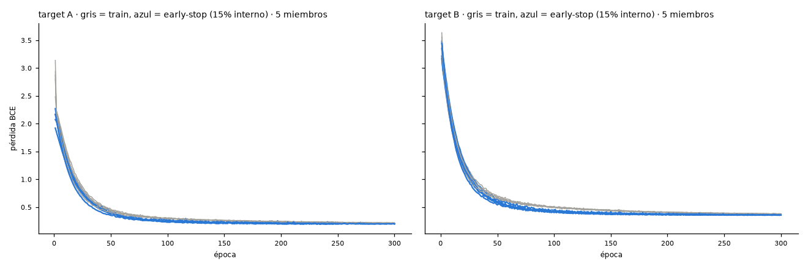
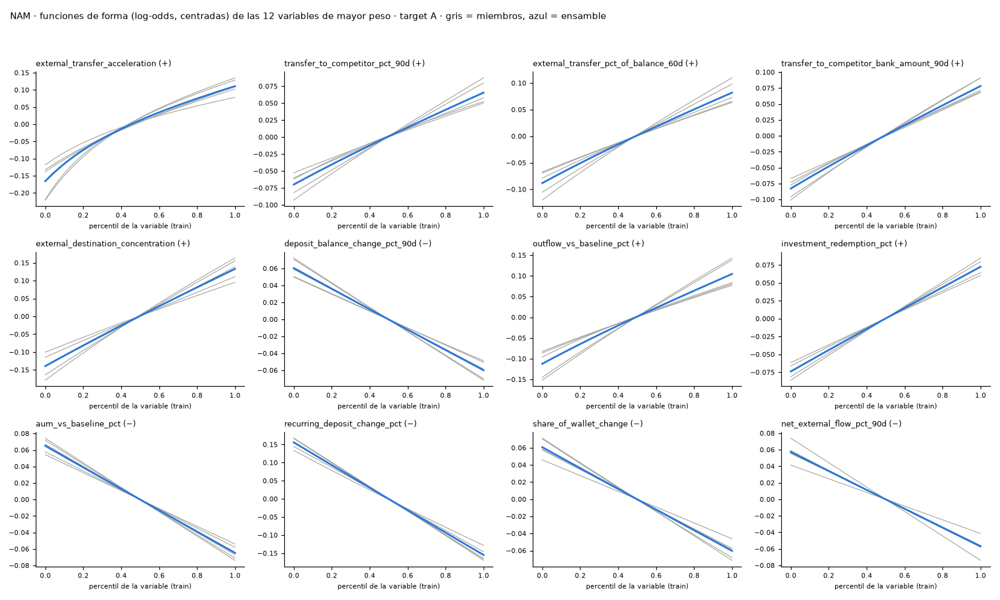

Dataset sintético, corte transversal: valida pipeline y metodología, no conclusiones sobre clientes reales.

# p09 · Fase 9 · NAM monótono (validación)

## summary

| clave | valor |
|:--|:--|
| parámetros | {"hidden_units": 16, "epochs_max": 300, "learning_rate": 0.003, "weight_decay": 0.0001, "dropout": 0.1, "ensemble_members": 5, "batch_size": 512, "patience": 30} |
| épocas por miembro (A) | [250, 246, 300, 300, 300] |
| épocas por miembro (B) | [300, 300, 300, 300, 300] |
| violaciones totales en variables duras | 0 |
| convergió (early stopping antes de epochs_max) | False |
| test abierto | False |

_Fuente: `outputs/p09/summary.json`_

## nam_validation

| target | modelo | segmento | hogares | eventos | AUC | PR-AUC | lift@5% | Brier |
|:--|:--|:--|:--|:--|:--|:--|:--|:--|
| A | NAM monótono | pooled | 2727 | 164 | 0.7708 | 0.2552 | 5.502 | 0.05119 |
| A | NAM monótono | HNW | 2576 | 153 | 0.7685 | 0.2619 | 5.873 | 0.05027 |
| A | NAM monótono | UHNW | 151 | 11 | 0.7714 | 0.2324 | 1.716 | 0.0668 |
| A | EBM monótono (champion provisional) | pooled | 2727 | 164 | 0.78 | 0.2648 | 5.624 | 0.05032 |
| A | EBM monótono (champion provisional) | HNW | 2576 | 153 | 0.7801 | 0.2709 | 6.004 | 0.04944 |
| A | EBM monótono (champion provisional) | UHNW | 151 | 11 | 0.7565 | 0.2288 | 1.716 | 0.06536 |
| B | NAM monótono | pooled | 2698 | 375 | 0.7342 | 0.3483 | 3.571 | 0.1073 |
| B | NAM monótono | HNW | 2548 | 351 | 0.7331 | 0.3521 | 3.715 | 0.1059 |
| B | NAM monótono | UHNW | 150 | 24 | 0.7272 | 0.3053 | 1.562 | 0.1303 |
| B | EBM monótono (champion provisional) | pooled | 2698 | 375 | 0.7334 | 0.3529 | 3.677 | 0.1065 |
| B | EBM monótono (champion provisional) | HNW | 2548 | 351 | 0.7358 | 0.3596 | 3.887 | 0.105 |
| B | EBM monótono (champion provisional) | UHNW | 150 | 24 | 0.6842 | 0.2757 | 0.7812 | 0.1334 |

_Fuente: `outputs/p09/nam_validation.csv`_

## alite_fair_validation

| target | modelo | hogares | eventos | AUC | PR-AUC | lift@5% | Brier |
|:--|:--|:--|:--|:--|:--|:--|:--|
| A | A-lite (congelado) | 823 | 56 | 0.7368 | 0.2682 | 6.094 | 0.0564 |
| A | NAM monótono | 823 | 56 | 0.7424 | 0.3205 | 6.094 | 0.05504 |
| A | EBM monótono | 823 | 56 | 0.75 | 0.3274 | 6.452 | 0.05472 |
| B | A-lite (congelado) | 817 | 115 | 0.7106 | 0.3237 | 3.639 | 0.1174 |
| B | NAM monótono | 817 | 115 | 0.7175 | 0.3558 | 3.639 | 0.1092 |
| B | EBM monótono | 817 | 115 | 0.7161 | 0.356 | 3.812 | 0.1083 |

_Fuente: `outputs/p09/alite_fair_validation.csv`_

## training_curve

_Fuente: `outputs/p09/training_curve.png`_

## shape_functions_A

_Fuente: `outputs/p09/shape_functions_A.png`_

## monotonicity_violations

Monotonía por construcción (pesos ≥ 0 + tanh); se verifica igual en funciones de forma e ICE.

| target | feature | signo | violaciones forma (miembros) | violaciones forma (ensamble) | violaciones ICE |
|:--|:--|:--|:--|:--|:--|
| A | has_credit_anchor | − | 0 | 0 | 0 |
| A | tenure_years | − | 0 | 0 | 0 |
| A | aum_outflow_pct_90d | + | 0 | 0 | 0 |
| A | deposit_balance_change_pct_90d | − | 0 | 0 | 0 |
| A | salary_deposit_stopped_flag | + | 0 | 0 | 0 |
| A | recurring_deposit_stopped_flag | + | 0 | 0 | 0 |
| A | recurring_deposit_change_pct | − | 0 | 0 | 0 |
| A | net_deposit_flow_pct_90d | − | 0 | 0 | 0 |
| A | external_transfer_pct_of_balance_60d | + | 0 | 0 | 0 |
| A | new_external_destinations_90d | + | 0 | 0 | 0 |
| A | investment_redemption_pct | + | 0 | 0 | 0 |
| A | products_closed_180d | + | 0 | 0 | 0 |
| A | banker_change_6m_flag | + | 0 | 0 | 0 |
| A | contact_gap_ratio | + | 0 | 0 | 0 |
| A | client_reply_rate | − | 0 | 0 | 0 |
| A | complaint_escalated_flag | + | 0 | 0 | 0 |
| A | complaint_age_days | + | 0 | 0 | 0 |
| A | aum_vs_baseline_pct | − | 0 | 0 | 0 |
| A | deposit_balance_vs_6m_avg_pct | − | 0 | 0 | 0 |
| A | pension_deposit_stopped_flag | + | 0 | 0 | 0 |
| A | business_payroll_stopped_flag | + | 0 | 0 | 0 |
| A | transfer_to_competitor_pct_90d | + | 0 | 0 | 0 |
| A | external_transfer_acceleration | + | 0 | 0 | 0 |
| A | net_external_flow_pct_90d | − | 0 | 0 | 0 |
| A | external_destination_concentration | + | 0 | 0 | 0 |
| A | outflow_vs_baseline_pct | + | 0 | 0 | 0 |
| A | fixed_income_maturity_not_reinvested | + | 0 | 0 | 0 |
| A | cash_pct_of_portfolio_chg | + | 0 | 0 | 0 |
| A | return_vs_benchmark | − | 0 | 0 | 0 |
| A | accounts_closed_90d | + | 0 | 0 | 0 |
| A | share_of_wallet | − | 0 | 0 | 0 |
| A | share_of_wallet_change | − | 0 | 0 | 0 |
| A | trustee_change_flag | + | 0 | 0 | 0 |
| A | repeat_complaint_flag | + | 0 | 0 | 0 |
| A | positions_liquidated_pct | + | 0 | 0 | 0 |
| A | meetings_cancelled_by_client | + | 0 | 0 | 0 |
| A | relationship_dissatisfaction_flag | + | 0 | 0 | 0 |
| A | aum_outflow_90d | + | 0 | 0 | 0 |
| A | transfer_to_competitor_bank_amount_90d | + | 0 | 0 | 0 |
| B | has_credit_anchor | − | 0 | 0 | 0 |
| B | tenure_years | − | 0 | 0 | 0 |
| B | aum_outflow_pct_90d | + | 0 | 0 | 0 |
| B | deposit_balance_change_pct_90d | − | 0 | 0 | 0 |
| B | salary_deposit_stopped_flag | + | 0 | 0 | 0 |
| B | recurring_deposit_stopped_flag | + | 0 | 0 | 0 |
| B | recurring_deposit_change_pct | − | 0 | 0 | 0 |
| B | net_deposit_flow_pct_90d | − | 0 | 0 | 0 |
| B | external_transfer_pct_of_balance_60d | + | 0 | 0 | 0 |
| B | new_external_destinations_90d | + | 0 | 0 | 0 |
| B | investment_redemption_pct | + | 0 | 0 | 0 |
| B | products_closed_180d | + | 0 | 0 | 0 |
| B | banker_change_6m_flag | + | 0 | 0 | 0 |
| B | contact_gap_ratio | + | 0 | 0 | 0 |
| B | client_reply_rate | − | 0 | 0 | 0 |
| B | complaint_escalated_flag | + | 0 | 0 | 0 |
| B | complaint_age_days | + | 0 | 0 | 0 |
| B | aum_vs_baseline_pct | − | 0 | 0 | 0 |
| B | deposit_balance_vs_6m_avg_pct | − | 0 | 0 | 0 |
| B | pension_deposit_stopped_flag | + | 0 | 0 | 0 |
| B | business_payroll_stopped_flag | + | 0 | 0 | 0 |
| B | transfer_to_competitor_pct_90d | + | 0 | 0 | 0 |
| B | external_transfer_acceleration | + | 0 | 0 | 0 |
| B | net_external_flow_pct_90d | − | 0 | 0 | 0 |
| B | external_destination_concentration | + | 0 | 0 | 0 |
| B | outflow_vs_baseline_pct | + | 0 | 0 | 0 |
| B | fixed_income_maturity_not_reinvested | + | 0 | 0 | 0 |
| B | cash_pct_of_portfolio_chg | + | 0 | 0 | 0 |
| B | return_vs_benchmark | − | 0 | 0 | 0 |
| B | accounts_closed_90d | + | 0 | 0 | 0 |
| B | share_of_wallet | − | 0 | 0 | 0 |
| B | share_of_wallet_change | − | 0 | 0 | 0 |
| B | trustee_change_flag | + | 0 | 0 | 0 |
| B | repeat_complaint_flag | + | 0 | 0 | 0 |
| B | positions_liquidated_pct | + | 0 | 0 | 0 |
| B | meetings_cancelled_by_client | + | 0 | 0 | 0 |
| B | relationship_dissatisfaction_flag | + | 0 | 0 | 0 |
| B | aum_outflow_90d | + | 0 | 0 | 0 |
| B | transfer_to_competitor_bank_amount_90d | + | 0 | 0 | 0 |

_Fuente: `outputs/p09/monotonicity_violations.csv`_

## training_curve

| semilla | época | pérdida train | pérdida early-stop | PR-AUC early-stop | target |
|:--|:--|:--|:--|:--|:--|
| 42 | 1 | 3.136 | 1.92 | 0.2582 | A |
| 42 | 2 | 2.236 | 1.849 | 0.257 | A |
| 42 | 3 | 2.165 | 1.783 | 0.2558 | A |
| 42 | 4 | 2.091 | 1.707 | 0.2559 | A |
| 42 | 5 | 1.993 | 1.638 | 0.2547 | A |
| 42 | 6 | 1.921 | 1.57 | 0.2533 | A |
| 42 | 7 | 1.833 | 1.502 | 0.2517 | A |
| 42 | 8 | 1.751 | 1.437 | 0.2514 | A |
| 42 | 9 | 1.668 | 1.376 | 0.2511 | A |
| 42 | 10 | 1.605 | 1.318 | 0.25 | A |
| 42 | 11 | 1.518 | 1.26 | 0.2491 | A |
| 42 | 12 | 1.465 | 1.207 | 0.2492 | A |
| 42 | 13 | 1.389 | 1.159 | 0.2488 | A |
| 42 | 14 | 1.332 | 1.112 | 0.2482 | A |
| 42 | 15 | 1.301 | 1.069 | 0.248 | A |
| 42 | 16 | 1.225 | 1.024 | 0.2472 | A |
| 42 | 17 | 1.18 | 0.9807 | 0.2462 | A |
| 42 | 18 | 1.11 | 0.9424 | 0.2443 | A |
| 42 | 19 | 1.087 | 0.9079 | 0.2451 | A |
| 42 | 20 | 1.037 | 0.8737 | 0.2445 | A |
| 42 | 21 | 0.9951 | 0.8421 | 0.2446 | A |
| 42 | 22 | 0.9712 | 0.813 | 0.2448 | A |
| 42 | 23 | 0.9228 | 0.785 | 0.2447 | A |
| 42 | 24 | 0.8971 | 0.7594 | 0.2428 | A |
| 42 | 25 | 0.8673 | 0.7354 | 0.242 | A |
| 42 | 26 | 0.8358 | 0.709 | 0.2413 | A |
| 42 | 27 | 0.7958 | 0.6892 | 0.2413 | A |
| 42 | 28 | 0.7766 | 0.6673 | 0.2402 | A |
| 42 | 29 | 0.7621 | 0.6465 | 0.239 | A |
| 42 | 30 | 0.7214 | 0.6273 | 0.2382 | A |
| 42 | 31 | 0.6996 | 0.6107 | 0.2389 | A |
| 42 | 32 | 0.69 | 0.5961 | 0.2388 | A |
| 42 | 33 | 0.6835 | 0.5755 | 0.2398 | A |
| 42 | 34 | 0.6575 | 0.5615 | 0.2379 | A |
| 42 | 35 | 0.6339 | 0.5463 | 0.2388 | A |
| 42 | 36 | 0.6222 | 0.5378 | 0.2388 | A |
| 42 | 37 | 0.6043 | 0.5174 | 0.239 | A |
| 42 | 38 | 0.5841 | 0.5031 | 0.2392 | A |
| 42 | 39 | 0.5746 | 0.4931 | 0.2404 | A |
| 42 | 40 | 0.5715 | 0.4781 | 0.2411 | A |
| 42 | 41 | 0.5567 | 0.4717 | 0.2412 | A |
| 42 | 42 | 0.5288 | 0.4637 | 0.243 | A |
| 42 | 43 | 0.5183 | 0.4468 | 0.2401 | A |
| 42 | 44 | 0.517 | 0.4393 | 0.2403 | A |
| 42 | 45 | 0.5049 | 0.4282 | 0.2388 | A |
| 42 | 46 | 0.493 | 0.4189 | 0.2393 | A |
| 42 | 47 | 0.4879 | 0.4136 | 0.2395 | A |
| 42 | 48 | 0.4721 | 0.3994 | 0.2401 | A |
| 42 | 49 | 0.4811 | 0.3987 | 0.2392 | A |
| 42 | 50 | 0.4603 | 0.384 | 0.2412 | A |
| 42 | 51 | 0.444 | 0.3773 | 0.2415 | A |
| 42 | 52 | 0.4463 | 0.3761 | 0.2418 | A |
| 42 | 53 | 0.4407 | 0.3754 | 0.2411 | A |
| 42 | 54 | 0.4428 | 0.3641 | 0.2425 | A |
| 42 | 55 | 0.4265 | 0.3511 | 0.241 | A |
| 42 | 56 | 0.4291 | 0.3476 | 0.2439 | A |
| 42 | 57 | 0.4229 | 0.3427 | 0.2406 | A |
| 42 | 58 | 0.4179 | 0.3376 | 0.2414 | A |
| 42 | 59 | 0.4068 | 0.3293 | 0.2429 | A |
| 42 | 60 | 0.419 | 0.3265 | 0.2433 | A |
| 42 | 61 | 0.3932 | 0.3308 | 0.2435 | A |
| 42 | 62 | 0.3899 | 0.3337 | 0.2436 | A |
| 42 | 63 | 0.3975 | 0.3293 | 0.2445 | A |
| 42 | 64 | 0.3883 | 0.3162 | 0.2442 | A |
| 42 | 65 | 0.3774 | 0.3044 | 0.245 | A |
| 42 | 66 | 0.376 | 0.3157 | 0.2456 | A |
| 42 | 67 | 0.374 | 0.3242 | 0.2457 | A |
| 42 | 68 | 0.3744 | 0.3073 | 0.2453 | A |
| 42 | 69 | 0.3597 | 0.2913 | 0.2453 | A |
| 42 | 70 | 0.3665 | 0.294 | 0.2443 | A |
| 42 | 71 | 0.3636 | 0.2846 | 0.2454 | A |
| 42 | 72 | 0.3579 | 0.2787 | 0.2469 | A |
| 42 | 73 | 0.3587 | 0.2848 | 0.2484 | A |
| 42 | 74 | 0.3569 | 0.2846 | 0.249 | A |
| 42 | 75 | 0.3418 | 0.2978 | 0.2486 | A |
| 42 | 76 | 0.3639 | 0.3022 | 0.2486 | A |
| 42 | 77 | 0.3426 | 0.2761 | 0.2496 | A |
| 42 | 78 | 0.3525 | 0.2621 | 0.2496 | A |
| 42 | 79 | 0.336 | 0.2603 | 0.2512 | A |
| 42 | 80 | 0.3384 | 0.2698 | 0.2508 | A |
| 42 | 81 | 0.3317 | 0.259 | 0.2503 | A |
| 42 | 82 | 0.3381 | 0.2675 | 0.2509 | A |
| 42 | 83 | 0.3295 | 0.2698 | 0.2474 | A |
| 42 | 84 | 0.3305 | 0.2561 | 0.2475 | A |
| 42 | 85 | 0.3194 | 0.2779 | 0.2512 | A |
| 42 | 86 | 0.322 | 0.2518 | 0.248 | A |
| 42 | 87 | 0.3265 | 0.2502 | 0.25 | A |
| 42 | 88 | 0.3214 | 0.2507 | 0.2478 | A |
| 42 | 89 | 0.3302 | 0.278 | 0.2487 | A |
| 42 | 90 | 0.3225 | 0.2661 | 0.2498 | A |
| 42 | 91 | 0.3143 | 0.2663 | 0.2491 | A |
| 42 | 92 | 0.3095 | 0.2502 | 0.2494 | A |
| 42 | 93 | 0.3139 | 0.2418 | 0.2507 | A |
| 42 | 94 | 0.3084 | 0.243 | 0.2505 | A |
| 42 | 95 | 0.2982 | 0.2349 | 0.2511 | A |
| 42 | 96 | 0.307 | 0.2349 | 0.2535 | A |
| 42 | 97 | 0.3075 | 0.2358 | 0.2514 | A |
| 42 | 98 | 0.313 | 0.2357 | 0.2512 | A |
| 42 | 99 | 0.3046 | 0.2352 | 0.2522 | A |
| 42 | 100 | 0.3031 | 0.2301 | 0.2542 | A |
| 42 | 101 | 0.3089 | 0.229 | 0.2538 | A |
| 42 | 102 | 0.3033 | 0.2426 | 0.2526 | A |
| 42 | 103 | 0.2919 | 0.2498 | 0.253 | A |
| 42 | 104 | 0.2945 | 0.2346 | 0.2536 | A |
| 42 | 105 | 0.2991 | 0.2393 | 0.2544 | A |
| 42 | 106 | 0.2974 | 0.2336 | 0.2553 | A |
| 42 | 107 | 0.2916 | 0.2295 | 0.2542 | A |
| 42 | 108 | 0.2828 | 0.225 | 0.2544 | A |
| 42 | 109 | 0.2961 | 0.2284 | 0.2555 | A |
| 42 | 110 | 0.2977 | 0.2368 | 0.2551 | A |
| 42 | 111 | 0.2884 | 0.2229 | 0.2548 | A |
| 42 | 112 | 0.286 | 0.2269 | 0.2544 | A |
| 42 | 113 | 0.2918 | 0.2168 | 0.2576 | A |
| 42 | 114 | 0.2952 | 0.2182 | 0.2575 | A |
| 42 | 115 | 0.2869 | 0.2331 | 0.2565 | A |
| 42 | 116 | 0.2876 | 0.2402 | 0.2559 | A |
| 42 | 117 | 0.2842 | 0.2175 | 0.2574 | A |
| 42 | 118 | 0.2869 | 0.2185 | 0.2579 | A |
| 42 | 119 | 0.2787 | 0.2224 | 0.2582 | A |
| 42 | 120 | 0.2844 | 0.2341 | 0.2577 | A |
| 42 | 121 | 0.2917 | 0.227 | 0.2572 | A |
| 42 | 122 | 0.273 | 0.2121 | 0.2629 | A |
| 42 | 123 | 0.2861 | 0.217 | 0.2584 | A |
| 42 | 124 | 0.2784 | 0.2182 | 0.2597 | A |
| 42 | 125 | 0.2704 | 0.2234 | 0.2581 | A |
| 42 | 126 | 0.2794 | 0.2234 | 0.2587 | A |
| 42 | 127 | 0.2751 | 0.2304 | 0.259 | A |
| 42 | 128 | 0.2715 | 0.2142 | 0.2602 | A |
| 42 | 129 | 0.2777 | 0.217 | 0.2597 | A |
| 42 | 130 | 0.2723 | 0.2089 | 0.2578 | A |
| 42 | 131 | 0.272 | 0.2185 | 0.2597 | A |
| 42 | 132 | 0.2781 | 0.2126 | 0.2626 | A |
| 42 | 133 | 0.2629 | 0.2075 | 0.2621 | A |
| 42 | 134 | 0.2721 | 0.2074 | 0.263 | A |
| 42 | 135 | 0.268 | 0.2252 | 0.2632 | A |
| 42 | 136 | 0.2766 | 0.2183 | 0.2602 | A |
| 42 | 137 | 0.2642 | 0.2082 | 0.2623 | A |
| 42 | 138 | 0.2682 | 0.2087 | 0.2621 | A |
| 42 | 139 | 0.2662 | 0.209 | 0.2633 | A |
| 42 | 140 | 0.2689 | 0.2205 | 0.2639 | A |
| 42 | 141 | 0.2711 | 0.216 | 0.2596 | A |
| 42 | 142 | 0.2716 | 0.2085 | 0.259 | A |
| 42 | 143 | 0.265 | 0.2034 | 0.2656 | A |
| 42 | 144 | 0.2633 | 0.2031 | 0.2669 | A |
| 42 | 145 | 0.2642 | 0.2029 | 0.2644 | A |
| 42 | 146 | 0.2599 | 0.2144 | 0.2659 | A |
| 42 | 147 | 0.2649 | 0.21 | 0.2654 | A |
| 42 | 148 | 0.2661 | 0.21 | 0.2707 | A |
| 42 | 149 | 0.2617 | 0.2028 | 0.2717 | A |
| 42 | 150 | 0.2654 | 0.2324 | 0.272 | A |
| 42 | 151 | 0.2565 | 0.2084 | 0.265 | A |
| 42 | 152 | 0.2625 | 0.2145 | 0.2657 | A |
| 42 | 153 | 0.2587 | 0.2037 | 0.2656 | A |
| 42 | 154 | 0.2628 | 0.2518 | 0.2718 | A |
| 42 | 155 | 0.2598 | 0.2144 | 0.2722 | A |
| 42 | 156 | 0.2547 | 0.2134 | 0.2692 | A |
| 42 | 157 | 0.2604 | 0.1995 | 0.2671 | A |
| 42 | 158 | 0.2591 | 0.2051 | 0.2679 | A |
| 42 | 159 | 0.2609 | 0.2001 | 0.2697 | A |
| 42 | 160 | 0.255 | 0.209 | 0.2666 | A |
| 42 | 161 | 0.2595 | 0.2015 | 0.2687 | A |
| 42 | 162 | 0.2533 | 0.2106 | 0.2653 | A |
| 42 | 163 | 0.2537 | 0.2325 | 0.271 | A |
| 42 | 164 | 0.2603 | 0.2093 | 0.2665 | A |
| 42 | 165 | 0.256 | 0.2113 | 0.2671 | A |
| 42 | 166 | 0.2547 | 0.2151 | 0.27 | A |
| 42 | 167 | 0.2536 | 0.202 | 0.2698 | A |
| 42 | 168 | 0.2533 | 0.2047 | 0.269 | A |
| 42 | 169 | 0.2567 | 0.2177 | 0.2696 | A |
| 42 | 170 | 0.2559 | 0.1963 | 0.2721 | A |
| 42 | 171 | 0.2558 | 0.2088 | 0.2706 | A |
| 42 | 172 | 0.2554 | 0.2176 | 0.2697 | A |
| 42 | 173 | 0.2495 | 0.2205 | 0.266 | A |
| 42 | 174 | 0.256 | 0.2084 | 0.2665 | A |
| 42 | 175 | 0.248 | 0.2027 | 0.2725 | A |
| 42 | 176 | 0.2515 | 0.1983 | 0.2722 | A |
| 42 | 177 | 0.2482 | 0.1965 | 0.2722 | A |
| 42 | 178 | 0.2476 | 0.1964 | 0.274 | A |
| 42 | 179 | 0.2463 | 0.2068 | 0.2715 | A |
| 42 | 180 | 0.2515 | 0.2072 | 0.2737 | A |
| 42 | 181 | 0.2523 | 0.2041 | 0.2786 | A |
| 42 | 182 | 0.249 | 0.1985 | 0.2721 | A |
| 42 | 183 | 0.2428 | 0.2226 | 0.2725 | A |
| 42 | 184 | 0.2457 | 0.2023 | 0.2739 | A |
| 42 | 185 | 0.2411 | 0.2067 | 0.279 | A |
| 42 | 186 | 0.2443 | 0.2135 | 0.2759 | A |
| 42 | 187 | 0.2409 | 0.1958 | 0.2723 | A |
| 42 | 188 | 0.2464 | 0.2013 | 0.2772 | A |
| 42 | 189 | 0.244 | 0.216 | 0.2752 | A |
| 42 | 190 | 0.2552 | 0.2161 | 0.2714 | A |
| 42 | 191 | 0.2506 | 0.2073 | 0.2742 | A |
| 42 | 192 | 0.2568 | 0.2002 | 0.2759 | A |
| 42 | 193 | 0.246 | 0.207 | 0.2743 | A |
| 42 | 194 | 0.2444 | 0.197 | 0.2705 | A |
| 42 | 195 | 0.2379 | 0.2046 | 0.2705 | A |
| 42 | 196 | 0.2449 | 0.1995 | 0.2746 | A |
| 42 | 197 | 0.2411 | 0.194 | 0.2728 | A |
| 42 | 198 | 0.2433 | 0.1961 | 0.271 | A |
| 42 | 199 | 0.2435 | 0.1978 | 0.2724 | A |
| 42 | 200 | 0.2448 | 0.1992 | 0.2723 | A |
| 42 | 201 | 0.2409 | 0.1954 | 0.2795 | A |
| 42 | 202 | 0.2415 | 0.1951 | 0.2795 | A |
| 42 | 203 | 0.2415 | 0.1937 | 0.2798 | A |
| 42 | 204 | 0.2474 | 0.1937 | 0.28 | A |
| 42 | 205 | 0.2363 | 0.1935 | 0.2809 | A |
| 42 | 206 | 0.2392 | 0.1985 | 0.2796 | A |
| 42 | 207 | 0.2361 | 0.1971 | 0.28 | A |
| 42 | 208 | 0.2359 | 0.2121 | 0.2811 | A |
| 42 | 209 | 0.2342 | 0.1969 | 0.2832 | A |
| 42 | 210 | 0.2329 | 0.2002 | 0.2775 | A |
| 42 | 211 | 0.2366 | 0.1969 | 0.275 | A |
| 42 | 212 | 0.2364 | 0.1933 | 0.2736 | A |
| 42 | 213 | 0.2369 | 0.1944 | 0.2728 | A |
| 42 | 214 | 0.2295 | 0.2021 | 0.2796 | A |
| 42 | 215 | 0.2375 | 0.2012 | 0.2794 | A |
| 42 | 216 | 0.2313 | 0.2002 | 0.277 | A |
| 42 | 217 | 0.2319 | 0.1927 | 0.2742 | A |
| 42 | 218 | 0.2464 | 0.1972 | 0.2731 | A |
| 42 | 219 | 0.2327 | 0.193 | 0.273 | A |
| 42 | 220 | 0.2382 | 0.1918 | 0.2742 | A |
| 42 | 221 | 0.2303 | 0.2029 | 0.2728 | A |
| 42 | 222 | 0.2303 | 0.1965 | 0.2796 | A |
| 42 | 223 | 0.2342 | 0.2022 | 0.2794 | A |
| 42 | 224 | 0.2361 | 0.2028 | 0.2787 | A |
| 42 | 225 | 0.2349 | 0.1928 | 0.2796 | A |
| 42 | 226 | 0.2342 | 0.1989 | 0.2788 | A |
| 42 | 227 | 0.2319 | 0.1973 | 0.2744 | A |
| 42 | 228 | 0.2315 | 0.2034 | 0.2739 | A |
| 42 | 229 | 0.2325 | 0.1953 | 0.2722 | A |
| 42 | 230 | 0.2344 | 0.2036 | 0.2805 | A |
| 42 | 231 | 0.2321 | 0.1944 | 0.2792 | A |
| 42 | 232 | 0.2339 | 0.1929 | 0.2731 | A |
| 42 | 233 | 0.2317 | 0.2031 | 0.2707 | A |
| 42 | 234 | 0.224 | 0.1931 | 0.2766 | A |
| 42 | 235 | 0.2339 | 0.192 | 0.2788 | A |
| 42 | 236 | 0.2295 | 0.1993 | 0.2737 | A |
| 42 | 237 | 0.2313 | 0.1934 | 0.2786 | A |
| 42 | 238 | 0.2309 | 0.1942 | 0.2772 | A |
| 42 | 239 | 0.2242 | 0.1919 | 0.2788 | A |
| 42 | 240 | 0.2249 | 0.1918 | 0.2763 | A |
| 42 | 241 | 0.2333 | 0.1986 | 0.2832 | A |
| 42 | 242 | 0.2305 | 0.2088 | 0.2817 | A |
| 42 | 243 | 0.2297 | 0.1937 | 0.2787 | A |
| 42 | 244 | 0.2306 | 0.1986 | 0.2801 | A |
| 42 | 245 | 0.2374 | 0.1926 | 0.2777 | A |
| 42 | 246 | 0.2292 | 0.1951 | 0.2836 | A |
| 42 | 247 | 0.224 | 0.2025 | 0.276 | A |
| 42 | 248 | 0.2324 | 0.195 | 0.2755 | A |
| 42 | 249 | 0.2252 | 0.1956 | 0.273 | A |
| 42 | 250 | 0.2251 | 0.196 | 0.2755 | A |
| 43 | 1 | 2.872 | 2.168 | 0.1775 | A |
| 43 | 2 | 2.226 | 2.116 | 0.1782 | A |
| 43 | 3 | 2.145 | 2.007 | 0.1782 | A |
| 43 | 4 | 2.034 | 1.912 | 0.1781 | A |
| 43 | 5 | 1.946 | 1.824 | 0.1782 | A |
| 43 | 6 | 1.85 | 1.747 | 0.1784 | A |
| 43 | 7 | 1.755 | 1.667 | 0.1783 | A |
| 43 | 8 | 1.686 | 1.591 | 0.1773 | A |
| 43 | 9 | 1.6 | 1.514 | 0.1772 | A |
| 43 | 10 | 1.507 | 1.45 | 0.1768 | A |
| 43 | 11 | 1.451 | 1.382 | 0.1768 | A |
| 43 | 12 | 1.384 | 1.321 | 0.1763 | A |
| 43 | 13 | 1.326 | 1.258 | 0.176 | A |
| 43 | 14 | 1.255 | 1.198 | 0.1804 | A |
| 43 | 15 | 1.207 | 1.151 | 0.1799 | A |
| 43 | 16 | 1.152 | 1.102 | 0.1795 | A |
| 43 | 17 | 1.097 | 1.055 | 0.179 | A |
| 43 | 18 | 1.049 | 1.013 | 0.1787 | A |
| 43 | 19 | 1.019 | 0.9712 | 0.1791 | A |
| 43 | 20 | 0.9621 | 0.9328 | 0.1791 | A |
| 43 | 21 | 0.9382 | 0.8941 | 0.1781 | A |
| 43 | 22 | 0.8977 | 0.8768 | 0.178 | A |
| 43 | 23 | 0.8854 | 0.8298 | 0.1774 | A |
| 43 | 24 | 0.8379 | 0.8043 | 0.1782 | A |
| 43 | 25 | 0.8094 | 0.7738 | 0.1786 | A |
| 43 | 26 | 0.7801 | 0.7574 | 0.1785 | A |
| 43 | 27 | 0.7522 | 0.7201 | 0.1787 | A |
| 43 | 28 | 0.7256 | 0.7264 | 0.1788 | A |
| 43 | 29 | 0.7022 | 0.6775 | 0.1786 | A |
| 43 | 30 | 0.6847 | 0.6566 | 0.1784 | A |
| 43 | 31 | 0.6759 | 0.6367 | 0.179 | A |
| 43 | 32 | 0.6407 | 0.6173 | 0.1789 | A |
| 43 | 33 | 0.6275 | 0.6021 | 0.1793 | A |
| 43 | 34 | 0.6222 | 0.585 | 0.1788 | A |
| 43 | 35 | 0.595 | 0.58 | 0.1781 | A |
| 43 | 36 | 0.5758 | 0.5557 | 0.1795 | A |
| 43 | 37 | 0.5732 | 0.5472 | 0.1804 | A |
| 43 | 38 | 0.5541 | 0.5183 | 0.1813 | A |
| 43 | 39 | 0.5362 | 0.5025 | 0.1811 | A |
| 43 | 40 | 0.5366 | 0.4909 | 0.1826 | A |
| 43 | 41 | 0.5244 | 0.4767 | 0.1831 | A |
| 43 | 42 | 0.5084 | 0.4768 | 0.1834 | A |
| 43 | 43 | 0.4728 | 0.4637 | 0.1833 | A |
| 43 | 44 | 0.4769 | 0.4652 | 0.182 | A |
| 43 | 45 | 0.4805 | 0.4546 | 0.1828 | A |
| 43 | 46 | 0.4775 | 0.4244 | 0.1838 | A |
| 43 | 47 | 0.4623 | 0.4184 | 0.1854 | A |
| 43 | 48 | 0.44 | 0.4152 | 0.1855 | A |
| 43 | 49 | 0.4382 | 0.4205 | 0.1834 | A |
| 43 | 50 | 0.4259 | 0.4001 | 0.184 | A |
| 43 | 51 | 0.4298 | 0.387 | 0.1858 | A |
| 43 | 52 | 0.4213 | 0.3776 | 0.1865 | A |
| 43 | 53 | 0.4057 | 0.3751 | 0.1889 | A |
| 43 | 54 | 0.4032 | 0.3725 | 0.1888 | A |
| 43 | 55 | 0.4052 | 0.3781 | 0.1897 | A |
| 43 | 56 | 0.4068 | 0.3655 | 0.1888 | A |
| 43 | 57 | 0.3957 | 0.3435 | 0.1914 | A |
| 43 | 58 | 0.401 | 0.3419 | 0.1916 | A |
| 43 | 59 | 0.3761 | 0.3412 | 0.1924 | A |
| 43 | 60 | 0.3795 | 0.3337 | 0.1902 | A |
| 43 | 61 | 0.3661 | 0.3491 | 0.1887 | A |
| 43 | 62 | 0.375 | 0.3318 | 0.1916 | A |
| 43 | 63 | 0.3779 | 0.3187 | 0.1929 | A |
| 43 | 64 | 0.3633 | 0.3242 | 0.1933 | A |
| 43 | 65 | 0.3561 | 0.3122 | 0.1925 | A |
| 43 | 66 | 0.3477 | 0.3199 | 0.1924 | A |
| 43 | 67 | 0.3478 | 0.3172 | 0.1906 | A |
| 43 | 68 | 0.3479 | 0.2997 | 0.1944 | A |
| 43 | 69 | 0.3454 | 0.2964 | 0.1946 | A |
| 43 | 70 | 0.357 | 0.2913 | 0.1957 | A |
| 43 | 71 | 0.3516 | 0.2916 | 0.196 | A |
| 43 | 72 | 0.3494 | 0.2879 | 0.1936 | A |
| 43 | 73 | 0.3404 | 0.2889 | 0.1972 | A |
| 43 | 74 | 0.3247 | 0.2934 | 0.1965 | A |
| 43 | 75 | 0.3276 | 0.2864 | 0.1964 | A |
| 43 | 76 | 0.3253 | 0.2968 | 0.1956 | A |
| 43 | 77 | 0.3281 | 0.2915 | 0.195 | A |
| 43 | 78 | 0.3288 | 0.2793 | 0.1975 | A |
| 43 | 79 | 0.3197 | 0.271 | 0.198 | A |
| 43 | 80 | 0.3179 | 0.2842 | 0.1999 | A |
| 43 | 81 | 0.3186 | 0.2916 | 0.1972 | A |
| 43 | 82 | 0.3142 | 0.2687 | 0.1968 | A |
| 43 | 83 | 0.3112 | 0.2638 | 0.1976 | A |
| 43 | 84 | 0.3212 | 0.2599 | 0.1993 | A |
| 43 | 85 | 0.3056 | 0.2638 | 0.2023 | A |
| 43 | 86 | 0.3009 | 0.2615 | 0.202 | A |
| 43 | 87 | 0.3088 | 0.2653 | 0.2023 | A |
| 43 | 88 | 0.3115 | 0.2839 | 0.2015 | A |
| 43 | 89 | 0.299 | 0.2766 | 0.2035 | A |
| 43 | 90 | 0.3094 | 0.2607 | 0.2057 | A |
| 43 | 91 | 0.3057 | 0.2619 | 0.2045 | A |
| 43 | 92 | 0.3064 | 0.2645 | 0.203 | A |
| 43 | 93 | 0.2961 | 0.2542 | 0.2002 | A |
| 43 | 94 | 0.2958 | 0.2483 | 0.2049 | A |
| 43 | 95 | 0.2939 | 0.244 | 0.2022 | A |
| 43 | 96 | 0.2955 | 0.2535 | 0.2048 | A |
| 43 | 97 | 0.2945 | 0.2487 | 0.2059 | A |
| 43 | 98 | 0.2929 | 0.2459 | 0.2067 | A |
| 43 | 99 | 0.2888 | 0.2531 | 0.2108 | A |
| 43 | 100 | 0.2904 | 0.2546 | 0.2061 | A |
| 43 | 101 | 0.2833 | 0.2666 | 0.2045 | A |
| 43 | 102 | 0.2872 | 0.2495 | 0.2041 | A |
| 43 | 103 | 0.2872 | 0.2442 | 0.2053 | A |
| 43 | 104 | 0.2928 | 0.2532 | 0.2001 | A |
| 43 | 105 | 0.2875 | 0.2657 | 0.2057 | A |
| 43 | 106 | 0.2863 | 0.2491 | 0.2009 | A |
| 43 | 107 | 0.2858 | 0.2394 | 0.2044 | A |
| 43 | 108 | 0.2872 | 0.2524 | 0.2116 | A |
| 43 | 109 | 0.2836 | 0.2506 | 0.2113 | A |
| 43 | 110 | 0.2673 | 0.2485 | 0.2056 | A |
| 43 | 111 | 0.2755 | 0.2394 | 0.2055 | A |
| 43 | 112 | 0.2823 | 0.2372 | 0.2053 | A |
| 43 | 113 | 0.274 | 0.2313 | 0.2053 | A |
| 43 | 114 | 0.2752 | 0.2266 | 0.2071 | A |
| 43 | 115 | 0.2723 | 0.2447 | 0.2106 | A |
| 43 | 116 | 0.2742 | 0.254 | 0.2147 | A |
| 43 | 117 | 0.2742 | 0.2393 | 0.2128 | A |
| 43 | 118 | 0.2712 | 0.2369 | 0.2106 | A |
| 43 | 119 | 0.2715 | 0.226 | 0.2067 | A |
| 43 | 120 | 0.2696 | 0.2338 | 0.2065 | A |
| 43 | 121 | 0.2732 | 0.2469 | 0.2078 | A |
| 43 | 122 | 0.2658 | 0.241 | 0.2089 | A |
| 43 | 123 | 0.2696 | 0.2352 | 0.2123 | A |
| 43 | 124 | 0.267 | 0.2375 | 0.2149 | A |
| 43 | 125 | 0.2683 | 0.2351 | 0.2096 | A |
| 43 | 126 | 0.2762 | 0.2472 | 0.2104 | A |
| 43 | 127 | 0.2727 | 0.2218 | 0.2095 | A |
| 43 | 128 | 0.2741 | 0.2234 | 0.209 | A |
| 43 | 129 | 0.2691 | 0.2338 | 0.2086 | A |
| 43 | 130 | 0.272 | 0.2267 | 0.211 | A |
| 43 | 131 | 0.2705 | 0.2228 | 0.2113 | A |
| 43 | 132 | 0.2608 | 0.2313 | 0.2073 | A |
| 43 | 133 | 0.261 | 0.2308 | 0.2064 | A |
| 43 | 134 | 0.2584 | 0.2266 | 0.2102 | A |
| 43 | 135 | 0.2619 | 0.2178 | 0.2168 | A |
| 43 | 136 | 0.2553 | 0.2421 | 0.2177 | A |
| 43 | 137 | 0.262 | 0.2292 | 0.2135 | A |
| 43 | 138 | 0.2635 | 0.2145 | 0.2211 | A |
| 43 | 139 | 0.2574 | 0.2206 | 0.2169 | A |
| 43 | 140 | 0.2593 | 0.2392 | 0.2185 | A |
| 43 | 141 | 0.2589 | 0.2119 | 0.2187 | A |
| 43 | 142 | 0.2592 | 0.2194 | 0.218 | A |
| 43 | 143 | 0.2562 | 0.2402 | 0.2124 | A |
| 43 | 144 | 0.2546 | 0.2452 | 0.2126 | A |
| 43 | 145 | 0.255 | 0.2363 | 0.219 | A |
| 43 | 146 | 0.2621 | 0.2117 | 0.2216 | A |
| 43 | 147 | 0.252 | 0.2149 | 0.2189 | A |
| 43 | 148 | 0.2565 | 0.2121 | 0.2173 | A |
| 43 | 149 | 0.2536 | 0.2236 | 0.2144 | A |
| 43 | 150 | 0.256 | 0.218 | 0.2172 | A |
| 43 | 151 | 0.2507 | 0.2175 | 0.2213 | A |
| 43 | 152 | 0.2493 | 0.2103 | 0.221 | A |
| 43 | 153 | 0.2617 | 0.2171 | 0.213 | A |
| 43 | 154 | 0.2537 | 0.2286 | 0.2197 | A |
| 43 | 155 | 0.2525 | 0.2147 | 0.2162 | A |
| 43 | 156 | 0.2605 | 0.2099 | 0.2174 | A |
| 43 | 157 | 0.2563 | 0.2212 | 0.2226 | A |
| 43 | 158 | 0.2459 | 0.2376 | 0.224 | A |
| 43 | 159 | 0.2507 | 0.2206 | 0.2266 | A |
| 43 | 160 | 0.2438 | 0.226 | 0.2241 | A |
| 43 | 161 | 0.2458 | 0.2131 | 0.2171 | A |
| 43 | 162 | 0.2506 | 0.2234 | 0.2184 | A |
| 43 | 163 | 0.2449 | 0.2123 | 0.2196 | A |
| 43 | 164 | 0.2448 | 0.2159 | 0.2227 | A |
| 43 | 165 | 0.2476 | 0.2161 | 0.2188 | A |
| 43 | 166 | 0.2503 | 0.2226 | 0.227 | A |
| 43 | 167 | 0.2483 | 0.2093 | 0.2242 | A |
| 43 | 168 | 0.2534 | 0.2309 | 0.2222 | A |
| 43 | 169 | 0.2495 | 0.2084 | 0.2226 | A |
| 43 | 170 | 0.2401 | 0.228 | 0.2215 | A |
| 43 | 171 | 0.2459 | 0.2229 | 0.2214 | A |
| 43 | 172 | 0.2482 | 0.2077 | 0.2255 | A |
| 43 | 173 | 0.2504 | 0.2097 | 0.223 | A |
| 43 | 174 | 0.2447 | 0.2145 | 0.2166 | A |
| 43 | 175 | 0.2429 | 0.2202 | 0.2195 | A |
| 43 | 176 | 0.2426 | 0.2183 | 0.2168 | A |
| 43 | 177 | 0.2425 | 0.2068 | 0.2197 | A |
| 43 | 178 | 0.2475 | 0.2223 | 0.2211 | A |
| 43 | 179 | 0.2457 | 0.2288 | 0.2243 | A |
| 43 | 180 | 0.2401 | 0.2094 | 0.2188 | A |
| 43 | 181 | 0.2461 | 0.2126 | 0.2203 | A |
| 43 | 182 | 0.2432 | 0.2174 | 0.2233 | A |
| 43 | 183 | 0.2448 | 0.2292 | 0.2241 | A |
| 43 | 184 | 0.2418 | 0.2116 | 0.2256 | A |
| 43 | 185 | 0.2339 | 0.2124 | 0.2297 | A |
| 43 | 186 | 0.2417 | 0.2063 | 0.2295 | A |
| 43 | 187 | 0.2364 | 0.2118 | 0.2249 | A |
| 43 | 188 | 0.2365 | 0.2102 | 0.2247 | A |
| 43 | 189 | 0.2447 | 0.2103 | 0.2299 | A |
| 43 | 190 | 0.2386 | 0.2149 | 0.2282 | A |
| 43 | 191 | 0.2403 | 0.2125 | 0.2254 | A |
| 43 | 192 | 0.2406 | 0.2049 | 0.229 | A |
| 43 | 193 | 0.2339 | 0.205 | 0.2226 | A |
| 43 | 194 | 0.2377 | 0.2078 | 0.2263 | A |
| 43 | 195 | 0.2335 | 0.2109 | 0.2252 | A |
| 43 | 196 | 0.2315 | 0.2108 | 0.2241 | A |
| 43 | 197 | 0.2326 | 0.213 | 0.2242 | A |
| 43 | 198 | 0.235 | 0.2118 | 0.2296 | A |
| 43 | 199 | 0.2335 | 0.2058 | 0.2302 | A |
| 43 | 200 | 0.2338 | 0.2089 | 0.2291 | A |
| 43 | 201 | 0.2312 | 0.205 | 0.2271 | A |
| 43 | 202 | 0.2295 | 0.2153 | 0.227 | A |
| 43 | 203 | 0.2332 | 0.2091 | 0.23 | A |
| 43 | 204 | 0.2367 | 0.2067 | 0.2286 | A |
| 43 | 205 | 0.232 | 0.2033 | 0.2265 | A |
| 43 | 206 | 0.2397 | 0.2203 | 0.2266 | A |
| 43 | 207 | 0.2338 | 0.2094 | 0.222 | A |
| 43 | 208 | 0.2313 | 0.2136 | 0.2271 | A |
| 43 | 209 | 0.235 | 0.2043 | 0.2263 | A |
| 43 | 210 | 0.2318 | 0.2148 | 0.2263 | A |
| 43 | 211 | 0.2349 | 0.2169 | 0.2291 | A |
| 43 | 212 | 0.2314 | 0.2091 | 0.2325 | A |
| 43 | 213 | 0.2276 | 0.2072 | 0.23 | A |
| 43 | 214 | 0.2307 | 0.2089 | 0.2261 | A |
| 43 | 215 | 0.2268 | 0.2094 | 0.2267 | A |
| 43 | 216 | 0.226 | 0.2008 | 0.2318 | A |
| 43 | 217 | 0.2288 | 0.2043 | 0.2321 | A |
| 43 | 218 | 0.2337 | 0.2102 | 0.2274 | A |
| 43 | 219 | 0.2266 | 0.2081 | 0.2324 | A |
| 43 | 220 | 0.2266 | 0.2126 | 0.2315 | A |
| 43 | 221 | 0.2254 | 0.2028 | 0.2328 | A |
| 43 | 222 | 0.2232 | 0.2167 | 0.2313 | A |
| 43 | 223 | 0.2349 | 0.2045 | 0.2322 | A |
| 43 | 224 | 0.2307 | 0.2024 | 0.2326 | A |
| 43 | 225 | 0.2239 | 0.2055 | 0.2306 | A |
| 43 | 226 | 0.2283 | 0.205 | 0.2285 | A |
| 43 | 227 | 0.2243 | 0.2024 | 0.2318 | A |
| 43 | 228 | 0.2264 | 0.2052 | 0.2297 | A |
| 43 | 229 | 0.2275 | 0.219 | 0.2283 | A |
| 43 | 230 | 0.2264 | 0.2135 | 0.2283 | A |
| 43 | 231 | 0.2298 | 0.2085 | 0.2271 | A |
| 43 | 232 | 0.2268 | 0.2012 | 0.2296 | A |
| 43 | 233 | 0.2226 | 0.2037 | 0.2316 | A |
| 43 | 234 | 0.2221 | 0.2168 | 0.2321 | A |
| 43 | 235 | 0.226 | 0.2013 | 0.2336 | A |
| 43 | 236 | 0.2333 | 0.2047 | 0.2335 | A |
| 43 | 237 | 0.2234 | 0.2226 | 0.2334 | A |
| 43 | 238 | 0.2255 | 0.2056 | 0.2304 | A |
| 43 | 239 | 0.2238 | 0.2056 | 0.2239 | A |
| 43 | 240 | 0.2302 | 0.2052 | 0.2255 | A |
| 43 | 241 | 0.2223 | 0.203 | 0.2306 | A |
| 43 | 242 | 0.2245 | 0.2068 | 0.232 | A |
| 43 | 243 | 0.2219 | 0.2014 | 0.2309 | A |
| 43 | 244 | 0.2241 | 0.2066 | 0.228 | A |
| 43 | 245 | 0.2245 | 0.2055 | 0.2332 | A |
| 43 | 246 | 0.2222 | 0.2016 | 0.2326 | A |
| 44 | 1 | 2.936 | 2.072 | 0.1994 | A |
| 44 | 2 | 2.195 | 2.039 | 0.2017 | A |
| 44 | 3 | 2.129 | 1.958 | 0.2026 | A |
| 44 | 4 | 2.032 | 1.851 | 0.2027 | A |
| 44 | 5 | 1.952 | 1.768 | 0.2034 | A |
| 44 | 6 | 1.853 | 1.696 | 0.2029 | A |
| 44 | 7 | 1.761 | 1.627 | 0.2037 | A |
| 44 | 8 | 1.693 | 1.548 | 0.2042 | A |
| 44 | 9 | 1.623 | 1.477 | 0.2032 | A |
| 44 | 10 | 1.536 | 1.414 | 0.2051 | A |
| 44 | 11 | 1.473 | 1.35 | 0.2049 | A |
| 44 | 12 | 1.41 | 1.291 | 0.2038 | A |
| 44 | 13 | 1.364 | 1.239 | 0.2035 | A |
| 44 | 14 | 1.277 | 1.185 | 0.2047 | A |
| 44 | 15 | 1.207 | 1.131 | 0.1942 | A |
| 44 | 16 | 1.164 | 1.09 | 0.1933 | A |
| 44 | 17 | 1.106 | 1.038 | 0.1927 | A |
| 44 | 18 | 1.064 | 0.9992 | 0.1908 | A |
| 44 | 19 | 1.024 | 0.9663 | 0.1895 | A |
| 44 | 20 | 0.9957 | 0.9234 | 0.1898 | A |
| 44 | 21 | 0.9524 | 0.9019 | 0.1885 | A |
| 44 | 22 | 0.9323 | 0.8566 | 0.1881 | A |
| 44 | 23 | 0.8884 | 0.842 | 0.1876 | A |
| 44 | 24 | 0.8671 | 0.8015 | 0.186 | A |
| 44 | 25 | 0.8252 | 0.7737 | 0.1865 | A |
| 44 | 26 | 0.792 | 0.7443 | 0.1861 | A |
| 44 | 27 | 0.7824 | 0.7348 | 0.1861 | A |
| 44 | 28 | 0.7568 | 0.7025 | 0.1852 | A |
| 44 | 29 | 0.7242 | 0.6791 | 0.1844 | A |
| 44 | 30 | 0.707 | 0.6639 | 0.1847 | A |
| 44 | 31 | 0.6686 | 0.6413 | 0.1845 | A |
| 44 | 32 | 0.6578 | 0.6194 | 0.1852 | A |
| 44 | 33 | 0.6479 | 0.6137 | 0.1854 | A |
| 44 | 34 | 0.62 | 0.5837 | 0.1849 | A |
| 44 | 35 | 0.6023 | 0.5626 | 0.1883 | A |
| 44 | 36 | 0.5846 | 0.5562 | 0.1883 | A |
| 44 | 37 | 0.5762 | 0.5339 | 0.1877 | A |
| 44 | 38 | 0.5672 | 0.5438 | 0.189 | A |
| 44 | 39 | 0.565 | 0.5223 | 0.1892 | A |
| 44 | 40 | 0.5393 | 0.4921 | 0.1889 | A |
| 44 | 41 | 0.5387 | 0.5012 | 0.1891 | A |
| 44 | 42 | 0.5074 | 0.5103 | 0.1907 | A |
| 44 | 43 | 0.5153 | 0.4717 | 0.1905 | A |
| 44 | 44 | 0.4961 | 0.4659 | 0.1901 | A |
| 44 | 45 | 0.4925 | 0.4506 | 0.1925 | A |
| 44 | 46 | 0.4738 | 0.4416 | 0.192 | A |
| 44 | 47 | 0.4706 | 0.4646 | 0.1938 | A |
| 44 | 48 | 0.4642 | 0.447 | 0.1946 | A |
| 44 | 49 | 0.4531 | 0.4098 | 0.1929 | A |
| 44 | 50 | 0.4416 | 0.4034 | 0.1921 | A |
| 44 | 51 | 0.438 | 0.4005 | 0.1925 | A |
| 44 | 52 | 0.4345 | 0.3932 | 0.1927 | A |
| 44 | 53 | 0.4261 | 0.4008 | 0.1943 | A |
| 44 | 54 | 0.4173 | 0.3796 | 0.1966 | A |
| 44 | 55 | 0.4171 | 0.3705 | 0.195 | A |
| 44 | 56 | 0.4062 | 0.3632 | 0.193 | A |
| 44 | 57 | 0.4039 | 0.3586 | 0.1947 | A |
| 44 | 58 | 0.3934 | 0.3577 | 0.1951 | A |
| 44 | 59 | 0.3891 | 0.3525 | 0.1953 | A |
| 44 | 60 | 0.3852 | 0.3402 | 0.1954 | A |
| 44 | 61 | 0.3858 | 0.3446 | 0.1958 | A |
| 44 | 62 | 0.3741 | 0.3384 | 0.1959 | A |
| 44 | 63 | 0.3783 | 0.3327 | 0.1971 | A |
| 44 | 64 | 0.3661 | 0.3201 | 0.1973 | A |
| 44 | 65 | 0.371 | 0.3204 | 0.1972 | A |
| 44 | 66 | 0.3662 | 0.3217 | 0.1978 | A |
| 44 | 67 | 0.3638 | 0.3217 | 0.1984 | A |
| 44 | 68 | 0.3529 | 0.3281 | 0.1981 | A |
| 44 | 69 | 0.3536 | 0.3161 | 0.1978 | A |
| 44 | 70 | 0.3442 | 0.3162 | 0.1961 | A |
| 44 | 71 | 0.3497 | 0.3284 | 0.1937 | A |
| 44 | 72 | 0.3403 | 0.3162 | 0.1949 | A |
| 44 | 73 | 0.346 | 0.2993 | 0.1971 | A |
| 44 | 74 | 0.3382 | 0.3005 | 0.1971 | A |
| 44 | 75 | 0.3361 | 0.2904 | 0.1965 | A |
| 44 | 76 | 0.3313 | 0.2889 | 0.1971 | A |
| 44 | 77 | 0.3333 | 0.2949 | 0.1991 | A |
| 44 | 78 | 0.3283 | 0.2834 | 0.2003 | A |
| 44 | 79 | 0.3214 | 0.2759 | 0.2006 | A |
| 44 | 80 | 0.3275 | 0.2775 | 0.2 | A |
| 44 | 81 | 0.327 | 0.277 | 0.1971 | A |
| 44 | 82 | 0.3171 | 0.2753 | 0.1964 | A |
| 44 | 83 | 0.33 | 0.2693 | 0.1986 | A |
| 44 | 84 | 0.3264 | 0.2694 | 0.1977 | A |
| 44 | 85 | 0.3137 | 0.2834 | 0.1979 | A |
| 44 | 86 | 0.313 | 0.2828 | 0.1986 | A |
| 44 | 87 | 0.3118 | 0.2713 | 0.2008 | A |
| 44 | 88 | 0.3125 | 0.294 | 0.2031 | A |
| 44 | 89 | 0.3053 | 0.2769 | 0.2026 | A |
| 44 | 90 | 0.3018 | 0.2739 | 0.2018 | A |
| 44 | 91 | 0.3091 | 0.2664 | 0.2008 | A |
| 44 | 92 | 0.3122 | 0.2728 | 0.2003 | A |
| 44 | 93 | 0.3056 | 0.2778 | 0.2004 | A |
| 44 | 94 | 0.3048 | 0.2877 | 0.2027 | A |
| 44 | 95 | 0.3044 | 0.268 | 0.2031 | A |
| 44 | 96 | 0.2912 | 0.2716 | 0.204 | A |
| 44 | 97 | 0.3041 | 0.2788 | 0.2035 | A |
| 44 | 98 | 0.2932 | 0.2664 | 0.2039 | A |
| 44 | 99 | 0.2902 | 0.2702 | 0.2009 | A |
| 44 | 100 | 0.2915 | 0.26 | 0.2029 | A |
| 44 | 101 | 0.2815 | 0.2508 | 0.2023 | A |
| 44 | 102 | 0.2978 | 0.2709 | 0.2026 | A |
| 44 | 103 | 0.2937 | 0.2526 | 0.2029 | A |
| 44 | 104 | 0.2919 | 0.2537 | 0.204 | A |
| 44 | 105 | 0.2842 | 0.2548 | 0.2044 | A |
| 44 | 106 | 0.2902 | 0.2381 | 0.2044 | A |
| 44 | 107 | 0.2941 | 0.2537 | 0.2059 | A |
| 44 | 108 | 0.2867 | 0.2425 | 0.202 | A |
| 44 | 109 | 0.2865 | 0.2593 | 0.2035 | A |
| 44 | 110 | 0.2896 | 0.2522 | 0.2073 | A |
| 44 | 111 | 0.2719 | 0.2688 | 0.2068 | A |
| 44 | 112 | 0.2851 | 0.2399 | 0.2061 | A |
| 44 | 113 | 0.2813 | 0.2612 | 0.2038 | A |
| 44 | 114 | 0.2837 | 0.239 | 0.2076 | A |
| 44 | 115 | 0.2791 | 0.2557 | 0.2082 | A |
| 44 | 116 | 0.2765 | 0.2943 | 0.208 | A |
| 44 | 117 | 0.282 | 0.2515 | 0.2061 | A |
| 44 | 118 | 0.2784 | 0.2474 | 0.2054 | A |
| 44 | 119 | 0.2798 | 0.2484 | 0.2055 | A |
| 44 | 120 | 0.278 | 0.2417 | 0.208 | A |
| 44 | 121 | 0.2771 | 0.2666 | 0.2085 | A |
| 44 | 122 | 0.28 | 0.2638 | 0.207 | A |
| 44 | 123 | 0.2777 | 0.2344 | 0.2048 | A |
| 44 | 124 | 0.2782 | 0.2444 | 0.2047 | A |
| 44 | 125 | 0.263 | 0.2393 | 0.2053 | A |
| 44 | 126 | 0.2654 | 0.2298 | 0.2058 | A |
| 44 | 127 | 0.2679 | 0.2403 | 0.2071 | A |
| 44 | 128 | 0.2687 | 0.2259 | 0.2056 | A |
| 44 | 129 | 0.2712 | 0.2531 | 0.2082 | A |
| 44 | 130 | 0.2683 | 0.2251 | 0.2055 | A |
| 44 | 131 | 0.268 | 0.2429 | 0.2055 | A |
| 44 | 132 | 0.2686 | 0.2246 | 0.2047 | A |
| 44 | 133 | 0.2589 | 0.2477 | 0.2029 | A |
| 44 | 134 | 0.2689 | 0.2414 | 0.2058 | A |
| 44 | 135 | 0.2646 | 0.2336 | 0.2051 | A |
| 44 | 136 | 0.2657 | 0.2352 | 0.2065 | A |
| 44 | 137 | 0.2617 | 0.225 | 0.2075 | A |
| 44 | 138 | 0.2646 | 0.2265 | 0.2055 | A |
| 44 | 139 | 0.2589 | 0.2285 | 0.2075 | A |
| 44 | 140 | 0.2652 | 0.2286 | 0.2071 | A |
| 44 | 141 | 0.254 | 0.2349 | 0.2087 | A |
| 44 | 142 | 0.2655 | 0.2337 | 0.2064 | A |
| 44 | 143 | 0.2584 | 0.2178 | 0.2066 | A |
| 44 | 144 | 0.2701 | 0.2413 | 0.2082 | A |
| 44 | 145 | 0.2561 | 0.2312 | 0.2098 | A |
| 44 | 146 | 0.2625 | 0.232 | 0.2106 | A |
| 44 | 147 | 0.2484 | 0.2427 | 0.2103 | A |
| 44 | 148 | 0.2513 | 0.2452 | 0.2113 | A |
| 44 | 149 | 0.2617 | 0.2411 | 0.2106 | A |
| 44 | 150 | 0.2566 | 0.2275 | 0.2079 | A |
| 44 | 151 | 0.2599 | 0.2175 | 0.2067 | A |
| 44 | 152 | 0.2532 | 0.2321 | 0.2072 | A |
| 44 | 153 | 0.2556 | 0.2331 | 0.2098 | A |
| 44 | 154 | 0.2617 | 0.2201 | 0.208 | A |
| 44 | 155 | 0.2558 | 0.2416 | 0.2073 | A |
| 44 | 156 | 0.2551 | 0.2249 | 0.2042 | A |
| 44 | 157 | 0.2463 | 0.2219 | 0.2042 | A |
| 44 | 158 | 0.247 | 0.2198 | 0.2101 | A |
| 44 | 159 | 0.2489 | 0.229 | 0.2101 | A |
| 44 | 160 | 0.2469 | 0.2268 | 0.2081 | A |
| 44 | 161 | 0.2465 | 0.2229 | 0.2066 | A |
| 44 | 162 | 0.2499 | 0.2236 | 0.207 | A |
| 44 | 163 | 0.2489 | 0.2169 | 0.2088 | A |
| 44 | 164 | 0.2436 | 0.2167 | 0.2089 | A |
| 44 | 165 | 0.2555 | 0.2399 | 0.2101 | A |
| 44 | 166 | 0.2475 | 0.2295 | 0.2123 | A |
| 44 | 167 | 0.2451 | 0.2185 | 0.2131 | A |
| 44 | 168 | 0.2461 | 0.2278 | 0.2128 | A |
| 44 | 169 | 0.2495 | 0.229 | 0.211 | A |
| 44 | 170 | 0.2447 | 0.2315 | 0.2112 | A |
| 44 | 171 | 0.2463 | 0.232 | 0.2131 | A |
| 44 | 172 | 0.247 | 0.2211 | 0.2103 | A |
| 44 | 173 | 0.2439 | 0.2257 | 0.2143 | A |
| 44 | 174 | 0.2362 | 0.2213 | 0.2144 | A |
| 44 | 175 | 0.246 | 0.2263 | 0.2136 | A |
| 44 | 176 | 0.2433 | 0.2112 | 0.2129 | A |
| 44 | 177 | 0.2426 | 0.2119 | 0.2112 | A |
| 44 | 178 | 0.2469 | 0.2431 | 0.2121 | A |
| 44 | 179 | 0.2423 | 0.2238 | 0.2154 | A |
| 44 | 180 | 0.2411 | 0.2158 | 0.2127 | A |
| 44 | 181 | 0.2333 | 0.2134 | 0.213 | A |
| 44 | 182 | 0.2365 | 0.2189 | 0.208 | A |
| 44 | 183 | 0.2434 | 0.2231 | 0.2091 | A |
| 44 | 184 | 0.2418 | 0.2202 | 0.2092 | A |
| 44 | 185 | 0.2392 | 0.2132 | 0.2099 | A |
| 44 | 186 | 0.2445 | 0.22 | 0.2137 | A |
| 44 | 187 | 0.2405 | 0.2219 | 0.2132 | A |
| 44 | 188 | 0.2425 | 0.2135 | 0.213 | A |
| 44 | 189 | 0.2443 | 0.2259 | 0.2104 | A |
| 44 | 190 | 0.2383 | 0.2159 | 0.2107 | A |
| 44 | 191 | 0.2345 | 0.2196 | 0.2117 | A |
| 44 | 192 | 0.2363 | 0.2158 | 0.2148 | A |
| 44 | 193 | 0.2354 | 0.2137 | 0.2153 | A |
| 44 | 194 | 0.2384 | 0.2282 | 0.2141 | A |
| 44 | 195 | 0.2386 | 0.2108 | 0.2143 | A |
| 44 | 196 | 0.2403 | 0.2326 | 0.2148 | A |
| 44 | 197 | 0.2401 | 0.2525 | 0.2161 | A |
| 44 | 198 | 0.2441 | 0.2178 | 0.2118 | A |
| 44 | 199 | 0.2362 | 0.2147 | 0.2141 | A |
| 44 | 200 | 0.236 | 0.2114 | 0.2184 | A |
| 44 | 201 | 0.2266 | 0.2069 | 0.2145 | A |
| 44 | 202 | 0.2334 | 0.2124 | 0.2147 | A |
| 44 | 203 | 0.2308 | 0.2128 | 0.2178 | A |
| 44 | 204 | 0.2355 | 0.2344 | 0.2165 | A |
| 44 | 205 | 0.2378 | 0.2129 | 0.2135 | A |
| 44 | 206 | 0.2292 | 0.2122 | 0.2127 | A |
| 44 | 207 | 0.2301 | 0.2125 | 0.209 | A |
| 44 | 208 | 0.2262 | 0.225 | 0.2088 | A |
| 44 | 209 | 0.2381 | 0.22 | 0.2103 | A |
| 44 | 210 | 0.2339 | 0.2088 | 0.2121 | A |
| 44 | 211 | 0.2317 | 0.2093 | 0.2124 | A |
| 44 | 212 | 0.2315 | 0.2282 | 0.2149 | A |
| 44 | 213 | 0.2352 | 0.2194 | 0.2142 | A |
| 44 | 214 | 0.2283 | 0.2208 | 0.2125 | A |
| 44 | 215 | 0.2299 | 0.2257 | 0.2128 | A |
| 44 | 216 | 0.2333 | 0.2221 | 0.2102 | A |
| 44 | 217 | 0.2306 | 0.2084 | 0.2174 | A |
| 44 | 218 | 0.2297 | 0.209 | 0.2174 | A |
| 44 | 219 | 0.2279 | 0.2069 | 0.2154 | A |
| 44 | 220 | 0.2283 | 0.2275 | 0.2164 | A |
| 44 | 221 | 0.2366 | 0.2188 | 0.213 | A |
| 44 | 222 | 0.2353 | 0.2094 | 0.2087 | A |
| 44 | 223 | 0.2272 | 0.2133 | 0.211 | A |
| 44 | 224 | 0.2248 | 0.2148 | 0.2102 | A |
| 44 | 225 | 0.2305 | 0.2063 | 0.2113 | A |
| 44 | 226 | 0.2259 | 0.2092 | 0.2135 | A |
| 44 | 227 | 0.225 | 0.2179 | 0.2153 | A |
| 44 | 228 | 0.2264 | 0.2073 | 0.2128 | A |
| 44 | 229 | 0.2242 | 0.2164 | 0.2178 | A |
| 44 | 230 | 0.2261 | 0.2083 | 0.2184 | A |
| 44 | 231 | 0.2257 | 0.2125 | 0.2133 | A |
| 44 | 232 | 0.2301 | 0.2229 | 0.2147 | A |
| 44 | 233 | 0.2313 | 0.2087 | 0.2138 | A |
| 44 | 234 | 0.2267 | 0.2167 | 0.2111 | A |
| 44 | 235 | 0.2205 | 0.2187 | 0.2145 | A |
| 44 | 236 | 0.2252 | 0.2167 | 0.2155 | A |
| 44 | 237 | 0.2266 | 0.2051 | 0.2162 | A |
| 44 | 238 | 0.2199 | 0.2127 | 0.214 | A |
| 44 | 239 | 0.224 | 0.207 | 0.2122 | A |
| 44 | 240 | 0.2261 | 0.2114 | 0.2114 | A |
| 44 | 241 | 0.2238 | 0.2357 | 0.2137 | A |
| 44 | 242 | 0.2282 | 0.2124 | 0.2102 | A |
| 44 | 243 | 0.2212 | 0.2162 | 0.2125 | A |
| 44 | 244 | 0.2253 | 0.2097 | 0.2113 | A |
| 44 | 245 | 0.2237 | 0.2061 | 0.2101 | A |
| 44 | 246 | 0.2252 | 0.2091 | 0.2136 | A |
| 44 | 247 | 0.2188 | 0.2122 | 0.2166 | A |
| 44 | 248 | 0.2214 | 0.2059 | 0.2186 | A |
| 44 | 249 | 0.2294 | 0.207 | 0.2178 | A |
| 44 | 250 | 0.221 | 0.2227 | 0.212 | A |
| 44 | 251 | 0.2197 | 0.2092 | 0.2106 | A |
| 44 | 252 | 0.2234 | 0.2101 | 0.2129 | A |
| 44 | 253 | 0.2192 | 0.2134 | 0.2142 | A |
| 44 | 254 | 0.2198 | 0.2215 | 0.2128 | A |
| 44 | 255 | 0.2205 | 0.2123 | 0.2123 | A |
| 44 | 256 | 0.2233 | 0.2044 | 0.2112 | A |
| 44 | 257 | 0.2196 | 0.2175 | 0.2095 | A |
| 44 | 258 | 0.2189 | 0.2126 | 0.2136 | A |
| 44 | 259 | 0.2255 | 0.2172 | 0.217 | A |
| 44 | 260 | 0.2217 | 0.2069 | 0.2147 | A |
| 44 | 261 | 0.2194 | 0.2097 | 0.2106 | A |
| 44 | 262 | 0.2196 | 0.209 | 0.2136 | A |
| 44 | 263 | 0.2222 | 0.2051 | 0.2114 | A |
| 44 | 264 | 0.2214 | 0.2065 | 0.2117 | A |
| 44 | 265 | 0.2143 | 0.2106 | 0.2147 | A |
| 44 | 266 | 0.2204 | 0.2074 | 0.2147 | A |
| 44 | 267 | 0.2174 | 0.209 | 0.2143 | A |
| 44 | 268 | 0.2204 | 0.2049 | 0.2174 | A |
| 44 | 269 | 0.2189 | 0.2077 | 0.2162 | A |
| 44 | 270 | 0.2146 | 0.2048 | 0.2122 | A |
| 44 | 271 | 0.2204 | 0.212 | 0.2113 | A |
| 44 | 272 | 0.22 | 0.2102 | 0.2154 | A |
| 44 | 273 | 0.2151 | 0.2057 | 0.2157 | A |
| 44 | 274 | 0.2173 | 0.2088 | 0.2149 | A |
| 44 | 275 | 0.2146 | 0.2223 | 0.2151 | A |
| 44 | 276 | 0.2196 | 0.2039 | 0.2147 | A |
| 44 | 277 | 0.2149 | 0.2069 | 0.2147 | A |
| 44 | 278 | 0.2133 | 0.2062 | 0.2118 | A |
| 44 | 279 | 0.2135 | 0.2039 | 0.2121 | A |
| 44 | 280 | 0.2183 | 0.2058 | 0.213 | A |
| 44 | 281 | 0.211 | 0.2104 | 0.2148 | A |
| 44 | 282 | 0.2172 | 0.2054 | 0.2131 | A |
| 44 | 283 | 0.2148 | 0.2105 | 0.2126 | A |
| 44 | 284 | 0.2147 | 0.2147 | 0.2129 | A |
| 44 | 285 | 0.2157 | 0.2071 | 0.2161 | A |
| 44 | 286 | 0.2132 | 0.2055 | 0.2187 | A |
| 44 | 287 | 0.2155 | 0.2155 | 0.2134 | A |
| 44 | 288 | 0.216 | 0.206 | 0.2094 | A |
| 44 | 289 | 0.2145 | 0.2081 | 0.2129 | A |
| 44 | 290 | 0.2155 | 0.2049 | 0.2142 | A |
| 44 | 291 | 0.2137 | 0.2035 | 0.2099 | A |
| 44 | 292 | 0.2137 | 0.2087 | 0.211 | A |
| 44 | 293 | 0.2099 | 0.2042 | 0.2162 | A |
| 44 | 294 | 0.2139 | 0.2034 | 0.2136 | A |
| 44 | 295 | 0.2078 | 0.204 | 0.2161 | A |
| 44 | 296 | 0.2124 | 0.2056 | 0.214 | A |
| 44 | 297 | 0.2104 | 0.2031 | 0.2157 | A |
| 44 | 298 | 0.2124 | 0.2047 | 0.2146 | A |
| 44 | 299 | 0.215 | 0.2063 | 0.2108 | A |
| 44 | 300 | 0.2136 | 0.2035 | 0.2098 | A |
| 45 | 1 | 2.799 | 2.27 | 0.2214 | A |
| 45 | 2 | 2.209 | 2.135 | 0.222 | A |
| 45 | 3 | 2.122 | 2.049 | 0.2233 | A |
| 45 | 4 | 2.037 | 1.961 | 0.224 | A |
| 45 | 5 | 1.934 | 1.869 | 0.2257 | A |
| 45 | 6 | 1.856 | 1.775 | 0.2271 | A |
| 45 | 7 | 1.745 | 1.674 | 0.2292 | A |
| 45 | 8 | 1.665 | 1.592 | 0.2294 | A |
| 45 | 9 | 1.577 | 1.519 | 0.2302 | A |
| 45 | 10 | 1.511 | 1.437 | 0.232 | A |
| 45 | 11 | 1.439 | 1.377 | 0.2338 | A |
| 45 | 12 | 1.368 | 1.3 | 0.2331 | A |
| 45 | 13 | 1.293 | 1.248 | 0.2344 | A |
| 45 | 14 | 1.254 | 1.182 | 0.2346 | A |
| 45 | 15 | 1.197 | 1.128 | 0.2351 | A |
| 45 | 16 | 1.134 | 1.078 | 0.2356 | A |
| 45 | 17 | 1.079 | 1.025 | 0.2361 | A |
| 45 | 18 | 1.053 | 0.9873 | 0.2367 | A |
| 45 | 19 | 1.01 | 0.9398 | 0.2379 | A |
| 45 | 20 | 0.9504 | 0.9001 | 0.2401 | A |
| 45 | 21 | 0.9317 | 0.864 | 0.2428 | A |
| 45 | 22 | 0.8813 | 0.8308 | 0.2454 | A |
| 45 | 23 | 0.844 | 0.7961 | 0.2455 | A |
| 45 | 24 | 0.822 | 0.7669 | 0.2457 | A |
| 45 | 25 | 0.7982 | 0.7424 | 0.2469 | A |
| 45 | 26 | 0.7762 | 0.7143 | 0.2459 | A |
| 45 | 27 | 0.7484 | 0.6865 | 0.2459 | A |
| 45 | 28 | 0.7154 | 0.6631 | 0.2472 | A |
| 45 | 29 | 0.6977 | 0.641 | 0.2489 | A |
| 45 | 30 | 0.6743 | 0.6273 | 0.25 | A |
| 45 | 31 | 0.6509 | 0.6048 | 0.2503 | A |
| 45 | 32 | 0.636 | 0.5836 | 0.251 | A |
| 45 | 33 | 0.6189 | 0.5667 | 0.2516 | A |
| 45 | 34 | 0.6076 | 0.5505 | 0.2519 | A |
| 45 | 35 | 0.5793 | 0.536 | 0.2521 | A |
| 45 | 36 | 0.5689 | 0.5199 | 0.2537 | A |
| 45 | 37 | 0.5617 | 0.5046 | 0.2553 | A |
| 45 | 38 | 0.5392 | 0.4915 | 0.2554 | A |
| 45 | 39 | 0.5278 | 0.4791 | 0.2562 | A |
| 45 | 40 | 0.5055 | 0.4652 | 0.2553 | A |
| 45 | 41 | 0.5073 | 0.4545 | 0.2579 | A |
| 45 | 42 | 0.4904 | 0.4444 | 0.2574 | A |
| 45 | 43 | 0.4889 | 0.4348 | 0.2571 | A |
| 45 | 44 | 0.4808 | 0.4262 | 0.2557 | A |
| 45 | 45 | 0.4657 | 0.4207 | 0.2594 | A |
| 45 | 46 | 0.4623 | 0.409 | 0.2604 | A |
| 45 | 47 | 0.4589 | 0.3997 | 0.2594 | A |
| 45 | 48 | 0.4585 | 0.3913 | 0.2582 | A |
| 45 | 49 | 0.4208 | 0.3838 | 0.2616 | A |
| 45 | 50 | 0.4413 | 0.376 | 0.2622 | A |
| 45 | 51 | 0.4244 | 0.3788 | 0.2602 | A |
| 45 | 52 | 0.4099 | 0.38 | 0.2596 | A |
| 45 | 53 | 0.4158 | 0.3595 | 0.2614 | A |
| 45 | 54 | 0.4 | 0.391 | 0.2583 | A |
| 45 | 55 | 0.4108 | 0.3693 | 0.2622 | A |
| 45 | 56 | 0.409 | 0.3397 | 0.2678 | A |
| 45 | 57 | 0.3998 | 0.3362 | 0.2684 | A |
| 45 | 58 | 0.3937 | 0.3299 | 0.2648 | A |
| 45 | 59 | 0.3776 | 0.3283 | 0.2669 | A |
| 45 | 60 | 0.3845 | 0.3213 | 0.2689 | A |
| 45 | 61 | 0.3808 | 0.3314 | 0.2671 | A |
| 45 | 62 | 0.3802 | 0.3119 | 0.2651 | A |
| 45 | 63 | 0.3725 | 0.317 | 0.2639 | A |
| 45 | 64 | 0.3653 | 0.3079 | 0.2685 | A |
| 45 | 65 | 0.3589 | 0.3097 | 0.2653 | A |
| 45 | 66 | 0.3561 | 0.308 | 0.2666 | A |
| 45 | 67 | 0.3491 | 0.2953 | 0.2685 | A |
| 45 | 68 | 0.3596 | 0.2899 | 0.27 | A |
| 45 | 69 | 0.3388 | 0.3097 | 0.2697 | A |
| 45 | 70 | 0.3506 | 0.2982 | 0.2734 | A |
| 45 | 71 | 0.3406 | 0.2903 | 0.2679 | A |
| 45 | 72 | 0.3384 | 0.2825 | 0.2664 | A |
| 45 | 73 | 0.3406 | 0.278 | 0.2674 | A |
| 45 | 74 | 0.3322 | 0.3031 | 0.2666 | A |
| 45 | 75 | 0.3482 | 0.3051 | 0.2671 | A |
| 45 | 76 | 0.3401 | 0.2814 | 0.2673 | A |
| 45 | 77 | 0.3199 | 0.2655 | 0.2723 | A |
| 45 | 78 | 0.3279 | 0.2627 | 0.2703 | A |
| 45 | 79 | 0.3259 | 0.2634 | 0.2719 | A |
| 45 | 80 | 0.3202 | 0.2605 | 0.2728 | A |
| 45 | 81 | 0.3243 | 0.2729 | 0.2709 | A |
| 45 | 82 | 0.3274 | 0.2621 | 0.2761 | A |
| 45 | 83 | 0.3224 | 0.2573 | 0.273 | A |
| 45 | 84 | 0.3172 | 0.2606 | 0.2671 | A |
| 45 | 85 | 0.3153 | 0.2543 | 0.2693 | A |
| 45 | 86 | 0.3168 | 0.255 | 0.2723 | A |
| 45 | 87 | 0.3092 | 0.2529 | 0.2716 | A |
| 45 | 88 | 0.2992 | 0.2511 | 0.2762 | A |
| 45 | 89 | 0.3133 | 0.2559 | 0.275 | A |
| 45 | 90 | 0.3178 | 0.2488 | 0.2704 | A |
| 45 | 91 | 0.3071 | 0.2499 | 0.2685 | A |
| 45 | 92 | 0.2997 | 0.2501 | 0.2688 | A |
| 45 | 93 | 0.3034 | 0.2489 | 0.2699 | A |
| 45 | 94 | 0.3073 | 0.2412 | 0.274 | A |
| 45 | 95 | 0.2977 | 0.2426 | 0.2736 | A |
| 45 | 96 | 0.3007 | 0.2393 | 0.2753 | A |
| 45 | 97 | 0.2998 | 0.2385 | 0.275 | A |
| 45 | 98 | 0.298 | 0.2576 | 0.271 | A |
| 45 | 99 | 0.3043 | 0.2498 | 0.273 | A |
| 45 | 100 | 0.2961 | 0.2331 | 0.2724 | A |
| 45 | 101 | 0.2942 | 0.2325 | 0.2756 | A |
| 45 | 102 | 0.2878 | 0.2363 | 0.2743 | A |
| 45 | 103 | 0.2888 | 0.2334 | 0.2756 | A |
| 45 | 104 | 0.2835 | 0.2367 | 0.273 | A |
| 45 | 105 | 0.2926 | 0.2382 | 0.2752 | A |
| 45 | 106 | 0.295 | 0.23 | 0.2766 | A |
| 45 | 107 | 0.2963 | 0.2252 | 0.2767 | A |
| 45 | 108 | 0.2833 | 0.2317 | 0.2766 | A |
| 45 | 109 | 0.2822 | 0.227 | 0.2761 | A |
| 45 | 110 | 0.2955 | 0.2255 | 0.2734 | A |
| 45 | 111 | 0.2829 | 0.2393 | 0.2718 | A |
| 45 | 112 | 0.2849 | 0.2375 | 0.2751 | A |
| 45 | 113 | 0.2835 | 0.2217 | 0.2756 | A |
| 45 | 114 | 0.2913 | 0.2228 | 0.2765 | A |
| 45 | 115 | 0.2806 | 0.2195 | 0.279 | A |
| 45 | 116 | 0.2812 | 0.2398 | 0.2823 | A |
| 45 | 117 | 0.2862 | 0.2414 | 0.2806 | A |
| 45 | 118 | 0.2786 | 0.2221 | 0.2816 | A |
| 45 | 119 | 0.2736 | 0.2289 | 0.281 | A |
| 45 | 120 | 0.2695 | 0.2195 | 0.2788 | A |
| 45 | 121 | 0.2704 | 0.2212 | 0.272 | A |
| 45 | 122 | 0.2847 | 0.2198 | 0.2731 | A |
| 45 | 123 | 0.2788 | 0.2306 | 0.2769 | A |
| 45 | 124 | 0.2731 | 0.2239 | 0.2761 | A |
| 45 | 125 | 0.2728 | 0.228 | 0.2822 | A |
| 45 | 126 | 0.2705 | 0.2139 | 0.2773 | A |
| 45 | 127 | 0.2771 | 0.2134 | 0.2788 | A |
| 45 | 128 | 0.2741 | 0.214 | 0.2819 | A |
| 45 | 129 | 0.2705 | 0.2126 | 0.2827 | A |
| 45 | 130 | 0.273 | 0.2209 | 0.2785 | A |
| 45 | 131 | 0.2697 | 0.2331 | 0.2768 | A |
| 45 | 132 | 0.2648 | 0.2174 | 0.2809 | A |
| 45 | 133 | 0.2738 | 0.2118 | 0.2798 | A |
| 45 | 134 | 0.2715 | 0.2183 | 0.2793 | A |
| 45 | 135 | 0.2722 | 0.2115 | 0.2787 | A |
| 45 | 136 | 0.2677 | 0.2172 | 0.2817 | A |
| 45 | 137 | 0.2684 | 0.217 | 0.2814 | A |
| 45 | 138 | 0.2613 | 0.2103 | 0.2794 | A |
| 45 | 139 | 0.2653 | 0.2115 | 0.2738 | A |
| 45 | 140 | 0.2714 | 0.2191 | 0.2816 | A |
| 45 | 141 | 0.2655 | 0.2109 | 0.2797 | A |
| 45 | 142 | 0.2656 | 0.217 | 0.2797 | A |
| 45 | 143 | 0.2762 | 0.2274 | 0.2803 | A |
| 45 | 144 | 0.2577 | 0.2129 | 0.2737 | A |
| 45 | 145 | 0.2611 | 0.212 | 0.2783 | A |
| 45 | 146 | 0.2617 | 0.2071 | 0.2824 | A |
| 45 | 147 | 0.2616 | 0.2143 | 0.2824 | A |
| 45 | 148 | 0.2615 | 0.2124 | 0.2798 | A |
| 45 | 149 | 0.2503 | 0.2114 | 0.2813 | A |
| 45 | 150 | 0.2588 | 0.207 | 0.2818 | A |
| 45 | 151 | 0.2618 | 0.2061 | 0.2807 | A |
| 45 | 152 | 0.2596 | 0.2056 | 0.2824 | A |
| 45 | 153 | 0.2533 | 0.2111 | 0.2793 | A |
| 45 | 154 | 0.2627 | 0.2217 | 0.2787 | A |
| 45 | 155 | 0.2442 | 0.2185 | 0.2795 | A |
| 45 | 156 | 0.2548 | 0.2129 | 0.279 | A |
| 45 | 157 | 0.2511 | 0.2244 | 0.2766 | A |
| 45 | 158 | 0.2636 | 0.2071 | 0.2807 | A |
| 45 | 159 | 0.2576 | 0.2135 | 0.2812 | A |
| 45 | 160 | 0.2515 | 0.2115 | 0.2793 | A |
| 45 | 161 | 0.2517 | 0.2487 | 0.2799 | A |
| 45 | 162 | 0.2612 | 0.2242 | 0.2817 | A |
| 45 | 163 | 0.2491 | 0.2053 | 0.283 | A |
| 45 | 164 | 0.2498 | 0.2076 | 0.2792 | A |
| 45 | 165 | 0.2497 | 0.2239 | 0.2787 | A |
| 45 | 166 | 0.2527 | 0.2029 | 0.283 | A |
| 45 | 167 | 0.2586 | 0.2031 | 0.2793 | A |
| 45 | 168 | 0.2555 | 0.2101 | 0.2756 | A |
| 45 | 169 | 0.253 | 0.2105 | 0.2777 | A |
| 45 | 170 | 0.2464 | 0.2016 | 0.2818 | A |
| 45 | 171 | 0.2502 | 0.2166 | 0.28 | A |
| 45 | 172 | 0.2496 | 0.2023 | 0.283 | A |
| 45 | 173 | 0.2447 | 0.2124 | 0.2796 | A |
| 45 | 174 | 0.2463 | 0.2058 | 0.2792 | A |
| 45 | 175 | 0.247 | 0.2062 | 0.2818 | A |
| 45 | 176 | 0.2395 | 0.207 | 0.2829 | A |
| 45 | 177 | 0.2536 | 0.2231 | 0.2815 | A |
| 45 | 178 | 0.2486 | 0.2039 | 0.2804 | A |
| 45 | 179 | 0.242 | 0.2066 | 0.281 | A |
| 45 | 180 | 0.2431 | 0.215 | 0.2808 | A |
| 45 | 181 | 0.2563 | 0.219 | 0.2783 | A |
| 45 | 182 | 0.246 | 0.2088 | 0.2759 | A |
| 45 | 183 | 0.2371 | 0.2005 | 0.2805 | A |
| 45 | 184 | 0.2514 | 0.1997 | 0.2834 | A |
| 45 | 185 | 0.2447 | 0.202 | 0.2855 | A |
| 45 | 186 | 0.2408 | 0.2122 | 0.2818 | A |
| 45 | 187 | 0.2448 | 0.2158 | 0.2822 | A |
| 45 | 188 | 0.2448 | 0.2111 | 0.281 | A |
| 45 | 189 | 0.2446 | 0.2016 | 0.2823 | A |
| 45 | 190 | 0.2403 | 0.2015 | 0.2808 | A |
| 45 | 191 | 0.2458 | 0.2011 | 0.2798 | A |
| 45 | 192 | 0.2439 | 0.1994 | 0.2776 | A |
| 45 | 193 | 0.2397 | 0.2007 | 0.2796 | A |
| 45 | 194 | 0.2389 | 0.202 | 0.2809 | A |
| 45 | 195 | 0.2418 | 0.2064 | 0.2777 | A |
| 45 | 196 | 0.243 | 0.2019 | 0.2823 | A |
| 45 | 197 | 0.2378 | 0.2029 | 0.2801 | A |
| 45 | 198 | 0.2386 | 0.2002 | 0.2787 | A |
| 45 | 199 | 0.2432 | 0.2055 | 0.2791 | A |
| 45 | 200 | 0.2363 | 0.2013 | 0.282 | A |
| 45 | 201 | 0.2381 | 0.1986 | 0.2809 | A |
| 45 | 202 | 0.236 | 0.2001 | 0.277 | A |
| 45 | 203 | 0.2344 | 0.2002 | 0.2798 | A |
| 45 | 204 | 0.2324 | 0.2039 | 0.2798 | A |
| 45 | 205 | 0.2316 | 0.1982 | 0.2788 | A |
| 45 | 206 | 0.2462 | 0.1983 | 0.2812 | A |
| 45 | 207 | 0.2322 | 0.2047 | 0.2837 | A |
| 45 | 208 | 0.2392 | 0.2033 | 0.2794 | A |
| 45 | 209 | 0.2329 | 0.2033 | 0.2774 | A |
| 45 | 210 | 0.2346 | 0.1991 | 0.2799 | A |
| 45 | 211 | 0.2417 | 0.2019 | 0.2774 | A |
| 45 | 212 | 0.2317 | 0.2085 | 0.2787 | A |
| 45 | 213 | 0.2304 | 0.1996 | 0.2793 | A |
| 45 | 214 | 0.2351 | 0.1977 | 0.2772 | A |
| 45 | 215 | 0.2344 | 0.1978 | 0.2761 | A |
| 45 | 216 | 0.2369 | 0.2166 | 0.2799 | A |
| 45 | 217 | 0.2349 | 0.1982 | 0.2799 | A |
| 45 | 218 | 0.2366 | 0.1971 | 0.2779 | A |
| 45 | 219 | 0.2358 | 0.2016 | 0.2789 | A |
| 45 | 220 | 0.2312 | 0.2021 | 0.28 | A |
| 45 | 221 | 0.234 | 0.1984 | 0.2729 | A |
| 45 | 222 | 0.2311 | 0.1977 | 0.2796 | A |
| 45 | 223 | 0.2345 | 0.1974 | 0.2816 | A |
| 45 | 224 | 0.2289 | 0.2075 | 0.2836 | A |
| 45 | 225 | 0.2339 | 0.2014 | 0.2825 | A |
| 45 | 226 | 0.2273 | 0.2021 | 0.28 | A |
| 45 | 227 | 0.2275 | 0.1973 | 0.2831 | A |
| 45 | 228 | 0.2297 | 0.1971 | 0.2776 | A |
| 45 | 229 | 0.2275 | 0.2043 | 0.2799 | A |
| 45 | 230 | 0.2363 | 0.2046 | 0.2797 | A |
| 45 | 231 | 0.2298 | 0.2059 | 0.2799 | A |
| 45 | 232 | 0.2283 | 0.1962 | 0.2793 | A |
| 45 | 233 | 0.2343 | 0.201 | 0.2824 | A |
| 45 | 234 | 0.2252 | 0.1964 | 0.2799 | A |
| 45 | 235 | 0.2357 | 0.1963 | 0.2796 | A |
| 45 | 236 | 0.2269 | 0.2013 | 0.2763 | A |
| 45 | 237 | 0.226 | 0.2007 | 0.2791 | A |
| 45 | 238 | 0.227 | 0.2012 | 0.2809 | A |
| 45 | 239 | 0.228 | 0.1965 | 0.2798 | A |
| 45 | 240 | 0.2243 | 0.198 | 0.2816 | A |
| 45 | 241 | 0.2257 | 0.1981 | 0.2805 | A |
| 45 | 242 | 0.2314 | 0.196 | 0.2806 | A |
| 45 | 243 | 0.2299 | 0.1994 | 0.2816 | A |
| 45 | 244 | 0.2331 | 0.2007 | 0.2816 | A |
| 45 | 245 | 0.2295 | 0.2024 | 0.2813 | A |
| 45 | 246 | 0.2355 | 0.196 | 0.2868 | A |
| 45 | 247 | 0.2213 | 0.1993 | 0.285 | A |
| 45 | 248 | 0.2266 | 0.2095 | 0.2806 | A |
| 45 | 249 | 0.2251 | 0.2052 | 0.2789 | A |
| 45 | 250 | 0.2328 | 0.196 | 0.2803 | A |
| 45 | 251 | 0.2253 | 0.1976 | 0.2814 | A |
| 45 | 252 | 0.2295 | 0.2006 | 0.2823 | A |
| 45 | 253 | 0.2258 | 0.1963 | 0.2828 | A |
| 45 | 254 | 0.2303 | 0.2009 | 0.281 | A |
| 45 | 255 | 0.2187 | 0.2043 | 0.2803 | A |
| 45 | 256 | 0.2239 | 0.2027 | 0.2793 | A |
| 45 | 257 | 0.2235 | 0.1989 | 0.2773 | A |
| 45 | 258 | 0.2223 | 0.1953 | 0.2824 | A |
| 45 | 259 | 0.2216 | 0.1953 | 0.2796 | A |
| 45 | 260 | 0.2176 | 0.2031 | 0.2785 | A |
| 45 | 261 | 0.2238 | 0.2053 | 0.2797 | A |
| 45 | 262 | 0.221 | 0.1994 | 0.2751 | A |
| 45 | 263 | 0.2196 | 0.2004 | 0.2785 | A |
| 45 | 264 | 0.2202 | 0.1997 | 0.2792 | A |
| 45 | 265 | 0.2189 | 0.1989 | 0.2826 | A |
| 45 | 266 | 0.2213 | 0.1957 | 0.2828 | A |
| 45 | 267 | 0.2165 | 0.1981 | 0.2809 | A |
| 45 | 268 | 0.2206 | 0.1954 | 0.2796 | A |
| 45 | 269 | 0.2171 | 0.2014 | 0.2809 | A |
| 45 | 270 | 0.221 | 0.1953 | 0.2808 | A |
| 45 | 271 | 0.2228 | 0.1966 | 0.278 | A |
| 45 | 272 | 0.2269 | 0.1955 | 0.2768 | A |
| 45 | 273 | 0.2176 | 0.1948 | 0.2814 | A |
| 45 | 274 | 0.2184 | 0.1951 | 0.2823 | A |
| 45 | 275 | 0.2208 | 0.1973 | 0.2777 | A |
| 45 | 276 | 0.2209 | 0.197 | 0.2777 | A |
| 45 | 277 | 0.2179 | 0.1947 | 0.279 | A |
| 45 | 278 | 0.2232 | 0.1951 | 0.2808 | A |
| 45 | 279 | 0.2209 | 0.1956 | 0.2818 | A |
| 45 | 280 | 0.2203 | 0.196 | 0.2821 | A |
| 45 | 281 | 0.2144 | 0.1966 | 0.2712 | A |
| 45 | 282 | 0.2203 | 0.1943 | 0.2845 | A |
| 45 | 283 | 0.2158 | 0.195 | 0.2828 | A |
| 45 | 284 | 0.2158 | 0.2005 | 0.2802 | A |
| 45 | 285 | 0.2203 | 0.1993 | 0.2813 | A |
| 45 | 286 | 0.2156 | 0.1965 | 0.2804 | A |
| 45 | 287 | 0.2135 | 0.1943 | 0.2788 | A |
| 45 | 288 | 0.2201 | 0.198 | 0.2801 | A |
| 45 | 289 | 0.2177 | 0.2039 | 0.2788 | A |
| 45 | 290 | 0.216 | 0.1989 | 0.2804 | A |
| 45 | 291 | 0.2174 | 0.1962 | 0.2776 | A |
| 45 | 292 | 0.2193 | 0.1948 | 0.2754 | A |
| 45 | 293 | 0.2201 | 0.1951 | 0.2769 | A |
| 45 | 294 | 0.2181 | 0.2095 | 0.2794 | A |
| 45 | 295 | 0.22 | 0.1974 | 0.2812 | A |
| 45 | 296 | 0.2172 | 0.1968 | 0.2783 | A |
| 45 | 297 | 0.2145 | 0.1982 | 0.2761 | A |
| 45 | 298 | 0.2164 | 0.2036 | 0.2782 | A |
| 45 | 299 | 0.2132 | 0.1984 | 0.2811 | A |
| 45 | 300 | 0.2153 | 0.1956 | 0.2804 | A |
| 46 | 1 | 2.484 | 2.166 | 0.2122 | A |
| 46 | 2 | 2.198 | 2.065 | 0.2131 | A |
| 46 | 3 | 2.065 | 1.953 | 0.2142 | A |
| 46 | 4 | 1.953 | 1.842 | 0.2149 | A |
| 46 | 5 | 1.833 | 1.732 | 0.2169 | A |
| 46 | 6 | 1.72 | 1.637 | 0.2168 | A |
| 46 | 7 | 1.636 | 1.543 | 0.2163 | A |
| 46 | 8 | 1.541 | 1.452 | 0.2155 | A |
| 46 | 9 | 1.453 | 1.373 | 0.2217 | A |
| 46 | 10 | 1.367 | 1.297 | 0.2226 | A |
| 46 | 11 | 1.287 | 1.226 | 0.2234 | A |
| 46 | 12 | 1.224 | 1.163 | 0.2238 | A |
| 46 | 13 | 1.167 | 1.101 | 0.2233 | A |
| 46 | 14 | 1.105 | 1.047 | 0.2229 | A |
| 46 | 15 | 1.055 | 0.9961 | 0.2226 | A |
| 46 | 16 | 0.9888 | 0.9463 | 0.2234 | A |
| 46 | 17 | 0.9575 | 0.9014 | 0.2239 | A |
| 46 | 18 | 0.9093 | 0.8596 | 0.2232 | A |
| 46 | 19 | 0.8773 | 0.8204 | 0.2232 | A |
| 46 | 20 | 0.8394 | 0.7907 | 0.224 | A |
| 46 | 21 | 0.8192 | 0.7549 | 0.2236 | A |
| 46 | 22 | 0.7658 | 0.7286 | 0.2237 | A |
| 46 | 23 | 0.7516 | 0.6959 | 0.2241 | A |
| 46 | 24 | 0.7127 | 0.6811 | 0.2248 | A |
| 46 | 25 | 0.7046 | 0.6434 | 0.2229 | A |
| 46 | 26 | 0.6696 | 0.6235 | 0.2236 | A |
| 46 | 27 | 0.6432 | 0.5986 | 0.2232 | A |
| 46 | 28 | 0.6286 | 0.5795 | 0.223 | A |
| 46 | 29 | 0.6113 | 0.5678 | 0.2241 | A |
| 46 | 30 | 0.5887 | 0.5419 | 0.2233 | A |
| 46 | 31 | 0.5946 | 0.5251 | 0.2241 | A |
| 46 | 32 | 0.5658 | 0.5167 | 0.2252 | A |
| 46 | 33 | 0.5487 | 0.5077 | 0.2254 | A |
| 46 | 34 | 0.5251 | 0.4834 | 0.2244 | A |
| 46 | 35 | 0.5271 | 0.4751 | 0.2227 | A |
| 46 | 36 | 0.5143 | 0.4602 | 0.2229 | A |
| 46 | 37 | 0.5034 | 0.4479 | 0.2244 | A |
| 46 | 38 | 0.5111 | 0.4393 | 0.2247 | A |
| 46 | 39 | 0.4764 | 0.4275 | 0.2226 | A |
| 46 | 40 | 0.4559 | 0.4199 | 0.2248 | A |
| 46 | 41 | 0.4545 | 0.4149 | 0.2262 | A |
| 46 | 42 | 0.4577 | 0.3997 | 0.2263 | A |
| 46 | 43 | 0.4534 | 0.3888 | 0.2254 | A |
| 46 | 44 | 0.4403 | 0.3819 | 0.225 | A |
| 46 | 45 | 0.4338 | 0.3811 | 0.2248 | A |
| 46 | 46 | 0.4157 | 0.3674 | 0.2253 | A |
| 46 | 47 | 0.4214 | 0.368 | 0.2265 | A |
| 46 | 48 | 0.4136 | 0.366 | 0.2266 | A |
| 46 | 49 | 0.4054 | 0.3575 | 0.225 | A |
| 46 | 50 | 0.4052 | 0.3507 | 0.2254 | A |
| 46 | 51 | 0.3848 | 0.3452 | 0.226 | A |
| 46 | 52 | 0.4043 | 0.3494 | 0.225 | A |
| 46 | 53 | 0.3881 | 0.3563 | 0.2249 | A |
| 46 | 54 | 0.378 | 0.3249 | 0.2266 | A |
| 46 | 55 | 0.385 | 0.3212 | 0.2266 | A |
| 46 | 56 | 0.3818 | 0.3248 | 0.2254 | A |
| 46 | 57 | 0.3881 | 0.317 | 0.2247 | A |
| 46 | 58 | 0.3755 | 0.313 | 0.2248 | A |
| 46 | 59 | 0.3639 | 0.318 | 0.2255 | A |
| 46 | 60 | 0.3593 | 0.327 | 0.2247 | A |
| 46 | 61 | 0.359 | 0.3022 | 0.2307 | A |
| 46 | 62 | 0.3479 | 0.2948 | 0.2304 | A |
| 46 | 63 | 0.347 | 0.291 | 0.231 | A |
| 46 | 64 | 0.3454 | 0.3052 | 0.2298 | A |
| 46 | 65 | 0.3644 | 0.294 | 0.2304 | A |
| 46 | 66 | 0.3475 | 0.2809 | 0.228 | A |
| 46 | 67 | 0.3405 | 0.2863 | 0.2276 | A |
| 46 | 68 | 0.3475 | 0.2848 | 0.2253 | A |
| 46 | 69 | 0.347 | 0.2778 | 0.226 | A |
| 46 | 70 | 0.3365 | 0.2722 | 0.2283 | A |
| 46 | 71 | 0.3265 | 0.2713 | 0.2294 | A |
| 46 | 72 | 0.3364 | 0.2936 | 0.2294 | A |
| 46 | 73 | 0.3327 | 0.2795 | 0.2269 | A |
| 46 | 74 | 0.3254 | 0.2711 | 0.2262 | A |
| 46 | 75 | 0.3332 | 0.2747 | 0.2272 | A |
| 46 | 76 | 0.3306 | 0.2646 | 0.2299 | A |
| 46 | 77 | 0.3211 | 0.2658 | 0.2292 | A |
| 46 | 78 | 0.3181 | 0.2561 | 0.2273 | A |
| 46 | 79 | 0.3169 | 0.2679 | 0.2277 | A |
| 46 | 80 | 0.335 | 0.2608 | 0.227 | A |
| 46 | 81 | 0.3132 | 0.2642 | 0.2261 | A |
| 46 | 82 | 0.3066 | 0.259 | 0.2287 | A |
| 46 | 83 | 0.3132 | 0.2547 | 0.2269 | A |
| 46 | 84 | 0.3166 | 0.257 | 0.2299 | A |
| 46 | 85 | 0.3118 | 0.2702 | 0.2301 | A |
| 46 | 86 | 0.3046 | 0.2629 | 0.233 | A |
| 46 | 87 | 0.31 | 0.2659 | 0.2294 | A |
| 46 | 88 | 0.3089 | 0.2608 | 0.228 | A |
| 46 | 89 | 0.2964 | 0.2598 | 0.2292 | A |
| 46 | 90 | 0.2991 | 0.2443 | 0.229 | A |
| 46 | 91 | 0.2975 | 0.2415 | 0.2293 | A |
| 46 | 92 | 0.3067 | 0.2442 | 0.2297 | A |
| 46 | 93 | 0.3033 | 0.2529 | 0.2296 | A |
| 46 | 94 | 0.3042 | 0.253 | 0.2307 | A |
| 46 | 95 | 0.2959 | 0.2353 | 0.2305 | A |
| 46 | 96 | 0.2918 | 0.2517 | 0.2309 | A |
| 46 | 97 | 0.2942 | 0.2359 | 0.2313 | A |
| 46 | 98 | 0.2931 | 0.2498 | 0.2332 | A |
| 46 | 99 | 0.2977 | 0.2283 | 0.234 | A |
| 46 | 100 | 0.2987 | 0.2325 | 0.2341 | A |
| 46 | 101 | 0.2872 | 0.2314 | 0.2378 | A |
| 46 | 102 | 0.2873 | 0.2257 | 0.2341 | A |
| 46 | 103 | 0.309 | 0.2359 | 0.2351 | A |
| 46 | 104 | 0.2986 | 0.259 | 0.2357 | A |
| 46 | 105 | 0.2918 | 0.2408 | 0.2334 | A |
| 46 | 106 | 0.285 | 0.2377 | 0.2322 | A |
| 46 | 107 | 0.29 | 0.247 | 0.2315 | A |
| 46 | 108 | 0.2892 | 0.2364 | 0.2311 | A |
| 46 | 109 | 0.2747 | 0.239 | 0.231 | A |
| 46 | 110 | 0.2854 | 0.2258 | 0.2327 | A |
| 46 | 111 | 0.2904 | 0.2353 | 0.2347 | A |
| 46 | 112 | 0.2788 | 0.2599 | 0.2367 | A |
| 46 | 113 | 0.2842 | 0.2511 | 0.2359 | A |
| 46 | 114 | 0.293 | 0.2383 | 0.2313 | A |
| 46 | 115 | 0.2853 | 0.227 | 0.2331 | A |
| 46 | 116 | 0.2792 | 0.2318 | 0.2327 | A |
| 46 | 117 | 0.2913 | 0.2281 | 0.2335 | A |
| 46 | 118 | 0.2786 | 0.2458 | 0.2357 | A |
| 46 | 119 | 0.2729 | 0.2365 | 0.2355 | A |
| 46 | 120 | 0.2848 | 0.2243 | 0.2357 | A |
| 46 | 121 | 0.2716 | 0.2316 | 0.2357 | A |
| 46 | 122 | 0.2741 | 0.2259 | 0.2345 | A |
| 46 | 123 | 0.2724 | 0.2191 | 0.2354 | A |
| 46 | 124 | 0.2837 | 0.2245 | 0.2341 | A |
| 46 | 125 | 0.2686 | 0.2361 | 0.2354 | A |
| 46 | 126 | 0.2674 | 0.2141 | 0.2328 | A |
| 46 | 127 | 0.272 | 0.221 | 0.2351 | A |
| 46 | 128 | 0.2742 | 0.2449 | 0.24 | A |
| 46 | 129 | 0.2728 | 0.2301 | 0.2382 | A |
| 46 | 130 | 0.2659 | 0.243 | 0.2372 | A |
| 46 | 131 | 0.2697 | 0.2208 | 0.2353 | A |
| 46 | 132 | 0.2664 | 0.2151 | 0.2368 | A |
| 46 | 133 | 0.2709 | 0.2301 | 0.2394 | A |
| 46 | 134 | 0.2667 | 0.2177 | 0.239 | A |
| 46 | 135 | 0.2648 | 0.2213 | 0.2379 | A |
| 46 | 136 | 0.2712 | 0.2224 | 0.236 | A |
| 46 | 137 | 0.2705 | 0.2143 | 0.2364 | A |
| 46 | 138 | 0.2659 | 0.2253 | 0.239 | A |
| 46 | 139 | 0.2674 | 0.215 | 0.238 | A |
| 46 | 140 | 0.2654 | 0.2325 | 0.2404 | A |
| 46 | 141 | 0.2618 | 0.2335 | 0.2396 | A |
| 46 | 142 | 0.2742 | 0.2113 | 0.2384 | A |
| 46 | 143 | 0.2698 | 0.2082 | 0.2405 | A |
| 46 | 144 | 0.2684 | 0.229 | 0.2392 | A |
| 46 | 145 | 0.2598 | 0.2233 | 0.2364 | A |
| 46 | 146 | 0.2689 | 0.2267 | 0.2362 | A |
| 46 | 147 | 0.2639 | 0.2166 | 0.2404 | A |
| 46 | 148 | 0.26 | 0.2156 | 0.2402 | A |
| 46 | 149 | 0.2594 | 0.2164 | 0.2395 | A |
| 46 | 150 | 0.254 | 0.2127 | 0.2417 | A |
| 46 | 151 | 0.2537 | 0.2135 | 0.2374 | A |
| 46 | 152 | 0.2555 | 0.2155 | 0.2387 | A |
| 46 | 153 | 0.2581 | 0.2297 | 0.2385 | A |
| 46 | 154 | 0.2628 | 0.2303 | 0.2408 | A |
| 46 | 155 | 0.2624 | 0.2123 | 0.2391 | A |
| 46 | 156 | 0.2567 | 0.2117 | 0.2389 | A |
| 46 | 157 | 0.2574 | 0.2171 | 0.2425 | A |
| 46 | 158 | 0.2563 | 0.2094 | 0.2437 | A |
| 46 | 159 | 0.2495 | 0.2137 | 0.243 | A |
| 46 | 160 | 0.2566 | 0.2228 | 0.2428 | A |
| 46 | 161 | 0.2562 | 0.2227 | 0.2429 | A |
| 46 | 162 | 0.25 | 0.2206 | 0.2407 | A |
| 46 | 163 | 0.2582 | 0.2076 | 0.2432 | A |
| 46 | 164 | 0.2595 | 0.2036 | 0.2407 | A |
| 46 | 165 | 0.2557 | 0.205 | 0.2395 | A |
| 46 | 166 | 0.2499 | 0.2165 | 0.2448 | A |
| 46 | 167 | 0.2503 | 0.2155 | 0.2418 | A |
| 46 | 168 | 0.2604 | 0.2266 | 0.2426 | A |
| 46 | 169 | 0.2529 | 0.2057 | 0.241 | A |
| 46 | 170 | 0.2559 | 0.2056 | 0.2427 | A |
| 46 | 171 | 0.251 | 0.2104 | 0.2434 | A |
| 46 | 172 | 0.2418 | 0.2101 | 0.2402 | A |
| 46 | 173 | 0.2472 | 0.2106 | 0.2399 | A |
| 46 | 174 | 0.2489 | 0.2146 | 0.24 | A |
| 46 | 175 | 0.2491 | 0.2243 | 0.2423 | A |
| 46 | 176 | 0.2507 | 0.2097 | 0.2415 | A |
| 46 | 177 | 0.2408 | 0.2069 | 0.2431 | A |
| 46 | 178 | 0.2492 | 0.211 | 0.2431 | A |
| 46 | 179 | 0.2493 | 0.2154 | 0.2403 | A |
| 46 | 180 | 0.2384 | 0.2018 | 0.2429 | A |
| 46 | 181 | 0.257 | 0.2026 | 0.2453 | A |
| 46 | 182 | 0.2527 | 0.2063 | 0.2484 | A |
| 46 | 183 | 0.2445 | 0.2122 | 0.2457 | A |
| 46 | 184 | 0.2429 | 0.2067 | 0.2378 | A |
| 46 | 185 | 0.2425 | 0.2115 | 0.2417 | A |
| 46 | 186 | 0.2468 | 0.2093 | 0.2441 | A |
| 46 | 187 | 0.2364 | 0.2124 | 0.2457 | A |
| 46 | 188 | 0.2428 | 0.2192 | 0.2455 | A |
| 46 | 189 | 0.2455 | 0.2102 | 0.2434 | A |
| 46 | 190 | 0.2413 | 0.2121 | 0.2412 | A |
| 46 | 191 | 0.2417 | 0.2125 | 0.2393 | A |
| 46 | 192 | 0.248 | 0.2122 | 0.2437 | A |
| 46 | 193 | 0.2453 | 0.2042 | 0.2413 | A |
| 46 | 194 | 0.2397 | 0.2031 | 0.2442 | A |
| 46 | 195 | 0.2402 | 0.2032 | 0.2457 | A |
| 46 | 196 | 0.2371 | 0.2038 | 0.2457 | A |
| 46 | 197 | 0.2411 | 0.2068 | 0.2499 | A |
| 46 | 198 | 0.2409 | 0.2003 | 0.2478 | A |
| 46 | 199 | 0.2393 | 0.2093 | 0.2509 | A |
| 46 | 200 | 0.2339 | 0.2014 | 0.246 | A |
| 46 | 201 | 0.2383 | 0.2033 | 0.2458 | A |
| 46 | 202 | 0.2399 | 0.2088 | 0.2458 | A |
| 46 | 203 | 0.2434 | 0.1997 | 0.2446 | A |
| 46 | 204 | 0.2376 | 0.2025 | 0.2436 | A |
| 46 | 205 | 0.2433 | 0.2073 | 0.2439 | A |
| 46 | 206 | 0.2382 | 0.2299 | 0.2469 | A |
| 46 | 207 | 0.2413 | 0.21 | 0.245 | A |
| 46 | 208 | 0.2398 | 0.2012 | 0.244 | A |
| 46 | 209 | 0.2351 | 0.1999 | 0.246 | A |
| 46 | 210 | 0.2388 | 0.216 | 0.244 | A |
| 46 | 211 | 0.2416 | 0.2315 | 0.2483 | A |
| 46 | 212 | 0.2366 | 0.2162 | 0.246 | A |
| 46 | 213 | 0.2341 | 0.2006 | 0.2467 | A |
| 46 | 214 | 0.2336 | 0.2081 | 0.2467 | A |
| 46 | 215 | 0.2366 | 0.2036 | 0.2458 | A |
| 46 | 216 | 0.2326 | 0.2004 | 0.2473 | A |
| 46 | 217 | 0.2334 | 0.2006 | 0.2468 | A |
| 46 | 218 | 0.233 | 0.2012 | 0.242 | A |
| 46 | 219 | 0.2336 | 0.2081 | 0.2445 | A |
| 46 | 220 | 0.2289 | 0.208 | 0.2426 | A |
| 46 | 221 | 0.2323 | 0.2018 | 0.2448 | A |
| 46 | 222 | 0.234 | 0.2033 | 0.2434 | A |
| 46 | 223 | 0.23 | 0.2028 | 0.2436 | A |
| 46 | 224 | 0.2363 | 0.2121 | 0.2468 | A |
| 46 | 225 | 0.235 | 0.2137 | 0.2457 | A |
| 46 | 226 | 0.2295 | 0.2009 | 0.2436 | A |
| 46 | 227 | 0.2308 | 0.1994 | 0.2446 | A |
| 46 | 228 | 0.2287 | 0.2053 | 0.2479 | A |
| 46 | 229 | 0.2322 | 0.2132 | 0.2511 | A |
| 46 | 230 | 0.2369 | 0.2109 | 0.2474 | A |
| 46 | 231 | 0.2295 | 0.1996 | 0.2453 | A |
| 46 | 232 | 0.2254 | 0.1978 | 0.2458 | A |
| 46 | 233 | 0.2285 | 0.2056 | 0.2482 | A |
| 46 | 234 | 0.2302 | 0.1978 | 0.2513 | A |
| 46 | 235 | 0.2275 | 0.2003 | 0.248 | A |
| 46 | 236 | 0.2308 | 0.2024 | 0.2472 | A |
| 46 | 237 | 0.2329 | 0.2002 | 0.2484 | A |
| 46 | 238 | 0.2218 | 0.2106 | 0.2492 | A |
| 46 | 239 | 0.2321 | 0.2001 | 0.2493 | A |
| 46 | 240 | 0.2308 | 0.1983 | 0.2469 | A |
| 46 | 241 | 0.2229 | 0.1982 | 0.2472 | A |
| 46 | 242 | 0.2325 | 0.1975 | 0.2469 | A |
| 46 | 243 | 0.2265 | 0.1975 | 0.2454 | A |
| 46 | 244 | 0.2282 | 0.1985 | 0.2426 | A |
| 46 | 245 | 0.231 | 0.2018 | 0.2434 | A |
| 46 | 246 | 0.2249 | 0.2037 | 0.2458 | A |
| 46 | 247 | 0.2294 | 0.2028 | 0.2463 | A |
| 46 | 248 | 0.2286 | 0.1974 | 0.245 | A |
| 46 | 249 | 0.2232 | 0.1991 | 0.2441 | A |
| 46 | 250 | 0.2237 | 0.2033 | 0.2478 | A |
| 46 | 251 | 0.2258 | 0.1981 | 0.2445 | A |
| 46 | 252 | 0.2262 | 0.1999 | 0.2449 | A |
| 46 | 253 | 0.2199 | 0.1982 | 0.2469 | A |
| 46 | 254 | 0.2219 | 0.1972 | 0.2446 | A |
| 46 | 255 | 0.2287 | 0.205 | 0.2441 | A |
| 46 | 256 | 0.2223 | 0.2097 | 0.2417 | A |
| 46 | 257 | 0.2267 | 0.2001 | 0.2437 | A |
| 46 | 258 | 0.2204 | 0.1971 | 0.2437 | A |
| 46 | 259 | 0.2232 | 0.1975 | 0.2442 | A |
| 46 | 260 | 0.2277 | 0.203 | 0.2431 | A |
| 46 | 261 | 0.2234 | 0.2028 | 0.2458 | A |
| 46 | 262 | 0.2252 | 0.1981 | 0.2459 | A |
| 46 | 263 | 0.2262 | 0.204 | 0.2565 | A |
| 46 | 264 | 0.2269 | 0.2014 | 0.2482 | A |
| 46 | 265 | 0.2246 | 0.2 | 0.2457 | A |
| 46 | 266 | 0.2221 | 0.1973 | 0.2448 | A |
| 46 | 267 | 0.2229 | 0.2034 | 0.2459 | A |
| 46 | 268 | 0.2266 | 0.2033 | 0.2441 | A |
| 46 | 269 | 0.2197 | 0.2113 | 0.2469 | A |
| 46 | 270 | 0.233 | 0.2058 | 0.2446 | A |
| 46 | 271 | 0.2214 | 0.2007 | 0.2449 | A |
| 46 | 272 | 0.2256 | 0.1994 | 0.2441 | A |
| 46 | 273 | 0.2208 | 0.2084 | 0.2472 | A |
| 46 | 274 | 0.2225 | 0.1992 | 0.2482 | A |
| 46 | 275 | 0.2175 | 0.1975 | 0.2459 | A |
| 46 | 276 | 0.2248 | 0.1991 | 0.248 | A |
| 46 | 277 | 0.224 | 0.1962 | 0.2522 | A |
| 46 | 278 | 0.2165 | 0.1981 | 0.251 | A |
| 46 | 279 | 0.2176 | 0.2008 | 0.2463 | A |
| 46 | 280 | 0.2187 | 0.1988 | 0.2427 | A |
| 46 | 281 | 0.2185 | 0.1975 | 0.2449 | A |
| 46 | 282 | 0.2174 | 0.1971 | 0.2473 | A |
| 46 | 283 | 0.2179 | 0.1975 | 0.2502 | A |
| 46 | 284 | 0.2173 | 0.1985 | 0.2452 | A |
| 46 | 285 | 0.2192 | 0.1993 | 0.2465 | A |
| 46 | 286 | 0.2201 | 0.2044 | 0.2426 | A |
| 46 | 287 | 0.2175 | 0.1973 | 0.2476 | A |
| 46 | 288 | 0.2193 | 0.1964 | 0.2485 | A |
| 46 | 289 | 0.2174 | 0.1959 | 0.2476 | A |
| 46 | 290 | 0.215 | 0.1991 | 0.2454 | A |
| 46 | 291 | 0.2179 | 0.1986 | 0.2514 | A |
| 46 | 292 | 0.2134 | 0.2009 | 0.2447 | A |
| 46 | 293 | 0.2213 | 0.1976 | 0.2444 | A |
| 46 | 294 | 0.2185 | 0.1985 | 0.2495 | A |
| 46 | 295 | 0.2136 | 0.2016 | 0.2473 | A |
| 46 | 296 | 0.2161 | 0.2013 | 0.246 | A |
| 46 | 297 | 0.2173 | 0.1963 | 0.2474 | A |
| 46 | 298 | 0.2199 | 0.1977 | 0.2423 | A |
| 46 | 299 | 0.2171 | 0.2048 | 0.2443 | A |
| 46 | 300 | 0.2189 | 0.197 | 0.2452 | A |
| 42 | 1 | 3.635 | 3.165 | 0.3418 | B |
| 42 | 2 | 3.25 | 2.962 | 0.3423 | B |
| 42 | 3 | 3.051 | 2.831 | 0.3425 | B |
| 42 | 4 | 2.918 | 2.695 | 0.3429 | B |
| 42 | 5 | 2.741 | 2.563 | 0.3445 | B |
| 42 | 6 | 2.632 | 2.434 | 0.3456 | B |
| 42 | 7 | 2.493 | 2.317 | 0.3437 | B |
| 42 | 8 | 2.365 | 2.202 | 0.3435 | B |
| 42 | 9 | 2.238 | 2.097 | 0.343 | B |
| 42 | 10 | 2.134 | 1.99 | 0.3424 | B |
| 42 | 11 | 2.025 | 1.903 | 0.3411 | B |
| 42 | 12 | 1.945 | 1.805 | 0.3411 | B |
| 42 | 13 | 1.842 | 1.729 | 0.341 | B |
| 42 | 14 | 1.774 | 1.647 | 0.3418 | B |
| 42 | 15 | 1.674 | 1.57 | 0.3418 | B |
| 42 | 16 | 1.61 | 1.504 | 0.3409 | B |
| 42 | 17 | 1.557 | 1.443 | 0.3408 | B |
| 42 | 18 | 1.48 | 1.383 | 0.3401 | B |
| 42 | 19 | 1.426 | 1.336 | 0.3399 | B |
| 42 | 20 | 1.378 | 1.284 | 0.3413 | B |
| 42 | 21 | 1.317 | 1.231 | 0.3406 | B |
| 42 | 22 | 1.276 | 1.185 | 0.3412 | B |
| 42 | 23 | 1.236 | 1.154 | 0.341 | B |
| 42 | 24 | 1.211 | 1.104 | 0.3419 | B |
| 42 | 25 | 1.148 | 1.069 | 0.3429 | B |
| 42 | 26 | 1.134 | 1.03 | 0.343 | B |
| 42 | 27 | 1.091 | 1.002 | 0.344 | B |
| 42 | 28 | 1.06 | 0.9679 | 0.3441 | B |
| 42 | 29 | 1.023 | 0.9608 | 0.3443 | B |
| 42 | 30 | 0.9981 | 0.9173 | 0.3441 | B |
| 42 | 31 | 0.9899 | 0.8814 | 0.3454 | B |
| 42 | 32 | 0.9643 | 0.8648 | 0.3447 | B |
| 42 | 33 | 0.9436 | 0.8319 | 0.3462 | B |
| 42 | 34 | 0.9198 | 0.8138 | 0.3456 | B |
| 42 | 35 | 0.8984 | 0.7947 | 0.3459 | B |
| 42 | 36 | 0.8998 | 0.7992 | 0.3462 | B |
| 42 | 37 | 0.8682 | 0.7645 | 0.3456 | B |
| 42 | 38 | 0.8317 | 0.7439 | 0.3461 | B |
| 42 | 39 | 0.838 | 0.7304 | 0.3467 | B |
| 42 | 40 | 0.8364 | 0.7149 | 0.3476 | B |
| 42 | 41 | 0.7958 | 0.6885 | 0.3473 | B |
| 42 | 42 | 0.7929 | 0.705 | 0.3481 | B |
| 42 | 43 | 0.7674 | 0.6661 | 0.3482 | B |
| 42 | 44 | 0.7668 | 0.6488 | 0.351 | B |
| 42 | 45 | 0.745 | 0.6355 | 0.3496 | B |
| 42 | 46 | 0.7381 | 0.632 | 0.3507 | B |
| 42 | 47 | 0.7318 | 0.6432 | 0.3495 | B |
| 42 | 48 | 0.7199 | 0.6154 | 0.3502 | B |
| 42 | 49 | 0.7172 | 0.6118 | 0.3519 | B |
| 42 | 50 | 0.6939 | 0.5978 | 0.3512 | B |
| 42 | 51 | 0.6933 | 0.5822 | 0.3503 | B |
| 42 | 52 | 0.6923 | 0.5718 | 0.351 | B |
| 42 | 53 | 0.6748 | 0.5919 | 0.3516 | B |
| 42 | 54 | 0.6767 | 0.5715 | 0.353 | B |
| 42 | 55 | 0.6629 | 0.5567 | 0.3538 | B |
| 42 | 56 | 0.6592 | 0.5531 | 0.3525 | B |
| 42 | 57 | 0.6741 | 0.5608 | 0.353 | B |
| 42 | 58 | 0.6328 | 0.5358 | 0.3552 | B |
| 42 | 59 | 0.6477 | 0.52 | 0.3542 | B |
| 42 | 60 | 0.6359 | 0.5196 | 0.3539 | B |
| 42 | 61 | 0.6347 | 0.5157 | 0.3549 | B |
| 42 | 62 | 0.6153 | 0.5253 | 0.3544 | B |
| 42 | 63 | 0.5972 | 0.4968 | 0.3574 | B |
| 42 | 64 | 0.6052 | 0.5089 | 0.3575 | B |
| 42 | 65 | 0.603 | 0.4967 | 0.3584 | B |
| 42 | 66 | 0.6002 | 0.5078 | 0.3565 | B |
| 42 | 67 | 0.5866 | 0.4813 | 0.3586 | B |
| 42 | 68 | 0.5982 | 0.4809 | 0.3595 | B |
| 42 | 69 | 0.5909 | 0.4874 | 0.3581 | B |
| 42 | 70 | 0.597 | 0.4659 | 0.3583 | B |
| 42 | 71 | 0.5762 | 0.479 | 0.3601 | B |
| 42 | 72 | 0.5773 | 0.4947 | 0.3602 | B |
| 42 | 73 | 0.56 | 0.4584 | 0.3579 | B |
| 42 | 74 | 0.5694 | 0.4573 | 0.3586 | B |
| 42 | 75 | 0.5665 | 0.4511 | 0.361 | B |
| 42 | 76 | 0.5613 | 0.4447 | 0.3602 | B |
| 42 | 77 | 0.578 | 0.4794 | 0.3621 | B |
| 42 | 78 | 0.5625 | 0.444 | 0.3632 | B |
| 42 | 79 | 0.5564 | 0.4527 | 0.3601 | B |
| 42 | 80 | 0.5582 | 0.4467 | 0.3619 | B |
| 42 | 81 | 0.5465 | 0.4424 | 0.3605 | B |
| 42 | 82 | 0.5387 | 0.4669 | 0.3637 | B |
| 42 | 83 | 0.5539 | 0.4258 | 0.3638 | B |
| 42 | 84 | 0.5384 | 0.436 | 0.3614 | B |
| 42 | 85 | 0.5336 | 0.4396 | 0.3629 | B |
| 42 | 86 | 0.5353 | 0.4416 | 0.3628 | B |
| 42 | 87 | 0.538 | 0.4201 | 0.3624 | B |
| 42 | 88 | 0.5329 | 0.441 | 0.3645 | B |
| 42 | 89 | 0.5253 | 0.4156 | 0.3671 | B |
| 42 | 90 | 0.525 | 0.4246 | 0.3661 | B |
| 42 | 91 | 0.5327 | 0.4261 | 0.3649 | B |
| 42 | 92 | 0.5224 | 0.415 | 0.3639 | B |
| 42 | 93 | 0.5095 | 0.4257 | 0.3639 | B |
| 42 | 94 | 0.5123 | 0.4083 | 0.3685 | B |
| 42 | 95 | 0.5066 | 0.4195 | 0.366 | B |
| 42 | 96 | 0.5081 | 0.4157 | 0.3662 | B |
| 42 | 97 | 0.5087 | 0.4057 | 0.3705 | B |
| 42 | 98 | 0.5077 | 0.4056 | 0.3696 | B |
| 42 | 99 | 0.4947 | 0.4198 | 0.3715 | B |
| 42 | 100 | 0.5008 | 0.4121 | 0.3684 | B |
| 42 | 101 | 0.4921 | 0.4102 | 0.3678 | B |
| 42 | 102 | 0.4887 | 0.3988 | 0.3702 | B |
| 42 | 103 | 0.4938 | 0.4178 | 0.3706 | B |
| 42 | 104 | 0.5077 | 0.4064 | 0.3711 | B |
| 42 | 105 | 0.5044 | 0.4059 | 0.3707 | B |
| 42 | 106 | 0.4909 | 0.4 | 0.3701 | B |
| 42 | 107 | 0.4925 | 0.4122 | 0.3681 | B |
| 42 | 108 | 0.4875 | 0.3887 | 0.3707 | B |
| 42 | 109 | 0.5009 | 0.4272 | 0.3684 | B |
| 42 | 110 | 0.4961 | 0.3941 | 0.3714 | B |
| 42 | 111 | 0.4809 | 0.4007 | 0.3733 | B |
| 42 | 112 | 0.4872 | 0.3931 | 0.3736 | B |
| 42 | 113 | 0.4742 | 0.389 | 0.371 | B |
| 42 | 114 | 0.4788 | 0.3888 | 0.3719 | B |
| 42 | 115 | 0.4843 | 0.3897 | 0.3709 | B |
| 42 | 116 | 0.4807 | 0.3869 | 0.3736 | B |
| 42 | 117 | 0.4764 | 0.3835 | 0.3746 | B |
| 42 | 118 | 0.4884 | 0.4142 | 0.3749 | B |
| 42 | 119 | 0.4676 | 0.3831 | 0.3743 | B |
| 42 | 120 | 0.4838 | 0.402 | 0.3723 | B |
| 42 | 121 | 0.463 | 0.3894 | 0.376 | B |
| 42 | 122 | 0.4763 | 0.3782 | 0.3763 | B |
| 42 | 123 | 0.4752 | 0.3924 | 0.3747 | B |
| 42 | 124 | 0.4604 | 0.3776 | 0.3755 | B |
| 42 | 125 | 0.4639 | 0.383 | 0.3767 | B |
| 42 | 126 | 0.4825 | 0.4086 | 0.3755 | B |
| 42 | 127 | 0.4526 | 0.3814 | 0.378 | B |
| 42 | 128 | 0.4667 | 0.3781 | 0.3757 | B |
| 42 | 129 | 0.4607 | 0.3784 | 0.3756 | B |
| 42 | 130 | 0.4533 | 0.3794 | 0.3767 | B |
| 42 | 131 | 0.4585 | 0.38 | 0.3798 | B |
| 42 | 132 | 0.4555 | 0.3798 | 0.3747 | B |
| 42 | 133 | 0.4537 | 0.384 | 0.3795 | B |
| 42 | 134 | 0.4625 | 0.3811 | 0.3743 | B |
| 42 | 135 | 0.4487 | 0.3715 | 0.3769 | B |
| 42 | 136 | 0.4594 | 0.3781 | 0.3789 | B |
| 42 | 137 | 0.4531 | 0.3757 | 0.3802 | B |
| 42 | 138 | 0.4561 | 0.3834 | 0.378 | B |
| 42 | 139 | 0.4563 | 0.3796 | 0.3779 | B |
| 42 | 140 | 0.4464 | 0.3751 | 0.38 | B |
| 42 | 141 | 0.4487 | 0.3694 | 0.3783 | B |
| 42 | 142 | 0.456 | 0.3767 | 0.3785 | B |
| 42 | 143 | 0.4528 | 0.3691 | 0.3792 | B |
| 42 | 144 | 0.4476 | 0.3882 | 0.3797 | B |
| 42 | 145 | 0.4461 | 0.3675 | 0.3794 | B |
| 42 | 146 | 0.4538 | 0.3682 | 0.3787 | B |
| 42 | 147 | 0.4489 | 0.3687 | 0.381 | B |
| 42 | 148 | 0.4521 | 0.3703 | 0.3787 | B |
| 42 | 149 | 0.4409 | 0.3724 | 0.3812 | B |
| 42 | 150 | 0.4338 | 0.3657 | 0.379 | B |
| 42 | 151 | 0.4416 | 0.3666 | 0.3781 | B |
| 42 | 152 | 0.4342 | 0.3669 | 0.3798 | B |
| 42 | 153 | 0.4359 | 0.3812 | 0.3806 | B |
| 42 | 154 | 0.4329 | 0.3668 | 0.3833 | B |
| 42 | 155 | 0.4403 | 0.3775 | 0.3803 | B |
| 42 | 156 | 0.4359 | 0.3637 | 0.3827 | B |
| 42 | 157 | 0.4326 | 0.3811 | 0.3837 | B |
| 42 | 158 | 0.4391 | 0.3744 | 0.3798 | B |
| 42 | 159 | 0.4402 | 0.3621 | 0.3852 | B |
| 42 | 160 | 0.4322 | 0.3832 | 0.3827 | B |
| 42 | 161 | 0.4385 | 0.3626 | 0.384 | B |
| 42 | 162 | 0.4381 | 0.3845 | 0.3777 | B |
| 42 | 163 | 0.4342 | 0.363 | 0.3837 | B |
| 42 | 164 | 0.4322 | 0.3658 | 0.3845 | B |
| 42 | 165 | 0.4288 | 0.3687 | 0.3791 | B |
| 42 | 166 | 0.431 | 0.3615 | 0.3863 | B |
| 42 | 167 | 0.4242 | 0.361 | 0.3837 | B |
| 42 | 168 | 0.43 | 0.3834 | 0.3796 | B |
| 42 | 169 | 0.4272 | 0.3627 | 0.3809 | B |
| 42 | 170 | 0.4239 | 0.3756 | 0.3845 | B |
| 42 | 171 | 0.4243 | 0.3683 | 0.3814 | B |
| 42 | 172 | 0.4293 | 0.3644 | 0.386 | B |
| 42 | 173 | 0.4208 | 0.3752 | 0.3805 | B |
| 42 | 174 | 0.4215 | 0.3622 | 0.3852 | B |
| 42 | 175 | 0.4305 | 0.3622 | 0.3834 | B |
| 42 | 176 | 0.42 | 0.3657 | 0.3818 | B |
| 42 | 177 | 0.4171 | 0.3673 | 0.3841 | B |
| 42 | 178 | 0.4134 | 0.3611 | 0.3835 | B |
| 42 | 179 | 0.4175 | 0.3714 | 0.3818 | B |
| 42 | 180 | 0.4142 | 0.36 | 0.3818 | B |
| 42 | 181 | 0.4188 | 0.359 | 0.3849 | B |
| 42 | 182 | 0.418 | 0.3596 | 0.3845 | B |
| 42 | 183 | 0.4243 | 0.3657 | 0.3859 | B |
| 42 | 184 | 0.4153 | 0.3699 | 0.3863 | B |
| 42 | 185 | 0.4179 | 0.3618 | 0.3837 | B |
| 42 | 186 | 0.4173 | 0.3622 | 0.3831 | B |
| 42 | 187 | 0.4176 | 0.3622 | 0.3858 | B |
| 42 | 188 | 0.4198 | 0.3619 | 0.3843 | B |
| 42 | 189 | 0.4104 | 0.3711 | 0.3838 | B |
| 42 | 190 | 0.4096 | 0.3571 | 0.3859 | B |
| 42 | 191 | 0.4113 | 0.3764 | 0.3821 | B |
| 42 | 192 | 0.4091 | 0.36 | 0.3842 | B |
| 42 | 193 | 0.4115 | 0.361 | 0.3871 | B |
| 42 | 194 | 0.4129 | 0.3616 | 0.3814 | B |
| 42 | 195 | 0.4094 | 0.3572 | 0.3883 | B |
| 42 | 196 | 0.4046 | 0.3567 | 0.3856 | B |
| 42 | 197 | 0.413 | 0.3705 | 0.3836 | B |
| 42 | 198 | 0.4073 | 0.3567 | 0.3847 | B |
| 42 | 199 | 0.4139 | 0.3575 | 0.3866 | B |
| 42 | 200 | 0.4132 | 0.3688 | 0.3832 | B |
| 42 | 201 | 0.4087 | 0.3612 | 0.3847 | B |
| 42 | 202 | 0.4021 | 0.3568 | 0.3855 | B |
| 42 | 203 | 0.4113 | 0.3566 | 0.3868 | B |
| 42 | 204 | 0.4041 | 0.3596 | 0.3854 | B |
| 42 | 205 | 0.4034 | 0.3607 | 0.3839 | B |
| 42 | 206 | 0.4021 | 0.3596 | 0.385 | B |
| 42 | 207 | 0.4025 | 0.3574 | 0.3829 | B |
| 42 | 208 | 0.403 | 0.3615 | 0.3846 | B |
| 42 | 209 | 0.4032 | 0.3546 | 0.3887 | B |
| 42 | 210 | 0.411 | 0.3671 | 0.3867 | B |
| 42 | 211 | 0.4 | 0.3572 | 0.3865 | B |
| 42 | 212 | 0.4041 | 0.3571 | 0.3862 | B |
| 42 | 213 | 0.401 | 0.3673 | 0.3886 | B |
| 42 | 214 | 0.4067 | 0.3566 | 0.3855 | B |
| 42 | 215 | 0.4003 | 0.3668 | 0.3822 | B |
| 42 | 216 | 0.4049 | 0.355 | 0.3892 | B |
| 42 | 217 | 0.4022 | 0.3565 | 0.3897 | B |
| 42 | 218 | 0.4018 | 0.3598 | 0.3867 | B |
| 42 | 219 | 0.3911 | 0.3553 | 0.3877 | B |
| 42 | 220 | 0.4034 | 0.3573 | 0.3846 | B |
| 42 | 221 | 0.3964 | 0.3625 | 0.3843 | B |
| 42 | 222 | 0.3981 | 0.3555 | 0.3852 | B |
| 42 | 223 | 0.3982 | 0.3553 | 0.3869 | B |
| 42 | 224 | 0.394 | 0.3556 | 0.387 | B |
| 42 | 225 | 0.3954 | 0.3581 | 0.3855 | B |
| 42 | 226 | 0.394 | 0.359 | 0.3892 | B |
| 42 | 227 | 0.3982 | 0.3552 | 0.3876 | B |
| 42 | 228 | 0.3928 | 0.3579 | 0.3886 | B |
| 42 | 229 | 0.3915 | 0.3543 | 0.3898 | B |
| 42 | 230 | 0.3977 | 0.3594 | 0.3859 | B |
| 42 | 231 | 0.3953 | 0.3548 | 0.3891 | B |
| 42 | 232 | 0.3895 | 0.3719 | 0.388 | B |
| 42 | 233 | 0.3891 | 0.3554 | 0.3847 | B |
| 42 | 234 | 0.3936 | 0.3626 | 0.3885 | B |
| 42 | 235 | 0.3881 | 0.3552 | 0.3881 | B |
| 42 | 236 | 0.3911 | 0.3542 | 0.3886 | B |
| 42 | 237 | 0.3962 | 0.3624 | 0.3861 | B |
| 42 | 238 | 0.4049 | 0.354 | 0.3874 | B |
| 42 | 239 | 0.3941 | 0.3613 | 0.3854 | B |
| 42 | 240 | 0.3921 | 0.3544 | 0.3856 | B |
| 42 | 241 | 0.3896 | 0.3599 | 0.3869 | B |
| 42 | 242 | 0.386 | 0.3571 | 0.3904 | B |
| 42 | 243 | 0.3932 | 0.3537 | 0.388 | B |
| 42 | 244 | 0.3953 | 0.372 | 0.3877 | B |
| 42 | 245 | 0.3856 | 0.354 | 0.3876 | B |
| 42 | 246 | 0.3868 | 0.3548 | 0.3856 | B |
| 42 | 247 | 0.388 | 0.358 | 0.3888 | B |
| 42 | 248 | 0.3896 | 0.3559 | 0.3911 | B |
| 42 | 249 | 0.3917 | 0.3594 | 0.3883 | B |
| 42 | 250 | 0.3886 | 0.3547 | 0.3858 | B |
| 42 | 251 | 0.3896 | 0.3553 | 0.3862 | B |
| 42 | 252 | 0.3912 | 0.3544 | 0.3915 | B |
| 42 | 253 | 0.3871 | 0.3537 | 0.389 | B |
| 42 | 254 | 0.3879 | 0.357 | 0.3867 | B |
| 42 | 255 | 0.3888 | 0.3554 | 0.3906 | B |
| 42 | 256 | 0.3896 | 0.3539 | 0.389 | B |
| 42 | 257 | 0.3893 | 0.3566 | 0.3843 | B |
| 42 | 258 | 0.3861 | 0.3546 | 0.3864 | B |
| 42 | 259 | 0.3924 | 0.355 | 0.3885 | B |
| 42 | 260 | 0.385 | 0.3622 | 0.3883 | B |
| 42 | 261 | 0.3884 | 0.3536 | 0.3911 | B |
| 42 | 262 | 0.3848 | 0.3531 | 0.3899 | B |
| 42 | 263 | 0.383 | 0.3558 | 0.3874 | B |
| 42 | 264 | 0.3914 | 0.3539 | 0.3875 | B |
| 42 | 265 | 0.3864 | 0.3609 | 0.385 | B |
| 42 | 266 | 0.3865 | 0.3564 | 0.3902 | B |
| 42 | 267 | 0.3833 | 0.353 | 0.3872 | B |
| 42 | 268 | 0.3839 | 0.353 | 0.3881 | B |
| 42 | 269 | 0.3864 | 0.3588 | 0.3882 | B |
| 42 | 270 | 0.3831 | 0.3528 | 0.3888 | B |
| 42 | 271 | 0.383 | 0.3532 | 0.39 | B |
| 42 | 272 | 0.3821 | 0.3618 | 0.3864 | B |
| 42 | 273 | 0.3868 | 0.3532 | 0.3897 | B |
| 42 | 274 | 0.3867 | 0.3548 | 0.3896 | B |
| 42 | 275 | 0.3831 | 0.353 | 0.3897 | B |
| 42 | 276 | 0.383 | 0.3586 | 0.3873 | B |
| 42 | 277 | 0.3842 | 0.3528 | 0.3886 | B |
| 42 | 278 | 0.3865 | 0.3544 | 0.3897 | B |
| 42 | 279 | 0.382 | 0.3553 | 0.3852 | B |
| 42 | 280 | 0.3842 | 0.3547 | 0.3898 | B |
| 42 | 281 | 0.3794 | 0.354 | 0.3924 | B |
| 42 | 282 | 0.3826 | 0.3588 | 0.3905 | B |
| 42 | 283 | 0.3787 | 0.3549 | 0.3888 | B |
| 42 | 284 | 0.3792 | 0.3536 | 0.3874 | B |
| 42 | 285 | 0.3846 | 0.3534 | 0.3923 | B |
| 42 | 286 | 0.3786 | 0.3525 | 0.3896 | B |
| 42 | 287 | 0.38 | 0.355 | 0.3884 | B |
| 42 | 288 | 0.3823 | 0.3536 | 0.3906 | B |
| 42 | 289 | 0.3836 | 0.3618 | 0.3872 | B |
| 42 | 290 | 0.3812 | 0.3553 | 0.3877 | B |
| 42 | 291 | 0.3794 | 0.3539 | 0.3913 | B |
| 42 | 292 | 0.3751 | 0.3523 | 0.3917 | B |
| 42 | 293 | 0.381 | 0.3534 | 0.3899 | B |
| 42 | 294 | 0.383 | 0.3552 | 0.3882 | B |
| 42 | 295 | 0.3818 | 0.3542 | 0.3875 | B |
| 42 | 296 | 0.3791 | 0.3521 | 0.3898 | B |
| 42 | 297 | 0.3755 | 0.3532 | 0.3897 | B |
| 42 | 298 | 0.3748 | 0.3533 | 0.3873 | B |
| 42 | 299 | 0.3803 | 0.3523 | 0.3912 | B |
| 42 | 300 | 0.3788 | 0.359 | 0.3882 | B |
| 43 | 1 | 3.55 | 3.216 | 0.3397 | B |
| 43 | 2 | 3.267 | 2.976 | 0.3415 | B |
| 43 | 3 | 3.057 | 2.811 | 0.3422 | B |
| 43 | 4 | 2.899 | 2.648 | 0.3436 | B |
| 43 | 5 | 2.716 | 2.5 | 0.3444 | B |
| 43 | 6 | 2.568 | 2.366 | 0.3443 | B |
| 43 | 7 | 2.394 | 2.229 | 0.3448 | B |
| 43 | 8 | 2.269 | 2.108 | 0.3443 | B |
| 43 | 9 | 2.139 | 2.03 | 0.3443 | B |
| 43 | 10 | 2.014 | 1.898 | 0.3447 | B |
| 43 | 11 | 1.932 | 1.806 | 0.344 | B |
| 43 | 12 | 1.826 | 1.731 | 0.3438 | B |
| 43 | 13 | 1.745 | 1.645 | 0.3431 | B |
| 43 | 14 | 1.647 | 1.578 | 0.3427 | B |
| 43 | 15 | 1.59 | 1.504 | 0.3427 | B |
| 43 | 16 | 1.526 | 1.436 | 0.3426 | B |
| 43 | 17 | 1.466 | 1.379 | 0.3424 | B |
| 43 | 18 | 1.371 | 1.325 | 0.3418 | B |
| 43 | 19 | 1.351 | 1.269 | 0.3412 | B |
| 43 | 20 | 1.312 | 1.224 | 0.3412 | B |
| 43 | 21 | 1.255 | 1.178 | 0.3408 | B |
| 43 | 22 | 1.205 | 1.138 | 0.341 | B |
| 43 | 23 | 1.163 | 1.093 | 0.341 | B |
| 43 | 24 | 1.127 | 1.062 | 0.3409 | B |
| 43 | 25 | 1.093 | 1.039 | 0.341 | B |
| 43 | 26 | 1.05 | 0.9938 | 0.3402 | B |
| 43 | 27 | 1.008 | 0.9549 | 0.3405 | B |
| 43 | 28 | 0.9984 | 0.9241 | 0.3409 | B |
| 43 | 29 | 0.9913 | 0.8943 | 0.3414 | B |
| 43 | 30 | 0.958 | 0.8689 | 0.341 | B |
| 43 | 31 | 0.9169 | 0.85 | 0.3405 | B |
| 43 | 32 | 0.8996 | 0.8318 | 0.3403 | B |
| 43 | 33 | 0.8814 | 0.8105 | 0.3405 | B |
| 43 | 34 | 0.8551 | 0.7802 | 0.3406 | B |
| 43 | 35 | 0.8331 | 0.7651 | 0.3398 | B |
| 43 | 36 | 0.8152 | 0.7619 | 0.3398 | B |
| 43 | 37 | 0.8115 | 0.7453 | 0.3388 | B |
| 43 | 38 | 0.7899 | 0.7084 | 0.3384 | B |
| 43 | 39 | 0.7873 | 0.693 | 0.3388 | B |
| 43 | 40 | 0.7612 | 0.6993 | 0.3383 | B |
| 43 | 41 | 0.7506 | 0.6818 | 0.3386 | B |
| 43 | 42 | 0.7442 | 0.6787 | 0.3392 | B |
| 43 | 43 | 0.7404 | 0.645 | 0.339 | B |
| 43 | 44 | 0.7261 | 0.6317 | 0.3388 | B |
| 43 | 45 | 0.6993 | 0.6273 | 0.3389 | B |
| 43 | 46 | 0.7151 | 0.6117 | 0.3383 | B |
| 43 | 47 | 0.6696 | 0.6069 | 0.3395 | B |
| 43 | 48 | 0.6836 | 0.6064 | 0.3409 | B |
| 43 | 49 | 0.6872 | 0.5885 | 0.3417 | B |
| 43 | 50 | 0.6621 | 0.5891 | 0.3419 | B |
| 43 | 51 | 0.6452 | 0.5682 | 0.3429 | B |
| 43 | 52 | 0.6357 | 0.5518 | 0.3415 | B |
| 43 | 53 | 0.6492 | 0.5757 | 0.3416 | B |
| 43 | 54 | 0.6277 | 0.5465 | 0.3416 | B |
| 43 | 55 | 0.6331 | 0.5375 | 0.342 | B |
| 43 | 56 | 0.6376 | 0.532 | 0.3422 | B |
| 43 | 57 | 0.6165 | 0.5454 | 0.3417 | B |
| 43 | 58 | 0.6086 | 0.5329 | 0.3418 | B |
| 43 | 59 | 0.6058 | 0.5259 | 0.3438 | B |
| 43 | 60 | 0.6009 | 0.5198 | 0.3436 | B |
| 43 | 61 | 0.5926 | 0.511 | 0.3444 | B |
| 43 | 62 | 0.5936 | 0.5056 | 0.3434 | B |
| 43 | 63 | 0.5846 | 0.4959 | 0.3444 | B |
| 43 | 64 | 0.5791 | 0.4907 | 0.3438 | B |
| 43 | 65 | 0.5729 | 0.4852 | 0.344 | B |
| 43 | 66 | 0.5782 | 0.4883 | 0.3441 | B |
| 43 | 67 | 0.5747 | 0.4972 | 0.3446 | B |
| 43 | 68 | 0.5548 | 0.4906 | 0.3444 | B |
| 43 | 69 | 0.5753 | 0.4656 | 0.3464 | B |
| 43 | 70 | 0.5628 | 0.5057 | 0.3467 | B |
| 43 | 71 | 0.5437 | 0.4704 | 0.3468 | B |
| 43 | 72 | 0.5428 | 0.464 | 0.3463 | B |
| 43 | 73 | 0.5616 | 0.4608 | 0.3471 | B |
| 43 | 74 | 0.5464 | 0.4643 | 0.347 | B |
| 43 | 75 | 0.5308 | 0.4539 | 0.3478 | B |
| 43 | 76 | 0.5422 | 0.4495 | 0.3483 | B |
| 43 | 77 | 0.5445 | 0.482 | 0.3475 | B |
| 43 | 78 | 0.5342 | 0.4405 | 0.3491 | B |
| 43 | 79 | 0.5291 | 0.4405 | 0.349 | B |
| 43 | 80 | 0.5335 | 0.4482 | 0.3475 | B |
| 43 | 81 | 0.5372 | 0.4517 | 0.3482 | B |
| 43 | 82 | 0.5187 | 0.4313 | 0.3489 | B |
| 43 | 83 | 0.5226 | 0.4333 | 0.3484 | B |
| 43 | 84 | 0.5198 | 0.4303 | 0.3486 | B |
| 43 | 85 | 0.5109 | 0.4336 | 0.3486 | B |
| 43 | 86 | 0.5065 | 0.4452 | 0.349 | B |
| 43 | 87 | 0.5192 | 0.4302 | 0.3497 | B |
| 43 | 88 | 0.514 | 0.4437 | 0.3502 | B |
| 43 | 89 | 0.4989 | 0.4333 | 0.35 | B |
| 43 | 90 | 0.5051 | 0.4245 | 0.3496 | B |
| 43 | 91 | 0.5123 | 0.4321 | 0.351 | B |
| 43 | 92 | 0.5054 | 0.4161 | 0.3517 | B |
| 43 | 93 | 0.5031 | 0.419 | 0.3518 | B |
| 43 | 94 | 0.5007 | 0.4117 | 0.3532 | B |
| 43 | 95 | 0.4967 | 0.4164 | 0.3523 | B |
| 43 | 96 | 0.4938 | 0.4319 | 0.3526 | B |
| 43 | 97 | 0.4896 | 0.4114 | 0.3537 | B |
| 43 | 98 | 0.4875 | 0.4059 | 0.3534 | B |
| 43 | 99 | 0.4897 | 0.425 | 0.3539 | B |
| 43 | 100 | 0.4904 | 0.4033 | 0.3544 | B |
| 43 | 101 | 0.5035 | 0.4421 | 0.3503 | B |
| 43 | 102 | 0.4854 | 0.4149 | 0.3533 | B |
| 43 | 103 | 0.48 | 0.4113 | 0.3547 | B |
| 43 | 104 | 0.4895 | 0.4012 | 0.3541 | B |
| 43 | 105 | 0.4876 | 0.4106 | 0.3536 | B |
| 43 | 106 | 0.4741 | 0.406 | 0.3523 | B |
| 43 | 107 | 0.4657 | 0.3969 | 0.3559 | B |
| 43 | 108 | 0.4821 | 0.4118 | 0.356 | B |
| 43 | 109 | 0.4704 | 0.4058 | 0.3566 | B |
| 43 | 110 | 0.4781 | 0.3991 | 0.3545 | B |
| 43 | 111 | 0.4729 | 0.4088 | 0.3558 | B |
| 43 | 112 | 0.467 | 0.3945 | 0.3562 | B |
| 43 | 113 | 0.4729 | 0.4223 | 0.3563 | B |
| 43 | 114 | 0.4831 | 0.413 | 0.3559 | B |
| 43 | 115 | 0.4715 | 0.4231 | 0.3553 | B |
| 43 | 116 | 0.4655 | 0.3918 | 0.3579 | B |
| 43 | 117 | 0.4677 | 0.397 | 0.3586 | B |
| 43 | 118 | 0.4681 | 0.3921 | 0.3598 | B |
| 43 | 119 | 0.4631 | 0.4091 | 0.3587 | B |
| 43 | 120 | 0.4536 | 0.3936 | 0.3603 | B |
| 43 | 121 | 0.4602 | 0.3907 | 0.3607 | B |
| 43 | 122 | 0.4603 | 0.3877 | 0.3594 | B |
| 43 | 123 | 0.4586 | 0.4015 | 0.3578 | B |
| 43 | 124 | 0.4573 | 0.3894 | 0.3592 | B |
| 43 | 125 | 0.4539 | 0.391 | 0.3583 | B |
| 43 | 126 | 0.4413 | 0.386 | 0.3596 | B |
| 43 | 127 | 0.4492 | 0.3972 | 0.3596 | B |
| 43 | 128 | 0.4493 | 0.3939 | 0.3595 | B |
| 43 | 129 | 0.4538 | 0.3916 | 0.3588 | B |
| 43 | 130 | 0.4525 | 0.3992 | 0.3596 | B |
| 43 | 131 | 0.4625 | 0.3828 | 0.3616 | B |
| 43 | 132 | 0.4509 | 0.3799 | 0.3605 | B |
| 43 | 133 | 0.451 | 0.3887 | 0.3599 | B |
| 43 | 134 | 0.4493 | 0.4028 | 0.361 | B |
| 43 | 135 | 0.4572 | 0.3787 | 0.3601 | B |
| 43 | 136 | 0.4469 | 0.3818 | 0.3607 | B |
| 43 | 137 | 0.4395 | 0.3827 | 0.3628 | B |
| 43 | 138 | 0.4434 | 0.3765 | 0.3635 | B |
| 43 | 139 | 0.4402 | 0.4049 | 0.3627 | B |
| 43 | 140 | 0.4486 | 0.3766 | 0.3624 | B |
| 43 | 141 | 0.4438 | 0.3824 | 0.3635 | B |
| 43 | 142 | 0.4381 | 0.3909 | 0.3618 | B |
| 43 | 143 | 0.437 | 0.376 | 0.3636 | B |
| 43 | 144 | 0.4343 | 0.3904 | 0.3641 | B |
| 43 | 145 | 0.436 | 0.3778 | 0.364 | B |
| 43 | 146 | 0.4356 | 0.3757 | 0.3661 | B |
| 43 | 147 | 0.4254 | 0.3787 | 0.3658 | B |
| 43 | 148 | 0.4303 | 0.3751 | 0.3637 | B |
| 43 | 149 | 0.4328 | 0.3741 | 0.3636 | B |
| 43 | 150 | 0.43 | 0.3817 | 0.3655 | B |
| 43 | 151 | 0.4248 | 0.3728 | 0.3651 | B |
| 43 | 152 | 0.4362 | 0.3826 | 0.3637 | B |
| 43 | 153 | 0.433 | 0.3718 | 0.3651 | B |
| 43 | 154 | 0.4345 | 0.3756 | 0.366 | B |
| 43 | 155 | 0.4264 | 0.3759 | 0.367 | B |
| 43 | 156 | 0.43 | 0.3792 | 0.3661 | B |
| 43 | 157 | 0.4182 | 0.3705 | 0.3646 | B |
| 43 | 158 | 0.4197 | 0.3757 | 0.3644 | B |
| 43 | 159 | 0.4172 | 0.374 | 0.3644 | B |
| 43 | 160 | 0.4221 | 0.3713 | 0.3665 | B |
| 43 | 161 | 0.4358 | 0.3704 | 0.3673 | B |
| 43 | 162 | 0.4196 | 0.378 | 0.3649 | B |
| 43 | 163 | 0.423 | 0.3718 | 0.3639 | B |
| 43 | 164 | 0.4236 | 0.3783 | 0.3641 | B |
| 43 | 165 | 0.4205 | 0.3768 | 0.3657 | B |
| 43 | 166 | 0.4185 | 0.3706 | 0.3655 | B |
| 43 | 167 | 0.4114 | 0.3806 | 0.365 | B |
| 43 | 168 | 0.4205 | 0.3705 | 0.3658 | B |
| 43 | 169 | 0.4187 | 0.3706 | 0.3666 | B |
| 43 | 170 | 0.4092 | 0.3717 | 0.367 | B |
| 43 | 171 | 0.4107 | 0.3682 | 0.3682 | B |
| 43 | 172 | 0.4251 | 0.3679 | 0.3673 | B |
| 43 | 173 | 0.419 | 0.3696 | 0.3651 | B |
| 43 | 174 | 0.4135 | 0.3719 | 0.3678 | B |
| 43 | 175 | 0.4108 | 0.367 | 0.3657 | B |
| 43 | 176 | 0.4111 | 0.3734 | 0.367 | B |
| 43 | 177 | 0.4156 | 0.3673 | 0.3676 | B |
| 43 | 178 | 0.423 | 0.3768 | 0.3662 | B |
| 43 | 179 | 0.413 | 0.3655 | 0.3684 | B |
| 43 | 180 | 0.4104 | 0.3763 | 0.3686 | B |
| 43 | 181 | 0.4117 | 0.3658 | 0.3673 | B |
| 43 | 182 | 0.4142 | 0.3702 | 0.369 | B |
| 43 | 183 | 0.4129 | 0.3644 | 0.3691 | B |
| 43 | 184 | 0.4172 | 0.3882 | 0.3675 | B |
| 43 | 185 | 0.4173 | 0.3645 | 0.3712 | B |
| 43 | 186 | 0.4112 | 0.3692 | 0.3687 | B |
| 43 | 187 | 0.4074 | 0.365 | 0.3684 | B |
| 43 | 188 | 0.407 | 0.366 | 0.3676 | B |
| 43 | 189 | 0.4073 | 0.3657 | 0.3688 | B |
| 43 | 190 | 0.3992 | 0.3644 | 0.3698 | B |
| 43 | 191 | 0.4144 | 0.3649 | 0.3699 | B |
| 43 | 192 | 0.4054 | 0.3632 | 0.3701 | B |
| 43 | 193 | 0.4081 | 0.3652 | 0.3701 | B |
| 43 | 194 | 0.4028 | 0.3675 | 0.368 | B |
| 43 | 195 | 0.4127 | 0.3718 | 0.3699 | B |
| 43 | 196 | 0.411 | 0.3641 | 0.3696 | B |
| 43 | 197 | 0.4101 | 0.3633 | 0.3694 | B |
| 43 | 198 | 0.4076 | 0.3724 | 0.3704 | B |
| 43 | 199 | 0.4021 | 0.3625 | 0.3703 | B |
| 43 | 200 | 0.4041 | 0.367 | 0.3694 | B |
| 43 | 201 | 0.4007 | 0.363 | 0.3696 | B |
| 43 | 202 | 0.4016 | 0.3624 | 0.3697 | B |
| 43 | 203 | 0.4077 | 0.3685 | 0.3714 | B |
| 43 | 204 | 0.3998 | 0.3621 | 0.3702 | B |
| 43 | 205 | 0.3967 | 0.3636 | 0.3695 | B |
| 43 | 206 | 0.4025 | 0.3688 | 0.3689 | B |
| 43 | 207 | 0.3975 | 0.3655 | 0.3705 | B |
| 43 | 208 | 0.3984 | 0.3629 | 0.3716 | B |
| 43 | 209 | 0.401 | 0.3696 | 0.3701 | B |
| 43 | 210 | 0.3933 | 0.364 | 0.3696 | B |
| 43 | 211 | 0.4026 | 0.3767 | 0.3709 | B |
| 43 | 212 | 0.4016 | 0.3645 | 0.3703 | B |
| 43 | 213 | 0.3983 | 0.3673 | 0.3685 | B |
| 43 | 214 | 0.4019 | 0.3611 | 0.371 | B |
| 43 | 215 | 0.3937 | 0.369 | 0.3702 | B |
| 43 | 216 | 0.3987 | 0.362 | 0.3704 | B |
| 43 | 217 | 0.3974 | 0.3608 | 0.372 | B |
| 43 | 218 | 0.3968 | 0.3628 | 0.3714 | B |
| 43 | 219 | 0.3963 | 0.3637 | 0.371 | B |
| 43 | 220 | 0.3984 | 0.3629 | 0.3688 | B |
| 43 | 221 | 0.3987 | 0.3612 | 0.3718 | B |
| 43 | 222 | 0.3914 | 0.3605 | 0.372 | B |
| 43 | 223 | 0.3971 | 0.3632 | 0.371 | B |
| 43 | 224 | 0.3937 | 0.3633 | 0.3709 | B |
| 43 | 225 | 0.3956 | 0.3613 | 0.3708 | B |
| 43 | 226 | 0.3909 | 0.361 | 0.3708 | B |
| 43 | 227 | 0.3905 | 0.3603 | 0.3718 | B |
| 43 | 228 | 0.3901 | 0.3656 | 0.3721 | B |
| 43 | 229 | 0.3908 | 0.3605 | 0.3716 | B |
| 43 | 230 | 0.3918 | 0.3604 | 0.3717 | B |
| 43 | 231 | 0.3921 | 0.3647 | 0.3715 | B |
| 43 | 232 | 0.3906 | 0.3597 | 0.3723 | B |
| 43 | 233 | 0.3884 | 0.3652 | 0.3713 | B |
| 43 | 234 | 0.3958 | 0.3658 | 0.3718 | B |
| 43 | 235 | 0.396 | 0.3622 | 0.373 | B |
| 43 | 236 | 0.389 | 0.3612 | 0.3722 | B |
| 43 | 237 | 0.3863 | 0.3613 | 0.3723 | B |
| 43 | 238 | 0.3867 | 0.3606 | 0.3735 | B |
| 43 | 239 | 0.3923 | 0.3678 | 0.3728 | B |
| 43 | 240 | 0.3924 | 0.3643 | 0.3732 | B |
| 43 | 241 | 0.3887 | 0.3605 | 0.3738 | B |
| 43 | 242 | 0.3883 | 0.3602 | 0.3742 | B |
| 43 | 243 | 0.3923 | 0.3596 | 0.3728 | B |
| 43 | 244 | 0.3865 | 0.3644 | 0.3724 | B |
| 43 | 245 | 0.3861 | 0.3591 | 0.3736 | B |
| 43 | 246 | 0.3814 | 0.3614 | 0.3738 | B |
| 43 | 247 | 0.3882 | 0.3591 | 0.3734 | B |
| 43 | 248 | 0.3894 | 0.3609 | 0.3717 | B |
| 43 | 249 | 0.3883 | 0.3618 | 0.3716 | B |
| 43 | 250 | 0.3908 | 0.3632 | 0.3712 | B |
| 43 | 251 | 0.3847 | 0.3588 | 0.3723 | B |
| 43 | 252 | 0.3876 | 0.3594 | 0.373 | B |
| 43 | 253 | 0.3857 | 0.3623 | 0.3709 | B |
| 43 | 254 | 0.3853 | 0.3593 | 0.3719 | B |
| 43 | 255 | 0.387 | 0.363 | 0.3724 | B |
| 43 | 256 | 0.3787 | 0.36 | 0.3688 | B |
| 43 | 257 | 0.3826 | 0.3597 | 0.3737 | B |
| 43 | 258 | 0.3842 | 0.36 | 0.373 | B |
| 43 | 259 | 0.3909 | 0.3583 | 0.3743 | B |
| 43 | 260 | 0.3851 | 0.3601 | 0.3749 | B |
| 43 | 261 | 0.3845 | 0.363 | 0.3725 | B |
| 43 | 262 | 0.3862 | 0.3599 | 0.373 | B |
| 43 | 263 | 0.3857 | 0.3603 | 0.3739 | B |
| 43 | 264 | 0.3875 | 0.3591 | 0.3729 | B |
| 43 | 265 | 0.3847 | 0.3684 | 0.3723 | B |
| 43 | 266 | 0.3861 | 0.3586 | 0.3735 | B |
| 43 | 267 | 0.3805 | 0.3592 | 0.3734 | B |
| 43 | 268 | 0.3817 | 0.3598 | 0.3711 | B |
| 43 | 269 | 0.3797 | 0.3586 | 0.3728 | B |
| 43 | 270 | 0.3832 | 0.3709 | 0.3724 | B |
| 43 | 271 | 0.3841 | 0.3682 | 0.3733 | B |
| 43 | 272 | 0.385 | 0.3642 | 0.3728 | B |
| 43 | 273 | 0.3805 | 0.3621 | 0.3717 | B |
| 43 | 274 | 0.3791 | 0.3618 | 0.3735 | B |
| 43 | 275 | 0.3803 | 0.3592 | 0.3732 | B |
| 43 | 276 | 0.3799 | 0.3588 | 0.3734 | B |
| 43 | 277 | 0.3797 | 0.3594 | 0.3721 | B |
| 43 | 278 | 0.382 | 0.3575 | 0.3747 | B |
| 43 | 279 | 0.3783 | 0.3623 | 0.3751 | B |
| 43 | 280 | 0.3816 | 0.3575 | 0.3751 | B |
| 43 | 281 | 0.3781 | 0.3589 | 0.3739 | B |
| 43 | 282 | 0.3767 | 0.3576 | 0.3756 | B |
| 43 | 283 | 0.3784 | 0.3595 | 0.3733 | B |
| 43 | 284 | 0.3804 | 0.3578 | 0.3744 | B |
| 43 | 285 | 0.3795 | 0.3582 | 0.3733 | B |
| 43 | 286 | 0.3772 | 0.3644 | 0.3716 | B |
| 43 | 287 | 0.3768 | 0.3577 | 0.3748 | B |
| 43 | 288 | 0.3744 | 0.3576 | 0.3738 | B |
| 43 | 289 | 0.3759 | 0.3589 | 0.3745 | B |
| 43 | 290 | 0.3775 | 0.3575 | 0.3741 | B |
| 43 | 291 | 0.375 | 0.358 | 0.3737 | B |
| 43 | 292 | 0.3783 | 0.3585 | 0.3706 | B |
| 43 | 293 | 0.3793 | 0.3586 | 0.3761 | B |
| 43 | 294 | 0.3786 | 0.358 | 0.3711 | B |
| 43 | 295 | 0.3766 | 0.3582 | 0.3744 | B |
| 43 | 296 | 0.3824 | 0.3578 | 0.3709 | B |
| 43 | 297 | 0.3771 | 0.3571 | 0.3746 | B |
| 43 | 298 | 0.376 | 0.3633 | 0.3743 | B |
| 43 | 299 | 0.3805 | 0.3676 | 0.3725 | B |
| 43 | 300 | 0.3778 | 0.3578 | 0.3724 | B |
| 44 | 1 | 3.503 | 3.479 | 0.3275 | B |
| 44 | 2 | 3.168 | 3.237 | 0.3274 | B |
| 44 | 3 | 2.999 | 3.069 | 0.3281 | B |
| 44 | 4 | 2.839 | 2.911 | 0.3287 | B |
| 44 | 5 | 2.679 | 2.768 | 0.3281 | B |
| 44 | 6 | 2.53 | 2.614 | 0.3281 | B |
| 44 | 7 | 2.406 | 2.478 | 0.3281 | B |
| 44 | 8 | 2.272 | 2.35 | 0.3281 | B |
| 44 | 9 | 2.17 | 2.235 | 0.3292 | B |
| 44 | 10 | 2.059 | 2.12 | 0.3298 | B |
| 44 | 11 | 1.951 | 2.023 | 0.3308 | B |
| 44 | 12 | 1.878 | 1.92 | 0.3311 | B |
| 44 | 13 | 1.783 | 1.834 | 0.3307 | B |
| 44 | 14 | 1.687 | 1.743 | 0.3301 | B |
| 44 | 15 | 1.606 | 1.66 | 0.3294 | B |
| 44 | 16 | 1.555 | 1.587 | 0.3289 | B |
| 44 | 17 | 1.502 | 1.541 | 0.3278 | B |
| 44 | 18 | 1.415 | 1.456 | 0.3276 | B |
| 44 | 19 | 1.362 | 1.399 | 0.3268 | B |
| 44 | 20 | 1.312 | 1.343 | 0.3269 | B |
| 44 | 21 | 1.281 | 1.292 | 0.3249 | B |
| 44 | 22 | 1.222 | 1.252 | 0.3254 | B |
| 44 | 23 | 1.184 | 1.21 | 0.3247 | B |
| 44 | 24 | 1.149 | 1.17 | 0.3242 | B |
| 44 | 25 | 1.12 | 1.138 | 0.3247 | B |
| 44 | 26 | 1.087 | 1.085 | 0.3236 | B |
| 44 | 27 | 1.045 | 1.055 | 0.324 | B |
| 44 | 28 | 1.026 | 1.016 | 0.3242 | B |
| 44 | 29 | 0.992 | 0.986 | 0.3242 | B |
| 44 | 30 | 0.9647 | 0.9833 | 0.3251 | B |
| 44 | 31 | 0.9538 | 0.9386 | 0.3252 | B |
| 44 | 32 | 0.9311 | 0.9069 | 0.3254 | B |
| 44 | 33 | 0.8905 | 0.8867 | 0.3255 | B |
| 44 | 34 | 0.8749 | 0.8749 | 0.3252 | B |
| 44 | 35 | 0.8485 | 0.8647 | 0.3255 | B |
| 44 | 36 | 0.8479 | 0.8298 | 0.3247 | B |
| 44 | 37 | 0.8333 | 0.8014 | 0.3255 | B |
| 44 | 38 | 0.8107 | 0.8037 | 0.3249 | B |
| 44 | 39 | 0.7991 | 0.7739 | 0.3251 | B |
| 44 | 40 | 0.8017 | 0.7566 | 0.3235 | B |
| 44 | 41 | 0.7665 | 0.7396 | 0.3242 | B |
| 44 | 42 | 0.7624 | 0.7298 | 0.3245 | B |
| 44 | 43 | 0.7564 | 0.702 | 0.3244 | B |
| 44 | 44 | 0.7367 | 0.7162 | 0.324 | B |
| 44 | 45 | 0.7359 | 0.7196 | 0.3252 | B |
| 44 | 46 | 0.7068 | 0.6919 | 0.3254 | B |
| 44 | 47 | 0.7041 | 0.6703 | 0.3253 | B |
| 44 | 48 | 0.7041 | 0.6446 | 0.3255 | B |
| 44 | 49 | 0.6852 | 0.6367 | 0.3259 | B |
| 44 | 50 | 0.6828 | 0.6483 | 0.3264 | B |
| 44 | 51 | 0.6785 | 0.6175 | 0.3267 | B |
| 44 | 52 | 0.6536 | 0.6039 | 0.3279 | B |
| 44 | 53 | 0.6621 | 0.6253 | 0.3275 | B |
| 44 | 54 | 0.6579 | 0.5952 | 0.3272 | B |
| 44 | 55 | 0.6433 | 0.5924 | 0.3274 | B |
| 44 | 56 | 0.6446 | 0.6028 | 0.3282 | B |
| 44 | 57 | 0.6371 | 0.5748 | 0.3275 | B |
| 44 | 58 | 0.6255 | 0.5952 | 0.3274 | B |
| 44 | 59 | 0.6151 | 0.5745 | 0.3276 | B |
| 44 | 60 | 0.6041 | 0.5626 | 0.3308 | B |
| 44 | 61 | 0.6155 | 0.5786 | 0.3287 | B |
| 44 | 62 | 0.5988 | 0.5452 | 0.3294 | B |
| 44 | 63 | 0.6013 | 0.5482 | 0.3295 | B |
| 44 | 64 | 0.6029 | 0.5565 | 0.3303 | B |
| 44 | 65 | 0.5929 | 0.5368 | 0.3283 | B |
| 44 | 66 | 0.5817 | 0.527 | 0.3285 | B |
| 44 | 67 | 0.5875 | 0.5592 | 0.3286 | B |
| 44 | 68 | 0.6021 | 0.5203 | 0.3294 | B |
| 44 | 69 | 0.5697 | 0.5191 | 0.329 | B |
| 44 | 70 | 0.5674 | 0.5236 | 0.3297 | B |
| 44 | 71 | 0.5693 | 0.4986 | 0.3296 | B |
| 44 | 72 | 0.5758 | 0.5088 | 0.3299 | B |
| 44 | 73 | 0.5624 | 0.5029 | 0.3301 | B |
| 44 | 74 | 0.5785 | 0.4861 | 0.3306 | B |
| 44 | 75 | 0.5645 | 0.5121 | 0.331 | B |
| 44 | 76 | 0.5451 | 0.5155 | 0.3311 | B |
| 44 | 77 | 0.556 | 0.4833 | 0.3309 | B |
| 44 | 78 | 0.5482 | 0.4926 | 0.3315 | B |
| 44 | 79 | 0.5408 | 0.4702 | 0.3327 | B |
| 44 | 80 | 0.533 | 0.4965 | 0.3318 | B |
| 44 | 81 | 0.5402 | 0.4843 | 0.3331 | B |
| 44 | 82 | 0.5315 | 0.485 | 0.3338 | B |
| 44 | 83 | 0.536 | 0.4685 | 0.3331 | B |
| 44 | 84 | 0.5423 | 0.4573 | 0.3339 | B |
| 44 | 85 | 0.527 | 0.4605 | 0.3336 | B |
| 44 | 86 | 0.5162 | 0.4546 | 0.3331 | B |
| 44 | 87 | 0.5365 | 0.4733 | 0.3355 | B |
| 44 | 88 | 0.5273 | 0.4496 | 0.3355 | B |
| 44 | 89 | 0.5275 | 0.4608 | 0.3354 | B |
| 44 | 90 | 0.5164 | 0.4589 | 0.3354 | B |
| 44 | 91 | 0.5288 | 0.4491 | 0.3341 | B |
| 44 | 92 | 0.5249 | 0.4596 | 0.3347 | B |
| 44 | 93 | 0.5058 | 0.4535 | 0.3352 | B |
| 44 | 94 | 0.5109 | 0.4371 | 0.3357 | B |
| 44 | 95 | 0.4987 | 0.4627 | 0.3361 | B |
| 44 | 96 | 0.5079 | 0.4403 | 0.3346 | B |
| 44 | 97 | 0.4955 | 0.444 | 0.3347 | B |
| 44 | 98 | 0.5069 | 0.4472 | 0.3367 | B |
| 44 | 99 | 0.503 | 0.4454 | 0.3367 | B |
| 44 | 100 | 0.5067 | 0.4453 | 0.3357 | B |
| 44 | 101 | 0.4893 | 0.4575 | 0.3366 | B |
| 44 | 102 | 0.499 | 0.4251 | 0.3384 | B |
| 44 | 103 | 0.4988 | 0.4326 | 0.338 | B |
| 44 | 104 | 0.4936 | 0.4288 | 0.3377 | B |
| 44 | 105 | 0.4758 | 0.4411 | 0.3388 | B |
| 44 | 106 | 0.4857 | 0.4299 | 0.3394 | B |
| 44 | 107 | 0.484 | 0.4364 | 0.3381 | B |
| 44 | 108 | 0.4924 | 0.4219 | 0.3381 | B |
| 44 | 109 | 0.485 | 0.4238 | 0.3384 | B |
| 44 | 110 | 0.4828 | 0.4137 | 0.3396 | B |
| 44 | 111 | 0.4917 | 0.4421 | 0.3405 | B |
| 44 | 112 | 0.479 | 0.4247 | 0.3392 | B |
| 44 | 113 | 0.4678 | 0.4337 | 0.3393 | B |
| 44 | 114 | 0.4696 | 0.4243 | 0.3401 | B |
| 44 | 115 | 0.4851 | 0.4102 | 0.339 | B |
| 44 | 116 | 0.4712 | 0.4288 | 0.34 | B |
| 44 | 117 | 0.4794 | 0.4089 | 0.3407 | B |
| 44 | 118 | 0.4769 | 0.4195 | 0.3419 | B |
| 44 | 119 | 0.4723 | 0.4104 | 0.3424 | B |
| 44 | 120 | 0.4693 | 0.4069 | 0.3423 | B |
| 44 | 121 | 0.47 | 0.4239 | 0.341 | B |
| 44 | 122 | 0.4677 | 0.4041 | 0.3406 | B |
| 44 | 123 | 0.4684 | 0.4204 | 0.3415 | B |
| 44 | 124 | 0.4497 | 0.4221 | 0.3411 | B |
| 44 | 125 | 0.458 | 0.4077 | 0.3406 | B |
| 44 | 126 | 0.4577 | 0.41 | 0.3422 | B |
| 44 | 127 | 0.4629 | 0.4166 | 0.3412 | B |
| 44 | 128 | 0.4585 | 0.4011 | 0.3416 | B |
| 44 | 129 | 0.4599 | 0.4151 | 0.341 | B |
| 44 | 130 | 0.4607 | 0.4148 | 0.3407 | B |
| 44 | 131 | 0.4594 | 0.4034 | 0.3421 | B |
| 44 | 132 | 0.4574 | 0.3973 | 0.3407 | B |
| 44 | 133 | 0.4612 | 0.4232 | 0.3413 | B |
| 44 | 134 | 0.4475 | 0.3987 | 0.3405 | B |
| 44 | 135 | 0.4508 | 0.4093 | 0.3418 | B |
| 44 | 136 | 0.4545 | 0.4006 | 0.3417 | B |
| 44 | 137 | 0.4492 | 0.4012 | 0.3422 | B |
| 44 | 138 | 0.4593 | 0.4066 | 0.3415 | B |
| 44 | 139 | 0.4512 | 0.4119 | 0.3428 | B |
| 44 | 140 | 0.4438 | 0.4132 | 0.3435 | B |
| 44 | 141 | 0.4458 | 0.3918 | 0.3428 | B |
| 44 | 142 | 0.4464 | 0.41 | 0.3431 | B |
| 44 | 143 | 0.4407 | 0.399 | 0.3431 | B |
| 44 | 144 | 0.4395 | 0.3975 | 0.3416 | B |
| 44 | 145 | 0.4397 | 0.4037 | 0.3419 | B |
| 44 | 146 | 0.4441 | 0.3982 | 0.3434 | B |
| 44 | 147 | 0.44 | 0.3936 | 0.3421 | B |
| 44 | 148 | 0.4307 | 0.397 | 0.3428 | B |
| 44 | 149 | 0.449 | 0.3879 | 0.3449 | B |
| 44 | 150 | 0.4349 | 0.4187 | 0.3435 | B |
| 44 | 151 | 0.4413 | 0.3864 | 0.3436 | B |
| 44 | 152 | 0.4303 | 0.3946 | 0.3442 | B |
| 44 | 153 | 0.4367 | 0.3911 | 0.3431 | B |
| 44 | 154 | 0.4337 | 0.401 | 0.3432 | B |
| 44 | 155 | 0.4288 | 0.3901 | 0.3427 | B |
| 44 | 156 | 0.4284 | 0.3901 | 0.3448 | B |
| 44 | 157 | 0.4287 | 0.3965 | 0.3443 | B |
| 44 | 158 | 0.4274 | 0.406 | 0.3445 | B |
| 44 | 159 | 0.4326 | 0.3929 | 0.3443 | B |
| 44 | 160 | 0.429 | 0.3899 | 0.3458 | B |
| 44 | 161 | 0.4156 | 0.3848 | 0.3451 | B |
| 44 | 162 | 0.4307 | 0.3919 | 0.3457 | B |
| 44 | 163 | 0.4322 | 0.3857 | 0.3463 | B |
| 44 | 164 | 0.4249 | 0.3887 | 0.3454 | B |
| 44 | 165 | 0.4274 | 0.384 | 0.3443 | B |
| 44 | 166 | 0.4248 | 0.3837 | 0.3448 | B |
| 44 | 167 | 0.4251 | 0.3871 | 0.3453 | B |
| 44 | 168 | 0.4258 | 0.3963 | 0.3443 | B |
| 44 | 169 | 0.4248 | 0.3833 | 0.3458 | B |
| 44 | 170 | 0.4197 | 0.3887 | 0.3455 | B |
| 44 | 171 | 0.4185 | 0.3892 | 0.3451 | B |
| 44 | 172 | 0.417 | 0.3867 | 0.3457 | B |
| 44 | 173 | 0.4143 | 0.3863 | 0.346 | B |
| 44 | 174 | 0.4145 | 0.3807 | 0.3453 | B |
| 44 | 175 | 0.4182 | 0.3821 | 0.3459 | B |
| 44 | 176 | 0.4147 | 0.3886 | 0.3461 | B |
| 44 | 177 | 0.4254 | 0.3805 | 0.3453 | B |
| 44 | 178 | 0.414 | 0.391 | 0.3444 | B |
| 44 | 179 | 0.4041 | 0.3811 | 0.3449 | B |
| 44 | 180 | 0.4181 | 0.3793 | 0.3458 | B |
| 44 | 181 | 0.4127 | 0.3896 | 0.3466 | B |
| 44 | 182 | 0.4126 | 0.378 | 0.3466 | B |
| 44 | 183 | 0.4153 | 0.383 | 0.3457 | B |
| 44 | 184 | 0.4172 | 0.3789 | 0.3448 | B |
| 44 | 185 | 0.4115 | 0.383 | 0.3445 | B |
| 44 | 186 | 0.4113 | 0.3805 | 0.3452 | B |
| 44 | 187 | 0.4174 | 0.3834 | 0.3444 | B |
| 44 | 188 | 0.4151 | 0.3802 | 0.3455 | B |
| 44 | 189 | 0.408 | 0.3826 | 0.3439 | B |
| 44 | 190 | 0.4058 | 0.3853 | 0.3455 | B |
| 44 | 191 | 0.4047 | 0.3782 | 0.3445 | B |
| 44 | 192 | 0.4128 | 0.3785 | 0.3454 | B |
| 44 | 193 | 0.4068 | 0.3931 | 0.3458 | B |
| 44 | 194 | 0.4059 | 0.3766 | 0.3465 | B |
| 44 | 195 | 0.4088 | 0.3825 | 0.3445 | B |
| 44 | 196 | 0.4058 | 0.3778 | 0.3441 | B |
| 44 | 197 | 0.407 | 0.376 | 0.346 | B |
| 44 | 198 | 0.4104 | 0.3789 | 0.3458 | B |
| 44 | 199 | 0.4059 | 0.3809 | 0.3453 | B |
| 44 | 200 | 0.411 | 0.3782 | 0.3466 | B |
| 44 | 201 | 0.4007 | 0.3953 | 0.346 | B |
| 44 | 202 | 0.3992 | 0.376 | 0.3466 | B |
| 44 | 203 | 0.3972 | 0.3804 | 0.3462 | B |
| 44 | 204 | 0.3983 | 0.3746 | 0.3467 | B |
| 44 | 205 | 0.4062 | 0.3879 | 0.3458 | B |
| 44 | 206 | 0.4012 | 0.379 | 0.3458 | B |
| 44 | 207 | 0.4065 | 0.3785 | 0.3465 | B |
| 44 | 208 | 0.4035 | 0.3851 | 0.3441 | B |
| 44 | 209 | 0.3955 | 0.3801 | 0.3461 | B |
| 44 | 210 | 0.4018 | 0.3773 | 0.3468 | B |
| 44 | 211 | 0.3971 | 0.3739 | 0.3462 | B |
| 44 | 212 | 0.399 | 0.3855 | 0.3458 | B |
| 44 | 213 | 0.3961 | 0.3736 | 0.3457 | B |
| 44 | 214 | 0.4007 | 0.3863 | 0.3446 | B |
| 44 | 215 | 0.4016 | 0.3738 | 0.345 | B |
| 44 | 216 | 0.3943 | 0.3735 | 0.3483 | B |
| 44 | 217 | 0.3976 | 0.3778 | 0.3454 | B |
| 44 | 218 | 0.3969 | 0.3747 | 0.3444 | B |
| 44 | 219 | 0.3994 | 0.3729 | 0.3459 | B |
| 44 | 220 | 0.3992 | 0.3885 | 0.3462 | B |
| 44 | 221 | 0.407 | 0.3738 | 0.347 | B |
| 44 | 222 | 0.3999 | 0.3743 | 0.3462 | B |
| 44 | 223 | 0.3951 | 0.3741 | 0.3447 | B |
| 44 | 224 | 0.3927 | 0.3741 | 0.3451 | B |
| 44 | 225 | 0.394 | 0.3786 | 0.3455 | B |
| 44 | 226 | 0.3933 | 0.374 | 0.3462 | B |
| 44 | 227 | 0.3951 | 0.3721 | 0.3466 | B |
| 44 | 228 | 0.394 | 0.3739 | 0.3445 | B |
| 44 | 229 | 0.391 | 0.3721 | 0.3459 | B |
| 44 | 230 | 0.3944 | 0.3765 | 0.346 | B |
| 44 | 231 | 0.3911 | 0.374 | 0.3469 | B |
| 44 | 232 | 0.3871 | 0.3772 | 0.3463 | B |
| 44 | 233 | 0.3975 | 0.3734 | 0.3469 | B |
| 44 | 234 | 0.3878 | 0.3782 | 0.3454 | B |
| 44 | 235 | 0.3887 | 0.3718 | 0.3455 | B |
| 44 | 236 | 0.3878 | 0.3745 | 0.3456 | B |
| 44 | 237 | 0.3859 | 0.3767 | 0.3451 | B |
| 44 | 238 | 0.3936 | 0.3731 | 0.3466 | B |
| 44 | 239 | 0.3875 | 0.3708 | 0.3449 | B |
| 44 | 240 | 0.3885 | 0.372 | 0.3453 | B |
| 44 | 241 | 0.389 | 0.3772 | 0.3438 | B |
| 44 | 242 | 0.3908 | 0.3722 | 0.3471 | B |
| 44 | 243 | 0.3882 | 0.3752 | 0.3466 | B |
| 44 | 244 | 0.3894 | 0.3711 | 0.3458 | B |
| 44 | 245 | 0.3873 | 0.3739 | 0.3461 | B |
| 44 | 246 | 0.39 | 0.3742 | 0.3472 | B |
| 44 | 247 | 0.3871 | 0.3732 | 0.3455 | B |
| 44 | 248 | 0.3828 | 0.3705 | 0.3452 | B |
| 44 | 249 | 0.3856 | 0.3704 | 0.3465 | B |
| 44 | 250 | 0.3855 | 0.3707 | 0.3477 | B |
| 44 | 251 | 0.3854 | 0.371 | 0.3466 | B |
| 44 | 252 | 0.3936 | 0.3704 | 0.346 | B |
| 44 | 253 | 0.3891 | 0.3715 | 0.3456 | B |
| 44 | 254 | 0.3805 | 0.3706 | 0.3467 | B |
| 44 | 255 | 0.3839 | 0.3705 | 0.3454 | B |
| 44 | 256 | 0.3815 | 0.3721 | 0.3459 | B |
| 44 | 257 | 0.3849 | 0.3704 | 0.3462 | B |
| 44 | 258 | 0.3841 | 0.3716 | 0.3472 | B |
| 44 | 259 | 0.3864 | 0.3702 | 0.3469 | B |
| 44 | 260 | 0.378 | 0.3706 | 0.346 | B |
| 44 | 261 | 0.3825 | 0.3715 | 0.3448 | B |
| 44 | 262 | 0.3855 | 0.37 | 0.3469 | B |
| 44 | 263 | 0.3793 | 0.3697 | 0.347 | B |
| 44 | 264 | 0.3803 | 0.3693 | 0.3461 | B |
| 44 | 265 | 0.3787 | 0.3713 | 0.3468 | B |
| 44 | 266 | 0.384 | 0.3766 | 0.3478 | B |
| 44 | 267 | 0.378 | 0.3707 | 0.346 | B |
| 44 | 268 | 0.3791 | 0.3751 | 0.3444 | B |
| 44 | 269 | 0.3777 | 0.3704 | 0.347 | B |
| 44 | 270 | 0.3769 | 0.3707 | 0.3483 | B |
| 44 | 271 | 0.3784 | 0.3714 | 0.347 | B |
| 44 | 272 | 0.3797 | 0.3703 | 0.3483 | B |
| 44 | 273 | 0.3776 | 0.376 | 0.3467 | B |
| 44 | 274 | 0.3779 | 0.3696 | 0.3465 | B |
| 44 | 275 | 0.3789 | 0.3709 | 0.3455 | B |
| 44 | 276 | 0.3739 | 0.3693 | 0.3458 | B |
| 44 | 277 | 0.3756 | 0.3697 | 0.3463 | B |
| 44 | 278 | 0.3769 | 0.3779 | 0.3471 | B |
| 44 | 279 | 0.3856 | 0.3701 | 0.3437 | B |
| 44 | 280 | 0.3776 | 0.3709 | 0.3437 | B |
| 44 | 281 | 0.3756 | 0.3711 | 0.3453 | B |
| 44 | 282 | 0.3822 | 0.3721 | 0.3464 | B |
| 44 | 283 | 0.3795 | 0.3698 | 0.3471 | B |
| 44 | 284 | 0.3737 | 0.3775 | 0.3459 | B |
| 44 | 285 | 0.3752 | 0.3717 | 0.3455 | B |
| 44 | 286 | 0.3802 | 0.3687 | 0.3475 | B |
| 44 | 287 | 0.3785 | 0.3776 | 0.3459 | B |
| 44 | 288 | 0.3719 | 0.369 | 0.3454 | B |
| 44 | 289 | 0.3788 | 0.3718 | 0.3473 | B |
| 44 | 290 | 0.3779 | 0.3695 | 0.3458 | B |
| 44 | 291 | 0.3735 | 0.3707 | 0.3458 | B |
| 44 | 292 | 0.3762 | 0.3688 | 0.3456 | B |
| 44 | 293 | 0.3798 | 0.3787 | 0.3486 | B |
| 44 | 294 | 0.3775 | 0.3698 | 0.3466 | B |
| 44 | 295 | 0.3708 | 0.3685 | 0.3463 | B |
| 44 | 296 | 0.3742 | 0.3706 | 0.347 | B |
| 44 | 297 | 0.3686 | 0.3686 | 0.3465 | B |
| 44 | 298 | 0.379 | 0.3716 | 0.346 | B |
| 44 | 299 | 0.3721 | 0.3688 | 0.3456 | B |
| 44 | 300 | 0.3758 | 0.371 | 0.3464 | B |
| 45 | 1 | 3.554 | 3.354 | 0.2953 | B |
| 45 | 2 | 3.263 | 3.085 | 0.2961 | B |
| 45 | 3 | 3.044 | 2.914 | 0.2977 | B |
| 45 | 4 | 2.886 | 2.746 | 0.2992 | B |
| 45 | 5 | 2.705 | 2.591 | 0.2994 | B |
| 45 | 6 | 2.569 | 2.442 | 0.3005 | B |
| 45 | 7 | 2.421 | 2.307 | 0.3007 | B |
| 45 | 8 | 2.278 | 2.184 | 0.3013 | B |
| 45 | 9 | 2.161 | 2.059 | 0.3027 | B |
| 45 | 10 | 2.057 | 1.954 | 0.3039 | B |
| 45 | 11 | 1.921 | 1.845 | 0.3042 | B |
| 45 | 12 | 1.842 | 1.746 | 0.3048 | B |
| 45 | 13 | 1.772 | 1.666 | 0.3052 | B |
| 45 | 14 | 1.694 | 1.58 | 0.3057 | B |
| 45 | 15 | 1.614 | 1.514 | 0.3055 | B |
| 45 | 16 | 1.523 | 1.439 | 0.3056 | B |
| 45 | 17 | 1.471 | 1.378 | 0.3055 | B |
| 45 | 18 | 1.414 | 1.319 | 0.3066 | B |
| 45 | 19 | 1.347 | 1.265 | 0.3077 | B |
| 45 | 20 | 1.316 | 1.212 | 0.3077 | B |
| 45 | 21 | 1.254 | 1.17 | 0.3077 | B |
| 45 | 22 | 1.199 | 1.142 | 0.3084 | B |
| 45 | 23 | 1.162 | 1.091 | 0.3086 | B |
| 45 | 24 | 1.125 | 1.066 | 0.3093 | B |
| 45 | 25 | 1.094 | 1.015 | 0.3096 | B |
| 45 | 26 | 1.068 | 0.9684 | 0.3111 | B |
| 45 | 27 | 1.039 | 0.9372 | 0.3117 | B |
| 45 | 28 | 1.012 | 0.9365 | 0.3118 | B |
| 45 | 29 | 0.9708 | 0.9021 | 0.3128 | B |
| 45 | 30 | 0.9627 | 0.8565 | 0.3132 | B |
| 45 | 31 | 0.92 | 0.8439 | 0.3137 | B |
| 45 | 32 | 0.9054 | 0.818 | 0.3135 | B |
| 45 | 33 | 0.8799 | 0.7871 | 0.3136 | B |
| 45 | 34 | 0.8634 | 0.7655 | 0.3147 | B |
| 45 | 35 | 0.8492 | 0.7706 | 0.3157 | B |
| 45 | 36 | 0.8249 | 0.7478 | 0.3152 | B |
| 45 | 37 | 0.8126 | 0.7428 | 0.3158 | B |
| 45 | 38 | 0.8021 | 0.7141 | 0.3156 | B |
| 45 | 39 | 0.7838 | 0.7099 | 0.3163 | B |
| 45 | 40 | 0.7741 | 0.7077 | 0.3171 | B |
| 45 | 41 | 0.775 | 0.675 | 0.3178 | B |
| 45 | 42 | 0.7197 | 0.6437 | 0.3196 | B |
| 45 | 43 | 0.7173 | 0.6591 | 0.317 | B |
| 45 | 44 | 0.7327 | 0.6722 | 0.3174 | B |
| 45 | 45 | 0.7045 | 0.6181 | 0.3199 | B |
| 45 | 46 | 0.7038 | 0.6437 | 0.3199 | B |
| 45 | 47 | 0.703 | 0.5976 | 0.321 | B |
| 45 | 48 | 0.707 | 0.6299 | 0.3197 | B |
| 45 | 49 | 0.6711 | 0.6058 | 0.3206 | B |
| 45 | 50 | 0.6673 | 0.5716 | 0.3211 | B |
| 45 | 51 | 0.6693 | 0.6006 | 0.3217 | B |
| 45 | 52 | 0.652 | 0.5634 | 0.321 | B |
| 45 | 53 | 0.6561 | 0.5435 | 0.32 | B |
| 45 | 54 | 0.6584 | 0.5804 | 0.3225 | B |
| 45 | 55 | 0.6411 | 0.5293 | 0.3222 | B |
| 45 | 56 | 0.6232 | 0.547 | 0.3232 | B |
| 45 | 57 | 0.6299 | 0.5421 | 0.3233 | B |
| 45 | 58 | 0.6233 | 0.5088 | 0.3229 | B |
| 45 | 59 | 0.6129 | 0.5254 | 0.324 | B |
| 45 | 60 | 0.6134 | 0.5297 | 0.3249 | B |
| 45 | 61 | 0.6219 | 0.5433 | 0.3256 | B |
| 45 | 62 | 0.6004 | 0.5013 | 0.3249 | B |
| 45 | 63 | 0.6014 | 0.4929 | 0.3242 | B |
| 45 | 64 | 0.6056 | 0.5395 | 0.3253 | B |
| 45 | 65 | 0.5727 | 0.4813 | 0.3276 | B |
| 45 | 66 | 0.5884 | 0.4879 | 0.3273 | B |
| 45 | 67 | 0.5787 | 0.4827 | 0.3281 | B |
| 45 | 68 | 0.5823 | 0.5076 | 0.3283 | B |
| 45 | 69 | 0.5801 | 0.4954 | 0.3285 | B |
| 45 | 70 | 0.5663 | 0.4712 | 0.3292 | B |
| 45 | 71 | 0.5671 | 0.4794 | 0.3289 | B |
| 45 | 72 | 0.5624 | 0.478 | 0.3298 | B |
| 45 | 73 | 0.5554 | 0.4556 | 0.3301 | B |
| 45 | 74 | 0.5443 | 0.5139 | 0.3316 | B |
| 45 | 75 | 0.5604 | 0.4451 | 0.3304 | B |
| 45 | 76 | 0.5487 | 0.4686 | 0.3315 | B |
| 45 | 77 | 0.548 | 0.4724 | 0.3323 | B |
| 45 | 78 | 0.5547 | 0.45 | 0.3319 | B |
| 45 | 79 | 0.5395 | 0.4661 | 0.3334 | B |
| 45 | 80 | 0.5465 | 0.4522 | 0.3336 | B |
| 45 | 81 | 0.5429 | 0.4551 | 0.3333 | B |
| 45 | 82 | 0.5452 | 0.4641 | 0.3348 | B |
| 45 | 83 | 0.5305 | 0.4554 | 0.3327 | B |
| 45 | 84 | 0.5291 | 0.425 | 0.3348 | B |
| 45 | 85 | 0.5332 | 0.459 | 0.3361 | B |
| 45 | 86 | 0.5269 | 0.4477 | 0.3364 | B |
| 45 | 87 | 0.5219 | 0.4232 | 0.3354 | B |
| 45 | 88 | 0.5105 | 0.4663 | 0.3366 | B |
| 45 | 89 | 0.5291 | 0.4319 | 0.3373 | B |
| 45 | 90 | 0.5106 | 0.4725 | 0.3375 | B |
| 45 | 91 | 0.522 | 0.4276 | 0.3368 | B |
| 45 | 92 | 0.5228 | 0.4342 | 0.3372 | B |
| 45 | 93 | 0.5153 | 0.4467 | 0.3382 | B |
| 45 | 94 | 0.4987 | 0.4276 | 0.3378 | B |
| 45 | 95 | 0.5071 | 0.4444 | 0.3391 | B |
| 45 | 96 | 0.513 | 0.4189 | 0.3366 | B |
| 45 | 97 | 0.5126 | 0.4159 | 0.3379 | B |
| 45 | 98 | 0.5045 | 0.4178 | 0.3365 | B |
| 45 | 99 | 0.4973 | 0.4191 | 0.3363 | B |
| 45 | 100 | 0.4981 | 0.4022 | 0.3401 | B |
| 45 | 101 | 0.4972 | 0.4189 | 0.34 | B |
| 45 | 102 | 0.4953 | 0.408 | 0.3393 | B |
| 45 | 103 | 0.4912 | 0.4231 | 0.3408 | B |
| 45 | 104 | 0.4863 | 0.4212 | 0.3403 | B |
| 45 | 105 | 0.4876 | 0.4172 | 0.3418 | B |
| 45 | 106 | 0.4943 | 0.4147 | 0.3412 | B |
| 45 | 107 | 0.4837 | 0.4219 | 0.3414 | B |
| 45 | 108 | 0.4932 | 0.4222 | 0.3421 | B |
| 45 | 109 | 0.484 | 0.4041 | 0.342 | B |
| 45 | 110 | 0.4745 | 0.3964 | 0.3428 | B |
| 45 | 111 | 0.4745 | 0.4104 | 0.3446 | B |
| 45 | 112 | 0.4736 | 0.4172 | 0.3439 | B |
| 45 | 113 | 0.4923 | 0.3943 | 0.3435 | B |
| 45 | 114 | 0.4872 | 0.4136 | 0.344 | B |
| 45 | 115 | 0.4765 | 0.4181 | 0.3453 | B |
| 45 | 116 | 0.4711 | 0.398 | 0.3441 | B |
| 45 | 117 | 0.4792 | 0.4055 | 0.3464 | B |
| 45 | 118 | 0.4734 | 0.4033 | 0.345 | B |
| 45 | 119 | 0.4611 | 0.4083 | 0.345 | B |
| 45 | 120 | 0.4767 | 0.3988 | 0.3444 | B |
| 45 | 121 | 0.4706 | 0.3881 | 0.3455 | B |
| 45 | 122 | 0.4742 | 0.4128 | 0.3456 | B |
| 45 | 123 | 0.4653 | 0.3966 | 0.3468 | B |
| 45 | 124 | 0.4606 | 0.3946 | 0.3449 | B |
| 45 | 125 | 0.4691 | 0.4015 | 0.3479 | B |
| 45 | 126 | 0.4624 | 0.3839 | 0.347 | B |
| 45 | 127 | 0.4627 | 0.398 | 0.3482 | B |
| 45 | 128 | 0.4618 | 0.3962 | 0.3489 | B |
| 45 | 129 | 0.4531 | 0.3944 | 0.3498 | B |
| 45 | 130 | 0.4548 | 0.3944 | 0.35 | B |
| 45 | 131 | 0.4585 | 0.385 | 0.3501 | B |
| 45 | 132 | 0.4584 | 0.3921 | 0.3497 | B |
| 45 | 133 | 0.4572 | 0.3843 | 0.3499 | B |
| 45 | 134 | 0.4564 | 0.3889 | 0.3499 | B |
| 45 | 135 | 0.4568 | 0.3825 | 0.3504 | B |
| 45 | 136 | 0.4571 | 0.388 | 0.3506 | B |
| 45 | 137 | 0.4511 | 0.3792 | 0.3514 | B |
| 45 | 138 | 0.4539 | 0.3892 | 0.3519 | B |
| 45 | 139 | 0.4416 | 0.379 | 0.351 | B |
| 45 | 140 | 0.4502 | 0.3887 | 0.3506 | B |
| 45 | 141 | 0.456 | 0.3805 | 0.3525 | B |
| 45 | 142 | 0.4474 | 0.3843 | 0.3527 | B |
| 45 | 143 | 0.4419 | 0.3841 | 0.3534 | B |
| 45 | 144 | 0.4553 | 0.3874 | 0.3499 | B |
| 45 | 145 | 0.4494 | 0.3738 | 0.3533 | B |
| 45 | 146 | 0.4551 | 0.4132 | 0.3511 | B |
| 45 | 147 | 0.4467 | 0.3733 | 0.3514 | B |
| 45 | 148 | 0.4531 | 0.3771 | 0.3523 | B |
| 45 | 149 | 0.4517 | 0.3809 | 0.3503 | B |
| 45 | 150 | 0.4396 | 0.3794 | 0.3511 | B |
| 45 | 151 | 0.4331 | 0.3839 | 0.3543 | B |
| 45 | 152 | 0.438 | 0.3803 | 0.3532 | B |
| 45 | 153 | 0.4311 | 0.3721 | 0.3548 | B |
| 45 | 154 | 0.4489 | 0.3791 | 0.3535 | B |
| 45 | 155 | 0.4324 | 0.3831 | 0.3532 | B |
| 45 | 156 | 0.4394 | 0.371 | 0.355 | B |
| 45 | 157 | 0.4561 | 0.4054 | 0.3548 | B |
| 45 | 158 | 0.4461 | 0.372 | 0.3552 | B |
| 45 | 159 | 0.4335 | 0.3835 | 0.3572 | B |
| 45 | 160 | 0.4363 | 0.3889 | 0.358 | B |
| 45 | 161 | 0.435 | 0.3771 | 0.3557 | B |
| 45 | 162 | 0.4278 | 0.3776 | 0.355 | B |
| 45 | 163 | 0.4302 | 0.3788 | 0.3546 | B |
| 45 | 164 | 0.4348 | 0.3898 | 0.3564 | B |
| 45 | 165 | 0.4329 | 0.382 | 0.3557 | B |
| 45 | 166 | 0.4272 | 0.3826 | 0.3564 | B |
| 45 | 167 | 0.4248 | 0.3709 | 0.3553 | B |
| 45 | 168 | 0.4178 | 0.372 | 0.3568 | B |
| 45 | 169 | 0.424 | 0.3851 | 0.3556 | B |
| 45 | 170 | 0.4238 | 0.3667 | 0.3577 | B |
| 45 | 171 | 0.4242 | 0.3718 | 0.3569 | B |
| 45 | 172 | 0.4249 | 0.369 | 0.3565 | B |
| 45 | 173 | 0.4128 | 0.3723 | 0.3561 | B |
| 45 | 174 | 0.4263 | 0.3692 | 0.3558 | B |
| 45 | 175 | 0.4158 | 0.3674 | 0.3575 | B |
| 45 | 176 | 0.4218 | 0.3686 | 0.3584 | B |
| 45 | 177 | 0.4189 | 0.3695 | 0.3592 | B |
| 45 | 178 | 0.4097 | 0.3675 | 0.3572 | B |
| 45 | 179 | 0.4153 | 0.3719 | 0.3595 | B |
| 45 | 180 | 0.412 | 0.3683 | 0.3597 | B |
| 45 | 181 | 0.4104 | 0.3769 | 0.3597 | B |
| 45 | 182 | 0.4185 | 0.3682 | 0.3568 | B |
| 45 | 183 | 0.4182 | 0.3692 | 0.3581 | B |
| 45 | 184 | 0.4134 | 0.3799 | 0.3589 | B |
| 45 | 185 | 0.4104 | 0.3721 | 0.3586 | B |
| 45 | 186 | 0.4138 | 0.3703 | 0.3567 | B |
| 45 | 187 | 0.4068 | 0.3645 | 0.3593 | B |
| 45 | 188 | 0.4124 | 0.367 | 0.3565 | B |
| 45 | 189 | 0.4135 | 0.3667 | 0.3583 | B |
| 45 | 190 | 0.4138 | 0.3679 | 0.3615 | B |
| 45 | 191 | 0.4116 | 0.3721 | 0.3582 | B |
| 45 | 192 | 0.4145 | 0.3705 | 0.3601 | B |
| 45 | 193 | 0.4091 | 0.3761 | 0.358 | B |
| 45 | 194 | 0.4123 | 0.3645 | 0.3593 | B |
| 45 | 195 | 0.4162 | 0.3707 | 0.359 | B |
| 45 | 196 | 0.4081 | 0.3698 | 0.3603 | B |
| 45 | 197 | 0.4073 | 0.3689 | 0.3596 | B |
| 45 | 198 | 0.4089 | 0.368 | 0.3601 | B |
| 45 | 199 | 0.403 | 0.365 | 0.3608 | B |
| 45 | 200 | 0.406 | 0.3662 | 0.3616 | B |
| 45 | 201 | 0.4138 | 0.3773 | 0.3587 | B |
| 45 | 202 | 0.4116 | 0.3653 | 0.3597 | B |
| 45 | 203 | 0.4094 | 0.3709 | 0.3601 | B |
| 45 | 204 | 0.4049 | 0.3646 | 0.3582 | B |
| 45 | 205 | 0.4057 | 0.3684 | 0.3596 | B |
| 45 | 206 | 0.4045 | 0.366 | 0.36 | B |
| 45 | 207 | 0.4005 | 0.3641 | 0.3616 | B |
| 45 | 208 | 0.4027 | 0.3632 | 0.3612 | B |
| 45 | 209 | 0.4024 | 0.3675 | 0.362 | B |
| 45 | 210 | 0.4024 | 0.3649 | 0.3611 | B |
| 45 | 211 | 0.402 | 0.3646 | 0.3617 | B |
| 45 | 212 | 0.3953 | 0.3641 | 0.3607 | B |
| 45 | 213 | 0.4082 | 0.3678 | 0.3586 | B |
| 45 | 214 | 0.3968 | 0.3645 | 0.3602 | B |
| 45 | 215 | 0.4023 | 0.3616 | 0.3615 | B |
| 45 | 216 | 0.3988 | 0.3756 | 0.3613 | B |
| 45 | 217 | 0.3996 | 0.3629 | 0.3614 | B |
| 45 | 218 | 0.4015 | 0.361 | 0.3634 | B |
| 45 | 219 | 0.3972 | 0.366 | 0.3618 | B |
| 45 | 220 | 0.3992 | 0.3618 | 0.362 | B |
| 45 | 221 | 0.3985 | 0.3633 | 0.3613 | B |
| 45 | 222 | 0.3963 | 0.3688 | 0.3597 | B |
| 45 | 223 | 0.3978 | 0.3611 | 0.3616 | B |
| 45 | 224 | 0.3952 | 0.3635 | 0.363 | B |
| 45 | 225 | 0.3995 | 0.3608 | 0.3623 | B |
| 45 | 226 | 0.3971 | 0.3608 | 0.3608 | B |
| 45 | 227 | 0.3949 | 0.3614 | 0.3633 | B |
| 45 | 228 | 0.3945 | 0.3626 | 0.3629 | B |
| 45 | 229 | 0.3962 | 0.3604 | 0.3627 | B |
| 45 | 230 | 0.3952 | 0.3671 | 0.3636 | B |
| 45 | 231 | 0.3928 | 0.3653 | 0.3625 | B |
| 45 | 232 | 0.3943 | 0.3616 | 0.3643 | B |
| 45 | 233 | 0.3983 | 0.3779 | 0.3634 | B |
| 45 | 234 | 0.3911 | 0.3635 | 0.3628 | B |
| 45 | 235 | 0.3923 | 0.3599 | 0.3637 | B |
| 45 | 236 | 0.3925 | 0.3626 | 0.3649 | B |
| 45 | 237 | 0.3962 | 0.3706 | 0.3639 | B |
| 45 | 238 | 0.3918 | 0.3602 | 0.3627 | B |
| 45 | 239 | 0.3915 | 0.3615 | 0.364 | B |
| 45 | 240 | 0.3912 | 0.3634 | 0.3635 | B |
| 45 | 241 | 0.3888 | 0.3593 | 0.3642 | B |
| 45 | 242 | 0.3899 | 0.3618 | 0.362 | B |
| 45 | 243 | 0.3898 | 0.3596 | 0.3653 | B |
| 45 | 244 | 0.391 | 0.3629 | 0.3619 | B |
| 45 | 245 | 0.3878 | 0.36 | 0.3641 | B |
| 45 | 246 | 0.3901 | 0.3631 | 0.3651 | B |
| 45 | 247 | 0.3922 | 0.36 | 0.3657 | B |
| 45 | 248 | 0.3839 | 0.363 | 0.3628 | B |
| 45 | 249 | 0.3863 | 0.3683 | 0.3659 | B |
| 45 | 250 | 0.386 | 0.3593 | 0.3648 | B |
| 45 | 251 | 0.388 | 0.3659 | 0.3646 | B |
| 45 | 252 | 0.386 | 0.3591 | 0.3648 | B |
| 45 | 253 | 0.3856 | 0.3591 | 0.3655 | B |
| 45 | 254 | 0.3842 | 0.3704 | 0.3625 | B |
| 45 | 255 | 0.3857 | 0.3626 | 0.3645 | B |
| 45 | 256 | 0.3868 | 0.3606 | 0.3651 | B |
| 45 | 257 | 0.3868 | 0.3599 | 0.3648 | B |
| 45 | 258 | 0.3856 | 0.3586 | 0.3646 | B |
| 45 | 259 | 0.3799 | 0.36 | 0.364 | B |
| 45 | 260 | 0.3828 | 0.364 | 0.3656 | B |
| 45 | 261 | 0.3875 | 0.3651 | 0.3649 | B |
| 45 | 262 | 0.3861 | 0.3646 | 0.3654 | B |
| 45 | 263 | 0.387 | 0.3582 | 0.3669 | B |
| 45 | 264 | 0.3868 | 0.3584 | 0.366 | B |
| 45 | 265 | 0.3818 | 0.3638 | 0.364 | B |
| 45 | 266 | 0.381 | 0.3582 | 0.3658 | B |
| 45 | 267 | 0.383 | 0.3616 | 0.3655 | B |
| 45 | 268 | 0.3815 | 0.3617 | 0.3658 | B |
| 45 | 269 | 0.3837 | 0.364 | 0.3675 | B |
| 45 | 270 | 0.3819 | 0.358 | 0.3672 | B |
| 45 | 271 | 0.3852 | 0.36 | 0.3667 | B |
| 45 | 272 | 0.3806 | 0.3581 | 0.3658 | B |
| 45 | 273 | 0.383 | 0.3584 | 0.3657 | B |
| 45 | 274 | 0.3818 | 0.3654 | 0.3655 | B |
| 45 | 275 | 0.3855 | 0.359 | 0.3652 | B |
| 45 | 276 | 0.3827 | 0.3643 | 0.3651 | B |
| 45 | 277 | 0.3799 | 0.3581 | 0.3667 | B |
| 45 | 278 | 0.3823 | 0.3619 | 0.3669 | B |
| 45 | 279 | 0.3811 | 0.3579 | 0.3664 | B |
| 45 | 280 | 0.3754 | 0.3589 | 0.367 | B |
| 45 | 281 | 0.3811 | 0.3582 | 0.366 | B |
| 45 | 282 | 0.3825 | 0.3641 | 0.3677 | B |
| 45 | 283 | 0.38 | 0.3598 | 0.3661 | B |
| 45 | 284 | 0.377 | 0.3617 | 0.3667 | B |
| 45 | 285 | 0.3805 | 0.358 | 0.3668 | B |
| 45 | 286 | 0.3786 | 0.3598 | 0.3681 | B |
| 45 | 287 | 0.3764 | 0.3603 | 0.3655 | B |
| 45 | 288 | 0.3787 | 0.3578 | 0.368 | B |
| 45 | 289 | 0.377 | 0.3593 | 0.3671 | B |
| 45 | 290 | 0.379 | 0.359 | 0.3671 | B |
| 45 | 291 | 0.3773 | 0.3583 | 0.3679 | B |
| 45 | 292 | 0.378 | 0.3662 | 0.3674 | B |
| 45 | 293 | 0.3742 | 0.3575 | 0.3683 | B |
| 45 | 294 | 0.3745 | 0.3581 | 0.3671 | B |
| 45 | 295 | 0.3745 | 0.3594 | 0.3662 | B |
| 45 | 296 | 0.3756 | 0.3606 | 0.3668 | B |
| 45 | 297 | 0.3752 | 0.3597 | 0.368 | B |
| 45 | 298 | 0.3783 | 0.3594 | 0.3676 | B |
| 45 | 299 | 0.3755 | 0.3615 | 0.3664 | B |
| 45 | 300 | 0.3769 | 0.3574 | 0.3685 | B |
| 46 | 1 | 3.311 | 3.443 | 0.3124 | B |
| 46 | 2 | 3.074 | 3.207 | 0.3138 | B |
| 46 | 3 | 2.868 | 3.012 | 0.316 | B |
| 46 | 4 | 2.692 | 2.78 | 0.3178 | B |
| 46 | 5 | 2.521 | 2.603 | 0.3204 | B |
| 46 | 6 | 2.338 | 2.42 | 0.3224 | B |
| 46 | 7 | 2.187 | 2.27 | 0.3251 | B |
| 46 | 8 | 2.086 | 2.137 | 0.3268 | B |
| 46 | 9 | 1.963 | 1.995 | 0.3284 | B |
| 46 | 10 | 1.869 | 1.875 | 0.3302 | B |
| 46 | 11 | 1.753 | 1.784 | 0.3315 | B |
| 46 | 12 | 1.669 | 1.699 | 0.3321 | B |
| 46 | 13 | 1.594 | 1.583 | 0.3331 | B |
| 46 | 14 | 1.506 | 1.5 | 0.3328 | B |
| 46 | 15 | 1.455 | 1.428 | 0.3329 | B |
| 46 | 16 | 1.366 | 1.358 | 0.3347 | B |
| 46 | 17 | 1.328 | 1.298 | 0.3344 | B |
| 46 | 18 | 1.255 | 1.239 | 0.3352 | B |
| 46 | 19 | 1.229 | 1.184 | 0.3363 | B |
| 46 | 20 | 1.166 | 1.14 | 0.3364 | B |
| 46 | 21 | 1.135 | 1.1 | 0.3363 | B |
| 46 | 22 | 1.095 | 1.053 | 0.337 | B |
| 46 | 23 | 1.07 | 1.011 | 0.3373 | B |
| 46 | 24 | 1.032 | 0.9742 | 0.3376 | B |
| 46 | 25 | 1.002 | 0.9527 | 0.3377 | B |
| 46 | 26 | 0.9757 | 0.9101 | 0.3381 | B |
| 46 | 27 | 0.9412 | 0.8982 | 0.3386 | B |
| 46 | 28 | 0.8987 | 0.8513 | 0.3385 | B |
| 46 | 29 | 0.895 | 0.8251 | 0.3388 | B |
| 46 | 30 | 0.8833 | 0.8027 | 0.3402 | B |
| 46 | 31 | 0.8625 | 0.7796 | 0.3398 | B |
| 46 | 32 | 0.8368 | 0.7614 | 0.3376 | B |
| 46 | 33 | 0.8418 | 0.7467 | 0.339 | B |
| 46 | 34 | 0.8016 | 0.7352 | 0.3385 | B |
| 46 | 35 | 0.7796 | 0.7085 | 0.3394 | B |
| 46 | 36 | 0.7876 | 0.6868 | 0.338 | B |
| 46 | 37 | 0.7821 | 0.7011 | 0.3395 | B |
| 46 | 38 | 0.7509 | 0.6644 | 0.3393 | B |
| 46 | 39 | 0.7447 | 0.6552 | 0.3399 | B |
| 46 | 40 | 0.726 | 0.6402 | 0.3406 | B |
| 46 | 41 | 0.7124 | 0.6351 | 0.341 | B |
| 46 | 42 | 0.7152 | 0.621 | 0.3416 | B |
| 46 | 43 | 0.7025 | 0.6049 | 0.3403 | B |
| 46 | 44 | 0.6877 | 0.5908 | 0.341 | B |
| 46 | 45 | 0.7004 | 0.5873 | 0.3418 | B |
| 46 | 46 | 0.67 | 0.574 | 0.3418 | B |
| 46 | 47 | 0.6698 | 0.5674 | 0.3412 | B |
| 46 | 48 | 0.6585 | 0.5877 | 0.3414 | B |
| 46 | 49 | 0.6536 | 0.5542 | 0.3421 | B |
| 46 | 50 | 0.6577 | 0.5381 | 0.3422 | B |
| 46 | 51 | 0.6427 | 0.5534 | 0.3417 | B |
| 46 | 52 | 0.6411 | 0.5563 | 0.3427 | B |
| 46 | 53 | 0.6197 | 0.5317 | 0.3442 | B |
| 46 | 54 | 0.6264 | 0.5209 | 0.3434 | B |
| 46 | 55 | 0.6146 | 0.5099 | 0.3436 | B |
| 46 | 56 | 0.6113 | 0.5164 | 0.3436 | B |
| 46 | 57 | 0.6233 | 0.5059 | 0.3415 | B |
| 46 | 58 | 0.6157 | 0.5145 | 0.3428 | B |
| 46 | 59 | 0.5973 | 0.5123 | 0.3429 | B |
| 46 | 60 | 0.6078 | 0.5044 | 0.3436 | B |
| 46 | 61 | 0.6002 | 0.4848 | 0.3444 | B |
| 46 | 62 | 0.5922 | 0.4923 | 0.3427 | B |
| 46 | 63 | 0.5785 | 0.4746 | 0.3449 | B |
| 46 | 64 | 0.5781 | 0.5045 | 0.343 | B |
| 46 | 65 | 0.5748 | 0.4678 | 0.3448 | B |
| 46 | 66 | 0.5734 | 0.4782 | 0.3447 | B |
| 46 | 67 | 0.5758 | 0.4762 | 0.3461 | B |
| 46 | 68 | 0.5772 | 0.4581 | 0.3447 | B |
| 46 | 69 | 0.5676 | 0.4792 | 0.3451 | B |
| 46 | 70 | 0.5597 | 0.4582 | 0.3467 | B |
| 46 | 71 | 0.5451 | 0.4659 | 0.3452 | B |
| 46 | 72 | 0.5507 | 0.4492 | 0.3451 | B |
| 46 | 73 | 0.5481 | 0.4463 | 0.3456 | B |
| 46 | 74 | 0.5595 | 0.4996 | 0.3454 | B |
| 46 | 75 | 0.5613 | 0.4351 | 0.3475 | B |
| 46 | 76 | 0.5346 | 0.4422 | 0.3466 | B |
| 46 | 77 | 0.5269 | 0.4343 | 0.3473 | B |
| 46 | 78 | 0.5314 | 0.4474 | 0.348 | B |
| 46 | 79 | 0.5558 | 0.4541 | 0.3468 | B |
| 46 | 80 | 0.5363 | 0.4488 | 0.3471 | B |
| 46 | 81 | 0.5305 | 0.4304 | 0.3469 | B |
| 46 | 82 | 0.5335 | 0.4514 | 0.3483 | B |
| 46 | 83 | 0.5251 | 0.4294 | 0.3487 | B |
| 46 | 84 | 0.5341 | 0.4309 | 0.3487 | B |
| 46 | 85 | 0.5318 | 0.433 | 0.3505 | B |
| 46 | 86 | 0.5279 | 0.4267 | 0.3493 | B |
| 46 | 87 | 0.5254 | 0.4176 | 0.3486 | B |
| 46 | 88 | 0.5301 | 0.4439 | 0.3494 | B |
| 46 | 89 | 0.5225 | 0.4234 | 0.3502 | B |
| 46 | 90 | 0.5185 | 0.4231 | 0.3512 | B |
| 46 | 91 | 0.5189 | 0.4121 | 0.352 | B |
| 46 | 92 | 0.5189 | 0.4126 | 0.3522 | B |
| 46 | 93 | 0.5134 | 0.4373 | 0.3518 | B |
| 46 | 94 | 0.5053 | 0.426 | 0.3496 | B |
| 46 | 95 | 0.4998 | 0.4134 | 0.3494 | B |
| 46 | 96 | 0.5059 | 0.4039 | 0.3509 | B |
| 46 | 97 | 0.5009 | 0.4133 | 0.3513 | B |
| 46 | 98 | 0.5056 | 0.4057 | 0.3519 | B |
| 46 | 99 | 0.5009 | 0.4205 | 0.3524 | B |
| 46 | 100 | 0.5159 | 0.4034 | 0.3525 | B |
| 46 | 101 | 0.4942 | 0.4156 | 0.3512 | B |
| 46 | 102 | 0.4916 | 0.4047 | 0.3518 | B |
| 46 | 103 | 0.4901 | 0.4103 | 0.3501 | B |
| 46 | 104 | 0.4849 | 0.4269 | 0.3518 | B |
| 46 | 105 | 0.4868 | 0.3954 | 0.3528 | B |
| 46 | 106 | 0.4855 | 0.4059 | 0.3521 | B |
| 46 | 107 | 0.4882 | 0.4111 | 0.3531 | B |
| 46 | 108 | 0.4814 | 0.398 | 0.3526 | B |
| 46 | 109 | 0.4781 | 0.392 | 0.3535 | B |
| 46 | 110 | 0.4905 | 0.4097 | 0.3532 | B |
| 46 | 111 | 0.4859 | 0.3894 | 0.3525 | B |
| 46 | 112 | 0.4774 | 0.3894 | 0.3533 | B |
| 46 | 113 | 0.48 | 0.4178 | 0.3523 | B |
| 46 | 114 | 0.4781 | 0.3861 | 0.3565 | B |
| 46 | 115 | 0.4804 | 0.4158 | 0.3549 | B |
| 46 | 116 | 0.4772 | 0.3936 | 0.3542 | B |
| 46 | 117 | 0.4717 | 0.3885 | 0.3543 | B |
| 46 | 118 | 0.4789 | 0.4091 | 0.3542 | B |
| 46 | 119 | 0.4725 | 0.3849 | 0.3529 | B |
| 46 | 120 | 0.4726 | 0.3912 | 0.3532 | B |
| 46 | 121 | 0.4631 | 0.3926 | 0.3536 | B |
| 46 | 122 | 0.4721 | 0.3999 | 0.3556 | B |
| 46 | 123 | 0.4693 | 0.3883 | 0.3565 | B |
| 46 | 124 | 0.4721 | 0.391 | 0.3566 | B |
| 46 | 125 | 0.4648 | 0.3907 | 0.3553 | B |
| 46 | 126 | 0.4652 | 0.3816 | 0.3549 | B |
| 46 | 127 | 0.4671 | 0.3848 | 0.3562 | B |
| 46 | 128 | 0.4625 | 0.3817 | 0.3562 | B |
| 46 | 129 | 0.468 | 0.3965 | 0.3565 | B |
| 46 | 130 | 0.4674 | 0.3797 | 0.3576 | B |
| 46 | 131 | 0.4471 | 0.3968 | 0.3576 | B |
| 46 | 132 | 0.4615 | 0.3829 | 0.3575 | B |
| 46 | 133 | 0.465 | 0.3982 | 0.3575 | B |
| 46 | 134 | 0.4493 | 0.3925 | 0.3571 | B |
| 46 | 135 | 0.4589 | 0.376 | 0.3581 | B |
| 46 | 136 | 0.4618 | 0.3841 | 0.3566 | B |
| 46 | 137 | 0.4537 | 0.3884 | 0.3563 | B |
| 46 | 138 | 0.4582 | 0.3782 | 0.3607 | B |
| 46 | 139 | 0.4434 | 0.3768 | 0.3592 | B |
| 46 | 140 | 0.4499 | 0.3749 | 0.3577 | B |
| 46 | 141 | 0.4506 | 0.3895 | 0.3572 | B |
| 46 | 142 | 0.4482 | 0.3755 | 0.3567 | B |
| 46 | 143 | 0.45 | 0.3778 | 0.3573 | B |
| 46 | 144 | 0.4479 | 0.3974 | 0.3577 | B |
| 46 | 145 | 0.4419 | 0.3758 | 0.3571 | B |
| 46 | 146 | 0.442 | 0.3757 | 0.3576 | B |
| 46 | 147 | 0.4426 | 0.3724 | 0.3573 | B |
| 46 | 148 | 0.4435 | 0.3756 | 0.3583 | B |
| 46 | 149 | 0.4497 | 0.3949 | 0.3577 | B |
| 46 | 150 | 0.4378 | 0.3777 | 0.3569 | B |
| 46 | 151 | 0.4285 | 0.3728 | 0.3578 | B |
| 46 | 152 | 0.4381 | 0.3713 | 0.3578 | B |
| 46 | 153 | 0.4408 | 0.3749 | 0.3586 | B |
| 46 | 154 | 0.4289 | 0.3775 | 0.3606 | B |
| 46 | 155 | 0.4394 | 0.3944 | 0.3565 | B |
| 46 | 156 | 0.445 | 0.3749 | 0.3581 | B |
| 46 | 157 | 0.4405 | 0.377 | 0.3593 | B |
| 46 | 158 | 0.4305 | 0.3703 | 0.3587 | B |
| 46 | 159 | 0.4428 | 0.3937 | 0.3587 | B |
| 46 | 160 | 0.4334 | 0.3718 | 0.3592 | B |
| 46 | 161 | 0.4332 | 0.3788 | 0.3583 | B |
| 46 | 162 | 0.4253 | 0.3733 | 0.3591 | B |
| 46 | 163 | 0.433 | 0.3721 | 0.3587 | B |
| 46 | 164 | 0.4341 | 0.38 | 0.3591 | B |
| 46 | 165 | 0.4251 | 0.3784 | 0.3582 | B |
| 46 | 166 | 0.43 | 0.3711 | 0.3578 | B |
| 46 | 167 | 0.4223 | 0.3789 | 0.3583 | B |
| 46 | 168 | 0.4276 | 0.3731 | 0.359 | B |
| 46 | 169 | 0.4274 | 0.3779 | 0.3579 | B |
| 46 | 170 | 0.429 | 0.3744 | 0.3589 | B |
| 46 | 171 | 0.4229 | 0.3664 | 0.3605 | B |
| 46 | 172 | 0.4229 | 0.3699 | 0.3618 | B |
| 46 | 173 | 0.4205 | 0.3669 | 0.3599 | B |
| 46 | 174 | 0.4291 | 0.3732 | 0.3592 | B |
| 46 | 175 | 0.4316 | 0.3737 | 0.361 | B |
| 46 | 176 | 0.4233 | 0.3725 | 0.3595 | B |
| 46 | 177 | 0.4252 | 0.3678 | 0.3621 | B |
| 46 | 178 | 0.4221 | 0.4001 | 0.3613 | B |
| 46 | 179 | 0.4217 | 0.3673 | 0.3609 | B |
| 46 | 180 | 0.4113 | 0.376 | 0.3611 | B |
| 46 | 181 | 0.4166 | 0.3745 | 0.3609 | B |
| 46 | 182 | 0.4127 | 0.3711 | 0.3598 | B |
| 46 | 183 | 0.415 | 0.3673 | 0.3602 | B |
| 46 | 184 | 0.4179 | 0.372 | 0.3605 | B |
| 46 | 185 | 0.414 | 0.3666 | 0.3605 | B |
| 46 | 186 | 0.409 | 0.3676 | 0.3619 | B |
| 46 | 187 | 0.4146 | 0.3657 | 0.3616 | B |
| 46 | 188 | 0.4211 | 0.3678 | 0.3602 | B |
| 46 | 189 | 0.4176 | 0.3642 | 0.3615 | B |
| 46 | 190 | 0.4095 | 0.3849 | 0.3615 | B |
| 46 | 191 | 0.4147 | 0.3647 | 0.3604 | B |
| 46 | 192 | 0.4127 | 0.3701 | 0.3619 | B |
| 46 | 193 | 0.4151 | 0.3769 | 0.3617 | B |
| 46 | 194 | 0.4174 | 0.3672 | 0.3595 | B |
| 46 | 195 | 0.4131 | 0.3644 | 0.3609 | B |
| 46 | 196 | 0.4047 | 0.3653 | 0.3619 | B |
| 46 | 197 | 0.4117 | 0.3678 | 0.3616 | B |
| 46 | 198 | 0.4067 | 0.369 | 0.3622 | B |
| 46 | 199 | 0.4105 | 0.3678 | 0.3602 | B |
| 46 | 200 | 0.4125 | 0.3672 | 0.3609 | B |
| 46 | 201 | 0.4075 | 0.3644 | 0.3613 | B |
| 46 | 202 | 0.4085 | 0.3681 | 0.3636 | B |
| 46 | 203 | 0.401 | 0.3628 | 0.3619 | B |
| 46 | 204 | 0.4085 | 0.3634 | 0.3632 | B |
| 46 | 205 | 0.4121 | 0.3678 | 0.3614 | B |
| 46 | 206 | 0.4083 | 0.3626 | 0.3628 | B |
| 46 | 207 | 0.4016 | 0.3758 | 0.3625 | B |
| 46 | 208 | 0.4106 | 0.3623 | 0.3616 | B |
| 46 | 209 | 0.406 | 0.3654 | 0.3636 | B |
| 46 | 210 | 0.4014 | 0.362 | 0.3627 | B |
| 46 | 211 | 0.4062 | 0.3616 | 0.3632 | B |
| 46 | 212 | 0.4071 | 0.3641 | 0.3638 | B |
| 46 | 213 | 0.4025 | 0.3666 | 0.3617 | B |
| 46 | 214 | 0.4003 | 0.3622 | 0.363 | B |
| 46 | 215 | 0.4006 | 0.3663 | 0.3627 | B |
| 46 | 216 | 0.4026 | 0.3613 | 0.3633 | B |
| 46 | 217 | 0.408 | 0.3757 | 0.3643 | B |
| 46 | 218 | 0.3981 | 0.3618 | 0.3627 | B |
| 46 | 219 | 0.3937 | 0.3639 | 0.3619 | B |
| 46 | 220 | 0.3971 | 0.3635 | 0.3622 | B |
| 46 | 221 | 0.3977 | 0.3693 | 0.362 | B |
| 46 | 222 | 0.399 | 0.3711 | 0.3617 | B |
| 46 | 223 | 0.3996 | 0.3605 | 0.3642 | B |
| 46 | 224 | 0.3958 | 0.3606 | 0.3634 | B |
| 46 | 225 | 0.3964 | 0.362 | 0.3621 | B |
| 46 | 226 | 0.3957 | 0.3607 | 0.3629 | B |
| 46 | 227 | 0.396 | 0.3609 | 0.3629 | B |
| 46 | 228 | 0.4014 | 0.3883 | 0.3649 | B |
| 46 | 229 | 0.4047 | 0.3606 | 0.3642 | B |
| 46 | 230 | 0.3954 | 0.3618 | 0.3638 | B |
| 46 | 231 | 0.3969 | 0.3709 | 0.3652 | B |
| 46 | 232 | 0.3982 | 0.3606 | 0.3631 | B |
| 46 | 233 | 0.3937 | 0.3653 | 0.3637 | B |
| 46 | 234 | 0.4019 | 0.3599 | 0.3642 | B |
| 46 | 235 | 0.3924 | 0.3599 | 0.3649 | B |
| 46 | 236 | 0.401 | 0.3593 | 0.3664 | B |
| 46 | 237 | 0.3905 | 0.365 | 0.3657 | B |
| 46 | 238 | 0.3978 | 0.3611 | 0.3622 | B |
| 46 | 239 | 0.398 | 0.3676 | 0.3642 | B |
| 46 | 240 | 0.3928 | 0.3612 | 0.3637 | B |
| 46 | 241 | 0.3946 | 0.3607 | 0.3655 | B |
| 46 | 242 | 0.3967 | 0.3698 | 0.3678 | B |
| 46 | 243 | 0.3882 | 0.3609 | 0.3656 | B |
| 46 | 244 | 0.394 | 0.3622 | 0.3643 | B |
| 46 | 245 | 0.3951 | 0.3596 | 0.3661 | B |
| 46 | 246 | 0.3917 | 0.3608 | 0.3664 | B |
| 46 | 247 | 0.3927 | 0.3633 | 0.3641 | B |
| 46 | 248 | 0.3962 | 0.3613 | 0.3662 | B |
| 46 | 249 | 0.3958 | 0.378 | 0.3641 | B |
| 46 | 250 | 0.3946 | 0.3617 | 0.3665 | B |
| 46 | 251 | 0.3909 | 0.3595 | 0.3666 | B |
| 46 | 252 | 0.3873 | 0.3634 | 0.3672 | B |
| 46 | 253 | 0.3914 | 0.3589 | 0.3672 | B |
| 46 | 254 | 0.3931 | 0.3599 | 0.3674 | B |
| 46 | 255 | 0.3858 | 0.3613 | 0.3664 | B |
| 46 | 256 | 0.3893 | 0.3613 | 0.3659 | B |
| 46 | 257 | 0.3847 | 0.3648 | 0.3651 | B |
| 46 | 258 | 0.3889 | 0.3596 | 0.3649 | B |
| 46 | 259 | 0.3925 | 0.362 | 0.3673 | B |
| 46 | 260 | 0.3885 | 0.359 | 0.3646 | B |
| 46 | 261 | 0.3882 | 0.3703 | 0.3659 | B |
| 46 | 262 | 0.39 | 0.3599 | 0.363 | B |
| 46 | 263 | 0.3857 | 0.3594 | 0.3651 | B |
| 46 | 264 | 0.3871 | 0.3594 | 0.3648 | B |
| 46 | 265 | 0.3831 | 0.3666 | 0.3653 | B |
| 46 | 266 | 0.3845 | 0.359 | 0.3642 | B |
| 46 | 267 | 0.383 | 0.3591 | 0.3665 | B |
| 46 | 268 | 0.3853 | 0.3586 | 0.3646 | B |
| 46 | 269 | 0.3892 | 0.3609 | 0.3678 | B |
| 46 | 270 | 0.3882 | 0.3582 | 0.3681 | B |
| 46 | 271 | 0.3877 | 0.3703 | 0.3663 | B |
| 46 | 272 | 0.3847 | 0.3593 | 0.3648 | B |
| 46 | 273 | 0.384 | 0.3586 | 0.368 | B |
| 46 | 274 | 0.3869 | 0.3638 | 0.3673 | B |
| 46 | 275 | 0.385 | 0.3691 | 0.3672 | B |
| 46 | 276 | 0.3825 | 0.3586 | 0.3672 | B |
| 46 | 277 | 0.3823 | 0.3594 | 0.3678 | B |
| 46 | 278 | 0.3808 | 0.3593 | 0.3685 | B |
| 46 | 279 | 0.3792 | 0.3591 | 0.3679 | B |
| 46 | 280 | 0.3796 | 0.3592 | 0.3687 | B |
| 46 | 281 | 0.3825 | 0.3578 | 0.3677 | B |
| 46 | 282 | 0.3827 | 0.3589 | 0.3671 | B |
| 46 | 283 | 0.3827 | 0.3582 | 0.3692 | B |
| 46 | 284 | 0.3844 | 0.3596 | 0.3675 | B |
| 46 | 285 | 0.3839 | 0.3611 | 0.3663 | B |
| 46 | 286 | 0.381 | 0.3584 | 0.3656 | B |
| 46 | 287 | 0.3846 | 0.3595 | 0.3662 | B |
| 46 | 288 | 0.3815 | 0.3608 | 0.3672 | B |
| 46 | 289 | 0.3784 | 0.3623 | 0.3678 | B |
| 46 | 290 | 0.3768 | 0.3583 | 0.3673 | B |
| 46 | 291 | 0.3805 | 0.358 | 0.3693 | B |
| 46 | 292 | 0.3814 | 0.3637 | 0.3673 | B |
| 46 | 293 | 0.3823 | 0.3632 | 0.3697 | B |
| 46 | 294 | 0.3818 | 0.3674 | 0.3644 | B |
| 46 | 295 | 0.3827 | 0.3642 | 0.368 | B |
| 46 | 296 | 0.3784 | 0.3581 | 0.3692 | B |
| 46 | 297 | 0.378 | 0.3581 | 0.3679 | B |
| 46 | 298 | 0.3832 | 0.3575 | 0.3697 | B |
| 46 | 299 | 0.3797 | 0.3577 | 0.3696 | B |
| 46 | 300 | 0.3752 | 0.3584 | 0.3681 | B |

_Fuente: `outputs/p09/training_curve.csv`_
