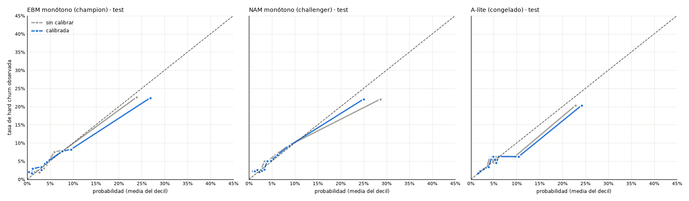

Dataset sintético, corte transversal: valida pipeline y metodología, no conclusiones sobre clientes reales.

# p11 · Fase 11 · Calibración (target A)

## calibration

ECE de selección fuera de muestra (CV 5 folds dentro de validación); evaluación en test. A-lite en su subconjunto justo.

| modelo | hogares validación | eventos validación | ECE CV Platt (pp) | ECE CV isotónica (pp) | elegido | a (Platt) | b (Platt) | hogares test | eventos test | ECE test sin calibrar (pp) | ECE test calibrado (pp) | Brier test sin calibrar | Brier test calibrado | media p test % | tasa test % |
|:--|:--|:--|:--|:--|:--|:--|:--|:--|:--|:--|:--|:--|:--|:--|:--|
| EBM monótono (champion) | 2727 | 164 | 1.071 | 0.5549 | isotonic | 0.2227 | 1.091 | 5842 | 351 | 0.5629 | 1.184 | 0.05201 | 0.05279 | 6.098 | 6.008 |
| NAM monótono (challenger) | 2727 | 164 | 0.7843 | 1.179 | platt | -0.3475 | 0.8434 | 5842 | 351 | 1.401 | 0.8103 | 0.05283 | 0.05209 | 6.025 | 6.008 |
| A-lite (congelado) | 823 | 56 | 1.545 | 1.697 | platt | 0.06323 | 0.9866 | 1764 | 106 | 1.224 | 1.316 | 0.05445 | 0.0546 | 6.605 | 6.009 |

_Fuente: `outputs/p11/calibration.csv`_

## calibrators

| clave | valor |
|:--|:--|
| EBM monótono (champion) | {"method": "isotonic", "a": 0.2226556676865766, "b": 1.0907643170163455} |
| NAM monótono (challenger) | {"method": "platt", "a": -0.3475146449367438, "b": 0.8434118942107859} |
| A-lite (congelado) | {"method": "platt", "a": 0.06322889434329222, "b": 0.986611240719541} |

_Fuente: `outputs/p11/calibrators.json`_

## calibration_test

_Fuente: `outputs/p11/calibration_test.png`_
