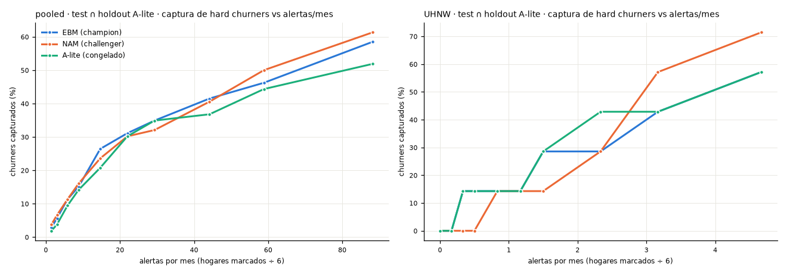

Dataset sintético, corte transversal: valida pipeline y metodología, no conclusiones sobre clientes reales.

# p13 · Fase 13 · EWS (target A)

## summary

| clave | valor |
|:--|:--|
| horizonte (meses) | 6 |
| ews.alerts_per_month | None |
| umbral | no definido: ews.alerts_per_month en null (se pregunta al usuario) |
| regla multi-señal | Σ de 9 flags visibles ≥ 2 (k por F1 en validación) |
| flags | ["salary_deposit_stopped_flag", "recurring_deposit_stopped_flag", "banker_change_6m_flag", "complaint_escalated_flag", "pension_deposit_stopped_flag", "business_payroll_stopped_flag", "trustee_change_flag", "repeat_complaint_flag", "relationship_dissatisfaction_flag"] |

_Fuente: `outputs/p13/summary.json`_

## ews_curve

_Fuente: `outputs/p13/ews_curve.png`_

## ews_curve

Alertas por mes = marcados ÷ 6 (supuesto: un solo snapshot). Equivalente cartera = escala del test a los 19,473 hogares.

| modelo | subconjunto | segmento | % hogares marcados | hogares marcados | alertas por mes (muestra) | alertas por mes (equivalente cartera) | churners capturados | captura % | precisión % | churners por 100 alertas | captura RV de churners % |
|:--|:--|:--|:--|:--|:--|:--|:--|:--|:--|:--|:--|
| EBM (champion) | test ∩ holdout A-lite | pooled | 0.5 | 9 | 1.5 |  | 3 | 2.83 | 33.33 | 33.33 | 3.809 |
| EBM (champion) | test ∩ holdout A-lite | pooled | 1 | 18 | 3 |  | 6 | 5.66 | 33.33 | 33.33 | 4.741 |
| EBM (champion) | test ∩ holdout A-lite | pooled | 2 | 35 | 5.833 |  | 12 | 11.32 | 34.29 | 34.29 | 9.049 |
| EBM (champion) | test ∩ holdout A-lite | pooled | 3 | 53 | 8.833 |  | 16 | 15.09 | 30.19 | 30.19 | 11.12 |
| EBM (champion) | test ∩ holdout A-lite | pooled | 5 | 88 | 14.67 |  | 28 | 26.42 | 31.82 | 31.82 | 22.26 |
| EBM (champion) | test ∩ holdout A-lite | pooled | 7.5 | 132 | 22 |  | 33 | 31.13 | 25 | 25 | 29.21 |
| EBM (champion) | test ∩ holdout A-lite | pooled | 10 | 176 | 29.33 |  | 37 | 34.91 | 21.02 | 21.02 | 30.33 |
| EBM (champion) | test ∩ holdout A-lite | pooled | 15 | 265 | 44.17 |  | 44 | 41.51 | 16.6 | 16.6 | 40.04 |
| EBM (champion) | test ∩ holdout A-lite | pooled | 20 | 353 | 58.83 |  | 49 | 46.23 | 13.88 | 13.88 | 44.83 |
| EBM (champion) | test ∩ holdout A-lite | pooled | 30 | 529 | 88.17 |  | 62 | 58.49 | 11.72 | 11.72 | 58.68 |
| EBM (champion) | test ∩ holdout A-lite | UHNW | 0.5 | 0 | 0 |  | 0 | 0 |  |  | 0 |
| EBM (champion) | test ∩ holdout A-lite | UHNW | 1 | 1 | 0.1667 |  | 0 | 0 | 0 | 0 | 0 |
| EBM (champion) | test ∩ holdout A-lite | UHNW | 2 | 2 | 0.3333 |  | 1 | 14.29 | 50 | 50 | 17.08 |
| EBM (champion) | test ∩ holdout A-lite | UHNW | 3 | 3 | 0.5 |  | 1 | 14.29 | 33.33 | 33.33 | 17.08 |
| EBM (champion) | test ∩ holdout A-lite | UHNW | 5 | 5 | 0.8333 |  | 1 | 14.29 | 20 | 20 | 17.08 |
| EBM (champion) | test ∩ holdout A-lite | UHNW | 7.5 | 7 | 1.167 |  | 1 | 14.29 | 14.29 | 14.29 | 17.08 |
| EBM (champion) | test ∩ holdout A-lite | UHNW | 10 | 9 | 1.5 |  | 2 | 28.57 | 22.22 | 22.22 | 30.28 |
| EBM (champion) | test ∩ holdout A-lite | UHNW | 15 | 14 | 2.333 |  | 2 | 28.57 | 14.29 | 14.29 | 30.28 |
| EBM (champion) | test ∩ holdout A-lite | UHNW | 20 | 19 | 3.167 |  | 3 | 42.86 | 15.79 | 15.79 | 39.39 |
| EBM (champion) | test ∩ holdout A-lite | UHNW | 30 | 28 | 4.667 |  | 4 | 57.14 | 14.29 | 14.29 | 52.94 |
| EBM (champion) | test completo | pooled | 0.5 | 29 | 4.833 | 16.11 | 15 | 4.274 | 51.72 | 51.72 | 5.143 |
| EBM (champion) | test completo | pooled | 1 | 58 | 9.667 | 32.22 | 27 | 7.692 | 46.55 | 46.55 | 9.08 |
| EBM (champion) | test completo | pooled | 2 | 117 | 19.5 | 65 | 48 | 13.68 | 41.03 | 41.03 | 22.02 |
| EBM (champion) | test completo | pooled | 3 | 175 | 29.17 | 97.22 | 66 | 18.8 | 37.71 | 37.71 | 24.62 |
| EBM (champion) | test completo | pooled | 5 | 292 | 48.67 | 162.2 | 90 | 25.64 | 30.82 | 30.82 | 31.42 |
| EBM (champion) | test completo | pooled | 7.5 | 438 | 73 | 243.3 | 112 | 31.91 | 25.57 | 25.57 | 38.71 |
| EBM (champion) | test completo | pooled | 10 | 584 | 97.33 | 324.4 | 131 | 37.32 | 22.43 | 22.43 | 43.55 |
| EBM (champion) | test completo | pooled | 15 | 876 | 146 | 486.7 | 162 | 46.15 | 18.49 | 18.49 | 50.32 |
| EBM (champion) | test completo | pooled | 20 | 1168 | 194.7 | 648.9 | 179 | 51 | 15.33 | 15.33 | 55.16 |
| EBM (champion) | test completo | pooled | 30 | 1753 | 292.2 | 973.9 | 224 | 63.82 | 12.78 | 12.78 | 68.13 |
| EBM (champion) | test completo | UHNW | 0.5 | 2 | 0.3333 | 1.111 | 2 | 8.333 | 100 | 100 | 4.93 |
| EBM (champion) | test completo | UHNW | 1 | 3 | 0.5 | 1.667 | 3 | 12.5 | 100 | 100 | 7.347 |
| EBM (champion) | test completo | UHNW | 2 | 6 | 1 | 3.333 | 5 | 20.83 | 83.33 | 83.33 | 15.96 |
| EBM (champion) | test completo | UHNW | 3 | 10 | 1.667 | 5.555 | 6 | 25 | 60 | 60 | 29.15 |
| EBM (champion) | test completo | UHNW | 5 | 16 | 2.667 | 8.889 | 7 | 29.17 | 43.75 | 43.75 | 34.13 |
| EBM (champion) | test completo | UHNW | 7.5 | 24 | 4 | 13.33 | 10 | 41.67 | 41.67 | 41.67 | 45.95 |
| EBM (champion) | test completo | UHNW | 10 | 32 | 5.333 | 17.78 | 11 | 45.83 | 34.38 | 34.38 | 48.12 |
| EBM (champion) | test completo | UHNW | 15 | 49 | 8.167 | 27.22 | 12 | 50 | 24.49 | 24.49 | 50.77 |
| EBM (champion) | test completo | UHNW | 20 | 65 | 10.83 | 36.11 | 13 | 54.17 | 20 | 20 | 55.15 |
| EBM (champion) | test completo | UHNW | 30 | 98 | 16.33 | 54.44 | 15 | 62.5 | 15.31 | 15.31 | 68.34 |
| NAM (challenger) | test ∩ holdout A-lite | pooled | 0.5 | 9 | 1.5 |  | 4 | 3.774 | 44.44 | 44.44 | 3.929 |
| NAM (challenger) | test ∩ holdout A-lite | pooled | 1 | 18 | 3 |  | 7 | 6.604 | 38.89 | 38.89 | 5.445 |
| NAM (challenger) | test ∩ holdout A-lite | pooled | 2 | 35 | 5.833 |  | 12 | 11.32 | 34.29 | 34.29 | 7.848 |
| NAM (challenger) | test ∩ holdout A-lite | pooled | 3 | 53 | 8.833 |  | 17 | 16.04 | 32.08 | 32.08 | 12.57 |
| NAM (challenger) | test ∩ holdout A-lite | pooled | 5 | 88 | 14.67 |  | 25 | 23.58 | 28.41 | 28.41 | 21.58 |
| NAM (challenger) | test ∩ holdout A-lite | pooled | 7.5 | 132 | 22 |  | 32 | 30.19 | 24.24 | 24.24 | 23.54 |
| NAM (challenger) | test ∩ holdout A-lite | pooled | 10 | 176 | 29.33 |  | 34 | 32.08 | 19.32 | 19.32 | 29.33 |
| NAM (challenger) | test ∩ holdout A-lite | pooled | 15 | 265 | 44.17 |  | 43 | 40.57 | 16.23 | 16.23 | 38.83 |
| NAM (challenger) | test ∩ holdout A-lite | pooled | 20 | 353 | 58.83 |  | 53 | 50 | 15.01 | 15.01 | 51.51 |
| NAM (challenger) | test ∩ holdout A-lite | pooled | 30 | 529 | 88.17 |  | 65 | 61.32 | 12.29 | 12.29 | 63.42 |
| NAM (challenger) | test ∩ holdout A-lite | UHNW | 0.5 | 0 | 0 |  | 0 | 0 |  |  | 0 |
| NAM (challenger) | test ∩ holdout A-lite | UHNW | 1 | 1 | 0.1667 |  | 0 | 0 | 0 | 0 | 0 |
| NAM (challenger) | test ∩ holdout A-lite | UHNW | 2 | 2 | 0.3333 |  | 0 | 0 | 0 | 0 | 0 |
| NAM (challenger) | test ∩ holdout A-lite | UHNW | 3 | 3 | 0.5 |  | 0 | 0 | 0 | 0 | 0 |
| NAM (challenger) | test ∩ holdout A-lite | UHNW | 5 | 5 | 0.8333 |  | 1 | 14.29 | 20 | 20 | 17.08 |
| NAM (challenger) | test ∩ holdout A-lite | UHNW | 7.5 | 7 | 1.167 |  | 1 | 14.29 | 14.29 | 14.29 | 17.08 |
| NAM (challenger) | test ∩ holdout A-lite | UHNW | 10 | 9 | 1.5 |  | 1 | 14.29 | 11.11 | 11.11 | 17.08 |
| NAM (challenger) | test ∩ holdout A-lite | UHNW | 15 | 14 | 2.333 |  | 2 | 28.57 | 14.29 | 14.29 | 30.28 |
| NAM (challenger) | test ∩ holdout A-lite | UHNW | 20 | 19 | 3.167 |  | 4 | 57.14 | 21.05 | 21.05 | 52.94 |
| NAM (challenger) | test ∩ holdout A-lite | UHNW | 30 | 28 | 4.667 |  | 5 | 71.43 | 17.86 | 17.86 | 63.54 |
| NAM (challenger) | test completo | pooled | 0.5 | 29 | 4.833 | 16.11 | 17 | 4.843 | 58.62 | 58.62 | 8.938 |
| NAM (challenger) | test completo | pooled | 1 | 58 | 9.667 | 32.22 | 27 | 7.692 | 46.55 | 46.55 | 12.23 |
| NAM (challenger) | test completo | pooled | 2 | 117 | 19.5 | 65 | 50 | 14.25 | 42.74 | 42.74 | 21.91 |
| NAM (challenger) | test completo | pooled | 3 | 175 | 29.17 | 97.22 | 66 | 18.8 | 37.71 | 37.71 | 25.1 |
| NAM (challenger) | test completo | pooled | 5 | 292 | 48.67 | 162.2 | 85 | 24.22 | 29.11 | 29.11 | 31.41 |
| NAM (challenger) | test completo | pooled | 7.5 | 438 | 73 | 243.3 | 111 | 31.62 | 25.34 | 25.34 | 36.7 |
| NAM (challenger) | test completo | pooled | 10 | 584 | 97.33 | 324.4 | 129 | 36.75 | 22.09 | 22.09 | 41.1 |
| NAM (challenger) | test completo | pooled | 15 | 876 | 146 | 486.7 | 157 | 44.73 | 17.92 | 17.92 | 48.63 |
| NAM (challenger) | test completo | pooled | 20 | 1168 | 194.7 | 648.9 | 182 | 51.85 | 15.58 | 15.58 | 56.16 |
| NAM (challenger) | test completo | pooled | 30 | 1753 | 292.2 | 973.9 | 220 | 62.68 | 12.55 | 12.55 | 67.93 |
| NAM (challenger) | test completo | UHNW | 0.5 | 2 | 0.3333 | 1.111 | 2 | 8.333 | 100 | 100 | 6.151 |
| NAM (challenger) | test completo | UHNW | 1 | 3 | 0.5 | 1.667 | 3 | 12.5 | 100 | 100 | 11.06 |
| NAM (challenger) | test completo | UHNW | 2 | 6 | 1 | 3.333 | 5 | 20.83 | 83.33 | 83.33 | 15.96 |
| NAM (challenger) | test completo | UHNW | 3 | 10 | 1.667 | 5.555 | 6 | 25 | 60 | 60 | 29.15 |
| NAM (challenger) | test completo | UHNW | 5 | 16 | 2.667 | 8.889 | 8 | 33.33 | 50 | 50 | 38.68 |
| NAM (challenger) | test completo | UHNW | 7.5 | 24 | 4 | 13.33 | 8 | 33.33 | 33.33 | 33.33 | 38.68 |
| NAM (challenger) | test completo | UHNW | 10 | 32 | 5.333 | 17.78 | 9 | 37.5 | 28.12 | 28.12 | 42.53 |
| NAM (challenger) | test completo | UHNW | 15 | 49 | 8.167 | 27.22 | 12 | 50 | 24.49 | 24.49 | 50.77 |
| NAM (challenger) | test completo | UHNW | 20 | 65 | 10.83 | 36.11 | 13 | 54.17 | 20 | 20 | 54.72 |
| NAM (challenger) | test completo | UHNW | 30 | 98 | 16.33 | 54.44 | 16 | 66.67 | 16.33 | 16.33 | 71.44 |
| A-lite (congelado) | test ∩ holdout A-lite | pooled | 0.5 | 9 | 1.5 |  | 2 | 1.887 | 22.22 | 22.22 | 2.4 |
| A-lite (congelado) | test ∩ holdout A-lite | pooled | 1 | 18 | 3 |  | 4 | 3.774 | 22.22 | 22.22 | 2.968 |
| A-lite (congelado) | test ∩ holdout A-lite | pooled | 2 | 35 | 5.833 |  | 10 | 9.434 | 28.57 | 28.57 | 8.672 |
| A-lite (congelado) | test ∩ holdout A-lite | pooled | 3 | 53 | 8.833 |  | 15 | 14.15 | 28.3 | 28.3 | 15.01 |
| A-lite (congelado) | test ∩ holdout A-lite | pooled | 5 | 88 | 14.67 |  | 22 | 20.75 | 25 | 25 | 18.42 |
| A-lite (congelado) | test ∩ holdout A-lite | pooled | 7.5 | 132 | 22 |  | 32 | 30.19 | 24.24 | 24.24 | 28.47 |
| A-lite (congelado) | test ∩ holdout A-lite | pooled | 10 | 176 | 29.33 |  | 37 | 34.91 | 21.02 | 21.02 | 36.44 |
| A-lite (congelado) | test ∩ holdout A-lite | pooled | 15 | 265 | 44.17 |  | 39 | 36.79 | 14.72 | 14.72 | 36.7 |
| A-lite (congelado) | test ∩ holdout A-lite | pooled | 20 | 353 | 58.83 |  | 47 | 44.34 | 13.31 | 13.31 | 44.74 |
| A-lite (congelado) | test ∩ holdout A-lite | pooled | 30 | 529 | 88.17 |  | 55 | 51.89 | 10.4 | 10.4 | 55.81 |
| A-lite (congelado) | test ∩ holdout A-lite | UHNW | 0.5 | 0 | 0 |  | 0 | 0 |  |  | 0 |
| A-lite (congelado) | test ∩ holdout A-lite | UHNW | 1 | 1 | 0.1667 |  | 0 | 0 | 0 | 0 | 0 |
| A-lite (congelado) | test ∩ holdout A-lite | UHNW | 2 | 2 | 0.3333 |  | 1 | 14.29 | 50 | 50 | 9.109 |
| A-lite (congelado) | test ∩ holdout A-lite | UHNW | 3 | 3 | 0.5 |  | 1 | 14.29 | 33.33 | 33.33 | 9.109 |
| A-lite (congelado) | test ∩ holdout A-lite | UHNW | 5 | 5 | 0.8333 |  | 1 | 14.29 | 20 | 20 | 9.109 |
| A-lite (congelado) | test ∩ holdout A-lite | UHNW | 7.5 | 7 | 1.167 |  | 1 | 14.29 | 14.29 | 14.29 | 9.109 |
| A-lite (congelado) | test ∩ holdout A-lite | UHNW | 10 | 9 | 1.5 |  | 2 | 28.57 | 22.22 | 22.22 | 26.19 |
| A-lite (congelado) | test ∩ holdout A-lite | UHNW | 15 | 14 | 2.333 |  | 3 | 42.86 | 21.43 | 21.43 | 36.79 |
| A-lite (congelado) | test ∩ holdout A-lite | UHNW | 20 | 19 | 3.167 |  | 3 | 42.86 | 15.79 | 15.79 | 36.79 |
| A-lite (congelado) | test ∩ holdout A-lite | UHNW | 30 | 28 | 4.667 |  | 4 | 57.14 | 14.29 | 14.29 | 49.99 |

_Fuente: `outputs/p13/ews_curve.csv`_

## multisignal_vs_model

| subconjunto | segmento | k | hogares marcados | churners regla | precisión regla % | churners EBM (champion) (mismo volumen) | precisión EBM (champion) % | churners NAM (challenger) (mismo volumen) | precisión NAM (challenger) % | churners A-lite (congelado) (mismo volumen) | precisión A-lite (congelado) % |
|:--|:--|:--|:--|:--|:--|:--|:--|:--|:--|:--|:--|
| test completo | pooled | 2 | 393 | 97 | 24.68 | 104 | 26.46 | 101 | 25.7 |  |  |
| test completo | UHNW | 2 | 20 | 7 | 35 | 8 | 40 | 8 | 40 |  |  |
| test ∩ holdout A-lite | pooled | 2 | 120 | 26 | 21.67 | 32 | 26.67 | 31 | 25.83 | 31 | 25.83 |
| test ∩ holdout A-lite | UHNW | 2 | 7 | 1 | 14.29 | 1 | 14.29 | 1 | 14.29 | 1 | 14.29 |

_Fuente: `outputs/p13/multisignal_vs_model.csv`_

## multisignal_k_selection

| k | F1 validación |
|:--|:--|
| 1 | 0.2413 |
| 2 | 0.2787 |
| 3 | 0.1803 |
| 4 | 0.117 |
| 5 | 0.04651 |

_Fuente: `outputs/p13/multisignal_k_selection.csv`_
