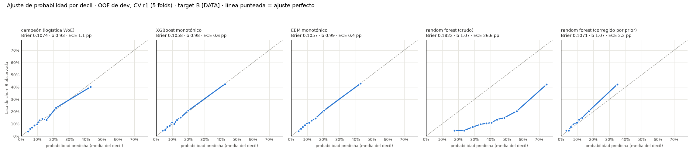

# Documento del modelo · Churn Propensity Scorecard (campeón WoE + logística)

Dataset sintético `client_pulse_synthetic.xlsx` (20,000 households, snapshot 2025-12-31) [DATA]. Marco: Model Risk
Management (SR 11-7 o equivalente). Gates: [G0](gate_0.md) · [G1](gate_1.md) · [G2](gate_2.md) · [G3](gate_3.md) · [G4](gate_4.md).

## Modo, parámetros y supuestos
| parámetro / supuesto   | valor                                                                      |
|:-----------------------|:---------------------------------------------------------------------------|
| Modo                   | DATA: toda cifra sale del archivo [DATA]; parámetros [DEF] / [DEF-default] |
| Escala                 | S₀ = 600 @ 20:1, PDO = 40                                                  |
| Semilla                | 42                                                                         |
| Target                 | B (θ = 0.25), A como sensibilidad                                          |
| Split                  | 70/30 estratificado por clase × segmento; CV 5×5 en dev                    |
| Versión del modelo     | 1.0.0                                                                      |

## Ficha del dataset (verificada en el paso 0) [DATA]
| hecho                                                              | esperado (ficha)                                                                                    | observado [DATA]                                                                                                         | coincide   | nota                                                                                     |
|:-------------------------------------------------------------------|:----------------------------------------------------------------------------------------------------|:-------------------------------------------------------------------------------------------------------------------------|:-----------|:-----------------------------------------------------------------------------------------|
| Hoja / filas / columnas                                            | client_pulse_synthetic / 20,000 / 62                                                                | client_pulse_synthetic / 20,000 / 62                                                                                     | True       | nan                                                                                      |
| household_id único                                                 | sí                                                                                                  | 20,000 únicos                                                                                                            | True       | nan                                                                                      |
| Un solo snapshot                                                   | 2025-12-31                                                                                          | 2025-12-31                                                                                                               | True       | nan                                                                                      |
| Segmento                                                           | HNW 18,897 · UHNW 1,103                                                                             | HNW 18,897 · UHNW 1,103                                                                                                  | True       | nan                                                                                      |
| churn_excluded                                                     | 123; targets NaN; history 13–24; tenure ≥ 1.14                                                      | 123; targets NaN = True; history 13–24; tenure ≥ 1.14                                                                    | True       | nan                                                                                      |
| Elegibles                                                          | 19,877                                                                                              | 19,877                                                                                                                   | True       | nan                                                                                      |
| hard_churn_6m                                                      | 1,200 = 6.04%; pérdida = 1.000                                                                      | 1,200 = 6.04%; pérdida 1.000–1.000                                                                                       | True       | nan                                                                                      |
| soft_churn_3m                                                      | 1,756 = 8.83%; pérdida 0.20–0.60, mediana 0.40; disjunto                                            | 1,756 = 8.83%; pérdida 0.2003–0.5994, mediana 0.3978; solapes 0                                                          | True       | nan                                                                                      |
| value_lost_6m > 0 ⟺ hard ∪ soft                                    | 2,956                                                                                               | 2,956; ⟺ True                                                                                                            | True       | nan                                                                                      |
| Churn por valor (elegibles)                                        | 6.46% bruto; 10.32% económico                                                                       | 6.46%; 10.32%                                                                                                            | True       | nan                                                                                      |
| Tamaño (elegibles)                                                 | ΣRV 206.27 B; ΣAUM 135.09 B (17,030); top 5% 37.4%; top 1% 18.1%; mediana 4.84 M; p5 1.27; p95 31.8 | ΣRV 206.27 B; ΣAUM 135.09 B (17,030); top 5% 37.4%; top 1% 18.1%; mediana 4.84 M; p5 1.27; p95 31.8                      | True       | la ficha usa elegibles (19,877), no las 20,000 filas                                     |
| relationship_value ≠ aum + deposit_balance ('RV es medida propia') | Verdadero                                                                                           | RV = aum (0 si NaN) + deposit_balance con |dif| máx $0.01; igualdad exacta de flotantes en 33.2% por redondeo a centavos | False      | DISCREPANCIA D0.2: RV sí es la suma (al centavo); solo difiere por redondeo de flotantes |
| Missing estructural has_investments                                | faltan ⟺ has_investments = False (2,847)                                                            | 2,847 elegibles sin inversiones                                                                                          | True       | nan                                                                                      |
| Missing no estructural                                             | 48.0 / 60.7 / 70.4 / 73.9 %                                                                         | 48.0 / 60.7 / 70.4 / 73.9 %                                                                                              | True       | nan                                                                                      |
| Antigüedad / historia (elegibles)                                  | tenure < 1: 404; history < 24: 1,417                                                                | 404; 1,417                                                                                                               | True       | nan                                                                                      |
| Compuestos                                                         | flag ≡ count ≥ 3; ρ = 0.59 con suma de flags; tasa hard 2.8% (0) → 44.8% (7)                        | ≡ True; ρ Pearson = 0.59 (10 binarias visibles; Spearman 0.47); 2.8% → 44.8%                                             | True       | ρ = Pearson con las 9 *_flag + bureau (D0.3)                                             |
| Señal univariada (AUC vs hard, missing → mediana)                  | máx ≤ 0.70: count 0.69, banker 0.64, SOW 0.64                                                       | multi_signal_count 0.693; multi_signal_flag 0.648; banker_change_6m_flag 0.641; share_of_wallet 0.636                    | True       | la ficha no lista multi_signal_flag (0.648), segundo en el ranking                       |
| Gradiente por tamaño                                               | tasa hard por decil de RV 5.2%–7.1%                                                                 | 5.2%–7.1%                                                                                                                | True       | nan                                                                                      |
| Pares redundantes |Spearman| > 0.75                                | 10 pares (ver step00_pairs.csv)                                                                     | 10 de 10 coinciden (±0.015)                                                                                              | True       | nan                                                                                      |
| Valores imposibles                                                 | ninguno                                                                                             | saldos < 0: 0; share_of_wallet ∉ (0, 1]: 0; tenure < 0: 0                                                                | True       | nan                                                                                      |

## 1. Índice de pasos
1. [Paso 00 · Verificación y definición del problema](step00.md)
2. [Paso 01 · Target y churn rate](step01.md)
3. [Paso 02 · Diccionario de datos](step02.md)
4. [Paso 03 · Calidad de datos](step03.md)
5. [Paso 04 · Muestra](step04.md)
6. [Paso 05 · Ingeniería de señales](step05.md)
7. [Paso 06 · Análisis univariado](step06.md)
8. [Paso 07 · Pre-segmentación](step07.md)
9. [Paso 08 · Correlación y estructura](step08.md)
10. [Paso 09 · Binning, WoE, IV](step09.md)
11. [Paso 10 · Selección](step10.md)
12. [Paso 11 · Estimación (campeón y challenger)](step11.md)
13. [Paso 12 · Escalamiento, tramos, salida](step12.md)
14. [Paso 13 · Validación](step13.md)
15. [Paso 14 · Calibración](step14.md)
16. [Paso 15 · Estabilidad](step15.md)
17. [Paso 16 · Acción, arquetipos, EWS](step16.md)
18. [Paso 17 · KPIs, monitoreo, gobernanza](step17.md)

## 2. Definición
- Target B: hard churn 6M ∪ soft churn con pérdida ≥ 25% del RV; soft con pérdida menor = indeterminado [DEF-default I-1].
  Tasa B 13.88% (19,261 hogares) [DATA]. Sensibilidad: target A (hard 6M).
- Población: elegibles con antigüedad ≥ 1 año [DEF-default I-8]; 70/30 estratificado; CV 5×5 en desarrollo.

## 3. Modelo
- Logística sobre WoE, 8 variables, pesos balanceados e intercepto corregido; bins de negocio para señales raras [DEF G2-1];
  selección uno por cluster de variables [DEF G2-3]; un solo modelo con `segment_uhnw` [DEF G2-2].

| variable                  |   β final |   p-valor |   VIF (WoE) |
|:--------------------------|----------:|----------:|------------:|
| intercepto                |    1.8070 |    0.3533 |    nan      |
| client_reply_rate         |    0.6445 |    0.0000 |      1.3023 |
| banker_change_6m_flag     |    0.7373 |    0.0000 |      1.0740 |
| share_of_wallet           |    0.4864 |    0.0000 |      1.1366 |
| outflow_x_contact_gap     |    0.3245 |    0.0000 |      1.2781 |
| return_vs_benchmark       |    0.7252 |    0.0000 |      1.0113 |
| streams_stopped_count     |    0.4870 |    0.0000 |      1.1411 |
| cash_pct_of_portfolio_chg |    0.5066 |    0.0000 |      1.0577 |
| contact_gap_ratio_peer    |    0.3386 |    0.0000 |      1.3822 |

- Escala PDO: S₀ = 600 @ 20:1, PDO = 40 (Factor 57.71, Offset 427.12) [DEF-default I-6]; base 531 puntos [DATA].
  Lookup: `outputs/tables/step12_lookup.csv`; score por hogar: `outputs/scores/household_scores.csv`.
- Challenger (XGBoost monotónico, EBM, RF): referencia; no cumple la tabla H-2 y queda fuera por decisión G2-4 [DEF].

## 4. Tramos y escala maestra (dev) [DATA]
| tramo      |   score mín |   score máx |   % hogares |   % RV |   tasa observada % |   captura eventos % |   lift |
|:-----------|------------:|------------:|------------:|-------:|-------------------:|--------------------:|-------:|
| Crítico    |         296 |         445 |        4.04 |   4.68 |              56.62 |               16.46 |   4.08 |
| Alto       |         446 |         624 |       23.62 |  22.89 |              22.86 |               38.91 |   1.65 |
| Vigilancia |         518 |         573 |       44.33 |  41.72 |              10.98 |               35.06 |   0.79 |
| Estable    |         574 |         640 |       28.02 |  30.71 |               4.74 |                9.57 |   0.34 |

- Overrides → Alto: cambio de banquero, queja escalada, transferencia a competidor ≥ 10% [DEF G3-1].

## 5. Validación (holdout, una vez) [DATA]
| muestra                       |   hogares |   eventos |    AUC |   Gini |   PR-AUC |     KS |
|:------------------------------|----------:|----------:|-------:|-------:|---------:|-------:|
| dev                           |     13482 |      1871 | 0.7219 | 0.4438 |   0.3490 | 0.3167 |
| val                           |      5779 |       803 | 0.6950 | 0.3900 |   0.3281 | 0.2824 |
| val · HNW                     |      5456 |       750 | 0.6962 | 0.3923 |   0.3257 | 0.2846 |
| val · UHNW                    |       323 |        53 | 0.6971 | 0.3943 |   0.3940 | 0.2925 |
| dev · target A (sensibilidad) |     13631 |       817 | 0.7594 | 0.5188 |   0.2134 | 0.3953 |
| val · target A (sensibilidad) |      5842 |       351 | 0.7430 | 0.4859 |   0.2003 | 0.3774 |

| criterio                                                   | cumple   |
|:-----------------------------------------------------------|:---------|
| Tasa monótona por tramo en dev (final)                     | sí       |
| Tasa monótona por tramo en val (final)                     | sí       |
| Tasa monótona por tramo en val (modelo)                    | sí       |
| Caída de Gini dev→val ≤ 15% relativo (12.1%)               | sí       |
| PSI dev→val por tramo < 0.10 (final 0.0003; modelo 0.0003) | sí       |
| ≥ 30 eventos por tramo en val (mín 95)                     | sí       |
| ≥ 30 eventos por banda en val (mín 52)                     | sí       |
| Overrides con precisión ≥ umbral en val                    | sí       |
| Lift Crítico/Estable ≥ 5x en val (9.5x)                    | sí       |

## 6. Calibración (val) [DATA]
- Platt a = -0.272, b = 0.854; isotónica no mejora. Tramos dentro de Wilson 90%:

| tramo      |   hogares |   eventos |   esperada % |   observada % |   Wilson 90% inf |   Wilson 90% sup |
|:-----------|----------:|----------:|-------------:|--------------:|-----------------:|-----------------:|
| Crítico    |       250 |       139 |        52.19 |         55.60 |            50.40 |            60.68 |
| Alto       |      1368 |       288 |        20.24 |         21.05 |            19.30 |            22.92 |
| Vigilancia |      2536 |       281 |        11.59 |         11.08 |            10.10 |            12.15 |
| Estable    |      1625 |        95 |         6.26 |          5.85 |             4.96 |             6.88 |

## 7. Estabilidad [DATA]
| objeto                                          |    PSI | lectura   |
|:------------------------------------------------|-------:|:----------|
| score (deciles de dev)                          | 0.0034 | estable   |
| p calibrada (deciles de dev)                    | 0.0035 | estable   |
| tramo                                           | 0.0003 | estable   |
| variable · client_reply_rate (bins WoE)         | 0.0008 | estable   |
| variable · banker_change_6m_flag (bins WoE)     | 0.0000 | estable   |
| variable · share_of_wallet (bins WoE)           | 0.0008 | estable   |
| variable · outflow_x_contact_gap (bins WoE)     | 0.0007 | estable   |
| variable · return_vs_benchmark (bins WoE)       | 0.0027 | estable   |
| variable · streams_stopped_count (bins WoE)     | 0.0003 | estable   |
| variable · cash_pct_of_portfolio_chg (bins WoE) | 0.0009 | estable   |
| variable · contact_gap_ratio_peer (bins WoE)    | 0.0015 | estable   |

## 8. Arquetipos y acción [DATA]
| nombre                     |   % eventos dev |   % eventos val |   % Crítico |   % Alto |   % Vigilancia |   % Estable |
|:---------------------------|----------------:|----------------:|------------:|---------:|---------------:|------------:|
| relación desatendida       |            36.5 |            33.1 |         6.2 |     49.6 |           43.7 |         0.6 |
| salida activa a competidor |            19.4 |            19.3 |        69.1 |     30.6 |            0.3 |         0.0 |
| desgaste silencioso        |            44.1 |            47.6 |         1.8 |     33.8 |           43.2 |        21.2 |

- Playbook y EWS: [paso 16](step16.md). Control aleatorio 12.5% en Alto [DEF G3-4].

## 9. KPIs y monitoreo
| dimensión                  | KPI                                              | línea base [DATA]            | umbral / acción [DEF]                                                          | frecuencia   |
|:---------------------------|:-------------------------------------------------|:-----------------------------|:-------------------------------------------------------------------------------|:-------------|
| Discriminación             | Gini (val)                                       | 0.390                        | caída > 15% relativo vs línea base ⟹ redesarrollo                              | mensual      |
| Discriminación             | PR-AUC (val)                                     | 0.328                        | seguimiento                                                                    | mensual      |
| Calibración                | pendiente Platt b                                | 0.854                        | fuera de 0.8–1.2 dos ciclos ⟹ recalibración                                    | mensual      |
| Calibración                | media p calibrada vs tasa observada              | 13.90% vs 13.90%             | brecha > 1 pp dos ciclos ⟹ recalibración                                       | mensual      |
| Estabilidad                | PSI del score                                    | 0.0034                       | 0.10–0.25 vigilar; > 0.25 sostenido ⟹ redesarrollo                             | mensual      |
| Estabilidad                | PSI de variables (máx.)                          | 0.0027                       | > 0.25 en una variable ⟹ revisar su fuente                                     | mensual      |
| Tramos                     | tasa Crítico / Alto / Vigilancia / Estable (val) | 55.6% / 21.1% / 11.1% / 5.8% | pérdida de monotonía o lift Crítico/Estable < 5x ⟹ revisar cortes              | trimestral   |
| Operación                  | precisión en Crítico (val)                       | 55.6%                        | seguimiento; FP por evento capturado 0.80                                      | mensual      |
| Operación                  | captura top 10% (val)                            | 27.9% eventos · 25.8% RV     | seguimiento                                                                    | mensual      |
| Valor (G3-2)               | Σ p·RV / Σ RV de eventos, quintil superior de RV | 0.85                         | < 0.85 dos ciclos ⟹ probar ajuste por log_rv                                   | trimestral   |
| Segmento (G3-3)            | UHNW en Alto: observada vs esperada              | 31.6% vs 19.4% (24 eventos)  | revisión prioritaria del banquero; recalibrar UHNW si ≥ 100 eventos acumulados | trimestral   |
| Efecto de la acción (G3-4) | churn tratados vs control en Alto                | control 12.5% = 595 hogares  | efecto mínimo detectable 4.9 pp                                                | a 6 meses    |

| disparador            | condición [DEF SPEC / G3]                                                | acción                                                                          |
|:----------------------|:-------------------------------------------------------------------------|:--------------------------------------------------------------------------------|
| Recalibración         | b fuera de 0.8–1.2 en dos ciclos, o media p vs tasa > 1 pp en dos ciclos | re-estimar Platt con el último snapshot con outcome; cortes de score sin cambio |
| Redesarrollo          | PSI del score > 0.25 sostenido, o Gini −15% relativo vs línea base       | repetir pasos 5–14 con nuevos datos (y OOT si ya hay 2+ snapshots)              |
| Revisión de variable  | PSI > 0.25 en una variable o cambio de definición del proveedor          | revisar la fuente; bin neutral temporal si la variable se cae                   |
| Revisión de overrides | precisión de una regla < 12% en dos ciclos                               | eliminar la regla                                                               |
| Cola de valor         | quintil superior de RV con Σ p·RV / Σ RV de eventos < 0.85 dos ciclos    | probar interacción con log_rv (paso 14)                                         |

## 10. Gobernanza
| rol                      | responsable (propuesto)          | responsabilidad                                                                                       |
|:-------------------------|:---------------------------------|:------------------------------------------------------------------------------------------------------|
| Dueño del modelo         | Wealth / banca privada (negocio) | aprueba cortes, overrides y playbook                                                                  |
| Desarrollo               | equipo de modelos                | código, tablas, reportes, recalibración                                                               |
| Validación independiente | MRM (SR 11-7 o equivalente)      | revisa este documento antes del uso; revalidación anual                                               |
| Monitoreo                | equipo de modelos + MRM          | tablero mensual de KPIs y disparadores                                                                |
| Cumplimiento             | legal / fair lending             | confirma exclusión de edad y buró (G1-3) y uso de datos                                               |
| Cambios                  | comité de modelos                | cambios de variables o cortes = cambio material; recalibración Platt = cambio no material documentado |

## 11. Limitaciones
| id   | limitación                                                                                                                              |
|:-----|:----------------------------------------------------------------------------------------------------------------------------------------|
| L1   | Sin OOT ni cohortes ni PSI temporal: un solo snapshot 2025-12-31. La validación es una partición aleatoria del mismo periodo.           |
| L2   | Señales pre-ingenierizadas por el proveedor sin timestamps auditables; se asume que todas son as-of T0.                                 |
| L3   | `multi_signal_count` / `_flag` sin regla documentada: fuera del campeón; solo en el challenger de referencia.                           |
| L4   | Dataset sintético: no representa una cartera real; nada de lo estimado se presenta como resultado de un banco.                          |
| L5   | UHNW sub-representado: 53 eventos B en val; solo métricas globales y lectura descriptiva por tramo.                                     |
| L6   | Sin dimensión digital ni eventos de vida (fallecimiento, liquidity event): no hay overrides por esas causas.                            |
| L7   | Causalidad y efecto de la propia intervención no identificables: arquetipos descriptivos; efecto solo medible con el control aleatorio. |
| L8   | Pesos de clase balanceados con intercepto corregido; la probabilidad publicada depende de la calibración Platt sobre val.               |

## 12. Qué cambiaría con datos reales del banco y con panel temporal
| con datos reales / panel            | qué cambiaría                                                                                                       |
|:------------------------------------|:--------------------------------------------------------------------------------------------------------------------|
| Panel temporal (≥ 2 snapshots)      | OOT real, cohortes, PSI temporal, placebo temporal y la regla de migración del EWS pasan a ser evaluables (hoy L1). |
| Series de señales                   | velocidad y aceleración de salidas y depósitos calculadas por el banco en vez de señales pre-ingenierizadas (L2).   |
| Regla de `multi_signal_count`       | si el proveedor la entrega, se prueba su aporte incremental en el campeón (L3, I-3).                                |
| Datos reales                        | todas las cifras se re-estiman; los cortes, la calibración y los arquetipos se rehacen (L4).                        |
| Más UHNW                            | con ≥ 100 eventos UHNW acumulados se evalúa calibración o scorecard propio (L5, G3-3).                              |
| Dimensión digital y eventos de vida | nuevas señales y overrides (fallecimiento, liquidity event) (L6).                                                   |
| Control aleatorio                   | estimación del efecto de la acción y separación entre predicción e intervención (L7, G3-4).                         |

## 13. Preguntas para el equipo de datos
| ref.   | pregunta para el equipo de datos                                                                                          |
|:-------|:--------------------------------------------------------------------------------------------------------------------------|
| I-3    | Regla de construcción de `multi_signal_count` / `multi_signal_flag`.                                                      |
| I-4    | Motivo de `churn_excluded` (123 hogares).                                                                                 |
| I-5    | Definición de `relationship_value` (en el archivo = AUM + depósitos al centavo, G0-a) y denominador de `share_of_wallet`. |
| D-3.1  | 134 valores de `pension_deposit_stopped_flag` sin `has_pension_stream`: ¿error de carga o flujo no registrado?            |
| D-12.5 | Hogares con antigüedad < 1 sin dato en `banker_change_6m_flag`, `return_vs_benchmark` y otras: ¿ventana de observación?   |
| D-1.1  | Definición exacta de `value_lost_6m` (qué pérdida mide y en qué ventana) para la calibración por valor.                   |
| L2     | Fecha de corte (as-of) de cada señal del proveedor, para confirmar que no hay información posterior a T0.                 |

## 14. Artefactos y versión
- `outputs/tables/step12_lookup.csv`, `outputs/tables/step12_master_scale_households.csv`, `outputs/tables/step12_master_scale_rv.csv`,
  `outputs/scores/household_scores.csv`, `outputs/model/` con `MANIFEST.json` (versión 1.0.0, sha256, librerías).

| archivo                | rol                     | sha256 (12)   |
|:-----------------------|:------------------------|:--------------|
| step07_kmeans.pkl      | auxiliar                | 774b25cc6631  |
| step09_binning.pkl     | campeón                 | 8d10dccd7b06  |
| step10_selection.pkl   | auxiliar                | ffffe1e79671  |
| step11A_champion.pkl   | campeón                 | 20915054f175  |
| step11B_challenger.pkl | challenger (referencia) | 4fd25c9ae46c  |
| step11B_xgb.json       | challenger (referencia) | edd02eb306d0  |
| step12_scaling.pkl     | campeón                 | 68cdbcd0622d  |
| step14_calibrator.pkl  | campeón                 | 3b69ad71d0d3  |
| step16_archetypes.pkl  | auxiliar                | bfe832eedf68  |

## 15. Reproducibilidad
- Python ≥ 3.11, `SEED = 42`, `requirements.lock`; `python src/stepNN_*.py` en orden (paso 11: `step11_champion`,
  `step11_challenger`, `step11_calibration_view`, `step11_compare`); `python -m pytest -q` en verde.

## 16. Registro de decisiones final

Memoria del proyecto. Nada se decide fuera de este archivo. Etiquetas: `[DATA]` del archivo · `[DEF]` fijado por el
usuario · `[DEF-default]` default aplicado.

## Estado
- Último paso completado: **17** · G4 abierto, esperando respuesta · G0–G3 cerrados (G0–G1 "usa defaults"; G2–G3 respuestas del usuario, 2026-09-29) · bloque cerrado: pasos 15–17 (G4).
- Tests: 84 / 84 PASS (pasos 00–17).

## Parámetros vigentes
| Parámetro | Valor | Etiqueta |
|:--|:--|:--|
| Escala | S₀ = 600 @ O₀ = 20:1 (buenos:malos), PDO = 40 ⟹ Factor 57.71, Offset 427.12 | [DEF-default] I-6 |
| SEED | 42 | [DEF] |
| Target principal | B = hard ∪ (soft con value_lost/RV ≥ θ), θ = 0.25; soft con pérdida < 0.25 = indeterminado | [DEF-default] I-1 |
| Target de sensibilidad | A = hard_churn_6m | [DEF-default] I-1 |
| Capacidad | sin dato → Crítico por lift / precisión / eventos; tabla de caseload 40 / 100 / 200 banqueros | [DEF-default] I-2 |
| `multi_signal_count` / `_flag` | fuera del campeón; permitidos en challenger | [DEF-default] I-3 |
| `churn_excluded` | se excluyen (123); motivo desconocido | [DEF-default] I-4 |
| `relationship_value`, `share_of_wallet` | se usan como vienen; RV = AUM + depósitos (G0-a) | [DEF-default] I-5, G0-a |
| Segmentación | libro completo con `segment` como variable; UHNW reportado aparte | [DEF-default] I-7 |
| Antigüedad | excluir `tenure_years` < 1 | [DEF-default] I-8 |
| Supervivencia | no; solo descriptivo en paso 14 | [DEF-default] I-9 |
| `value_lost_6m` | solo churn por valor y calibración por valor; nunca predictor | [DEF-default] I-10 |
| Signos esperados | los de `step02_signs_a_priori.csv`; las 7 "?" sin restricción monótona | [DEF-default] G1-1 |
| Clientes con tenure < 1 | score con bandera "fuera de población de desarrollo"; revisión del banquero en onboarding; sin métricas del modelo | [DEF-default] G1-2 |
| `age_primary`, `bureau_new_mortgage_elsewhere` | fuera del campeón y del challenger; solo sensibilidad | [DEF-default] G1-3 |
| `history_months` < 24 | se conservan con indicador `hist_lt24` | [DEF-default] G1-4 |
| Bins de flags raros / variables infladas en su mínimo | bins de negocio con ≥ 30 eventos por bin (D9.1, D9.1b) | [DEF] G2-1 |
| Modelo UHNW | un solo modelo con `segment_uhnw`; UHNW reportado aparte | [DEF] G2-2 |
| Selección por cluster | adición elige cualquier miembro, uno por cluster (D10.2) | [DEF] G2-3 |
| Modelo a escalar | campeón WoE + logística; challenger solo como referencia de ajuste de probabilidad (11C) | [DEF] G2-4 |
| Overrides | las 3 reglas activas (→ Alto) se mantienen | [DEF] G3-1 |
| Cola alta de RV | sin ajuste por tamaño; monitoreo del quintil superior de RV | [DEF] G3-2 |
| UHNW en Alto | sin calibración propia; revisión prioritaria del banquero | [DEF] G3-3 |
| Control aleatorio en Alto | 12.5% (595 hogares) | [DEF] G3-4 |

## Decisiones
- **D0.0 · Ubicación.** El proyecto vive en `churn_scorecard/` dentro del repo Citizens-bank, separado del generador
  sintético (`synthetic/`, `scripts/`) y del Modelo 1 previo (`scorecard/`). Paso 0 del SPEC.
- **D0.1 · Bootstrap del archivo fuente.** `data/raw/client_pulse_synthetic.xlsx` no existía. Se creó una sola vez con
  `src/bootstrap_raw.py` a partir de `../data/synthetic/client_pulse_synthetic.csv` (sha256 `44a1d18b…`), hoja
  `client_pulse_synthetic`, con verificación de que la relectura es idéntica al CSV. Archivo en solo lectura desde ahí.
- **D0.2 · Discrepancia con la ficha: RV vs AUM + depósitos.** La ficha dice "RV ≠ AUM + depósitos: RV es una medida
  propia". En el archivo RV = AUM (0 si no hay inversiones) + depósitos con |dif| máx. $0.01 [DATA]; solo difiere por
  redondeo de flotantes. El test verifica ambas cosas (desigualdad literal y la identidad al centavo). Implicación:
  `relationship_value` y `aum` son casi colineales (Spearman 0.97 [DATA]); RV no aporta información distinta a la suma.
  Pregunta al usuario (G0-a).
- **D0.3 · ρ de compuestos.** El 0.59 de la ficha es Pearson entre `multi_signal_count` y la suma de las 10 señales
  binarias visibles (9 `*_flag` + `bureau_new_mortgage_elsewhere`) = 0.59 [DATA]; con Spearman o solo los 9 flags da
  0.46–0.56 [DATA]. Se documenta la definición.
- **D0.4 · Base de la ficha.** Las cifras de tamaño, missing estructural (2,847), historia (1,417) y top 5% / 1% de la
  ficha están calculadas sobre los 19,877 elegibles. Con esa base coinciden todas [DATA].
- **D0.5 · Cribado anti-fuga.** Ninguna señal individual supera AUC 0.70 [DATA]. `multi_signal_count` tiene IV A =
  0.547 > 0.50 [DATA] → marcado "sospechoso" por la regla del SPEC; es un compuesto de señales pre-T0 sin regla
  documentada (I-3), ya excluido del campeón por D.12. Control: `value_lost_6m` tendría AUC vs A = 1.000 [DATA].
- **D0.6 · Test RV.** La tolerancia "al centavo" se expresa como diferencia redondeada a 6 decimales ≤ $0.01 (la
  diferencia máxima es 0.0100001097 por ruido de flotante en magnitudes de 10⁸–10⁹); el umbral no se relajó.

- **D1.1 · Población y targets.** B: 19,261 hogares, 2,674 eventos (13.88%); A: 19,473 hogares, 1,168 eventos
  (6.00%) [DATA]. 212 indeterminados de B (soft con pérdida < 0.25) fuera de entrenamiento y dentro de scoring.
- **D1.2 · Exclusión tenure < 1 (I-8, default).** Los 404 excluidos tienen más churn que el resto (A 7.92% vs 6.00%;
  B 16.50% vs 13.88%) [DATA]. El modelo no se desarrolla sobre clientes nuevos; se pregunta en G1 cómo tratarlos.
- **D1.3 · Pesos de clase.** Balanceados, w = N / (2·n_clase); odds de población B 0.1612 (ln −1.825) y A 0.0638
  (ln −2.752) [DATA] para corregir el intercepto en el paso 11. Nunca SMOTE.
- **D2.1 · Diccionario.** 54 predictores, 5 prohibidas, 3 auxiliares (2 compuestos y `value_lost_6m`) [DATA].
  Dimensiones ausentes: digital y vida (L6). Signos a priori en `outputs/tables/step02_signs_a_priori.csv`; 7 sin
  hipótesis ("?").
- **D2.2 · Revisión regulatoria pendiente.** `age_primary` (fair lending) y `bureau_new_mortgage_elsewhere` (FCRA,
  propósito permisible): pregunta en G1.
- **D3.1 · Calidad.** 0 duplicados, 0 imposibles, RV = AUM + depósitos al centavo, excepciones estructurales ≤ 3%
  (134 valores de pensión sin `has_pension_stream`), 0 errores en colas; extraordinarios conservados sin capping
  (p. ej. 63 hogares = 52.3% del monto enviado a competidores) [DATA].
- **D4.1 · Split.** Estratificado por clase (hard / soft ≥ θ / indeterminado / no evento) × segmento. La versión
  inicial estratificada solo por B dejó A desbalanceada (6.22% vs 5.48%, test de ±0.5 pp fallido) y se corrigió sin
  relajar el umbral. Dev 13,631 (B 13,482 / 1,871 eventos; A 817) · val 5,842 (B 5,779 / 803; A 351) [DATA].

- **D5.1 · Señales derivadas y missing.** 15 derivadas del SPEC (`common.DERIVED`) y razón de missing `<var>__miss`
  (ok / no_aplica / sin_dato) para 34 variables; 134 valores de pensión sin `has_pension_stream` → "no aplica" [DATA].
  Peer-relative = valor − mediana de dev de su celda segmento × quintil de RV (celdas de 151 a 2,575 hogares de dev)
  [DATA]; no es imputación. `competitor_x_new_destinations` hereda la razón de `new_external_destinations_90d` (D9.2).
- **D6.1 · Univariado.** 47 de 69 candidatas con IV ≥ 0.02 o RR significativo; 0 sospechas de fuga con B; 0
  discrepancias de signo [DATA]. Con A, `multi_signal_count` tiene IV 0.665 en dev (> 0.50) [DATA]: compuesto ya fuera
  del campeón (D0.5, D.12); en el challenger pasa por el filtro de fuga del paso 10 con target B.
- **D7.1 · Clustering sin edad.** El cluster es candidato a predictor; incluir `age_primary` reintroduciría la edad
  excluida por G1-3. Variables: `segment_uhnw`, `tenure_years`, `log_rv`, 8 `has_*`. K = 4 (regla fijada antes de ver
  resultados: tamaño ≥ 5%, ARI bootstrap ≥ 0.80, mayor silhouette); ARI 0.869; χ² cluster × y_B p = 0.153 [DATA].
- **D7.2 · UHNW con target B.** 175 eventos B en UHNW (122 en dev) [DATA] superan el mínimo de 100 del SPEC (pensado
  para A, 79). Se mantiene I-7 (libro único con `segment_uhnw`) [DEF-default]; pregunta G2-2.
- **D8.1 · Redundancia.** 58 pares con |ρ| > 0.6: 42 redundantes (ΔAUC < 0.005 al agregar la otra) y 16 con
  información incremental [DATA]. Nada se elimina en el paso 8; decide el paso 10. VIF sobre rangos infinito por
  identidades de construcción (RV = AUM + depósitos, `aum_share` + `deposit_share` = 1, base vs `_peer`).
- **D9.1 · Bins de negocio en binarias (desvío del SPEC).** Con `min_bin_size` = 5% los flags con < 5% de hogares en 1
  se fusionan y pierden la señal (p. ej. `complaint_age_days` quedaba con IV 0 [DATA]). Binarias → bins {0, 1} si ambos
  tienen ≥ 30 eventos (se mantiene el mínimo de eventos del SPEC). Pregunta G2-1.
- **D9.1b · Variables infladas en su mínimo.** Si ≥ 70% de los hogares con dato están en el mínimo: bins "= mínimo" /
  "> mínimo" (y "≥ 2" en conteos desde 0), siempre ≥ 30 eventos por bin. 8 variables; p. ej. `products_closed_180d`
  IV 0.208 vs 0.000 por cuantiles [DATA]. Pregunta G2-1.
- **D9.2 · Missing sin razón.** `competitor_x_new_destinations` tenía 204 NaN en dev sin razón de missing y el test de
  suma de bins lo detectó (quedaban fuera de la tabla). Corrección: razón heredada (paso 5) y, en `woe.py`, todo NaN sin
  razón va a "sin_dato". Pasos 5–9 re-ejecutados; tests en verde.
- **D9.3 · Especiales pequeños.** Un bin "sin dato" con < 30 eventos se une a "no aplica" si existe; si el grupo sigue
  con < 30 eventos, WoE = 0 (neutral).
- **D9.5 · Pre-binning.** Se prueban `min_prebin_size` 1% / 2% / 5% y se queda el de mayor IV (todas cumplen las
  restricciones); el pre-binning CART no encuentra cortes con muchos empates.

- **D10.1 · Criterio de adición.** Entra la variable de mayor ΔGini medio en los 25 folds (bins fijos del paso 9) si
  ΔGini > 0 en ≥ 80% de los folds (mismo umbral que la permutación del challenger), VIF(WoE) < 5 y todos los β con signo
  correcto; tope 10 [DEF-default]. Variables con signo "?" fuera del campeón (regla D.7: signo y lógica de negocio).
- **D10.2 · Representante de cluster (desvío del SPEC).** La regla literal (menor (1−R²propio)/(1−R²vecino)) deja
  fuera `banker_change_6m_flag` (IV 0.289) frente a `relationship_dissatisfaction_flag` (IV 0.027) en un cluster débil de
  2 flags: Gini CV 0.386 con 7 variables. Con "a lo sumo una por cluster, el aporte incremental elige el miembro":
  Gini CV 0.441 con 8 variables, mejor en 25 de 25 folds [DATA]. Campeón = D10.2; pregunta G2-3.
- **D10.3 · Transferencias externas fuera del campeón.** El cluster de transferencias externas (incluye
  `transfer_to_competitor_pct_90d`, IV 0.305) aporta ΔGini > 0 en solo 64–72% de los folds una vez que están
  `share_of_wallet` y `outflow_x_contact_gap` [DATA]: su información ya está en el modelo. Sigue disponible como
  override en el paso 12 (≥ 10%).
- **D10.4 · Challenger.** 70 candidatas → 14 redundantes (|ρ| > 0.75) → 40 sin permutation importance estable → 16
  variables [DATA], incluido `multi_signal_count` (compuesto, permitido en challenger por I-3).

- **D11.1 · Comparación en dev.** Campeón y challenger se comparan en la CV 5×5 de dev (mismos folds, pareado). Los
  criterios H-2 que exigen validación (caída dev→val, PSI por tramo, Brier tras Platt) se miden una sola vez en los
  pasos 13–14; el holdout no se usa para elegir aquí.
- **D11.2 · Campeón estimado.** 8 variables, todos los β > 0 (p < 0.001), VIF máx 1.38; intercepto corregido 1.807.
  CV anidada: Gini 0.429, PR-AUC 0.344, b = 0.94; media de p en dev 13.94% vs tasa B 13.88%; reason codes top 1
  estables en 91.7% [DATA]. Con target A: AUC 0.751 (mismas variables) [DATA].
- **D11.3 · Challenger.** XGBoost monotónico, 150 trials (0 podados), prof. 3, 69 árboles; Gini 0.431, PR-AUC 0.363,
  b = 0.98; 3 semillas con PR-AUC 0.3623–0.3630; EBM y variante WoE equivalentes; 0 violaciones de monotonía [DATA].
  `scale_pos_weight` con probabilidad corregida por prior (logit − ln spw).
- **D11.4 · Recomendación.** Challenger no cumple 4 criterios H-2 evaluables: ΔGini +0.002 (< 0.05), ΔPR-AUC +0.019
  (< 0.03), sobreajuste 0.047 vs 0.018, reason codes top 1 77.0% con signo 99.9% (< 100%) [DATA]. Sí mejora la captura
  de RV de eventos en el decil 1 (0.335 vs 0.284) [DATA]. Interacciones > 20% de |φ| en 10 de 16 variables (24.0%
  global) [DATA]: documentadas, sin restricción (el challenger no se promueve). Default: campeón a pasos 12–14;
  challenger como referencia, evaluado una vez en validación en el paso 13. Pregunta G2-4.

- **D12.1 · Probabilidad pre-calibración.** Los tramos se definen por score (orden) en dev; la probabilidad mostrada en
  el paso 12 es la del modelo con intercepto corregido. Platt sobre validación (paso 14) cambia la probabilidad, no el
  orden ni los cortes.
- **D12.2 · Eventos mínimos por tramo en dev.** "≥ 30 eventos por tramo en validación" se traduce a ≥ 70 en dev
  (30 × 1,871/803) para diseñar sin mirar validación; se verifica en validación en el paso 13. Tramos elegidos por
  mayor IV de tramo entre 3,085 configuraciones factibles: Crítico 4% · Alto 17% · Vigilancia 50% · Estable 29% de dev
  (score ≤ 445 / 517 / 573) [DATA].
- **D12.3 · Overrides.** Precisión medida en los hogares que el override mueve (no en todos los que tienen la señal).
  Ninguna regla llega a Crítico sin superar 30% del tramo; `banker_change_6m_flag`, `complaint_escalated_flag` y
  `transfer_to_competitor_pct_90d ≥ 10%` → Alto (precisión 13.5% / 17.3% / 14.9%); `trustee_change_flag` eliminada
  (11.7%) [DATA]. Cada regla ≤ 30% del tramo, pero la unión mueve 848 hogares = 36.3% del Alto del modelo [DATA]:
  pregunta G3.
- **D12.4 · Bandas.** Cortes por eventos acumulados dentro de cada tramo con ≥ 70 eventos por banda en dev; quedan 6
  bandas (CCC/D, B, BB, BBB, AA, AAA); Estable no alcanza para 3 bandas [DATA].
- **D12.5 · Bins no observados en dev.** Hogares con antigüedad < 1 (fuera de población) tienen "sin dato" en 4
  variables que en dev no lo tenían: 0 puntos (neutral), fila explícita en el lookup [DATA].

- **D13.1 · Validación aprobada.** Holdout usado una vez con el campeón final: Gini val 0.390 vs dev 0.444 (caída 12.1%
  ≤ 15%); PR-AUC 0.328; KS 0.282; tramos monótonos en val (55.6% / 21.1% / 11.1% / 5.8%), PSI por tramo 0.0003,
  lift Crítico/Estable 9.5x, ≥ 52 eventos por banda, overrides con precisión 14.4–24.4% en val; UHNW Gini 0.394 con
  53 eventos (solo global). Target A: AUC val 0.743 [DATA]. 9 de 9 criterios cumplidos. El Gini de val (0.390) queda
  también por debajo del de la CV anidada (0.429) [DATA]: se reporta, sin re-ajustar (holdout tocado una vez).

- **D14.1 · Platt.** a = −0.272, b = 0.854 (IC95 0.770–0.938), dentro de 0.8–1.2. Isotónica no mejora: diferencia de
  Brier +0.0005 (IC95 0.0000–0.0010) → Platt, según la regla fijada antes de ver resultados [DATA]. Media calibrada =
  tasa observada en val (13.90%) y dev 13.79% vs 13.88% [DATA]. Los 4 tramos quedan dentro de Wilson 90% en val.
- **D14.2 · Cola alta de RV.** En el quintil superior de RV el modelo subestima: tasa 15.5% vs p 13.7%; Σ p·RV = 0.85
  × Σ RV de eventos [DATA]. Agregar log_rv a la calibración: LR 2.75, p = 0.097 (no significativo al 5%) [DATA]. Default:
  sin interacción, monitoreo del quintil superior (pregunta G3-2).
- **D14.3 · UHNW.** En Alto, UHNW observa 31.6% vs 19.4% esperado (24 eventos, fuera de Wilson 90%); el resto de tramos
  UHNW dentro [DATA]. Sin calibración propia por pocos eventos (L5); pregunta G3-3. Control aleatorio en Alto: con
  12.5% (595 hogares) el efecto mínimo detectable es 4.9 pp (24% relativo) [DATA].

- **D15.1 · Estabilidad.** PSI dev→val: score 0.0034, p calibrada 0.0035, tramo 0.0003, variables ≤ 0.0027; subgrupos
  ≤ 0.035 (UHNW / cluster 0, 323 hogares en val); mezcla de subgrupos ≤ 0.0012. Participación de variables estable
  entre folds (CV 3–13%; las 2 primeras siempre `banker_change_6m_flag` y `client_reply_rate`) [DATA]. Sin PSI temporal (L1).
- **D16.1 · K de arquetipos.** La regla (tamaño ≥ 10%, ARI ≥ 0.80, mayor silhouette) elegiría K = 2; el SPEC pide 3–4
  arquetipos, así que la elección se hace dentro de K ∈ {3, 4}: K = 3 (ARI 0.968, mínimo 19.4%); K = 4 no cumple
  tamaño (3.5%) [DATA]. K = 2 queda como referencia.
- **D16.2 · Arquetipos (nombrados tras revisar perfiles; descriptivos, no causales).** Relación desatendida 36.5% de
  eventos dev (brecha de contacto 0.84, respuesta 0.33); salida activa a competidor 19.4% (transferencia mediana a
  competidor $2.1M, cambio de banquero 66%, queja escalada 26%; 69% en Crítico); desgaste silencioso 44.1% (señales
  cercanas a quienes se quedan; 21% en Estable) [DATA]. Mezcla estable en val (33.1% / 19.3% / 47.6%).

- **D17.1 · Monitoreo y entregable.** Línea base de KPIs = validación; disparadores del SPEC (b fuera de 0.8–1.2 dos
  ciclos ⟹ recalibración; PSI > 0.25 sostenido o Gini −15% ⟹ redesarrollo) más los de G3 (quintil superior de RV,
  UHNW en Alto, control 12.5%). Modelos serializados con `outputs/model/MANIFEST.json` (versión 1.0.0, sha256,
  librerías). `reports/model_document.md` consolida los pasos 0–17 (el paso 17 se resume en el cuerpo).

## Limitaciones registradas
- **L1** Sin OOT ni cohortes ni PSI temporal (un solo snapshot 2025-12-31) [DATA].
- **L2** Señales pre-ingenierizadas sin timestamps auditables; se asume as-of T0.
- **L3** Compuestos del proveedor sin regla documentada (fuera del campeón).
- **L4** Dataset sintético: nada se presenta como resultado de un banco real.
- **L5** UHNW sub-representado (53 eventos B en val): solo métricas globales.
- **L6** Sin dimensión digital ni eventos de vida.
- **L7** Causalidad y efecto de la intervención no identificables (arquetipos descriptivos; control aleatorio 12.5%).
- **L8** Probabilidad publicada depende de la calibración Platt sobre val (pesos balanceados en estimación).

## G0 · respuesta del usuario (2026-09-29)
- "usa defaults" → I-1 a I-10 y G0-a con su default, marcados [DEF-default] en la tabla de parámetros.

## G1 · respuesta del usuario (2026-09-29)
- "usa defaults" → G1-1 a G1-4 con su default ([DEF-default] en la tabla de parámetros).

## G2 · respuesta del usuario (2026-09-29)
- "1. sí 2. sí un sólo modelo, 3. aceptar ajuste 4. sí, sólo quiero ver como se ve el ML con respecto a la probabilidad
  de ajuste y ya, después de los random trees y las pruebas" → G2-1 a G2-4 [DEF]. Se agrega la vista 11C (ajuste de
  probabilidad por decil de XGBoost, EBM y random forest vs campeón, OOF de dev); el ML no sigue a los pasos 12–17.
- **D11.5 · Vista 11C.** XGBoost y EBM se ajustan mejor que el campeón en dev (ECE 0.6 y 0.4 pp vs 1.1 pp; b 0.98 y
  0.99 vs 0.93); el random forest crudo sobrestima (media p 40.5% vs 13.9%, ECE 26.6 pp) por sus pesos balanceados y,
  corregido por prior, subestima el decil superior (34.8% vs 42.1%) [DATA]. El campeón se calibra en el paso 14.

## G3 · respuesta del usuario (2026-09-29)
- "1. keep all three. 2. don't adjust 3. no separe 4. 12.5%" → G3-1 a G3-4 [DEF].

## Preguntas abiertas
- G4-1 a G4-3 en `reports/gate_4.md`.

## Anexo · reportes de paso consolidados (0–17)
## Paso 0 · Verificación y definición del problema

### Objetivo
- Verificar la ficha del dataset (SPEC §C) contra `data/raw/client_pulse_synthetic.xlsx` y dejar calculadas las
  opciones de target, el churn rate y el cribado anti-fuga para decidir en G0.

### Método
- Carga de la hoja `client_pulse_synthetic`; hechos de la ficha recalculados por código; elegibles = `churn_excluded` = False.
- Target B: hard ∪ (soft con `value_lost_6m / relationship_value` ≥ θ = 0.25 [DEF propuesta]); soft con pérdida
  < θ = indeterminado (fuera de entrenamiento, dentro de scoring).
- Churn por hogares = eventos / base; por RV bruto = Σ RV de eventos / Σ RV; económico = Σ value_lost de eventos / Σ RV.
- Cribado anti-fuga: AUC univariada (missing → mediana solo para el cribado) e IV preliminar (10 cuantiles + bin de
  missing) contra A y B; sospecha si AUC > 0.85 o IV > 0.50.

### Código
- `src/step00_profile.py` · `tests/test_step00.py` · bootstrap único del archivo: `src/bootstrap_raw.py` (D0.1).

### Resultados

#### Ficha del dataset [DATA]
| hecho                                                              | esperado (ficha)                                                                                    | observado [DATA]                                                                                                         | coincide   | nota                                                                                     |
|:-------------------------------------------------------------------|:----------------------------------------------------------------------------------------------------|:-------------------------------------------------------------------------------------------------------------------------|:-----------|:-----------------------------------------------------------------------------------------|
| Hoja / filas / columnas                                            | client_pulse_synthetic / 20,000 / 62                                                                | client_pulse_synthetic / 20,000 / 62                                                                                     | sí         |                                                                                          |
| household_id único                                                 | sí                                                                                                  | 20,000 únicos                                                                                                            | sí         |                                                                                          |
| Un solo snapshot                                                   | 2025-12-31                                                                                          | 2025-12-31                                                                                                               | sí         |                                                                                          |
| Segmento                                                           | HNW 18,897 · UHNW 1,103                                                                             | HNW 18,897 · UHNW 1,103                                                                                                  | sí         |                                                                                          |
| churn_excluded                                                     | 123; targets NaN; history 13–24; tenure ≥ 1.14                                                      | 123; targets NaN = True; history 13–24; tenure ≥ 1.14                                                                    | sí         |                                                                                          |
| Elegibles                                                          | 19,877                                                                                              | 19,877                                                                                                                   | sí         |                                                                                          |
| hard_churn_6m                                                      | 1,200 = 6.04%; pérdida = 1.000                                                                      | 1,200 = 6.04%; pérdida 1.000–1.000                                                                                       | sí         |                                                                                          |
| soft_churn_3m                                                      | 1,756 = 8.83%; pérdida 0.20–0.60, mediana 0.40; disjunto                                            | 1,756 = 8.83%; pérdida 0.2003–0.5994, mediana 0.3978; solapes 0                                                          | sí         |                                                                                          |
| value_lost_6m > 0 ⟺ hard ∪ soft                                    | 2,956                                                                                               | 2,956; ⟺ True                                                                                                            | sí         |                                                                                          |
| Churn por valor (elegibles)                                        | 6.46% bruto; 10.32% económico                                                                       | 6.46%; 10.32%                                                                                                            | sí         |                                                                                          |
| Tamaño (elegibles)                                                 | ΣRV 206.27 B; ΣAUM 135.09 B (17,030); top 5% 37.4%; top 1% 18.1%; mediana 4.84 M; p5 1.27; p95 31.8 | ΣRV 206.27 B; ΣAUM 135.09 B (17,030); top 5% 37.4%; top 1% 18.1%; mediana 4.84 M; p5 1.27; p95 31.8                      | sí         | la ficha usa elegibles (19,877), no las 20,000 filas                                     |
| relationship_value ≠ aum + deposit_balance ('RV es medida propia') | Verdadero                                                                                           | RV = aum (0 si NaN) + deposit_balance con |dif| máx $0.01; igualdad exacta de flotantes en 33.2% por redondeo a centavos | **NO**     | DISCREPANCIA D0.2: RV sí es la suma (al centavo); solo difiere por redondeo de flotantes |
| Missing estructural has_investments                                | faltan ⟺ has_investments = False (2,847)                                                            | 2,847 elegibles sin inversiones                                                                                          | sí         |                                                                                          |
| Missing no estructural                                             | 48.0 / 60.7 / 70.4 / 73.9 %                                                                         | 48.0 / 60.7 / 70.4 / 73.9 %                                                                                              | sí         |                                                                                          |
| Antigüedad / historia (elegibles)                                  | tenure < 1: 404; history < 24: 1,417                                                                | 404; 1,417                                                                                                               | sí         |                                                                                          |
| Compuestos                                                         | flag ≡ count ≥ 3; ρ = 0.59 con suma de flags; tasa hard 2.8% (0) → 44.8% (7)                        | ≡ True; ρ Pearson = 0.59 (10 binarias visibles; Spearman 0.47); 2.8% → 44.8%                                             | sí         | ρ = Pearson con las 9 *_flag + bureau (D0.3)                                             |
| Señal univariada (AUC vs hard, missing → mediana)                  | máx ≤ 0.70: count 0.69, banker 0.64, SOW 0.64                                                       | multi_signal_count 0.693; multi_signal_flag 0.648; banker_change_6m_flag 0.641; share_of_wallet 0.636                    | sí         | la ficha no lista multi_signal_flag (0.648), segundo en el ranking                       |
| Gradiente por tamaño                                               | tasa hard por decil de RV 5.2%–7.1%                                                                 | 5.2%–7.1%                                                                                                                | sí         |                                                                                          |
| Pares redundantes |Spearman| > 0.75                                | 10 pares (ver step00_pairs.csv)                                                                     | 10 de 10 coinciden (±0.015)                                                                                              | sí         |                                                                                          |
| Valores imposibles                                                 | ninguno                                                                                             | saldos < 0: 0; share_of_wallet ∉ (0, 1]: 0; tenure < 0: 0                                                                | sí         |                                                                                          |

- 19 de 20 hechos coinciden. Las cifras de tamaño, historia y missing de la ficha
  están calculadas sobre los 19,877 elegibles, no sobre las 20,000 filas (D0.4).
- **Discrepancia D0.2**: la ficha afirma que RV ≠ AUM + depósitos ("medida propia"). En el archivo RV = AUM (0 si no
  hay inversiones) + depósitos con diferencia máxima de $0.01 [DATA]; la desigualdad solo aparece al comparar flotantes
  exactos (redondeo a centavos). Pregunta al usuario en G0.

#### Pares redundantes [DATA]
| var A                          | var B                                  |   |ρ| ficha |   |ρ| observado [DATA] | coincide (±0.015)   |
|:-------------------------------|:---------------------------------------|------------:|-----------------------:|:--------------------|
| aum_outflow_pct_90d            | aum_outflow_90d                        |        0.98 |                  0.979 | True                |
| relationship_value             | aum                                    |        0.97 |                  0.966 | True                |
| net_deposit_flow_pct_90d       | deposit_balance_vs_6m_avg_pct          |        0.91 |                  0.906 | True                |
| deposit_balance_change_pct_90d | deposit_balance_vs_6m_avg_pct          |        0.88 |                  0.882 | True                |
| transfer_to_competitor_pct_90d | transfer_to_competitor_bank_amount_90d |        0.82 |                  0.815 | True                |
| deposit_balance_change_pct_90d | net_deposit_flow_pct_90d               |        0.8  |                  0.803 | True                |
| aum_outflow_pct_90d            | aum_vs_baseline_pct                    |        0.77 |                  0.769 | True                |
| salary_deposit_stopped_flag    | recurring_deposit_stopped_flag         |        0.76 |                  0.764 | True                |
| multi_signal_flag              | multi_signal_count                     |        0.76 |                  0.761 | True                |
| net_deposit_flow_pct_90d       | net_external_flow_pct_90d              |        0.76 |                  0.757 | True                |

#### Mapa de missing estructural (elegibles) [DATA]
| variable                      | gatillo             |   elegibles sin gatillo |   NaN sin gatillo |   valor sin gatillo (excepción) |   NaN con gatillo (excepción) |   % excepciones |
|:------------------------------|:--------------------|------------------------:|------------------:|--------------------------------:|------------------------------:|----------------:|
| aum                           | has_investments     |                    2847 |              2847 |                               0 |                             0 |            0.00 |
| aum_outflow_90d               | has_investments     |                    2847 |              2847 |                               0 |                            27 |            0.14 |
| aum_outflow_pct_90d           | has_investments     |                    2847 |              2847 |                               0 |                            27 |            0.14 |
| investment_redemption_pct     | has_investments     |                    2847 |              2847 |                               0 |                            27 |            0.14 |
| positions_liquidated_pct      | has_investments     |                    2847 |              2847 |                               0 |                            48 |            0.24 |
| cash_pct_of_portfolio_chg     | has_investments     |                    2847 |              2847 |                               0 |                           131 |            0.66 |
| aum_vs_baseline_pct           | has_investments     |                    2847 |              2847 |                               0 |                           131 |            0.66 |
| pension_deposit_stopped_flag  | has_pension_stream  |                   13116 |             12982 |                             134 |                            83 |            1.09 |
| business_payroll_stopped_flag | has_linked_business |                   14623 |             14623 |                               0 |                            64 |            0.32 |
| salary_deposit_stopped_flag   | has_payroll_stream  |                    9169 |              9169 |                               0 |                           230 |            1.16 |
| trustee_change_flag           | has_trust           |                   13556 |             13556 |                               0 |                             0 |            0.00 |
| return_vs_benchmark           | has_advisory        |                    7900 |              7900 |                               0 |                           251 |            1.26 |

- Regla verificada: sin gatillo ⟹ NaN, con 0 violaciones salvo `pension_deposit_stopped_flag`
  (134 con valor sin
  `has_pension_stream`). Los NaN con gatillo presente son las excepciones de 1–3% (historia corta o patrón no detectado).

#### Opciones de target [DATA]
| opción   | definición                                                   |   eventos |   base |   indeterminados | comentario                                                                                             |   tasa % |
|:---------|:-------------------------------------------------------------|----------:|-------:|-----------------:|:-------------------------------------------------------------------------------------------------------|---------:|
| A        | hard_churn_6m = pérdida total a 6M                           |      1200 |  19877 |                0 | cierre total, no fuga parcial; horizonte 6M                                                            |     6.04 |
| B        | hard ∪ (soft con value_lost/RV ≥ 0.25) = pérdida ≥ 25% en 6M |      2740 |  19661 |              216 | definición económica (θ = 25%); soft 0.20–0.25 fuera de entrenamiento, dentro de scoring; mezcla 3M/6M |    13.94 |
| C        | hard ∪ soft                                                  |      2956 |  19877 |                0 | θ implícito = 20%                                                                                      |    14.87 |
| D        | soft sólo                                                    |      1756 |  19877 |                0 | solo fuga parcial a 3M                                                                                 |     8.83 |

- Propuesta (SPEC): **B** principal, **A** sensibilidad obligatoria. Decide el usuario (I-1).
- Verificación: A = 1,200 y C = hard + soft = 1,200 + 1,756 = 2,956 [DATA];
  B = C − indeterminados = 2,956 − 216 = 2,740 [DATA]; base B = 19,877 − 216 = 19,661 [DATA].

#### Churn rate: hogares, RV bruto y económico [DATA]
| target   | segmento   |   base |   eventos |   churn hogares % |   churn RV bruto % (Σ RV eventos / Σ RV) |   churn económico % (Σ value_lost eventos / Σ RV) |
|:---------|:-----------|-------:|----------:|------------------:|-----------------------------------------:|--------------------------------------------------:|
| A        | Total      |  19877 |      1200 |              6.04 |                                     6.46 |                                              6.46 |
| A        | HNW        |  18782 |      1120 |              5.96 |                                     6.00 |                                              6.00 |
| A        | UHNW       |   1095 |        80 |              7.31 |                                     7.17 |                                              7.17 |
| B        | Total      |  19661 |      2740 |             13.94 |                                    15.20 |                                             10.19 |
| B        | HNW        |  18575 |      2564 |             13.80 |                                    13.91 |                                              9.38 |
| B        | UHNW       |   1086 |       176 |             16.21 |                                    17.20 |                                             11.45 |

- Verificación: churn de cartera = Σ share × tasa por segmento (A hogares:
  603.7128%
  = 6.0371% [DATA]).
- Churn rate (tasa de la cartera), score (puntos de la escala PDO: S₀ = 600 @ 20:1, PDO = 40 ⟹ Factor
  57.71, Offset 427.12 [DEF]) y probabilidad calibrada (por hogar) son tres magnitudes distintas.

#### Anti-fuga [DATA]
- Prohibidas como predictor: `hard_churn_6m`, `soft_churn_3m`, `value_lost_6m`, `churn_excluded`, `household_id`, `snapshot_date`. Compuestos (`multi_signal_count`,
  `multi_signal_flag`): solo challenger / análisis hasta I-3.
- Placebo temporal: imposible (un solo snapshot, sin timestamps) → limitación L1/L2.
- Cribado: 1 variables sospechosas. Máximos: AUC A
  0.693 (`multi_signal_count`), AUC B 0.655
  (`multi_signal_count`), IV A 0.547
  (`multi_signal_count`), IV B 0.364
  (`multi_signal_count`).
- Control del cribado: `value_lost_6m` tendría AUC vs A = 0.976 [DATA] (el cribado sí detecta una columna
  de resultado).

Top 10 por AUC vs A:
| variable                             | compuesto   |   % missing |   AUC A |   IV A |   AUC B |   IV B |
|:-------------------------------------|:------------|------------:|--------:|-------:|--------:|-------:|
| multi_signal_count                   | True        |       0.000 |   0.693 |  0.547 |   0.655 |  0.364 |
| multi_signal_flag                    | True        |       0.000 |   0.648 |  0.339 |   0.615 |  0.221 |
| banker_change_6m_flag                | False       |       0.533 |   0.641 |  0.369 |   0.607 |  0.243 |
| share_of_wallet                      | False       |       0.000 |   0.636 |  0.266 |   0.608 |  0.166 |
| deposit_balance_vs_6m_avg_pct        | False       |       0.795 |   0.618 |  0.289 |   0.585 |  0.178 |
| share_of_wallet_change               | False       |       0.770 |   0.617 |  0.225 |   0.583 |  0.125 |
| contact_gap_ratio                    | False       |       0.000 |   0.617 |  0.173 |   0.599 |  0.123 |
| deposit_balance_change_pct_90d       | False       |       0.553 |   0.612 |  0.251 |   0.579 |  0.150 |
| net_deposit_flow_pct_90d             | False       |       0.287 |   0.609 |  0.238 |   0.581 |  0.146 |
| external_transfer_pct_of_balance_60d | False       |       0.080 |   0.608 |  0.318 |   0.576 |  0.175 |

- Tabla completa: `outputs/tables/step00_leakage_screen.csv`.

#### Horizonte, unidad y T0
- Horizonte 6M (A y B) fijado por el dato; ventana de observación = la de las señales del proveedor (60/90/180 días,
  6M, baseline); `history_months` ≤ 24 [DATA]. Unidad: household. T0 = 2025-12-31 (único). Sin cohortes ni OOT (L1).

### Tests
- `tests/test_step00.py`: 16 tests, 16 PASS (`python -m pytest -q`).

### Decisiones y preguntas abiertas
- D0.1 bootstrap del xlsx · D0.2 discrepancia RV · D0.3 definición de ρ en compuestos · D0.4 base de la ficha =
  elegibles. Preguntas I-1 a I-10 en `reports/gate_0.md`.

## Paso 1 · Target y churn rate

### Objetivo
- Construir `y_B` (principal), `y_A` (sensibilidad), indeterminados y pesos, con exclusiones y churn rate de la
  población de modelado.

### Método
- `y_B` = hard ∪ (soft con `value_lost_6m / relationship_value` ≥ θ), θ = 0.25 [DEF-default]; soft con pérdida < θ =
  indeterminado (fuera de entrenamiento y métricas, dentro de scoring). `y_A` = `hard_churn_6m`.
- Exclusiones: `churn_excluded` [DEF-default I-4] y `tenure_years` < 1 [DEF-default I-8]; `history_months` < 24 se
  conserva con indicador `hist_lt24`.
- Pesos de clase balanceados: w = N / (2·n_clase); odds de población guardadas para corregir el intercepto (paso 11).
- Churn por hogares = eventos / hogares; RV bruto = Σ RV eventos / Σ RV; económico = Σ `value_lost_6m` eventos / Σ RV.
- Censura: no aplica (sin tiempo al evento). Supervivencia: no [DEF-default I-9]; solo descriptivo en el paso 14.

### Código
- `src/step01_target.py` · `tests/test_step01.py` · salida `data/processed/step01_population.parquet`.

### Resultados

#### Sensibilidad a θ [DATA]
| población                |    θ |   eventos |   de ellos hard |   de ellos soft ≥ θ |   indeterminados (soft < θ) |   base |   tasa % |
|:-------------------------|-----:|----------:|----------------:|--------------------:|----------------------------:|-------:|---------:|
| elegibles                | 0.20 |      2956 |            1200 |                1756 |                           0 |  19877 |    14.87 |
| elegibles                | 0.25 |      2740 |            1200 |                1540 |                         216 |  19661 |    13.94 |
| elegibles                | 0.35 |      2306 |            1200 |                1106 |                         650 |  19227 |    11.99 |
| elegibles                | 0.50 |      1639 |            1200 |                 439 |                        1317 |  18560 |     8.83 |
| elegibles con tenure ≥ 1 | 0.20 |      2886 |            1168 |                1718 |                           0 |  19473 |    14.82 |
| elegibles con tenure ≥ 1 | 0.25 |      2674 |            1168 |                1506 |                         212 |  19261 |    13.88 |
| elegibles con tenure ≥ 1 | 0.35 |      2251 |            1168 |                1083 |                         635 |  18838 |    11.95 |
| elegibles con tenure ≥ 1 | 0.50 |      1596 |            1168 |                 428 |                        1290 |  18183 |     8.78 |

- θ = 0.20 equivale a C (hard ∪ soft) y no deja indeterminados: la pérdida mínima de soft es 0.2003 [DATA].
- Verificación: eventos = hard + soft ≥ θ en cada fila; base = población − indeterminados.

#### Exclusiones acumuladas [DATA]
| paso                                         |   hogares |   salen |   eventos B |   eventos A (hard) |   RV $B |
|:---------------------------------------------|----------:|--------:|------------:|-------------------:|--------:|
| total archivo                                |     20000 |       0 |        2740 |               1200 |  207.64 |
| − churn_excluded (I-4)                       |     19877 |     123 |        2740 |               1200 |  206.27 |
| − tenure_years < 1 (I-8)                     |     19473 |     404 |        2674 |               1168 |  202.71 |
| − indeterminados B (soft con pérdida < 0.25) |     19261 |     212 |        2674 |               1168 |  200.55 |

- N final B = 19,261 hogares con 2,674 eventos [DATA]; N final A = 19,473 con
  1,168 eventos [DATA].
- Verificación: cada fila = anterior − salen.

Perfil de los excluidos por antigüedad < 1 año [DATA]:
| grupo excluido               |   hogares |   eventos A |   eventos B |   tasa A % |   tasa A % resto |   tasa B % |   tasa B % resto |
|:-----------------------------|----------:|------------:|------------:|-----------:|-----------------:|-----------:|-----------------:|
| tenure_years < 1 (elegibles) |       404 |          32 |          66 |       7.92 |             6.00 |      16.50 |            13.88 |

#### Pesos [DATA]
| target   |     N |   eventos |   tasa % |   w eventos |   w no eventos |   odds población (malos:buenos) |   ln odds población |   odds muestra ponderada |
|:---------|------:|----------:|---------:|------------:|---------------:|--------------------------------:|--------------------:|-------------------------:|
| A        | 19473 |      1168 |   5.9980 |      8.3360 |         0.5319 |                          0.0638 |             -2.7519 |                   1.0000 |
| B        | 19261 |      2674 |  13.8830 |      3.6015 |         0.5806 |                          0.1612 |             -1.8250 |                   1.0000 |

- Con pesos balanceados la muestra ponderada tiene odds 1:1; el paso 11 corrige β₀ con ln odds de población.

#### Churn rate de la población final [DATA]
| target   | segmento   |   hogares |   eventos |   churn hogares % |   churn RV bruto % |   churn económico % |
|:---------|:-----------|----------:|----------:|------------------:|-------------------:|--------------------:|
| A        | Total      |     19473 |      1168 |              6.00 |               6.40 |                6.40 |
| A        | HNW        |     18390 |      1089 |              5.92 |               5.95 |                5.95 |
| A        | UHNW       |      1083 |        79 |              7.29 |               7.11 |                7.11 |
| B        | Total      |     19261 |      2674 |             13.88 |              15.19 |               10.15 |
| B        | HNW        |     18187 |      2499 |             13.74 |              13.85 |                9.32 |
| B        | UHNW       |      1074 |       175 |             16.29 |              17.26 |               11.44 |

- Verificación Σ share × tasa: A 5.9980% = 5.9980%; B 13.8830% = 13.8830% [DATA].

#### Historia corta (indicador) [DATA]
| target   |   hogares con history < 24 |   tasa con history < 24 % |   tasa con history = 24 % |
|:---------|---------------------------:|--------------------------:|--------------------------:|
| A        |                       1013 |                      6.52 |                      5.97 |
| B        |                       1001 |                     16.58 |                     13.73 |

### Tests
- `tests/test_step01.py` en verde; suite completa `python -m pytest -q`: 30 passed.

### Decisiones y preguntas abiertas
- D1.1–D1.3 en `reports/decision_log.md`.

## Paso 2 · Diccionario de datos

### Objetivo
- Clasificar las 62 columnas (tipo, unidad, missing, bloque, dirección esperada, uso) antes de mirar su relación con el target.

### Método
- Metadatos de negocio fijados a priori en `src/step02_dictionary.py`; % missing, rango y gatillo estructural calculados del archivo.
- Uso: predictor · prohibido (resultados, id, fecha) · auxiliar (compuestos [DEF-default I-3]; `value_lost_6m` [DEF-default I-10]).

### Código
- `src/step02_dictionary.py` · `tests/test_step02.py` · `outputs/tables/step02_dictionary.csv` (tabla completa).

### Resultados

#### Columnas por bloque [DATA]
| bloque        |   columnas |   predictores |
|:--------------|-----------:|--------------:|
| compuesto     |          2 |             0 |
| economía      |          1 |             1 |
| estructural   |          5 |             3 |
| patrimonial   |          7 |             7 |
| producto      |         12 |            12 |
| relación      |          5 |             5 |
| resultado     |          4 |             0 |
| servicio      |          4 |             4 |
| transaccional |         22 |            22 |
| digital       |          0 |             0 |
| vida          |          0 |             0 |

- Verificación: 62 columnas = 62 [DATA].
- Dimensiones ausentes: **digital** (sin logins ni sesiones) y **vida** (sin eventos de vida; `salary_…` /
  `pension_deposit_stopped_flag` son proxies transaccionales, no eventos) → limitación L6.

#### Uso [DATA]
| uso                                                            |   columnas |
|:---------------------------------------------------------------|-----------:|
| predictor                                                      |         54 |
| prohibido                                                      |          5 |
| auxiliar                                                       |          2 |
| auxiliar (solo churn por valor y calibración; nunca predictor) |          1 |

#### Dirección esperada de los predictores (a confirmar en G1)
| bloque        | dirección esperada   |   predictores |
|:--------------|:---------------------|--------------:|
| economía      | −                    |             1 |
| estructural   | ?                    |             3 |
| patrimonial   | ?                    |             4 |
| patrimonial   | −                    |             3 |
| producto      | +                    |             4 |
| producto      | −                    |             8 |
| relación      | +                    |             3 |
| relación      | −                    |             2 |
| servicio      | +                    |             4 |
| transaccional | +                    |            17 |
| transaccional | −                    |             5 |

- Sin hipótesis ("?"): `segment`, `relationship_value`, `deposit_balance`, `aum`, `age_primary`, `history_months`,
  `recurring_income_monthly`. En GBM quedan sin restricción monótona salvo que el usuario fije el signo en G1.
- `age_primary` es predictor candidato con revisión de fair lending; `bureau_new_mortgage_elsewhere` con revisión FCRA
  (propósito permisible): se decide en el paso 10.

### Tests
- `tests/test_step02.py` en verde; suite completa `python -m pytest -q`: 30 passed.

### Decisiones y preguntas abiertas
- D2.1–D2.2 en `reports/decision_log.md`; confirmación de signos en G1.

## Paso 3 · Calidad de datos

### Objetivo
- Perfilar las variables, detectar imposibles e inconsistencias y clasificar las colas, sin eliminar ni recortar.

### Método
- Perfil sobre los 19,877 elegibles [DATA]; controles lógicos sobre las 20,000 filas.
- Outliers: error (rompe identidad o rango) / extraordinario (log₁₀ > Q3 + 3·IQR sobre valores > 0) / real. Sin capping (SPEC D.13).

### Código
- `src/step03_quality.py` · `tests/test_step03.py` · perfil completo en `outputs/tables/step03_profile.csv`.

### Resultados

#### Controles lógicos [DATA]
| control                                                   |   n [DATA] | nota                        |
|:----------------------------------------------------------|-----------:|:----------------------------|
| household_id duplicados                                   |          0 |                             |
| filas duplicadas (sin id)                                 |          0 |                             |
| saldos negativos (RV, depósitos, AUM)                     |          0 |                             |
| montos negativos (salidas, transferencias, valor perdido) |          0 |                             |
| fracciones acotadas fuera de [0, 1]                       |          0 |                             |
| cambios % < −100%                                         |          0 |                             |
| conteos negativos o no enteros                            |          0 |                             |
| edad fuera de 18–110                                      |          0 |                             |
| tenure_years < 0                                          |          0 |                             |
| history_months fuera de 0–24                              |          0 |                             |
| history_months > tenure·12 + 1                            |          0 |                             |
| segment ≠ (RV ≥ $30M)                                     |          0 |                             |
| has_investments = False con aum no nulo                   |          0 |                             |
| has_investments = True con aum nulo                       |          0 |                             |
| |RV − (AUM + depósitos)| > $0.01                          |          0 | identidad al centavo (G0-a) |
| value_lost_6m > RV                                        |          0 |                             |

- Ningún imposible ni duplicado. RV = AUM + depósitos al centavo en las 20,000 filas (G0-a).

#### Excepciones al missing estructural (elegibles) [DATA]
| variable                      | gatillo             |   valor sin gatillo |   NaN con gatillo |   de ellos con history < 24 |   % excepciones |
|:------------------------------|:--------------------|--------------------:|------------------:|----------------------------:|----------------:|
| aum                           | has_investments     |                   0 |                 0 |                           0 |            0.00 |
| aum_outflow_90d               | has_investments     |                   0 |                27 |                          27 |            0.14 |
| aum_outflow_pct_90d           | has_investments     |                   0 |                27 |                          27 |            0.14 |
| investment_redemption_pct     | has_investments     |                   0 |                27 |                          27 |            0.14 |
| positions_liquidated_pct      | has_investments     |                   0 |                48 |                          48 |            0.24 |
| cash_pct_of_portfolio_chg     | has_investments     |                   0 |               131 |                         131 |            0.66 |
| aum_vs_baseline_pct           | has_investments     |                   0 |               131 |                         131 |            0.66 |
| pension_deposit_stopped_flag  | has_pension_stream  |                 134 |                83 |                          23 |            1.09 |
| business_payroll_stopped_flag | has_linked_business |                   0 |                64 |                          13 |            0.32 |
| salary_deposit_stopped_flag   | has_payroll_stream  |                   0 |               230 |                          42 |            1.16 |
| trustee_change_flag           | has_trust           |                   0 |                 0 |                           0 |            0.00 |
| return_vs_benchmark           | has_advisory        |                   0 |               251 |                         251 |            1.26 |

- Todas ≤ 3% [DATA]. Valores sin gatillo solo en `pension_deposit_stopped_flag`; los NaN con gatillo presente son
  historia corta o patrón no detectado: se tratan como "sin dato", distinto de "no aplica" (paso 5).

#### Colas [DATA]
| variable                               |   n > 0 |   p99 $M |   máx $M |   cerca extraordinario $M (log Q3 + 3·IQR) |   error |   extraordinario |   real |   % del total en extraordinarios |
|:---------------------------------------|--------:|---------:|---------:|-------------------------------------------:|--------:|-----------------:|-------:|---------------------------------:|
| relationship_value                     |   19877 |    92.36 |   903.97 |                                     709.69 |       0 |                2 |  19875 |                             0.79 |
| value_lost_6m                          |    2956 |    20.11 |   660.69 |                                     679.30 |       0 |                0 |   2956 |                             0.00 |
| aum_outflow_90d                        |    7444 |    12.08 |   463.75 |                                     465.39 |       0 |                0 |   7444 |                             0.00 |
| transfer_to_competitor_bank_amount_90d |   16721 |     8.08 |   585.61 |                                      27.52 |       0 |               63 |  16658 |                            52.26 |

Casos extraordinarios de mayor valor [DATA]:
| variable                               | household_id   | segment   |     valor |   relationship_value |   hard_churn_6m |   soft_churn_3m |
|:---------------------------------------|:---------------|:----------|----------:|---------------------:|----------------:|----------------:|
| relationship_value                     | HH008291       | UHNW      | 9.04e+08  |            9.04e+08  |               0 |               1 |
| relationship_value                     | HH016047       | UHNW      | 7.267e+08 |            7.267e+08 |               0 |               0 |
| transfer_to_competitor_bank_amount_90d | HH004766       | UHNW      | 5.856e+08 |            2.722e+08 |               0 |               1 |
| transfer_to_competitor_bank_amount_90d | HH000541       | UHNW      | 4.72e+08  |            8.751e+07 |               0 |               0 |
| transfer_to_competitor_bank_amount_90d | HH016272       | UHNW      | 3.051e+08 |            8.896e+07 |               0 |               0 |
| transfer_to_competitor_bank_amount_90d | HH014461       | HNW       | 2.039e+08 |            6.675e+06 |               0 |               0 |
| transfer_to_competitor_bank_amount_90d | HH014519       | HNW       | 1.784e+08 |            2.488e+07 |               0 |               1 |

- 0 errores: las colas son reales o extraordinarias y se conservan sin capping.

### Tests
- `tests/test_step03.py` en verde; suite completa `python -m pytest -q`: 30 passed.

### Decisiones y preguntas abiertas
- D3.1 en `reports/decision_log.md`.

## Paso 4 · Muestra

### Objetivo
- Separar desarrollo (70%) y validación (30%) y fijar las particiones de la CV repetida.

### Método
- Población: 19,473 hogares (A) = 19,261 (B) + 212 indeterminados [DATA]. Estratos: clase (hard / soft ≥ θ /
  indeterminado / no evento) × `segment`; `train_test_split` 70/30, SEED = 42 [DEF]. Una fila por household ⟹ no hay
  agrupación. Estratificar solo por B desbalanceaba A (6.22% vs 5.48%) y se corrigió (D4.1).
- CV: RepeatedStratifiedKFold 5 × 5 dentro de dev, mismos estratos (`cv_r1`–`cv_r5` en `dev.parquet`).
- Sin OOT ni cohortes: limitación **L1**.

### Código
- `src/step04_split.py` · `tests/test_step04.py` · `data/processed/dev.parquet`, `val.parquet`.

### Resultados

#### Particiones [DATA]
| partición   | segmento   |   hogares (pobl. A) |   indeterminados B |   hogares B |   eventos B |   tasa B % |   eventos A |   tasa A % |   % UHNW |   % RV del total |
|:------------|:-----------|--------------------:|-------------------:|------------:|------------:|-----------:|------------:|-----------:|---------:|-----------------:|
| dev         | Total      |               13631 |                149 |       13482 |        1871 |      13.88 |         817 |       5.99 |     5.56 |            70.36 |
| dev         | HNW        |               12873 |                142 |       12731 |        1749 |      13.74 |         762 |       5.92 |     0.00 |            42.70 |
| dev         | UHNW       |                 758 |                  7 |         751 |         122 |      16.25 |          55 |       7.26 |   100.00 |            27.66 |
| val         | Total      |                5842 |                 63 |        5779 |         803 |      13.90 |         351 |       6.01 |     5.56 |            29.64 |
| val         | HNW        |                5517 |                 61 |        5456 |         750 |      13.75 |         327 |       5.93 |     0.00 |            18.09 |
| val         | UHNW       |                 325 |                  2 |         323 |          53 |      16.41 |          24 |       7.38 |   100.00 |            11.55 |

- Verificación: dev + val = 19,473 = 19,473 [DATA];
  eventos B 1871 + 803 = 2,674 = 2,674 [DATA];
  eventos A 817 + 351 = 1,168 [DATA].
- Tasa B dev vs val: 13.88% vs 13.90%; tasa A 5.99% vs
  6.01% [DATA]. La RV no se estratificó (colas reales, paso 3).
- Régimen (SPEC H, tabla 1): eventos B en dev = 1,871 > 300 ⟹ logística sobre WoE + challenger ML [DATA].
- UHNW en val: 53 eventos B y 24 eventos A [DATA] → métricas UHNW con IC anchos.

#### Folds de la CV 5 × 5 en dev [DATA]
|   repetición | hogares por fold   | eventos B por fold   | eventos A por fold   | eventos B UHNW por fold   |
|-------------:|:-------------------|:---------------------|:---------------------|:--------------------------|
|            1 | 2726–2727          | 374–375              | 163–164              | 24–25                     |
|            2 | 2726–2727          | 374–375              | 163–164              | 24–25                     |
|            3 | 2726–2727          | 374–375              | 163–164              | 24–25                     |
|            4 | 2726–2727          | 374–375              | 163–164              | 24–25                     |
|            5 | 2726–2727          | 374–375              | 163–164              | 24–25                     |

### Tests
- `tests/test_step04.py` en verde; suite completa `python -m pytest -q`: 30 passed.

### Decisiones y preguntas abiertas
- D4.1 y limitación L1 en `reports/decision_log.md`; preguntas de G1 en `reports/gate_1.md`.

## Paso 5 · Ingeniería de señales (transversal)

### Objetivo
- Agregar solo derivadas transversales permitidas y dejar explícito el tratamiento del missing.

### Método
- Derivadas del SPEC; peer-relative con celdas `segment` × quintil de RV (cortes y medianas de dev).
- Razón de missing `<var>__miss` (ok / no_aplica / sin_dato); 134 valores de pensión sin gatillo recodificados a
  "no aplica" [DATA]. Sin imputación por media o mediana (el peer-relative resta la mediana de la celda; no imputa).
- Excluidas de los modelos por G1-3 [DEF-default]: `age_primary`, `bureau_new_mortgage_elsewhere`. Compuestos: solo
  challenger [DEF-default I-3].

### Código
- `src/step05_features.py` · `tests/test_step05.py` · `data/processed/features.parquet`.

### Resultados

#### Variables [DATA]
| variable                                          | definición                                                                                          | dimensión     | signo esperado   | origen                      |
|:--------------------------------------------------|:----------------------------------------------------------------------------------------------------|:--------------|:-----------------|:----------------------------|
| segment_uhnw                                      | HNW / UHNW (UHNW si RV ≥ $30M)                                                                      | estructural   | ?                | proveedor                   |
| relationship_value                                | valor de la relación con el banco (= AUM + depósitos, G0-a)                                         | patrimonial   | ?                | proveedor                   |
| deposit_balance                                   | saldo en depósitos                                                                                  | patrimonial   | ?                | proveedor                   |
| aum                                               | activos bajo gestión (inversión, custodia, trust)                                                   | patrimonial   | ?                | proveedor                   |
| has_investments                                   | tiene cuentas de inversión                                                                          | producto      | −                | proveedor                   |
| has_advisory                                      | tiene advisory con benchmark                                                                        | producto      | −                | proveedor                   |
| has_linked_business                               | tiene negocio vinculado                                                                             | producto      | −                | proveedor                   |
| has_trust                                         | tiene trust                                                                                         | producto      | −                | proveedor                   |
| has_credit_anchor                                 | tiene hipoteca / línea con el banco                                                                 | producto      | −                | proveedor                   |
| has_payroll_stream                                | recibe nómina en el banco                                                                           | producto      | −                | proveedor                   |
| has_pension_stream                                | recibe pensión en el banco                                                                          | producto      | −                | proveedor                   |
| has_dividend_stream                               | recibe dividendos en el banco                                                                       | producto      | −                | proveedor                   |
| tenure_years                                      | antigüedad con el banco                                                                             | relación      | −                | proveedor                   |
| history_months                                    | historia transaccional disponible (tope 24)                                                         | estructural   | ?                | proveedor                   |
| recurring_income_monthly                          | ingreso recurrente mensual                                                                          | patrimonial   | ?                | proveedor                   |
| aum_outflow_pct_90d                               | salida neta de AUM 90d ÷ AUM promedio                                                               | transaccional | +                | proveedor                   |
| deposit_balance_change_pct_90d                    | cambio de depósitos 3m vs 3m previos                                                                | transaccional | −                | proveedor                   |
| salary_deposit_stopped_flag                       | la nómina dejó de llegar                                                                            | transaccional | +                | proveedor                   |
| recurring_deposit_stopped_flag                    | algún flujo recurrente relevante dejó de llegar                                                     | transaccional | +                | proveedor                   |
| recurring_deposit_change_pct                      | cambio del ingreso recurrente vs su promedio                                                        | transaccional | −                | proveedor                   |
| net_deposit_flow_pct_90d                          | flujo neto de depósitos 90d ÷ saldo promedio                                                        | transaccional | −                | proveedor                   |
| external_transfer_pct_of_balance_60d              | transferencias externas 60d ÷ saldo promedio                                                        | transaccional | +                | proveedor                   |
| new_external_destinations_90d                     | destinos externos nuevos 90d                                                                        | transaccional | +                | proveedor                   |
| investment_redemption_pct                         | redenciones netas 90d ÷ AUM promedio                                                                | transaccional | +                | proveedor                   |
| products_closed_180d                              | productos cerrados 180d                                                                             | producto      | +                | proveedor                   |
| banker_change_6m_flag                             | cambió el banquero principal 6m                                                                     | relación      | +                | proveedor                   |
| contact_gap_ratio                                 | días sin contacto ÷ cadencia acordada                                                               | relación      | +                | proveedor                   |
| client_reply_rate                                 | contactos respondidos ≤ 7d ÷ contactos 90d (NaN si < 3 contactos)                                   | relación      | −                | proveedor                   |
| complaint_escalated_flag                          | queja escalada 12m                                                                                  | servicio      | +                | proveedor                   |
| complaint_age_days                                | antigüedad de la queja abierta más vieja                                                            | servicio      | +                | proveedor                   |
| aum_vs_baseline_pct                               | AUM ex-mercado vs media 6m                                                                          | patrimonial   | −                | proveedor                   |
| deposit_balance_vs_6m_avg_pct                     | depósitos del último mes vs media 6m                                                                | transaccional | −                | proveedor                   |
| pension_deposit_stopped_flag                      | la pensión dejó de llegar                                                                           | transaccional | +                | proveedor                   |
| business_payroll_stopped_flag                     | la nómina del negocio no corrió                                                                     | transaccional | +                | proveedor                   |
| transfer_to_competitor_pct_90d                    | enviado a bancos competidores 90d ÷ saldo promedio                                                  | transaccional | +                | proveedor                   |
| external_transfer_acceleration                    | aceleración de transferencias externas (3 × 30d)                                                    | transaccional | +                | proveedor                   |
| net_external_flow_pct_90d                         | flujo externo neto 90d ÷ saldo promedio                                                             | transaccional | −                | proveedor                   |
| external_destination_concentration                | concentración de destinos externos                                                                  | transaccional | +                | proveedor                   |
| outflow_vs_baseline_pct                           | salidas del último mes vs promedio 6m                                                               | transaccional | +                | proveedor                   |
| fixed_income_maturity_not_reinvested              | principal vencido no reinvertido ÷ vencido                                                          | transaccional | +                | proveedor                   |
| cash_pct_of_portfolio_chg                         | cambio del % en cash del portafolio vs 6m                                                           | transaccional | +                | proveedor                   |
| return_vs_benchmark                               | rendimiento 12m − benchmark                                                                         | economía      | −                | proveedor                   |
| accounts_closed_90d                               | cuentas cerradas 90d                                                                                | producto      | +                | proveedor                   |
| share_of_wallet                                   | RV ÷ patrimonio total estimado (denominador sin definir, I-5)                                       | patrimonial   | −                | proveedor                   |
| share_of_wallet_change                            | cambio de SOW 6m                                                                                    | patrimonial   | −                | proveedor                   |
| trustee_change_flag                               | cambio de trustee 12m                                                                               | producto      | +                | proveedor                   |
| repeat_complaint_flag                             | queja repetida o reabierta 12m                                                                      | servicio      | +                | proveedor                   |
| positions_liquidated_pct                          | posiciones vendidas sin reemplazo 90d                                                               | transaccional | +                | proveedor                   |
| meetings_cancelled_by_client                      | reuniones canceladas por el cliente 6m                                                              | relación      | +                | proveedor                   |
| relationship_dissatisfaction_flag                 | insatisfacción detectada y confirmada (piloto)                                                      | servicio      | +                | proveedor                   |
| aum_outflow_90d                                   | salida neta de AUM 90d                                                                              | transaccional | +                | proveedor                   |
| transfer_to_competitor_bank_amount_90d            | monto enviado a competidores 90d                                                                    | transaccional | +                | proveedor                   |
| log_rv                                            | log10(relationship_value)                                                                           | patrimonial   | ?                | derivada                    |
| aum_share                                         | aum / RV (0 sin inversiones)                                                                        | patrimonial   | ?                | derivada                    |
| deposit_share                                     | deposit_balance / RV                                                                                | patrimonial   | ?                | derivada                    |
| streams_stopped_count                             | suma de flags de streams detenidos (salario, pensión, nómina de negocio, recurrente); no aplica = 0 | transaccional | +                | derivada                    |
| n_streams_eligible                                | streams con gatillo (nómina, pensión, negocio): elegibilidad del conteo                             | producto      | −                | derivada                    |
| n_products_held                                   | suma de has_* (8)                                                                                   | producto      | −                | derivada                    |
| outflow_x_contact_gap                             | aum_outflow_pct_90d (0 sin inversiones) × contact_gap_ratio                                         | transaccional | +                | derivada                    |
| competitor_x_new_destinations                     | transfer_to_competitor_pct_90d × new_external_destinations_90d                                      | transaccional | +                | derivada                    |
| ind_sin_dato_client_reply_rate                    | 1 si < 3 contactos del banquero en 90d (client_reply_rate sin dato)                                 | relación      | +                | derivada                    |
| ind_sin_dato_meetings_cancelled_by_client         | 1 si el banquero no registra reuniones                                                              | relación      | ?                | derivada                    |
| ind_sin_dato_relationship_dissatisfaction_flag    | 1 si fuera del piloto del Assistant                                                                 | servicio      | ?                | derivada                    |
| ind_sin_dato_fixed_income_maturity_not_reinvested | 1 si sin vencimientos de renta fija                                                                 | transaccional | ?                | derivada                    |
| aum_outflow_pct_90d_peer                          | aum_outflow_pct_90d − mediana de su celda segment × quintil de RV (dev)                             | transaccional | +                | derivada                    |
| net_deposit_flow_pct_90d_peer                     | net_deposit_flow_pct_90d − mediana de su celda (dev)                                                | transaccional | −                | derivada                    |
| contact_gap_ratio_peer                            | contact_gap_ratio − mediana de su celda (dev)                                                       | relación      | +                | derivada                    |
| <var>__miss                                       | razón de missing: ok / no_aplica / sin_dato                                                         | —             | —                | auxiliar (bins del campeón) |

#### Dimensiones [DATA]
| dimensión     |   variables de proveedor | estado       |
|:--------------|-------------------------:|:-------------|
| transaccional |                       22 | presente     |
| patrimonial   |                        7 | presente     |
| relación      |                        5 | presente     |
| producto      |                       11 | presente     |
| servicio      |                        4 | presente     |
| economía      |                        1 | presente     |
| digital       |                        0 | AUSENTE (L6) |
| vida          |                        0 | AUSENTE (L6) |

#### Celdas peer-relative [DATA]
| celda   |   hogares dev |
|:--------|--------------:|
| HNW_Q1  |          2575 |
| HNW_Q2  |          2574 |
| HNW_Q3  |          2575 |
| HNW_Q4  |          2574 |
| HNW_Q5  |          2575 |
| UHNW_Q1 |           152 |
| UHNW_Q2 |           151 |
| UHNW_Q3 |           152 |
| UHNW_Q4 |           151 |
| UHNW_Q5 |           152 |

- Todas las celdas con ≥ 100 hogares de dev: mínimo 151 [DATA].

### Tests
- `tests/test_step05.py` (ver pytest).

### Decisiones y preguntas abiertas
- D5.1 en `reports/decision_log.md`.

## Paso 6 · Análisis univariado

### Objetivo
- Medir en dev cuánto separa cada candidata a eventos de no eventos (target B; A como sensibilidad), en qué dirección y
  si hay sospecha de fuga.

### Método
- 69 candidatas [DATA] = proveedor (sin `age_primary` ni buró, G1-3) + derivadas + compuestos (solo challenger).
- δ de Cliff (continuas); RR con IC 95% (binarias e infladas en su mínimo); AUC univariada (missing → mediana solo para
  la métrica); IV preliminar con 10 cuantiles y bins de missing por razón (no aplica / sin dato).
- Candidata: IV ≥ 0.02 o RR significativo. Sospecha de fuga: AUC > 0.85 o IV > 0.50.

### Código
- `src/step06_univariate.py` · `tests/test_step06.py` · tablas `step06_univariate_B.csv`, `step06_univariate_A.csv`,
  `step06_rate_by_bin_*.csv`.

### Resultados

#### Top 20 por IV preliminar, target B [DATA]
| variable                               | compuesto   |   δ Cliff |      RR | IC95 RR      |   AUC univariada |   IV preliminar | signo esperado   | signo observado   | evaluación                    |
|:---------------------------------------|:------------|----------:|--------:|:-------------|-----------------:|----------------:|:-----------------|:------------------|:------------------------------|
| multi_signal_count                     | True        |     0.317 | nan     |              |            0.659 |           0.463 | +                | +                 | coincide                      |
| banker_change_6m_flag                  | False       |     0.217 |   2.912 | [2.68, 3.17] |            0.608 |           0.289 | +                | +                 | coincide                      |
| multi_signal_flag                      | True        |     0.230 |   2.482 | [2.29, 2.69] |            0.615 |           0.252 | +                | +                 | coincide                      |
| client_reply_rate                      | False       |    -0.178 | nan     |              |            0.529 |           0.218 | −                | −                 | coincide                      |
| products_closed_180d                   | False       |     0.122 |   2.304 | [2.09, 2.54] |            0.561 |           0.217 | +                | +                 | coincide                      |
| streams_stopped_count                  | False       |     0.112 |   3.165 | [2.86, 3.51] |            0.556 |           0.200 | +                | +                 | coincide                      |
| external_transfer_pct_of_balance_60d   | False       |     0.164 | nan     |              |            0.582 |           0.191 | +                | +                 | coincide                      |
| aum_vs_baseline_pct                    | False       |    -0.185 | nan     |              |            0.582 |           0.182 | −                | −                 | coincide                      |
| deposit_balance_vs_6m_avg_pct          | False       |    -0.170 | nan     |              |            0.585 |           0.178 | −                | −                 | coincide                      |
| share_of_wallet                        | False       |    -0.219 | nan     |              |            0.610 |           0.173 | −                | −                 | coincide                      |
| transfer_to_competitor_bank_amount_90d | False       |     0.142 | nan     |              |            0.571 |           0.173 | +                | +                 | sin evidencia / sin hipótesis |
| net_external_flow_pct_90d              | False       |    -0.156 | nan     |              |            0.578 |           0.166 | −                | −                 | coincide                      |
| transfer_to_competitor_pct_90d         | False       |     0.137 | nan     |              |            0.569 |           0.163 | +                | +                 | sin evidencia / sin hipótesis |
| outflow_x_contact_gap                  | False       |     0.161 | nan     |              |            0.580 |           0.161 | +                | +                 | coincide                      |
| ind_sin_dato_client_reply_rate         | False       |     0.198 |   2.015 | [1.84, 2.20] |            0.599 |           0.160 | +                | +                 | coincide                      |
| new_external_destinations_90d          | False       |     0.111 |   2.901 | [2.61, 3.22] |            0.555 |           0.160 | +                | +                 | coincide                      |
| net_deposit_flow_pct_90d               | False       |    -0.160 | nan     |              |            0.580 |           0.149 | −                | −                 | coincide                      |
| net_deposit_flow_pct_90d_peer          | False       |    -0.160 | nan     |              |            0.580 |           0.148 | −                | −                 | coincide                      |
| recurring_deposit_stopped_flag         | False       |     0.095 |   3.279 | [2.93, 3.67] |            0.545 |           0.144 | +                | +                 | coincide                      |
| deposit_balance_change_pct_90d         | False       |    -0.153 | nan     |              |            0.576 |           0.138 | −                | −                 | coincide                      |

- Candidatas: 47 de 69 [DATA]. Sospecha de fuga: 0 (ninguna) [DATA].
- Discrepancias de signo (efecto relevante y signo contrario al esperado): 0 (ninguna) [DATA].
- AUC univariada máxima B: 0.659 (`multi_signal_count`) [DATA].

#### A vs B (IV y AUC; top 15 por IV B) [DATA]
| variable                               |   IV preliminar B |   AUC univariada B |   IV preliminar A |   AUC univariada A |
|:---------------------------------------|------------------:|-------------------:|------------------:|-------------------:|
| multi_signal_count                     |             0.463 |              0.659 |             0.665 |              0.694 |
| banker_change_6m_flag                  |             0.289 |              0.608 |             0.439 |              0.642 |
| multi_signal_flag                      |             0.252 |              0.615 |             0.399 |              0.649 |
| client_reply_rate                      |             0.218 |              0.529 |             0.266 |              0.530 |
| products_closed_180d                   |             0.217 |              0.561 |             0.335 |              0.588 |
| streams_stopped_count                  |             0.200 |              0.556 |             0.278 |              0.575 |
| external_transfer_pct_of_balance_60d   |             0.191 |              0.582 |             0.325 |              0.609 |
| aum_vs_baseline_pct                    |             0.182 |              0.582 |             0.302 |              0.598 |
| deposit_balance_vs_6m_avg_pct          |             0.178 |              0.585 |             0.281 |              0.617 |
| share_of_wallet                        |             0.173 |              0.610 |             0.283 |              0.643 |
| transfer_to_competitor_bank_amount_90d |             0.173 |              0.571 |             0.295 |              0.607 |
| net_external_flow_pct_90d              |             0.166 |              0.578 |             0.282 |              0.604 |
| transfer_to_competitor_pct_90d         |             0.163 |              0.569 |             0.286 |              0.601 |
| outflow_x_contact_gap                  |             0.161 |              0.580 |             0.240 |              0.594 |
| ind_sin_dato_client_reply_rate         |             0.160 |              0.599 |             0.196 |              0.608 |

- Correlación de rangos del IV entre targets: 0.982 [DATA]: las mismas señales
  ordenan ambos targets.

### Tests
- `tests/test_step06.py` (ver pytest).

### Decisiones y preguntas abiertas
- D6.1 en `reports/decision_log.md`.

## Paso 7 · Pre-segmentación

### Objetivo
- Ver si hay perfiles estructurales con riesgo distinto; decidir si justifican variable o modelo propio.

### Método
- K-means (n_init = 20) y GMM diagonal sobre `segment_uhnw`, `tenure_years`, `log_rv`, `has_investments`, `has_advisory`, `has_linked_business`, `has_trust`, `has_credit_anchor`, `has_payroll_stream`, `has_pension_stream`, `has_dividend_stream`, estandarizadas en dev. Sin `age_primary` (D7.1).
- Regla (antes de ver resultados): tamaño ≥ 5% y ARI bootstrap ≥ 0.80 → mayor silhouette. Ajuste en dev; asignación a
  val y a toda la base sin reajuste. Tasas descriptivas, sin causalidad.

### Código
- `src/step07_presegment.py` · `tests/test_step07.py` · `data/processed/step07_clusters.parquet`, `outputs/model/step07_kmeans.pkl`.

### Resultados

#### Selección de K [DATA]
|   K |   silhouette |        WCSS |   ARI bootstrap |   cluster mín % |      BIC GMM |   ARI K-means vs GMM | elegido   |
|----:|-------------:|------------:|----------------:|----------------:|-------------:|---------------------:|:----------|
|   2 |        0.203 | 130,267.278 |           0.513 |          14.254 |  181,645.713 |                0.562 |           |
|   3 |        0.235 | 112,027.178 |           0.281 |           5.561 |  -29,620.067 |                0.396 |           |
|   4 |        0.194 |  97,588.042 |           0.869 |           5.561 | -168,416.668 |                1.000 | ◀         |
|   5 |        0.176 |  90,215.185 |           0.773 |           5.561 | -266,003.584 |                0.604 |           |
|   6 |        0.174 |  85,040.033 |           0.704 |           5.561 | -332,178.191 |                0.422 |           |
|   7 |        0.162 |  80,887.951 |           0.658 |           5.561 | -348,761.635 |                0.299 |           |
|   8 |        0.168 |  78,049.904 |           0.584 |           5.561 | -427,363.952 |                0.439 |           |

#### Perfil de clusters (dev) [DATA]
|   cluster |   hogares dev |   % dev |   % UHNW |   antigüedad mediana |   RV mediano $M |   % investments |   % advisory |   % linked_business |   % trust |   % credit_anchor |   % payroll_stream |   % pension_stream |   % dividend_stream |   eventos B |   tasa B % | Wilson 90% B   |   tasa A % |
|----------:|--------------:|--------:|---------:|---------------------:|----------------:|----------------:|-------------:|--------------------:|----------:|------------------:|-------------------:|-------------------:|--------------------:|------------:|-----------:|:---------------|-----------:|
|         0 |           758 |    5.56 |   100.00 |                 7.83 |           47.75 |           96.57 |        64.64 |               50.53 |     70.45 |             32.59 |              55.28 |              31.93 |               55.28 |         122 |      16.25 | [14.2, 18.6]   |       7.26 |
|         1 |          7213 |   52.92 |     0.00 |                 7.77 |            4.98 |          100.00 |        70.47 |               24.50 |     29.74 |             34.24 |              74.16 |               0.00 |               55.44 |         984 |      13.80 | [13.1, 14.5]   |       5.99 |
|         2 |          1917 |   14.06 |     0.00 |                 7.70 |            2.87 |            0.00 |         0.00 |               25.61 |     30.05 |             33.12 |              54.67 |              36.05 |                0.00 |         244 |      12.87 | [11.7, 14.2]   |       5.22 |
|         3 |          3743 |   27.46 |     0.00 |                 7.87 |            4.90 |          100.00 |        70.69 |               25.19 |     29.25 |             34.57 |              14.80 |             100.00 |               53.27 |         521 |      14.06 | [13.1, 15.0]   |       6.14 |

- Verificación: Σ share × tasa B = 13.8775% = tasa B de dev 13.8778% [DATA]. χ² cluster × y_B: p = 0.153 [DATA].
- UHNW con target B: 175 eventos en total y 122 en dev [DATA], por encima del mínimo de 100 del SPEC (pensado para A,
  con 79). Se aplica I-7 [DEF-default]: libro completo con `segment_uhnw` como variable; la pregunta de un scorecard UHNW
  propio con B se lleva a G2 (D7.2). `segment_uhnw` y `cluster` pasan como candidatas al paso 9.

### Tests
- `tests/test_step07.py` (ver pytest).

### Decisiones y preguntas abiertas
- D7.1–D7.2 en `reports/decision_log.md`.

## Paso 8 · Correlación y diagnóstico de estructura

### Objetivo
- Identificar redundancias entre candidatas y decidir cuál aporta información incremental, antes de seleccionar.

### Método
- Pearson y Spearman en dev (target B); pares con |ρ| > 0.6 en cualquiera de las dos.
- Información incremental: ΔAUC (CV 5 folds, logística sobre rangos normalizados + indicador de missing) de agregar la
  otra variable; < 0.005 = redundantes. IV del paso 6 como desempate.
- VIF sobre rangos normalizados (diagnóstico; el VIF que decide es sobre WoE, paso 10). PCA por bloque: solo diagnóstico.

### Código
- `src/step08_structure.py` · `tests/test_step08.py` · `step08_spearman.csv`, `step08_pearson.csv`, `step08_pairs.csv`,
  `step08_vif.csv`, `step08_pca_blocks.csv`, `step08_pca_loadings.csv`.

### Resultados

#### Pares con |ρ| > 0.6 y decisión [DATA]
| var A                                | var B                                  |   Spearman |   Pearson |   IV A |   IV B |   ΔAUC por agregar la otra | mayor IV                               | decisión                                                       |
|:-------------------------------------|:---------------------------------------|-----------:|----------:|-------:|-------:|---------------------------:|:---------------------------------------|:---------------------------------------------------------------|
| relationship_value                   | log_rv                                 |      1.000 |     0.618 |  0.005 |  0.005 |                     -0.000 | relationship_value                     | redundantes: queda la de mayor IV                              |
| aum_outflow_pct_90d                  | aum_outflow_pct_90d_peer               |      1.000 |     1.000 |  0.137 |  0.137 |                     -0.000 | aum_outflow_pct_90d                    | redundantes: queda la de mayor IV                              |
| aum_share                            | deposit_share                          |     -1.000 |    -1.000 |  0.003 |  0.003 |                     -0.000 | aum_share                              | redundantes: queda la de mayor IV                              |
| net_deposit_flow_pct_90d             | net_deposit_flow_pct_90d_peer          |      0.999 |     1.000 |  0.149 |  0.148 |                     -0.000 | net_deposit_flow_pct_90d               | redundantes: queda la de mayor IV                              |
| contact_gap_ratio                    | contact_gap_ratio_peer                 |      0.998 |     1.000 |  0.131 |  0.131 |                     -0.000 | contact_gap_ratio                      | redundantes: queda la de mayor IV                              |
| aum_outflow_90d                      | aum_outflow_pct_90d_peer               |      0.979 |     0.336 |  0.135 |  0.137 |                     -0.000 | aum_outflow_pct_90d_peer               | redundantes: queda la de mayor IV                              |
| aum_outflow_pct_90d                  | aum_outflow_90d                        |      0.979 |     0.336 |  0.137 |  0.135 |                     -0.000 | aum_outflow_pct_90d                    | redundantes: queda la de mayor IV                              |
| new_external_destinations_90d        | competitor_x_new_destinations          |      0.966 |     0.568 |  0.160 |  0.112 |                     -0.000 | new_external_destinations_90d          | redundantes: queda la de mayor IV                              |
| aum                                  | log_rv                                 |      0.966 |     0.604 |  0.011 |  0.005 |                     -0.001 | aum                                    | redundantes: queda la de mayor IV                              |
| relationship_value                   | aum                                    |      0.966 |     0.964 |  0.005 |  0.011 |                     -0.001 | aum                                    | redundantes: queda la de mayor IV                              |
| outflow_x_contact_gap                | aum_outflow_pct_90d_peer               |      0.952 |     0.689 |  0.161 |  0.137 |                      0.006 | outflow_x_contact_gap                  | información incremental: ambas pasan al paso 10                |
| aum_outflow_pct_90d                  | outflow_x_contact_gap                  |      0.952 |     0.689 |  0.137 |  0.161 |                      0.006 | outflow_x_contact_gap                  | información incremental: ambas pasan al paso 10                |
| aum_outflow_90d                      | outflow_x_contact_gap                  |      0.940 |     0.233 |  0.135 |  0.161 |                      0.006 | outflow_x_contact_gap                  | información incremental: ambas pasan al paso 10                |
| net_deposit_flow_pct_90d             | deposit_balance_vs_6m_avg_pct          |      0.905 |     0.849 |  0.149 |  0.178 |                     -0.000 | deposit_balance_vs_6m_avg_pct          | redundantes: queda la de mayor IV                              |
| deposit_balance_vs_6m_avg_pct        | net_deposit_flow_pct_90d_peer          |      0.904 |     0.849 |  0.178 |  0.148 |                     -0.000 | deposit_balance_vs_6m_avg_pct          | redundantes: queda la de mayor IV                              |
| deposit_balance_change_pct_90d       | deposit_balance_vs_6m_avg_pct          |      0.881 |     0.888 |  0.138 |  0.178 |                     -0.000 | deposit_balance_vs_6m_avg_pct          | redundantes: queda la de mayor IV                              |
| recurring_deposit_stopped_flag       | streams_stopped_count                  |      0.860 |     0.891 |  0.144 |  0.200 |                     -0.001 | streams_stopped_count                  | redundantes: queda la de mayor IV                              |
| transfer_to_competitor_pct_90d       | transfer_to_competitor_bank_amount_90d |      0.813 |     0.379 |  0.163 |  0.173 |                     -0.001 | transfer_to_competitor_bank_amount_90d | redundantes: queda la de mayor IV                              |
| deposit_balance_change_pct_90d       | net_deposit_flow_pct_90d               |      0.802 |     0.768 |  0.138 |  0.149 |                     -0.000 | net_deposit_flow_pct_90d               | redundantes: queda la de mayor IV                              |
| deposit_balance_change_pct_90d       | net_deposit_flow_pct_90d_peer          |      0.801 |     0.768 |  0.138 |  0.148 |                     -0.000 | net_deposit_flow_pct_90d_peer          | redundantes: queda la de mayor IV                              |
| business_payroll_stopped_flag        | streams_stopped_count                  |      0.773 |     0.634 |  0.031 |  0.200 |                      0.007 | streams_stopped_count                  | información incremental: ambas pasan al paso 10                |
| recurring_deposit_stopped_flag       | pension_deposit_stopped_flag           |      0.772 |     0.772 |  0.144 |  0.050 |                     -0.005 | recurring_deposit_stopped_flag         | redundantes: queda la de mayor IV                              |
| aum_outflow_pct_90d                  | aum_vs_baseline_pct                    |     -0.767 |    -0.859 |  0.137 |  0.182 |                     -0.001 | aum_vs_baseline_pct                    | redundantes: queda la de mayor IV                              |
| aum_vs_baseline_pct                  | aum_outflow_pct_90d_peer               |     -0.767 |    -0.859 |  0.182 |  0.137 |                     -0.001 | aum_vs_baseline_pct                    | redundantes: queda la de mayor IV                              |
| multi_signal_flag                    | multi_signal_count                     |      0.758 |     0.818 |  0.252 |  0.463 |                     -0.000 | multi_signal_count                     | redundantes: queda la de mayor IV (compuesto: solo challenger) |
| net_deposit_flow_pct_90d             | net_external_flow_pct_90d              |      0.755 |     0.806 |  0.149 |  0.166 |                      0.001 | net_external_flow_pct_90d              | redundantes: queda la de mayor IV                              |
| net_external_flow_pct_90d            | net_deposit_flow_pct_90d_peer          |      0.755 |     0.806 |  0.166 |  0.148 |                      0.001 | net_external_flow_pct_90d              | redundantes: queda la de mayor IV                              |
| salary_deposit_stopped_flag          | recurring_deposit_stopped_flag         |      0.754 |     0.754 |  0.122 |  0.144 |                      0.010 | recurring_deposit_stopped_flag         | información incremental: ambas pasan al paso 10                |
| aum_vs_baseline_pct                  | aum_outflow_90d                        |     -0.745 |    -0.345 |  0.182 |  0.135 |                     -0.001 | aum_vs_baseline_pct                    | redundantes: queda la de mayor IV                              |
| relationship_value                   | deposit_balance                        |      0.729 |     0.817 |  0.005 |  0.003 |                      0.003 | relationship_value                     | redundantes: queda la de mayor IV                              |
| deposit_balance                      | log_rv                                 |      0.729 |     0.514 |  0.003 |  0.005 |                      0.003 | log_rv                                 | redundantes: queda la de mayor IV                              |
| aum_vs_baseline_pct                  | outflow_x_contact_gap                  |     -0.723 |    -0.574 |  0.182 |  0.161 |                      0.004 | aum_vs_baseline_pct                    | redundantes: queda la de mayor IV                              |
| deposit_balance_vs_6m_avg_pct        | share_of_wallet_change                 |      0.717 |     0.610 |  0.178 |  0.131 |                      0.004 | deposit_balance_vs_6m_avg_pct          | redundantes: queda la de mayor IV                              |
| has_linked_business                  | n_streams_eligible                     |      0.713 |     0.693 |  0.000 |  0.003 |                     -0.012 | n_streams_eligible                     | redundantes: queda la de mayor IV                              |
| salary_deposit_stopped_flag          | streams_stopped_count                  |      0.711 |     0.883 |  0.122 |  0.200 |                      0.010 | streams_stopped_count                  | información incremental: ambas pasan al paso 10                |
| recurring_income_monthly             | n_streams_eligible                     |      0.695 |     0.454 |  0.008 |  0.003 |                     -0.007 | recurring_income_monthly               | redundantes: queda la de mayor IV                              |
| deposit_balance_vs_6m_avg_pct        | net_external_flow_pct_90d              |      0.689 |     0.663 |  0.178 |  0.166 |                     -0.001 | deposit_balance_vs_6m_avg_pct          | redundantes: queda la de mayor IV                              |
| pension_deposit_stopped_flag         | streams_stopped_count                  |      0.682 |     0.832 |  0.050 |  0.200 |                     -0.003 | streams_stopped_count                  | redundantes: queda la de mayor IV                              |
| deposit_balance_change_pct_90d       | share_of_wallet_change                 |      0.673 |     0.567 |  0.138 |  0.131 |                      0.003 | deposit_balance_change_pct_90d         | redundantes: queda la de mayor IV                              |
| deposit_balance                      | aum                                    |      0.670 |     0.665 |  0.003 |  0.011 |                     -0.000 | aum                                    | redundantes: queda la de mayor IV                              |
| investment_redemption_pct            | aum_outflow_pct_90d_peer               |      0.661 |     0.412 |  0.123 |  0.137 |                      0.009 | aum_outflow_pct_90d_peer               | información incremental: ambas pasan al paso 10                |
| aum_outflow_pct_90d                  | investment_redemption_pct              |      0.661 |     0.412 |  0.137 |  0.123 |                      0.009 | aum_outflow_pct_90d                    | información incremental: ambas pasan al paso 10                |
| investment_redemption_pct            | aum_outflow_90d                        |      0.647 |     0.125 |  0.123 |  0.135 |                      0.010 | aum_outflow_90d                        | información incremental: ambas pasan al paso 10                |
| investment_redemption_pct            | fixed_income_maturity_not_reinvested   |      0.635 |     0.421 |  0.123 |  0.044 |                      0.011 | investment_redemption_pct              | información incremental: ambas pasan al paso 10                |
| investment_redemption_pct            | outflow_x_contact_gap                  |      0.626 |     0.230 |  0.123 |  0.161 |                      0.012 | outflow_x_contact_gap                  | información incremental: ambas pasan al paso 10                |
| deposit_balance_change_pct_90d       | net_external_flow_pct_90d              |      0.625 |     0.592 |  0.138 |  0.166 |                      0.002 | net_external_flow_pct_90d              | redundantes: queda la de mayor IV                              |
| salary_deposit_stopped_flag          | pension_deposit_stopped_flag           |      0.621 |     0.621 |  0.122 |  0.050 |                      0.006 | salary_deposit_stopped_flag            | información incremental: ambas pasan al paso 10                |
| has_investments                      | aum_share                              |      0.606 |     0.859 |  0.001 |  0.003 |                     -0.001 | aum_share                              | redundantes: queda la de mayor IV                              |
| has_investments                      | deposit_share                          |     -0.606 |    -0.859 |  0.001 |  0.003 |                     -0.001 | deposit_share                          | redundantes: queda la de mayor IV                              |
| investment_redemption_pct            | positions_liquidated_pct               |      0.484 |     0.643 |  0.123 |  0.083 |                     -0.001 | investment_redemption_pct              | redundantes: queda la de mayor IV                              |
| products_closed_180d                 | accounts_closed_90d                    |      0.469 |     0.714 |  0.217 |  0.061 |                     -0.001 | products_closed_180d                   | redundantes: queda la de mayor IV                              |
| cash_pct_of_portfolio_chg            | positions_liquidated_pct               |      0.426 |     0.618 |  0.090 |  0.083 |                      0.015 | cash_pct_of_portfolio_chg              | información incremental: ambas pasan al paso 10                |
| segment_uhnw                         | relationship_value                     |      0.397 |     0.620 |  0.002 |  0.005 |                     -0.012 | relationship_value                     | redundantes: queda la de mayor IV                              |
| investment_redemption_pct            | cash_pct_of_portfolio_chg              |      0.342 |     0.692 |  0.123 |  0.090 |                      0.003 | investment_redemption_pct              | redundantes: queda la de mayor IV                              |
| new_external_destinations_90d        | aum_vs_baseline_pct                    |     -0.292 |    -0.622 |  0.160 |  0.182 |                      0.006 | aum_vs_baseline_pct                    | información incremental: ambas pasan al paso 10                |
| transfer_to_competitor_pct_90d       | competitor_x_new_destinations          |      0.277 |     0.752 |  0.163 |  0.112 |                      0.002 | transfer_to_competitor_pct_90d         | redundantes: queda la de mayor IV                              |
| aum_outflow_90d                      | transfer_to_competitor_bank_amount_90d |      0.150 |     0.735 |  0.135 |  0.173 |                      0.016 | transfer_to_competitor_bank_amount_90d | información incremental: ambas pasan al paso 10                |
| external_transfer_pct_of_balance_60d | aum_vs_baseline_pct                    |     -0.149 |    -0.641 |  0.191 |  0.182 |                      0.014 | external_transfer_pct_of_balance_60d   | información incremental: ambas pasan al paso 10                |

- 58 pares [DATA]; 42 redundantes y 16 con información incremental.
- El par RV–AUM (G0-a) aparece por construcción: RV = AUM + depósitos.

#### VIF (top 12, rangos normalizados) [DATA]
| variable                      |   VIF (rangos normalizados) |
|:------------------------------|----------------------------:|
| relationship_value            |    1,000,799,917,193,443.50 |
| aum_outflow_pct_90d_peer      |    1,000,799,917,193,443.50 |
| aum_outflow_pct_90d           |    1,000,799,917,193,443.50 |
| log_rv                        |    1,000,799,917,193,443.50 |
| aum_share                     |                  138,788.76 |
| deposit_share                 |                  138,576.26 |
| n_streams_eligible            |                    1,763.01 |
| net_deposit_flow_pct_90d      |                    1,537.99 |
| net_deposit_flow_pct_90d_peer |                    1,529.68 |
| has_payroll_stream            |                    1,203.44 |
| has_pension_stream            |                    1,099.88 |
| has_linked_business           |                      887.70 |

#### PCA por bloque (diagnóstico) [DATA]
| bloque          |   variables |   PC1 % |   PC1+PC2 % |   componentes para 80% |   autovalores > 1 |
|:----------------|------------:|--------:|------------:|-----------------------:|------------------:|
| depósitos       |           5 |    74.0 |        93.8 |                      2 |                 1 |
| salidas de AUM  |           7 |    60.0 |        82.6 |                      2 |                 2 |
| externalización |           9 |    38.3 |        53.8 |                      5 |                 3 |

- VIF infinito o muy alto por identidades exactas de construcción [DATA]: `log_rv` y `relationship_value` (mismo orden),
  `aum_share` + `deposit_share` = 1 (RV = AUM + depósitos), `n_streams_eligible` = suma de 3 `has_*`, variables base y su
  `_peer` dentro de celda. Se resuelve en el paso 10 (un representante por cluster de variables; VIF < 5 sobre WoE).
- PCA no entra en selección ni en modelo (SPEC D.5).

### Tests
- `tests/test_step08.py` (ver pytest).

### Decisiones y preguntas abiertas
- D8.1 en `reports/decision_log.md`.

## Paso 9 · Binning, WoE, IV (campeón)

### Objetivo
- Transformar cada candidata en bins monótonos y estables con missing como bin propio, y medir su IV.

### Método
- Principal (D9.1): continuas → `optbinning` `auto_asc_desc`, `min_bin_size` = 0.05 [DEF], ≥ 30 eventos por bin [DEF];
  binarias → bins de negocio {0, 1}; infladas en su mínimo (≥ 70%) → "= mínimo" / "> mínimo" (+ "≥ 2" en conteos)
  (D9.1b); siempre ≥ 30 eventos por bin (desvíos sometidos a G2); missing: "no aplica" y "sin dato".
- Comparación: cuantiles (≤ 10 bins) y business-defined (umbral de alerta del Excel; conteos 0 / 1 / 2+).
- WoE = ln(%buenos / %malos); IV = Σ (%buenos − %malos)·WoE; clases 0.02 / 0.10 / 0.30 / 0.50 [DEF].
- Estabilidad: WoE por bin en los 25 entrenamientos de la CV 5×5 (bins fijos).

### Código
- `src/step09_binning.py`, `src/woe.py` · `tests/test_step09.py` · `step09_woe_iv.csv` (completa), `step09_iv_summary.csv`,
  `outputs/model/step09_binning.pkl`.

### Resultados

#### Resumen de IV (todas las candidatas) [DATA]
| variable                                          |    IV | clase   | regla de bins                     |   bins con dato |   bins especiales | tendencia   | tasa mín–máx %   |   IV cuantiles |   IV business |   sd WoE máx |
|:--------------------------------------------------|------:|:--------|:----------------------------------|----------------:|------------------:|:------------|:-----------------|---------------:|--------------:|-------------:|
| transfer_to_competitor_pct_90d                    | 0.305 | fuerte  | optbinning 5%                     |               2 |                 0 | ascendente  | 12.0–50.2        |          0.163 |         0.309 |        0.040 |
| banker_change_6m_flag                             | 0.289 | medio   | negocio {0,1} (D9.1)              |               2 |                 0 | ascendente  | 10.8–31.6        |        nan     |         0.289 |        0.020 |
| external_transfer_pct_of_balance_60d              | 0.258 | medio   | optbinning 5%                     |               4 |                 0 | ascendente  | 9.7–41.2         |          0.192 |         0.244 |        0.056 |
| transfer_to_competitor_bank_amount_90d            | 0.248 | medio   | optbinning 5%                     |               4 |                 0 | ascendente  | 11.9–45.7        |          0.173 |       nan     |        0.055 |
| net_external_flow_pct_90d                         | 0.243 | medio   | optbinning 5%                     |               4 |                 0 | descendente | 11.5–43.1        |          0.167 |         0.223 |        0.045 |
| deposit_balance_vs_6m_avg_pct                     | 0.227 | medio   | optbinning 5%                     |               4 |                 1 | descendente | 11.0–40.3        |          0.179 |         0.181 |        0.040 |
| aum_vs_baseline_pct                               | 0.225 | medio   | optbinning 5%                     |               4 |                 1 | descendente | 11.2–42.9        |          0.184 |         0.217 |        0.041 |
| client_reply_rate                                 | 0.216 | medio   | optbinning 5%                     |               5 |                 1 | descendente | 6.3–14.7         |          0.218 |         0.202 |        0.064 |
| products_closed_180d                              | 0.208 | medio   | negocio inflada en mínimo (D9.1b) |               3 |                 0 | ascendente  | 12.3–51.5        |          0.000 |         0.208 |        0.044 |
| outflow_x_contact_gap                             | 0.205 | medio   | optbinning 5%                     |               5 |                 0 | ascendente  | 11.4–39.4        |          0.157 |       nan     |        0.045 |
| streams_stopped_count                             | 0.199 | medio   | negocio inflada en mínimo (D9.1b) |               3 |                 0 | ascendente  | 12.5–54.5        |          0.000 |         0.199 |        0.066 |
| share_of_wallet                                   | 0.196 | medio   | optbinning 5%                     |               8 |                 0 | descendente | 7.0–32.4         |          0.174 |         0.109 |        0.049 |
| net_deposit_flow_pct_90d                          | 0.184 | medio   | optbinning 5%                     |               5 |                 1 | descendente | 11.1–37.7        |          0.149 |         0.068 |        0.044 |
| net_deposit_flow_pct_90d_peer                     | 0.183 | medio   | optbinning 5%                     |               5 |                 1 | descendente | 11.4–37.4        |          0.148 |       nan     |        0.044 |
| deposit_balance_change_pct_90d                    | 0.173 | medio   | optbinning 5%                     |               5 |                 1 | descendente | 11.3–37.3        |          0.139 |         0.130 |        0.052 |
| aum_outflow_pct_90d                               | 0.168 | medio   | optbinning 5%                     |               4 |                 1 | ascendente  | 11.6–34.8        |          0.136 |         0.160 |        0.045 |
| aum_outflow_pct_90d_peer                          | 0.168 | medio   | optbinning 5%                     |               4 |                 1 | ascendente  | 11.6–34.8        |          0.136 |       nan     |        0.045 |
| ind_sin_dato_client_reply_rate                    | 0.160 | medio   | negocio {0,1} (D9.1)              |               2 |                 0 | ascendente  | 9.3–18.8         |        nan     |         0.160 |        0.017 |
| aum_outflow_90d                                   | 0.160 | medio   | optbinning 5%                     |               4 |                 1 | ascendente  | 11.7–35.6        |          0.134 |       nan     |        0.039 |
| new_external_destinations_90d                     | 0.156 | medio   | negocio inflada en mínimo (D9.1b) |               3 |                 1 | ascendente  | 12.5–45.3        |          0.000 |         0.156 |        0.071 |
| competitor_x_new_destinations                     | 0.155 | medio   | negocio inflada en mínimo (D9.1b) |               2 |                 1 | ascendente  | 12.5–37.5        |          0.000 |       nan     |        0.033 |
| external_transfer_acceleration                    | 0.149 | medio   | optbinning 5%                     |               3 |                 0 | ascendente  | 12.5–38.2        |          0.129 |       nan     |        0.038 |
| recurring_deposit_stopped_flag                    | 0.144 | medio   | negocio {0,1} (D9.1)              |               2 |                 1 | ascendente  | 12.8–42.0        |        nan     |         0.144 |        0.048 |
| share_of_wallet_change                            | 0.142 | medio   | optbinning 5%                     |               5 |                 0 | descendente | 10.4–30.1        |          0.132 |         0.114 |        0.038 |
| contact_gap_ratio                                 | 0.139 | medio   | optbinning 5%                     |               8 |                 0 | ascendente  | 8.9–24.6         |          0.130 |         0.029 |        0.047 |
| contact_gap_ratio_peer                            | 0.139 | medio   | optbinning 5%                     |               9 |                 0 | ascendente  | 9.1–24.4         |          0.131 |       nan     |        0.050 |
| investment_redemption_pct                         | 0.127 | medio   | optbinning 5%                     |               5 |                 1 | ascendente  | 11.5–30.7        |          0.116 |         0.083 |        0.047 |
| salary_deposit_stopped_flag                       | 0.122 | medio   | negocio {0,1} (D9.1)              |               2 |                 1 | ascendente  | 12.5–52.7        |        nan     |         0.122 |        0.063 |
| accounts_closed_90d                               | 0.120 | medio   | negocio inflada en mínimo (D9.1b) |               3 |                 0 | ascendente  | 12.9–42.9        |          0.036 |         0.120 |        0.056 |
| recurring_deposit_change_pct                      | 0.108 | medio   | optbinning 5%                     |               4 |                 1 | descendente | 12.1–28.7        |          0.099 |         0.079 |        0.056 |
| cash_pct_of_portfolio_chg                         | 0.107 | medio   | optbinning 5%                     |               5 |                 1 | ascendente  | 12.2–32.5        |          0.090 |         0.085 |        0.067 |
| repeat_complaint_flag                             | 0.097 | débil   | negocio {0,1} (D9.1)              |               2 |                 0 | ascendente  | 13.0–36.6        |        nan     |         0.097 |        0.035 |
| complaint_escalated_flag                          | 0.092 | débil   | negocio {0,1} (D9.1)              |               2 |                 0 | ascendente  | 12.9–31.9        |        nan     |         0.092 |        0.035 |
| outflow_vs_baseline_pct                           | 0.089 | débil   | optbinning 5%                     |               2 |                 0 | ascendente  | 12.9–32.1        |          0.056 |         0.059 |        0.037 |
| positions_liquidated_pct                          | 0.069 | débil   | negocio inflada en mínimo (D9.1b) |               2 |                 1 | ascendente  | 12.6–23.7        |          0.072 |         0.061 |        0.034 |
| complaint_age_days                                | 0.064 | débil   | negocio inflada en mínimo (D9.1b) |               2 |                 0 | ascendente  | 13.2–33.0        |          0.000 |         0.054 |        0.051 |
| return_vs_benchmark                               | 0.061 | débil   | optbinning 5%                     |               5 |                 1 | descendente | 8.6–19.8         |          0.058 |         0.033 |        0.043 |
| meetings_cancelled_by_client                      | 0.054 | débil   | negocio inflada en mínimo (D9.1b) |               3 |                 1 | ascendente  | 12.7–28.1        |          0.052 |         0.025 |        0.064 |
| pension_deposit_stopped_flag                      | 0.049 | débil   | negocio {0,1} (D9.1)              |               2 |                 1 | ascendente  | 13.2–57.1        |        nan     |         0.049 |        0.128 |
| fixed_income_maturity_not_reinvested              | 0.039 | débil   | optbinning 5%                     |               3 |                 1 | ascendente  | 9.5–20.7         |          0.037 |         0.029 |        0.043 |
| trustee_change_flag                               | 0.038 | débil   | negocio {0,1} (D9.1)              |               2 |                 1 | ascendente  | 12.8–37.1        |        nan     |         0.038 |        0.072 |
| business_payroll_stopped_flag                     | 0.031 | débil   | negocio {0,1} (D9.1)              |               2 |                 1 | ascendente  | 12.9–34.6        |        nan     |         0.031 |        0.076 |
| external_destination_concentration                | 0.030 | débil   | optbinning 5%                     |               5 |                 0 | ascendente  | 10.7–16.7        |          0.109 |       nan     |        0.048 |
| relationship_dissatisfaction_flag                 | 0.027 | débil   | negocio {0,1} (D9.1)              |               2 |                 1 | ascendente  | 12.9–34.3        |        nan     |         0.027 |        0.089 |
| tenure_years                                      | 0.017 | fuera   | optbinning 5%                     |               6 |                 0 | descendente | 10.9–16.8        |          0.012 |       nan     |        0.055 |
| ind_sin_dato_meetings_cancelled_by_client         | 0.008 | fuera   | negocio {0,1} (D9.1)              |               2 |                 0 | descendente | 13.0–15.2        |        nan     |         0.008 |        0.017 |
| recurring_income_monthly                          | 0.007 | fuera   | optbinning 5%                     |               4 |                 0 | ascendente  | 11.9–15.8        |          0.008 |       nan     |        0.034 |
| aum                                               | 0.005 | fuera   | optbinning 5%                     |               3 |                 1 | ascendente  | 13.5–17.0        |          0.011 |       nan     |        0.020 |
| relationship_value                                | 0.004 | fuera   | optbinning 5%                     |               2 |                 0 | ascendente  | 13.6–16.2        |          0.005 |       nan     |        0.020 |
| log_rv                                            | 0.004 | fuera   | optbinning 5%                     |               2 |                 0 | ascendente  | 13.6–16.2        |          0.005 |       nan     |        0.020 |
| aum_share                                         | 0.003 | fuera   | optbinning 5%                     |               3 |                 0 | ascendente  | 12.7–14.5        |          0.003 |       nan     |        0.028 |
| deposit_share                                     | 0.003 | fuera   | optbinning 5%                     |               3 |                 0 | descendente | 12.7–14.5        |          0.003 |       nan     |        0.028 |
| cluster                                           | 0.003 | fuera   | categórica                        |               3 |                 0 | n/a         | 12.9–16.2        |        nan     |       nan     |        0.033 |
| history_months                                    | 0.002 | fuera   | optbinning 5%                     |               2 |                 0 | descendente | 13.7–16.4        |          0.002 |       nan     |        0.056 |
| segment_uhnw                                      | 0.002 | fuera   | negocio {0,1} (D9.1)              |               2 |                 0 | ascendente  | 13.7–16.2        |        nan     |         0.002 |        0.005 |
| has_dividend_stream                               | 0.002 | fuera   | negocio {0,1} (D9.1)              |               2 |                 0 | ascendente  | 13.4–14.4        |        nan     |         0.002 |        0.010 |
| has_credit_anchor                                 | 0.002 | fuera   | negocio {0,1} (D9.1)              |               2 |                 0 | descendente | 13.2–14.2        |        nan     |         0.002 |        0.019 |
| deposit_balance                                   | 0.001 | fuera   | optbinning 5%                     |               2 |                 0 | ascendente  | 13.8–15.7        |          0.003 |       nan     |        0.037 |
| ind_sin_dato_fixed_income_maturity_not_reinvested | 0.001 | fuera   | negocio {0,1} (D9.1)              |               2 |                 0 | ascendente  | 13.2–14.1        |        nan     |         0.001 |        0.020 |
| has_investments                                   | 0.001 | fuera   | negocio {0,1} (D9.1)              |               2 |                 0 | ascendente  | 13.0–14.0        |        nan     |         0.001 |        0.034 |
| n_products_held                                   | 0.001 | fuera   | optbinning 5%                     |               3 |                 0 | descendente | 13.0–14.6        |          0.002 |       nan     |        0.052 |
| n_streams_eligible                                | 0.000 | fuera   | optbinning 5%                     |               2 |                 0 | ascendente  | 13.2–14.0        |          0.001 |       nan     |        0.038 |
| has_linked_business                               | 0.000 | fuera   | negocio {0,1} (D9.1)              |               2 |                 0 | ascendente  | 13.8–14.0        |        nan     |         0.000 |        0.018 |
| has_advisory                                      | 0.000 | fuera   | negocio {0,1} (D9.1)              |               2 |                 0 | descendente | 13.8–13.9        |        nan     |         0.000 |        0.016 |
| has_trust                                         | 0.000 | fuera   | negocio {0,1} (D9.1)              |               2 |                 0 | descendente | 13.8–13.9        |        nan     |         0.000 |        0.015 |
| has_pension_stream                                | 0.000 | fuera   | negocio {0,1} (D9.1)              |               2 |                 0 | ascendente  | 13.8–13.9        |        nan     |         0.000 |        0.020 |
| ind_sin_dato_relationship_dissatisfaction_flag    | 0.000 | fuera   | negocio {0,1} (D9.1)              |               2 |                 0 | ascendente  | 13.8–13.9        |        nan     |         0.000 |        0.021 |
| has_payroll_stream                                | 0.000 | fuera   | negocio {0,1} (D9.1)              |               2 |                 0 | ascendente  | 13.9–13.9        |        nan     |         0.000 |        0.016 |

- 44 de 68 con IV ≥ 0.02; sospechosas (> 0.50): 0 [DATA].
- Monotonía: 0 variables no monótonas [DATA].

#### Tabla WoE / IV completa de las 3 variables de mayor IV [DATA]
| variable                             | bin                     |   hogares |   eventos |   % hogares |   tasa % |    WoE |    IV |   sd WoE folds |   % folds mismo signo |
|:-------------------------------------|:------------------------|----------:|----------:|------------:|---------:|-------:|------:|---------------:|----------------------:|
| external_transfer_pct_of_balance_60d | [-inf, 0.00323491)      |      1517 |       147 |      11.252 |    9.690 |  0.407 | 0.016 |          0.056 |               100.000 |
| external_transfer_pct_of_balance_60d | [0.00323491, 0.0174454) |      9374 |      1134 |      69.530 |   12.097 |  0.158 | 0.016 |          0.010 |               100.000 |
| external_transfer_pct_of_balance_60d | [0.0174454, 0.0767239)  |      1691 |       219 |      12.543 |   12.951 |  0.080 | 0.001 |          0.043 |               100.000 |
| external_transfer_pct_of_balance_60d | [0.0767239, inf)        |       900 |       371 |       6.676 |   41.222 | -1.471 | 0.225 |          0.031 |               100.000 |
| banker_change_6m_flag                | [-inf, 0.5)             |     11505 |      1247 |      85.336 |   10.839 |  0.282 | 0.061 |          0.009 |               100.000 |
| banker_change_6m_flag                | [0.5, inf)              |      1977 |       624 |      14.664 |   31.563 | -1.052 | 0.228 |          0.020 |               100.000 |
| transfer_to_competitor_pct_90d       | [-inf, 0.0692828)       |     12807 |      1532 |      94.993 |   11.962 |  0.171 | 0.026 |          0.005 |               100.000 |
| transfer_to_competitor_pct_90d       | [0.0692828, inf)        |       675 |       339 |       5.007 |   50.222 | -1.834 | 0.279 |          0.040 |               100.000 |

- Verificación: por variable, % hogares suma 100 y eventos suman 1,871 [DATA].

#### Flags que la regla de 5% fusionaría (evidencia de D9.1) [DATA]
| variable                                          |   % hogares con 1 |   eventos con 1 |   tasa con 1 % | bajo 5% (el SPEC lo fusionaría)   |   IV con bins de negocio |
|:--------------------------------------------------|------------------:|----------------:|---------------:|:----------------------------------|-------------------------:|
| banker_change_6m_flag                             |            14.664 |             624 |         31.563 | False                             |                    0.289 |
| ind_sin_dato_client_reply_rate                    |            48.072 |            1218 |         18.793 | False                             |                    0.160 |
| recurring_deposit_stopped_flag                    |             3.812 |             216 |         42.023 | True                              |                    0.144 |
| salary_deposit_stopped_flag                       |             1.817 |             129 |         52.653 | True                              |                    0.122 |
| repeat_complaint_flag                             |             3.746 |             185 |         36.634 | True                              |                    0.097 |
| complaint_escalated_flag                          |             5.296 |             228 |         31.933 | False                             |                    0.092 |
| pension_deposit_stopped_flag                      |             0.623 |              48 |         57.143 | True                              |                    0.049 |
| trustee_change_flag                               |             1.380 |              69 |         37.097 | True                              |                    0.038 |
| business_payroll_stopped_flag                     |             1.394 |              65 |         34.574 | True                              |                    0.031 |
| relationship_dissatisfaction_flag                 |             1.231 |              57 |         34.337 | True                              |                    0.027 |
| ind_sin_dato_meetings_cancelled_by_client         |            61.015 |            1073 |         13.044 | False                             |                    0.008 |
| segment_uhnw                                      |             5.570 |             122 |         16.245 | False                             |                    0.002 |
| has_dividend_stream                               |            47.026 |             915 |         14.432 | False                             |                    0.002 |
| has_credit_anchor                                 |            34.105 |             608 |         13.223 | False                             |                    0.002 |
| ind_sin_dato_fixed_income_maturity_not_reinvested |            74.054 |            1410 |         14.123 | False                             |                    0.001 |
| has_investments                                   |            85.744 |            1622 |         14.031 | False                             |                    0.001 |
| has_linked_business                               |            26.294 |             496 |         13.992 | False                             |                    0.000 |
| has_advisory                                      |            60.295 |            1125 |         13.839 | False                             |                    0.000 |
| has_trust                                         |            31.791 |             592 |         13.812 | False                             |                    0.000 |
| has_pension_stream                                |            34.335 |             645 |         13.934 | False                             |                    0.000 |
| ind_sin_dato_relationship_dissatisfaction_flag    |            70.257 |            1317 |         13.904 | False                             |                    0.000 |
| has_payroll_stream                                |            53.976 |            1010 |         13.879 | False                             |                    0.000 |

### Tests
- `tests/test_step09.py` (ver pytest).

### Decisiones y preguntas abiertas
- D9.1 (bins de negocio en binarias) y D9.1b (infladas en su mínimo) → pregunta en G2. D9.2 (razón de missing de
  `competitor_x_new_destinations`), D9.3 (especiales con < 30 eventos neutrales), D9.5 (pre-bin) en `reports/decision_log.md`.

## Paso 10 · Selección

### Objetivo
- Campeón: 6–10 variables WoE no redundantes, con signo de negocio y aporte incremental. Challenger: 15–30 variables.

### Método
- Campeón: elegibles (IV ≥ 0.02, signo esperado definido y tendencia coincidente, sin compuestos / edad / buró) →
  VarClus sobre WoE (partir si 2º autovalor > 1) → representante = menor (1−R²propio)/(1−R²vecino), desempate IV →
  adición hacia adelante sobre todos los miembros, a lo sumo uno por cluster (D10.2): entra la de mayor ΔGini medio en los 25 folds (5×5) si ΔGini > 0 en ≥ 80% de los folds
  [DEF-default D10.1], VIF(WoE) < 5 y todos los β con signo correcto; tope 10 → ElasticNet (l1_ratio 0.5, C por CV y
  regla 1-SE) como control.
- Challenger: casi constantes (modal ≥ 99%) → fuga (AUC > 0.85 o IV > 0.50) → un representante (mayor IV) por cluster
  de |ρ Spearman| > 0.75 (enlace completo) → permutation importance OOF (XGBoost prof. 3, ΔPR-AUC en el fold de
  prueba, 3 permutaciones) > 0 en ≥ 80% de los folds → signo (a priori, o "?" sin restricción por G1-1). Tope 30.

### Código
- `src/step10_selection.py` · `tests/test_step10.py` · `step10_*.csv`, `outputs/model/step10_selection.pkl`.

### Resultados

#### Embudo del campeón [DATA]
| etapa                     |   variables |
|:--------------------------|------------:|
| candidatas paso 9         |          68 |
| elegibles campeón         |          44 |
| clusters VarClus          |          11 |
| seleccionadas por adición |           8 |

- Excluidas por motivo [DATA]: IV < 0.02: 24.

#### VarClus: representantes [DATA]
|   cluster | variable                          |   R² propio |   R² vecino |   1−R² ratio |    IV | dimensión     |   2º autovalor del cluster |
|----------:|:----------------------------------|------------:|------------:|-------------:|------:|:--------------|---------------------------:|
|         1 | competitor_x_new_destinations     |       0.772 |       0.297 |        0.325 | 0.155 | transaccional |                      0.958 |
|         2 | net_deposit_flow_pct_90d          |       0.888 |       0.348 |        0.172 | 0.184 | transaccional |                      0.815 |
|         3 | cash_pct_of_portfolio_chg         |       0.699 |       0.039 |        0.313 | 0.107 | transaccional |                      0.935 |
|         4 | aum_outflow_pct_90d               |       0.937 |       0.383 |        0.103 | 0.168 | transaccional |                      0.278 |
|         5 | complaint_escalated_flag          |       0.637 |       0.021 |        0.370 | 0.092 | servicio      |                      0.969 |
|         6 | business_payroll_stopped_flag     |       1.000 |       0.018 |        0.000 | 0.031 | transaccional |                      0.000 |
|         7 | streams_stopped_count             |       0.927 |       0.237 |        0.096 | 0.199 | transaccional |                      0.953 |
|         8 | client_reply_rate                 |       0.926 |       0.222 |        0.095 | 0.216 | relación      |                      0.983 |
|         9 | contact_gap_ratio                 |       0.993 |       0.228 |        0.010 | 0.139 | relación      |                      0.015 |
|        10 | relationship_dissatisfaction_flag |       0.552 |       0.018 |        0.456 | 0.027 | servicio      |                      0.897 |
|        11 | accounts_closed_90d               |       0.816 |       0.200 |        0.230 | 0.120 | producto      |                      0.941 |

- 11 clusters, todos con 2º autovalor ≤ 1 [DATA]. Composición completa en `step10_varclus.csv`.

#### Adición hacia adelante (variables que entran) [DATA]
|   paso | variable                  |   cluster | representante 1−R²   |   Gini CV |   ΔGini medio |   % folds ΔGini > 0 |   VIF máx |
|-------:|:--------------------------|----------:|:---------------------|----------:|--------------:|--------------------:|----------:|
|      1 | client_reply_rate         |         8 | True                 |    0.2339 |        0.2339 |            100.0000 |    1.0000 |
|      2 | banker_change_6m_flag     |        10 | False                |    0.3576 |        0.1237 |            100.0000 |    1.0071 |
|      3 | share_of_wallet           |         2 | False                |    0.3970 |        0.0394 |            100.0000 |    1.0339 |
|      4 | outflow_x_contact_gap     |         4 | False                |    0.4127 |        0.0156 |            100.0000 |    1.1335 |
|      5 | return_vs_benchmark       |         5 | False                |    0.4246 |        0.0120 |             96.0000 |    1.1344 |
|      6 | streams_stopped_count     |         7 | True                 |    0.4322 |        0.0076 |             92.0000 |    1.1829 |
|      7 | cash_pct_of_portfolio_chg |         3 | True                 |    0.4385 |        0.0063 |             92.0000 |    1.1989 |
|      8 | contact_gap_ratio_peer    |         9 | False                |    0.4413 |        0.0028 |             80.0000 |    1.3822 |

- La adición se detiene en 8 variables: ninguna otra cumple las tres condiciones [DATA].
- Verificación: Gini CV final = 0.4413 = Σ ΔGini (0.4413) [DATA].

#### Regla del representante: literal vs D10.2 [DATA]
| variante                                   |   variables |   Gini CV |   sd folds | selección                                                                                                                                                                       |   % folds D10.2 > literal |
|:-------------------------------------------|------------:|----------:|-----------:|:--------------------------------------------------------------------------------------------------------------------------------------------------------------------------------|--------------------------:|
| SPEC literal (solo representantes 1−R²)    |           7 |    0.3861 |     0.0311 | client_reply_rate, net_deposit_flow_pct_90d, cash_pct_of_portfolio_chg, complaint_escalated_flag, streams_stopped_count, contact_gap_ratio, aum_outflow_pct_90d                 |                  nan      |
| D10.2 (uno por cluster, cualquier miembro) |           8 |    0.4413 |     0.0269 | client_reply_rate, banker_change_6m_flag, share_of_wallet, outflow_x_contact_gap, return_vs_benchmark, streams_stopped_count, cash_pct_of_portfolio_chg, contact_gap_ratio_peer |                  100.0000 |

- La regla literal elige por (1−R²propio)/(1−R²vecino) y deja fuera variables fuertes cuando el cluster agrupa señales
  de negocio distintas (p. ej. cluster 10: `banker_change_6m_flag` IV 0.289 pierde contra
  `relationship_dissatisfaction_flag` IV 0.027) [DATA]. D10.2 mantiene la no redundancia (una por cluster, VIF < 5)
  y deja que el aporte incremental elija el miembro. Pregunta G2-3.

#### Variables del campeón [DATA]
| variable                  |    IV | dimensión     | signo esperado   |   VIF (WoE) | β EN 1-SE ≠ 0   | regla de bins                     |   cluster | representante 1−R² del cluster    |
|:--------------------------|------:|:--------------|:-----------------|------------:|:----------------|:----------------------------------|----------:|:----------------------------------|
| client_reply_rate         | 0.216 | relación      | −                |       1.302 | True            | optbinning 5%                     |         8 | client_reply_rate                 |
| banker_change_6m_flag     | 0.289 | relación      | +                |       1.074 | True            | negocio {0,1} (D9.1)              |        10 | relationship_dissatisfaction_flag |
| share_of_wallet           | 0.196 | patrimonial   | −                |       1.137 | True            | optbinning 5%                     |         2 | net_deposit_flow_pct_90d          |
| outflow_x_contact_gap     | 0.205 | transaccional | +                |       1.278 | True            | optbinning 5%                     |         4 | aum_outflow_pct_90d               |
| return_vs_benchmark       | 0.061 | economía      | −                |       1.011 | True            | optbinning 5%                     |         5 | complaint_escalated_flag          |
| streams_stopped_count     | 0.199 | transaccional | +                |       1.141 | True            | negocio inflada en mínimo (D9.1b) |         7 | streams_stopped_count             |
| cash_pct_of_portfolio_chg | 0.107 | transaccional | +                |       1.058 | True            | optbinning 5%                     |         3 | cash_pct_of_portfolio_chg         |
| contact_gap_ratio_peer    | 0.139 | relación      | +                |       1.382 | True            | optbinning 5%                     |         9 | contact_gap_ratio                 |

- Dimensiones [DATA]: relación 3, transaccional 3, patrimonial 1, economía 1.
- ElasticNet 1-SE (C = 0.006952) sobre las 44 elegibles conserva 8 de 8 seleccionadas [DATA].

#### Embudo del challenger [DATA]
| etapa                                 |   variables |
|:--------------------------------------|------------:|
| candidatas (con compuestos y cluster) |          70 |
| − casi constantes                     |           0 |
| − fuga                                |           0 |
| − redundantes |ρ| > 0.75              |          14 |
| − permutación < 80% folds             |          40 |
| = challenger                          |          16 |

#### Challenger: variables que pasan [DATA]
| variable                               | signo   |   IV (paso 6) |   ΔPR-AUC medio |   % folds > 0 |
|:---------------------------------------|:--------|--------------:|----------------:|--------------:|
| banker_change_6m_flag                  | +       |        0.2894 |          0.0352 |      100.0000 |
| client_reply_rate                      | −       |        0.2181 |          0.0191 |      100.0000 |
| multi_signal_count                     | ?       |        0.4634 |          0.0180 |      100.0000 |
| share_of_wallet                        | −       |        0.1733 |          0.0080 |       92.0000 |
| fixed_income_maturity_not_reinvested   | +       |        0.0437 |          0.0063 |      100.0000 |
| transfer_to_competitor_bank_amount_90d | +       |        0.1726 |          0.0052 |       96.0000 |
| recurring_deposit_change_pct           | −       |        0.0987 |          0.0036 |       80.0000 |
| contact_gap_ratio                      | +       |        0.1310 |          0.0033 |       80.0000 |
| cash_pct_of_portfolio_chg              | +       |        0.0899 |          0.0030 |       88.0000 |
| repeat_complaint_flag                  | +       |        0.0968 |          0.0027 |       80.0000 |
| streams_stopped_count                  | +       |        0.1996 |          0.0027 |       84.0000 |
| net_external_flow_pct_90d              | −       |        0.1659 |          0.0023 |       80.0000 |
| meetings_cancelled_by_client           | +       |        0.0665 |          0.0022 |       88.0000 |
| complaint_escalated_flag               | +       |        0.0927 |          0.0016 |       84.0000 |
| share_of_wallet_change                 | −       |        0.1309 |          0.0014 |       80.0000 |
| business_payroll_stopped_flag          | +       |        0.0309 |          0.0006 |       84.0000 |

- Verificación: 70 − 0 − 0 − 14 − 40 − 0 (tope 30) = 16 [DATA].

### Tests
- `tests/test_step10.py` (ver pytest).

### Decisiones y preguntas abiertas
- D10.1–D10.4 en `reports/decision_log.md`.

## Paso 11 · Estimación (campeón y challenger)

### Objetivo
- Estimar el campeón (logística sobre WoE) y el challenger (XGBoost monotónico, EBM), medirlos en la misma CV y
  recomendar cuál sigue a escalamiento.

### Método
- Régimen: 1871 eventos B en dev [DATA] > 300 ⟹ logística sobre WoE + challenger ML (tabla H-1).
- 11A: GLM Binomial (statsmodels) sobre y_bueno = 1 − y_B con pesos balanceados w_B; β > 0 sobre WoE; intercepto
  corregido β₀ = β₀* − ln(odds buenos muestra ponderada) + ln(odds buenos población). CV 5×5 anidada: el binning se
  re-ajusta dentro de cada fold de entrenamiento.
- 11B: XGBoost con `monotone_constraints` (+1 / −1 por signo a priori; "?" = 0), Optuna 150 trials, MedianPruner,
  objetivo PR-AUC media 5×5; `scale_pos_weight` = n0/n1 y probabilidad corregida por prior (logit − ln spw). 3 semillas,
  variante WoE, EBM monotónico, RF de referencia. TreeSHAP raw (log-odds), ICE/PDP, interacciones SHAP, ALE,
  reason codes en 200 réplicas bootstrap.
- Comparación pareada por fold en la CV 5×5 de dev; los criterios H-2 que requieren validación quedan para 13–14 (D11.1).

### Código
- `src/step11_champion.py`, `src/step11_challenger.py`, `src/step11_compare.py` · `tests/test_step11.py` ·
  `outputs/tables/step11A_*.csv`, `step11B_*.csv`, `step11_comparison.csv`, `step11_h2_table.csv`,
  `outputs/model/step11A_champion.pkl`, `step11B_xgb.json`, `step11B_challenger.pkl`.

### Resultados

#### 11A · Coeficientes del campeón (dev, target B) [DATA]
| variable                  |   β (muestra ponderada) |     EE |       z |   p-valor |   β final |   VIF (WoE) |
|:--------------------------|------------------------:|-------:|--------:|----------:|----------:|------------:|
| intercepto                |                 -0.0176 | 0.0190 | -0.9283 |    0.3533 |    1.8070 |    nan      |
| client_reply_rate         |                  0.6445 | 0.0447 | 14.4325 |    0.0000 |    0.6445 |      1.3023 |
| banker_change_6m_flag     |                  0.7373 | 0.0370 | 19.9146 |    0.0000 |    0.7373 |      1.0740 |
| share_of_wallet           |                  0.4864 | 0.0469 | 10.3662 |    0.0000 |    0.4864 |      1.1366 |
| outflow_x_contact_gap     |                  0.3245 | 0.0508 |  6.3855 |    0.0000 |    0.3245 |      1.2781 |
| return_vs_benchmark       |                  0.7252 | 0.0762 |  9.5174 |    0.0000 |    0.7252 |      1.0113 |
| streams_stopped_count     |                  0.4870 | 0.0541 |  9.0055 |    0.0000 |    0.4870 |      1.1411 |
| cash_pct_of_portfolio_chg |                  0.5066 | 0.0630 |  8.0427 |    0.0000 |    0.5066 |      1.0577 |
| contact_gap_ratio_peer    |                  0.3386 | 0.0581 |  5.8323 |    0.0000 |    0.3386 |      1.3822 |

- Todos los β de variables > 0 y p < 0.001; VIF máx 1.38 [DATA].
- Verificación del intercepto: β₀ = -0.0176 − 0.0004 (ln odds buenos de dev ponderada)
  + 1.8250 (ln odds buenos población B) = 1.8070 [DATA].

#### 11A · Sensibilidad target A (5 folds, r1) [DATA]
|   fold |   AUC vs A · modelo B |   AUC vs A · modelo A |   PR-AUC vs A · modelo B |   PR-AUC vs A · modelo A | β > 0 todos (A)   |
|-------:|----------------------:|----------------------:|-------------------------:|-------------------------:|:------------------|
|      0 |                0.7696 |                0.7698 |                   0.2408 |                   0.2389 | True              |
|      1 |                0.7850 |                0.7865 |                   0.2577 |                   0.2608 | True              |
|      2 |                0.7211 |                0.7213 |                   0.1876 |                   0.1860 | True              |
|      3 |                0.7295 |                0.7308 |                   0.1895 |                   0.1973 | True              |
|      4 |                0.7473 |                0.7492 |                   0.1943 |                   0.1905 | True              |

#### 11B · Modelos challenger (CV) [DATA]
| modelo                      |   folds |   AUC media |   Gini media |   PR-AUC media |   KS media |   Brier media |   pendiente calibración b media |   captura RV eventos decil 1 media |   Gini entrenamiento media |   PR-AUC sd |
|:----------------------------|--------:|------------:|-------------:|---------------:|-----------:|--------------:|--------------------------------:|-----------------------------------:|---------------------------:|------------:|
| XGBoost monotónico (Optuna) |      25 |      0.7153 |       0.4306 |         0.3629 |     0.3214 |        0.1059 |                          0.9790 |                             0.3353 |                     0.4775 |      0.0200 |
| XGBoost entradas WoE        |      25 |      0.7189 |       0.4377 |         0.3670 |     0.3268 |        0.1055 |                          1.0051 |                             0.3413 |                     0.4670 |      0.0211 |
| EBM monotónico (5 folds)    |       5 |      0.7148 |       0.4296 |         0.3626 |     0.3229 |        0.1057 |                          0.9901 |                             0.3377 |                     0.4459 |      0.0269 |
| RF referencia (5 folds)     |       5 |      0.7137 |       0.4275 |         0.3571 |     0.3172 |        0.1822 |                          1.0763 |                             0.3159 |                     0.6680 |      0.0211 |

#### 11B · Sensibilidad a la semilla [DATA]
|   semilla |   PR-AUC media |   Gini medio |
|----------:|---------------:|-------------:|
|   42.0000 |         0.3629 |       0.4306 |
|   43.0000 |         0.3623 |       0.4304 |
|   44.0000 |         0.3630 |       0.4307 |

#### 11B · Importancia SHAP (|φ| medio, log-odds) [DATA]
| variable                               |   |φ| medio |   restricción |   % de Σ|φ| |
|:---------------------------------------|------------:|--------------:|------------:|
| client_reply_rate                      |      0.2850 |            -1 |     21.7590 |
| banker_change_6m_flag                  |      0.2414 |             1 |     18.4296 |
| multi_signal_count                     |      0.1469 |             1 |     11.2139 |
| contact_gap_ratio                      |      0.1151 |             1 |      8.7873 |
| share_of_wallet                        |      0.1106 |            -1 |      8.4447 |
| cash_pct_of_portfolio_chg              |      0.0789 |             1 |      6.0217 |
| meetings_cancelled_by_client           |      0.0475 |             1 |      3.6302 |
| fixed_income_maturity_not_reinvested   |      0.0459 |             1 |      3.5080 |
| streams_stopped_count                  |      0.0429 |             1 |      3.2761 |
| recurring_deposit_change_pct           |      0.0404 |            -1 |      3.0874 |
| transfer_to_competitor_bank_amount_90d |      0.0373 |             1 |      2.8502 |
| complaint_escalated_flag               |      0.0330 |             1 |      2.5167 |
| repeat_complaint_flag                  |      0.0327 |             1 |      2.4978 |
| net_external_flow_pct_90d              |      0.0312 |            -1 |      2.3848 |
| business_payroll_stopped_flag          |      0.0138 |             1 |      1.0523 |
| share_of_wallet_change                 |      0.0071 |            -1 |      0.5404 |

- Verificación: Σ % = 100.0% [DATA]; aditividad φ₀ + Σφ = margen, error máx. 1.19e-06 [DATA].

#### 11B · Monotonía (ICE 500 hogares × 21 puntos; PDP) [DATA]
| variable                               |   restricción |   violaciones ICE |   violaciones PDP |
|:---------------------------------------|--------------:|------------------:|------------------:|
| banker_change_6m_flag                  |             1 |                 0 |                 0 |
| client_reply_rate                      |            -1 |                 0 |                 0 |
| multi_signal_count                     |             1 |                 0 |                 0 |
| share_of_wallet                        |            -1 |                 0 |                 0 |
| fixed_income_maturity_not_reinvested   |             1 |                 0 |                 0 |
| transfer_to_competitor_bank_amount_90d |             1 |                 0 |                 0 |
| recurring_deposit_change_pct           |            -1 |                 0 |                 0 |
| contact_gap_ratio                      |             1 |                 0 |                 0 |
| cash_pct_of_portfolio_chg              |             1 |                 0 |                 0 |
| repeat_complaint_flag                  |             1 |                 0 |                 0 |
| streams_stopped_count                  |             1 |                 0 |                 0 |
| net_external_flow_pct_90d              |            -1 |                 0 |                 0 |
| meetings_cancelled_by_client           |             1 |                 0 |                 0 |
| complaint_escalated_flag               |             1 |                 0 |                 0 |
| share_of_wallet_change                 |            -1 |                 0 |                 0 |
| business_payroll_stopped_flag          |             1 |                 0 |                 0 |

#### 11B · Interacciones SHAP (2,000 hogares) [DATA]
| variable                               |   % interacción en |φ| | principal socio              | > 20%   |
|:---------------------------------------|-----------------------:|:-----------------------------|:--------|
| share_of_wallet_change                 |                   57.2 | client_reply_rate            | True    |
| recurring_deposit_change_pct           |                   41.0 | share_of_wallet              | True    |
| meetings_cancelled_by_client           |                   33.4 | client_reply_rate            | True    |
| transfer_to_competitor_bank_amount_90d |                   32.2 | client_reply_rate            | True    |
| share_of_wallet                        |                   31.9 | client_reply_rate            | True    |
| business_payroll_stopped_flag          |                   30.5 | contact_gap_ratio            | True    |
| cash_pct_of_portfolio_chg              |                   30.0 | banker_change_6m_flag        | True    |
| net_external_flow_pct_90d              |                   28.4 | client_reply_rate            | True    |
| fixed_income_maturity_not_reinvested   |                   27.9 | meetings_cancelled_by_client | True    |
| repeat_complaint_flag                  |                   26.9 | multi_signal_count           | True    |

- Interacción global = 24.0% de Σ|φ| [DATA]; variables con > 20%:
  11 [DATA].

#### Estabilidad de reason codes (200 réplicas bootstrap, 1,000 hogares de dev) [DATA]
| modelo             |   réplicas |   hogares referencia |   con al menos 1 reason code |   acuerdo top 1 % |   acuerdo top 3 % |   % hogares con acuerdo top 1 ≥ 70% |   % réplicas con todos los β > 0 |   % variables con signo coherente (media réplicas) |
|:-------------------|-----------:|---------------------:|-----------------------------:|------------------:|------------------:|------------------------------------:|---------------------------------:|---------------------------------------------------:|
| campeón            |        200 |                 1000 |                         1000 |              91.7 |              96.5 |                                89.0 |                            100.0 |                                              nan   |
| challenger XGBoost |        200 |                 1000 |                         1000 |              77.0 |              80.2 |                                64.3 |                            nan   |                                               99.9 |

#### 11C · Ajuste de probabilidad: ML y random forest vs campeón (OOF dev, CV r1; pedido en G2-4) [DATA]
| modelo                              |   Brier |   pendiente b |   media p % |   tasa observada % |   ECE (pp) |   tasa decil 10 predicha % |   tasa decil 10 observada % |
|:------------------------------------|--------:|--------------:|------------:|-------------------:|-----------:|---------------------------:|----------------------------:|
| campeón (logística WoE)             |  0.1074 |        0.9295 |     13.9210 |            13.8778 |     1.1267 |                    42.9998 |                     40.1038 |
| XGBoost monotónico                  |  0.1058 |        0.9807 |     13.6400 |            13.8778 |     0.5866 |                    42.5981 |                     42.4759 |
| EBM monotónico                      |  0.1057 |        0.9884 |     13.8833 |            13.8778 |     0.3545 |                    42.9749 |                     42.8466 |
| random forest (crudo)               |  0.1822 |        1.0743 |     40.5114 |            13.8778 |    26.6336 |                    74.6233 |                     42.1053 |
| random forest (corregido por prior) |  0.1071 |        1.0743 |     11.6982 |            13.8778 |     2.1981 |                    34.8035 |                     42.1053 |

- Verificación: tasa observada 13.88% igual para todos; ECE = Σ share decil × |predicha − observada| [DATA].
- Descriptivo (`src/step11_calibration_view.py`); la calibración formal (Platt sobre validación) es del paso 14, solo campeón.

#### Comparación pareada campeón vs challenger (CV 5×5, dev) [DATA]
| métrica                    |   campeón |   challenger XGBoost |   Δ (challenger − campeón) |   % folds challenger mejor |
|:---------------------------|----------:|---------------------:|---------------------------:|---------------------------:|
| AUC                        |    0.7143 |               0.7153 |                     0.0010 |                    48.0000 |
| Gini                       |    0.4286 |               0.4306 |                     0.0019 |                    48.0000 |
| PR-AUC                     |    0.3441 |               0.3629 |                     0.0189 |                    96.0000 |
| KS                         |    0.3146 |               0.3214 |                     0.0068 |                    64.0000 |
| Brier                      |    0.1073 |               0.1059 |                    -0.0014 |                    96.0000 |
| pendiente calibración b    |    0.9396 |               0.9790 |                     0.0393 |                   nan      |
| captura RV eventos decil 1 |    0.2835 |               0.3353 |                     0.0519 |                   100.0000 |
| Gini entrenamiento         |    0.4463 |               0.4775 |                     0.0311 |                   nan      |

#### Tabla H-2 (criterios de reemplazo) [DATA]
| criterio H-2                                                                          | valor [DATA]                | cumple    |
|:--------------------------------------------------------------------------------------|:----------------------------|:----------|
| ΔGini ≥ +0.05                                                                         | +0.0019                     | no        |
| ΔPR-AUC ≥ +0.03                                                                       | +0.0189                     | no        |
| Sobreajuste (Gini entrenamiento − CV) no peor que campeón (proxy de la caída dev→val) | 0.0469 vs 0.0177            | no        |
| Brier ≤ campeón y b ∈ [0.8, 1.2] (OOF, antes de Platt)                                | 0.1059 vs 0.1073; b = 0.979 | sí        |
| Violaciones de monotonía = 0                                                          | 0                           | sí        |
| Reason codes estables ≥ 70% (top 1) y signo coherente 100%                            | 77.0%; signo 99.9%          | no        |
| Captura de RV de eventos en decil 1 ≥ campeón                                         | 0.3353 vs 0.2835            | sí        |
| PSI dev→val < 0.10 por tramo                                                          | pendiente paso 13           | pendiente |

- Recomendación: Se mantiene el campeón WoE + logística: el challenger no cumple 4 de los criterios H-2 evaluables en dev.

### Tests
- `tests/test_step11.py` (ver pytest).

### Decisiones y preguntas abiertas
- D11.1–D11.4 en `reports/decision_log.md`; preguntas G2-1 a G2-4 en `reports/gate_2.md`.

## Paso 12 · Escalamiento, tramos, salida por household

### Objetivo
- Pasar el campeón a puntos (escala PDO), definir tramos y bandas con reglas previas a ver resultados, y entregar el score
  por household con drivers y overrides.

### Método
- Escala: S₀ = 600 @ 20:1, PDO = 40 ⟹ Factor 57.71, Offset 427.12 [DEF-default I-6]. Score = base + Σ puntos;
  base = Offset + Factor·β₀ = 531 [DATA]; puntos_j = Factor·β_j·WoE_j (enteros). Score alto = menos churn.
- Probabilidad = la del score (intercepto corregido, pre-Platt); se recalibra en el paso 14 (D12.1).
- Tramos (H-3) en dev: grilla de percentiles 1%; saltos ≥ 2x (Crítico/Alto, Alto/Vigilancia), ≥ 1.5x
  (Vigilancia/Estable), lift Crítico/Estable ≥ 5x, ≥ 70 eventos por tramo en dev (≈ 30 en validación; D12.2);
  entre factibles, mayor IV de tramo (3,085 configuraciones factibles [DATA]).
- Overrides: precisión de los hogares movidos en dev (≥ 25% Crítico, 12–25% Alto, < 12% fuera; ≤ 30% del tramo destino; D12.3).
- Drivers: variables con más puntos perdidos frente a su mejor bin.
- Bins no observados en dev ("sin dato" en hogares con antigüedad < 1): 0 puntos, neutral, marcados en el lookup (D12.5):
  `banker_change_6m_flag` 106, `outflow_x_contact_gap` 27, `return_vs_benchmark` 251, `cash_pct_of_portfolio_chg` 131 hogares [DATA].

### Código
- `src/step12_scaling.py` · `tests/test_step12.py` · `step12_*.csv`, `outputs/scores/household_scores.csv`.

### Resultados

#### Cortes de tramo [DATA]
| corte                |   percentil dev (peor score) |   score ≤ |
|:---------------------|-----------------------------:|----------:|
| Crítico / Alto       |                          4.0 |     445.0 |
| Alto / Vigilancia    |                         21.0 |     517.0 |
| Vigilancia / Estable |                         71.0 |     573.0 |

#### Escala maestra · households (dev, tramo final con overrides) [DATA]
| tramo      |   score mín |   score máx |   hogares |   % hogares |   p media % |   churn esperado (Σp) |   eventos observados |   tasa observada % |   captura eventos % |   lift | gobernanza [DEF-default paso 16]                      |
|:-----------|------------:|------------:|----------:|------------:|------------:|----------------------:|---------------------:|-------------------:|--------------------:|-------:|:------------------------------------------------------|
| Crítico    |         296 |         445 |       544 |        4.04 |       59.25 |                322.32 |                  308 |              56.62 |               16.46 |   4.08 | banquero + líder de equipo, contacto ≤ 5 días hábiles |
| Alto       |         446 |         624 |      3184 |       23.62 |       21.79 |                693.68 |                  728 |              22.86 |               38.91 |   1.65 | banquero, contacto ≤ 15 días hábiles                  |
| Vigilancia |         518 |         573 |      5977 |       44.33 |       11.40 |                681.28 |                  656 |              10.98 |               35.06 |   0.79 | seguimiento en revisión mensual                       |
| Estable    |         574 |         640 |      3777 |       28.02 |        5.52 |                208.30 |                  179 |               4.74 |                9.57 |   0.34 | gestión normal                                        |

- Verificación: % hogares suma 100.0%; captura suma 100.0%; churn de cartera
  Σ share × tasa = 13.88% = tasa dev 13.88% [DATA].
- Saltos de tasa [DATA]: Crítico/Alto 2.48x · Alto/Vigilancia 2.08x ·
  Vigilancia/Estable 2.32x · lift Crítico/Estable 11.95x.

#### Escala maestra · RV (dev) [DATA]
| tramo      |   % RV |   captura RV de eventos % |   RV total $M |   RV de eventos $M |   RV esperado en riesgo $M (Σ p·RV) |
|:-----------|-------:|--------------------------:|--------------:|-------------------:|------------------------------------:|
| Crítico    |    4.7 |                      18.0 |       6,599.8 |            3,908.4 |                             3,816.2 |
| Alto       |   22.9 |                      40.6 |      32,293.1 |            8,812.7 |                             6,878.1 |
| Vigilancia |   41.7 |                      30.9 |      58,854.3 |            6,724.0 |                             6,552.0 |
| Estable    |   30.7 |                      10.5 |      43,318.2 |            2,285.9 |                             2,384.8 |

- Verificación: % RV suma 100.0%; captura RV de eventos suma 100.0% [DATA].

#### Escala antes de overrides (dev) [DATA]
| tramo      |   hogares |   % hogares |   eventos observados |   tasa observada % |   lift |
|:-----------|----------:|------------:|---------------------:|-------------------:|-------:|
| Crítico    |       544 |        4.04 |                  308 |              56.62 |   4.08 |
| Alto       |      2336 |       17.33 |                  599 |              25.64 |   1.85 |
| Vigilancia |      6731 |       49.93 |                  774 |              11.50 |   0.83 |
| Estable    |      3871 |       28.71 |                  190 |               4.91 |   0.35 |

#### Bandas (dev) [DATA]
| banda   |   hogares |   eventos |   tasa |   score_mín |   score_máx | tramo      |
|:--------|----------:|----------:|-------:|------------:|------------:|:-----------|
| CCC/D   |       544 |     308.0 |   56.6 |         296 |         445 | Crítico    |
| B       |      2336 |     599.0 |   25.6 |         446 |         517 | Alto       |
| BB      |      3024 |     392.0 |   13.0 |         518 |         543 | Vigilancia |
| BBB     |      3707 |     382.0 |   10.3 |         544 |         573 | Vigilancia |
| AA      |      1617 |     102.0 |    6.3 |         574 |         587 | Estable    |
| AAA     |      2254 |      88.0 |    3.9 |         588 |         640 | Estable    |

- Verificación: hogares suman 13,482 = 13,482; eventos 1,871 = 1,871 [DATA].

#### Overrides (diseño en dev) [DATA]
| regla                                | destino probado   |   hogares activos dev |   movidos dev |   precisión movidos % |   movidos / tramo destino % |   umbral precisión % | cumple precisión   | cumple ≤ 30%   | decisión   |
|:-------------------------------------|:------------------|----------------------:|--------------:|----------------------:|----------------------------:|---------------------:|:-------------------|:---------------|:-----------|
| banker_change_6m_flag = 1            | Crítico           |                  1977 |          1522 |                  23.7 |                       279.8 |                 25.0 | False              | False          | Alto       |
| banker_change_6m_flag = 1            | Alto              |                  1977 |           415 |                  13.5 |                        17.8 |                 12.0 | True               | True           | Alto       |
| complaint_escalated_flag = 1         | Crítico           |                   714 |           594 |                  25.6 |                       109.2 |                 25.0 | True               | False          | Alto       |
| complaint_escalated_flag = 1         | Alto              |                   714 |           392 |                  17.3 |                        16.8 |                 12.0 | True               | True           | Alto       |
| transfer_to_competitor_pct_90d ≥ 10% | Crítico           |                   651 |           296 |                  37.2 |                        54.4 |                 25.0 | True               | False          | Alto       |
| transfer_to_competitor_pct_90d ≥ 10% | Alto              |                   651 |            74 |                  14.9 |                         3.2 |                 12.0 | True               | True           | Alto       |
| trustee_change_flag = 1              | Crítico           |                   186 |           127 |                  22.8 |                        23.3 |                 25.0 | False              | True           | eliminada  |
| trustee_change_flag = 1              | Alto              |                   186 |            77 |                  11.7 |                         3.3 |                 12.0 | False              | True           | eliminada  |

- Activos: banker_change_6m_flag = 1 → Alto, complaint_escalated_flag = 1 → Alto, transfer_to_competitor_pct_90d ≥ 10% → Alto [DATA].
- Unión de reglas activas: 848 hogares movidos = 36.3% del tramo Alto del modelo,
  precisión 15.2% [DATA]. Cada regla cumple ≤ 30%; la unión no (D12.3, pregunta G3). Sin datos de fallecimiento ni liquidity event en el archivo.

#### Caseload (20,000 hogares puntuados) [DATA]
| tramo   |   hogares (20,000 puntuados) |   por banquero (40) |   por banquero (100) |   por banquero (200) |
|:--------|-----------------------------:|--------------------:|---------------------:|---------------------:|
| Crítico |                          838 |                20.9 |                  8.4 |                  4.2 |
| Alto    |                         4757 |               118.9 |                 47.6 |                 23.8 |

#### Ejemplo: Σ puntos + base = score (hogar HH000001) [DATA]
| componente                |   puntos |
|:--------------------------|---------:|
| base                      |      531 |
| client_reply_rate         |       25 |
| banker_change_6m_flag     |       12 |
| share_of_wallet           |       10 |
| outflow_x_contact_gap     |        4 |
| return_vs_benchmark       |        0 |
| streams_stopped_count     |        3 |
| cash_pct_of_portfolio_chg |        2 |
| contact_gap_ratio_peer    |        9 |

- Verificación: 531 + 65 = 596 = score 596 [DATA]; el test lo verifica en los 20,000 hogares.

#### Lookup (puntos por bin) [DATA]
| variable                  | bin                      |    WoE |   puntos |   puntos (SPEC, base repartida) |
|:--------------------------|:-------------------------|-------:|---------:|--------------------------------:|
| client_reply_rate         | [-inf, 0.422619)         | -0.069 |       -3 |                          63.851 |
| client_reply_rate         | [0.422619, 0.513158)     |  0.482 |       18 |                          84.365 |
| client_reply_rate         | [0.513158, 0.677995)     |  0.547 |       20 |                          86.755 |
| client_reply_rate         | [0.677995, 0.755)        |  0.682 |       25 |                          91.802 |
| client_reply_rate         | [0.755, inf)             |  0.881 |       33 |                          99.204 |
| client_reply_rate         | sin_dato                 | -0.362 |      -13 |                          52.962 |
| banker_change_6m_flag     | [-inf, 0.5)              |  0.282 |       12 |                          78.416 |
| banker_change_6m_flag     | [0.5, inf)               | -1.052 |      -45 |                          21.686 |
| share_of_wallet           | [-inf, 0.13389)          | -1.090 |      -31 |                          35.834 |
| share_of_wallet           | [0.13389, 0.197202)      | -0.578 |      -16 |                          50.192 |
| share_of_wallet           | [0.197202, 0.236721)     | -0.218 |       -6 |                          60.313 |
| share_of_wallet           | [0.236721, 0.340652)     | -0.056 |       -2 |                          64.860 |
| share_of_wallet           | [0.340652, 0.52935)      |  0.108 |        3 |                          69.469 |
| share_of_wallet           | [0.52935, 0.658137)      |  0.287 |        8 |                          74.473 |
| share_of_wallet           | [0.658137, 0.987773)     |  0.355 |       10 |                          76.381 |
| share_of_wallet           | [0.987773, inf)          |  0.759 |       21 |                          87.725 |
| outflow_x_contact_gap     | [-inf, 0.00163989)       |  0.228 |        4 |                          70.689 |
| outflow_x_contact_gap     | [0.00163989, 0.00524003) | -0.026 |        0 |                          65.945 |
| outflow_x_contact_gap     | [0.00524003, 0.0106561)  | -0.149 |       -3 |                          63.630 |
| outflow_x_contact_gap     | [0.0106561, 0.0625231)   | -0.431 |       -8 |                          58.354 |
| outflow_x_contact_gap     | [0.0625231, inf)         | -1.394 |      -26 |                          40.331 |
| return_vs_benchmark       | [-inf, -0.0417518)       | -0.428 |      -18 |                          48.495 |
| return_vs_benchmark       | [-0.0417518, -0.0133325) | -0.078 |       -3 |                          63.163 |
| return_vs_benchmark       | [-0.0133325, 0.00768266) |  0.055 |        2 |                          68.727 |
| return_vs_benchmark       | [0.00768266, 0.0344468)  |  0.334 |       14 |                          80.423 |
| return_vs_benchmark       | [0.0344468, inf)         |  0.543 |       23 |                          89.133 |
| return_vs_benchmark       | no_aplica                | -0.005 |        0 |                          66.221 |
| streams_stopped_count     | [-inf, 0.5)              |  0.122 |        3 |                          69.855 |
| streams_stopped_count     | [0.5, 1.5)               | -0.842 |      -24 |                          42.756 |
| streams_stopped_count     | [1.5, inf)               | -2.004 |      -56 |                          10.099 |
| cash_pct_of_portfolio_chg | [-inf, 0.0160397)        |  0.147 |        4 |                          70.709 |
| cash_pct_of_portfolio_chg | [0.0160397, 0.0235241)   |  0.079 |        2 |                          68.734 |
| cash_pct_of_portfolio_chg | [0.0235241, 0.0415827)   | -0.001 |        0 |                          66.398 |
| cash_pct_of_portfolio_chg | [0.0415827, 0.14944)     | -0.286 |       -8 |                          58.056 |
| cash_pct_of_portfolio_chg | [0.14944, inf)           | -1.093 |      -32 |                          34.479 |
| cash_pct_of_portfolio_chg | no_aplica                |  0.079 |        2 |                          68.748 |
| contact_gap_ratio_peer    | [-inf, -0.213889)        |  0.482 |        9 |                          75.840 |
| contact_gap_ratio_peer    | [-0.213889, -0.152778)   |  0.406 |        8 |                          74.355 |
| contact_gap_ratio_peer    | [-0.152778, -0.0972222)  |  0.270 |        5 |                          71.693 |
| contact_gap_ratio_peer    | [-0.0972222, 0.0972222)  |  0.156 |        3 |                          69.478 |
| contact_gap_ratio_peer    | [0.0972222, 0.180556)    | -0.042 |       -1 |                          65.609 |
| contact_gap_ratio_peer    | [0.180556, 0.291667)     | -0.085 |       -2 |                          64.772 |
| contact_gap_ratio_peer    | [0.291667, 0.719444)     | -0.331 |       -6 |                          59.956 |
| contact_gap_ratio_peer    | [0.719444, 1.16944)      | -0.451 |       -9 |                          57.621 |
| contact_gap_ratio_peer    | [1.16944, inf)           | -0.697 |      -14 |                          52.804 |
| banker_change_6m_flag     | sin_dato                 |  0.000 |        0 |                          66.425 |
| outflow_x_contact_gap     | sin_dato                 |  0.000 |        0 |                          66.425 |
| return_vs_benchmark       | sin_dato                 |  0.000 |        0 |                          66.425 |
| cash_pct_of_portfolio_chg | sin_dato                 |  0.000 |        0 |                          66.425 |

### Tests
- `tests/test_step12.py` (ver pytest).

### Decisiones y preguntas abiertas
- D12.1–D12.4 en `reports/decision_log.md`.

## Paso 13 · Validación

### Objetivo
- Medir el campeón final una sola vez en validación (30%) y aplicar los criterios de aprobación del SPEC.

### Método
- Métricas sobre la probabilidad pre-calibración del score (el orden no cambia con Platt). Gains por decil de score,
  Precision@K / Lift@K con captura ponderada por RV, matriz de confusión al corte de Crítico.
- Aprobación: monotonía por tramo (dev y val), caída de Gini ≤ 15% relativo, PSI dev→val de la distribución por tramo
  < 0.10, ≥ 30 eventos por tramo y banda en val, precisión de overrides en val. UHNW solo global. Sin OOT (L1).

### Código
- `src/step13_validation.py` · `tests/test_step13.py` · `step13_*.csv`.

### Resultados

#### Discriminación global [DATA]
| muestra                       |   hogares |   eventos |   tasa % |    AUC |   Gini |   PR-AUC |     KS |
|:------------------------------|----------:|----------:|---------:|-------:|-------:|---------:|-------:|
| dev                           |     13482 |      1871 |  13.8778 | 0.7219 | 0.4438 |   0.3490 | 0.3167 |
| val                           |      5779 |       803 |  13.8951 | 0.6950 | 0.3900 |   0.3281 | 0.2824 |
| val · HNW                     |      5456 |       750 |  13.7463 | 0.6962 | 0.3923 |   0.3257 | 0.2846 |
| val · UHNW                    |       323 |        53 |  16.4087 | 0.6971 | 0.3943 |   0.3940 | 0.2925 |
| dev · target A (sensibilidad) |     13631 |       817 |   5.9937 | 0.7594 | 0.5188 |   0.2134 | 0.3953 |
| val · target A (sensibilidad) |      5842 |       351 |   6.0082 | 0.7430 | 0.4859 |   0.2003 | 0.3774 |

- Caída de Gini dev→val: (0.4438 − 0.3900) / 0.4438 = 12.1% relativo [DATA].
- UHNW: 53 eventos en val [DATA]; solo métricas globales (L5).

#### Gains y lift por decil de score (val) [DATA]
|   decil |   hogares |   eventos |   score_mín |   score_máx |   tasa % |   captura % |   captura acumulada % |   captura RV eventos acumulada % |   lift |
|--------:|----------:|----------:|------------:|------------:|---------:|------------:|----------------------:|---------------------------------:|-------:|
|    1.00 |    578.00 |    224.00 |      311.00 |      484.00 |    38.75 |       27.90 |                 27.90 |                            25.84 |   2.79 |
|    2.00 |    578.00 |    123.00 |      484.00 |      514.00 |    21.28 |       15.32 |                 43.21 |                            42.37 |   1.53 |
|    3.00 |    578.00 |     86.00 |      514.00 |      531.00 |    14.88 |       10.71 |                 53.92 |                            50.49 |   1.07 |
|    4.00 |    578.00 |     61.00 |      531.00 |      540.00 |    10.55 |        7.60 |                 61.52 |                            55.98 |   0.76 |
|    5.00 |    578.00 |     72.00 |      540.00 |      549.00 |    12.46 |        8.97 |                 70.49 |                            64.30 |   0.90 |
|    6.00 |    577.00 |     66.00 |      549.00 |      559.00 |    11.44 |        8.22 |                 78.70 |                            76.71 |   0.82 |
|    7.00 |    578.00 |     61.00 |      559.00 |      572.00 |    10.55 |        7.60 |                 86.30 |                            86.33 |   0.76 |
|    8.00 |    578.00 |     48.00 |      572.00 |      584.00 |     8.30 |        5.98 |                 92.28 |                            91.25 |   0.60 |
|    9.00 |    578.00 |     37.00 |      584.00 |      596.00 |     6.40 |        4.61 |                 96.89 |                            96.15 |   0.46 |
|   10.00 |    578.00 |     25.00 |      596.00 |      640.00 |     4.33 |        3.11 |                100.00 |                           100.00 |   0.31 |

- Verificación: captura suma 100.0%; eventos suman 803 = 803 [DATA].

#### Precision@K y Lift@K (val) [DATA]
|   K % |   hogares |   eventos |   Precision@K % |   Lift@K |   captura % |   captura RV eventos % |   % RV de la cartera |
|------:|----------:|----------:|----------------:|---------:|------------:|-----------------------:|---------------------:|
|  1.00 |     58.00 |     37.00 |           63.79 |     4.59 |        4.61 |                   4.88 |                 0.95 |
|  5.00 |    289.00 |    149.00 |           51.56 |     3.71 |       18.56 |                  17.60 |                 4.31 |
| 10.00 |    578.00 |    224.00 |           38.75 |     2.79 |       27.90 |                  25.84 |                 9.51 |
| 20.00 |  1,156.00 |    347.00 |           30.02 |     2.16 |       43.21 |                  42.37 |                19.15 |

#### Matriz de confusión al corte de Crítico (val) [DATA]
|     TP |     FP |     FN |       TN |   precisión % |   recall % |   falsos positivos por evento capturado |
|-------:|-------:|-------:|---------:|--------------:|-----------:|----------------------------------------:|
| 139.00 | 111.00 | 664.00 | 4,865.00 |         55.60 |      17.31 |                                    0.80 |

- Verificación: TP + FP + FN + TN = 5,779 = 5,779 hogares de val [DATA].

#### Tramos dev vs val y PSI [DATA]
| tramos                 | tramo      |   hogares dev |   % dev |   tasa dev % |   hogares val |   % val |   eventos val |   tasa val % |   PSI (contribución) |
|:-----------------------|:-----------|--------------:|--------:|-------------:|--------------:|--------:|--------------:|-------------:|---------------------:|
| final (con overrides)  | Crítico    |           544 |  4.0350 |      56.6176 |           250 |  4.3260 |           139 |      55.6000 |               0.0002 |
| final (con overrides)  | Alto       |          3184 | 23.6167 |      22.8643 |          1368 | 23.6719 |           288 |      21.0526 |               0.0000 |
| final (con overrides)  | Vigilancia |          5977 | 44.3332 |      10.9754 |          2536 | 43.8830 |           281 |      11.0804 |               0.0000 |
| final (con overrides)  | Estable    |          3777 | 28.0151 |       4.7392 |          1625 | 28.1191 |            95 |       5.8462 |               0.0000 |
| modelo (sin overrides) | Crítico    |           544 |  4.0350 |      56.6176 |           250 |  4.3260 |           139 |      55.6000 |               0.0002 |
| modelo (sin overrides) | Alto       |          2336 | 17.3268 |      25.6421 |          1013 | 17.5290 |           227 |      22.4087 |               0.0000 |
| modelo (sin overrides) | Vigilancia |          6731 | 49.9258 |      11.4990 |          2849 | 49.2992 |           332 |      11.6532 |               0.0001 |
| modelo (sin overrides) | Estable    |          3871 | 28.7124 |       4.9083 |          1667 | 28.8458 |           105 |       6.2987 |               0.0000 |

- Verificación: % dev y % val suman 100% por tipo de tramo; churn de cartera val = Σ share × tasa =
  13.90% = 13.90% [DATA].

#### Bandas (val) [DATA]
| banda   |   hogares |   eventos |   tasa % |
|:--------|----------:|----------:|---------:|
| CCC/D   |       250 |    139.00 |    55.60 |
| B       |      1013 |    227.00 |    22.41 |
| BB      |      1265 |    161.00 |    12.73 |
| BBB     |      1584 |    171.00 |    10.80 |
| AA      |       688 |     52.00 |     7.56 |
| AAA     |       979 |     53.00 |     5.41 |

#### Overrides (val) [DATA]
| regla                                | destino   |   movidos val |   eventos |   precisión val % | cumple umbral (12% Alto / 25% Crítico)   |
|:-------------------------------------|:----------|--------------:|----------:|------------------:|:-----------------------------------------|
| banker_change_6m_flag = 1            | Alto      |           167 |        24 |             14.37 | True                                     |
| complaint_escalated_flag = 1         | Alto      |           158 |        30 |             18.99 | True                                     |
| transfer_to_competitor_pct_90d ≥ 10% | Alto      |            41 |        10 |             24.39 | True                                     |

#### Criterios de aprobación [DATA]
| criterio                                                   | cumple   |
|:-----------------------------------------------------------|:---------|
| Tasa monótona por tramo en dev (final)                     | sí       |
| Tasa monótona por tramo en val (final)                     | sí       |
| Tasa monótona por tramo en val (modelo)                    | sí       |
| Caída de Gini dev→val ≤ 15% relativo (12.1%)               | sí       |
| PSI dev→val por tramo < 0.10 (final 0.0003; modelo 0.0003) | sí       |
| ≥ 30 eventos por tramo en val (mín 95)                     | sí       |
| ≥ 30 eventos por banda en val (mín 52)                     | sí       |
| Overrides con precisión ≥ umbral en val                    | sí       |
| Lift Crítico/Estable ≥ 5x en val (9.5x)                    | sí       |

### Tests
- `tests/test_step13.py` (ver pytest).

### Decisiones y preguntas abiertas
- D13.1 en `reports/decision_log.md`.

## Paso 14 · Calibración

### Objetivo
- Que la probabilidad publicada coincida con la tasa observada, en total, por tramo, por segmento y por valor.

### Método
- Platt sobre validación: y ~ a + b·logit(p_score); aceptación 0.8 ≤ b ≤ 1.2 [DEF SPEC]. Isotónica comparada por
  Brier y ECE en OOF de 5 folds dentro de val con IC bootstrap 95% (1,000 réplicas); regla previa: isotónica solo si el
  IC de la diferencia de Brier queda < 0 (D14.1).
- Tramo: esperado vs observado con Wilson 90%; shrinkage beta-binomial m = 30 hacia lo esperado.
- Valor: Σ p·RV vs Σ RV de eventos y Σ value_lost por quintil de RV y tramo; prueba LR de log_rv.
- Control aleatorio 10–15% en Alto: solo diseño (sin cohortes pre/post, L7). 3M vs 6M: descriptivo.

### Código
- `src/step14_calibration.py` · `tests/test_step14.py` · `step14_*.csv`, `outputs/model/step14_calibrator.pkl`;
  `household_scores.csv` gana la columna `probabilidad_calibrada`.

### Resultados

#### Platt [DATA]
|       a |      b |   b IC95 inf |   b IC95 sup | 0.8 ≤ b ≤ 1.2   | método elegido   |
|--------:|-------:|-------------:|-------------:|:----------------|:-----------------|
| -0.2724 | 0.8540 |       0.7702 |       0.9378 | True            | Platt            |

#### Platt vs isotónica (OOF en val) [DATA]
| método                         |   Brier |   ECE (pp) |   media p % |   tasa observada % |
|:-------------------------------|--------:|-----------:|------------:|-------------------:|
| sin calibrar (score)           |  0.1089 |     1.7948 |     14.2550 |            13.8951 |
| Platt (OOF 5 folds en val)     |  0.1086 |     0.9105 |     13.8978 |            13.8951 |
| isotónica (OOF 5 folds en val) |  0.1092 |     0.9648 |     13.8971 |            13.8951 |

| diferencia (isotónica − Platt)   |    media |   IC 95% inf |   IC 95% sup |
|:---------------------------------|---------:|-------------:|-------------:|
| Brier                            |  0.00054 |      0.00004 |      0.00103 |
| ECE                              | -0.00118 |     -0.00786 |      0.00578 |

- Método elegido: **Platt** [DATA].

#### Alineación de la media [DATA]
| muestra   |   media p score % |   media p calibrada % |   tasa observada % |
|:----------|------------------:|----------------------:|-------------------:|
| dev       |             14.13 |                 13.79 |              13.88 |
| val       |             14.25 |                 13.90 |              13.90 |

#### Tramo: esperado vs observado (val) [DATA]
| tramo      |   hogares |   eventos |   esperada % |   observada % |   Wilson 90% inf |   Wilson 90% sup | esperada dentro de IC   |   shrinkage m=30 % |
|:-----------|----------:|----------:|-------------:|--------------:|-----------------:|-----------------:|:------------------------|-------------------:|
| Crítico    |       250 |       139 |        52.19 |         55.60 |            50.40 |            60.68 | True                    |              55.23 |
| Alto       |      1368 |       288 |        20.24 |         21.05 |            19.30 |            22.92 | True                    |              21.04 |
| Vigilancia |      2536 |       281 |        11.59 |         11.08 |            10.10 |            12.15 | True                    |              11.09 |
| Estable    |      1625 |        95 |         6.26 |          5.85 |             4.96 |             6.88 | True                    |               5.85 |

- Verificación: hogares suman 5,779 = 5,779; Σ share × observada = 13.90% = 13.90% [DATA].

#### Por segmento (val) [DATA]
| tramo      |   hogares |   eventos |   esperada % |   observada % |   Wilson 90% inf |   Wilson 90% sup | esperada dentro de IC   |   shrinkage m=30 % | segmento   |
|:-----------|----------:|----------:|-------------:|--------------:|-----------------:|-----------------:|:------------------------|-------------------:|:-----------|
| Crítico    |       240 |       132 |        52.18 |         55.00 |            49.69 |            60.20 | True                    |              54.69 | HNW        |
| Alto       |      1292 |       264 |        20.29 |         20.43 |            18.65 |            22.34 | True                    |              20.43 | HNW        |
| Vigilancia |      2420 |       268 |        11.64 |         11.07 |            10.07 |            12.17 | True                    |              11.08 | HNW        |
| Estable    |      1504 |        86 |         6.26 |          5.72 |             4.81 |             6.78 | True                    |               5.73 | HNW        |
| Crítico    |        10 |         7 |        52.61 |         70.00 |            44.17 |            87.31 | True                    |              56.95 | UHNW       |
| Alto       |        76 |        24 |        19.45 |         31.58 |            23.57 |            40.85 | False                   |              28.15 | UHNW       |
| Vigilancia |       116 |        13 |        10.56 |         11.21 |             7.25 |            16.93 | True                    |              11.07 | UHNW       |
| Estable    |       121 |         9 |         6.26 |          7.44 |             4.38 |            12.36 | True                    |               7.20 | UHNW       |

- UHNW: pocos eventos por tramo; se lee como descriptivo (L5).

#### Por quintil de RV (val) [DATA]
| banda RV   |   hogares |   eventos |   p calibrada media % |   tasa observada % |   Σ p·RV $M |   Σ RV de eventos $M |   Σ value_lost observado $M |   Σ p·RV / Σ RV eventos |
|:-----------|----------:|----------:|----------------------:|-------------------:|------------:|---------------------:|----------------------------:|------------------------:|
| Q1 (menor) |  1,156.00 |    156.00 |                 13.98 |              13.49 |      247.83 |               243.81 |                      169.26 |                    1.02 |
| Q2         |  1,156.00 |    157.00 |                 13.89 |              13.58 |      456.16 |               446.77 |                      291.12 |                    1.02 |
| Q3         |  1,155.00 |    163.00 |                 14.22 |              14.11 |      791.29 |               778.77 |                      572.80 |                    1.02 |
| Q4         |  1,156.00 |    148.00 |                 13.65 |              12.80 |    1,368.09 |             1,270.78 |                      825.10 |                    1.08 |
| Q5 (mayor) |  1,156.00 |    179.00 |                 13.73 |              15.48 |    5,116.46 |             5,994.63 |                    3,915.58 |                    0.85 |

#### Por tramo en valor (val) [DATA]
| tramo      |   Σ p·RV $M |   Σ RV de eventos $M |   Σ value_lost observado $M |
|:-----------|------------:|---------------------:|----------------------------:|
| Crítico    |    1,188.95 |             1,441.41 |                    1,163.77 |
| Alto       |    2,833.72 |             3,743.22 |                    2,277.66 |
| Vigilancia |    2,820.11 |             2,510.05 |                    1,731.15 |
| Estable    |    1,137.05 |             1,040.06 |                      601.30 |

- `value_lost_6m` mide pérdida (no el RV completo): Σ value_lost ≤ Σ RV de eventos por construcción [DATA].

#### ¿log_rv mejora la calibración? [DATA]
| prueba                          |     LR |   gl |   p-valor |   coef log_rv |
|:--------------------------------|-------:|-----:|----------:|--------------:|
| agregar log_rv a la calibración | 2.7490 |    1 |    0.0973 |        0.1507 |

#### Probabilidad calibrada por tramo (20,000 hogares) [DATA]
| tramo      |   hogares (20,000) |   p calibrada media |   p mín |   p máx |
|:-----------|-------------------:|--------------------:|--------:|--------:|
| Crítico    |                838 |              0.5190 |  0.3689 |  0.8413 |
| Alto       |               4757 |              0.2030 |  0.0370 |  0.3655 |
| Vigilancia |               8854 |              0.1164 |  0.0808 |  0.1656 |
| Estable    |               5551 |              0.0629 |  0.0316 |  0.0797 |

#### Diseño del control aleatorio en Alto [DEF SPEC 10–15%; tasas DATA]
|   % control |   hogares control |   hogares tratados |   tasa base (p calibrada Alto) % |   efecto mínimo detectable (pp, α 5%, potencia 80%) |   reducción relativa mínima detectable % |
|------------:|------------------:|-------------------:|---------------------------------:|----------------------------------------------------:|-----------------------------------------:|
|       10.00 |            476.00 |           4,281.00 |                            20.24 |                                                5.44 |                                    26.87 |
|       12.50 |            595.00 |           4,162.00 |                            20.24 |                                                4.93 |                                    24.37 |
|       15.00 |            714.00 |           4,043.00 |                            20.24 |                                                4.57 |                                    22.57 |

#### Churn a 3M (soft) vs 6M (hard) por tramo (val, población A; descriptivo) [DATA]
| tramo      |   hogares |   soft_3m |   hard_6m |   % soft 3M |   % hard 6M |   soft / (soft + hard) % |
|:-----------|----------:|----------:|----------:|------------:|------------:|-------------------------:|
| Crítico    |       254 |     62.00 |     81.00 |       24.41 |       31.89 |                    43.36 |
| Alto       |      1392 |    180.00 |    132.00 |       12.93 |        9.48 |                    57.69 |
| Vigilancia |      2565 |    201.00 |    109.00 |        7.84 |        4.25 |                    64.84 |
| Estable    |      1631 |     72.00 |     29.00 |        4.41 |        1.78 |                    71.29 |

### Tests
- `tests/test_step14.py` (ver pytest).

### Decisiones y preguntas abiertas
- D14.1–D14.3 en `reports/decision_log.md`.

## Paso 15 · Estabilidad

### Objetivo
- Verificar que score, probabilidad, tramos y variables no cambian entre desarrollo y validación, ni dentro de los
  subgrupos, y que el peso de cada variable es estable entre folds.

### Método
- PSI = Σ (%val − %dev)·ln(%val/%dev) con bins de dev; lectura < 0.10 estable, 0.10–0.25 vigilar, > 0.25 cambio [DEF SPEC paso 17].
- Subgrupos: segmento, quintil de RV (cortes de dev), antigüedad, historia < 24 meses, cluster.
- Deriva de contribuciones: participación de |β_j·WoE_j| en los 25 entrenamientos de la CV 5×5.
- Sin PSI temporal: un solo snapshot (L1).

### Código
- `src/step15_stability.py` · `tests/test_step15.py` · `step15_*.csv`.

### Resultados

#### PSI dev → val [DATA]
| objeto                                          |    PSI | lectura   |
|:------------------------------------------------|-------:|:----------|
| score (deciles de dev)                          | 0.0034 | estable   |
| p calibrada (deciles de dev)                    | 0.0035 | estable   |
| tramo                                           | 0.0003 | estable   |
| variable · client_reply_rate (bins WoE)         | 0.0008 | estable   |
| variable · banker_change_6m_flag (bins WoE)     | 0.0000 | estable   |
| variable · share_of_wallet (bins WoE)           | 0.0008 | estable   |
| variable · outflow_x_contact_gap (bins WoE)     | 0.0007 | estable   |
| variable · return_vs_benchmark (bins WoE)       | 0.0027 | estable   |
| variable · streams_stopped_count (bins WoE)     | 0.0003 | estable   |
| variable · cash_pct_of_portfolio_chg (bins WoE) | 0.0009 | estable   |
| variable · contact_gap_ratio_peer (bins WoE)    | 0.0015 | estable   |

#### PSI por subgrupo [DATA]
| subgrupo         | nivel   |   hogares dev |   hogares val |   eventos val |   PSI score |   PSI tramo |   score medio dev |   score medio val | lectura   |
|:-----------------|:--------|--------------:|--------------:|--------------:|------------:|------------:|------------------:|------------------:|:----------|
| segmento         | HNW     |         12731 |          5456 |           750 |      0.0037 |      0.0005 |          543.5494 |          543.2227 | estable   |
| segmento         | UHNW    |           751 |           323 |            53 |      0.0347 |      0.0136 |          550.4141 |          552.9443 | estable   |
| quintil RV       | Q1      |          2697 |          1165 |           159 |      0.0031 |      0.0037 |          543.6533 |          543.1639 | estable   |
| quintil RV       | Q2      |          2696 |          1219 |           166 |      0.0197 |      0.0011 |          544.7596 |          544.2518 | estable   |
| quintil RV       | Q3      |          2696 |          1140 |           159 |      0.0143 |      0.0018 |          543.0816 |          542.0667 | estable   |
| quintil RV       | Q4      |          2696 |          1098 |           140 |      0.0129 |      0.0031 |          543.1654 |          544.2532 | estable   |
| quintil RV       | Q5      |          2697 |          1156 |           179 |      0.0103 |      0.0003 |          544.9989 |          545.1090 | estable   |
| banda antigüedad | 15+     |          2123 |           890 |           109 |      0.0153 |      0.0030 |          545.6665 |          544.2315 | estable   |
| banda antigüedad | 1–3     |          1600 |           723 |           125 |      0.0126 |      0.0044 |          542.9425 |          542.7303 | estable   |
| banda antigüedad | 3–7     |          4431 |          1826 |           246 |      0.0053 |      0.0016 |          543.7348 |          544.4754 | estable   |
| banda antigüedad | 7–15    |          5328 |          2340 |           323 |      0.0073 |      0.0008 |          543.7016 |          543.3556 | estable   |
| historia < 24m   | no      |         12788 |          5472 |           751 |      0.0036 |      0.0002 |          543.9379 |          543.8830 | estable   |
| historia < 24m   | sí      |           694 |           307 |            52 |      0.0143 |      0.0034 |          543.8199 |          541.6808 | estable   |
| cluster          | 0       |           751 |           323 |            53 |      0.0347 |      0.0136 |          550.4141 |          552.9443 | estable   |
| cluster          | 1       |          7130 |          3092 |           427 |      0.0079 |      0.0010 |          543.0473 |          543.0239 | estable   |
| cluster          | 2       |          1896 |           817 |           104 |      0.0301 |      0.0019 |          546.5069 |          547.1016 | estable   |
| cluster          | 3       |          3705 |          1547 |           219 |      0.0062 |      0.0013 |          543.0024 |          541.5714 | estable   |

#### PSI de la mezcla de subgrupos [DATA]
| subgrupo         |   PSI de la mezcla dev→val |
|:-----------------|---------------------------:|
| segmento         |                     0.0000 |
| quintil RV       |                     0.0011 |
| banda antigüedad |                     0.0012 |
| historia < 24m   |                     0.0001 |
| cluster          |                     0.0003 |

#### Deriva de contribuciones entre folds [DATA]
| variable                  |   participación media % |   sd entre folds (pp) |   CV % |   mín % |   máx % | orden estable (rango mín–máx del puesto)   |
|:--------------------------|------------------------:|----------------------:|-------:|--------:|--------:|:-------------------------------------------|
| banker_change_6m_flag     |                   23.61 |                  0.71 |   3.01 |   22.30 |   25.31 | 1–2                                        |
| client_reply_rate         |                   23.49 |                  1.17 |   4.99 |   20.63 |   25.55 | 1–2                                        |
| share_of_wallet           |                   12.32 |                  0.75 |   6.08 |   10.71 |   13.71 | 3–3                                        |
| return_vs_benchmark       |                    9.52 |                  0.64 |   6.76 |    8.70 |   11.59 | 4–5                                        |
| contact_gap_ratio_peer    |                    8.79 |                  0.84 |   9.53 |    6.86 |   10.23 | 4–8                                        |
| cash_pct_of_portfolio_chg |                    7.54 |                  0.55 |   7.24 |    6.18 |    8.44 | 5–8                                        |
| outflow_x_contact_gap     |                    7.37 |                  0.94 |  12.77 |    4.64 |    8.75 | 5–8                                        |
| streams_stopped_count     |                    7.36 |                  0.51 |   6.87 |    6.37 |    8.26 | 5–8                                        |

- Verificación: participación media suma 100.0% [DATA].
- Máx. PSI de subgrupo: 0.0347 (segmento ·
  UHNW) [DATA]; subgrupos pequeños tienen PSI más ruidoso.

### Tests
- `tests/test_step15.py` (ver pytest).

### Decisiones y preguntas abiertas
- D15.1 en `reports/decision_log.md`.

## Paso 16 · Acción, arquetipos, EWS

### Objetivo
- Describir los tipos de churner (arquetipos) para diseñar acciones distintas por tramo y tipo, y definir las alertas.

### Método
- Eventos B de dev (1,871) [DATA] descritos por 18 señales pre-T0 en WoE (missing como categoría, sin imputar).
- K-means K = 2..6 (K = 2 como referencia); elección dentro de K ∈ (3, 4) (SPEC); regla previa: tamaño ≥ 10%, ARI bootstrap ≥ 0.80, mayor silhouette (D16.1). GMM como comparación.
  Eventos de val asignados sin reajuste. Perfiles descriptivos, nunca causales.
- Playbook con SLA del SPEC (Crítico ≤ 5, Alto ≤ 15 días hábiles) y control 12.5% en Alto [DEF G3-4].

### Código
- `src/step16_archetypes.py` · `tests/test_step16.py` · `step16_*.csv`, `outputs/model/step16_archetypes.pkl`.

### Resultados

#### Selección de K [DATA]
|   K |   silhouette |   ARI bootstrap |   arquetipo mín % |    BIC GMM |   ARI K-means vs GMM | elegido   |
|----:|-------------:|----------------:|------------------:|-----------:|---------------------:|:----------|
|   2 |        0.331 |           0.988 |            20.257 | 56,924.658 |                0.728 |           |
|   3 |        0.134 |           0.968 |            19.401 | 23,389.430 |                0.292 | ◀         |
|   4 |        0.146 |           0.889 |             3.474 | 20,111.845 |                0.289 |           |
|   5 |        0.148 |           0.792 |             3.474 | 16,303.313 |                0.314 |           |
|   6 |        0.151 |           0.738 |             3.474 | 21,944.183 |                0.575 |           |

#### Perfil de arquetipos [DATA]
|   arquetipo |   eventos dev |   % eventos dev |   eventos val |   % eventos val |   RV mediano $M |   % RV de eventos dev |   % UHNW |   % Crítico |   % Alto |   % Vigilancia |   % Estable | señales dominantes (z centroide)                                                                                                         | nombre                     |
|------------:|--------------:|----------------:|--------------:|----------------:|----------------:|----------------------:|---------:|------------:|---------:|---------------:|------------:|:-----------------------------------------------------------------------------------------------------------------------------------------|:---------------------------|
|           0 |           682 |            36.5 |           266 |            33.1 |             4.9 |                  35.1 |      5.9 |         6.2 |     49.6 |           43.7 |         0.6 | contact_gap_ratio_peer +0.81, contact_gap_ratio +0.80, client_reply_rate +0.46, return_vs_benchmark -0.01                                | relación desatendida       |
|           1 |           363 |            19.4 |           155 |            19.3 |             5.1 |                  22.0 |      7.7 |        69.1 |     30.6 |            0.3 |         0.0 | net_external_flow_pct_90d +1.73, transfer_to_competitor_bank_amount_90d +1.72, share_of_wallet_change +1.39, outflow_x_contact_gap +1.30 | salida activa a competidor |
|           2 |           826 |            44.1 |           382 |            47.6 |             4.7 |                  42.9 |      6.5 |         1.8 |     33.8 |           43.2 |        21.2 | business_payroll_stopped_flag -0.05, return_vs_benchmark -0.08, meetings_cancelled_by_client -0.12, repeat_complaint_flag -0.12          | desgaste silencioso        |

- Verificación: % eventos dev suma 100.0%; % eventos val suma 100.0% [DATA].

#### Señales por arquetipo (medianas; flags en % con 1) [DATA]
| señal                                            |          0 |             1 |          2 |   todos los eventos |   no eventos (dev) |
|:-------------------------------------------------|-----------:|--------------:|-----------:|--------------------:|-------------------:|
| banker_change_6m_flag (% con 1)                  |     24.633 |        66.116 |     26.150 |              33.351 |             11.653 |
| client_reply_rate (mediana)                      |      0.333 |         0.333 |      0.667 |               0.571 |              0.667 |
| share_of_wallet (mediana)                        |      0.437 |         0.143 |      0.430 |               0.369 |              0.472 |
| contact_gap_ratio (mediana)                      |      0.844 |         0.733 |      0.156 |               0.422 |              0.256 |
| cash_pct_of_portfolio_chg (mediana)              |      0.005 |         0.023 |      0.005 |               0.007 |              0.004 |
| streams_stopped_count (mediana)                  |      0.000 |         1.000 |      0.000 |               0.000 |              0.000 |
| complaint_escalated_flag (% con 1)               |      9.677 |        26.446 |      7.990 |              12.186 |              4.186 |
| repeat_complaint_flag (% con 1)                  |      7.625 |        22.314 |      6.295 |               9.888 |              2.756 |
| transfer_to_competitor_bank_amount_90d (mediana) | 13,175.610 | 2,137,879.820 | 10,547.185 |          18,486.670 |         12,388.100 |
| net_external_flow_pct_90d (mediana)              |      0.085 |        -0.417 |      0.084 |               0.056 |              0.085 |
| return_vs_benchmark (mediana)                    |     -0.022 |        -0.030 |     -0.016 |              -0.022 |             -0.008 |
| fixed_income_maturity_not_reinvested (mediana)   |      0.431 |         1.000 |      0.187 |               0.515 |              0.000 |
| meetings_cancelled_by_client (mediana)           |      0.000 |         1.000 |      0.000 |               0.000 |              0.000 |

#### Playbook tramo × arquetipo
| tramo      | arquetipo                  | responsable                    | SLA               | acción                                                                                                                                                      | cadencia               | control aleatorio                       |   eventos val en la celda |
|:-----------|:---------------------------|:-------------------------------|:------------------|:------------------------------------------------------------------------------------------------------------------------------------------------------------|:-----------------------|:----------------------------------------|--------------------------:|
| Crítico    | relación desatendida       | banquero + líder de equipo     | ≤ 5 días hábiles  | reactivar la relación: reunión del banquero, revisión de necesidades y plan de contacto (brecha de contacto 0.84 vs 0.26 de no eventos; respuesta 0.33)     | semanal hasta resolver | —                                       |                        17 |
| Crítico    | salida activa a competidor | banquero + líder de equipo     | ≤ 5 días hábiles  | retención inmediata: líder + banquero, entender el destino de las transferencias, atender la queja y el cambio de banquero, propuesta de reinversión        | semanal hasta resolver | —                                       |                       112 |
| Crítico    | desgaste silencioso        | banquero + líder de equipo     | ≤ 5 días hábiles  | revisión proactiva ligera: revisión de portafolio y rendimiento vs referencia, contacto dentro del ciclo; las señales se parecen a las de quienes se quedan | semanal hasta resolver | —                                       |                        10 |
| Alto       | relación desatendida       | banquero                       | ≤ 15 días hábiles | reactivar la relación: reunión del banquero, revisión de necesidades y plan de contacto (brecha de contacto 0.84 vs 0.26 de no eventos; respuesta 0.33)     | quincenal              | 12.5% sin contacto adicional [DEF G3-4] |                       129 |
| Alto       | salida activa a competidor | banquero                       | ≤ 15 días hábiles | retención inmediata: líder + banquero, entender el destino de las transferencias, atender la queja y el cambio de banquero, propuesta de reinversión        | quincenal              | 12.5% sin contacto adicional [DEF G3-4] |                        42 |
| Alto       | desgaste silencioso        | banquero                       | ≤ 15 días hábiles | revisión proactiva ligera: revisión de portafolio y rendimiento vs referencia, contacto dentro del ciclo; las señales se parecen a las de quienes se quedan | quincenal              | 12.5% sin contacto adicional [DEF G3-4] |                       117 |
| Vigilancia | relación desatendida       | banquero (revisión de cartera) | revisión mensual  | reactivar la relación: reunión del banquero, revisión de necesidades y plan de contacto (brecha de contacto 0.84 vs 0.26 de no eventos; respuesta 0.33)     | mensual                | —                                       |                       120 |
| Vigilancia | salida activa a competidor | banquero (revisión de cartera) | revisión mensual  | retención inmediata: líder + banquero, entender el destino de las transferencias, atender la queja y el cambio de banquero, propuesta de reinversión        | mensual                | —                                       |                         1 |
| Vigilancia | desgaste silencioso        | banquero (revisión de cartera) | revisión mensual  | revisión proactiva ligera: revisión de portafolio y rendimiento vs referencia, contacto dentro del ciclo; las señales se parecen a las de quienes se quedan | mensual                | —                                       |                       160 |

#### EWS
| disparador             | regla                                                                             | acción                                                   | evaluable hoy                 |
|:-----------------------|:----------------------------------------------------------------------------------|:---------------------------------------------------------|:------------------------------|
| Entrada a Crítico      | score ≤ 445 en el refresco                                                        | alerta al banquero y líder; SLA 5 días hábiles           | sí (con el snapshot)          |
| Entrada a Alto         | 445 < score ≤ 517, o override activo                                              | alerta al banquero; SLA 15 días hábiles; 12.5% a control | sí (con el snapshot)          |
| Override               | cambio de banquero, queja escalada o transferencia a competidor ≥ 10%             | sube a Alto aunque el score no lo indique                | sí (con el snapshot)          |
| Migración              | caída ≥ 40 puntos (1 PDO = odds ×2) entre refrescos mensuales, o baja de 2 tramos | alerta de deterioro aunque no llegue a Alto              | no: requiere 2 snapshots (L1) |
| Salida de Crítico/Alto | 2 refrescos seguidos en tramo inferior                                            | cierre del caso                                          | no: requiere 2 snapshots (L1) |

### Tests
- `tests/test_step16.py` (ver pytest).

### Decisiones y preguntas abiertas
- D16.1–D16.2 en `reports/decision_log.md`.
