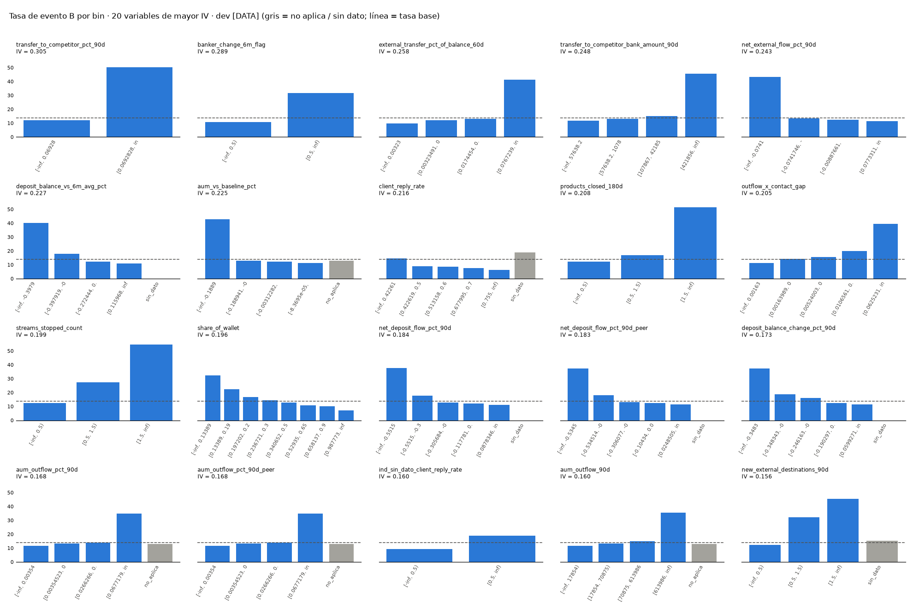

# Paso 9 · Binning, WoE, IV (campeón)

## Objetivo
- Transformar cada candidata en bins monótonos y estables con missing como bin propio, y medir su IV.

## Método
- Principal (D9.1): continuas → `optbinning` `auto_asc_desc`, `min_bin_size` = 0.05 [DEF], ≥ 30 eventos por bin [DEF];
  binarias → bins de negocio {0, 1}; infladas en su mínimo (≥ 70%) → "= mínimo" / "> mínimo" (+ "≥ 2" en conteos)
  (D9.1b); siempre ≥ 30 eventos por bin (desvíos sometidos a G2); missing: "no aplica" y "sin dato".
- Comparación: cuantiles (≤ 10 bins) y business-defined (umbral de alerta del Excel; conteos 0 / 1 / 2+).
- WoE = ln(%buenos / %malos); IV = Σ (%buenos − %malos)·WoE; clases 0.02 / 0.10 / 0.30 / 0.50 [DEF].
- Estabilidad: WoE por bin en los 25 entrenamientos de la CV 5×5 (bins fijos).

## Código
- `src/step09_binning.py`, `src/woe.py` · `tests/test_step09.py` · `step09_woe_iv.csv` (completa), `step09_iv_summary.csv`,
  `outputs/model/step09_binning.pkl`.

## Resultados

### Resumen de IV (todas las candidatas) [DATA]
| variable                                          |    IV | clase   | regla de bins                     |   bins con dato |   bins especiales | tendencia   | tasa mín–máx %   |   IV cuantiles |   IV business |   sd WoE máx |
|:--------------------------------------------------|------:|:--------|:----------------------------------|----------------:|------------------:|:------------|:-----------------|---------------:|--------------:|-------------:|
| transfer_to_competitor_pct_90d                    | 0.305 | fuerte  | optbinning 5%                     |               2 |                 0 | ascendente  | 12.0–50.2        |          0.163 |         0.309 |        0.040 |
| banker_change_6m_flag                             | 0.289 | medio   | negocio {0,1} (D9.1)              |               2 |                 0 | ascendente  | 10.8–31.6        |        nan     |         0.289 |        0.020 |
| external_transfer_pct_of_balance_60d              | 0.258 | medio   | optbinning 5%                     |               4 |                 0 | ascendente  | 9.7–41.2         |          0.192 |         0.244 |        0.056 |
| transfer_to_competitor_bank_amount_90d            | 0.248 | medio   | optbinning 5%                     |               4 |                 0 | ascendente  | 11.9–45.7        |          0.173 |       nan     |        0.055 |
| net_external_flow_pct_90d                         | 0.243 | medio   | optbinning 5%                     |               4 |                 0 | descendente | 11.5–43.1        |          0.167 |         0.223 |        0.045 |
| deposit_balance_vs_6m_avg_pct                     | 0.227 | medio   | optbinning 5%                     |               4 |                 1 | descendente | 11.0–40.3        |          0.179 |         0.181 |        0.040 |
| aum_vs_baseline_pct                               | 0.225 | medio   | optbinning 5%                     |               4 |                 1 | descendente | 11.2–42.9        |          0.184 |         0.217 |        0.041 |
| client_reply_rate                                 | 0.216 | medio   | optbinning 5%                     |               5 |                 1 | descendente | 6.3–14.7         |          0.218 |         0.202 |        0.064 |
| products_closed_180d                              | 0.208 | medio   | negocio inflada en mínimo (D9.1b) |               3 |                 0 | ascendente  | 12.3–51.5        |          0.000 |         0.208 |        0.044 |
| outflow_x_contact_gap                             | 0.205 | medio   | optbinning 5%                     |               5 |                 0 | ascendente  | 11.4–39.4        |          0.157 |       nan     |        0.045 |
| streams_stopped_count                             | 0.199 | medio   | negocio inflada en mínimo (D9.1b) |               3 |                 0 | ascendente  | 12.5–54.5        |          0.000 |         0.199 |        0.066 |
| share_of_wallet                                   | 0.196 | medio   | optbinning 5%                     |               8 |                 0 | descendente | 7.0–32.4         |          0.174 |         0.109 |        0.049 |
| net_deposit_flow_pct_90d                          | 0.184 | medio   | optbinning 5%                     |               5 |                 1 | descendente | 11.1–37.7        |          0.149 |         0.068 |        0.044 |
| net_deposit_flow_pct_90d_peer                     | 0.183 | medio   | optbinning 5%                     |               5 |                 1 | descendente | 11.4–37.4        |          0.148 |       nan     |        0.044 |
| deposit_balance_change_pct_90d                    | 0.173 | medio   | optbinning 5%                     |               5 |                 1 | descendente | 11.3–37.3        |          0.139 |         0.130 |        0.052 |
| aum_outflow_pct_90d                               | 0.168 | medio   | optbinning 5%                     |               4 |                 1 | ascendente  | 11.6–34.8        |          0.136 |         0.160 |        0.045 |
| aum_outflow_pct_90d_peer                          | 0.168 | medio   | optbinning 5%                     |               4 |                 1 | ascendente  | 11.6–34.8        |          0.136 |       nan     |        0.045 |
| ind_sin_dato_client_reply_rate                    | 0.160 | medio   | negocio {0,1} (D9.1)              |               2 |                 0 | ascendente  | 9.3–18.8         |        nan     |         0.160 |        0.017 |
| aum_outflow_90d                                   | 0.160 | medio   | optbinning 5%                     |               4 |                 1 | ascendente  | 11.7–35.6        |          0.134 |       nan     |        0.039 |
| new_external_destinations_90d                     | 0.156 | medio   | negocio inflada en mínimo (D9.1b) |               3 |                 1 | ascendente  | 12.5–45.3        |          0.000 |         0.156 |        0.071 |
| competitor_x_new_destinations                     | 0.155 | medio   | negocio inflada en mínimo (D9.1b) |               2 |                 1 | ascendente  | 12.5–37.5        |          0.000 |       nan     |        0.033 |
| external_transfer_acceleration                    | 0.149 | medio   | optbinning 5%                     |               3 |                 0 | ascendente  | 12.5–38.2        |          0.129 |       nan     |        0.038 |
| recurring_deposit_stopped_flag                    | 0.144 | medio   | negocio {0,1} (D9.1)              |               2 |                 1 | ascendente  | 12.8–42.0        |        nan     |         0.144 |        0.048 |
| share_of_wallet_change                            | 0.142 | medio   | optbinning 5%                     |               5 |                 0 | descendente | 10.4–30.1        |          0.132 |         0.114 |        0.038 |
| contact_gap_ratio                                 | 0.139 | medio   | optbinning 5%                     |               8 |                 0 | ascendente  | 8.9–24.6         |          0.130 |         0.029 |        0.047 |
| contact_gap_ratio_peer                            | 0.139 | medio   | optbinning 5%                     |               9 |                 0 | ascendente  | 9.1–24.4         |          0.131 |       nan     |        0.050 |
| investment_redemption_pct                         | 0.127 | medio   | optbinning 5%                     |               5 |                 1 | ascendente  | 11.5–30.7        |          0.116 |         0.083 |        0.047 |
| salary_deposit_stopped_flag                       | 0.122 | medio   | negocio {0,1} (D9.1)              |               2 |                 1 | ascendente  | 12.5–52.7        |        nan     |         0.122 |        0.063 |
| accounts_closed_90d                               | 0.120 | medio   | negocio inflada en mínimo (D9.1b) |               3 |                 0 | ascendente  | 12.9–42.9        |          0.036 |         0.120 |        0.056 |
| recurring_deposit_change_pct                      | 0.108 | medio   | optbinning 5%                     |               4 |                 1 | descendente | 12.1–28.7        |          0.099 |         0.079 |        0.056 |
| cash_pct_of_portfolio_chg                         | 0.107 | medio   | optbinning 5%                     |               5 |                 1 | ascendente  | 12.2–32.5        |          0.090 |         0.085 |        0.067 |
| repeat_complaint_flag                             | 0.097 | débil   | negocio {0,1} (D9.1)              |               2 |                 0 | ascendente  | 13.0–36.6        |        nan     |         0.097 |        0.035 |
| complaint_escalated_flag                          | 0.092 | débil   | negocio {0,1} (D9.1)              |               2 |                 0 | ascendente  | 12.9–31.9        |        nan     |         0.092 |        0.035 |
| outflow_vs_baseline_pct                           | 0.089 | débil   | optbinning 5%                     |               2 |                 0 | ascendente  | 12.9–32.1        |          0.056 |         0.059 |        0.037 |
| positions_liquidated_pct                          | 0.069 | débil   | negocio inflada en mínimo (D9.1b) |               2 |                 1 | ascendente  | 12.6–23.7        |          0.072 |         0.061 |        0.034 |
| complaint_age_days                                | 0.064 | débil   | negocio inflada en mínimo (D9.1b) |               2 |                 0 | ascendente  | 13.2–33.0        |          0.000 |         0.054 |        0.051 |
| return_vs_benchmark                               | 0.061 | débil   | optbinning 5%                     |               5 |                 1 | descendente | 8.6–19.8         |          0.058 |         0.033 |        0.043 |
| meetings_cancelled_by_client                      | 0.054 | débil   | negocio inflada en mínimo (D9.1b) |               3 |                 1 | ascendente  | 12.7–28.1        |          0.052 |         0.025 |        0.064 |
| pension_deposit_stopped_flag                      | 0.049 | débil   | negocio {0,1} (D9.1)              |               2 |                 1 | ascendente  | 13.2–57.1        |        nan     |         0.049 |        0.128 |
| fixed_income_maturity_not_reinvested              | 0.039 | débil   | optbinning 5%                     |               3 |                 1 | ascendente  | 9.5–20.7         |          0.037 |         0.029 |        0.043 |
| trustee_change_flag                               | 0.038 | débil   | negocio {0,1} (D9.1)              |               2 |                 1 | ascendente  | 12.8–37.1        |        nan     |         0.038 |        0.072 |
| business_payroll_stopped_flag                     | 0.031 | débil   | negocio {0,1} (D9.1)              |               2 |                 1 | ascendente  | 12.9–34.6        |        nan     |         0.031 |        0.076 |
| external_destination_concentration                | 0.030 | débil   | optbinning 5%                     |               5 |                 0 | ascendente  | 10.7–16.7        |          0.109 |       nan     |        0.048 |
| relationship_dissatisfaction_flag                 | 0.027 | débil   | negocio {0,1} (D9.1)              |               2 |                 1 | ascendente  | 12.9–34.3        |        nan     |         0.027 |        0.089 |
| tenure_years                                      | 0.017 | fuera   | optbinning 5%                     |               6 |                 0 | descendente | 10.9–16.8        |          0.012 |       nan     |        0.055 |
| ind_sin_dato_meetings_cancelled_by_client         | 0.008 | fuera   | negocio {0,1} (D9.1)              |               2 |                 0 | descendente | 13.0–15.2        |        nan     |         0.008 |        0.017 |
| recurring_income_monthly                          | 0.007 | fuera   | optbinning 5%                     |               4 |                 0 | ascendente  | 11.9–15.8        |          0.008 |       nan     |        0.034 |
| aum                                               | 0.005 | fuera   | optbinning 5%                     |               3 |                 1 | ascendente  | 13.5–17.0        |          0.011 |       nan     |        0.020 |
| relationship_value                                | 0.004 | fuera   | optbinning 5%                     |               2 |                 0 | ascendente  | 13.6–16.2        |          0.005 |       nan     |        0.020 |
| log_rv                                            | 0.004 | fuera   | optbinning 5%                     |               2 |                 0 | ascendente  | 13.6–16.2        |          0.005 |       nan     |        0.020 |
| aum_share                                         | 0.003 | fuera   | optbinning 5%                     |               3 |                 0 | ascendente  | 12.7–14.5        |          0.003 |       nan     |        0.028 |
| deposit_share                                     | 0.003 | fuera   | optbinning 5%                     |               3 |                 0 | descendente | 12.7–14.5        |          0.003 |       nan     |        0.028 |
| cluster                                           | 0.003 | fuera   | categórica                        |               3 |                 0 | n/a         | 12.9–16.2        |        nan     |       nan     |        0.033 |
| history_months                                    | 0.002 | fuera   | optbinning 5%                     |               2 |                 0 | descendente | 13.7–16.4        |          0.002 |       nan     |        0.056 |
| segment_uhnw                                      | 0.002 | fuera   | negocio {0,1} (D9.1)              |               2 |                 0 | ascendente  | 13.7–16.2        |        nan     |         0.002 |        0.005 |
| has_dividend_stream                               | 0.002 | fuera   | negocio {0,1} (D9.1)              |               2 |                 0 | ascendente  | 13.4–14.4        |        nan     |         0.002 |        0.010 |
| has_credit_anchor                                 | 0.002 | fuera   | negocio {0,1} (D9.1)              |               2 |                 0 | descendente | 13.2–14.2        |        nan     |         0.002 |        0.019 |
| deposit_balance                                   | 0.001 | fuera   | optbinning 5%                     |               2 |                 0 | ascendente  | 13.8–15.7        |          0.003 |       nan     |        0.037 |
| ind_sin_dato_fixed_income_maturity_not_reinvested | 0.001 | fuera   | negocio {0,1} (D9.1)              |               2 |                 0 | ascendente  | 13.2–14.1        |        nan     |         0.001 |        0.020 |
| has_investments                                   | 0.001 | fuera   | negocio {0,1} (D9.1)              |               2 |                 0 | ascendente  | 13.0–14.0        |        nan     |         0.001 |        0.034 |
| n_products_held                                   | 0.001 | fuera   | optbinning 5%                     |               3 |                 0 | descendente | 13.0–14.6        |          0.002 |       nan     |        0.052 |
| n_streams_eligible                                | 0.000 | fuera   | optbinning 5%                     |               2 |                 0 | ascendente  | 13.2–14.0        |          0.001 |       nan     |        0.038 |
| has_linked_business                               | 0.000 | fuera   | negocio {0,1} (D9.1)              |               2 |                 0 | ascendente  | 13.8–14.0        |        nan     |         0.000 |        0.018 |
| has_advisory                                      | 0.000 | fuera   | negocio {0,1} (D9.1)              |               2 |                 0 | descendente | 13.8–13.9        |        nan     |         0.000 |        0.016 |
| has_trust                                         | 0.000 | fuera   | negocio {0,1} (D9.1)              |               2 |                 0 | descendente | 13.8–13.9        |        nan     |         0.000 |        0.015 |
| has_pension_stream                                | 0.000 | fuera   | negocio {0,1} (D9.1)              |               2 |                 0 | ascendente  | 13.8–13.9        |        nan     |         0.000 |        0.020 |
| ind_sin_dato_relationship_dissatisfaction_flag    | 0.000 | fuera   | negocio {0,1} (D9.1)              |               2 |                 0 | ascendente  | 13.8–13.9        |        nan     |         0.000 |        0.021 |
| has_payroll_stream                                | 0.000 | fuera   | negocio {0,1} (D9.1)              |               2 |                 0 | ascendente  | 13.9–13.9        |        nan     |         0.000 |        0.016 |

- 44 de 68 con IV ≥ 0.02; sospechosas (> 0.50): 0 [DATA].
- Monotonía: 0 variables no monótonas [DATA].

### Tabla WoE / IV completa de las 3 variables de mayor IV [DATA]
| variable                             | bin                     |   hogares |   eventos |   % hogares |   tasa % |    WoE |    IV |   sd WoE folds |   % folds mismo signo |
|:-------------------------------------|:------------------------|----------:|----------:|------------:|---------:|-------:|------:|---------------:|----------------------:|
| external_transfer_pct_of_balance_60d | [-inf, 0.00323491)      |      1517 |       147 |      11.252 |    9.690 |  0.407 | 0.016 |          0.056 |               100.000 |
| external_transfer_pct_of_balance_60d | [0.00323491, 0.0174454) |      9374 |      1134 |      69.530 |   12.097 |  0.158 | 0.016 |          0.010 |               100.000 |
| external_transfer_pct_of_balance_60d | [0.0174454, 0.0767239)  |      1691 |       219 |      12.543 |   12.951 |  0.080 | 0.001 |          0.043 |               100.000 |
| external_transfer_pct_of_balance_60d | [0.0767239, inf)        |       900 |       371 |       6.676 |   41.222 | -1.471 | 0.225 |          0.031 |               100.000 |
| banker_change_6m_flag                | [-inf, 0.5)             |     11505 |      1247 |      85.336 |   10.839 |  0.282 | 0.061 |          0.009 |               100.000 |
| banker_change_6m_flag                | [0.5, inf)              |      1977 |       624 |      14.664 |   31.563 | -1.052 | 0.228 |          0.020 |               100.000 |
| transfer_to_competitor_pct_90d       | [-inf, 0.0692828)       |     12807 |      1532 |      94.993 |   11.962 |  0.171 | 0.026 |          0.005 |               100.000 |
| transfer_to_competitor_pct_90d       | [0.0692828, inf)        |       675 |       339 |       5.007 |   50.222 | -1.834 | 0.279 |          0.040 |               100.000 |

- Verificación: por variable, % hogares suma 100 y eventos suman 1,871 [DATA].

### Flags que la regla de 5% fusionaría (evidencia de D9.1) [DATA]
| variable                                          |   % hogares con 1 |   eventos con 1 |   tasa con 1 % | bajo 5% (el SPEC lo fusionaría)   |   IV con bins de negocio |
|:--------------------------------------------------|------------------:|----------------:|---------------:|:----------------------------------|-------------------------:|
| banker_change_6m_flag                             |            14.664 |             624 |         31.563 | False                             |                    0.289 |
| ind_sin_dato_client_reply_rate                    |            48.072 |            1218 |         18.793 | False                             |                    0.160 |
| recurring_deposit_stopped_flag                    |             3.812 |             216 |         42.023 | True                              |                    0.144 |
| salary_deposit_stopped_flag                       |             1.817 |             129 |         52.653 | True                              |                    0.122 |
| repeat_complaint_flag                             |             3.746 |             185 |         36.634 | True                              |                    0.097 |
| complaint_escalated_flag                          |             5.296 |             228 |         31.933 | False                             |                    0.092 |
| pension_deposit_stopped_flag                      |             0.623 |              48 |         57.143 | True                              |                    0.049 |
| trustee_change_flag                               |             1.380 |              69 |         37.097 | True                              |                    0.038 |
| business_payroll_stopped_flag                     |             1.394 |              65 |         34.574 | True                              |                    0.031 |
| relationship_dissatisfaction_flag                 |             1.231 |              57 |         34.337 | True                              |                    0.027 |
| ind_sin_dato_meetings_cancelled_by_client         |            61.015 |            1073 |         13.044 | False                             |                    0.008 |
| segment_uhnw                                      |             5.570 |             122 |         16.245 | False                             |                    0.002 |
| has_dividend_stream                               |            47.026 |             915 |         14.432 | False                             |                    0.002 |
| has_credit_anchor                                 |            34.105 |             608 |         13.223 | False                             |                    0.002 |
| ind_sin_dato_fixed_income_maturity_not_reinvested |            74.054 |            1410 |         14.123 | False                             |                    0.001 |
| has_investments                                   |            85.744 |            1622 |         14.031 | False                             |                    0.001 |
| has_linked_business                               |            26.294 |             496 |         13.992 | False                             |                    0.000 |
| has_advisory                                      |            60.295 |            1125 |         13.839 | False                             |                    0.000 |
| has_trust                                         |            31.791 |             592 |         13.812 | False                             |                    0.000 |
| has_pension_stream                                |            34.335 |             645 |         13.934 | False                             |                    0.000 |
| ind_sin_dato_relationship_dissatisfaction_flag    |            70.257 |            1317 |         13.904 | False                             |                    0.000 |
| has_payroll_stream                                |            53.976 |            1010 |         13.879 | False                             |                    0.000 |

## Tests
- `tests/test_step09.py` (ver pytest).

## Decisiones y preguntas abiertas
- D9.1 (bins de negocio en binarias) y D9.1b (infladas en su mínimo) → pregunta en G2. D9.2 (razón de missing de
  `competitor_x_new_destinations`), D9.3 (especiales con < 30 eventos neutrales), D9.5 (pre-bin) en `reports/decision_log.md`.
