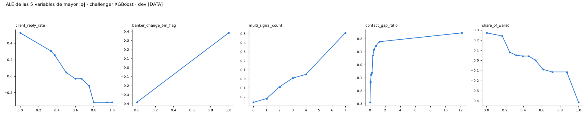

# Paso 11 · Estimación (campeón y challenger)

## Objetivo
- Estimar el campeón (logística sobre WoE) y el challenger (XGBoost monotónico, EBM), medirlos en la misma CV y
  recomendar cuál sigue a escalamiento.

## Método
- Régimen: 1871 eventos B en dev [DATA] > 300 ⟹ logística sobre WoE + challenger ML (tabla H-1).
- 11A: GLM Binomial (statsmodels) sobre y_bueno = 1 − y_B con pesos balanceados w_B; β > 0 sobre WoE; intercepto
  corregido β₀ = β₀* − ln(odds buenos muestra ponderada) + ln(odds buenos población). CV 5×5 anidada: el binning se
  re-ajusta dentro de cada fold de entrenamiento.
- 11B: XGBoost con `monotone_constraints` (+1 / −1 por signo a priori; "?" = 0), Optuna 150 trials, MedianPruner,
  objetivo PR-AUC media 5×5; `scale_pos_weight` = n0/n1 y probabilidad corregida por prior (logit − ln spw). 3 semillas,
  variante WoE, EBM monotónico, RF de referencia. TreeSHAP raw (log-odds), ICE/PDP, interacciones SHAP, ALE,
  reason codes en 200 réplicas bootstrap.
- Comparación pareada por fold en la CV 5×5 de dev; los criterios H-2 que requieren validación quedan para 13–14 (D11.1).

## Código
- `src/step11_champion.py`, `src/step11_challenger.py`, `src/step11_compare.py` · `tests/test_step11.py` ·
  `outputs/tables/step11A_*.csv`, `step11B_*.csv`, `step11_comparison.csv`, `step11_h2_table.csv`,
  `outputs/model/step11A_champion.pkl`, `step11B_xgb.json`, `step11B_challenger.pkl`.

## Resultados

### 11A · Coeficientes del campeón (dev, target B) [DATA]
| variable                  |   β (muestra ponderada) |     EE |       z |   p-valor |   β final |   VIF (WoE) |
|:--------------------------|------------------------:|-------:|--------:|----------:|----------:|------------:|
| intercepto                |                 -0.0176 | 0.0190 | -0.9283 |    0.3533 |    1.8070 |    nan      |
| client_reply_rate         |                  0.6445 | 0.0447 | 14.4325 |    0.0000 |    0.6445 |      1.3023 |
| banker_change_6m_flag     |                  0.7373 | 0.0370 | 19.9146 |    0.0000 |    0.7373 |      1.0740 |
| share_of_wallet           |                  0.4864 | 0.0469 | 10.3662 |    0.0000 |    0.4864 |      1.1366 |
| outflow_x_contact_gap     |                  0.3245 | 0.0508 |  6.3855 |    0.0000 |    0.3245 |      1.2781 |
| return_vs_benchmark       |                  0.7252 | 0.0762 |  9.5174 |    0.0000 |    0.7252 |      1.0113 |
| streams_stopped_count     |                  0.4870 | 0.0541 |  9.0055 |    0.0000 |    0.4870 |      1.1411 |
| cash_pct_of_portfolio_chg |                  0.5066 | 0.0630 |  8.0427 |    0.0000 |    0.5066 |      1.0577 |
| contact_gap_ratio_peer    |                  0.3386 | 0.0581 |  5.8323 |    0.0000 |    0.3386 |      1.3822 |

- Todos los β de variables > 0 y p < 0.001; VIF máx 1.38 [DATA].
- Verificación del intercepto: β₀ = -0.0176 − 0.0004 (ln odds buenos de dev ponderada)
  + 1.8250 (ln odds buenos población B) = 1.8070 [DATA].

### 11A · Sensibilidad target A (5 folds, r1) [DATA]
|   fold |   AUC vs A · modelo B |   AUC vs A · modelo A |   PR-AUC vs A · modelo B |   PR-AUC vs A · modelo A | β > 0 todos (A)   |
|-------:|----------------------:|----------------------:|-------------------------:|-------------------------:|:------------------|
|      0 |                0.7696 |                0.7698 |                   0.2408 |                   0.2389 | True              |
|      1 |                0.7850 |                0.7865 |                   0.2577 |                   0.2608 | True              |
|      2 |                0.7211 |                0.7213 |                   0.1876 |                   0.1860 | True              |
|      3 |                0.7295 |                0.7308 |                   0.1895 |                   0.1973 | True              |
|      4 |                0.7473 |                0.7492 |                   0.1943 |                   0.1905 | True              |

### 11B · Modelos challenger (CV) [DATA]
| modelo                      |   folds |   AUC media |   Gini media |   PR-AUC media |   KS media |   Brier media |   pendiente calibración b media |   captura RV eventos decil 1 media |   Gini entrenamiento media |   PR-AUC sd |
|:----------------------------|--------:|------------:|-------------:|---------------:|-----------:|--------------:|--------------------------------:|-----------------------------------:|---------------------------:|------------:|
| XGBoost monotónico (Optuna) |      25 |      0.7153 |       0.4306 |         0.3629 |     0.3214 |        0.1059 |                          0.9790 |                             0.3353 |                     0.4775 |      0.0200 |
| XGBoost entradas WoE        |      25 |      0.7189 |       0.4377 |         0.3670 |     0.3268 |        0.1055 |                          1.0051 |                             0.3413 |                     0.4670 |      0.0211 |
| EBM monotónico (5 folds)    |       5 |      0.7148 |       0.4296 |         0.3626 |     0.3229 |        0.1057 |                          0.9901 |                             0.3377 |                     0.4459 |      0.0269 |
| RF referencia (5 folds)     |       5 |      0.7137 |       0.4275 |         0.3571 |     0.3172 |        0.1822 |                          1.0763 |                             0.3159 |                     0.6680 |      0.0211 |

### 11B · Sensibilidad a la semilla [DATA]
|   semilla |   PR-AUC media |   Gini medio |
|----------:|---------------:|-------------:|
|   42.0000 |         0.3629 |       0.4306 |
|   43.0000 |         0.3623 |       0.4304 |
|   44.0000 |         0.3630 |       0.4307 |

### 11B · Importancia SHAP (|φ| medio, log-odds) [DATA]
| variable                               |   |φ| medio |   restricción |   % de Σ|φ| |
|:---------------------------------------|------------:|--------------:|------------:|
| client_reply_rate                      |      0.2850 |            -1 |     21.7590 |
| banker_change_6m_flag                  |      0.2414 |             1 |     18.4296 |
| multi_signal_count                     |      0.1469 |             1 |     11.2139 |
| contact_gap_ratio                      |      0.1151 |             1 |      8.7873 |
| share_of_wallet                        |      0.1106 |            -1 |      8.4447 |
| cash_pct_of_portfolio_chg              |      0.0789 |             1 |      6.0217 |
| meetings_cancelled_by_client           |      0.0475 |             1 |      3.6302 |
| fixed_income_maturity_not_reinvested   |      0.0459 |             1 |      3.5080 |
| streams_stopped_count                  |      0.0429 |             1 |      3.2761 |
| recurring_deposit_change_pct           |      0.0404 |            -1 |      3.0874 |
| transfer_to_competitor_bank_amount_90d |      0.0373 |             1 |      2.8502 |
| complaint_escalated_flag               |      0.0330 |             1 |      2.5167 |
| repeat_complaint_flag                  |      0.0327 |             1 |      2.4978 |
| net_external_flow_pct_90d              |      0.0312 |            -1 |      2.3848 |
| business_payroll_stopped_flag          |      0.0138 |             1 |      1.0523 |
| share_of_wallet_change                 |      0.0071 |            -1 |      0.5404 |

- Verificación: Σ % = 100.0% [DATA]; aditividad φ₀ + Σφ = margen, error máx. 1.19e-06 [DATA].

### 11B · Monotonía (ICE 500 hogares × 21 puntos; PDP) [DATA]
| variable                               |   restricción |   violaciones ICE |   violaciones PDP |
|:---------------------------------------|--------------:|------------------:|------------------:|
| banker_change_6m_flag                  |             1 |                 0 |                 0 |
| client_reply_rate                      |            -1 |                 0 |                 0 |
| multi_signal_count                     |             1 |                 0 |                 0 |
| share_of_wallet                        |            -1 |                 0 |                 0 |
| fixed_income_maturity_not_reinvested   |             1 |                 0 |                 0 |
| transfer_to_competitor_bank_amount_90d |             1 |                 0 |                 0 |
| recurring_deposit_change_pct           |            -1 |                 0 |                 0 |
| contact_gap_ratio                      |             1 |                 0 |                 0 |
| cash_pct_of_portfolio_chg              |             1 |                 0 |                 0 |
| repeat_complaint_flag                  |             1 |                 0 |                 0 |
| streams_stopped_count                  |             1 |                 0 |                 0 |
| net_external_flow_pct_90d              |            -1 |                 0 |                 0 |
| meetings_cancelled_by_client           |             1 |                 0 |                 0 |
| complaint_escalated_flag               |             1 |                 0 |                 0 |
| share_of_wallet_change                 |            -1 |                 0 |                 0 |
| business_payroll_stopped_flag          |             1 |                 0 |                 0 |

### 11B · Interacciones SHAP (2,000 hogares) [DATA]
| variable                               |   % interacción en |φ| | principal socio              | > 20%   |
|:---------------------------------------|-----------------------:|:-----------------------------|:--------|
| share_of_wallet_change                 |                   57.2 | client_reply_rate            | True    |
| recurring_deposit_change_pct           |                   41.0 | share_of_wallet              | True    |
| meetings_cancelled_by_client           |                   33.4 | client_reply_rate            | True    |
| transfer_to_competitor_bank_amount_90d |                   32.2 | client_reply_rate            | True    |
| share_of_wallet                        |                   31.9 | client_reply_rate            | True    |
| business_payroll_stopped_flag          |                   30.5 | contact_gap_ratio            | True    |
| cash_pct_of_portfolio_chg              |                   30.0 | banker_change_6m_flag        | True    |
| net_external_flow_pct_90d              |                   28.4 | client_reply_rate            | True    |
| fixed_income_maturity_not_reinvested   |                   27.9 | meetings_cancelled_by_client | True    |
| repeat_complaint_flag                  |                   26.9 | multi_signal_count           | True    |

- Interacción global = 24.0% de Σ|φ| [DATA]; variables con > 20%:
  11 [DATA].

### Estabilidad de reason codes (200 réplicas bootstrap, 1,000 hogares de dev) [DATA]
| modelo             |   réplicas |   hogares referencia |   con al menos 1 reason code |   acuerdo top 1 % |   acuerdo top 3 % |   % hogares con acuerdo top 1 ≥ 70% |   % réplicas con todos los β > 0 |   % variables con signo coherente (media réplicas) |
|:-------------------|-----------:|---------------------:|-----------------------------:|------------------:|------------------:|------------------------------------:|---------------------------------:|---------------------------------------------------:|
| campeón            |        200 |                 1000 |                         1000 |              91.7 |              96.5 |                                89.0 |                            100.0 |                                              nan   |
| challenger XGBoost |        200 |                 1000 |                         1000 |              77.0 |              80.2 |                                64.3 |                            nan   |                                               99.9 |

### Comparación pareada campeón vs challenger (CV 5×5, dev) [DATA]
| métrica                    |   campeón |   challenger XGBoost |   Δ (challenger − campeón) |   % folds challenger mejor |
|:---------------------------|----------:|---------------------:|---------------------------:|---------------------------:|
| AUC                        |    0.7143 |               0.7153 |                     0.0010 |                    48.0000 |
| Gini                       |    0.4286 |               0.4306 |                     0.0019 |                    48.0000 |
| PR-AUC                     |    0.3441 |               0.3629 |                     0.0189 |                    96.0000 |
| KS                         |    0.3146 |               0.3214 |                     0.0068 |                    64.0000 |
| Brier                      |    0.1073 |               0.1059 |                    -0.0014 |                    96.0000 |
| pendiente calibración b    |    0.9396 |               0.9790 |                     0.0393 |                   nan      |
| captura RV eventos decil 1 |    0.2835 |               0.3353 |                     0.0519 |                   100.0000 |
| Gini entrenamiento         |    0.4463 |               0.4775 |                     0.0311 |                   nan      |

### Tabla H-2 (criterios de reemplazo) [DATA]
| criterio H-2                                                                          | valor [DATA]                | cumple    |
|:--------------------------------------------------------------------------------------|:----------------------------|:----------|
| ΔGini ≥ +0.05                                                                         | +0.0019                     | no        |
| ΔPR-AUC ≥ +0.03                                                                       | +0.0189                     | no        |
| Sobreajuste (Gini entrenamiento − CV) no peor que campeón (proxy de la caída dev→val) | 0.0469 vs 0.0177            | no        |
| Brier ≤ campeón y b ∈ [0.8, 1.2] (OOF, antes de Platt)                                | 0.1059 vs 0.1073; b = 0.979 | sí        |
| Violaciones de monotonía = 0                                                          | 0                           | sí        |
| Reason codes estables ≥ 70% (top 1) y signo coherente 100%                            | 77.0%; signo 99.9%          | no        |
| Captura de RV de eventos en decil 1 ≥ campeón                                         | 0.3353 vs 0.2835            | sí        |
| PSI dev→val < 0.10 por tramo                                                          | pendiente paso 13           | pendiente |

- Recomendación: Se mantiene el campeón WoE + logística: el challenger no cumple 4 de los criterios H-2 evaluables en dev.

## Tests
- `tests/test_step11.py` (ver pytest).

## Decisiones y preguntas abiertas
- D11.1–D11.4 en `reports/decision_log.md`; preguntas G2-1 a G2-4 en `reports/gate_2.md`.
