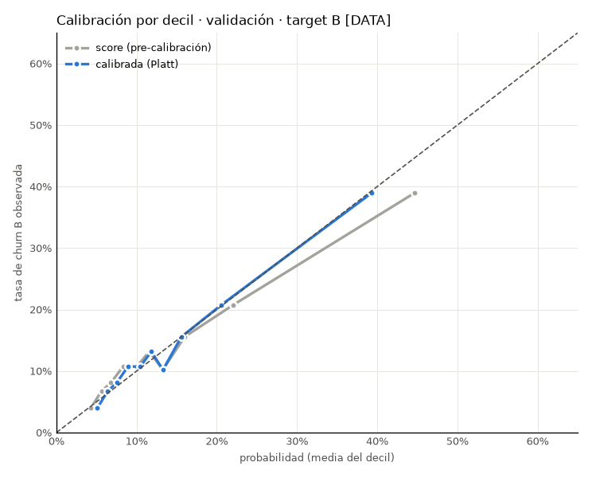

# Paso 14 · Calibración

## Objetivo
- Que la probabilidad publicada coincida con la tasa observada, en total, por tramo, por segmento y por valor.

## Método
- Platt sobre validación: y ~ a + b·logit(p_score); aceptación 0.8 ≤ b ≤ 1.2 [DEF SPEC]. Isotónica comparada por
  Brier y ECE en OOF de 5 folds dentro de val con IC bootstrap 95% (1,000 réplicas); regla previa: isotónica solo si el
  IC de la diferencia de Brier queda < 0 (D14.1).
- Tramo: esperado vs observado con Wilson 90%; shrinkage beta-binomial m = 30 hacia lo esperado.
- Valor: Σ p·RV vs Σ RV de eventos y Σ value_lost por quintil de RV y tramo; prueba LR de log_rv.
- Control aleatorio 10–15% en Alto: solo diseño (sin cohortes pre/post, L7). 3M vs 6M: descriptivo.

## Código
- `src/step14_calibration.py` · `tests/test_step14.py` · `step14_*.csv`, `outputs/model/step14_calibrator.pkl`;
  `household_scores.csv` gana la columna `probabilidad_calibrada`.

## Resultados

### Platt [DATA]
|       a |      b |   b IC95 inf |   b IC95 sup | 0.8 ≤ b ≤ 1.2   | método elegido   |
|--------:|-------:|-------------:|-------------:|:----------------|:-----------------|
| -0.2724 | 0.8540 |       0.7702 |       0.9378 | True            | Platt            |

### Platt vs isotónica (OOF en val) [DATA]
| método                         |   Brier |   ECE (pp) |   media p % |   tasa observada % |
|:-------------------------------|--------:|-----------:|------------:|-------------------:|
| sin calibrar (score)           |  0.1089 |     1.7948 |     14.2550 |            13.8951 |
| Platt (OOF 5 folds en val)     |  0.1086 |     0.9105 |     13.8978 |            13.8951 |
| isotónica (OOF 5 folds en val) |  0.1092 |     0.9648 |     13.8971 |            13.8951 |

| diferencia (isotónica − Platt)   |    media |   IC 95% inf |   IC 95% sup |
|:---------------------------------|---------:|-------------:|-------------:|
| Brier                            |  0.00054 |      0.00004 |      0.00103 |
| ECE                              | -0.00118 |     -0.00786 |      0.00578 |

- Método elegido: **Platt** [DATA].

### Alineación de la media [DATA]
| muestra   |   media p score % |   media p calibrada % |   tasa observada % |
|:----------|------------------:|----------------------:|-------------------:|
| dev       |             14.13 |                 13.79 |              13.88 |
| val       |             14.25 |                 13.90 |              13.90 |

### Tramo: esperado vs observado (val) [DATA]
| tramo      |   hogares |   eventos |   esperada % |   observada % |   Wilson 90% inf |   Wilson 90% sup | esperada dentro de IC   |   shrinkage m=30 % |
|:-----------|----------:|----------:|-------------:|--------------:|-----------------:|-----------------:|:------------------------|-------------------:|
| Crítico    |       250 |       139 |        52.19 |         55.60 |            50.40 |            60.68 | True                    |              55.23 |
| Alto       |      1368 |       288 |        20.24 |         21.05 |            19.30 |            22.92 | True                    |              21.04 |
| Vigilancia |      2536 |       281 |        11.59 |         11.08 |            10.10 |            12.15 | True                    |              11.09 |
| Estable    |      1625 |        95 |         6.26 |          5.85 |             4.96 |             6.88 | True                    |               5.85 |

- Verificación: hogares suman 5,779 = 5,779; Σ share × observada = 13.90% = 13.90% [DATA].

### Por segmento (val) [DATA]
| tramo      |   hogares |   eventos |   esperada % |   observada % |   Wilson 90% inf |   Wilson 90% sup | esperada dentro de IC   |   shrinkage m=30 % | segmento   |
|:-----------|----------:|----------:|-------------:|--------------:|-----------------:|-----------------:|:------------------------|-------------------:|:-----------|
| Crítico    |       240 |       132 |        52.18 |         55.00 |            49.69 |            60.20 | True                    |              54.69 | HNW        |
| Alto       |      1292 |       264 |        20.29 |         20.43 |            18.65 |            22.34 | True                    |              20.43 | HNW        |
| Vigilancia |      2420 |       268 |        11.64 |         11.07 |            10.07 |            12.17 | True                    |              11.08 | HNW        |
| Estable    |      1504 |        86 |         6.26 |          5.72 |             4.81 |             6.78 | True                    |               5.73 | HNW        |
| Crítico    |        10 |         7 |        52.61 |         70.00 |            44.17 |            87.31 | True                    |              56.95 | UHNW       |
| Alto       |        76 |        24 |        19.45 |         31.58 |            23.57 |            40.85 | False                   |              28.15 | UHNW       |
| Vigilancia |       116 |        13 |        10.56 |         11.21 |             7.25 |            16.93 | True                    |              11.07 | UHNW       |
| Estable    |       121 |         9 |         6.26 |          7.44 |             4.38 |            12.36 | True                    |               7.20 | UHNW       |

- UHNW: pocos eventos por tramo; se lee como descriptivo (L5).

### Por quintil de RV (val) [DATA]
| banda RV   |   hogares |   eventos |   p calibrada media % |   tasa observada % |   Σ p·RV $M |   Σ RV de eventos $M |   Σ value_lost observado $M |   Σ p·RV / Σ RV eventos |
|:-----------|----------:|----------:|----------------------:|-------------------:|------------:|---------------------:|----------------------------:|------------------------:|
| Q1 (menor) |  1,156.00 |    156.00 |                 13.98 |              13.49 |      247.83 |               243.81 |                      169.26 |                    1.02 |
| Q2         |  1,156.00 |    157.00 |                 13.89 |              13.58 |      456.16 |               446.77 |                      291.12 |                    1.02 |
| Q3         |  1,155.00 |    163.00 |                 14.22 |              14.11 |      791.29 |               778.77 |                      572.80 |                    1.02 |
| Q4         |  1,156.00 |    148.00 |                 13.65 |              12.80 |    1,368.09 |             1,270.78 |                      825.10 |                    1.08 |
| Q5 (mayor) |  1,156.00 |    179.00 |                 13.73 |              15.48 |    5,116.46 |             5,994.63 |                    3,915.58 |                    0.85 |

### Por tramo en valor (val) [DATA]
| tramo      |   Σ p·RV $M |   Σ RV de eventos $M |   Σ value_lost observado $M |
|:-----------|------------:|---------------------:|----------------------------:|
| Crítico    |    1,188.95 |             1,441.41 |                    1,163.77 |
| Alto       |    2,833.72 |             3,743.22 |                    2,277.66 |
| Vigilancia |    2,820.11 |             2,510.05 |                    1,731.15 |
| Estable    |    1,137.05 |             1,040.06 |                      601.30 |

- `value_lost_6m` mide pérdida (no el RV completo): Σ value_lost ≤ Σ RV de eventos por construcción [DATA].

### ¿log_rv mejora la calibración? [DATA]
| prueba                          |     LR |   gl |   p-valor |   coef log_rv |
|:--------------------------------|-------:|-----:|----------:|--------------:|
| agregar log_rv a la calibración | 2.7490 |    1 |    0.0973 |        0.1507 |

### Probabilidad calibrada por tramo (20,000 hogares) [DATA]
| tramo      |   hogares (20,000) |   p calibrada media |   p mín |   p máx |
|:-----------|-------------------:|--------------------:|--------:|--------:|
| Crítico    |                838 |              0.5190 |  0.3689 |  0.8413 |
| Alto       |               4757 |              0.2030 |  0.0370 |  0.3655 |
| Vigilancia |               8854 |              0.1164 |  0.0808 |  0.1656 |
| Estable    |               5551 |              0.0629 |  0.0316 |  0.0797 |

### Diseño del control aleatorio en Alto [DEF SPEC 10–15%; tasas DATA]
|   % control |   hogares control |   hogares tratados |   tasa base (p calibrada Alto) % |   efecto mínimo detectable (pp, α 5%, potencia 80%) |   reducción relativa mínima detectable % |
|------------:|------------------:|-------------------:|---------------------------------:|----------------------------------------------------:|-----------------------------------------:|
|       10.00 |            476.00 |           4,281.00 |                            20.24 |                                                5.44 |                                    26.87 |
|       12.50 |            595.00 |           4,162.00 |                            20.24 |                                                4.93 |                                    24.37 |
|       15.00 |            714.00 |           4,043.00 |                            20.24 |                                                4.57 |                                    22.57 |

### Churn a 3M (soft) vs 6M (hard) por tramo (val, población A; descriptivo) [DATA]
| tramo      |   hogares |   soft_3m |   hard_6m |   % soft 3M |   % hard 6M |   soft / (soft + hard) % |
|:-----------|----------:|----------:|----------:|------------:|------------:|-------------------------:|
| Crítico    |       254 |     62.00 |     81.00 |       24.41 |       31.89 |                    43.36 |
| Alto       |      1392 |    180.00 |    132.00 |       12.93 |        9.48 |                    57.69 |
| Vigilancia |      2565 |    201.00 |    109.00 |        7.84 |        4.25 |                    64.84 |
| Estable    |      1631 |     72.00 |     29.00 |        4.41 |        1.78 |                    71.29 |

## Tests
- `tests/test_step14.py` (ver pytest).

## Decisiones y preguntas abiertas
- D14.1–D14.3 en `reports/decision_log.md`.
