# Churn Propensity Scorecard · Documento de modelo

Modelo 1 de 3 (scoring estadístico) · Client Pulse · Citizens Private Bank · base **sintética**.
Toda cifra es [DATA-SINT]: sale de los datos, pero la base es sintética; no es resultado de un banco real.

Principio de diseño (DM.1): **el holdout solo evalúa.** Calibración, cortes de tramo y overrides se ajustan con
predicciones out-of-fold de la CV 5×5 en desarrollo; el holdout los mide.

## Índice

0. [Setup e inventario](#0-setup-e-inventario)
1. [Target y churn rate](#1-target-y-churn-rate)
2. [Diccionario de datos](#2-diccionario-de-datos)
3. [Calidad de datos](#3-calidad-de-datos)
4. [Muestra](#4-muestra)
5. [Auditoría de features y derivadas](#5-auditoría-de-features-y-derivadas)
6. [Análisis univariado](#6-análisis-univariado)
7. [Segmentación](#7-segmentación)
8. [Correlación y diagnóstico de estructura](#8-correlación-y-diagnóstico-de-estructura)
9. [Binning, WoE e IV](#9-binning-woe-e-iv)
10. [Selección de variables](#10-selección-de-variables)
11. [Estimación: campeón, versión ejecutiva y challenger](#11-estimación-campeón-versión-ejecutiva-y-challenger)
12. [Escalamiento, tramos y salida por hogar](#12-escalamiento-tramos-y-salida-por-hogar)

---

## 0. Setup e inventario

**Objetivo**
- Dejar el entorno reproducible y confirmar por código que la base es la descrita antes de modelar.

**Por qué**
- Un scorecard auditable empieza por una fuente identificada (ruta, hash, forma) y hechos verificados; si un hecho
  no cuadra, todo lo posterior hereda el error.

**Método**
- Lectura en solo lectura, hash SHA-256 de la fuente, versiones de paquetes congeladas en `requirements.txt`.
- 36 controles contra la sección DATOS del brief: forma, unicidad, corte, segmentos, targets, exclusiones,
  colas de valor, missing estructural (regla: `has_*` = False ⇒ NaN), bloque 40–74%, historia corta.
- Missing estructural: crosstab de cada variable contra los 8 `has_*`; se reporta la violación (valor donde no
  aplica) y los NaN adicionales donde sí aplica.

**Código** · `src/00_setup.py` (utilidades en `src/common.py`)

**Salida** · `outputs/tables/00_inventory.md` (hechos, mapa de missing, columnas), `00_facts_qc.csv`,
`00_missing_map.csv`, `00_columns.csv`, `00_versions.csv`

| Hecho [DATA-SINT] | Esperado | Observado |
|:--|:--|:--|
| Filas / `household_id` únicos / columnas | 20,000 / 20,000 / 62 | 20,000 / 20,000 / 62 |
| `snapshot_date` | 2025-12-31 único | 2025-12-31 único |
| `segment` | HNW 18,897 / UHNW 1,103 | HNW 18,897 / UHNW 1,103 |
| `hard_churn_6m` | 1,200 / 19,877 (6.04%) | 1,200 / 19,877 (6.04%) |
| `soft_churn_3m` | 1,756 (8.83%) | 1,756 (8.83%) |
| hard ∩ soft | 0 | 0 |
| Unión hard ∪ soft | 2,956 (14.9%) | 2,956 (14.87%) |
| `churn_excluded` / targets NaN | 123 / todos NaN | 123 / todos NaN |
| `value_lost_6m` > 0 sin evento | 0 | 0 |
| Eventos duros HNW / UHNW | 1,120 / 80 | 1,120 / 80 |
| `relationship_value` mediana / p99 / máx | $4.8M / $92M / $904M | $4.84M / $92.5M / $904.0M |
| Top 5% hogares, % del valor | 37.5% | 37.48% |
| `history_months` < 24 | 1,425 | 1,425 |
| `aum_vs_baseline_pct` missing si historia < 24 | ~24% | 23.7% |

Mapa de missing [DATA-SINT]:

| Variable | Condición de missing | % missing | Valores donde no aplica | NaN extra donde aplica |
|:--|:--|--:|--:|--:|
| `aum` | `has_investments` = False | 14.35 | 0 | 0 |
| `aum_outflow_90d`, `aum_outflow_pct_90d`, `investment_redemption_pct` | `has_investments` = False | 14.49 | 0 | 27 (todos historia < 24) |
| `positions_liquidated_pct` | `has_investments` = False | 14.59 | 0 | 48 (historia < 24) |
| `aum_vs_baseline_pct`, `cash_pct_of_portfolio_chg` | `has_investments` = False | 15.00 | 0 | 131 (historia < 24) |
| `pension_deposit_stopped_flag` | `has_pension_stream` = False | 65.74 | **134** | 84 |
| `business_payroll_stopped_flag` | `has_linked_business` = False | 73.89 | 0 | 64 |
| `trustee_change_flag` | `has_trust` = False | 68.13 | 0 | 0 |
| `salary_deposit_stopped_flag` | `has_payroll_stream` = False | 47.30 | 0 | 232 |
| `return_vs_benchmark` | `has_advisory` = False | 41.00 | 0 | 251 (historia < 24) |
| `client_reply_rate` | operativa: < 3 contactos en 90d | 47.99 | n/a | n/a |
| `meetings_cancelled_by_client` | operativa: campo no registrado por el banker | 60.72 | n/a | n/a |
| `relationship_dissatisfaction_flag` | operativa: fuera del piloto del Assistant | 70.45 | n/a | n/a |
| `fixed_income_maturity_not_reinvested` | operativa: sin vencimientos | 73.91 | n/a | n/a |

**QC** · 35 PASS · 1 WARN · 0 FAIL
- WARN: `pension_deposit_stopped_flag` tiene valor (siempre 0) en 134 hogares sin `has_pension_stream`
  (124 con `history_months` = 24). Excepción benigna (0 = "no se detuvo"); se recodifica a "no aplica" en el paso 3.
- Las 4 variables con missing operativo no tienen condición observable en la base: se confirma solo con el
  diccionario del generador. Pregunta para el equipo de datos en un banco real.

**Decisiones y alternativas descartadas** · D0.1–D0.4 en `DECISIONS.md`
- Fuente CSV en vez del XLSX indicado (no existe; el CSV cumple todos los hechos). Descartado convertir a XLSX.
- Proyecto aislado en `scorecard/` para no colisionar con el generador del repo.
- Missing operativo tratado como bin "sin dato", distinto de "no aplica" estructural.

**Parámetros confirmados por el usuario** (D0.5)
- Target primario `hard_churn_6m`; secundario `soft_churn_3m`; sensibilidad unión.
- Capacidad operativa: Crítico = top 3% por probabilidad (~600 hogares; ~180 en holdout), sin dato de banqueros.
- Inconsistencias: se documentan y se trabaja con los datos tal cual. Concentración de valor intacta (sin capping).

---

## 1. Target y churn rate

**Objetivo**
- Fijar el evento, la población y la tasa de churn de cartera por hogares y por valor, antes de cualquier score.

**Por qué**
- En banca privada un hogar grande pesa más que veinte chicos: la tasa por hogares y la tasa por valor responden
  preguntas distintas y su brecha es información. El score se calibrará contra estas tasas.

**Método y fórmulas**
- Población: 19,877 hogares (`churn_excluded` = False). Los 123 excluidos (muerte / reubicación; 0.66% del RV) quedan
  fuera de entrenamiento y métricas y se conservan en el scoring con bandera.
- Ventanas desde T0 = 2025-12-31: hard = salida total en (T0, T0+6m]; soft = contracción > 20% sin salida en
  (T0, T0+3m]. Corte único: sin censura ni tiempo al evento; cada hogar tiene la ventana completa.
- Churn por hogares = eventos ÷ hogares.
- Churn por valor (i) = Σ RVᵢ·yᵢ ÷ Σ RVᵢ (valor en riesgo); (ii) = Σ `value_lost_6m`ᵢ·yᵢ ÷ Σ RVᵢ (valor perdido).
- IC 95%: bootstrap de hogares, 500 réplicas estratificadas por segmento. RV crudo, sin capping (D1.2).

**Código** · `src/01_target.py`

**Salida** · `outputs/tables/01_churn_rates.csv`, `01_value_concentration.csv`, `01_partial_loss.csv`, `01_excluded.csv`

| Target | Segmento | Hogares | Eventos | Churn hogares % [IC95] | Churn valor (i) % [IC95] | Churn valor (ii) % [IC95] |
|:--|:--|--:|--:|:--|:--|:--|
| hard 6m | Total | 19,877 | 1,200 | 6.04 [5.67, 6.38] | 6.46 [5.56, 7.38] | 6.46 [5.56, 7.38] |
| hard 6m | HNW | 18,782 | 1,120 | 5.96 [5.64, 6.30] | 6.00 [5.60, 6.46] | 6.00 [5.60, 6.46] |
| hard 6m | UHNW | 1,095 | 80 | 7.31 [5.84, 8.77] | 7.17 [5.07, 9.61] | 7.17 [5.07, 9.61] |
| soft 3m | Total | 19,877 | 1,756 | 8.83 [8.44, 9.23] | 9.64 [8.51, 10.91] | 3.86 [3.42, 4.38] |
| soft 3m | HNW | 18,782 | 1,651 | 8.79 [8.40, 9.19] | 8.95 [8.41, 9.53] | 3.53 [3.29, 3.76] |
| soft 3m | UHNW | 1,095 | 105 | 9.59 [7.85, 11.51] | 10.73 [7.90, 14.16] | 4.37 [3.16, 5.76] |
| unión | Total | 19,877 | 2,956 | 14.87 [14.37, 15.39] | 16.10 [14.58, 17.61] | 10.32 [9.33, 11.30] |
| unión | HNW | 18,782 | 2,771 | 14.75 [14.28, 15.26] | 14.96 [14.28, 15.63] | 9.54 [9.08, 10.01] |
| unión | UHNW | 1,095 | 185 | 16.90 [14.84, 19.13] | 17.90 [14.65, 21.80] | 11.55 [9.29, 14.30] |

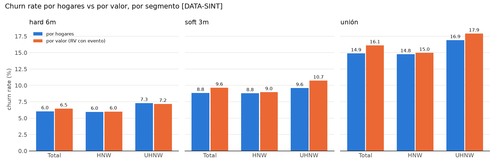

Concentración del valor perdido [DATA-SINT] (se reporta, no se corrige):

| Target | Eventos | Valor perdido $M | Top 1 hogar % | Top 10 hogares % | Top 5% de eventos % | Mediana por evento $M |
|:--|--:|--:|--:|--:|--:|--:|
| hard 6m | 1,200 | 13,323 | 4.96 | 16.47 | 38.24 | 4.84 |
| soft 3m | 1,756 | 7,963 | 4.33 | 16.93 | 42.06 | 1.90 |
| unión | 2,956 | 21,286 | 3.10 | 12.02 | 42.23 | 2.88 |

- UHNW = 5.5% de los hogares y 39.0% del RV ($80.4B de $206.3B): pesa casi 7 veces más por valor que por hogares.
- Hard es pérdida total (`value_lost_6m` = RV en el 100% de los eventos) → (i) = (ii). Soft pierde en mediana 39.8%
  del RV (p10 23.9%, p90 56.3%).
- El IC del churn por valor hard (±0.9 pp) es 2.5 veces más ancho que el de hogares (±0.36 pp): un solo hogar UHNW de
  $661M explica 4.96% del valor perdido. Por eso la validación por valor (paso 13) llevará IC.

**QC** · 15 PASS · 0 WARN · 0 FAIL
- hard ∩ soft = 0; `value_lost_6m` = 0 en el 100% de los no-eventos; `value_lost_6m` ≤ RV en el 100%.
- Consistencia aritmética: tasa de cartera = Σ share × tasa por segmento (hogares y valor) para los 3 targets;
  eventos HNW + UHNW = total; unión = hard + soft en eventos y en valor perdido (diferencias < 1e-9).

**Decisiones y alternativas descartadas** · D1.1–D1.3
- Base de valor RV, no `aum` (missing estructural en 14.4%).
- IC por bootstrap sin winsorizar ni recortar RV (D0.5).

---

## 2. Diccionario de datos

**Objetivo**
- Clasificar las 62 columnas y decidir cuáles son predictores elegibles antes de ver su relación con el target.

**Por qué**
- Fijar dirección esperada y elegibilidad *a priori* permite detectar después señales con signo contrario al
  negocio y evita que outcomes o compuestos se cuelen como predictores.

**Método**
- Por columna: rol, dimensión, tipo, ventana, unidad, tipo de feature (nivel / frecuencia / recencia / magnitud /
  tendencia / aceleración / persistencia / cambio vs baseline), % missing, condición de missing estructural,
  dirección esperada (+ más churn, − menos churn, ? sin hipótesis) y elegibilidad.
- Descripciones y unidades del diccionario del generador; clasificación propia en `src/dictionary.py`.

**Código** · `src/02_dictionary.py`, `src/dictionary.py`

**Salida** · `outputs/tables/02_data_dictionary.csv` (tabla completa, 62 filas), `02_dictionary_summary.csv`

| Rol | Dimensión | Columnas | Elegibles |
|:--|:--|--:|--:|
| identificador | — | 2 | 0 |
| estructura | `segment`, `has_*` ×8, `age_primary`, `tenure_years`, `history_months` | 12 | 12 |
| nivel patrimonial | `relationship_value`, `deposit_balance`, `aum`, `recurring_income_monthly`, `share_of_wallet` | 5 | 5 |
| señal | salida de activos | 7 | 7 |
| señal | deterioro de saldos | 3 | 3 |
| señal | externalización / competencia | 9 | 9 |
| señal | ingresos recurrentes | 5 | 5 |
| señal | pérdida de productos | 4 | 4 |
| señal | fricción de servicio | 4 | 4 |
| señal | relación con banquero | 4 | 4 |
| señal | rendimiento | 1 | 1 |
| compuesto | `multi_signal_flag`, `multi_signal_count` | 2 | 0 |
| outcome | `hard_churn_6m`, `soft_churn_3m`, `value_lost_6m`, `churn_excluded` | 4 | 0 |

- 54 elegibles, 8 no elegibles. Las 37 señales tienen dirección esperada: 28 "+", 9 "−".
- Revisión regulatoria pendiente (paso 10): `age_primary` (fair lending / UDAAP) y `bureau_new_mortgage_elsewhere`
  (FCRA, propósito permisible).
- Ventanas presentes: 30d, 45d, 60d, 90d, 180d, 6m, 12m, baseline 6m y nivel en T0.

**QC** · 3 PASS · 0 WARN · 0 FAIL
- Las 62 columnas clasificadas, sin faltantes ni sobrantes; ninguna prohibida es elegible; toda señal tiene dirección.

**Decisiones y alternativas descartadas** · D2.1–D2.2
- Dirección "?" en nivel patrimonial, `segment`, edad e historia: sin hipótesis defendible, decide el binning.

---

## 3. Calidad de datos

**Objetivo**
- Perfilar cada variable, explicar todo el missing, detectar valores imposibles e inconsistencias lógicas y
  clasificar los outliers de valor, sin eliminar ni recortar nada.

**Por qué**
- El WoE hereda cualquier defecto de la variable. Un missing mal clasificado ("no aplica" vs "sin dato") mezcla
  poblaciones con riesgos distintos en un mismo bin.

**Método**
- Perfil: % missing, media, desviación, p1/p5/p25/p50/p75/p95/p99, mín, máx de las 50 numéricas.
- Missing: por variable, NaN estructural (`has_*` = False), valores donde no aplica, y NaN restante separado por
  `history_months` < 24 vs = 24. El NaN restante con historia completa se atribuye a la regla documentada del
  generador (patrón no detectado; saldo base < $10k; condición operativa).
- Rangos duros (imposibles): fracciones en [0, 1], cambios ≥ −100%, montos y conteos ≥ 0, flags ∈ {0, 1}, conteos
  enteros, edad 18–110, historia 0–24. Rangos blandos (plausibles a revisar): ratios > 100% del saldo, etc.
- Lógica: identidad RV = AUM + depósitos, regla de segmento, historia vs antigüedad, SOW previo ∈ [0, 1], coherencia
  monto ↔ porcentaje, flags de ingreso.
- Outliers de RV: error (rompe identidad o segmento) / extraordinario (log₁₀ RV > Q3 + 3·IQR) / real.

**Código** · `src/03_quality.py`

**Salida** · `outputs/tables/03_numeric_profile.csv`, `03_missing_explained.csv`, `03_range_checks.csv`,
`03_logic_checks.csv`, `03_history_tenure_diff.csv`, `03_value_outliers.csv`, `03_top15_households.csv`

Missing explicado [DATA-SINT] (resumen; tabla completa en `03_missing_explained.csv`):

| Causa | Variables | % missing |
|:--|:--|--:|
| Estructural puro | `aum`, `trustee_change_flag` | 14.4 / 68.1 |
| Estructural + historia corta | `aum_outflow_*`, `investment_redemption_pct`, `positions_liquidated_pct`, `aum_vs_baseline_pct`, `cash_pct_of_portfolio_chg`, `return_vs_benchmark` | 14.5–41.0 |
| Estructural + historia corta + patrón no detectado | `salary_*`, `pension_*`, `business_payroll_*`, `recurring_deposit_*` | 7.4–73.9 |
| Operativa (no observable en la base) | `fixed_income_maturity_not_reinvested`, `relationship_dissatisfaction_flag`, `meetings_cancelled_by_client`, `client_reply_rate`, `bureau_new_mortgage_elsewhere` | 5.0–73.9 |
| Solo historia corta (< 24 meses) | 12 señales de transferencias, cierres, banquero y SOW | 0.1–3.5 |
| Historia corta + saldo base < $10k | `deposit_balance_change_pct_90d`, `deposit_balance_vs_6m_avg_pct`, `net_deposit_flow_pct_90d` | 0.3–0.8 |

Inconsistencias [DATA-SINT] (documentadas; no se corrige la fuente, D3.3):

| Control | Hogares | Tratamiento |
|:--|--:|:--|
| `pension_deposit_stopped_flag` con valor sin `has_pension_stream` | 134 | recodificar a "no aplica" (paso 5) |
| `salary_deposit_stopped_flag` NaN con `has_payroll_stream` | 232 | "sin dato" (patrón no detectado) |
| `history_months` ≠ min(24, ⌊tenure·12⌋) | 61 | todos ±1 mes (52 −1, 9 +1): redondeo, se ignora |
| `history_months` = 0 | 5 | se conservan; señales de ventana = "sin dato" |
| `salary_…stopped` = 1 con `recurring_…stopped` = 0 | 11 | coherente con umbral ≥ 10% del ingreso de #4 |
| `contact_gap_ratio` = −0.0 | 561 | cosmético (= 0) |
| RV = AUM + depósitos · segmento vs $30M · SOW previo ∈ [0, 1] · monto ↔ % | 0 | — |
| Valores imposibles (rangos duros, flags, enteros) | 0 | — |

Extremos plausibles [DATA-SINT]: transferencias 60d > 100% del saldo promedio (628 hogares, 3.1%), salida neta de
depósitos > 100% (479), `outflow_vs_baseline_pct` > 11× la base (428; máx 6,390×, por el piso de $10k en la base),
a competidores > 100% (373), salida de AUM > 100% (168). Se conservan; el binning los agrupa en el bin extremo.

Outliers de `relationship_value` [DATA-SINT]:

| Clase | Hogares | RV total $M | Rango $M | Eventos hard | % del RV |
|:--|--:|--:|:--|--:|--:|
| error | 0 | 0 | — | 0 | 0.0 |
| extraordinario (RV > $712M) | 2 | 1,630.7 | 726.7–904.0 | 0 | 0.8 |
| real | 19,998 | 206,008.1 | 1.0–679.5 | 1,200 | 99.2 |

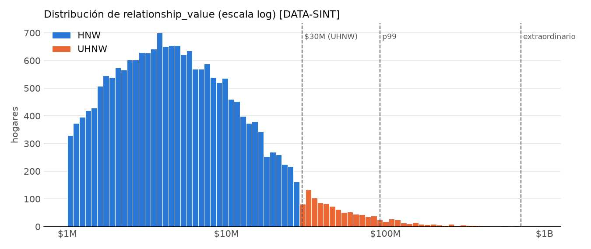

- Ningún outlier es error. El hogar de $904M tiene soft churn ($345M perdidos); el hard churner más grande
  ($661M) queda justo bajo la cerca. Todos se conservan sin capping (D3.1).

**QC** · 14 PASS · 6 WARN · 0 FAIL
- Gate > 90% missing no estructural: ninguna variable (máx. 73.9%, operativo). Gate de inconsistencia lógica:
  6 WARN documentados arriba; por instrucción del usuario (D0.5) se sigue con los datos tal cual.
- Todo el missing queda explicado por una causa: estructural, historia corta, operativa, patrón no detectado o saldo base.

**Decisiones y alternativas descartadas** · D3.1–D3.3
- Sin capping en ninguna variable (el pre-binning por cuantiles lo hace irrelevante; D0.5 para RV). Descartados
  winsorizar p1/p99 y eliminar outliers.
- "No aplica" y "sin dato" como categorías de missing distintas en el binning.

---

## 4. Muestra

**Objetivo**
- Separar una muestra de desarrollo y un holdout intocable, y fijar las particiones de CV que usarán todos los pasos.

**Por qué**
- Sin OOT posible (corte único), el holdout estratificado y la CV repetida son la única evidencia de generalización.
  Fijar los folds una vez hace trazables las predicciones OOF con las que se calibra (DM.1).

**Método**
- Población: 19,877 elegibles. Estratos: `hard_churn_6m` × `segment` (4 estratos). `train_test_split` 70/30, semilla 42.
- CV: `RepeatedStratifiedKFold` 5 folds × 5 repeticiones sobre desarrollo, mismos estratos, semilla 42.

**Código** · `src/04_split.py`

**Salida** · `outputs/tables/04_split.csv` (`household_id`, `muestra`, `cv_r1`–`cv_r5`), `04_balance.csv`, `04_cv_folds.csv`

| Muestra | Hogares | Eventos hard | Tasa hard % | % UHNW | Eventos UHNW | Tasa UHNW % | Tasa soft % | % RV | Churn valor hard % | RV máx $M |
|:--|--:|--:|--:|--:|--:|--:|--:|--:|--:|--:|
| desarrollo | 13,913 | 840 | 6.04 | 5.51 | 56 | 7.31 | 8.80 | 70.9 | 6.62 | 904.0 |
| holdout | 5,964 | 360 | 6.04 | 5.52 | 24 | 7.29 | 8.92 | 29.1 | 6.07 | 568.9 |

- CV: cada fold tiene 2,782–2,783 hogares, 168 eventos hard y 11–12 eventos UHNW, en las 5 repeticiones.
- El churn por valor difiere 0.55 pp entre muestras: no se estratificó por valor (D0.5, D4.1). Los hogares grandes
  caen donde caen; la validación por valor llevará IC bootstrap.

**QC** · 9 PASS · 0 WARN · 0 FAIL
- Tasa hard 6.038% vs 6.036%; % UHNW 5.506% vs 5.516%; tasa UHNW 7.31% vs 7.30% (todas ≤ 0.5 pp).
- Sin solapamiento; 123 excluidos fuera; todo hogar de desarrollo con fold en las 5 repeticiones; split idéntico en
  re-ejecución (mismo hash de `04_split.csv`).

**Decisiones y alternativas descartadas** · D4.1
- Sin OOT: limitación documentada; la CV repetida la sustituye solo parcialmente.
- Descartado estratificar por quintil de RV. Hallazgo: 24 eventos UHNW en holdout → IC anchos, se reportan.

---

## 5. Auditoría de features y derivadas

**Objetivo**
- Mapear las features ya construidas a su tipo, detectar huecos y crear solo las derivadas permitidas, sin fuga.

**Por qué**
- Las features vienen ingenierizadas y su cálculo original no es auditable desde la base; saber qué tipos de señal
  faltan acota lo que el scorecard puede ver. Las derivadas corrigen el tratamiento del missing, no inventan señal.

**Método**
- Tipo por señal: nivel / frecuencia / recencia / magnitud / tendencia / aceleración / persistencia / cambio vs
  baseline (clasificación del paso 2), cruzado con las 8 dimensiones.
- Derivadas:
  - `<var>__miss` ∈ {ok, no_aplica, sin_dato} para las 35 variables con missing (D5.1).
  - Recodificación D3.3: `pension_deposit_stopped_flag` → NaN "no aplica" en los 134 hogares sin `has_pension_stream`.
  - `aum_outflow_to_rv_90d` = `aum_outflow_90d` ÷ RV; 0 si `has_investments` = False (D5.2).
  - `log_relationship_value` = log₁₀ RV (D5.3).
  - Conteo propio de señales activas con los 33 umbrales del Excel, **solo para comparar** con `multi_signal_count`.
- Matriz de features: `outputs/data/05_features.pkl` (regenerable, no versionada): 56 predictores candidatos
  (54 elegibles + 2 derivadas) + 35 razones de missing + targets y compuestos para benchmark.

**Código** · `src/05_features.py`

**Salida** · `outputs/tables/05_feature_type_map.csv`, `05_feature_map.csv`, `05_missing_reasons.csv`,
`05_signal_count_comparison.csv`; `outputs/data/05_features.pkl`, `05_predictor_meta.csv`

Tipos de señal por dimensión [DATA-SINT]:

| Dimensión | Frec. | Recencia | Magnitud | Tendencia | Acel. | Persist. | vs baseline | Huecos |
|:--|--:|--:|--:|--:|--:|--:|--:|:--|
| salida de activos | 0 | 0 | 5 | 0 | 0 | 0 | 2 | frecuencia, recencia, tendencia, aceleración, persistencia |
| deterioro de saldos | 0 | 0 | 1 | 1 | 0 | 0 | 1 | frecuencia, recencia, aceleración, persistencia |
| externalización / competencia | 1 | 1 | 4 | 0 | 1 | 1 | 1 | tendencia |
| ingresos recurrentes | 0 | 4 | 0 | 0 | 0 | 0 | 1 | frecuencia, magnitud, tendencia, aceleración, persistencia |
| pérdida de productos | 2 | 1 | 0 | 1 | 0 | 0 | 0 | magnitud, aceleración, persistencia, vs baseline |
| fricción de servicio | 0 | 2 | 0 | 0 | 0 | 2 | 0 | frecuencia, magnitud, tendencia, aceleración, vs baseline |
| relación con banquero | 2 | 2 | 0 | 0 | 0 | 0 | 0 | magnitud, tendencia, aceleración, persistencia, vs baseline |
| rendimiento | 0 | 0 | 1 | 0 | 0 | 0 | 0 | todo salvo magnitud |

- Externalización es la única dimensión casi completa (9 variables, 6 de 7 tipos). La aceleración solo existe en
  transferencias. Rendimiento depende de una sola variable, disponible solo con advisory.

El missing es informativo [DATA-SINT] (tasa hard por razón; selección):

| Variable | no aplica | sin dato | Tasa hard ok % | no aplica % | sin dato % |
|:--|--:|--:|--:|--:|--:|
| `client_reply_rate` | 0 | 9,598 | 3.72 | — | 8.55 |
| `salary_deposit_stopped_flag` | 9,228 | 232 | 5.97 | 5.99 | 10.87 |
| `business_payroll_stopped_flag` | 14,713 | 64 | 6.15 | 5.98 | 10.94 |
| `deposit_balance_change_pct_90d` | 0 | 110 | 6.02 | — | 9.09 |
| `products_closed_180d`, `banker_change_6m_flag` | 0 | 106 | 6.02 | — | 9.43 |
| `aum` y señales de inversión | 2,870 | 0–131 | 6.13–6.15 | 5.41 | 2.1–7.6 |
| `meetings_cancelled_by_client` | 0 | 12,145 | 6.66 | — | 5.63 |

- "No aplica" y "sin dato" tienen tasas distintas: mezclarlos en un bin, o imputar, perdería esa diferencia (D5.1).

Conteo propio vs regla existente [DATA-SINT]:

| Medida | Media | ρ Spearman vs base | Coincidencia exacta | Tasa hard si ≥ 3 |
|:--|--:|--:|--:|--:|
| `multi_signal_count` (base) | 1.74 | 1.000 | 100% | 13.06% |
| grupos activos propios (0–7) | 1.76 | 0.978 | 93.8% | 12.84% |
| señales activas propias (0–33) | 2.61 | 0.949 | — | 11.27% |

- El conteo se replica al 93.8%; la diferencia viene de 6 insumos que no están en la base (D5.3). Queda como
  diagnóstico; el benchmark del paso 13 usa `multi_signal_count` y `multi_signal_flag` originales.

**QC** · 9 PASS · 1 WARN · 0 FAIL
- Ningún predictor es outcome, compuesto, `snapshot_date` ni `household_id`; recodificación de pensión = 134;
  toda variable con NaN tiene razón de missing; matriz de 20,000 filas.
- Gate fallido y corregido (D5.2): el control `aum_outflow_to_rv_90d` ∈ [0, 1] partía de una premisa falsa (el
  denominador es RV en T0, neto de la salida). Máx. 10.3; 258 hogares > 1 con tasa hard 33.3%. Control corregido
  a ≥ 0 y WARN informativo; datos sin tocar.

**Decisiones y alternativas descartadas** · D5.1–D5.4
- Razón de missing como bin propio; descartado imputar.
- Salida de AUM relativa a RV sin recorte; descartado recortar a 1.
- Sin features nuevas para cubrir huecos: la base no trae las series. Queda como pregunta para el equipo de datos.

---

## 6. Análisis univariado

**Objetivo**
- Medir, variable por variable, cuánto separa churners de no churners, en qué dirección y si la dirección coincide
  con la hipótesis de negocio del paso 2.

**Por qué**
- Un signo contrario a la hipótesis es la primera alarma de fuga, colinealidad o error de construcción; un efecto
  nulo anticipa qué variables no pasarán el filtro de IV.

**Método y fórmulas**
- Solo desarrollo (13,913 hogares, 840 eventos).
- Continuas: δ de Cliff = 2U/(n₁n₀) − 1 (U de Mann-Whitney); magnitud según Romano: < 0.147 despreciable, < 0.33
  pequeño, < 0.474 mediano, resto grande.
- Binarias e infladas en su mínimo: RR = tasa(x > mín) ÷ tasa(x = mín), IC 95% por log-RR, p de Fisher (D6.2).
- Tasa por decil (continuas) o categoría, con bins propios "no aplica" y "sin dato"; lift máximo en grupos ≥ 30 eventos.
- Por segmento: δ en HNW y en UHNW; signo estable si coincide cuando |δ UHNW| ≥ 0.147.
- Evaluación: "coincide" / "DISCREPANCIA" si hay evidencia (efecto no despreciable y p < 0.05); si no, "sin evidencia".

**Código** · `src/06_univariate.py`

**Salida** · `outputs/tables/06_univariate.csv` (56 variables), `06_rate_by_decile.csv`, `06_sign_discrepancies.csv` (vacía)

Variables con evidencia [DATA-SINT] (desarrollo; tabla completa en `06_univariate.csv`):

| Variable | Dimensión | Efecto | Valor [IC 95%] | Lift máx | δ UHNW | Esperada / observada |
|:--|:--|:--|:--|--:|--:|:--|
| `salary_deposit_stopped_flag` | ingresos | RR 1 vs 0 | 5.61 [4.53, 6.93] | 4.87 | +0.11 | + / + |
| `pension_deposit_stopped_flag` | ingresos | RR 1 vs 0 | 5.52 [3.93, 7.76] | — (27 eventos) | +0.20 | + / + |
| `recurring_deposit_stopped_flag` | ingresos | RR 1 vs 0 | 4.46 [3.77, 5.29] | 3.92 | +0.06 | + / + |
| `banker_change_6m_flag` | banquero | RR 1 vs 0 | 4.33 [3.81, 4.93] | 2.89 | +0.29 | + / + |
| `new_external_destinations_90d` | externalización | RR > 0 | 4.31 [3.69, 5.03] | 3.57 | +0.23 | + / + |
| `repeat_complaint_flag` | fricción | RR 1 vs 0 | 3.76 [3.13, 4.52] | 3.42 | +0.07 | + / + |
| `complaint_age_days` | fricción | RR > 0 | 3.64 [3.00, 4.42] | — | +0.13 | + / + |
| `trustee_change_flag` | productos | RR 1 vs 0 | 3.57 [2.61, 4.87] | 3.23 | +0.08 | + / + |
| `bureau_new_mortgage_elsewhere` | externalización | RR 1 vs 0 | 3.53 [2.92, 4.28] | 3.18 | +0.10 | + / + |
| `products_closed_180d` | productos | RR > 0 | 3.50 [3.04, 4.04] | 6.55 | +0.21 | + / + |
| `complaint_escalated_flag` | fricción | RR 1 vs 0 | 3.20 [2.69, 3.80] | 2.86 | +0.18 | + / + |
| `business_payroll_stopped_flag` | ingresos | RR 1 vs 0 | 3.00 [2.10, 4.29] | 2.59 | +0.03 | + / + |
| `relationship_dissatisfaction_flag` | fricción | RR 1 vs 0 | 2.78 [1.91, 4.05] | — | −0.04 | + / + |
| `positions_liquidated_pct` | salida de activos | RR > 0 | 2.18 [1.86, 2.57] | 2.12 | +0.17 | + / + |
| `meetings_cancelled_by_client` | banquero | RR > 0 | 1.96 [1.60, 2.39] | 1.71 | +0.21 | + / + |
| `accounts_closed_90d` | productos | RR > 0 | 1.83 [1.57, 2.13] | 4.37 | +0.17 | + / + |
| `share_of_wallet` | nivel | δ | −0.264 | 2.57 | −0.10 | − / − |
| `deposit_balance_vs_6m_avg_pct` | saldos | δ | −0.245 | 2.93 | −0.32 | − / − |
| `external_transfer_pct_of_balance_60d` | externalización | δ | +0.242 | 3.05 | +0.29 | + / + |
| `share_of_wallet_change` | productos | δ | −0.240 | 2.50 | −0.31 | − / − |
| `deposit_balance_change_pct_90d` | saldos | δ | −0.237 | 2.73 | −0.38 | − / − |
| `client_reply_rate` | banquero | δ | −0.232 | 1.09 | −0.25 | − / − |
| `transfer_to_competitor_pct_90d` | externalización | δ | +0.230 | 2.94 | +0.36 | + / + |
| `contact_gap_ratio` | banquero | δ | +0.228 | 1.78 | +0.27 | + / + |
| `net_deposit_flow_pct_90d` | saldos | δ | −0.223 | 2.64 | −0.26 | − / − |
| `aum_vs_baseline_pct` | salida de activos | δ | −0.214 | 3.12 | −0.22 | − / − |
| `net_external_flow_pct_90d` | externalización | δ | −0.205 | 2.85 | −0.25 | − / − |
| `return_vs_benchmark` | rendimiento | δ | −0.200 | 1.60 | −0.25 | − / − |
| `recurring_deposit_change_pct` | ingresos | δ | −0.195 | 2.44 | −0.11 | − / − |
| `aum_outflow_pct_90d` / `aum_outflow_90d` | salida de activos | δ | +0.190 / +0.186 | 2.67 / 2.63 | +0.20 | + / + |
| `fixed_income_maturity_not_reinvested` | salida de activos | δ | +0.188 | 1.26 | +0.24 | + / + |
| `investment_redemption_pct` | salida de activos | δ | +0.157 | 2.39 | +0.24 | + / + |
| `aum_outflow_to_rv_90d` | salida de activos | δ | +0.154 | 2.48 | +0.20 | + / + |

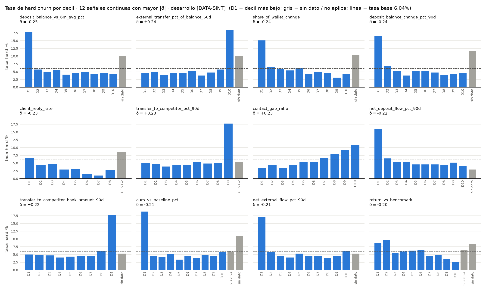

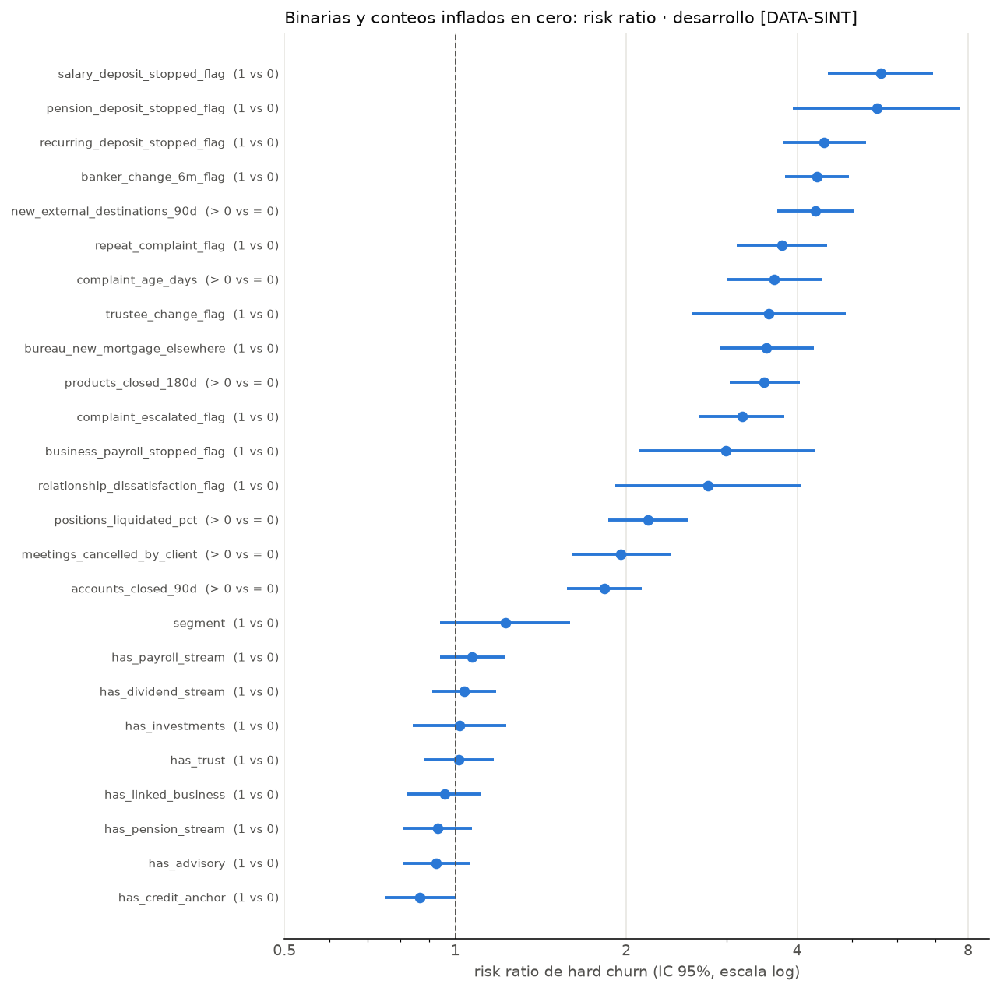

Lectura:
- **Signos**: 36 de 36 variables con evidencia coinciden con la hipótesis; **0 discrepancias**. Signo estable HNW vs
  UHNW en todas las que tienen efecto en UHNW (|δ| ≥ 0.147).
- **Forma**: el efecto de las continuas se concentra en el decil extremo (p. ej. `deposit_balance_vs_6m_avg_pct`:
  D1 17.7% vs 4–6% en D2–D10; `external_transfer_pct_of_balance_60d`: D10 18.4%). Es un umbral más que una
  pendiente: el binning debería aislar esa cola.
- **Missing informativo**: "sin dato" supera la tasa base en `client_reply_rate` (8.6%), `deposit_balance_*` (~10–12%)
  y `aum_vs_baseline_pct` (10.9%) → bin propio, no imputar (D5.1).
- **Sin señal**: estructura y nivel patrimonial (`has_*`, `age_primary`, `tenure_years`, `history_months`,
  `relationship_value`, `aum`, `deposit_balance`, `recurring_income_monthly`, `segment`) tienen |δ| < 0.075 y RR con IC
  que cruza 1 (salvo `has_credit_anchor`, RR 0.86 [0.75, 1.00], débil). UHNW: RR 1.23 [0.94, 1.59], no significativo.
- **Débiles**: `cash_pct_of_portfolio_chg` (δ 0.146, justo bajo el corte), `external_destination_concentration`,
  `external_transfer_acceleration`, `outflow_vs_baseline_pct`: el IV decidirá.

**QC** · 6 PASS · 0 WARN · 0 FAIL
- Solo desarrollo; 56 variables evaluadas; tablas por decil suman 13,913 hogares y 840 eventos por variable;
  0 discrepancias de signo; 0 inestabilidades de signo entre segmentos.

**Decisiones y alternativas descartadas** · D6.1–D6.3
- RR para binarias e infladas en su mínimo; descartados solo δ y d de Cohen.

---

## 7. Segmentación

**Objetivo**
- Ver si hay perfiles estructurales de hogar con riesgo distinto que el modelo deba considerar, además de `segment`.

**Por qué**
- Si un perfil concentra churn, puede requerir variable propia o calibración aparte. Si no, se descarta con evidencia
  y no se complica el modelo.

**Método**
- Variables: `age_primary`, `tenure_years`, log₁₀ RV y 8 `has_*`, estandarizadas (media y desviación de desarrollo).
  Sin señales ni target.
- K-means (n_init = 20) K = 2…8 en desarrollo. Criterios: silhouette (muestra de 5,000), WCSS, estabilidad (ARI entre
  la partición completa y 20 re-ajustes bootstrap), tamaño mínimo. GMM diagonal como comparación.
- Regla fijada antes (D7.1): tamaño mínimo ≥ 5% y ARI ≥ 0.80 → mayor silhouette.
- Churn por cluster en desarrollo con Wilson 90%; χ² cluster × hard. Descriptivo, sin inferir causalidad.

**Código** · `src/07_segmentation.py`

**Salida** · `outputs/tables/07_k_selection.csv`, `07_cluster_profile.csv`, `07_cluster_x_segment.csv`;
`outputs/models/07_kmeans.pkl`; `outputs/data/07_clusters.csv`

| K | Silhouette | ARI bootstrap (p5) | Cluster mín % | ARI K-means vs GMM |
|--:|--:|:--|--:|--:|
| 2 | 0.172 | 0.989 (0.984) | 36.2 | 0.01 |
| **3** | **0.191** | **0.992 (0.988)** | **14.4** | **0.83** |
| 4 | 0.161 | 0.851 (0.576) | 14.4 | 0.53 |
| 5 | 0.155 | 0.755 (0.416) | 13.7 | 0.63 |
| 6 | 0.140 | 0.716 (0.541) | 10.7 | 0.53 |
| 7 | 0.143 | 0.615 (0.391) | 8.0 | 0.51 |
| 8 | 0.151 | 0.667 (0.476) | 5.4 | 0.45 |

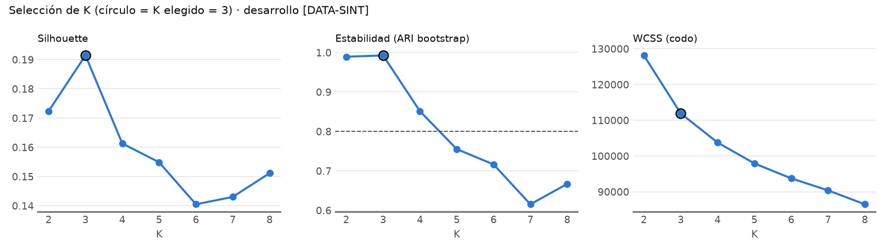

Perfiles (K = 3, desarrollo) [DATA-SINT]:

| Cluster | Lectura | % hogares | Edad media | Antig. mediana | RV mediano $M | % UHNW | % inversión / advisory | % nómina / pensión | Tasa hard % [Wilson 90%] | % RV | Churn valor % |
|:--|:--|--:|--:|--:|--:|--:|:--|:--|:--|--:|--:|
| 0 | activos con nómina e inversión | 55.0 | 53.8 | 7.5 | 5.39 | 6.5 | 100 / 70 | 79 / 3 | 6.04 [5.60, 6.50] | 61.3 | 6.43 |
| 1 | jubilados con pensión e inversión | 30.6 | 72.4 | 7.8 | 5.17 | 5.7 | 100 / 70 | 9 / 88 | 6.08 [5.50, 6.71] | 31.5 | 7.05 |
| 2 | solo depósitos (sin inversión) | 14.4 | 60.9 | 7.7 | 2.91 | 1.5 | 0 / 0 | 53 / 36 | 5.95 [5.14, 6.88] | 7.2 | 6.35 |

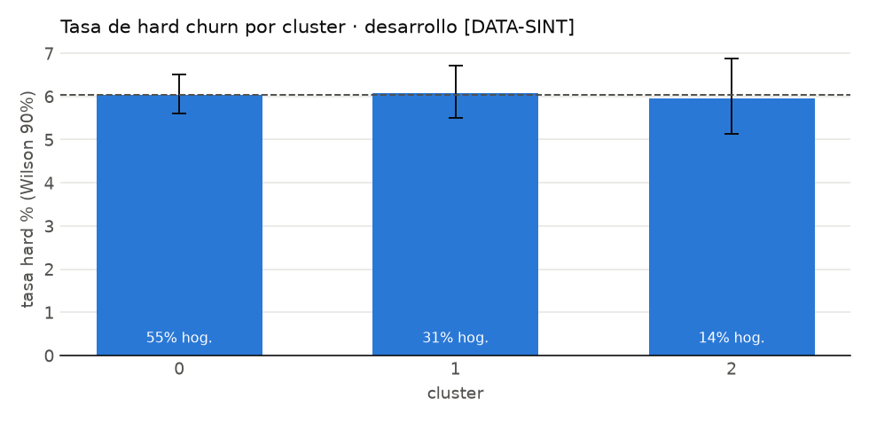

- Los clusters se definen por ciclo de vida (nómina vs pensión) y tenencia de inversión; negocio, trust y crédito se
  reparten igual (~26%, ~30%, ~34%) en los tres.
- **La tasa de churn es la misma en los tres** (χ² = 0.04, p = 0.98; intervalos solapados con la tasa base). La
  estructura del hogar no separa riesgo en esta base (D7.3), igual que en el univariado.
- Cluster 2 casi sin UHNW (29 hogares): la cola de valor vive en los clusters con inversión.
- Regla: sin modelos separados (UHNW 80 eventos < 100); `segment` forzado; cluster pasa al paso 9 como candidata
  y se espera que no supere IV 0.02.

**QC** · 7 PASS · 0 WARN · 0 FAIL
- Sin señales ni target en el clustering; ajuste solo en desarrollo; K elegido cumple tamaño (14.4%) y estabilidad
  (0.992); Σ share × tasa por cluster = tasa de desarrollo (6.0375%); asignación a los 20,000 hogares.

**Decisiones y alternativas descartadas** · D7.1–D7.3
- K = 3 por regla previa. Descartados GMM (BIC no acotado con binarias) y k-prototypes (alternativa válida,
  no necesaria con esta estabilidad).

---

## 8. Correlación y diagnóstico de estructura

**Objetivo**
- Localizar redundancia entre señales antes de seleccionar: qué pares cuentan lo mismo y cuáles aportan
  información incremental.

**Por qué**
- Dos variables casi idénticas en una logística reparten el peso de forma inestable y pueden invertir signos. Se
  identifican aquí; la elección del representante es del paso 10, con IV y VIF sobre WoE.

**Método**
- Spearman por pares (mín. 200 con dato en ambas) sobre 38 variables: 37 señales + `share_of_wallet` (+ derivada).
- Información incremental por par: AUC en CV (5 folds de `cv_r1`) de una logística sobre rangos normalizados con
  indicador de missing, con cada variable sola vs las dos. ΔAUC < 0.005 → redundantes (D8.2).
- VIF diagnóstico sobre rangos normalizados (D8.1). PCA sobre rangos estandarizados, solo diagnóstico (D8.3).

**Código** · `src/08_structure.py`

**Salida** · `outputs/tables/08_spearman.csv`, `08_high_corr_pairs.csv`, `08_vif.csv`, `08_pca_variance.csv`,
`08_pca_loadings.csv`, `08_pca_dominant.csv`

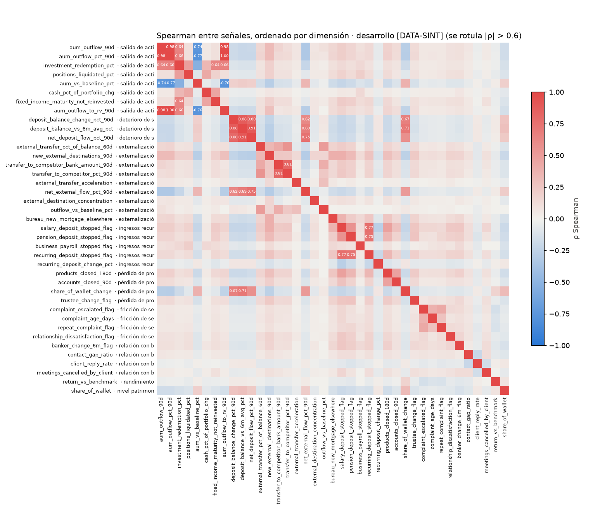

Pares |ρ| > 0.6 y pares esperados del brief [DATA-SINT] (desarrollo):

| Var A | Var B | ρ | AUC A | AUC B | AUC A+B | ΔAUC | Más informativa | Lectura |
|:--|:--|--:|--:|--:|--:|--:|:--|:--|
| `aum_outflow_pct_90d` | `aum_outflow_to_rv_90d` | 0.998 | 0.580 | 0.571 | 0.580 | 0.000 | pct | redundantes |
| `aum_outflow_90d` | `aum_outflow_to_rv_90d` | 0.980 | 0.578 | 0.571 | 0.580 | 0.002 | monto | redundantes |
| `aum_outflow_90d` ★ | `aum_outflow_pct_90d` | 0.978 | 0.578 | 0.580 | 0.581 | 0.001 | pct | redundantes |
| `deposit_balance_vs_6m_avg_pct` | `net_deposit_flow_pct_90d` | 0.906 | 0.623 | 0.610 | 0.622 | −0.001 | vs 6m | redundantes |
| `deposit_balance_change_pct_90d` ★ | `deposit_balance_vs_6m_avg_pct` | 0.881 | 0.619 | 0.623 | 0.623 | 0.000 | vs 6m | redundantes |
| `transfer_to_competitor_bank_amount_90d` ★ | `transfer_to_competitor_pct_90d` | 0.814 | 0.608 | 0.614 | 0.613 | 0.000 | pct | redundantes |
| `deposit_balance_change_pct_90d` | `net_deposit_flow_pct_90d` | 0.800 | 0.619 | 0.610 | 0.620 | 0.001 | change | redundantes |
| `recurring_deposit_stopped_flag` | `salary_deposit_stopped_flag` | 0.767 | 0.545 | 0.547 | 0.553 | 0.006 | salary | incremental |
| `aum_outflow_pct_90d` | `aum_vs_baseline_pct` | −0.766 | 0.580 | 0.591 | 0.590 | −0.002 | vs baseline | redundantes |
| `net_deposit_flow_pct_90d` | `net_external_flow_pct_90d` | 0.754 | 0.610 | 0.602 | 0.609 | −0.002 | depósitos | redundantes |
| `pension_deposit_stopped_flag` | `recurring_deposit_stopped_flag` | 0.749 | 0.525 | 0.545 | 0.559 | 0.014 | recurring | incremental |
| `deposit_balance_vs_6m_avg_pct` | `share_of_wallet_change` | 0.713 | 0.623 | 0.620 | 0.629 | 0.006 | vs 6m | incremental |
| `deposit_balance_change_pct_90d` | `share_of_wallet_change` | 0.671 | 0.619 | 0.620 | 0.628 | 0.008 | SOW change | incremental |
| `aum_outflow_to_rv_90d` | `investment_redemption_pct` | 0.656 | 0.571 | 0.563 | 0.585 | 0.014 | outflow/RV | incremental |
| `fixed_income_maturity_not_reinvested` | `investment_redemption_pct` | 0.644 | 0.529 | 0.563 | 0.575 | 0.012 | redemption | incremental |
| `share_of_wallet` ★ | `share_of_wallet_change` | 0.318 | 0.630 | 0.620 | 0.650 | 0.020 | SOW | incremental |
| `external_transfer_pct_of_balance_60d` ★ | `net_external_flow_pct_90d` | −0.170 | 0.620 | 0.602 | 0.622 | 0.002 | ext. transfer | redundantes |

★ = par esperado del brief. Tabla completa (23 pares) en `08_high_corr_pairs.csv`.

- **21 pares con |ρ| > 0.6**, en tres bloques: salida de AUM (monto, %, relativo a RV, vs baseline), deterioro de
  depósitos (cambio 90d, vs 6m, flujo neto, flujo externo neto) y flujos recurrentes (salario, pensión, recurring).
- De los 5 pares esperados, 3 son redundantes (ΔAUC ≤ 0.001: el % domina al monto; "vs 6m" domina al cambio 90d).
  `share_of_wallet` vs su cambio tiene ρ = 0.32 y es el par con más información incremental (ΔAUC +0.020): nivel y
  tendencia miden cosas distintas. `external_transfer_pct_of_balance_60d` vs `net_external_flow_pct_90d` tiene
  ρ = −0.17: no están asociados como suponía el brief (el flujo neto incluye entradas).
- VIF > 5 (diagnóstico) solo dentro de los bloques: `aum_outflow_pct_90d` 28.7, `aum_outflow_90d` 18.4,
  `aum_outflow_to_rv_90d` 15.0, `deposit_balance_vs_6m_avg_pct` 11.9, `net_deposit_flow_pct_90d` 8.5,
  `transfer_to_competitor_*` 5.6–5.9, `deposit_balance_change_pct_90d` 5.0. El resto < 3.6.

PCA diagnóstico [DATA-SINT]:

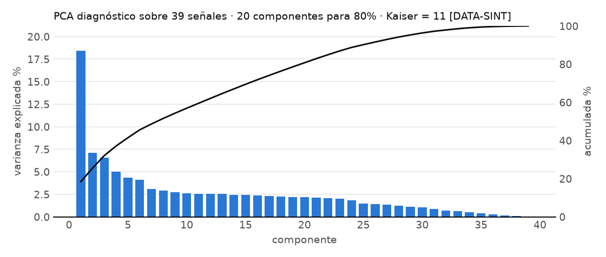

| PC | Varianza % | Variables dominantes | AUC del PC |
|:--|--:|:--|--:|
| PC1 | 18.4 | salida de AUM (+), depósitos vs 6m (−), flujo externo neto (−) | 0.664 |
| PC2 | 7.1 | redención, salida de AUM, depósitos vs 6m | 0.528 |
| PC3 | 6.6 | transferencias a competidores, transferencias externas, recurring detenido | 0.607 |
| PC4 | 5.0 | salidas vs baseline, transferencias a competidores | 0.585 |
| PC5 | 4.3 | cash %, posiciones liquidadas, renta fija no reinvertida | 0.528 |
| PC6 | 4.1 | quejas escaladas, repetidas, antigüedad de queja | 0.521 |

- Estructura difusa: PC1 explica 18.4%, hacen falta 20 componentes para el 80% y 11 tienen autovalor > 1. Hay un
  factor común de "salida de dinero" (PC1) y el resto son dimensiones casi independientes (quejas, banquero,
  ingresos). Esto favorece un scorecard con diversidad de dimensiones sobre uno dominado por un bloque.

**QC** · 5 PASS · 1 WARN · 0 FAIL
- Solo desarrollo; matriz simétrica con diagonal 1; los 5 pares esperados evaluados; ninguna variable eliminada;
  varianza PCA suma 100%. WARN: 8 variables con VIF > 5 en rangos (se resuelve en el paso 10 sobre WoE).

**Decisiones y alternativas descartadas** · D8.1–D8.3
- Spearman / VIF sobre rangos; descartado Pearson sobre crudos. PCA fuera del modelo.

---

## 9. Binning, WoE e IV

**Objetivo**
- Transformar cada candidata en bins monótonos, estables y con volumen suficiente, y medir su poder con IV.

**Por qué**
- El WoE hace la relación lineal en el logit, trata el missing como información y hace los puntos del scorecard
  legibles por bin. Es el paso que más decide la calidad del modelo.

**Método y fórmulas**
- `optbinning` (solver CP), `monotonic_trend="auto_asc_desc"`, ≥ 30 eventos por bin, diferencia mínima de tasa
  0.5 pp; pre-binning con la mejor de 3 opciones (D9.5).
- Tamaño mínimo: 5% de población en continuas, 1% en binarias / conteos / infladas en cero (D9.1, desvío del brief).
- Missing: bins "no aplica" y "sin dato" (D5.1); < 30 eventos → fusión o WoE neutral (D9.3).
- WoE_b = ln(%buenos_b / %malos_b); IV = Σ_b (%buenos_b − %malos_b)·WoE_b (WoE > 0 = menos churn).
- Clases IV: < 0.02 fuera · 0.02–0.10 débil · 0.10–0.30 medio · 0.30–0.50 fuerte · > 0.50 sospechoso.
- Estabilidad: WoE por bin en los 25 conjuntos de entrenamiento de la CV 5×5; inestable (sd > 0.25 y signo
  cambiante en > 20%) → fusión con el vecino (D9.2).
- 56 candidatas: 55 del paso 5 (sin `log_relationship_value`, D9.4) + `cluster`.

**Código** · `src/09_binning.py`, `src/woe.py`

**Salida** · `outputs/tables/09_woe_iv.csv` (tabla completa por bin), `09_iv_summary.csv`, `09_unstable_merges.csv`
(vacía); `outputs/models/09_binning.pkl`

IV por variable [DATA-SINT] (desarrollo; 38 de 56 pasan IV ≥ 0.02):

| Variable | Dimensión | IV | Clase | Bins (+ especiales) | Tendencia | Tasa mín–máx % |
|:--|:--|--:|:--|:--|:--|:--|
| `banker_change_6m_flag` | banquero | 0.479 | fuerte | 2 + 1 | ↑ | 4.0–17.4 |
| `transfer_to_competitor_pct_90d` | externalización | 0.466 | fuerte | 4 + 1 | ↑ | 4.5–30.0 |
| `external_transfer_pct_of_balance_60d` | externalización | 0.424 | fuerte | 3 + 1 | ↑ | 4.5–24.5 |
| `products_closed_180d` | productos | 0.394 | fuerte | 4 + 1 | ↑ | 4.8–39.4 |
| `transfer_to_competitor_bank_amount_90d` | externalización | 0.389 | fuerte | 4 + 1 | ↑ | 4.6–25.6 |
| `net_external_flow_pct_90d` | externalización | 0.367 | fuerte | 3 + 1 | ↓ | 4.7–24.9 |
| `deposit_balance_vs_6m_avg_pct` | saldos | 0.349 | fuerte | 5 + 1 | ↓ | 3.5–21.6 |
| `aum_vs_baseline_pct` | salida de activos | 0.341 | fuerte | 3 + 1 | ↓ | 4.5–22.1 |
| `deposit_balance_change_pct_90d` | saldos | 0.314 | fuerte | 5 + 1 | ↓ | 4.2–20.2 |
| `client_reply_rate` | banquero | 0.305 | fuerte | 4 + 1 | ↓ | 2.0–6.6 (sin dato 8.7) |
| `share_of_wallet` | nivel | 0.286 | medio | 7 | ↓ | 3.3–18.3 |
| `net_deposit_flow_pct_90d` | saldos | 0.285 | medio | 6 + 1 | ↓ | 4.0–20.7 |
| `aum_outflow_to_rv_90d` | salida de activos | 0.267 | medio | 3 + 1 | ↑ | 5.0–21.8 |
| `aum_outflow_pct_90d` | salida de activos | 0.266 | medio | 3 + 1 | ↑ | 4.8–20.9 |
| `new_external_destinations_90d` | externalización | 0.257 | medio | 2 + 1 | ↑ | 5.0–21.6 |
| `share_of_wallet_change` | productos | 0.247 | medio | 5 + 1 | ↓ | 3.6–15.7 |
| `external_transfer_acceleration` | externalización | 0.241 | medio | 2 + 1 | ↑ | 5.2–22.2 |
| `aum_outflow_90d` | salida de activos | 0.225 | medio | 4 + 1 | ↑ | 4.8–19.1 |
| `accounts_closed_90d` | productos | 0.224 | medio | 3 + 1 | ↑ | 5.4–33.7 |
| `recurring_deposit_change_pct` | ingresos | 0.222 | medio | 4 + 1 | ↓ | 4.7–18.8 |
| `recurring_deposit_stopped_flag` | ingresos | 0.203 | medio | 2 + 1 | ↑ | 5.3–23.7 |
| `contact_gap_ratio` | banquero | 0.169 | medio | 7 | ↑ | 3.3–10.6 |
| `salary_deposit_stopped_flag` | ingresos | 0.156 | medio | 2 + 1 | ↑ | 5.2–29.4 |
| `investment_redemption_pct` | salida de activos | 0.148 | medio | 3 + 1 | ↑ | 5.0–14.6 |
| `positions_liquidated_pct` | salida de activos | 0.146 | medio | 3 + 1 | ↑ | 5.3–21.9 |
| `repeat_complaint_flag` | fricción | 0.141 | medio | 2 | ↑ | 5.5–20.6 |
| `complaint_escalated_flag` | fricción | 0.137 | medio | 2 | ↑ | 5.4–17.3 |
| `bureau_new_mortgage_elsewhere` | externalización | 0.125 | medio | 2 + 1 | ↑ | 5.4–19.2 |
| `complaint_age_days` | fricción | 0.122 | medio | 3 | ↑ | 5.6–23.2 |
| `cash_pct_of_portfolio_chg` | salida de activos | 0.117 | medio | 3 + 1 | ↑ | 5.0–13.5 |
| `outflow_vs_baseline_pct` | externalización | 0.107 | medio | 2 + 1 | ↑ | 5.5–16.1 |
| `return_vs_benchmark` | rendimiento | 0.087 | débil | 5 + 1 | ↓ | 3.1–9.9 |
| `external_destination_concentration` | externalización | 0.070 | débil | 4 + 1 | ↑ | 4.4–8.2 |
| `meetings_cancelled_by_client` | banquero | 0.055 | débil | 3 + 1 | ↑ | 5.5–11.9 |
| `trustee_change_flag` | productos | 0.047 | débil | 2 + 1 | ↑ | 5.5–19.5 |
| `fixed_income_maturity_not_reinvested` | salida de activos | 0.041 | débil | 3 + 1 | ↑ | 3.8–8.8 |
| `tenure_years` | estructura | 0.034 | débil | 5 | ↓ | 3.3–7.5 |
| `business_payroll_stopped_flag` | ingresos | 0.031 | débil | 2 + 1 | ↑ | 5.2–15.6 |

Fuera (IV < 0.02; 18): `aum` 0.010, `recurring_income_monthly` 0.008, `has_credit_anchor` 0.005, `relationship_value`
0.005, `age_primary` 0.003, `segment` 0.003, `deposit_balance` 0.003, `history_months` 0.002,
`pension_deposit_stopped_flag` 0.002, `relationship_dissatisfaction_flag` 0.000, `cluster` y los otros 7 `has_*` 0.000.

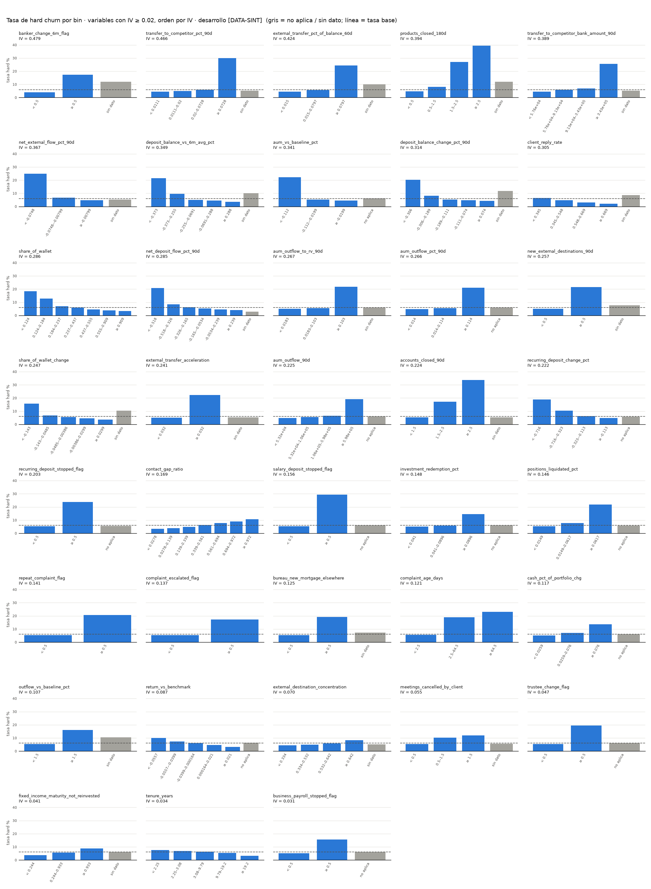

Lectura:
- **Ninguna variable > 0.50**: no hay sospecha de fuga por IV. La más alta (`banker_change_6m_flag`, 0.479) es un
  evento de los 6 meses previos a T0 (ventana sin solape con el outcome).
- **Diversidad**: hay variables fuertes o medias en las 8 dimensiones de señal salvo rendimiento (0.087, débil).
- **Monotonicidad**: 100% de las variables con ≥ 2 bins son monótonas en la dirección esperada del paso 2; no hubo
  que re-binnear por negocio.
- **Estabilidad**: 0 bins inestables; sd máx. del WoE entre folds 0.098 (`complaint_age_days`).
- **Umbrales visibles**: la mayoría de las continuas terminan con 2–3 bins, con el riesgo concentrado en la cola
  (p. ej. `transfer_to_competitor_pct_90d` ≥ 7.3% del saldo: 30.0% de churn vs 4.5–6.1% en el resto).
- **`segment` (IV 0.003) entra forzado** por diseño (brief, calibración por segmento en el paso 14), no por poder.
- **Pensión e insatisfacción quedan en IV ≈ 0** porque sus flags tienen 27 y 26 eventos (< 30); se evalúan como
  override en el paso 12 (D9.1).
- **`cluster` y estructura fuera** por evidencia, como anticipaban los pasos 6–7.

**QC** · 8 PASS · 0 WARN · 0 FAIL
- Solo desarrollo; bins suman 100% de hogares y 840 eventos por variable; ≥ 30 eventos en todo bin con dato;
  bins especiales < 30 eventos con WoE neutral; 0 variables no monótonas; 0 bins inestables; 0 IV > 0.50.

**Decisiones y alternativas descartadas** · D9.1–D9.5
- Tamaño mínimo 5% / 1% según tipo de variable (desvío del brief, con evidencia). Descartados 5% para todo y sin
  mínimo.
- WoE neutral para missing con < 30 eventos; búsqueda de pre-binning entre 3 tamaños.

---

## 10. Selección de variables

**Objetivo**
- Pasar de 38 variables con señal a un conjunto corto, no redundante, diverso y defendible ante regulación.

**Por qué**
- Un scorecard con 8–12 variables de dimensiones distintas es estable, explicable y resiste que una fuente de datos
  falle; 38 variables correlacionadas no lo son.

**Método**
- IV ≥ 0.02 → exclusión regulatoria → clustering jerárquico (promedio) sobre 1 − |Spearman| de los WoE, corte
  |ρ| > 0.6, representante = mayor IV (desempate: menor missing) → VIF < 5 sobre WoE → LASSO (L1) sobre WoE en la CV
  5×5, C por regla 1-SE → regla de cierre: diversidad primero, ≤ 3 por dimensión, 8–12 señales, `segment` forzada.
- Revisión regulatoria (DM.2): FCRA para el buró; fair lending para edad y proxies de edad.

**Código** · `src/10_selection.py`

**Salida** · `outputs/tables/10_selection_funnel.csv`, `10_var_clusters.csv`, `10_vif_woe.csv`, `10_lasso_path.csv`,
`10_lasso_selection.csv`, `10_performance_by_stage.csv`, `10_regulatory_review.csv`, `10_age_proxy.csv`, `10_final_vars.csv`

| Etapa | Variables | Salen |
|:--|--:|--:|
| 1. IV ≥ 0.02 | 38 | 18 |
| 2. Exclusión regulatoria (buró) | 37 | 1 |
| 3. Clustering de variables (|ρ| > 0.6) | 30 | 7 |
| 4. VIF < 5 sobre WoE | 30 | 0 |
| 5–6. LASSO C_1SE (≥ 80% de folds) + regla de cierre | 12 | 18 |
| Final (+ `segment` forzada) | 13 | — |

- Clustering: los bloques del paso 8 colapsan en un representante: salida de AUM → `aum_vs_baseline_pct`; depósitos
  (cambio 90d, vs 6m, flujo neto, cambio de SOW) → `deposit_balance_vs_6m_avg_pct`; posiciones / cash / redención →
  `investment_redemption_pct`.
- LASSO (C_1SE = 0.1): 13 variables con β ≠ 0 en el 100% de los folds; las de flujos externos redundantes
  (`transfer_to_competitor_pct_90d`, `net_external_flow_pct_90d`, destinos nuevos) caen a ≤ 8%.

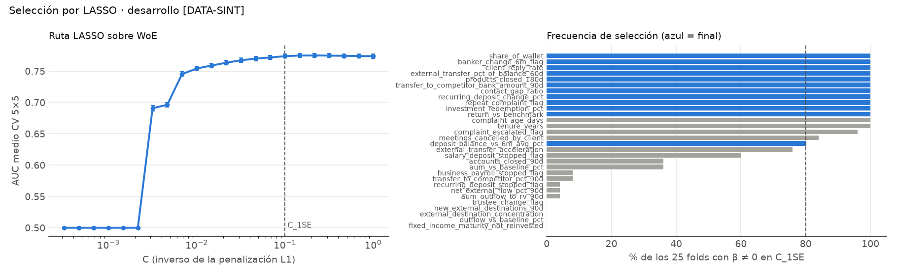

Revisión regulatoria [DATA-SINT]:

| Variable | Marco | IV | Evidencia | Decisión |
|:--|:--|--:|:--|:--|
| `bureau_new_mortgage_elsewhere` | FCRA §604 | 0.125 | sin base legal documentada; "sin dato" (712 hogares sin permiso) tendría WoE −0.20 → la falta de permiso sumaría riesgo; ΔAUC CV −0.0005 | fuera del campeón; sensibilidad en paso 11 |
| `age_primary` | fair lending / UDAAP | 0.003 | sin poder predictivo | fuera |
| proxies de edad | fair lending | — | |ρ| máx WoE finales vs edad = 0.043 | sin proxy |

- Regla de cierre revisada (D10.3): la versión inicial dejaba fuera toda la dimensión "deterioro de saldos" por un
  empate de frecuencias; se reemplazó por "diversidad primero". AUC CV 0.7717 (v1) vs 0.7710 (v2), diferencia
  menor que 1 sd.
- AUC CV (optimista, WoE de todo desarrollo): 38 variables 0.770 · 30 tras clustering 0.773 · 13 finales 0.771.
  Reducir de 38 a 13 no cuesta poder.

**QC** · 8 PASS · 0 WARN · 0 FAIL
- 12 señales + `segment`; sin prohibidas ni excluidas; VIF máx. 2.16; ≤ 3 por dimensión; 9 dimensiones; toda
  dimensión con candidata estable representada; pérdida de AUC vs 38 variables −0.0006; sin proxy de edad.

**Decisiones y alternativas descartadas** · D10.1–D10.3
- Buró fuera por FCRA (queda como sensibilidad). Regla de cierre v1 descartada por dejar una dimensión sin cubrir.

---

## 11. Estimación: campeón, versión ejecutiva y challenger

**Objetivo**
- Estimar el scorecard, probar su robustez, construir una versión ligera para la alta dirección y compararlos contra
  un challenger de machine learning.

**Por qué**
- El campeón debe ser interpretable (β positivos sobre WoE, puntos por bin) y no perder frente a un modelo más
  complejo. La versión ejecutiva responde al pedido de poder explicar el score en una lámina.

**Método y fórmulas**
- **A (campeón)**: logit P(bueno) = β₀ + Σ βⱼ·WoEⱼ con `statsmodels` sobre desarrollo; β > 0 esperado. Eliminación
  hacia atrás p > 0.05 sin tocar `segment` (D11.3). Interacción UHNW × top-3 solo si ΔAUC ≥ 0.005 (D11.2).
- **A-lite (versión ejecutiva)**: forward selection con CV anidada; el modelo más chico con AUC ≥ AUC(A) − 0.01 (D11.4).
- **A′**: logística L2 (C por CV) para robustez de coeficientes. **A + buró**: sensibilidad regulatoria.
- **B (challenger)**: LightGBM con restricciones monótonas según la dirección esperada (47 de 53 restringidas),
  early stopping interno por fold, 107 árboles; importancia por permutación y SHAP en holdout.
- **CV anidada** (D11.1): bins y WoE re-ajustados dentro de cada uno de los 25 folds; de ahí salen las OOF para
  calibrar (DM.1).
- Holdout (solo evaluación): AUC, PR-AUC, KS, Gini, Brier, pendiente de calibración; bootstrap pareado 500.
  Regla: B gana solo con +0.03 AUC y +0.05 PR-AUC sin traslape de IC.

**Código** · `src/11_estimation.py`, `src/metrics.py`

**Salida** · `outputs/tables/11_modelA_coefficients.csv`, `11_modelAlite_coefficients.csv`, `11_backward_elimination.csv`,
`11_cv_optimism.csv`, `11_interaction_test.csv`, `11_modelA2_robustness.csv`, `11_lite_forward.csv`, `11_lite_rule.csv`,
`11_model_comparison.csv`, `11_champion_rule.csv`, `11_modelB_importance.csv`; modelos en `outputs/models/11_*`;
OOF y predicciones de holdout en `outputs/data/11_*.csv`

Modelo A · campeón operativo [DATA-SINT] (logit de "bueno" sobre WoE, desarrollo):

| Variable | Dimensión | β | IC 95% | p | β·sd(WoE) |
|:--|:--|--:|:--|--:|--:|
| constante | — | 2.708 | [2.630, 2.786] | < 0.001 | — |
| `client_reply_rate` | banquero | 0.639 | [0.469, 0.809] | < 0.001 | 0.396 |
| `banker_change_6m_flag` | banquero | 0.649 | [0.547, 0.752] | < 0.001 | 0.371 |
| `return_vs_benchmark` | rendimiento | 0.638 | [0.380, 0.896] | < 0.001 | 0.197 |
| `external_transfer_pct_of_balance_60d` | externalización | 0.330 | [0.203, 0.457] | < 0.001 | 0.160 |
| `share_of_wallet` | nivel | 0.312 | [0.166, 0.458] | < 0.001 | 0.146 |
| `recurring_deposit_change_pct` | ingresos | 0.322 | [0.163, 0.480] | < 0.001 | 0.124 |
| `repeat_complaint_flag` | fricción | 0.428 | [0.254, 0.603] | < 0.001 | 0.121 |
| `contact_gap_ratio` | banquero | 0.266 | [0.070, 0.463] | 0.008 | 0.107 |
| `segment` (forzada) | estructura | 2.056 | [0.639, 3.474] | 0.004 | 0.102 |
| `products_closed_180d` | productos | 0.217 | [0.093, 0.340] | < 0.001 | 0.093 |
| `investment_redemption_pct` | salida de activos | 0.243 | [0.051, 0.434] | 0.013 | 0.078 |

- Todos los β > 0. La relación con el banquero (respuesta, cambio, brecha de contacto) aporta el mayor peso.
- Eliminación hacia atrás: `deposit_balance_vs_6m_avg_pct` (p = 0.56) y `transfer_to_competitor_bank_amount_90d`
  (p = 0.09); AUC anidado 0.7629 → 0.7637 (D11.3).
- Robustez: A′ (L2, C = 1.0) con los mismos signos y razón A′/A entre 0.97 y 1.04 en las 10 señales. `segment`
  0.65 (β inestable, contribución chica; D11.6).
- Interacción UHNW × top-3: ΔAUC −0.0007, β no significativos → no se incluye (D11.2).

Modelo A-lite · versión ejecutiva [DATA-SINT]:

| Paso | Agrega | AUC CV anidado | Ganancia |
|--:|:--|--:|--:|
| 1 | `banker_change_6m_flag` | 0.655 | +0.155 |
| 2 | `client_reply_rate` | 0.722 | +0.067 |
| 3 | `external_transfer_pct_of_balance_60d` | 0.744 | +0.022 |
| **4** | **`share_of_wallet`** ← A-lite | **0.754** | +0.010 |
| 5 | `return_vs_benchmark` | 0.759 | +0.005 |
| 6 | `repeat_complaint_flag` | 0.763 | +0.004 |
| 7–10 | ingresos, productos, redención, brecha de contacto | 0.764–0.765 | ≤ +0.001 |

- La historia en una frase: *el riesgo sube cuando el hogar cambió de banquero, dejó de responderle, está mandando
  dinero fuera y tiene poca parte de su patrimonio con nosotros.* β (todos > 0): cambio de banquero 0.74, respuesta
  0.80, transferencias externas 0.57, SOW 0.43, `segment` 2.21.
- Cuatro señales dan el 96% de la ganancia de AUC sobre 0.5 del modelo completo (0.254 de 0.264 en CV anidada).

Comparación en holdout [DATA-SINT] (5,964 hogares, 360 eventos; solo evaluación):

| Modelo | Variables | AUC [IC 95%] | PR-AUC [IC 95%] | KS | Gini | Brier | Pendiente calib. | AUC CV honesta (sd) |
|:--|--:|:--|:--|--:|--:|--:|--:|:--|
| **A (campeón)** | 11 | **0.725** [0.697, 0.754] | **0.219** [0.183, 0.263] | 0.331 | 0.449 | 0.0525 | 0.84 | 0.764 (0.017) |
| **A-lite (ejecutiva)** | 5 | 0.712 [0.683, 0.739] | 0.180 [0.152, 0.217] | 0.307 | 0.424 | 0.0534 | 0.84 | 0.754 (0.017) |
| A′ (L2) | 11 | 0.725 [0.697, 0.754] | 0.221 [0.184, 0.267] | 0.331 | 0.450 | 0.0524 | 0.85 | 0.763 (0.017) |
| B (LightGBM) | 53 | 0.722 [0.694, 0.752] | 0.225 [0.185, 0.269] | 0.336 | 0.444 | 0.0521 | 0.89 | 0.758 (0.019) |
| A + buró | 12 | 0.724 [0.696, 0.753] | 0.217 [0.181, 0.260] | 0.329 | 0.448 | 0.0526 | 0.84 | 0.763 (0.017) |

- **A vs B**: ΔAUC −0.002 [−0.012, +0.008], ΔPR-AUC +0.006 [−0.009, +0.019] → A se mantiene campeón. B no compra
  nada a cambio de perder la tabla de puntos.
- **A vs A-lite**: A-lite pierde 0.012 de AUC (IC pareado [−0.024, −0.001]) y 0.04 de PR-AUC. No es campeón, pero
  por pedido del usuario se lleva como versión ejecutiva validada en paralelo (D11.4).
- **Buró**: agregarlo no mejora (0.724 vs 0.725), lo que refuerza la exclusión por FCRA.
- **Holdout más difícil que la CV** (0.725 vs 0.764): B muestra la misma brecha, así que es variación de muestra y no
  sobreajuste de A (D11.7). La pendiente de calibración 0.84 (< 1: probabilidades algo extremas) se corrige en el paso 14.
- **Drivers de B**: SHAP y permutación coinciden con A en los dos primeros (respuesta al banquero, cambio de banquero).
  B usa además `tenure_years` y `cash_pct_of_portfolio_chg`, que A no tiene, sin ganar AUC.

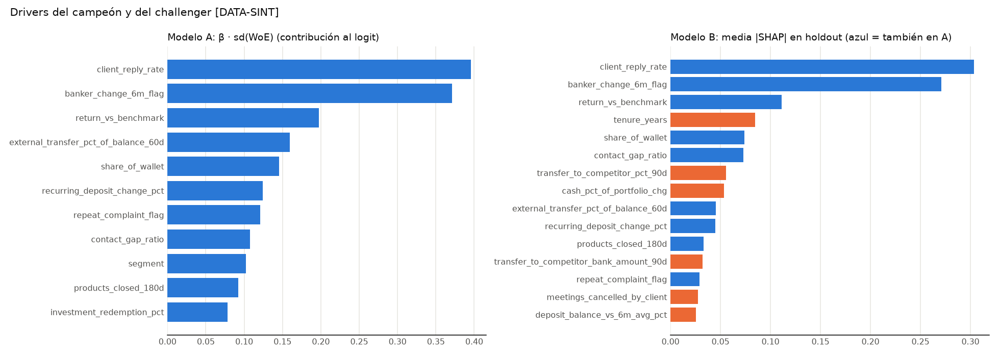

**QC** · 8 PASS · 0 WARN · 0 FAIL
- β > 0 en A y en A-lite; A′ con los mismos signos; p media de desarrollo = tasa (0.0604); OOF de CV anidada
  (25 binnings por fold) que cubre todo desarrollo; holdout sin usar en ningún ajuste; B con monotonía declarada.

**Decisiones y alternativas descartadas** · D11.1–D11.7
- CV anidada para OOF; descartadas las OOF optimistas. Sin interacciones. Eliminación hacia atrás p > 0.05.
- Dos versiones: A (operativa) y A-lite (ejecutiva). LightGBM descartado como campeón.

---

## 12. Escalamiento, tramos y salida por hogar

**Objetivo**
- Convertir el modelo en puntos legibles, tramos de acción con gobernanza, overrides probados y una salida por hogar
  con sus tres razones principales, para A (operativo) y A-lite (ejecutivo).

**Por qué**
- El banquero y la dirección no leen log-odds: leen puntos, tramos y razones. Los tramos deben reflejar capacidad y
  separar riesgo de verdad; los overrides deben ganarse su lugar con precisión medida.

**Método y fórmulas**
- odds = buenos:malos; Factor = PDO/ln 2 = 57.71; Offset = S₀ − Factor·ln O₀ = 443.72 (S₀ = 600, O₀ = 15, PDO = 40).
  Score = Offset + Factor·ln(odds). Puntos por bin = (βⱼ·WoEⱼ + β₀/n)·Factor + Offset/n, redondeados (D12.1).
  **Mayor score = menor churn. El score no es probabilidad.**
- Probabilidad calibrada (capa modelo): logit(p_cal) = a + b·logit(p), Platt sobre OOF anidadas de desarrollo (DM.1).
- Tramos sobre p_cal: Crítico = top 3% (capacidad) + overrides de Crítico; Alto = capacidad 10% de la cartera ocupada
  por prioridad = max(p_cal, precisión del override) (D12.6); Vigilancia / Estable por rejilla con salto ≥ 2×, lift
  C/E ≥ 5×, ≥ 70 eventos por tramo en desarrollo, máximo margen de separación (D12.2). Decididos en desarrollo,
  reportados en holdout.
- Overrides: precisión en desarrollo → Crítico (≥ 25%), Alto (12–25%) o fuera (< 12%); ≤ 30% del tramo por regla;
  solo suben de tramo (D12.3).
- Reason codes: 3 bins con mayor pérdida de puntos vs neutral (WoE = 0), sin `segment` (D12.4).
- Prioridad dentro del tramo = p_cal × `relationship_value`.

**Código** · `src/12_scaling.py`

**Salida** · `outputs/tables/12_scorecard_lookup.csv` (A), `12_scorecard_lookup_alite.csv`, `12_scaling_params.csv`,
`12_master_scale_{a,alite}_{holdout,desarrollo}_{hogares,valor}.csv`, `12_overrides_{a,alite}.csv`, `12_tramo_grid_*.csv`;
`outputs/scored/scored_households.csv`

Scorecard A-lite · la tarjeta ejecutiva [DATA-SINT] (score = suma de 5 renglones; más puntos = menos riesgo):

| Señal | Rango | Puntos |
|:--|:--|--:|
| Cambió de banquero (6m) | no / sí / sin dato | 138 / 69 / 120 |
| Tasa de respuesta al banquero | < 34.5% / 34.5–54.8% / 54.8–66.9% / ≥ 66.9% / sin dato | 116 / 132 / 153 / 172 / 102 |
| Transferencias externas / saldo (60d) | < 1.5% / 1.5–8.0% / ≥ 8.0% / sin dato | 131 / 122 / 67 / 120 |
| Share of wallet | < 12.4% / 12.4–18.4% / 18.4–23.7% / 23.7–43.7% / 43.7–55.5% / 55.5–90.9% / ≥ 90.9% | 89 / 100 / 116 / 120 / 127 / 132 / 135 |
| Segmento | HNW / UHNW | 122 / 94 |

Scorecard A · operativo [DATA-SINT] (extracto; completo en `12_scorecard_lookup.csv`):

| Señal | Mejor rango → peor rango (puntos) |
|:--|:--|
| Tasa de respuesta al banquero | ≥ 66.9% (96) → sin dato (40) |
| Rendimiento vs benchmark | ≥ +2.1% (80) → < −5.6% (35) |
| Cambió de banquero (6m) | no (71) → sí (10) |
| Share of wallet | ≥ 90.9% (66) → < 12.4% (32) |
| Brecha de contacto vs cadencia | < 0.03 (64) → ≥ 0.97 (45) |
| Transferencias externas / saldo (60d) | < 1.5% (61) → ≥ 8.0% (24) |
| Cambio en depósitos recurrentes | ≥ −11.3% (59) → < −71.6% (31) |
| Queja repetida | no (57) → sí (20) |
| Productos cerrados (180d) | 0 (57) → ≥ 3 (26) |
| Redenciones de inversión (90d) | < 4.1% (57) → ≥ 9.0% (41) |
| Segmento | HNW (56) / UHNW (30) |

Escala maestra A · por hogares [DATA-SINT] (holdout, 5,964 hogares, 360 eventos; Alto con capacidad 10%, D12.6):

| Tramo | Score (sin override) | p_cal (sin override) | Hogares (por override) | % hogares | Esperado % | Observado % | Eventos | Captura % | Lift | Responsable · SLA · gobernanza |
|:--|:--|:--|:--|--:|--:|--:|--:|--:|--:|:--|
| Crítico | 360–500 | 26.4–78.7% | 235 (16) | 3.9 | 39.6 | 34.0 | 80 | 22.2 | 5.6 | banquero + Head of PB · ≤ 5 días hábiles · comité revisa 100% |
| Alto | 501–554 | 12.7–26.0% | 606 (282) | 10.2 | 12.2 | 11.4 | 69 | 19.2 | 1.9 | banquero · ≤ 15 días hábiles · comité revisa muestra y overrides |
| Vigilancia | 555–639 | 3.4–12.5% | 2,809 (0) | 47.1 | 5.5 | 5.2 | 147 | 40.8 | 0.9 | banquero · siguiente contacto · tablero mensual |
| Estable | 640–724 | 0.8–3.4% | 2,314 (0) | 38.8 | 2.2 | 2.8 | 64 | 17.8 | 0.5 | banquero · cadencia normal |

Escala maestra A · por valor [DATA-SINT] (holdout):

| Tramo | RV $M | % RV | Valor esperado en riesgo Σp·RV $M | RV de churners $M | Captura de valor % | Churn por valor % |
|:--|--:|--:|--:|--:|--:|--:|
| Crítico | 2,878 | 4.8 | 1,257 | 800 | 21.9 | 27.8 |
| Alto | 7,108 | 11.8 | 860 | 715 | 19.6 | 10.1 |
| Vigilancia | 28,783 | 47.9 | 1,594 | 1,654 | 45.4 | 5.7 |
| Estable | 21,300 | 35.5 | 482 | 476 | 13.1 | 2.2 |

Escala maestra A-lite [DATA-SINT] (holdout; % hogares / observado / captura de eventos / captura de valor): Crítico
3.8% / 33.3% / 20.8% / 20.1%; Alto 10.2% / 12.3% / 20.8% / 20.0%; Vigilancia 51.5% / 5.1% / 43.3% / 47.5%;
Estable 34.5% / 2.6% / 15.0% / 12.4%.

En toda la cartera (19,877 elegibles): Crítico 696 hogares (3.5%), Alto 2,000 (10.1%), Vigilancia 9,458, Estable 7,723.

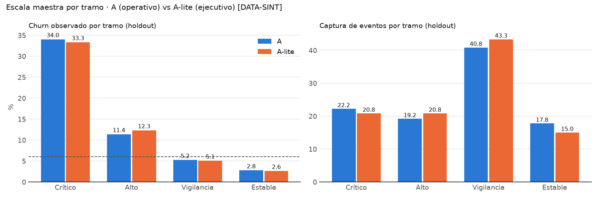

Overrides [DATA-SINT] (decididos en desarrollo con capacidad; precisión en holdout; iguales para A y A-lite):

| Regla | Precisión dev % | Precisión incremental dev % | Precisión holdout % | Tramo |
|:--|--:|--:|--:|:--|
| Pensión detenida (D9.1) | 29.0 | 36.1 | 37.5 | Crítico |
| Transferencias a competidores ≥ 10% del saldo | 30.3 | 30.8 | 27.7 | Alto (aportaría > 30% del Crítico) |
| ≥ 2 destinos externos nuevos (90d) | 21.8 | 22.8 | 33.0 | Alto |
| Queja repetida | 20.6 | 20.4 | 24.7 | Alto |
| Cambio de trustee | 19.5 | 17.5 | 24.5 | Alto |
| Insatisfacción confirmada (Assistant) | 15.9 | 13.1 | 19.2 | Alto |
| Cambio de banquero (6m) | 17.4 | 12.9 | 15.6 | fuera (> 30% del Alto) |
| Queja escalada | 17.3 | 11.3 | 15.9 | fuera (> 30% del Alto) |

Precisión incremental = tasa de churn de los hogares con la regla que el modelo, sin override, no pondría en ese tramo.

Lectura:
- **Crítico funciona**: 3.9% de los hogares, 34% de churn observado (5.6× la base) y 22% de los eventos y del valor
  perdido. El esperado (39.6%) supera al observado → el paso 14 revisa la calibración de la cola.
- **Alto con capacidad** (D12.6): 10% de la cartera (2,000 hogares) con 11.4% de churn; entre Crítico y Alto se cubre
  el 41% de los eventos y del valor perdido con el 14% de los hogares.
- **Estable**: 39% de los hogares con 2.8% de churn. Lift Crítico/Estable 12.3×.
- **Saltos en holdout**: 2.99× / 2.18× / 1.89×. Solo Vigilancia/Estable queda bajo 2× (en desarrollo 2.82×). Se
  reporta sin reajustar (DM.1).
- **Overrides**: casi la mitad del Alto (282 de 606) entra por override con precisión 19–33%, mayor que el margen del
  modelo (~12.6%). Cambio de banquero y queja escalada salen como override porque llenarían el cupo; su efecto ya
  está en el score.
- **A vs A-lite**: coinciden en el tramo en 87.4% de los hogares y en 81% del Crítico de A (567 de 696).
- Ejemplo de reason codes (Crítico, score 367): "cambió de banquero: sí (−45 pts) · queja repetida: sí (−35 pts) ·
  transferencias externas ≥ 8.0% (−31 pts)".

**QC** · 25 PASS · 2 WARN · 0 FAIL
- Tramos suman 100% de hogares; captura de eventos y de valor suman 100%; churn de cartera = Σ share × tasa
  (6.0362%); score monótono en p; Crítico total (696) ≤ capacidad + 30%; Alto = 10.2% en holdout (capacidad 10%);
  ≥ 30 eventos por tramo en holdout (A mín. 64; A-lite mín. 54); corte factible en desarrollo; 20,000 hogares en el
  archivo (123 excluidos con bandera); `segment` fuera de reason codes; sin outcomes.
- WARN: salto Vigilancia/Estable < 2× en holdout (A 1.89×, A-lite 1.94×).

**Decisiones y alternativas descartadas** · D12.1–D12.6
- Puntos enteros; tramos con OOF y regla de máximo margen (descartada "más Estable"); overrides medidos; `segment`
  fuera de reason codes; etiquetas legibles; Alto con capacidad 10% (descartado Alto sin capacidad).
